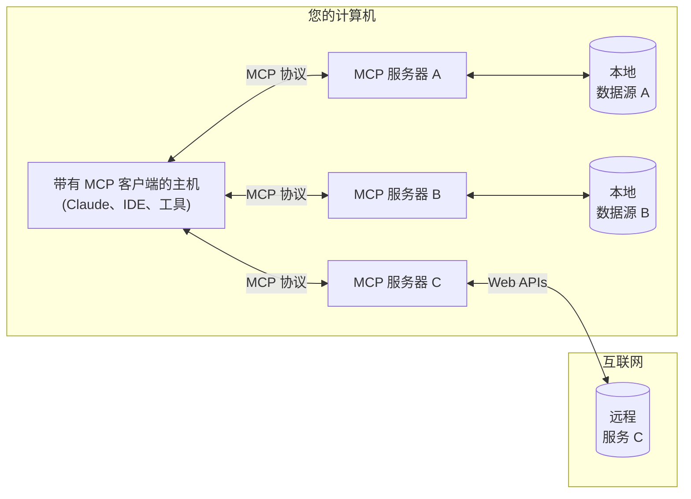
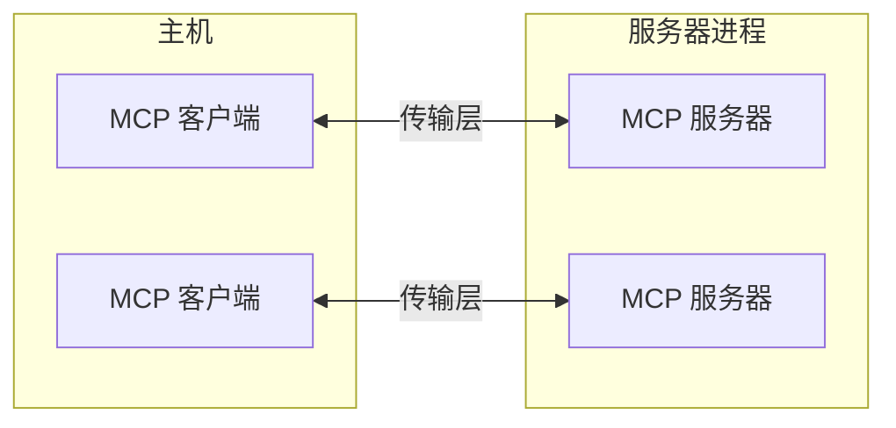
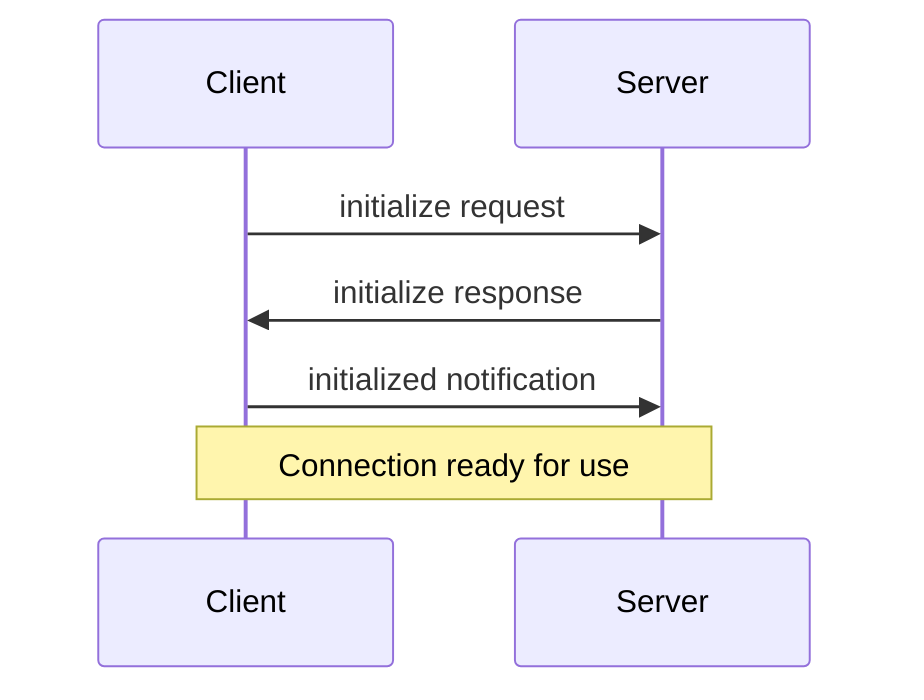

# [Introduction简介](https://modelcontextprotocol.io/introduction)

Model Context Protocol (MCP) 入门

MCP 是一个开放协议，用于标准化应用程序向 LLM 提供上下文的方式。可以将 MCP 视为 AI 应用程序的 USB-C 端口。正如 USB-C 提供了一种将设备连接到各种外围设备和配件的标准化方式一样，MCP 提供了一种将 AI 模型连接到不同数据源和工具的标准化方式。


## 为什么选择 MCP？

MCP 帮助您在 LLM 之上构建代理和复杂的工作流程。LLM 经常需要与数据和工具集成，而 MCP 提供了：
- 越来越多的预构建集成，您的 LLM 可以直接插入
- 在 LLM 提供商和供应商之间切换的灵活性
- 在您的基础设施中保护数据的最佳实践

### 一般架构

MCP 的核心遵循客户端-服务器架构，其中主机应用程序可以连接到多个服务器：




- **MCP 主机**：希望通过 MCP 访问数据的程序，如 Claude Desktop、IDE 或 AI 工具
- **MCP 客户端**：维护与服务器 1:1 连接的协议客户端
- **MCP 服务器**：轻量级程序，每个程序通过标准化的模型上下文协议公开特定的功能
- **本地数据源**：您的计算机的文件、数据库和服务，MCP 服务器可以安全地访问
- **远程服务**：通过互联网（例如，通过 API）可用的外部系统，MCP 服务器可以连接到


# [Core architecture（核心架构）](https://modelcontextprotocol.io/docs/concepts/architecture)

了解 MCP 如何连接客户端、服务器和 LLM

模型上下文协议 (MCP) 构建于灵活、可扩展的架构之上，从而实现 LLM 应用程序和集成之间的无缝通信。本文档涵盖了核心架构组件和概念。

## 概述

MCP 遵循客户端-服务器架构，其中：

- **主机** 是启动连接的 LLM 应用程序（如 Claude Desktop 或 IDE）
- **客户端** 在主机应用程序内与服务器保持 1:1 连接
- **服务器** 向客户端提供上下文、工具和提示




## 核心组件

### 协议层

协议层处理消息成帧、请求/响应链接和高级通信模式。

#### TypeScript

```typescript
class Protocol<Request, Notification, Result> {
    // 处理传入的请求
    setRequestHandler<T>(schema: T, handler: (request: T, extra: RequestHandlerExtra) => Promise<Result>): void

    // 处理传入的通知
    setNotificationHandler<T>(schema: T, handler: (notification: T) => Promise<void>): void

    // 发送请求并等待响应
    request<T>(request: Request, schema: T, options?: RequestOptions): Promise<T>

    // 发送单向通知
    notification(notification: Notification): Promise<void>
```

#### Python

```python
class Session(BaseSession[RequestT, NotificationT, ResultT]):
    async def send_request(
        self,
        request: RequestT,
        result_type: type[Result]
    ) -> Result:
        """
        发送请求并等待响应。如果响应包含错误，则引发 McpError。
        """
        # 请求处理实现

    async def send_notification(
        self,
        notification: NotificationT
    ) -> None:
        """发送不需要响应的单向通知。"""
        # 通知处理实现

    async def _received_request(
        self,
        responder: RequestResponder[ReceiveRequestT, ResultT]
    ) -> None:
        """处理来自另一端的传入请求。"""
        # 请求处理实现

    async def _received_notification(
        self,
        notification: ReceiveNotificationT
    ) -> None:
        """处理来自另一端的传入通知。"""
        # 通知处理实现
```

关键类包括：

* `Protocol`
* `Client`
* `Server`

### 传输层

传输层处理客户端和服务器之间的实际通信。MCP 支持多种传输机制：

1. **Stdio 传输**
   - 使用标准输入/输出进行通信
   - 适用于本地进程

2. **带有 SSE 的 HTTP 传输**
   - 使用服务器发送事件 (Server-Sent Events) 进行服务器到客户端的消息传递
   - 使用 HTTP POST 进行客户端到服务器的消息传递

所有传输都使用 [JSON-RPC](https://www.jsonrpc.org/) 2.0 交换消息。有关模型上下文协议消息格式的详细信息，请参阅[规范](https://spec.modelcontextprotocol.io)。

### 消息类型

MCP 具有以下主要消息类型：

1. **请求** 需要来自另一端的响应：
    ```typescript
    interface Request {
      method: string;
      params?: { ... };
    }
    ```

2. **结果** 是对请求的成功响应：
    ```typescript
    interface Result {
      [key: string]: unknown;
    }
    ```

3. **错误** 表示请求失败：
    ```typescript
    interface Error {
      code: number;
      message: string;
      data?: unknown;
    }
    ```

4. **通知** 是不需要响应的单向消息：
    ```typescript
    interface Notification {
      method: string;
      params?: { ... };
    }
    ```

## 连接生命周期

### 1. 初始化




1. 客户端发送带有协议版本和功能的 `initialize` 请求
2. 服务器响应其协议版本和功能
3. 客户端发送 `initialized` 通知作为确认
4. 开始正常的消息交换

### 2. 消息交换

初始化后，支持以下模式：

- **请求-响应**：客户端或服务器发送请求，另一方响应
- **通知**：任何一方发送单向消息

### 3. 终止

任何一方都可以终止连接：
- 通过 `close()` 清理关闭
- 传输断开
- 错误情况

## 错误处理

MCP 定义了以下标准错误代码：

```typescript
enum ErrorCode {
  // 标准 JSON-RPC 错误代码
  ParseError = -32700,
  InvalidRequest = -32600,
  MethodNotFound = -32601,
  InvalidParams = -32602,
  InternalError = -32603
}
```

SDK 和应用程序可以在 -32000 以上定义自己的错误代码。

错误通过以下方式传播：
- 对请求的错误响应
- 传输上的错误事件
- 协议级别的错误处理程序

## 实现示例

以下是实现 MCP 服务器的基本示例：

### TypeScript

```typescript
import { Server } from "@modelcontextprotocol/sdk/server/index.js";
import { StdioServerTransport } from "@modelcontextprotocol/sdk/server/stdio.js";

const server = new Server({
  name: "example-server",
  version: "1.0.0"
}, {
  capabilities: {
    resources: {}
  }
});

// 处理请求
server.setRequestHandler(ListResourcesRequestSchema, async () => {
  return {
    resources: [
      {
        uri: "example://resource",
        name: "Example Resource"
      }
    ]
  };
});

// 连接传输
const transport = new StdioServerTransport();
await server.connect(transport);
```

### Python

```python
import asyncio
import mcp.types as types
from mcp.server import Server
from mcp.server.stdio import stdio_server

app = Server("example-server")

@app.list_resources()
async def list_resources() -> list[types.Resource]:
    return [
        types.Resource(
            uri="example://resource",
            name="Example Resource"
        )
    ]

async def main():
    async with stdio_server() as streams:
        await app.run(
            streams[0],
            streams[1],
            app.create_initialization_options()
        )

if __name__ == "__main__":
    asyncio.run(main)
```

## 最佳实践

### 传输选择

1. **本地通信**
   - 使用 stdio 传输进行本地进程通信
   - 对于同一机器通信非常有效
   - 简单的进程管理

2. **远程通信**
   - 对于需要 HTTP 兼容性的场景，使用 SSE
   - 考虑包括身份验证和授权在内的安全影响

### 消息处理

1. **请求处理**
   - 彻底验证输入
   - 使用类型安全的模式
   - 优雅地处理错误
   - 实施超时

2. **进度报告**
   - 对长时间运行的操作使用进度令牌
   - 增量报告进度
   - 在已知时包括总进度

3. **错误管理**
   - 使用适当的错误代码
   - 包括有用的错误消息
   - 清理错误时的资源

## 安全注意事项

1. **传输安全**
   - 对远程连接使用 TLS
   - 验证连接来源
   - 在需要时实施身份验证

2. **消息验证**
   - 验证所有传入消息
   - 消毒输入
   - 检查消息大小限制
   - 验证 JSON-RPC 格式

3. **资源保护**
   - 实施访问控制
   - 验证资源路径
   - 监控资源使用情况
   - 限制请求速率

4. **错误处理**
   - 不要泄漏敏感信息
   - 记录与安全相关的错误
   - 实施适当的清理
   - 处理 DoS 场景

## 调试和监控

1. **日志记录**
   - 记录协议事件
   - 跟踪消息流
   - 监控性能
   - 记录错误

2. **诊断**
   - 实施运行状况检查
   - 监控连接状态
   - 跟踪资源使用情况
   - 分析性能

3. **测试**
   - 测试不同的传输
   - 验证错误处理
   - 检查边缘情况
   - 负载测试服务器


# [Resources（资源）](https://modelcontextprotocol.io/docs/concepts/resources)

将来自服务器的数据和内容暴露给 LLM

资源是模型上下文协议 (MCP) 中的一个核心原语，它允许服务器暴露数据和内容，这些数据和内容可以被客户端读取，并用作 LLM 交互的上下文。

**Note**

  资源被设计为**应用程序控制**的，这意味着客户端应用程序可以决定如何以及何时使用它们。
  不同的 MCP 客户端可能会以不同的方式处理资源。例如：
  - Claude Desktop 目前要求用户显式选择资源才能使用它们
  - 其他客户端可能会根据启发式方法自动选择资源
  - 某些实现甚至可能允许 AI 模型本身决定使用哪些资源

  服务器作者应该准备好在实现资源支持时处理任何这些交互模式。为了自动将数据暴露给模型，服务器作者应该使用**模型控制**的原语，例如 [工具](./tools)。

## 概述

资源表示 MCP 服务器想要提供给客户端的任何类型的数据。这可以包括：

- 文件内容
- 数据库记录
- API 响应
- 实时系统数据
- 屏幕截图和图像
- 日志文件
- 还有更多

每个资源都由一个唯一的 URI 标识，并且可以包含文本或二进制数据。

## 资源 URI

资源使用以下格式的 URI 标识：

```
[协议]://[主机]/[路径]
```

例如：
- `file:///home/user/documents/report.pdf`
- `postgres://database/customers/schema`
- `screen://localhost/display1`

协议和路径结构由 MCP 服务器实现定义。服务器可以定义它们自己的自定义 URI 方案。

## 资源类型

资源可以包含两种类型的内容：

### 文本资源

文本资源包含 UTF-8 编码的文本数据。这些适用于：
- 源代码
- 配置文件
- 日志文件
- JSON/XML 数据
- 纯文本

### 二进制资源

二进制资源包含以 base64 编码的原始二进制数据。这些适用于：
- 图像
- PDF
- 音频文件
- 视频文件
- 其他非文本格式

## 资源发现

客户端可以通过两种主要方法发现可用的资源：

### 直接资源

服务器通过 `resources/list` 端点暴露一个具体的资源列表。每个资源包括：

```typescript
{
  uri: string;           // 资源的唯一标识符
  name: string;          // 人类可读的名称
  description?: string;  // 可选的描述
  mimeType?: string;     // 可选的 MIME 类型
}
```

### 资源模板

对于动态资源，服务器可以暴露 [URI 模板](https://datatracker.ietf.org/doc/html/rfc6570)，客户端可以使用这些模板来构造有效的资源 URI：

```typescript
{
  uriTemplate: string;   // 遵循 RFC 6570 的 URI 模板
  name: string;          // 此类型的人类可读名称
  description?: string;  // 所有匹配资源的可选描述
  mimeType?: string;     // 所有匹配资源的可选 MIME 类型
}
```

## 读取资源

要读取资源，客户端使用资源 URI 发出 `resources/read` 请求。

服务器返回一个资源内容列表：

```typescript
{
  contents: [
    {
      uri: string;        // 资源的 URI
      mimeType?: string;  // 可选的 MIME 类型

      // 以下之一：
      text?: string;      // 对于文本资源
      blob?: string;      // 对于二进制资源（base64 编码）
    }
  ]
}
```

**Tip**

  服务器可能会返回多个资源以响应一个 `resources/read` 请求。例如，当读取目录时，这可以用于返回目录中的文件列表。

## 资源更新

MCP 通过两种机制支持资源的实时更新：

### 列表更改

当可用资源列表更改时，服务器可以通过 `notifications/resources/list_changed` 通知客户端。

### 内容更改

客户端可以订阅特定资源的更新：

1. 客户端发送带有资源 URI 的 `resources/subscribe`
2. 当资源更改时，服务器发送 `notifications/resources/updated`
3. 客户端可以使用 `resources/read` 获取最新内容
4. 客户端可以使用 `resources/unsubscribe` 取消订阅

## 示例实现

这是一个在 MCP 服务器中实现资源支持的简单示例：

### TypeScript

```typescript
const server = new Server({
  name: "example-server",
  version: "1.0.0"
}, {
  capabilities: {
    resources: {}
  }
});

// 列出可用的资源
server.setRequestHandler(ListResourcesRequestSchema, async () => {
  return {
    resources: [
      {
        uri: "file:///logs/app.log",
        name: "应用程序日志",
        mimeType: "text/plain"
      }
    ]
  };
});

// 读取资源内容
server.setRequestHandler(ReadResourceRequestSchema, async (request) => {
  const uri = request.params.uri;

  if (uri === "file:///logs/app.log") {
    const logContents = await readLogFile();
    return {
      contents: [
        {
          uri,
          mimeType: "text/plain",
          text: logContents
        }
      ]
    };
  }

  throw new Error("Resource not found");
});
```

### Python

```python
app = Server("example-server")

@app.list_resources()
async def list_resources() -> list[types.Resource]:
    return [
        types.Resource(
            uri="file:///logs/app.log",
            name="应用程序日志",
            mimeType="text/plain"
        )
    ]

@app.read_resource()
async def read_resource(uri: AnyUrl) -> str:
    if str(uri) == "file:///logs/app.log":
        log_contents = await read_log_file()
        return log_contents

    raise ValueError("Resource not found")

# 启动服务器
async with stdio_server() as streams:
    await app.run(
        streams[0],
        streams[1],
        app.create_initialization_options()
    )
```

## 最佳实践

在实现资源支持时：

1. 使用清晰、描述性的资源名称和 URI
2. 包含有用的描述以指导 LLM 理解
3. 在已知时设置适当的 MIME 类型
4. 为动态内容实现资源模板
5. 使用订阅来获取频繁更改的资源
6. 使用清晰的错误消息来优雅地处理错误
7. 考虑对大型资源列表进行分页
8. 在适当的时候缓存资源内容
9. 在处理之前验证 URI
10. 记录您的自定义 URI 方案

## 安全注意事项

在暴露资源时：

- 验证所有资源 URI
- 实施适当的访问控制
- 净化文件路径以防止目录遍历
- 处理二进制数据时要小心
- 考虑对资源读取进行速率限制
- 审计资源访问
- 加密传输中的敏感数据
- 验证 MIME 类型
- 为长时间运行的读取实现超时
- 适当处理资源清理


# [Prompts（提示词）](https://modelcontextprotocol.io/docs/concepts/prompts)

创建可重用的提示词模板和工作流

提示词使服务器能够定义可重用的提示词模板和工作流，客户端可以轻松地将其呈现给用户和 LLM。它们提供了一种强大的方式来标准化和共享常见的 LLM 交互。

**Note**

  提示词被设计为**用户控制**，这意味着它们从服务器暴露给客户端，目的是让用户能够明确地选择它们以供使用。

## 概述

MCP 中的提示词是预定义的模板，可以：
- 接受动态参数
- 包含来自资源的上下文
- 链接多个交互
- 指导特定的工作流
- 作为 UI 元素呈现（如斜杠命令）

## 提示词结构

每个提示词都定义为：

```typescript
{
  name: string;              // 提示词的唯一标识符
  description?: string;      // 人类可读的描述
  arguments?: [              // 可选的参数列表
    {
      name: string;          // 参数标识符
      description?: string;  // 参数描述
      required?: boolean;    // 参数是否是必需的
    }
  ]
}
```

## 发现提示词

客户端可以通过 `prompts/list` 端点发现可用的提示词：

```typescript
// 请求
{
  method: "prompts/list"
}

// 响应
{
  prompts: [
    {
      name: "analyze-code",
      description: "分析代码以获得潜在的改进",
      arguments: [
        {
          name: "language",
          description: "编程语言",
          required: true
        }
      ]
    }
  ]
}
```

## 使用提示词

要使用提示词，客户端发出 `prompts/get` 请求：

```typescript
// 请求
{
  method: "prompts/get",
  params: {
    name: "analyze-code",
    arguments: {
      language: "python"
    }
  }
}

// 响应
{
  description: "分析 Python 代码以获得潜在的改进",
  messages: [
    {
      role: "user",
      content: {
        type: "text",
        text: "请分析以下 Python 代码以获得潜在的改进：\n\n```python\ndef calculate_sum(numbers):\n    total = 0\n    for num in numbers:\n        total = total + num\n    return total\n\nresult = calculate_sum([1, 2, 3, 4, 5])\nprint(result)\n```"
      }
    }
  ]
}
```

## 动态提示词

提示词可以是动态的，包括：

### 嵌入式资源上下文

```json
{
  "name": "analyze-project",
  "description": "分析项目日志和代码",
  "arguments": [
    {
      "name": "timeframe",
      "description": "分析日志的时间段",
      "required": true
    },
    {
      "name": "fileUri",
      "description": "要审查的代码文件的 URI",
      "required": true
    }
  ]
}
```

当处理 `prompts/get` 请求时：

```json
{
  "messages": [
    {
      "role": "user",
      "content": {
        "type": "text",
        "text": "分析这些系统日志和代码文件中的任何问题："
      }
    },
    {
      "role": "user",
      "content": {
        "type": "resource",
        "resource": {
          "uri": "logs://recent?timeframe=1h",
          "text": "[2024-03-14 15:32:11] ERROR: Connection timeout in network.py:127\n[2024-03-14 15:32:15] WARN: Retrying connection (attempt 2/3)\n[2024-03-14 15:32:20] ERROR: Max retries exceeded",
          "mimeType": "text/plain"
        }
      }
    },
    {
      "role": "user",
      "content": {
        "type": "resource",
        "resource": {
          "uri": "file:///path/to/code.py",
          "text": "def connect_to_service(timeout=30):\n    retries = 3\n    for attempt in range(retries):\n        try:\n            return establish_connection(timeout)\n        except TimeoutError:\n            if attempt == retries - 1:\n                raise\n            time.sleep(5)\n\ndef establish_connection(timeout):\n    # Connection implementation\n    pass",
          "mimeType": "text/x-python"
        }
      }
    }
  ]
}
```

### 多步骤工作流

```typescript
const debugWorkflow = {
  name: "debug-error",
  async getMessages(error: string) {
    return [
      {
        role: "user",
        content: {
          type: "text",
          text: `这是我看到的一个错误：${error}`
        }
      },
      {
        role: "assistant",
        content: {
          type: "text",
          text: "我将帮助分析这个错误。到目前为止你尝试了什么？"
        }
      },
      {
        role: "user",
        content: {
          type: "text",
          text: "我尝试重新启动服务，但错误仍然存在。"
        }
      }
    ];
  }
};
```

## 示例实现

这是一个在 MCP 服务器中实现提示词的完整示例：

### TypeScript

```typescript
import { Server } from "@modelcontextprotocol/sdk/server";
import {
  ListPromptsRequestSchema,
  GetPromptRequestSchema
} from "@modelcontextprotocol/sdk/types";

const PROMPTS = {
  "git-commit": {
    name: "git-commit",
    description: "生成 Git 提交消息",
    arguments: [
      {
        name: "changes",
        description: "Git diff 或更改描述",
        required: true
      }
    ]
  },
  "explain-code": {
    name: "explain-code",
    description: "解释代码如何工作",
    arguments: [
      {
        name: "code",
        description: "要解释的代码",
        required: true
      },
      {
        name: "language",
        description: "编程语言",
        required: false
      }
    ]
  }
};

const server = new Server({
  name: "example-prompts-server",
  version: "1.0.0"
}, {
  capabilities: {
    prompts: {}
  }
});

// 列出可用的提示词
server.setRequestHandler(ListPromptsRequestSchema, async () => {
  return {
    prompts: Object.values(PROMPTS)
  };
});

// 获取特定的提示词
server.setRequestHandler(GetPromptRequestSchema, async (request) => {
  const prompt = PROMPTS[request.params.name];
  if (!prompt) {
    throw new Error(`未找到提示词：${request.params.name}`);
  }

  if (request.params.name === "git-commit") {
    return {
      messages: [
        {
          role: "user",
          content: {
            type: "text",
            text: `为这些更改生成简洁但描述性的提交消息：\n\n${request.params.arguments?.changes}`
          }
        }
      ]
    };
  }

  if (request.params.name === "explain-code") {
    const language = request.params.arguments?.language || "Unknown";
    return {
      messages: [
        {
          role: "user",
          content: {
            type: "text",
            text: `解释这段 ${language} 代码是如何工作的：\n\n${request.params.arguments?.code}`
          }
        }
      ]
    };
  }

  throw new Error("未找到提示词实现");
});
```

### Python

```python
from mcp.server import Server
import mcp.types as types

# 定义可用的提示词
PROMPTS = {
    "git-commit": types.Prompt(
        name="git-commit",
        description="生成 Git 提交消息",
        arguments=[
            types.PromptArgument(
                name="changes",
                description="Git diff 或更改描述",
                required=True
            )
        ],
    ),
    "explain-code": types.Prompt(
        name="explain-code",
        description="解释代码如何工作",
        arguments=[
            types.PromptArgument(
                name="code",
                description="要解释的代码",
                required=True
            ),
            types.PromptArgument(
                name="language",
                description="编程语言",
                required=False
            )
        ],
    )
}

# 初始化服务器
app = Server("example-prompts-server")

@app.list_prompts()
async def list_prompts() -> list[types.Prompt]:
    return list(PROMPTS.values())

@app.get_prompt()
async def get_prompt(
    name: str, arguments: dict[str, str] | None = None
) -> types.GetPromptResult:
    if name not in PROMPTS:
        raise ValueError(f"未找到提示词：{name}")

    if name == "git-commit":
        changes = arguments.get("changes") if arguments else ""
        return types.GetPromptResult(
            messages=[
                types.PromptMessage(
                    role="user",
                    content=types.TextContent(
                        type="text",
                        text=f"生成简洁但描述性的提交消息 "
                        f"为了这些更改：\n\n{changes}"
                    )
                )
            ]
        )

    if name == "explain-code":
        code = arguments.get("code") if arguments else ""
        language = arguments.get("language", "Unknown") if arguments else "Unknown"
        return types.GetPromptResult(
            messages=[
                types.PromptMessage(
                    role="user",
                    content=types.TextContent(
                        type="text",
                        text=f"解释这段 {language} 代码是如何工作的：\n\n{code}"
                    )
                )
            ]
        )

    raise ValueError("未找到提示词实现")
```

## 最佳实践

在实现提示词时：

1. 使用清晰、描述性的提示词名称
2. 为提示词和参数提供详细的描述
3. 验证所有必需的参数
4. 优雅地处理缺失的参数
5. 考虑提示词模板的版本控制
6. 适当时缓存动态内容
7. 实施错误处理
8. 记录预期的参数格式
9. 考虑提示词的可组合性
10. 使用各种输入测试提示词

## UI 集成

提示词可以作为以下 UI 元素呈现：

- 斜杠命令
- 快速操作
- 上下文菜单项
- 命令面板条目
- 引导式工作流
- 交互式表单

## 更新和更改

服务器可以通知客户端有关提示词的更改：

1. 服务器功能：`prompts.listChanged`
2. 通知：`notifications/prompts/list_changed`
3. 客户端重新获取提示词列表

## 安全注意事项

在实现提示词时：

- 验证所有参数
- 过滤用户输入
- 考虑速率限制
- 实施访问控制
- 审计提示词使用情况
- 适当处理敏感数据
- 验证生成的内容
- 实施超时
- 考虑提示词注入风险
- 记录安全要求


# [Tools（工具）](https://modelcontextprotocol.io/docs/concepts/tools)

使 LLM 能够通过您的服务器执行操作

工具是模型上下文协议 (MCP) 中一个强大的原语，使服务器能够向客户端公开可执行的功能。通过工具，LLM 可以与外部系统交互、执行计算并在现实世界中执行操作。

**Note**

  工具被设计为**模型控制**，这意味着工具从服务器公开给客户端，目的是 AI 模型能够自动调用它们（在人工参与批准的情况下）。

## 概述

MCP 中的工具允许服务器公开可由客户端调用并由 LLM 用于执行操作的可执行函数。工具的关键方面包括：

- **发现**：客户端可以通过 `tools/list` 端点列出可用的工具
- **调用**：工具使用 `tools/call` 端点调用，服务器执行请求的操作并返回结果
- **灵活性**：工具的范围可以从简单的计算到复杂的 API 交互

与[资源](/docs/concepts/resources)类似，工具由唯一的名称标识，并且可以包含描述以指导其使用。但是，与资源不同，工具表示可以修改状态或与外部系统交互的动态操作。

## 工具定义结构

每个工具都使用以下结构定义：

```typescript
{
  name: string;          // 工具的唯一标识符
  description?: string;  // 人工可读的描述
  inputSchema: {         // 工具参数的 JSON Schema
    type: "object",
    properties: { ... }  // 工具特定的参数
  }
}
```

## 实现工具

这是一个在 MCP 服务器中实现基本工具的示例：

### TypeScript

```typescript
const server = new Server({
  name: "example-server",
  version: "1.0.0"
}, {
  capabilities: {
    tools: {}
  }
});

// 定义可用的工具
server.setRequestHandler(ListToolsRequestSchema, async () => {
  return {
    tools: [{
      name: "calculate_sum",
      description: "将两个数字相加",
      inputSchema: {
        type: "object",
        properties: {
          a: { type: "number" },
          b: { type: "number" }
        },
        required: ["a", "b"]
      }
    }]
  };
});

// 处理工具执行
server.setRequestHandler(CallToolRequestSchema, async (request) => {
  if (request.params.name === "calculate_sum") {
    const { a, b } = request.params.arguments;
    return {
      content: [
        {
          type: "text",
          text: String(a + b)
        }
      ]
    };
  }
  throw new Error("Tool not found");
});
```

### Python

```python
app = Server("example-server")

@app.list_tools()
async def list_tools() -> list[types.Tool]:
    return [
        types.Tool(
            name="calculate_sum",
            description="将两个数字相加",
            inputSchema={
                "type": "object",
                "properties": {
                    "a": {"type": "number"},
                    "b": {"type": "number"}
                },
                "required": ["a", "b"]
            }
        )
    ]

@app.call_tool()
async def call_tool(
    name: str,
    arguments: dict
) -> list[types.TextContent | types.ImageContent | types.EmbeddedResource]:
    if name == "calculate_sum":
        a = arguments["a"]
        b = arguments["b"]
        result = a + b
        return [types.TextContent(type="text", text=str(result))]
    raise ValueError(f"Tool not found: {name}")
```

## 示例工具模式

以下是服务器可以提供的一些工具类型示例：

### 系统操作

与本地系统交互的工具：

```typescript
{
  name: "execute_command",
  description: "运行 shell 命令",
  inputSchema: {
    type: "object",
    properties: {
      command: { type: "string" },
      args: { type: "array", items: { type: "string" } }
    }
  }
}
```

### API 集成

包装外部 API 的工具：

```typescript
{
  name: "github_create_issue",
  description: "创建一个 GitHub issue",
  inputSchema: {
    type: "object",
    properties: {
      title: { type: "string" },
      body: { type: "string" },
      labels: { type: "array", items: { type: "string" } }
    }
  }
}
```

### 数据处理

转换或分析数据的工具：

```typescript
{
  name: "analyze_csv",
  description: "分析 CSV 文件",
  inputSchema: {
    type: "object",
    properties: {
      filepath: { type: "string" },
      operations: {
        type: "array",
        items: {
          enum: ["sum", "average", "count"]
        }
      }
    }
  }
}
```

## 最佳实践

在实现工具时：

1. 提供清晰、描述性的名称和描述
2. 使用详细的 JSON Schema 定义参数
3. 在工具描述中包含示例，以演示模型应如何使用它们
4. 实施适当的错误处理和验证
5. 对长时间运行的操作使用进度报告
6. 保持工具操作的重点和原子性
7. 记录预期的返回值结构
8. 实施适当的超时
9. 考虑对资源密集型操作进行速率限制
10. 记录工具使用情况以进行调试和监控

## 安全注意事项

在公开工具时：

### 输入验证

- 根据 schema 验证所有参数
- 清理文件路径和系统命令
- 验证 URL 和外部标识符
- 检查参数大小和范围
- 防止命令注入

### 访问控制

- 在需要时实施身份验证
- 使用适当的授权检查
- 审计工具使用情况
- 限制请求速率
- 监控滥用

### 错误处理

- 不要向客户端公开内部错误
- 记录与安全相关的错误
- 适当处理超时
- 错误后清理资源
- 验证返回值

## 工具发现和更新

MCP 支持动态工具发现：

1. 客户端可以随时列出可用的工具
2. 当工具更改时，服务器可以使用 `notifications/tools/list_changed` 通知客户端
3. 可以在运行时添加或删除工具
4. 可以更新工具定义（尽管应该小心执行此操作）

## 错误处理

工具错误应在结果对象中报告，而不是作为 MCP 协议级别的错误。这允许 LLM 查看并可能处理该错误。当工具遇到错误时：

1. 在结果中将 `isError` 设置为 `true`
2. 在 `content` 数组中包含错误详细信息

这是一个用于工具的正确错误处理示例：

### TypeScript
```typescript
try {
  // 工具操作
  const result = performOperation();
  return {
    content: [
      {
        type: "text",
        text: `Operation successful: ${result}`
      }
    ]
  };
} catch (error) {
  return {
    isError: true,
    content: [
      {
        type: "text",
        text: `Error: ${error.message}`
      }
    ]
  };
}
```

### Python

```python
try:
    # 工具操作
    result = perform_operation()
    return types.CallToolResult(
        content=[
            types.TextContent(
                type="text",
                text=f"Operation successful: {result}"
            )
        ]
    )
except Exception as error:
    return types.CallToolResult(
        isError=True,
        content=[
            types.TextContent(
                type="text",
                text=f"Error: {str(error)}"
            )
        ]
    )
```

这种方法允许 LLM 看到发生了错误，并可能采取纠正措施或请求人工干预。

## 测试工具

MCP 工具的全面测试策略应包括：

- **功能测试**：验证工具是否使用有效输入正确执行，并适当处理无效输入
- **集成测试**：使用真实和模拟的依赖项测试工具与外部系统的交互
- **安全测试**：验证身份验证、授权、输入清理和速率限制
- **性能测试**：检查负载下的行为、超时处理和资源清理
- **错误处理**：确保工具通过 MCP 协议正确报告错误并清理资源


# [Sampling（采样）](https://modelcontextprotocol.io/docs/concepts/sampling)

让你的服务器从 LLM 请求补全

采样是一个强大的 MCP 功能，允许服务器通过客户端请求 LLM 补全，从而实现复杂的代理行为，同时保持安全性和隐私。

<Info>
  MCP 的此功能在 Claude Desktop 客户端中尚不支持。
</Info>

## 采样如何工作

采样流程遵循以下步骤：

1. 服务器向客户端发送一个 `sampling/createMessage` 请求
2. 客户端审查该请求，并且可以修改它
3. 客户端从 LLM 采样
4. 客户端审查补全结果
5. 客户端将结果返回给服务器

这种人机协作设计确保用户保持对 LLM 所见和所生成内容的控制。

## 消息格式

采样请求使用标准化的消息格式：

```typescript
{
  messages: [
    {
      role: "user" | "assistant",
      content: {
        type: "text" | "image",

        // 对于文本：
        text?: string,

        // 对于图像：
        data?: string,             // base64 编码
        mimeType?: string
      }
    }
  ],
  modelPreferences?: {
    hints?: [{
      name?: string                // 建议的模型名称/系列
    }],
    costPriority?: number,         // 0-1，最小化成本的重要性
    speedPriority?: number,        // 0-1，低延迟的重要性
    intelligencePriority?: number  // 0-1，模型能力的重要性
  },
  systemPrompt?: string,
  includeContext?: "none" | "thisServer" | "allServers",
  temperature?: number,
  maxTokens: number,
  stopSequences?: string[],
  metadata?: Record<string, unknown>
}
```

## 请求参数

### 消息

`messages` 数组包含要发送到 LLM 的对话历史记录。每个消息都有：

- `role`: "user" 或 "assistant"
- `content`: 消息内容，可以是：
  - 带有 `text` 字段的文本内容
  - 带有 `data` (base64) 和 `mimeType` 字段的图像内容

### 模型偏好

`modelPreferences` 对象允许服务器指定其模型选择偏好：

- `hints`: 客户端可用于选择合适模型的模型名称建议数组：
  - `name`: 可以匹配完整或部分模型名称的字符串（例如 "claude-3", "sonnet"）
  - 客户端可以将提示映射到来自不同提供商的等效模型
  - 多个提示按偏好顺序评估

- 优先级值（0-1 归一化）：
  - `costPriority`: 最小化成本的重要性
  - `speedPriority`: 低延迟响应的重要性
  - `intelligencePriority`: 高级模型能力的重要性

客户端根据这些偏好及其可用模型做出最终模型选择。

### 系统提示

可选的 `systemPrompt` 字段允许服务器请求特定的系统提示。客户端可以修改或忽略此提示。

### 上下文包含

`includeContext` 参数指定要包含的 MCP 上下文：

- `"none"`: 没有额外的上下文
- `"thisServer"`: 包含来自请求服务器的上下文
- `"allServers"`: 包含来自所有连接的 MCP 服务器的上下文

客户端控制实际包含的上下文。

### 采样参数

使用以下参数微调 LLM 采样：

- `temperature`: 控制随机性（0.0 到 1.0）
- `maxTokens`: 要生成的最大 token 数
- `stopSequences`: 停止生成的序列数组
- `metadata`: 其他提供商特定的参数

## 响应格式

客户端返回一个补全结果：

```typescript
{
  model: string,  // 使用的模型的名称
  stopReason?: "endTurn" | "stopSequence" | "maxTokens" | string,
  role: "user" | "assistant",
  content: {
    type: "text" | "image",
    text?: string,
    data?: string,
    mimeType?: string
  }
}
```

## 示例请求

以下是请求客户端采样的示例：
```json
{
  "method": "sampling/createMessage",
  "params": {
    "messages": [
      {
        "role": "user",
        "content": {
          "type": "text",
          "text": "当前目录下有哪些文件？"
        }
      }
    ],
    "systemPrompt": "你是一个有用的文件系统助手。",
    "includeContext": "thisServer",
    "maxTokens": 100
  }
}
```

## 最佳实践

实施采样时：

1. 始终提供清晰、结构良好的提示
2. 适当处理文本和图像内容
3. 设置合理的 token 限制
4. 通过 `includeContext` 包含相关上下文
5. 在使用响应之前验证它们
6. 优雅地处理错误
7. 考虑限制采样请求的速率
8. 记录预期的采样行为
9. 使用各种模型参数进行测试
10. 监控采样成本

## 人工参与控制

采样在设计时考虑了人工监督：

### 对于提示

- 客户端应向用户显示建议的提示
- 用户应该能够修改或拒绝提示
- 系统提示可以被过滤或修改
- 上下文包含由客户端控制

### 对于补全

- 客户端应向用户显示补全结果
- 用户应该能够修改或拒绝补全结果
- 客户端可以过滤或修改补全结果
- 用户控制使用哪个模型

## 安全注意事项

实施采样时：

- 验证所有消息内容
- 过滤敏感信息
- 实施适当的速率限制
- 监控采样使用情况
- 加密传输中的数据
- 处理用户数据隐私
- 审计采样请求
- 控制成本风险
- 实施超时
- 优雅地处理模型错误

## 常见模式

### 代理工作流

采样支持代理模式，例如：

- 读取和分析资源
- 根据上下文做出决策
- 生成结构化数据
- 处理多步骤任务
- 提供交互式帮助

### 上下文管理

上下文的最佳实践：

- 请求最少的必要上下文
- 清晰地构建上下文
- 处理上下文大小限制
- 根据需要更新上下文
- 清理过时的上下文

### 错误处理

强大的错误处理应：

- 捕获采样失败
- 处理超时错误
- 管理速率限制
- 验证响应
- 提供回退行为
- 适当地记录错误

## 局限性

请注意以下限制：

- 采样取决于客户端能力
- 用户控制采样行为
- 上下文大小有限制
- 速率限制可能适用
- 应考虑成本
- 模型可用性各不相同
- 响应时间各不相同
- 并非支持所有内容类型


# [Roots（根）](https://modelcontextprotocol.io/docs/concepts/roots)

理解 MCP 中的根

根是 MCP 中的一个概念，它定义了服务器可以操作的边界。它们为客户端提供了一种告知服务器相关资源及其位置的方式。

## 什么是根？

根是客户端建议服务器应关注的 URI。当客户端连接到服务器时，它会声明服务器应使用的根。虽然主要用于文件系统路径，但根可以是任何有效的 URI，包括 HTTP URL。

例如，根可以是：

```
file:///home/user/projects/myapp
https://api.example.com/v1
```

## 为什么使用根？

根有几个重要的用途：

1. **指导**：它们告知服务器相关资源和位置
2. **清晰**：根清楚地表明哪些资源是工作区的一部分
3. **组织**：多个根允许您同时处理不同的资源

## 根如何工作

当客户端支持根时，它：

1. 在连接期间声明 `roots` 功能
2. 向服务器提供建议的根列表
3. 在根更改时通知服务器（如果支持）

虽然根是信息性的，并非强制性的，但服务器应：

1. 尊重提供的根
2. 使用根 URI 来定位和访问资源
3. 优先处理根边界内的操作

## 常见用例

根通常用于定义：

- 项目目录
- 仓库位置
- API 端点
- 配置位置
- 资源边界

## 最佳实践

使用根时：

1. 仅建议必要的资源
2. 对根使用清晰、描述性的名称
3. 监控根的可访问性
4. 优雅地处理根更改

## 示例

以下是一个典型的 MCP 客户端如何公开根的示例：

```json
{
  "roots": [
    {
      "uri": "file:///home/user/projects/frontend",
      "name": "前端仓库"
    },
    {
      "uri": "https://api.example.com/v1",
      "name": "API 端点"
    }
  ]
}
```

此配置建议服务器关注本地仓库和 API 端点，同时保持它们在逻辑上分离。


# [Transports（传输）](https://modelcontextprotocol.io/docs/concepts/transports)

了解 MCP 的通信机制

模型上下文协议 (MCP) 中的传输为客户端和服务器之间的通信提供了基础。传输处理消息发送和接收的底层机制。

## 消息格式

MCP 使用 [JSON-RPC](https://www.jsonrpc.org/) 2.0 作为其线路格式。传输层负责将 MCP 协议消息转换为 JSON-RPC 格式以进行传输，并将接收到的 JSON-RPC 消息转换回 MCP 协议消息。

- [JSON-RPC 2.0 规范](https://wiki.geekdream.com/Specification/json-rpc_2.0.html)

使用三种类型的 JSON-RPC 消息：

### 请求
```typescript
{
  jsonrpc: "2.0",
  id: number | string,
  method: string,
  params?: object
}
```

### 响应
```typescript
{
  jsonrpc: "2.0",
  id: number | string,
  result?: object,
  error?: {
    code: number,
    message: string,
    data?: unknown
  }
}
```

### 通知
```typescript
{
  jsonrpc: "2.0",
  method: string,
  params?: object
}
```

## 内置传输类型

MCP 包括两种标准传输实现：

### 标准输入/输出 (stdio)

stdio 传输支持通过标准输入和输出流进行通信。这对于本地集成和命令行工具特别有用。

在以下情况下使用 stdio：
- 构建命令行工具
- 实施本地集成
- 需要简单的进程通信
- 使用 shell 脚本

#### TypeScript (服务器)

```typescript
const server = new Server({
  name: "example-server",
  version: "1.0.0"
}, {
  capabilities: {}
});

const transport = new StdioServerTransport();
await server.connect(transport);
```

#### TypeScript (客户端)

```typescript
const client = new Client({
  name: "example-client",
  version: "1.0.0"
}, {
  capabilities: {}
});

const transport = new StdioClientTransport({
  command: "./server",
  args: ["--option", "value"]
});
await client.connect(transport);
```

#### Python (服务器)

```python
app = Server("example-server")

async with stdio_server() as streams:
    await app.run(
        streams[0],
        streams[1],
        app.create_initialization_options()
    )
```

#### Python (客户端)

```python
params = StdioServerParameters(
    command="./server",
    args=["--option", "value"]
)

async with stdio_client(params) as streams:
    async with ClientSession(streams[0], streams[1]) as session:
        await session.initialize()
```

### 服务器发送事件 (SSE)

SSE 传输支持使用 HTTP POST 请求进行服务器到客户端的流式传输，以进行客户端到服务器的通信。

在以下情况下使用 SSE：
- 只需要服务器到客户端的流式传输
- 使用受限网络
- 实施简单的更新

#### TypeScript (服务器)

```typescript
import express from "express";

const app = express();

const server = new Server({
  name: "example-server",
  version: "1.0.0"
}, {
  capabilities: {}
});

let transport: SSEServerTransport | null = null;

app.get("/sse", (req, res) => {
  transport = new SSEServerTransport("/messages", res);
  server.connect(transport);
});

app.post("/messages", (req, res) => {
  if (transport) {
    transport.handlePostMessage(req, res);
  }
});

app.listen(3000);
```

#### TypeScript (客户端)

```typescript
const client = new Client({
  name: "example-client",
  version: "1.0.0"
}, {
  capabilities: {}
});

const transport = new SSEClientTransport(
  new URL("http://localhost:3000/sse")
);
await client.connect(transport);
```

#### Python (服务器)

```python
from mcp.server.sse import SseServerTransport
from starlette.applications import Starlette
from starlette.routing import Route

app = Server("example-server")
sse = SseServerTransport("/messages")

async def handle_sse(scope, receive, send):
    async with sse.connect_sse(scope, receive, send) as streams:
        await app.run(streams[0], streams[1], app.create_initialization_options())

async def handle_messages(scope, receive, send):
    await sse.handle_post_message(scope, receive, send)

starlette_app = Starlette(
    routes=[
        Route("/sse", endpoint=handle_sse),
        Route("/messages", endpoint=handle_messages, methods=["POST"]),
    ]
)
```

#### Python (客户端)

```python
async with sse_client("http://localhost:8000/sse") as streams:
    async with ClientSession(streams[0], streams[1]) as session:
        await session.initialize()
```

## 自定义传输

MCP 使为特定需求实施自定义传输变得容易。任何传输实现只需要符合 Transport 接口：

您可以为以下情况实施自定义传输：
- 自定义网络协议
- 专用通信通道
- 与现有系统集成
- 性能优化

### TypeScript

```typescript
interface Transport {
  // 开始处理消息
  start(): Promise<void>;

  // 发送 JSON-RPC 消息
  send(message: JSONRPCMessage): Promise<void>;

  // 关闭连接
  close(): Promise<void>;

  // 回调
  onclose?: () => void;
  onerror?: (error: Error) => void;
  onmessage?: (message: JSONRPCMessage) => void;
}
```

### Python

请注意，虽然 MCP 服务器通常使用 asyncio 实现，但我们建议使用 `anyio` 实现低级接口（如传输），以获得更广泛的兼容性。

```python
@contextmanager
async def create_transport(
    read_stream: MemoryObjectReceiveStream[JSONRPCMessage | Exception],
    write_stream: MemoryObjectSendStream[JSONRPCMessage]
):
    """
    MCP 的传输接口。

    Args:
        read_stream: 用于读取传入消息的流
        write_stream: 用于写入传出消息的流
    """
    async with anyio.create_task_group() as tg:
        try:
            # 开始处理消息
            tg.start_soon(lambda: process_messages(read_stream))

            # 发送消息
            async with write_stream:
                yield write_stream

        except Exception as exc:
            # 处理错误
            raise exc
        finally:
            # 清理
            tg.cancel_scope.cancel()
            await write_stream.aclose()
            await read_stream.aclose()
```

## 错误处理

传输实现应处理各种错误情况：

1. 连接错误
2. 消息解析错误
3. 协议错误
4. 网络超时
5. 资源清理

错误处理示例：

### TypeScript

```typescript
class ExampleTransport implements Transport {
  async start() {
    try {
      // 连接逻辑
    } catch (error) {
      this.onerror?.(new Error(`Failed to connect: ${error}`));
      throw error;
    }
  }

  async send(message: JSONRPCMessage) {
    try {
      // 发送逻辑
    } catch (error) {
      this.onerror?.(new Error(`Failed to send message: ${error}`));
      throw error;
    }
  }
}
```

### Python

请注意，虽然 MCP 服务器通常使用 asyncio 实现，但我们建议使用 `anyio` 实现低级接口（如传输），以获得更广泛的兼容性。

```python
@contextmanager
async def example_transport(scope: Scope, receive: Receive, send: Send):
    try:
        # 创建用于双向通信的流
        read_stream_writer, read_stream = anyio.create_memory_object_stream(0)
        write_stream, write_stream_reader = anyio.create_memory_object_stream(0)

        async def message_handler():
            try:
                async with read_stream_writer:
                    # 消息处理逻辑
                    pass
            except Exception as exc:
                logger.error(f"Failed to handle message: {exc}")
                raise exc

        async with anyio.create_task_group() as tg:
            tg.start_soon(message_handler)
            try:
                # 生成用于通信的流
                yield read_stream, write_stream
            except Exception as exc:
                logger.error(f"Transport error: {exc}")
                raise exc
            finally:
                tg.cancel_scope.cancel()
                await write_stream.aclose()
                await read_stream.aclose()
    except Exception as exc:
        logger.error(f"Failed to initialize transport: {exc}")
        raise exc
```

## 最佳实践

在实施或使用 MCP 传输时：

1. 正确处理连接生命周期
2. 实施适当的错误处理
3. 在连接关闭时清理资源
4. 使用适当的超时
5. 在发送之前验证消息
6. 记录传输事件以进行调试
7. 在适当的时候实施重新连接逻辑
8. 处理消息队列中的反压
9. 监控连接健康状况
10. 实施适当的安全措施

## 安全注意事项

在实施传输时：

### 身份验证和授权
- 实施适当的身份验证机制
- 验证客户端凭据
- 使用安全令牌处理
- 实施授权检查

### 数据安全
- 使用 TLS 进行网络传输
- 加密敏感数据
- 验证消息完整性
- 实施消息大小限制
- 消毒输入数据

### 网络安全
- 实施速率限制
- 使用适当的超时
- 处理拒绝服务场景
- 监控异常模式
- 实施适当的防火墙规则

## 调试传输

调试传输问题的提示：

1. 启用调试日志记录
2. 监控消息流
3. 检查连接状态
4. 验证消息格式
5. 测试错误场景
6. 使用网络分析工具
7. 实施健康检查
8. 监控资源使用情况
9. 测试边缘情况
10. 使用适当的错误跟踪
