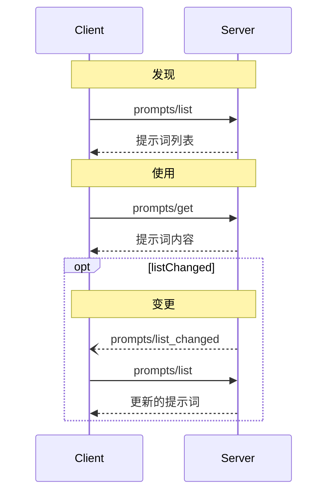
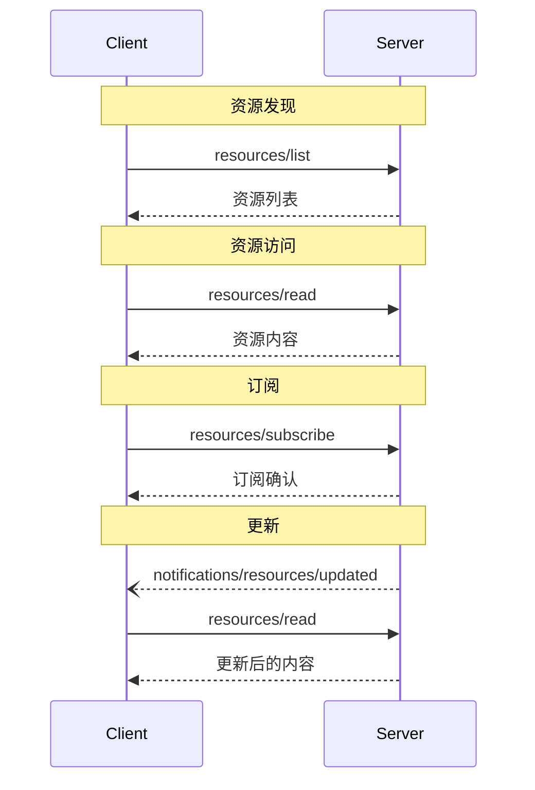
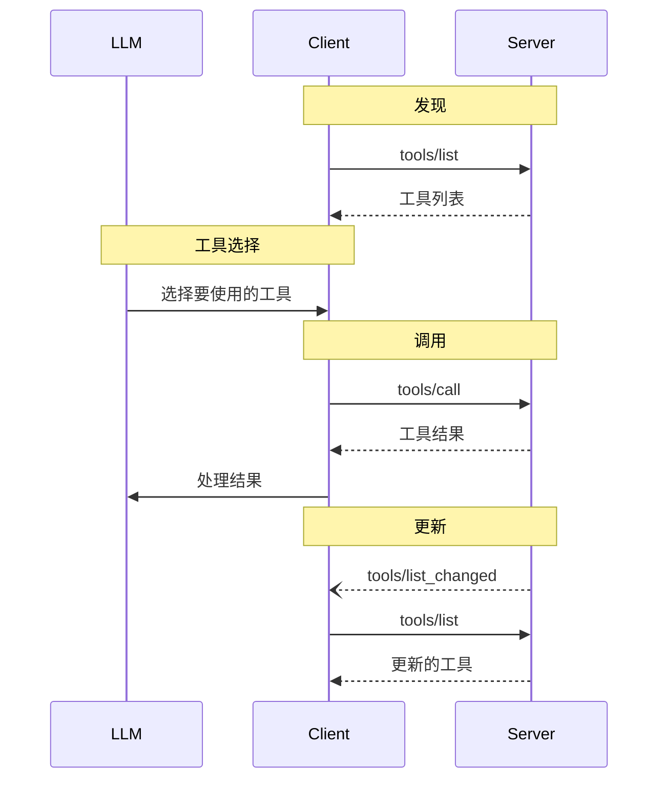

服务器通过MCP提供了为语言模型添加上下文的基本构建块。这些原语支持客户端、服务器和语言模型之间的丰富交互：

- **提示（Prompts）**：预定义的模板或指令，用于指导语言模型交互
- **资源（Resources）**：为模型提供额外上下文的结构化数据或内容
- **工具（Tools）**：可执行函数，允许模型执行操作或检索信息

每个原语可以在以下控制层次结构中概括：

| 原语 | 控制方 | 描述 | 示例 |
| --------- | ---------------------- | -------------------------------------------------- | ------------------------------- |
| 提示 | 用户控制 | 由用户选择调用的交互式模板 | 斜杠命令、菜单选项 |
| 资源 | 应用程序控制 | 由客户端附加和管理的上下文数据 | 文件内容、Git历史 |
| 工具 | 模型控制 | 向LLM公开以执行操作的函数 | API POST请求、文件写入 |


# 提示词

模型上下文协议（MCP）提供了一种标准化方式，使服务器能够向客户端公开提示词模板。提示词允许服务器提供结构化消息和与语言模型交互的指令。客户端可以发现可用的提示词，获取其内容，并提供参数来自定义它们。

## 用户交互模型

提示词设计为**用户控制**的，这意味着它们从服务器暴露给客户端，目的是让用户能够明确选择使用它们。

通常，提示词会通过用户界面中的用户发起命令触发，这允许用户自然地发现和调用可用的提示词。

例如，作为斜杠命令：


然而，实现者可以自由地通过任何适合其需求的界面模式来公开提示词——协议本身不强制要求任何特定的用户交互模型。

## 能力

支持提示词的服务器**必须**在`初始化`期间声明`prompts`能力：

```json
{
  "capabilities": {
    "prompts": {
      "listChanged": true
    }
  }
}
```

`listChanged`表示服务器在可用提示词列表更改时是否会发出通知。

## 协议消息

### 列出提示词

要获取可用的提示词，客户端发送`prompts/list`请求。此操作支持`分页`。

**请求：**

```json
{
  "jsonrpc": "2.0",
  "id": 1,
  "method": "prompts/list",
  "params": {
    "cursor": "optional-cursor-value"
  }
}
```

**响应：**

```json
{
  "jsonrpc": "2.0",
  "id": 1,
  "result": {
    "prompts": [
      {
        "name": "code_review",
        "description": "请求LLM分析代码质量并提出改进建议",
        "arguments": [
          {
            "name": "code",
            "description": "要审查的代码",
            "required": true
          }
        ]
      }
    ],
    "nextCursor": "next-page-cursor"
  }
}
```

### 获取提示词

要获取特定提示词，客户端发送`prompts/get`请求。参数可以通过`补全API`自动完成。

**请求：**

```json
{
  "jsonrpc": "2.0",
  "id": 2,
  "method": "prompts/get",
  "params": {
    "name": "code_review",
    "arguments": {
      "code": "def hello():\n    print('world')"
    }
  }
}
```

**响应：**

```json
{
  "jsonrpc": "2.0",
  "id": 2,
  "result": {
    "description": "代码审查提示",
    "messages": [
      {
        "role": "user",
        "content": {
          "type": "text",
          "text": "请审查这段Python代码：\ndef hello():\n    print('world')"
        }
      }
    ]
  }
}
```

### 列表变更通知

当可用提示词列表发生变化时，声明了`listChanged`能力的服务器**应该**发送通知：

```json
{
  "jsonrpc": "2.0",
  "method": "notifications/prompts/list_changed"
}
```

## 消息流程




## 数据类型

### Prompt

提示词定义包括：

- `name`：提示词的唯一标识符
- `description`：可选的人类可读描述
- `arguments`：可选的自定义参数列表

### PromptMessage

提示词中的消息可以包含：

- `role`：可以是"user"或"assistant"，表示发言者
- `content`：以下内容类型之一：

#### 文本内容

文本内容表示纯文本消息：

```json
{
  "type": "text",
  "text": "消息的文本内容"
}
```

这是用于自然语言交互的最常见内容类型。

#### 图像内容

图像内容允许在消息中包含视觉信息：

```json
{
  "type": "image",
  "data": "base64编码的图像数据",
  "mimeType": "image/png"
}
```

图像数据**必须**是base64编码的，并包含有效的MIME类型。这使得可以进行视觉上下文重要的多模态交互。

#### 音频内容

音频内容允许在消息中包含音频信息：

```json
{
  "type": "audio",
  "data": "base64编码的音频数据",
  "mimeType": "audio/wav"
}
```

音频数据必须是base64编码的，并包含有效的MIME类型。这使得可以进行音频上下文重要的多模态交互。

#### 嵌入资源

嵌入资源允许在消息中直接引用服务器端资源：

```json
{
  "type": "resource",
  "resource": {
    "uri": "resource://example",
    "mimeType": "text/plain",
    "text": "资源内容"
  }
}
```

资源可以包含文本或二进制（blob）数据，并且**必须**包括：

- 有效的资源URI
- 适当的MIME类型
- 文本内容或base64编码的blob数据

嵌入资源使提示词能够无缝地将服务器管理的内容（如文档、代码示例或其他参考材料）直接整合到对话流中。

## 错误处理

服务器**应该**为常见的失败情况返回标准JSON-RPC错误：

- 无效的提示词名称：`-32602`（无效参数）
- 缺少必需参数：`-32602`（无效参数）
- 内部错误：`-32603`（内部错误）

## 实现考虑因素

1. 服务器**应该**在处理前验证提示词参数
2. 客户端**应该**处理大型提示词列表的分页
3. 双方**应该**尊重能力协商

## 安全性

实现**必须**仔细验证所有提示词输入和输出，以防止注入攻击或未授权访问资源。


# 资源

模型上下文协议(MCP)为服务器提供了一种向客户端公开资源的标准化方式。资源允许服务器共享为语言模型提供上下文的数据，例如文件、数据库模式或特定应用程序的信息。每个资源都由一个[URI](https://datatracker.ietf.org/doc/html/rfc3986)唯一标识。

## 用户交互模型

MCP中的资源设计为**应用程序驱动**，由宿主应用程序根据其需求决定如何整合上下文。

例如，应用程序可以：

- 通过UI元素（树形视图或列表视图）显示资源供明确选择
- 允许用户搜索和筛选可用资源
- 基于启发式规则或AI模型的选择实现自动上下文包含


然而，实现可以通过任何适合其需求的界面模式来公开资源——协议本身不强制要求任何特定的用户交互模型。

## 能力

支持资源的服务器**必须**声明`resources`能力：

```json
{
  "capabilities": {
    "resources": {
      "subscribe": true,
      "listChanged": true
    }
  }
}
```

该能力支持两个可选功能：

- `subscribe`：客户端是否可以订阅以获取单个资源变更的通知。
- `listChanged`：服务器在可用资源列表变更时是否会发出通知。

`subscribe`和`listChanged`都是可选的——服务器可以不支持、支持其中之一或两者都支持：

```json
{
  "capabilities": {
    "resources": {} // 两个功能都不支持
  }
}
```

```json
{
  "capabilities": {
    "resources": {
      "subscribe": true // 仅支持订阅
    }
  }
}
```

```json
{
  "capabilities": {
    "resources": {
      "listChanged": true // 仅支持列表变更通知
    }
  }
}
```

## 协议消息

### 列出资源

要发现可用资源，客户端发送`resources/list`请求。此操作支持分页。

**请求：**

```json
{
  "jsonrpc": "2.0",
  "id": 1,
  "method": "resources/list",
  "params": {
    "cursor": "optional-cursor-value"
  }
}
```

**响应：**

```json
{
  "jsonrpc": "2.0",
  "id": 1,
  "result": {
    "resources": [
      {
        "uri": "file:///project/src/main.rs",
        "name": "main.rs",
        "description": "主应用程序入口点",
        "mimeType": "text/x-rust"
      }
    ],
    "nextCursor": "next-page-cursor"
  }
}
```

### 读取资源

要获取资源内容，客户端发送`resources/read`请求：

**请求：**

```json
{
  "jsonrpc": "2.0",
  "id": 2,
  "method": "resources/read",
  "params": {
    "uri": "file:///project/src/main.rs"
  }
}
```

**响应：**

```json
{
  "jsonrpc": "2.0",
  "id": 2,
  "result": {
    "contents": [
      {
        "uri": "file:///project/src/main.rs",
        "mimeType": "text/x-rust",
        "text": "fn main() {\n    println!(\"Hello world!\");\n}"
      }
    ]
  }
}
```

### 资源模板

资源模板允许服务器使用[URI模板](https://datatracker.ietf.org/doc/html/rfc6570)公开参数化资源。参数可以通过补全API自动完成。

**请求：**

```json
{
  "jsonrpc": "2.0",
  "id": 3,
  "method": "resources/templates/list"
}
```

**响应：**

```json
{
  "jsonrpc": "2.0",
  "id": 3,
  "result": {
    "resourceTemplates": [
      {
        "uriTemplate": "file:///{path}",
        "name": "项目文件",
        "description": "访问项目目录中的文件",
        "mimeType": "application/octet-stream"
      }
    ]
  }
}
```

### 列表变更通知

当可用资源列表发生变更时，声明了`listChanged`能力的服务器**应该**发送通知：

```json
{
  "jsonrpc": "2.0",
  "method": "notifications/resources/list_changed"
}
```

### 订阅

协议支持可选的资源变更订阅。客户端可以订阅特定资源并在资源变更时接收通知：

**订阅请求：**

```json
{
  "jsonrpc": "2.0",
  "id": 4,
  "method": "resources/subscribe",
  "params": {
    "uri": "file:///project/src/main.rs"
  }
}
```

**更新通知：**

```json
{
  "jsonrpc": "2.0",
  "method": "notifications/resources/updated",
  "params": {
    "uri": "file:///project/src/main.rs"
  }
}
```

## 消息流




## 数据类型

### 资源

资源定义包括：

- `uri`：资源的唯一标识符
- `name`：人类可读名称
- `description`：可选描述
- `mimeType`：可选MIME类型
- `size`：可选的字节大小

### 资源内容

资源可以包含文本或二进制数据：

#### 文本内容

```json
{
  "uri": "file:///example.txt",
  "mimeType": "text/plain",
  "text": "资源内容"
}
```

#### 二进制内容

```json
{
  "uri": "file:///example.png",
  "mimeType": "image/png",
  "blob": "base64编码数据"
}
```

## 常见URI方案

协议定义了几种标准URI方案。此列表并非详尽无遗——实现始终可以自由使用额外的自定义URI方案。

### https://

用于表示网络上可用的资源。

服务器**应当**仅在客户端能够自行直接从网络获取和加载资源时使用此方案——即，不需要通过MCP服务器读取资源。

对于其他用例，服务器**应当**优先使用另一种URI方案，或定义一个自定义方案，即使服务器本身将通过互联网下载资源内容。

### file://

用于标识行为类似文件系统的资源。但是，资源不需要映射到实际的物理文件系统。

MCP服务器**可以**使用[XDG MIME类型](https://specifications.freedesktop.org/shared-mime-info-spec/0.14/ar01s02.html#id-1.3.14)（如`inode/directory`）来标识file://资源，以表示没有标准MIME类型的非常规文件（如目录）。

### git://

Git版本控制集成。

## 错误处理

服务器**应该**为常见失败情况返回标准JSON-RPC错误：

- 资源未找到：`-32002`
- 内部错误：`-32603`

错误示例：

```json
{
  "jsonrpc": "2.0",
  "id": 5,
  "error": {
    "code": -32002,
    "message": "资源未找到",
    "data": {
      "uri": "file:///nonexistent.txt"
    }
  }
}
```

## 安全考虑

1. 服务器**必须**验证所有资源URI
2. **应该**为敏感资源实现访问控制
3. 二进制数据**必须**正确编码
4. 在操作前**应该**检查资源权限


# 工具

模型上下文协议(MCP)允许服务器暴露可被语言模型调用的工具。工具使模型能够与外部系统交互，例如查询数据库、调用API或执行计算。每个工具都由唯一的名称标识，并包含描述其模式的元数据。

## 用户交互模型

MCP中的工具设计为**模型控制**的，这意味着语言模型可以根据其上下文理解和用户的提示自动发现和调用工具。

然而，实现可以通过任何适合其需求的接口模式来暴露工具——协议本身不强制规定任何特定的用户交互模型。

出于信任和安全考虑，**应该**始终有人类参与循环中，能够拒绝工具调用。

应用程序**应该**：

- 提供清晰显示哪些工具被暴露给AI模型的UI
- 在工具被调用时插入清晰的视觉指示器
- 向用户呈现操作确认提示，以确保有人类参与循环

## 能力

支持工具的服务器**必须**声明`tools`能力：

```json
{
  "capabilities": {
    "tools": {
      "listChanged": true
    }
  }
}
```

`listChanged`表示服务器是否会在可用工具列表更改时发出通知。

## 协议消息

### 列出工具

为了发现可用的工具，客户端发送`tools/list`请求。此操作支持分页。

**请求：**

```json
{
  "jsonrpc": "2.0",
  "id": 1,
  "method": "tools/list",
  "params": {
    "cursor": "optional-cursor-value"
  }
}
```

**响应：**

```json
{
  "jsonrpc": "2.0",
  "id": 1,
  "result": {
    "tools": [
      {
        "name": "get_weather",
        "description": "获取某位置的当前天气信息",
        "inputSchema": {
          "type": "object",
          "properties": {
            "location": {
              "type": "string",
              "description": "城市名称或邮政编码"
            }
          },
          "required": ["location"]
        }
      }
    ],
    "nextCursor": "next-page-cursor"
  }
}
```

### 调用工具

要调用工具，客户端发送`tools/call`请求：

**请求：**

```json
{
  "jsonrpc": "2.0",
  "id": 2,
  "method": "tools/call",
  "params": {
    "name": "get_weather",
    "arguments": {
      "location": "New York"
    }
  }
}
```

**响应：**

```json
{
  "jsonrpc": "2.0",
  "id": 2,
  "result": {
    "content": [
      {
        "type": "text",
        "text": "纽约当前天气：\n温度：72°F\n状况：局部多云"
      }
    ],
    "isError": false
  }
}
```

### 列表变更通知

当可用工具列表发生变化时，声明了`listChanged`功能的服务器**应该**发送通知：

```json
{
  "jsonrpc": "2.0",
  "method": "notifications/tools/list_changed"
}
```

## 消息流




## 数据类型

### 工具

工具定义包括：

- `name`：工具的唯一标识符
- `description`：功能的人类可读描述
- `inputSchema`：定义预期参数的JSON Schema
- `annotations`：描述工具行为的可选属性

出于信任和安全考虑，除非来自受信任的服务器，否则客户端**必须**将工具注释视为不受信任的。

### 工具结果

工具结果可以包含不同类型的多个内容项：

#### 文本内容

```json
{
  "type": "text",
  "text": "工具结果文本"
}
```

#### 图像内容

```json
{
  "type": "image",
  "data": "base64编码的数据",
  "mimeType": "image/png"
}
```

#### 音频内容

```json
{
  "type": "audio",
  "data": "base64编码的音频数据",
  "mimeType": "audio/wav"
}
```

#### 嵌入资源

资源**可以**被嵌入，以提供额外的上下文或数据，通过URI客户端稍后可以订阅或再次获取：

```json
{
  "type": "resource",
  "resource": {
    "uri": "resource://example",
    "mimeType": "text/plain",
    "text": "资源内容"
  }
}
```

## 错误处理

工具使用两种错误报告机制：

1. **协议错误**：标准JSON-RPC错误，用于如下问题：

   - 未知工具
   - 无效参数
   - 服务器错误

2. **工具执行错误**：在工具结果中报告，带有`isError: true`：
   - API失败
   - 无效输入数据
   - 业务逻辑错误

协议错误示例：

```json
{
  "jsonrpc": "2.0",
  "id": 3,
  "error": {
    "code": -32602,
    "message": "未知工具：invalid_tool_name"
  }
}
```

工具执行错误示例：

```json
{
  "jsonrpc": "2.0",
  "id": 4,
  "result": {
    "content": [
      {
        "type": "text",
        "text": "获取天气数据失败：API速率限制已超出"
      }
    ],
    "isError": true
  }
}
```

## 安全考虑

1. 服务器**必须**：

   - 验证所有工具输入
   - 实施适当的访问控制
   - 限制工具调用频率
   - 净化工具输出

2. 客户端**应该**：
   - 对敏感操作提示用户确认
   - 在调用服务器之前向用户显示工具输入，以避免恶意或意外的数据泄露
   - 在传递给LLM之前验证工具结果
   - 为工具调用实施超时
   - 记录工具使用情况以便审计


## 参考资料
- [Prompts](https://spec.modelcontextprotocol.io/specification/2025-03-26/server/prompts/)
- [Resources](https://spec.modelcontextprotocol.io/specification/2025-03-26/server/resources/)
- [Tools](https://spec.modelcontextprotocol.io/specification/2025-03-26/server/tools/)
