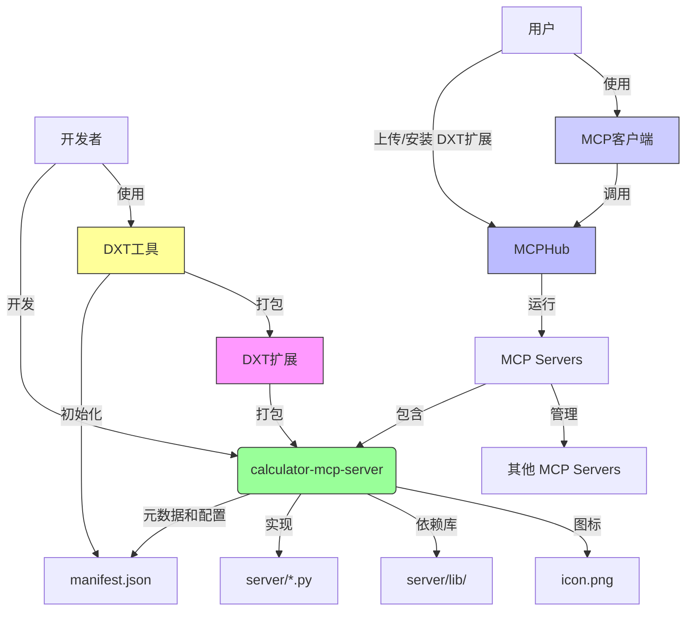

本文档主要介绍了 **DXT (桌面扩展)** 的开发指南，它是一种将 **MCP 服务器** 转换为可分发扩展的工具。文档详述了如何使用 **DXT 工具**来 **初始化、验证和打包** 扩展，并提供了 **目录结构示例**。此外，还强调了在打包 **Python 依赖项**时需要注意的 **跨平台兼容性问题**，特别是在不同架构（如 arm64 macOS 与 x86_64 Linux）之间。最终目标是创建一个 **`.dxt` 文件**，其中包含所有必需的服务器文件和元数据，以便于分发和管理。

<!--more-->




DXT 的核心是包含您的整个 MCP 服务器和 `manifest.json` 的简单 zip 文件。因此，将本地 MCP 服务器转换为扩展非常直接：您只需将所有必需文件放入一个文件夹，创建一个 `manifest.json`，然后创建一个压缩包。

## DXT 工具

用于构建桌面扩展（Desktop Extensions）的工具。

### 安装

```bash
npm install -g @anthropic-ai/dxt
```

### 检查版本

```bash
dxt --version
```
```bash
0.2.0
```

### dxt 命令

- `init [选项] [目录]`：创建一个新的 DXT 扩展清单
- `validate <清单文件>`：验证 DXT 清单文件
- `pack [目录] [输出文件]`：将目录打包成 DXT 扩展
- `unpack <dxt文件> [输出目录]`：解压 DXT 扩展文件
- `sign [选项] <dxt文件>`：签署 DXT 扩展文件
- `verify <dxt文件>`：验证 DXT 扩展文件的签名
- `info <dxt文件>`：显示 DXT 扩展文件的信息
- `unsign <dxt文件>`：从 DXT 扩展文件中移除签名
- `help [命令]`：显示指定命令的帮助信息


## 目录结构

### 示例：Python 扩展

```
extension.dxt (ZIP 文件)
├── manifest.json         # 必需：扩展元数据和配置
├── server/               # 服务器文件
│   ├── main.py           # 主入口点
│   └── utils.py          # 其他模块
├── lib/                  # 打包的 Python 包
├── requirements.txt      # 可选：Python 依赖项列表
└── icon.png              # 可选：扩展图标
```

### 打包依赖项

-   将所有必需的包打包在 `server/lib/` 目录中
-   或者将完整的虚拟环境打包在 `server/venv/` 中
-   使用 `pip-tools`、`poetry` 或 `pipenv` 等工具创建可复现的包
-   通过 `mcp_config.env` 设置 `PYTHONPATH` 以包含打包的包


## 克隆 [calculator-mcp-server](https://github.com/wang-junjian/calculator-mcp-server)
```bash
git clone https://github.com/wang-junjian/calculator-mcp-server
```

## 创建 manifest.json

在包含您的本地 MCP 服务器的文件夹中，运行 `dxt init`。此命令将指导您创建 `manifest.json`。

```bash
dxt init
```

```bash
This utility will help you create a manifest.json file for your DXT extension.
Press ^C at any time to quit.

✔ Extension name: Calculator
✔ Author name: Wang Junjian
✔ Display name (optional): Calculator MCP Server
✔ Version: 0.1.1
✔ Description: An MCP extension that provides a calculator supporting addition, subtraction, multiplication, and division.
✔ Add a detailed long description? no
✔ Author email (optional): wang-junjian@qq.com
✔ Author URL (optional): http://www.wangjunjian.com
✔ Homepage URL (optional): 
✔ Documentation URL (optional): 
✔ Support URL (optional): 
✔ Icon file path (optional, relative to manifest): icon.png
✔ Add screenshots? no
✔ Server type: Python
✔ Entry point: server/main.py
✔ Does your MCP Server provide tools you want to advertise (optional)? yes
✔ Tool name: add
✔ Tool description (optional): Adds two numbers (int or float).
✔ Add another tool? no
✔ Does your server generate additional tools at runtime? no
✔ Does your MCP Server provide prompts you want to advertise (optional)? no
✔ Add compatibility constraints? no
✔ Add user-configurable options? no
✔ Keywords (comma-separated, optional): calculator
✔ License: MIT
✔ Add repository information? no

Created manifest.json at /Users/junjian/GitHub/wang-junjian/calculator-mcp-server/manifest.json

Next steps:
1. Ensure all your production dependencies are in this directory
2. Run 'dxt pack' to create your .dxt file
```

manifest.json 的内容如下：

```json
{
  "dxt_version": "0.2",
  "name": "Calculator",
  "display_name": "Calculator MCP Server",
  "version": "0.1.1",
  "description": "An MCP extension that provides a calculator supporting addition, subtraction, multiplication, and division.",
  "author": {
    "name": "Wang Junjian",
    "email": "wang-junjian@qq.com",
    "url": "http://www.wangjunjian.com"
  },
  "icon": "icon.png",
  "server": {
    "type": "python",
    "entry_point": "server/main.py",
    "mcp_config": {
      "command": "python",
      "args": [
        "${__dirname}/server/main.py"
      ],
      "env": {
        "PYTHONPATH": "${__dirname}/server/lib"
      }
    }
  },
  "tools": [
    {
      "name": "add",
      "description": "Adds two numbers (int or float)."
    }
  ],
  "keywords": [
    "calculator"
  ],
  "license": "MIT"
}
```

**"PYTHONPATH": "${__dirname}/server/lib"**
- 使用 `PYTHONPATH` 可能让 Python 忽略系统中已安装的第三方包，只在 `server/lib` 目录中查找，导致找不到本应在系统 `site-packages` 里的包。


## 安装依赖包

```bash
pip install -r requirements.txt --target server/lib --upgrade --force-reinstall
```
- **`--target server/lib`**:
    * `--target`: 这个选项告诉 `pip` 将包安装到指定的目录，而不是默认的 Python 环境的 `site-packages` 目录。
    * `server/lib`: 这是指定的安装目标目录。这意味着项目所有相关依赖都将被安装到项目根目录下的 `server/lib` 文件夹中。**这种做法常用于创建独立的、可移植的应用程序包，避免与系统级的 Python 环境冲突。**
- **`--upgrade`**:
    * 这个选项指示 `pip` 如果目标包已经安装，则将其升级到最新版本。
- **`--force-reinstall`**:
    * 这个选项强制 `pip` 重新安装所有指定的包，即使它们已经存在且版本满足要求。这在解决依赖冲突、确保所有文件都正确安装或在开发过程中需要清除旧版本时非常有用。

我们正在使用 [mcphub](https://github.com/samanhappy/mcphub) 对 MCP 服务器进行聚合来统一管理。

这块需要注意的是，平台兼容性问题。
- 我在 macOS 上构建的 dxt 包，里面的 Python 依赖如果包含 C/C++ 扩展（如 .so 文件），这些二进制文件只能在 macOS 上运行，不能在 Linux（如 mcphub 容器）上运行。
- 只有纯 Python 包（wheel 文件名带 none-any）才可以跨平台。

我的 `Macbook Pro M2 Max` 是 `arm64` 架构 `macOS` 系统，而 `samanhappy/mcphub` 镜像是 `x86_64` 架构 `Linux` 系统。所以需要使用这下面的 Docker 命令才是最佳方法：

```bash
docker run --rm -v $PWD:/app -w /app samanhappy/mcphub bash -c \
  "pip install -r requirements.txt --target server/lib --upgrade --force-reinstall"
```

之前使用 `python:3.10.9-slim` 镜像，问题是这样打包的是 `arm64` 架构的 `Linux` 系统软件包，安装到  `samanhappy/mcphub` 镜像是 `x86_64` 架构 `Linux` 系统就会出错。

```bash
docker run --rm -v $PWD:/app -w /app python:3.10.9-slim bash -c \
  "pip install -r requirements.txt --target server/lib --upgrade --force-reinstall"
```


## 打包为 DXT 文件

```bash
dxt pack
```

```bash
Validating manifest...
Manifest is valid!

📦  Calculator@0.1.1
Archive Contents
   1.2kB __pycache__/client.cpython-310.pyc
   1.3kB __pycache__/main.cpython-310.pyc
      5B .python-version
   3.7kB .venv/bin/activate
   2.3kB .venv/bin/activate_this.py
   2.7kB .venv/bin/activate.bat
   2.6kB .venv/bin/activate.csh
   4.2kB .venv/bin/activate.fish
   3.8kB .venv/bin/activate.nu
   2.7kB .venv/bin/activate.ps1
   1.7kB .venv/bin/deactivate.bat
    353B .venv/bin/dotenv
    349B .venv/bin/fastmcp
    345B .venv/bin/httpx
    361B .venv/bin/markdown-it
    345B .venv/bin/mcp
   1.2kB .venv/bin/pydoc.bat
    356B .venv/bin/pygmentize
    366B .venv/bin/pyproject-build
   3.7MB .venv/bin/python
   3.7MB .venv/bin/python3
   3.7MB .venv/bin/python3.10
    349B .venv/bin/typer
    352B .venv/bin/uvicorn
     43B .venv/CACHEDIR.TAG
    153B .venv/pyvenv.cfg
      1B calculator_mcp_server.egg-info/dependency_links.txt
     52B calculator_mcp_server.egg-info/entry_points.txt
    677B calculator_mcp_server.egg-info/PKG-INFO
     53B calculator_mcp_server.egg-info/requires.txt
    304B calculator_mcp_server.egg-info/SOURCES.txt
      5B calculator_mcp_server.egg-info/top_level.txt
   2.1kB dist/calculator_mcp_server-0.1.0-py3-none-any.whl
   1.8kB dist/calculator_mcp_server-0.1.0.tar.gz
   2.1kB dist/calculator_mcp_server-0.1.1-py3-none-any.whl
   1.8kB dist/calculator_mcp_server-0.1.1.tar.gz
   7.6kB icon.png
    811B main.py
    792B manifest.json
    867B pyproject.toml
      0B README.md
 112.7kB uv.lock
  43.9MB .venv/lib/python3.10/ [and 2395 more files]

Archive Details
name: Calculator
version: 0.1.1
filename: calculator-0.1.1.dxt
package size: 19.4MB
unpacked size: 55.1MB
shasum: 72ab7735ef9bb745eb2d8833013d57f9c3be6160
total files: 2437
ignored (.dxtignore) files: 3

Output: /Users/junjian/GitHub/wang-junjian/calculator-mcp-server/calculator-mcp-server.dxt
```


## MCPHub 安装 DXT

### 部署 MCPHub
```bash
docker run -p 3000:3000 samanhappy/mcphub
```

### 上传 DXT


### 安装 DXT


## MCPHub 启动 MCP 服务器出现错误

在 MCPHub 中启动 MCP 服务器时，会遇到如下错误：

```bash
Failed to connect: McpError: MCP error -32000: Connection closed
  at Client._onclose (file:///app/node_modules/.pnpm/@modelcontextprotocol+sdk@1.12.1/node_modules/@modelcontextprotocol/sdk/dist/esm/shared/protocol.js:97:23)
  at _transport.onclose (file:///app/node_modules/.pnpm/@modelcontextprotocol+sdk@1.12.1/node_modules/@modelcontextprotocol/sdk/dist/esm/shared/protocol.js:69:18)
  at ChildProcess.<anonymous> (file:///app/node_modules/.pnpm/@modelcontextprotocol+sdk@1.12.1/node_modules/@modelcontextprotocol/sdk/dist/esm/client/stdio.js:90:77)
  at ChildProcess.emit (node:events:518:28)
  at maybeClose (node:internal/child_process:1101:16)
  at ChildProcess._handle.onexit (node:internal/child_process:304:5) 
```

该错误通常无法直接定位具体原因，但很可能是 MCP 服务器未能正确启动。原因是 Python 依赖项的二进制兼容性问题，尤其是在不同平台（如 macOS 和 Linux）之间。

为避免此类问题，建议在 MCPHub 容器（即目标运行环境）中构建 DXT 扩展，并确保正确设置 `PYTHONPATH` 环境变量。这样可以保证所有依赖项与容器架构兼容。

可以通过以下命令将容器内构建好的 dxt 文件拷贝到主机：

```bash
docker cp mcphub:/app/data/uploads/dxt/dxt/examples/file-manager-python/file-manager-python.dxt .
```

然后解包 dxt 文件：

```bash
dxt unpack file-manager-python.dxt file-manager-python
```

对比主机和容器中构建的 dxt 文件内容，例如 `pydantic_core` 依赖：

```
├── pydantic_core (主机构建)
│   ├── _pydantic_core.cpython-310-darwin.so
└── pydantic_core (mcphub 容器构建)
  ├── _pydantic_core.cpython-313-x86_64-linux-gnu.so
```

可以看到，主机（macOS, arm64）构建的 dxt 文件包含 `arm64` 架构的二进制文件，而 MCPHub 容器（Linux, x86_64）构建的 dxt 文件则包含 `x86_64` 架构的二进制文件。只有在目标平台上构建，才能确保依赖项的二进制兼容性，从而避免服务器启动失败的问题。


通过以下命令在 MCPHub 容器中安装 Python 依赖项。

```bash
docker run --rm -v $PWD:/app -w /app samanhappy/mcphub bash -c \
  "pip install -r requirements.txt --target server/lib --upgrade --force-reinstall"
```

最后，在主机打包 DXT 扩展并上传到 MCPHub（容器），成功运行 MCP 服务器。

```bash
dxt pack
```


## 参考资料
- [Desktop Extensions (DXT)](https://github.com/anthropics/dxt)
- [DXT Examples](https://github.com/anthropics/dxt/tree/main/examples)
