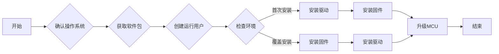

<!--more-->

我们的服务器是 Atlas 800I A2，CPU是 鲲鹏 920（5250），NPU 是昇腾 910B4（8X32G）。

## Atlas 800I A2 介绍

**Atlas 800I A2 推理服务器**是基于**鲲鹏920**+**昇腾910** AI处理器的AI推理设备。


| 1 | 铜排模块 | 2 | NPU模组 |
|---|---|---|---|
| 3 | 硬盘背板 | 4 | 加强横梁 |
| 5 | NPU载板 | 6 | 参数面板接口卡 |
| 7 | 机箱 | 8 | CPU主板导风罩 |
| 9 | 硬盘 | 10 | 风扇模块 |
| 11 | CPU散热器 | 12 | DIMM |
| 13 | 灵活IO卡 (选配) | 14 | CPU主板 |
| 15 | 电源框 | 16 | 电源模块 |
| 17 | Riser模组2 | 18 | Riser模组1 |


## 安装流程




- **首次安装场景**：硬件设备刚出厂时未安装驱动，或者硬件设备前期安装过驱动固件但是当前已卸载，上述场景属于首次安装场景，需按照`“驱动->固件”`的顺序安装驱动固件。
- **覆盖安装场景**：硬件设备前期安装过驱动固件且未卸载，当前要再次安装驱动固件，此场景属于覆盖安装场景，需按照`“固件->驱动”`的顺序安装固件驱动。
- 由于设备出厂时已集成了MCU初始版本，为了保障所有功能正常使用，需将MCU升级到和驱动固件配套的版本。MCU升级操作具体请参见《Atlas A2 中心推理和训练硬件 24.1.0 NPU驱动和固件升级指导书》中“物理机升级>升级MCU”章节。


## [确认操作系统](https://support.huawei.com/enterprise/zh/doc/EDOC1100438838/58f4d9a2)

### 查询服务器支持的操作系统

参考[昇腾计算兼容性查询助手](https://info.support.huawei.com/computing/ftca/zh/product/atlas)。


**备注说明:**
- 87.默认不支持virt-manager管理
- 92.SOC SAS控制器下的SAS/SATA硬盘安装系统时请选择直接安装方式安装,请在操作系统兼容性添加RAID控制卡型号查询RAID控制卡与OS的兼容性
- 125.推荐使用kernel-5.10.0-60.70.0.94.oe2203.aarch64及以上的内核版本
- 127.仅兼容内核版本4.19.90-24.4
- 128.仅兼容内核版本4.19.90-52.22
- 129.仅兼容内核版本4.19.90-2107.6.0.0098.oe1.bclinux.aarch64。
- 134.建议使用最小安装方式安装OS


### 查询服务器的操作系统架构及版本

```bash
uname -m && cat /etc/*release
```

```bash
aarch64
openEuler release 22.03 LTS
NAME="openEuler"
VERSION="22.03 LTS"
ID="openEuler"
VERSION_ID="22.03"
PRETTY_NAME="openEuler 22.03 LTS"
ANSI_COLOR="0;31"

openEuler release 22.03 LTS
```

### 查询 CPU 信息

```bash
lscpu
```

```bash
Architecture:           aarch64
  CPU op-mode(s):       64-bit
  Byte Order:           Little Endian
CPU(s):                 192
  On-line CPU(s) list:  0-191
Vendor ID:              HiSilicon
  BIOS Vendor ID:       HiSilicon
  Model name:           Kunpeng-920
    BIOS Model name:    HUAWEI Kunpeng 920 5250
    Model:              0
    Thread(s) per core: 1
    Core(s) per socket: 48
    Socket(s):          4
    Stepping:           0x1
    Frequency boost:    disabled
    CPU max MHz:        2600.0000
    CPU min MHz:        200.0000
    BogoMIPS:           200.00
    Flags:              fp asimd evtstrm aes pmull sha1 sha2 crc32 atomics fphp asimdhp cpuid asimdrdm jscvt fcma dcpop asimddp asimdfhm ssbs
Caches (sum of all):    
  L1d:                  12 MiB (192 instances)
  L1i:                  12 MiB (192 instances)
  L2:                   96 MiB (192 instances)
  L3:                   192 MiB (8 instances)
NUMA:                   
  NUMA node(s):         8
  NUMA node0 CPU(s):    0-23
  NUMA node1 CPU(s):    24-47
  NUMA node2 CPU(s):    48-71
  NUMA node3 CPU(s):    72-95
  NUMA node4 CPU(s):    96-119
  NUMA node5 CPU(s):    120-143
  NUMA node6 CPU(s):    144-167
  NUMA node7 CPU(s):    168-191
Vulnerabilities:        
  Itlb multihit:        Not affected
  L1tf:                 Not affected
  Mds:                  Not affected
  Meltdown:             Not affected
  Spec store bypass:    Mitigation; Speculative Store Bypass disabled via prctl
  Spectre v1:           Mitigation; __user pointer sanitization
  Spectre v2:           Not affected
  Srbds:                Not affected
  Tsx async abort:      Not affected
```

## [获取软件包](https://support.huawei.com/enterprise/zh/doc/EDOC1100438838/2ff3e934)

到[魔乐社区](https://modelers.cn/)注册账号并登录，[下载](https://modelers.cn/models/xieyuxiang/mindie_2.0.RC1_image/tree/main)相关的安装包。

- [驱动](https://modelers.cn/models/xieyuxiang/mindie_2.0.RC1_image/blob/main/Ascend-hdk-910b-npu-driver_25.0.rc1.1_linux-aarch64.run)
- [固件](https://modelers.cn/models/xieyuxiang/mindie_2.0.RC1_image/blob/main/Ascend-hdk-910b-npu-firmware_7.7.0.1.231.run)
- [MCU](https://modelers.cn/models/xieyuxiang/mindie_2.0.RC1_image/blob/main/Ascend-hdk-910b-mcu_25.50.10.zip)

```bash
ll
```

```bash
total 123M
-rw-r--r--. 1 root root 6.8M Jul 17 10:29 Ascend-hdk-910b-mcu_25.50.10.zip
-rw-r--r--. 1 root root 116M Jul 17 10:28 Ascend-hdk-910b-npu-driver_25.0.rc1.1_linux-aarch64.run
-rw-r--r--. 1 root root 277K Jul 17 10:28 Ascend-hdk-910b-npu-firmware_7.7.0.1.231.run
```

## [创建运行用户](https://support.huawei.com/enterprise/zh/doc/EDOC1100438838/b6fab88e)

**安装用户**为安装驱动和固件所使用的用户，**运行用户**为驱动固件安装完成后，后续运行推理或训练业务时启动运行驱动和固件的用户。

- 如果创建的用户和用户组是HwHiAiUser，安装软件包时无需指定运行用户，默认即为HwHiAiUser。
- 如果创建的用户和用户组是非HwHiAiUser（含root），安装软件包时必须指定运行用户（通过--install-username=username --install-usergroup=usergroup参数指定）。因此如果对运行用户名称没有特殊要求，建议使用HwHiAiUser。

请参见如下方法创建运行用户。

1. 以root用户登录服务器。
2. 执行如下命令，创建运行用户。

```bash
groupadd usergroup
useradd -g usergroup -d /home/username -m username -s /bin/bash
```

示例：
```bash
groupadd HwHiAiUser
useradd -g HwHiAiUser -d /home/HwHiAiUser -m HwHiAiUser -s /bin/bash
```

**我这里直接使用的 `root` 用户。**

## [检查环境](https://support.huawei.com/enterprise/zh/doc/EDOC1100438838/51429589)

### 系统是否安装过软件包

执行 `lsmod | grep drv_pcie_host` 命令查询系统是否安装过软件包。
- 如无内容表示未安装过软件包。可以直接安装软件包。
- 如有内容，表示安装过软件包。需要先卸载驱动包后，再安装新版本软件包。

### 检测芯片是否正常在位

执行 `lspci | grep d802` 命令，如果服务器上有N（N＞0）张NPU芯片，回显中含“d802”字段的行数为N，则表示NPU芯片正常在位。

```bash
01:00.0 Processing accelerators: Huawei Technologies Co., Ltd. Device d802 (rev 20)
02:00.0 Processing accelerators: Huawei Technologies Co., Ltd. Device d802 (rev 20)
41:00.0 Processing accelerators: Huawei Technologies Co., Ltd. Device d802 (rev 20)
42:00.0 Processing accelerators: Huawei Technologies Co., Ltd. Device d802 (rev 20)
81:00.0 Processing accelerators: Huawei Technologies Co., Ltd. Device d802 (rev 20)
82:00.0 Processing accelerators: Huawei Technologies Co., Ltd. Device d802 (rev 20)
c1:00.0 Processing accelerators: Huawei Technologies Co., Ltd. Device d802 (rev 20)
c2:00.0 Processing accelerators: Huawei Technologies Co., Ltd. Device d802 (rev 20)
```

## [安装驱动](https://support.huawei.com/enterprise/zh/doc/EDOC1100438838/36e8d875)

### 增加软件包的可执行权限

```bash
chmod +x Ascend-hdk-910b-npu-driver_25.0.rc1.1_linux-aarch64.run
```

### 校验安装包的一致性和完整性

```bash
./Ascend-hdk-910b-npu-driver_25.0.rc1.1_linux-aarch64.run --check
```
```bash
Makeself logfile: /root/log/makeself/makeself.log
Verifying archive integrity...  100%   SHA256 checksums are OK. All good.
Verifying archive integrity...  100%   SHA256 checksums are OK. All good.
Uncompressing ASCEND DRIVER RUN PACKAGE  100%  
[Driver] [2025-07-17 10:31:56] [INFO]Start time: 2025-07-17 10:31:56
[Driver] [2025-07-17 10:31:56] [INFO]LogFile: /var/log/ascend_seclog/ascend_install.log
[Driver] [2025-07-17 10:31:56] [INFO]OperationLogFile: /var/log/ascend_seclog/operation.log
[Driver] [2025-07-17 10:31:56] [INFO]End time: 2025-07-17 10:31:56
```

### 安装驱动

软件包默认安装路径为 `“/usr/local/Ascend”`。

```bash
./Ascend-hdk-910b-npu-driver_25.0.rc1.1_linux-aarch64.run --full --install-username=root --install-usergroup=root --install-for-all
```
```bash
Verifying archive integrity...  100%   SHA256 checksums are OK. All good.
Uncompressing ASCEND DRIVER RUN PACKAGE  100%  
[Driver] [2025-07-17 10:35:21] [INFO]Start time: 2025-07-17 10:35:21
[Driver] [2025-07-17 10:35:21] [INFO]LogFile: /var/log/ascend_seclog/ascend_install.log
[Driver] [2025-07-17 10:35:21] [INFO]OperationLogFile: /var/log/ascend_seclog/operation.log
[Driver] [2025-07-17 10:35:21] [WARNING]Do not power off or restart the system during the installation/upgrade
[Driver] [2025-07-17 10:35:21] [INFO]set username and usergroup, root:root
[Driver] [2025-07-17 10:35:22] [INFO]driver install type: DKMS
[Driver] [2025-07-17 10:35:22] [INFO]upgradePercentage:10%
[Driver] [2025-07-17 10:35:30] [INFO]upgradePercentage:30%
[Driver] [2025-07-17 10:35:30] [INFO]upgradePercentage:40%
[Driver] [2025-07-17 10:35:44] [INFO]upgradePercentage:90%
[Driver] [2025-07-17 10:35:45] [INFO]Waiting for device startup...
[Driver] [2025-07-17 10:35:49] [INFO]Device startup success
[Driver] [2025-07-17 10:36:06] [INFO]upgradePercentage:100%
[Driver] [2025-07-17 10:36:24] [INFO]Driver package installed successfully! The new version takes effect immediately. 
[Driver] [2025-07-17 10:36:24] [INFO]End time: 2025-07-17 10:36:24
```
**注意**：`root` 用户安装驱动时，需使用`--install-username=root --install-usergroup=root --install-for-all`参数。

### 查看驱动加载是否成功

```bash
npu-smi info
```
```bash
+------------------------------------------------------------------------------------------------+
| npu-smi 25.0.rc1.1               Version: 25.0.rc1.1                                           |
+---------------------------+---------------+----------------------------------------------------+
| NPU   Name                | Health        | Power(W)    Temp(C)           Hugepages-Usage(page)|
| Chip                      | Bus-Id        | AICore(%)   Memory-Usage(MB)  HBM-Usage(MB)        |
+===========================+===============+====================================================+
| 0     910B4               | OK            | 87.2        33                0    / 0             |
| 0                         | 0000:C1:00.0  | 0           0    / 0          2654 / 32768         |
+===========================+===============+====================================================+
| 1     910B4               | OK            | 82.7        33                0    / 0             |
| 0                         | 0000:C2:00.0  | 0           0    / 0          2654 / 32768         |
+===========================+===============+====================================================+
| 2     910B4               | OK            | 82.7        33                0    / 0             |
| 0                         | 0000:81:00.0  | 0           0    / 0          2654 / 32768         |
+===========================+===============+====================================================+
| 3     910B4               | OK            | 89.1        34                0    / 0             |
| 0                         | 0000:82:00.0  | 0           0    / 0          2654 / 32768         |
+===========================+===============+====================================================+
| 4     910B4               | OK            | 84.5        39                0    / 0             |
| 0                         | 0000:01:00.0  | 0           0    / 0          2654 / 32768         |
+===========================+===============+====================================================+
| 5     910B4               | OK            | 84.8        37                0    / 0             |
| 0                         | 0000:02:00.0  | 0           0    / 0          2654 / 32768         |
+===========================+===============+====================================================+
| 6     910B4               | OK            | 87.1        38                0    / 0             |
| 0                         | 0000:41:00.0  | 0           0    / 0          2654 / 32768         |
+===========================+===============+====================================================+
| 7     910B4               | OK            | 81.6        37                0    / 0             |
| 0                         | 0000:42:00.0  | 0           0    / 0          2653 / 32768         |
+===========================+===============+====================================================+
+---------------------------+---------------+----------------------------------------------------+
| NPU     Chip              | Process id    | Process name             | Process memory(MB)      |
+===========================+===============+====================================================+
| No running processes found in NPU 0                                                            |
+===========================+===============+====================================================+
| No running processes found in NPU 1                                                            |
+===========================+===============+====================================================+
| No running processes found in NPU 2                                                            |
+===========================+===============+====================================================+
| No running processes found in NPU 3                                                            |
+===========================+===============+====================================================+
| No running processes found in NPU 4                                                            |
+===========================+===============+====================================================+
| No running processes found in NPU 5                                                            |
+===========================+===============+====================================================+
| No running processes found in NPU 6                                                            |
+===========================+===============+====================================================+
| No running processes found in NPU 7                                                            |
+===========================+===============+====================================================+
```

## [安装固件](https://support.huawei.com/enterprise/zh/doc/EDOC1100438838/f4a62e83)

### 增加软件包的可执行权限

```bash
chmod +x Ascend-hdk-910b-npu-firmware_7.7.0.1.231.run 
```

### 校验安装包的一致性和完整性

```bash
./Ascend-hdk-910b-npu-firmware_7.7.0.1.231.run --check
```
```bash
Makeself logfile: /root/log/makeself/makeself.log
Verifying archive integrity...  100%   SHA256 checksums are OK. All good.
Verifying archive integrity...  100%   SHA256 checksums are OK. All good.
Uncompressing ASCEND-HDK-910B-NPU FIRMWARE RUN PACKAGE  100%  
[Firmware] [2025-07-17 10:42:55] [INFO]Start time: 2025-07-17 10:42:55
[Firmware] [2025-07-17 10:42:55] [INFO]LogFile: /var/log/ascend_seclog/ascend_install.log
[Firmware] [2025-07-17 10:42:55] [INFO]OperationLogFile: /var/log/ascend_seclog/operation.log
[Firmware] [2025-07-17 10:42:56] [INFO]End time: 2025-07-17 10:42:56
```

### 安装固件

```bash
./Ascend-hdk-910b-npu-firmware_7.7.0.1.231.run --full
```
```bash
Verifying archive integrity...  100%   SHA256 checksums are OK. All good.
Uncompressing ASCEND-HDK-910B-NPU FIRMWARE RUN PACKAGE  100%  
[Firmware] [2025-07-17 10:43:18] [INFO]Start time: 2025-07-17 10:43:18
[Firmware] [2025-07-17 10:43:18] [INFO]LogFile: /var/log/ascend_seclog/ascend_install.log
[Firmware] [2025-07-17 10:43:18] [INFO]OperationLogFile: /var/log/ascend_seclog/operation.log
[Firmware] [2025-07-17 10:43:18] [WARNING]Do not power off or restart the system during the installation/upgrade
[Firmware] [2025-07-17 10:43:20] [INFO]upgradePercentage: 0%
[Firmware] [2025-07-17 10:43:32] [INFO]upgradePercentage: 90%
[Firmware] [2025-07-17 10:43:42] [INFO]upgradePercentage: 90%
[Firmware] [2025-07-17 10:43:52] [INFO]upgradePercentage: 90%
[Firmware] [2025-07-17 10:43:53] [INFO]upgradePercentage: 100%
[Firmware] [2025-07-17 10:43:53] [INFO]The firmware of [8] chips are successfully upgraded.
[Firmware] [2025-07-17 10:43:54] [INFO]Firmware package installed successfully! Reboot now or after driver installation for the installation/upgrade to take effect.
[Firmware] [2025-07-17 10:43:54] [INFO]End time: 2025-07-17 10:43:54
```

## [升级MCU](https://support.huawei.com/enterprise/zh/doc/EDOC1100438832/835e90f4)
MCU是带外管理模块，具备单板监测、故障上报等功能。Atlas 900 A2 PoD 集群基础单元、Atlas 800T A2 训练服务器和Atlas 800I A2 推理服务器已集成了初始版本，为了保障所有功能正常使用，请将MCU升级到最新版本。

- 通过 `npu-smi` 工具升级MCU。
> npu-smi工具可以将单个NPU的MCU升级到相应版本，如果配备了多个NPU，需要逐个升级。

### 准备软件包

解压 zip 文件，准备软件包 “Ascend-hdk-xxx-mcu_Y.hpm”，这里是 `Ascend-hdk-910b-mcu_25.50.10.hpm`。

```bash
unzip Ascend-hdk-910b-mcu_25.50.10.zip 
```
```bash
Archive:  Ascend-hdk-910b-mcu_25.50.10.zip
  inflating: Ascend-hdk-910b-mcu_25.50.10.hpm  
  inflating: Ascend-hdk-910b-mcu_25.50.10.hpm.cms  
  inflating: crldata.crl             
  inflating: version.xml             
  inflating: version.xml.cms         
```

### 显示所有设备的映射信息

```bash
npu-smi info -m
```

```bash
        NPU ID                         Chip ID                        Chip Logic ID                  Chip Name                     
        0                              0                              0                              Ascend 910B4
        0                              1                              -                              Mcu                           
        1                              0                              1                              Ascend 910B4
        1                              1                              -                              Mcu                           
        2                              0                              2                              Ascend 910B4
        2                              1                              -                              Mcu                           
        3                              0                              3                              Ascend 910B4
        3                              1                              -                              Mcu                           
        4                              0                              4                              Ascend 910B4
        4                              1                              -                              Mcu                           
        5                              0                              5                              Ascend 910B4
        5                              1                              -                              Mcu                           
        6                              0                              6                              Ascend 910B4
        6                              1                              -                              Mcu                           
        7                              0                              7                              Ascend 910B4
        7                              1                              -                              Mcu                           
```

### 显示所有设备的拓扑信息

```bash
npu-smi info -l
```

```bash
        Total Count                    : 8

        NPU ID                         : 0
        Chip Count                     : 1

        NPU ID                         : 1
        Chip Count                     : 1

        NPU ID                         : 2
        Chip Count                     : 1

        NPU ID                         : 3
        Chip Count                     : 1

        NPU ID                         : 4
        Chip Count                     : 1

        NPU ID                         : 5
        Chip Count                     : 1

        NPU ID                         : 6
        Chip Count                     : 1

        NPU ID                         : 7
        Chip Count                     : 1
```

### 查询MCU版本号

```bash
npu-smi upgrade -b mcu -i 0
```
```bash
        Version                        : 23.3.13
```

### 升级指定NPU的MCU

```bash
npu-smi upgrade -t mcu -i 0 -f Ascend-hdk-910b-mcu_25.50.10.hpm
```
```bash
[WARNING]: Do not power off or restart the system during the upgrade.
        Validity                       : success

file_len(554991)--offset(554991) [100].
        transfile                      : successfully
        Status                         : start to upgrade
Start upgrade [100].
        Status                         : OK
        Message                        : Start device upgrade successfully
        Message                        : need active mcu
```

### 使新版本生效

```bash
npu-smi upgrade -a mcu -i 0
```
```bash
        Status                         : OK
        Message                        : The upgrade has taken effect after performed reboot successfully.
```

### 查询MCU版本号

```bash
npu-smi upgrade -b mcu -i 0
```
```bash
        Version                        : 25.50.10
```

### 定制升级MCU的工具

支持三种调用方式：

1. 指定单个 NPU_ID：  
   `./upgrade_mcu.sh 3`  
   `./upgrade_mcu.sh 5 Ascend-hdk-910b-mcu_25.50.10.hpm`

2. 指定多个 NPU_ID：  
   `./upgrade_mcu.sh 2,4,6`  
   `./upgrade_mcu.sh 1,3 Ascend-hdk-910b-mcu_25.50.10.hpm`

3. 一键升级 0-7 全部：  
   `./upgrade_mcu.sh all`  
   `./upgrade_mcu.sh all Ascend-hdk-910b-mcu_25.50.10.hpm`

保存为 `upgrade_mcu.sh`，`chmod +x upgrade_mcu.sh` 即可。

```bash
#!/bin/bash
# upgrade_mcu.sh <NPU_ID|ID1,ID2,...|all> [Ascend-hdk-xxx-mcu_Y.hpm]

usage() {
    echo "Usage:"
    echo "  Single:  $0 <0-7> [fw.hpm]"
    echo "  Multi:   $0 <id1,id2,...> [fw.hpm]"
    echo "  All:     $0 all [fw.hpm]"
    exit 1
}

#---------- 参数校验 ----------
[[ $# -eq 0 ]] && usage

# 解析 NPU_ID 列表
case "$1" in
    all|ALL)
        NPU_LIST=(0 1 2 3 4 5 6 7)
        ;;
    *)
        # 尝试按逗号分割
        IFS=',' read -ra NPU_LIST <<< "$1"
        for id in "${NPU_LIST[@]}"; do
            [[ "$id" =~ ^[0-7]$ ]] || usage
        done
        ;;
esac

# 固件文件
FW_FILE=${2:-"Ascend-hdk-910b-mcu_25.50.10.hpm"}

#---------- 循环升级 ----------
for NPU_ID in "${NPU_LIST[@]}"; do
    echo "=== MCU upgrade for NPU_ID $NPU_ID ==="
    echo "Firmware: $FW_FILE"

    npu-smi upgrade -b mcu -i "$NPU_ID"
    npu-smi upgrade -t mcu -i "$NPU_ID" -f "$FW_FILE"
    npu-smi upgrade -a mcu -i "$NPU_ID"
    npu-smi upgrade -b mcu -i "$NPU_ID"

    echo "NPU_ID $NPU_ID done."
    echo
done

echo "All requested NPUs upgraded."
```

使用示例  
```bash
# 升级 0 号
./upgrade_mcu.sh 0

# 升级 2、5、7 三块
./upgrade_mcu.sh 2,5,7 Ascend-hdk-910b-mcu_25.50.10.hpm

# 一键升级全部
./upgrade_mcu.sh all Ascend-hdk-910b-mcu_25.50.10.hpm
```
