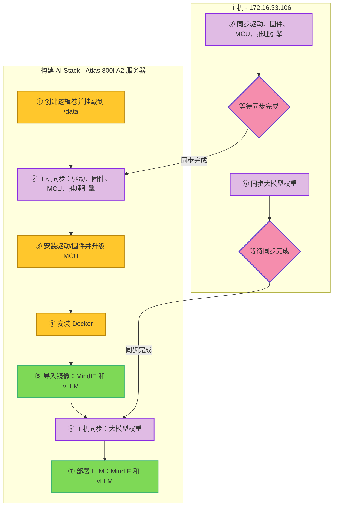

<!--more-->

## 服务器配置

**AI 服务器**：华为 Atlas 800I A2 推理服务器

| 组件 | 规格 |
|---|---|
| **CPU** | 鲲鹏 920（5250） |
| **NPU** | 昇腾 910B4（8X32G） |
| **内存** | 1024GB |
| **硬盘** | **系统盘**：450GB SSDX2 RAID1<br>**数据盘**：3.5TB NVME SSDX4 |
| **操作系统** | openEuler 22.03 LTS |


## 完整安装流程




### ① 创建逻辑卷

```bash
echo "🚗 ① 创建逻辑卷，4个物理卷变为1个逻辑卷，挂载到 /data 目录"
echo "-----------------------------------------------------"

# 创建物理卷（PV）
for d in /dev/nvme{0..3}n1; do
    pvcreate "$d"
done

# 创建卷组（VG）
vgcreate vg_data /dev/nvme0n1 /dev/nvme1n1 /dev/nvme2n1 /dev/nvme3n1

# 创建逻辑卷（LV）
lvcreate -l 100%VG -n lv_data vg_data

# 格式化
mkfs.xfs /dev/vg_data/lv_data

# 临时挂载
mkdir -p /data
mount /dev/vg_data/lv_data /data

# 永久挂载
## 备份
cp /etc/fstab /etc/fstab.bak
## 追加挂载
cat >> /etc/fstab <<'EOF'

/dev/mapper/vg_data-lv_data /data xfs defaults 0 0
EOF

# 创建模型目录
mkdir -p /data/models
ln -s /data/models /models
```

### ② 同步驱动、固件、MCU、镜像

```bash
echo "🚗 ② 同步驱动、固件、MCU、镜像等。到主服务器上运行（172.16.33.106）"
echo "-----------------------------------------------------"
echo "rsync -avz -e "ssh -p 10022" /data/wjj/ root@172.16.33.108:/data/wjj"

read -p "⌛️ 等待同步完按【回车键】继续执行..."
```

```bash
rsync -avz -e "ssh -p 10022" /data/wjj/ root@172.16.33.108:/data/wjj
```

### ③ 安装驱动/固件和升级 MCU

```bash
echo "🚗 ③ 安装驱动/固件和升级 MCU"
echo "-----------------------------------------------------"
cd /data/wjj/npu-software

echo "🦋 安装驱动"
./Ascend-hdk-910b-npu-driver_25.0.rc1.1_linux-aarch64.run --full --install-username=root --install-usergroup=root --install-for-all

echo "🐝 安装固件"
./Ascend-hdk-910b-npu-firmware_7.7.0.1.231.run --full

echo "🐞 升级 MCU"
./upgrade_mcu.sh all Ascend-hdk-910b-mcu_25.50.10.hpm
```

### ④ 安装 Docker
```bash
echo "🚗 ④ 安装 Docker"
echo "-----------------------------------------------------"

echo "🛠️ 添加 Docker 仓库"
dnf config-manager --add-repo https://mirrors.aliyun.com/docker-ce/linux/centos/8/aarch64/stable/

cat > /etc/yum.repos.d/docker-ce.repo <<'EOF'
[docker-ce-stable]
name=Docker CE Stable - aarch64
baseurl=https://mirrors.aliyun.com/docker-ce/linux/centos/8/aarch64/stable
enabled=1
gpgcheck=1
gpgkey=https://mirrors.aliyun.com/docker-ce/linux/centos/gpg
EOF

echo "🔐 导入 GPG 密钥"
rpm --import https://mirrors.aliyun.com/docker-ce/linux/centos/gpg

echo "🐛 安装 Docker"
dnf update -y
dnf install -y docker-ce docker-ce-cli containerd.io

echo "⚙️ 配置 Docker"
cat > /etc/docker/daemon.json <<'EOF'
{
    "registry-mirrors": [
        "https://docker.xuanyuan.me"
    ],
    "data-root": "/data/docker"
}
EOF

echo "▶️ 启动 Docker 服务"
systemctl enable --now docker
```

### ⑤ 导入镜像 MindIE 和 vLLM
```bash
echo "🚗 ⑤ 导入镜像 MindIE 和 vLLM"
echo "-----------------------------------------------------"
cd /data/wjj/npu-software
docker load -i mindie2.tar
docker load -i vllm-ascend-v0.9.2rc1.tar
```

### ⑥ 同步大模型权重文件
```bash
echo "🚗 ⑥ 同步大模型权重文件。到主服务器上运行（172.16.33.106）"
echo "-----------------------------------------------------"
echo "rsync -avz -e "ssh -p 10022" /data/models/ root@172.16.33.108:/data/models"

read -p "⌛️ 等待同步完按【回车键】继续执行..."
```

```bash
rsync -avz -e "ssh -p 10022" /data/models/ root@172.16.33.108:/data/models
```

### ⑦ 部署 LLM
