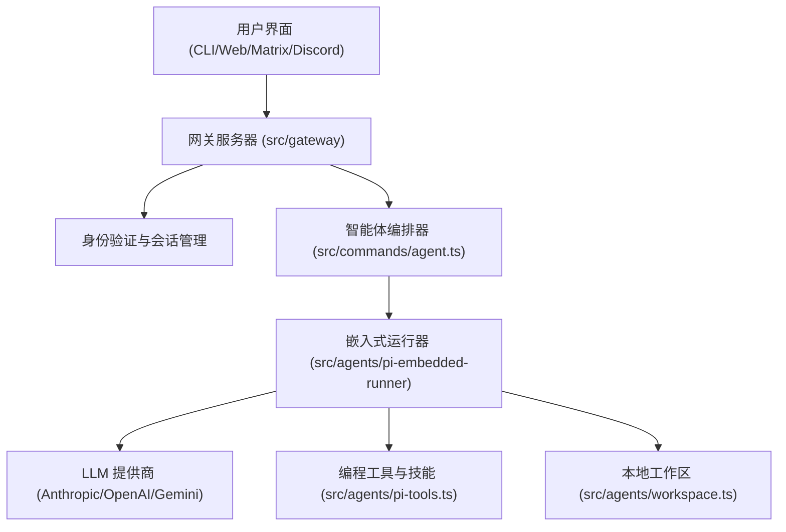

<!--more-->

## OpenClaw 简介

自2025年11月由PSPDFKit创始人Peter Steinberger作为周末项目启动（最初名为Clawd/Clawdbot），OpenClaw（曾短暂更名为Moltbot）在2026年1月迅速走红，成为当年上半年增长最快的开源AI智能体框架之一。该项目GitHub星数已超过13万（部分报道接近15万），其最大亮点在于真正实现了“本地优先、本地执行”的自主任务能力，而非单纯的云端聊天。

OpenClaw不是传统AI聊天助手，而是一个运行在用户本地硬件（Mac、PC、服务器）上的自动化中枢。它通过消息类应用（如WhatsApp、Telegram、iMessage、Discord等）接收自然语言指令，能够执行真实电脑操作：读写文件、运行命令、操作浏览器、管理邮件日历、甚至自主编写新技能。


## OpenClaw 项目架构概览

### 设计哲学
OpenClaw 被设计为一个模块化、可扩展且强健的个人 AI 助手系统。其核心理念包括：
- **解耦 (Decoupling)**：将智能体逻辑与传输层（如 Discord、Telegram 等通道）以及控制平面（Gateway）分离。
- **可扩展性 (Extensibility)**：通过 Hook 和插件系统支持注入上下文或对智能体运行进行后处理。
- **强健性 (Robustness)**：具备自动修复机制，如会话修复、模型降级备份（Fallback）以及自动上下文压缩。

### 系统架构



### 核心组件

#### 1. 入口点与 CLI (`src/entry.ts`, `src/cli/`)
- 使用 "respawn" 模式来抑制 Node.js 的实验性特性警告。
- 通过 `commander` 将命令路由到各个子命令行模块。
- 支持“嵌入式”执行模式，智能体与 CLI 在同一进程中运行。

#### 2. 网关服务器 (`src/gateway/`)
- 作为多客户端和多智能体的核心枢纽。
- 实现了基于 JSON 的自定义协议，通过 WebSocket 或 HTTP 进行通信。
- 管理会话状态、身份验证配置以及智能体的路由。

#### 3. 智能体执行循环 (`src/agents/pi-embedded-runner/`)
- **队列管理**：确保会话内的顺序执行，同时允许跨 Lane 的并发。
- **故障转移逻辑**：自动轮换身份验证配置文件（API Key），应对频率限制或错误。
- **上下文管理**：监控 Token 使用量，并在历史记录过长时触发“压缩 (Compaction)”。
- **LLM 交互**：利用 `@mariozechner/pi-agent-core` 管理基于回合的对话和工具调用。

#### 4. 工具与技能 (`src/agents/pi-tools.ts`, `src/agents/skills.ts`)
- **编程工具**：为智能体提供 `read_file`、`write_file` 和 `bash` 执行等能力。
- **技能 (Skills)**：工作区代码的动态快照，注入到智能体上下文中以指导其行为。
- **沙箱 (Sandboxing)**：支持在沙箱环境中执行，保证安全性。

### 关键逻辑流程

#### 智能体回合执行
1.  **请求接收**：网关接收到 `agent` 请求。
2.  **会话解析**：验证会话密钥并加载对话历史。
3.  **引导与上下文**：收集本地文件（`IDENTITY.md`、`README.md` 等）构建系统提示词。
4.  **LLM 调用**：将提示词、历史记录和工具定义发送给 LLM。
5.  **工具循环**：如果 LLM 请求工具调用，运行器在本地执行并返回结果。
6.  **交付**：LLM 给出最终文本响应后，运行器通过配置的通道（Discord、CLI 等）交付。

### 工作原理

```plaintext
WhatsApp / Telegram / Slack / Discord / Google Chat / Signal / iMessage / BlueBubbles / Microsoft Teams / Matrix / Zalo / Zalo Personal / WebChat
               │
               ▼
┌───────────────────────────────┐
│            网关                │
│         （控制平面）            │
│     ws://127.0.0.1:18789      │
└──────────────┬────────────────┘
               │
               ├─ Pi 智能体（RPC）
               ├─ 命令行工具（openclaw …）
               ├─ 网页聊天界面
               ├─ macOS 应用
               └─ iOS / Android nodes
```


## 智能体工作区（Agent Workspace）

| 文件 | 隐喻 | 作用 |
| --- | --- | --- |
| **AGENTS.md**    | 元准则 | 定义所有智能体必须遵守的技术规范和协作准则 |
| **SOUL.md**      | 灵魂内核 | 定义智能体的性格特征、处理问题的原则、道德边界和沟通风格 |
| **TOOLS.md**     | 环境地图 | 记录物理世界与数字基础设施的映射，如设备别名、SSH 别名和默认参数 |
| **IDENTITY.md**  | 身份档案 | 定义智能体的外在属性，如名字、物种、签名表情和头像 |
| **USER.md**      | 用户画像 | 记录关于用户的偏好、正在进行的项目、重要时间点、厌恶的事物和时区信息 |
| **HEARTBEAT.md** | 心跳调度 | 定义智能体的主动性任务列表，如定期检查服务器日志或总结新闻 |
| **BOOTSTRAP.md** | 觉醒协议 | 定义新工作区的初始化剧本，引导用户设定智能体的名字、性格和连接步骤 |
| **MEMORY.md**    | 核心知识库 | 持久化存储跨会话的重要信息，智能体通过语义搜索从中提取相关片段以回答用户查询 |
| `SKILL.md`     | 专业技能手册 | 定义智能体的专家知识库和工具操作指南，包括环境依赖、安装脚本和任务指引 |

**加粗的 .md 文件**在智能体工作区**按顺序加载**；**MEMORY.md**是**动态检索**的核心知识库；`SKILL.md`则是**按需加载** (Lazy Loading)：系统不会直接注入所有 SKILL.md 的全文，而是只注入一个包含技能名称和简短描述的索引摘要。

### 一、 核心设计原则

1.  **持久化即交互 (Persistence through Interaction)**：
    由于 LLM 本身是无状态的，OpenClaw 通过这些 Markdown 文件将短期会话转化为长期记忆。智能体不仅读取这些文件，还被鼓励在交互过程中**主动更新**它们，从而实现“自我进化”。
2.  **透明性与可编辑性 (Transparency & Editability)**：
    相比于隐藏在数据库中的向量存储，Markdown 文件对人类用户完全透明。用户可以直接编辑 `SOUL.md` 来调整 AI 的性格，这种“共创”模式增强了信任感。
3.  **关注点分离 (Separation of Concerns)**：
    系统通过不同的文件将“内在性格”（SOUL）、“外在身份”（IDENTITY）、“用户画像”（USER）和“物理环境”（TOOLS）分开，确保上下文逻辑清晰，便于 LLM 高效检索和理解。
4.  **从被动到主动 (Proactive Lifecycle)**：
    通过 `BOOTSTRAP.md` 引导初始化，通过 `HEARTBEAT.md` 驱动周期性任务，使 AI 从一个“问答机器”转变为一个具有“生命周期”的自主助手。

### 二、 文件作用详述

#### `AGENTS.md`：元准则 (Meta-Guidelines)
*   **作用**：它是**开发者与 AI 协作的宪法**。它不定义某个特定 AI 的性格，而是定义在 OpenClaw 仓库中工作的所有 AI 必须遵循的技术规范。
*   **内容**：代码风格、测试要求、提交准则、多智能体协作冲突处理。
*   **设计逻辑**：确保无论谁在运行（无论是你还是其他开发者），AI 产出的代码和行为都符合项目工程标准。

#### `SOUL.md`：灵魂内核 (Inner Character)
*   **作用**：定义**智能体的价值观和行为逻辑**。它是 AI 决策的底层逻辑。
*   **内容**：性格特征（幽默/严肃）、处理问题的原则（多做少问/严谨优先）、道德边界、沟通风格。
*   **设计逻辑**：让 AI 拥有“观点”和“立场”，使其更像一个数字生命而非冰冷的程序。

#### `TOOLS.md`：环境地图 (Environmental Mapping)
*   **作用**：记录**物理世界与数字基础设施的映射**。
*   **内容**：特定局域网内的硬件别名（例如：“门口的摄像头” -> IP 地址）、SSH 的别名、默认的语音合成参数。
*   **设计逻辑**：解决“硬件抽象”问题。当用户说“打开灯”时，AI 通过查阅此文件知道该指令具体对应哪个设备。

### `IDENTITY.md`：身份档案 (Outer Metadata)
*   **作用**：定义**智能体的外在属性**。主要用于网关 (Gateway) 和各频道（Discord/Telegram）的视觉与文本呈现。
*   **内容**：名字、物种（AI/灵体/机器人）、签名表情（Emoji）、头像路径 (Avatar)。
*   **设计逻辑**：提供统一的元数据标准，让客户端能够自动渲染出符合 AI 人设的界面。

#### `USER.md`：用户画像 (Human Profile)
*   **作用**：**关于“你”的记忆库**。让 AI 能够“认人”。
*   **内容**：用户的偏好、正在进行的项目、重要的时间点、厌恶的事物、时区信息。
*   **设计逻辑**：通过持续积累用户上下文，使得 AI 的建议越来越符合用户的实际需求，实现真正的“个性化”。

#### `HEARTBEAT.md`：心跳调度 (Active Routine)
*   **作用**：定义**主动性任务列表**。
*   **内容**：需要定期检查的任务（例如：每小时检查一次服务器日志、每天早上总结新闻）。
*   **设计逻辑**：将 AI 从“被动等待指令”触发模式，扩展到基于时间的“主动轮询”模式，使其成为真正的自动化助手。

#### `BOOTSTRAP.md`：觉醒协议 (First-run Ritual)
*   **作用**：**新工作区的初始化剧本**。当一个新的工作区建立时，AI 处于“白板”状态，此文件告诉它如何引导用户进行第一次对话。
*   **内容**：引导用户设定名字、性格、连接 WhatsApp/Telegram 的步骤。
*   **设计逻辑**：完成初始化后，该文件通常会被删除，因为它完成了从“通用 LLM”到“特定助手”的转变任务。

#### `MEMORY.md`：核心知识库 (Core Knowledge Base)
*   **作用**：**持久化存储跨会话的重要信息**。当用户问及“以前我们决定了什么？”或“我的偏好是什么？”时，AI 会被要求先执行 memory_search 工具去查看 MEMORY.md。
*   **内容**：用户的长期偏好、重要决策记录、持续更新的知识点。
*   **设计逻辑**：通过强制调取机制，确保 AI 不会忘记重要信息，实现真正的“长期记忆”。

#### `SKILL.md`：专业技能手册 (Capability Manual)
*   **作用**：它是**智能体的专家知识库与工具操作指南**。它将通用的模型能力转化为针对特定领域（如 GitHub、1Password、视频处理）的精确执行力。
*   **内容**：元数据（名称、Emoji）、环境依赖清单（所需的二进制文件）、自动安装脚本、具体任务的最佳实践指令及代码示例。
*   **设计逻辑**：实现“技能即模块”的插拔式架构。通过将专业领域的 Prompt 指引和环境依赖配置打包在一起，确保智能体在不同环境下都能以统一且高效的方式完成特定领域的复杂任务。


## OpenClaw 安装

### 二进制安装
```bash
# Recommended: global install (npm/pnpm)
npm install -g openclaw@latest
# or: pnpm add -g openclaw@latest

# Onboard + install the service (launchd/systemd user service)
openclaw onboard --install-daemon
```

### 源代码安装

```bash
git clone https://github.com/openclaw/openclaw.git
cd openclaw
pnpm install
pnpm ui:build # auto-installs UI deps on first run
pnpm build
openclaw onboard --install-daemon
```

- 安装 pnpm

Corepack 是 Node.js 官方推出的一个“包管理器管理器”。如果你已经安装了 Node.js，可以使用内置的 Corepack（最省事的方法）。

```bash
corepack enable
corepack prepare pnpm@latest --activate
```

### 配置

```plaintext

▄▄▄▄▄▄▄▄▄▄▄▄▄▄▄▄▄▄▄▄▄▄▄▄▄▄▄▄▄▄▄▄▄▄▄▄▄▄▄▄▄▄▄▄▄▄▄▄▄▄▄▄
██░▄▄▄░██░▄▄░██░▄▄▄██░▀██░██░▄▄▀██░████░▄▄▀██░███░██
██░███░██░▀▀░██░▄▄▄██░█░█░██░█████░████░▀▀░██░█░█░██
██░▀▀▀░██░█████░▀▀▀██░██▄░██░▀▀▄██░▀▀░█░██░██▄▀▄▀▄██
▀▀▀▀▀▀▀▀▀▀▀▀▀▀▀▀▀▀▀▀▀▀▀▀▀▀▀▀▀▀▀▀▀▀▀▀▀▀▀▀▀▀▀▀▀▀▀▀▀▀▀▀
                  🦞 OPENCLAW 🦞

┌  OpenClaw onboarding
│
◇  Security ──────────────────────────────────────────────────────────────────────────────╮
│                                                                                         │
│  Security warning — please read.                                                        │
│                                                                                         │
│  OpenClaw is a hobby project and still in beta. Expect sharp edges.                     │
│  This bot can read files and run actions if tools are enabled.                          │
│  A bad prompt can trick it into doing unsafe things.                                    │
│                                                                                         │
│  If you’re not comfortable with basic security and access control, don’t run OpenClaw.  │
│  Ask someone experienced to help before enabling tools or exposing it to the internet.  │
│                                                                                         │
│  Recommended baseline:                                                                  │
│  - Pairing/allowlists + mention gating.                                                 │
│  - Sandbox + least-privilege tools.                                                     │
│  - Keep secrets out of the agent’s reachable filesystem.                                │
│  - Use the strongest available model for any bot with tools or untrusted inboxes.       │
│                                                                                         │
│  Run regularly:                                                                         │
│  openclaw security audit --deep                                                         │
│  openclaw security audit --fix                                                          │
│                                                                                         │
│  Must read: https://docs.openclaw.ai/gateway/security                                   │
│                                                                                         │
├─────────────────────────────────────────────────────────────────────────────────────────╯
```

> 大部分都可以保持默认，按照提示完成配置即可。我这里模型使用的 Kimi Code。


## OpenClaw 使用
### OpenClaw TUI


### OpenClaw 网关仪表盘

运行网关

```bash
openclaw gateway
```


### macOS 应用程序

```bash
cd ./apps/macos

# 清理旧构建
# 删除之前编译生成的所有二进制文件和中间产物。确保下一次构建是从零开始，解决因为缓存导致的奇怪编译错误。
swift package clean

# 构建应用
swift build

# 运行应用
swift run OpenClawp

# 打包应用（Ad-hoc 签名）
# 本地测试签名 (Ad-hoc Signing)，设置环境变量 ALLOW_ADHOC_SIGNING=1
# 如果你只是在自己的电脑上开发和运行，不需要将应用分发给其他人，你可以使用 "Ad-hoc" 签名。这不需要开发者账号。
ALLOW_ADHOC_SIGNING=1 scripts/package-mac-app.sh

# 打开应用
open dist/OpenClaw.app
```


## OpenClaw Doctor

对 `gateway` 和 `channels` 进行 **健康检查** + **快速修复**

```bash
openclaw doctor
```

```plaintext
🦞 OpenClaw 2026.2.6-3 (85ed6c7) — I don't just autocomplete—I auto-commit (emotionally), then ask you to review (logically).

▄▄▄▄▄▄▄▄▄▄▄▄▄▄▄▄▄▄▄▄▄▄▄▄▄▄▄▄▄▄▄▄▄▄▄▄▄▄▄▄▄▄▄▄▄▄▄▄▄▄▄▄
██░▄▄▄░██░▄▄░██░▄▄▄██░▀██░██░▄▄▀██░████░▄▄▀██░███░██
██░███░██░▀▀░██░▄▄▄██░█░█░██░█████░████░▀▀░██░█░█░██
██░▀▀▀░██░█████░▀▀▀██░██▄░██░▀▀▄██░▀▀░█░██░██▄▀▄▀▄██
▀▀▀▀▀▀▀▀▀▀▀▀▀▀▀▀▀▀▀▀▀▀▀▀▀▀▀▀▀▀▀▀▀▀▀▀▀▀▀▀▀▀▀▀▀▀▀▀▀▀▀▀
                  🦞 OPENCLAW 🦞

┌  OpenClaw doctor
│
◇  Update ──────────────────────────────────────────────────────────────────────────────────╮
│                                                                                           │
│  This install is not a git checkout.                                                      │
│  Run `openclaw update` to update via your package manager (npm/pnpm), then rerun doctor.  │
│                                                                                           │
├───────────────────────────────────────────────────────────────────────────────────────────╯
│
◇  Gateway auth ──────────────────────────────────────────────────────────────────────╮
│                                                                                     │
│  Gateway auth is off or missing a token. Token auth is now the recommended default  │
│  (including loopback).                                                              │
│                                                                                     │
├─────────────────────────────────────────────────────────────────────────────────────╯
│
◇  Generate and configure a gateway token now?
│  Yes
│
◇  Gateway auth ──────────────╮
│                             │
│  Gateway token configured.  │
│                             │
├─────────────────────────────╯
│
◇  Tighten permissions on ~/.openclaw to 700?
│  Yes
│
◇  Create OAuth dir at ~/.openclaw/credentials?
│  Yes
│
◇  State integrity ────────────────────────────────────────────────────────────────╮
│                                                                                  │
│  - State directory permissions are too open (~/.openclaw). Recommend chmod 700.  │
│  - CRITICAL: OAuth dir missing (~/.openclaw/credentials).                        │
│                                                                                  │
├──────────────────────────────────────────────────────────────────────────────────╯
│
◇  Doctor changes ────────────────────────────────╮
│                                                 │
│  - Tightened permissions on ~/.openclaw to 700  │
│  - Created OAuth dir: ~/.openclaw/credentials   │
│                                                 │
├─────────────────────────────────────────────────╯
│
◇  Gateway runtime ───────────────────────────────────────────────────────────────────────╮
│                                                                                         │
│  System Node unknown at /opt/homebrew/bin/node is below the required Node 22+. Install  │
│  Node 22+ from nodejs.org or Homebrew.                                                  │
│                                                                                         │
├─────────────────────────────────────────────────────────────────────────────────────────╯
│
◇  Gateway runtime ───────────────────────────────────────────────────────────────────────╮
│                                                                                         │
│  System Node 22+ not found. Install via Homebrew/apt/choco and rerun doctor to migrate  │
│  off Bun/version managers.                                                              │
│                                                                                         │
├─────────────────────────────────────────────────────────────────────────────────────────╯
│
◇  Gateway runtime ──────────────────────────────────────────────────────────────────────╮
│                                                                                        │
│  System Node unknown at /opt/homebrew/bin/node is below the required Node 22+. Using   │
│  /Users/junjian/.nvm/versions/node/v22.17.0/bin/node for the daemon. Install Node 22+  │
│  from nodejs.org or Homebrew.                                                          │
│                                                                                        │
├────────────────────────────────────────────────────────────────────────────────────────╯
│
◇  Gateway service config ───────────────────────────────────────────────────────────╮
│                                                                                    │
│  - Gateway service uses Node from a version manager; it can break after upgrades.  │
│    (/Users/junjian/.nvm/versions/node/v22.17.0/bin/node)                           │
│                                                                                    │
├────────────────────────────────────────────────────────────────────────────────────╯
│
◇  Update gateway service config to the recommended defaults now?
│  Yes

Installed LaunchAgent: /Users/junjian/Library/LaunchAgents/ai.openclaw.gateway.plist
Logs: /Users/junjian/.openclaw/logs/gateway.log
│
◇  Security ────────────────────────────────────────────────────────────────────────────────╮
│                                                                                           │
│  - Discord DMs: locked (channels.discord.dm.policy="pairing") with no allowlist; unknown  │
│    senders will be blocked / get a pairing code.                                          │
│    Approve via: openclaw pairing list discord / openclaw pairing approve discord <code>   │
│  - Run: openclaw security audit --deep                                                    │
│                                                                                           │
├───────────────────────────────────────────────────────────────────────────────────────────╯
│
◇  Skills status ────────────╮
│                            │
│  Eligible: 8               │
│  Missing requirements: 41  │
│  Blocked by allowlist: 0   │
│                            │
├────────────────────────────╯
│
◇  Plugins ──────╮
│                │
│  Loaded: 2     │
│  Disabled: 29  │
│  Errors: 0     │
│                │
├────────────────╯
│
◇  Shell completion ───────────────────────────────────────────────╮
│                                                                  │
│  Your zsh profile uses slow dynamic completion (source <(...)).  │
│  Upgrading to cached completion for faster shell startup...      │
│                                                                  │
├──────────────────────────────────────────────────────────────────╯
│
◇  Shell completion ──────────────────────────────────────────────────────╮
│                                                                         │
│  Shell completion upgraded. Restart your shell or run: source ~/.zshrc  │
│                                                                         │
├─────────────────────────────────────────────────────────────────────────╯
│
◇
Discord: ok (@OpenClaw) (2287ms)
Agents: main (default)
Heartbeat interval: 30m (main)
Session store (main): /Users/junjian/.openclaw/agents/main/sessions/sessions.json (1 entries)
- agent:main:main (1903m ago)
│
◇  Channel warnings ──────────────────────────────────────────────────────────────────────╮
│                                                                                         │
│  - discord default: Message Content Intent is disabled. Bot may not see normal channel  │
│    messages. (Enable Message Content Intent in Discord Dev Portal → Bot → Privileged    │
│    Gateway Intents, or require mention-only operation.)                                 │
│                                                                                         │
├─────────────────────────────────────────────────────────────────────────────────────────╯
Run "openclaw doctor --fix" to apply changes.
│
└  Doctor complete.
```


## Discord 配置

**导航网址**：https://discord.com/developers/applications/


## 定时任务（定时生成最新的AI新闻）


## 🦞 OpenClaw 项目架构分析
> Kimi Code 生成的。

### 架构图


### 架构详解

```plaintext
  一、项目概览

   属性         说明
  ━━━━━━━━━━━━━━━━━━━━━━━━━━━━━━━━━━━━━━━━━━━━━━━━━━━━━━━━━━━━━━━━━━━━━━━━━━
   项目名称     OpenClaw - Personal AI Assistant
   核心定位     本地优先的个人 AI 助手网关系统
   技术栈       TypeScript/Node.js (ESM) + Swift (Apple) + Kotlin (Android)
   代码规模     ~30万行 TypeScript 源码
   包管理       pnpm (workspace)
   运行时要求   Node.js ≥ 22

  ──────────────────────────────────────────────────────────────────────────
  二、整体架构图

  ┌─────────────────────────────────────────────────────────────────────────┐
  │                         CLIENT LAYER                                    │
  │  ┌─────────────┐  ┌─────────────┐  ┌─────────────┐  ┌─────────────────┐ │
  │  │  macOS App  │  │   iOS App   │  │ Android App │  │    Web UI       │ │
  │  │   (Swift)   │  │   (Swift)   │  │   (Kotlin)  │  │   (Lit/HTML)    │ │
  │  └──────┬──────┘  └──────┬──────┘  └──────┬──────┘  └────────┬────────┘ │
  │         └─────────────────┴─────────────────┴─────────────────┘          │
  │                              │                                          │
  │                         WebSocket / HTTP                                │
  │                              │                                          │
  └──────────────────────────────┼──────────────────────────────────────────┘
                                 ▼
  ┌─────────────────────────────────────────────────────────────────────────┐
  │                      GATEWAY LAYER (Node.js)                            │
  │  ┌─────────────────────────────────────────────────────────────────┐   │
  │  │                     CLI Interface (Commander)                    │   │
  │  │   onboard │ gateway │ agent │ message │ cron │ browser │ doctor  │   │
  │  └─────────────────────────────────────────────────────────────────┘   │
  │                               │                                         │
  │  ┌────────────────────────────┼─────────────────────────────────────┐  │
  │  │                    CORE MODULES                                    │  │
  │  │  ┌────────────┐ ┌────────────┐ ┌────────────┐ ┌────────────────┐ │  │
  │  │  │   Agents   │ │  Channels  │ │   Browser  │ │  Auto-Reply    │ │  │
  │  │  │  (Pi RPC)  │ │  (Plugins) │ │  (CDP/PW)  │ │   Engine       │ │  │
  │  │  └────────────┘ └────────────┘ └────────────┘ └────────────────┘ │  │
  │  │  ┌────────────┐ ┌────────────┐ ┌────────────┐ ┌────────────────┐ │  │
  │  │  │   Config   │ │   Memory   │ │    TTS     │ │    Canvas      │ │  │
  │  │  │  (Zod)     │ │ (sqlite-vec│ │(ElevenLabs)│ │   (A2UI)       │ │  │
  │  │  └────────────┘ └────────────┘ └────────────┘ └────────────────┘ │  │
  │  └────────────────────────────────────────────────────────────────────┘  │
  └─────────────────────────────────────────────────────────────────────────┘
                                 │
  ┌──────────────────────────────┼──────────────────────────────────────────┐
  │                         EXTENSION LAYER                                 │
  │  ┌──────────┬──────────┬──────────┬──────────┬──────────┬─────────────┐ │
  │  │ WhatsApp │ Telegram │  Discord │  Slack   │  Signal  │  iMessage   │ │
  │  │ (Baileys)│ (grammY) │(discord.)│  (Bolt)  │(signal-cli)│  (imsg)   │ │
  │  └──────────┴──────────┴──────────┴──────────┴──────────┴─────────────┘ │
  │  ┌──────────┬──────────┬──────────┬──────────┬──────────┬─────────────┐ │
  │  │GoogleChat│  Matrix  │   Zalo   │  Teams   │BlueBubble│    Nostr    │ │
  │  └──────────┴──────────┴──────────┴──────────┴──────────┴─────────────┘ │
  └─────────────────────────────────────────────────────────────────────────┘
                                 │
  ┌──────────────────────────────┼──────────────────────────────────────────┐
  │                      EXTERNAL SERVICES                                  │
  │  ┌──────────┬──────────┬──────────┬──────────┬──────────┬─────────────┐ │
  │  │Anthropic │  OpenAI  │  Google  │   Groq   │  Venice  │  Ollama     │ │
  │  │  (Claude)│ (GPT-4)  │ (Gemini) │          │          │  (Local)    │ │
  │  └──────────┴──────────┴──────────┴──────────┴──────────┴─────────────┘ │
  └─────────────────────────────────────────────────────────────────────────┘

  ──────────────────────────────────────────────────────────────────────────
  三、核心模块详解

  1. CLI 层 (src/cli/)

  src/cli/
  ├── program/           # CLI 程序构建
  │   ├── build-program.ts    # Commander 程序入口
  │   ├── command-registry.ts # 命令注册
  │   └── register.*.ts       # 各子命令注册
  ├── gateway-cli/       # Gateway 管理
  ├── browser-cli/       # 浏览器控制
  ├── nodes-cli/         # 节点/设备管理
  ├── cron-cli/          # 定时任务
  └── deps.ts            # 依赖注入

  设计特点：

  • 使用 Commander.js 构建命令行界面
  • 依赖注入模式 (createDefaultDeps)
  • 统一的配置管理和错误处理

  2. Agent 层 (src/agents/)

  src/agents/
  ├── pi-embedded-runner/    # Pi Agent 运行时
  │   ├── run/              # 执行逻辑
  │   ├── model.ts          # 模型管理
  │   └── payloads.ts       # 消息负载
  ├── tools/                # Agent 工具集
  │   ├── browser-tool.ts   # 浏览器控制
  │   ├── web-search.ts     # 网络搜索
  │   ├── sessions-send-tool.ts # 消息发送
  │   └── image-tool.ts     # 图像处理
  ├── auth-profiles/        # 认证配置管理
  ├── skills/               # 技能系统
  └── sandbox/              # 沙箱环境

  关键技术：

  • 基于 @mariozechner/pi-agent-core 的 RPC 模式
  • 流式响应处理 (pi-embedded-subscribe.ts)
  • 工具调用系统 (Tool Calling)
  • 内存压缩和上下文管理

  3. 渠道层 (src/channels/, src/web/)

  src/channels/
  ├── plugins/              # 渠道插件系统
  │   ├── types.*.ts       # 插件类型定义
  │   ├── onboarding/      # 各渠道 onboarding
  │   ├── normalize/       # 消息标准化
  │   └── outbound/        # 消息发送
  ├── registry.ts          # 渠道注册表
  ├── allowlists/          # 白名单管理
  └── command-gating.ts    # 命令权限控制

  src/web/                 # WhatsApp Web (Baileys)
  src/discord/            # Discord 集成
  src/telegram/           # Telegram (grammY)
  src/slack/              # Slack (Bolt)
  src/signal/             # Signal (signal-cli)
  src/imessage/           # iMessage
  src/line/               # LINE

  设计模式：

  • Adapter 模式：每个渠道实现标准适配器接口
  • Plugin 架构：通过 extensions/ 目录扩展渠道
  • 消息标准化：统一的消息格式转换

  4. 配置系统 (src/config/)

  src/config/
  ├── types.*.ts           # 类型定义（按功能拆分）
  ├── zod-schema.*.ts      # Zod 验证模式
  ├── sessions.ts          # 会话管理
  └── config.ts            # 配置加载/保存

  特点：

  • 使用 Zod 进行运行时类型验证
  • 配置文件存储在 ~/.openclaw/
  • 支持多账号、多渠道配置

  5. 自动回复引擎 (src/auto-reply/)

  src/auto-reply/
  ├── reply/               # 回复处理
  │   ├── agent-runner.ts  # Agent 执行器
  │   ├── queue/           # 消息队列
  │   ├── commands-*.ts    # 内置命令处理
  │   └── session.ts       # 会话管理
  ├── commands-registry.ts # 命令注册
  └── dispatch.ts          # 消息分发

  核心功能：

  • 消息队列和路由
  • 分块流式响应
  • 内置命令系统 (!status, !models, !compact 等)
  • 提及/回复触发器

  6. 浏览器自动化 (src/browser/)

  src/browser/
  ├── pw-session.ts        # Playwright 会话
  ├── pw-tools-core.ts     # 浏览器工具核心
  ├── routes/              # HTTP API 路由
  ├── cdp.ts               # Chrome DevTools Protocol
  └── server.ts            # 浏览器控制服务

  ──────────────────────────────────────────────────────────────────────────
  四、插件/扩展系统

  插件目录结构 (extensions/)

   插件             功能
  ━━━━━━━━━━━━━━━━━━━━━━━━━━━━━━━━━━━━━━━━━━
   whatsapp         WhatsApp 渠道 (Baileys)
   discord          Discord 渠道
   telegram         Telegram 渠道
   slack            Slack 渠道
   signal           Signal 渠道
   imessage         iMessage 渠道
   matrix           Matrix 渠道
   msteams          Microsoft Teams
   voice-call       语音通话
   memory-lancedb   向量存储 (LanceDB)
   lobster          自定义功能

  插件 SDK (src/plugin-sdk/)

  提供标准化的扩展接口：

  • ChannelAdapter - 渠道适配器
  • ChannelConfigAdapter - 配置适配器
  • ChannelMessagingAdapter - 消息适配器
  • ChannelOutboundAdapter - 外发消息适配器

  ──────────────────────────────────────────────────────────────────────────
  五、多平台应用架构

  apps/
  ├── macos/               # macOS Menu Bar App
  │   └── Sources/
  │       ├── OpenClaw/    # 主应用 (SwiftUI)
  │       ├── OpenClawIPC/ # XPC 通信
  │       └── OpenClawProtocol/ # 协议定义
  ├── ios/                 # iOS App (SwiftUI)
  ├── android/             # Android App (Kotlin)
  └── shared/              # 共享代码
      └── OpenClawKit/     # 跨平台工具包

  通信机制：

  • macOS: XPC + WebSocket
  • iOS/Android: WebSocket + REST API

  ──────────────────────────────────────────────────────────────────────────
  六、数据流架构

  1. 入站消息流:
     Channel API → Normalize → Allowlist Check → Queue → Agent Runner → Stream Reply

  2. 出站消息流:
     CLI/API → Target Resolution → Channel Adapter → Send API

  3. Agent 执行流:
     User Input → Pi Agent RPC → Tool Call → Execute → Stream Response

  ──────────────────────────────────────────────────────────────────────────
  七、关键技术决策

   领域         技术选择           说明
  ━━━━━━━━━━━━━━━━━━━━━━━━━━━━━━━━━━━━━━━━━━━━━━━━━━━━
   运行时       Node.js 22+        ESM 原生支持
   类型验证     Zod                运行时类型安全
   CLI 框架     Commander.js       成熟的 Node.js CLI
   HTTP 框架    Hono               轻量级，Edge 友好
   浏览器控制   Playwright + CDP   完整的浏览器自动化
   向量存储     sqlite-vec         嵌入式向量搜索
   配置格式     YAML + JSON        人类可读配置
   测试框架     Vitest             快速，V8 覆盖率

  ──────────────────────────────────────────────────────────────────────────
  八、安全架构

  1. DM 配对机制: 默认 dmPolicy="pairing"，未知发送者需配对码
  2. 白名单系统: 基于 allowFrom 的细粒度访问控制
  3. 命令门控: 区分普通/特权命令
  4. 沙箱执行: Agent 工具在受限环境中运行

  ──────────────────────────────────────────────────────────────────────────
  九、部署模式

   模式        说明
  ━━━━━━━━━━━━━━━━━━━━━━━━━━━━━━━━━━━━━━━━━━━━
   Gateway     后台守护进程 (launchd/systemd)
   CLI         命令行交互
   Docker      容器化部署
   macOS App   菜单栏应用 (内置 Gateway)

  ──────────────────────────────────────────────────────────────────────────
  十、总结

  OpenClaw 是一个设计精良的个人 AI 助手网关系统，其核心架构特点包括：

  1. 模块化设计：清晰的模块边界，每个渠道/功能独立实现
  2. 插件化扩展：通过 extensions 机制支持无限扩展
  3. 多平台统一：一套核心代码支持 CLI/Web/Mobile/Desktop
  4. 本地优先：数据存储在本地，保护隐私
  5. 流式响应：完整的流式处理架构，支持实时交互

  该架构非常适合作为个人 AI 基础设施，将多个消息渠道和 AI 模型统一整合到一个可控制的本地网关中。
```

### Skill 编写指南

```plaintext
  一、什么是 Skill？

  Skill 是模块化的能力包，用于扩展 AI Agent 的功能。它通过 YAML Frontmatter + Markdown 的形式，向模型传授特定领域的知识、工作流程和工具使用方法。

  ┌─────────────────────────────────────────────────────────────────┐
  │                         Skill 架构                               │
  ├─────────────────────────────────────────────────────────────────┤
  │  SKILL.md (必需)                                                 │
  │  ├── YAML Frontmatter (元数据: name, description, metadata)       │
  │  └── Markdown Body (使用说明、命令示例、工作流程)                  │
  ├─────────────────────────────────────────────────────────────────┤
  │  可选资源                                                        │
  │  ├── scripts/     - 可执行脚本 (Python/Bash/...)                 │
  │  ├── references/  - 参考文档 (API 文档、配置说明等)               │
  │  └── assets/      - 资源文件 (模板、图片等)                       │
  └─────────────────────────────────────────────────────────────────┘

  ──────────────────────────────────────────────────────────────────────────
  二、Skill 文件结构

  最小 Skill 示例

  my-skill/
  └── SKILL.md

  完整 Skill 示例

  my-skill/
  ├── SKILL.md                 # 主文件（必需）
  ├── scripts/
  │   └── helper.sh           # 辅助脚本
  ├── references/
  │   └── api-docs.md         # API 参考文档
  └── assets/
      └── template.txt        # 模板文件

  ──────────────────────────────────────────────────────────────────────────
  三、SKILL.md 详解

  3.1 基础结构

  ---
  name: my-skill                    # Skill 名称 (必需)
  description: 描述这个 Skill 的作用  # 描述 (必需)，用于触发 Skill
  homepage: https://example.com     # 可选：主页链接
  metadata:                         # OpenClaw 扩展元数据
    {
      "openclaw":
        {
          "emoji": "🚀",
          "os": ["darwin", "linux"],
          "requires": { "bins": ["curl"], "env": ["API_KEY"] },
          "primaryEnv": "API_KEY",
        },
    }
  ---

  # My Skill

  ## 快速开始

  使用示例：

  ```bash
  curl -s "https://api.example.com/data"

  详细说明

  ...


  ### 3.2 Frontmatter 字段参考

  | 字段 | 必需 | 说明 |
  |------|------|------|
  | `name` | ✅ | Skill 名称，小写字母/数字/连字符 |
  | `description` | ✅ | 描述 Skill 功能和触发场景（**这是主要触发机制**） |
  | `homepage` | ❌ | 主页 URL |
  | `metadata` | ❌ | OpenClaw 扩展元数据（JSON 格式）|
  | `user-invocable` | ❌ | `true\|false`，是否可作为 `/slash` 命令 |
  | `disable-model-invocation` | ❌ | `true\|false`，是否禁止模型自动调用 |

  ### 3.3 OpenClaw Metadata 详解

  ```json
  {
    "openclaw": {
      "emoji": "🛠️",                    // macOS UI 显示的图标
      "homepage": "https://...",        // 网站链接
      "os": ["darwin", "linux"],        // 限制平台 (darwin/linux/win32)
      "always": true,                   // 总是加载（跳过其他检查）

      "requires": {
        "bins": ["gh", "curl"],         // 必需的命令（必须在 PATH 中）
        "anyBins": ["docker", "podman"], // 至少需要一个
        "env": ["GITHUB_TOKEN"],        // 必需的环境变量
        "config": ["browser.enabled"]   // 必需的配置项
      },

      "primaryEnv": "GITHUB_TOKEN",     // 主环境变量名

      "install": [                      // 安装指引（macOS UI 使用）
        {
          "id": "brew",
          "kind": "brew",
          "formula": "gh",
          "bins": ["gh"],
          "label": "Install GitHub CLI"
        },
        {
          "id": "npm",
          "kind": "node",
          "package": "some-cli",
          "bins": ["some-cli"]
        }
      ]
    }
  }

  ──────────────────────────────────────────────────────────────────────────
  四、Skill 类型与示例

  4.1 简单命令型 Skill

  weather/SKILL.md - 查询天气

  ---
  name: weather
  description: Get current weather and forecasts (no API key required).
  homepage: https://wttr.in/:help
  metadata: { "openclaw": { "emoji": "🌤️", "requires": { "bins": ["curl"] } } }
  ---

  # Weather

  Two free services, no API keys needed.

  ## wttr.in (primary)

  Quick one-liner:

  ```bash
  curl -s "wttr.in/London?format=3"
  # Output: London: ⛅️ +8°C

  Format codes: %c condition · %t temp · %h humidity · %w wind


  ### 4.2 带脚本的 Skill

  **tmux/SKILL.md** - 控制 tmux 会话
  ```markdown
  ---
  name: tmux
  description: Remote-control tmux sessions for interactive CLIs
  metadata:
    { "openclaw": { "emoji": "🧵", "os": ["darwin", "linux"], "requires": { "bins": ["tmux"] } }
  ---

  # tmux Skill

  Use tmux only when you need an interactive TTY.

  ## Quickstart

  ```bash
  SOCKET_DIR="${OPENCLAW_TMUX_SOCKET_DIR:-${TMPDIR:-/tmp}/openclaw-tmux-sockets}"
  mkdir -p "$SOCKET_DIR"
  SOCKET="$SOCKET_DIR/openclaw.sock"
  tmux -S "$SOCKET" new -d -s "my-session"

  Helper Scripts

  Use {baseDir} to reference the skill folder:

  {baseDir}/scripts/find-sessions.sh -S "$SOCKET"
  {baseDir}/scripts/wait-for-text.sh -t session:0.0 -p 'pattern'


  **tmux/scripts/find-sessions.sh**:
  ```bash
  #!/usr/bin/env bash
  set -euo pipefail

  # 脚本内容...

  4.3 带 References 的 Skill

  github/SKILL.md - GitHub CLI 操作

  ---
  name: github
  description: "Interact with GitHub using the `gh` CLI"
  metadata:
    {
      "openclaw":
        {
          "emoji": "🐙",
          "requires": { "bins": ["gh"] },
          "install":
            [
              { "id": "brew", "kind": "brew", "formula": "gh", "bins": ["gh"] },
              { "id": "apt", "kind": "apt", "package": "gh", "bins": ["gh"] },
            ],
        },
    }
  ---

  # GitHub Skill

  Use the `gh` CLI to interact with GitHub.

  ## Pull Requests

  Check CI status:
  ```bash
  gh pr checks 55 --repo owner/repo

  Advanced Topics

  See references/advanced.md for:

  • Working with GitHub Actions
  • GraphQL API queries
  • Managing releases


  ---

  ## 五、Skill 加载优先级

  OpenClaw 从多个位置加载 Skill，优先级从高到低：

  1. <workspace>/skills/           # 工作空间 Skill (最高)
  2. ~/.openclaw/skills/           # 托管/本地 Skill
  3. <bundled>/skills/             # 内置 Skill (最低)
  4. skills.load.extraDirs (config) # 额外目录


  **冲突解决**: 同名 Skill，优先级高的覆盖低的。

  ---

  ## 六、高级特性

  ### 6.1 Slash 命令支持

  使 Skill 可作为 Discord/Slack 的 `/slash` 命令：

  ```markdown
  ---
  name: my-skill
  description: My skill description
  user-invocable: true              # 允许用户通过 / 调用
  command-dispatch: tool            # 直接分派到工具
  command-tool: my_tool             # 目标工具名
  command-arg-mode: raw             # 参数传递模式
  ---

  6.2 渐进式披露设计

  使用 references/ 目录按需加载详细文档：

  # Main SKILL.md (保持精简 <500 行)

  ## Quick Start
  基础用法...

  ## Advanced Features
  - **Form filling**: See [references/forms.md](references/forms.md)
  - **API Reference**: See [references/api.md](references/api.md)
  - **Examples**: See [references/examples.md](references/examples.md)

  6.3 配置注入

  在 ~/.openclaw/openclaw.json 中为 Skill 提供配置：

  {
    skills: {
      entries: {
        "my-skill": {
          enabled: true,
          apiKey: "my-api-key",           // 映射到 primaryEnv
          env: {
            CUSTOM_VAR: "value"
          },
          config: {
            endpoint: "https://api.example.com"
          }
        }
      }
    }
  }

  ──────────────────────────────────────────────────────────────────────────
  七、完整编写流程

  Step 1: 创建目录

  mkdir -p ~/.openclaw/workspace/skills/my-skill
  cd ~/.openclaw/workspace/skills/my-skill

  Step 2: 编写 SKILL.md

  ---
  name: my-skill
  description: One-line description of what this skill does and when to use it.
  metadata:
    {
      "openclaw":
        {
          "emoji": "🎯",
          "requires": { "bins": ["required-cli"] },
        },
    }
  ---

  # My Skill

  ## What it does

  Brief description.

  ## Usage

  ```bash
  required-cli --option value

  Tips

  • Tip 1
  • Tip 2


  Step 3: 添加脚本（可选）

  mkdir scripts
  cat > scripts/helper.sh << 'EOF'
  #!/usr/bin/env bash
  echo "Helper script"
  EOF
  chmod +x scripts/helper.sh

  Step 4: 测试

  # 重启 Gateway 或刷新 Skills
  openclaw skills refresh

  # 测试使用
  openclaw agent --message "use my-skill to do something"

  ──────────────────────────────────────────────────────────────────────────
  八、最佳实践

  ✅ Do's

  1. 简洁至上 - SKILL.md 保持精简，详细内容放 references/
  2. 明确触发条件 - description 要清楚描述何时使用该 Skill
  3. 使用 {baseDir} - 引用 Skill 内部文件时用这个占位符
  4. 提供代码示例 - 模型更喜欢具体的命令示例
  5. 测试脚本 - 所有脚本必须经过实际测试

  ❌ Don'ts

  1. 不要包含多余文件 - 不要 README.md、CHANGELOG.md 等
  2. 不要解释 AI 是什么 - 模型已经知道自己是 AI
  3. 不要过度限制 - 只在真正需要时才设置 requires
  4. 不要重复信息 - SKILL.md 和 references/ 不要重复

  ──────────────────────────────────────────────────────────────────────────
  九、Skill 存储位置速查

   类型        路径                  用途
  ━━━━━━━━━━━━━━━━━━━━━━━━━━━━━━━━━━━━━━━━━━━━━━━━━━━━━━━━━━━━━━━━━
   Bundled     <openclaw>/skills/    内置 Skill，随安装更新
   Managed     ~/.openclaw/skills/   用户级 Skill，所有 Agent 共享
   Workspace   <workspace>/skills/   工作空间 Skill，仅当前 Agent
   Plugin      <plugin>/skills/      插件提供的 Skill

  ──────────────────────────────────────────────────────────────────────────
  十、参考资源

  • 技能仓库: https://clawhub.com
  • 内置 Skill: /Users/junjian/GitHub/openclaw/skills/ (50+ 个示例)
  • Skill Creator: /Users/junjian/GitHub/openclaw/skills/skill-creator/SKILL.md
  • 文档: https://docs.openclaw.ai/tools/skills

  ──────────────────────────────────────────────────────────────────────────
  现在你可以开始编写自己的 OpenClaw Skill 了！建议从修改现有的简单 Skill（如 weather）开始，逐步掌握 Skill 设计的最佳实践。
```

## 2026年新年对联

✅ **2026年新年对联PDF已生成！**

**文件信息：**
- 📄 文件名：`2026新年对联.pdf`
- 📦 大小：389 KB
- 📍 位置：`/Users/junjian/.openclaw/workspace/`

**对联内容：**

| 位置 | 内容 |
|------|------|
| 🏮 横批 | **蛇年大吉** |
| 📜 上联（贴右侧） | **灵蛇起舞辞旧岁** |
| 📜 下联（贴左侧） | **骏马奔腾迎新春** |

**寓意说明：**
- 2026年为农历丙午年（马年）
- 上联"灵蛇起舞辞旧岁"送别蛇年
- 下联"骏马奔腾迎新春"迎接马年
- 横批"蛇年大吉"延续传统祝福

另外还保留了 `2026新年对联-打印版.html`，你可以用浏览器打开直接打印！


