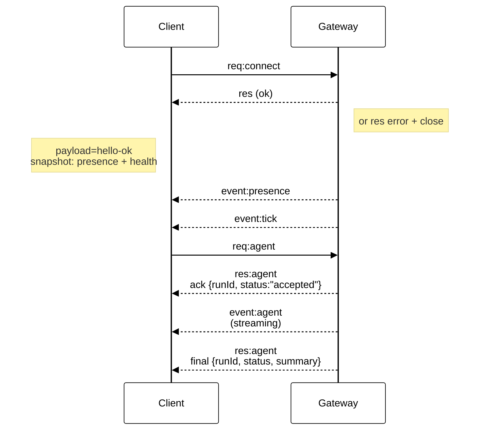

<!--more-->

# 网关架构 (Gateway Architecture)

## 概述

* 一个长期的**网关 (Gateway)** 进程拥有所有消息传输表面（WhatsApp 通过 Baileys，Telegram 通过 grammY，Slack，Discord，Signal，iMessage，WebChat）。
* 控制平面客户端（macOS 应用、CLI、Web UI、自动化脚本）通过 **WebSocket** 连接到网关，绑定在配置的主机上（默认 `127.0.0.1:18789`）。
* **节点 (Nodes)**（macOS/iOS/Android/无头设备）也通过 **WebSocket** 连接，但需声明 `role: node` 并包含明确的能力/命令。
* 每台主机对应一个网关；它是唯一开启 WhatsApp 会话的地方。
* **画布主机 (Canvas host)**（默认 `18793`）用于提供代理可编辑的 HTML 和 A2UI。

## 组件与流程

### 网关 (Gateway) (守护进程)

* 维护提供商连接。
* 公开类型化的 WS API（请求、响应、服务器推送事件）。
* 根据 JSON Schema 验证入站数据帧。
* 触发事件，如 `agent`、`chat`、`presence`、`health`、`heartbeat`、`cron`。

### 客户端 (Client) (Mac 应用 / CLI / Web 管理)

* 每个客户端一条 WS 连接。
* 发送请求 (`health`、`status`、`send`、`agent`、`system-presence`)。
* 订阅事件 (`tick`、`agent`、`presence`、`shutdown`)。

### 节点 (Nodes) (macOS / iOS / Android / 无头设备)

* 使用 `role: node` 连接到**相同的 WS 服务器**。
* 在 `connect` 中提供设备身份；配对是**基于设备**的（角色为 `node`），批准记录存储在设备配对存储中。
* 公开命令，如 `canvas.*`、`camera.*`、`screen.record`、`location.get`。

协议详情:

* [网关协议 (/gateway/protocol)]

### WebChat

* 使用网关 WS API 进行聊天历史记录和发送的静态 UI。
* 在远程设置中，通过与其他客户端相同的 SSH/Tailscale 隧道连接。

## 连接生命周期 (单客户端)




## 有线协议 (摘要)

* 传输: WebSocket，文本帧携带 JSON 有效负载。
* 第一帧**必须**是 `connect`。
* 握手后:
* 请求: `{type:"req", id, method, params}` → `{type:"res", id, ok, payload|error}`
* 事件: `{type:"event", event, payload, seq?, stateVersion?}`


* 如果设置了 `OPENCLAW_GATEWAY_TOKEN` (或 `--token`)，`connect.params.auth.token` 必须匹配，否则套接字关闭。
* 具有副作用的方法 (`send`、`agent`) 需要幂等键以安全重试；服务器保留一个短期的去重缓存。
* 节点在 `connect` 中必须包含 `role: "node"` 以及能力/命令/权限。

## 配对 + 本地信任

* 所有 WS 客户端（操作员 + 节点）在 `connect` 时包含一个**设备身份**。
* 新设备 ID 需要配对批准；网关为后续连接签发**设备令牌**。
* **本地**连接（环回地址或网关主机自身的 tailnet 地址）可以自动批准，以保持同机体验流畅。
* **非本地**连接必须对 `connect.challenge` 随机数进行签名，并需要明确批准。
* 网关身份验证 (`gateway.auth.*`) 仍然适用于**所有**连接，无论是本地还是远程。

详情: [网关协议 (/gateway/protocol)]，[配对 (/channels/pairing)]，[安全性 (/gateway/security)]。

## 协议类型定义与代码生成

* TypeBox 模式定义协议。
* 根据这些模式生成 JSON Schema。
* 根据 JSON Schema 生成 Swift 模型。

## 远程访问

* 首选: Tailscale 或 VPN。
* 替代方案: SSH 隧道
```bash
ssh -N -L 18789:127.0.0.1:18789 user@host

```

* 相同的握手 + 身份验证令牌适用于隧道连接。
* TLS + 可选锚定 (pinning) 可用于远程设置中的 WS。

## 操作快照

* 启动: `openclaw gateway` (前台运行，日志输出到 stdout)。
* 健康状态: WS 上的 `health` 命令（也包含在 `hello-ok` 中）。
* 监管: 使用 launchd/systemd 进行自动重启。

## 不变性条件

* 每台主机只有一个网关控制一个 Baileys 会话。
* 握手是强制的；任何非 JSON 或非 `connect` 的第一帧都会导致硬关闭。
* 事件不会重放；客户端必须在出现间隙时刷新。


------


# 智能体运行时 (Agent Runtime) 🤖

OpenClaw 运行着一个衍生自 **pi-mono** 的单一嵌入式智能体运行时。

## 工作空间 (Workspace) (必填)

OpenClaw 使用单个智能体工作空间目录 (`agents.defaults.workspace`) 作为智能体工具和上下文的**唯一**工作目录 (`cwd`)。

建议：如果 `~/.openclaw/openclaw.json` 缺失，请使用 `openclaw setup` 创建该文件并初始化工作空间文件。

完整工作空间布局 + 备份指南：[智能体工作空间 (/concepts/agent-workspace)]

如果启用了 `agents.defaults.sandbox`，非主会话可以通过 `agents.defaults.sandbox.workspaceRoot` 下的每个会话的工作空间来覆盖此设置（参见 [网关配置 (/gateway/configuration)]）。

## 引导文件 (Bootstrap files) (注入)

在 `agents.defaults.workspace` 中，OpenClaw 需要以下用户可编辑的文件：

* `AGENTS.md` — 操作说明 + “记忆”
* `SOUL.md` — 人格、边界、基调
* `TOOLS.md` — 用户维护的工具注释（例如 `imsg`、`sag`、约定）
* `BOOTSTRAP.md` — 一次性首次运行仪式（完成后删除）
* `IDENTITY.md` — 智能体名称/氛围/表情符号
* `USER.md` — 用户画像 + 首选地址

在新会话的第一次轮询时，OpenClaw 会将这些文件的内容直接注入到智能体上下文中。

空文件会被跳过。大文件会被剪裁并用标记截断，以保持提示词精简（读取文件以获取完整内容）。

如果文件缺失，OpenClaw 会注入一个单行的“缺失文件”标记（并且 `openclaw setup` 会创建一个安全默认模板）。

`BOOTSTRAP.md` 仅针对**全新工作空间**（不存在其他引导文件）创建。如果您在完成仪式后将其删除，它不应在后续重启时重新创建。

若要完全禁用引导文件创建（适用于预填充的工作空间），请设置：

```json5
{ agent: { skipBootstrap: true } }

```

## 内置工具 (Built-in tools)

核心工具（读/执行/编辑/写及相关系统工具）始终可用，但受工具策略约束。`apply_patch` 是可选的，并受 `tools.exec.applyPatch` 控制。`TOOLS.md` **不**控制哪些工具存在；它仅是关于您希望*如何*使用它们的指导。

## 技能 (Skills)

OpenClaw 从三个位置加载技能（在名称冲突时，工作空间优先）：

* 捆绑技能 (随安装一起发布)
* 管理/本地技能: `~/.openclaw/skills`
* 工作空间技能: `<workspace>/skills`

技能可以通过配置/环境变量进行限制（参见 [网关配置 (/gateway/configuration)] 中的 `skills`）。

## pi-mono 集成

OpenClaw 重用了 pi-mono 代码库的部分内容（模型/工具），但**会话管理、发现和工具连接均由 OpenClaw 自主拥有**。

* 没有 pi-coding 智能体运行时。
* 不会查询 `~/.pi/agent` 或 `<workspace>/.pi` 设置。

## 会话 (Sessions)

会话记录以 JSONL 格式存储在：

* `~/.openclaw/agents/<agentId>/sessions/<SessionId>.jsonl`

会话 ID 是稳定的，由 OpenClaw 选择。
不读取旧的 Pi/Tau 会话文件夹。

## 流式传输时控制 (Steering while streaming)

当队列模式为 `steer` 时，入站消息会被注入到当前运行中。
**每次工具调用后**都会检查队列；如果存在队列消息，则跳过当前助手消息中的剩余工具调用（工具结果错误，提示“由于排队的有户消息而被跳过。”），然后在下一次助手响应之前注入排队的用户消息。

当队列模式为 `followup` 或 `collect` 时，入站消息会保留，直到当前轮次结束，然后使用排队的有效负载启动新的智能体轮次。请参阅 [队列 (/concepts/queue)] 了解模式 + 去抖/上限行为。

块流式传输 (Block streaming) 会在助手块完成时立即发送；它**默认关闭** (`agents.defaults.blockStreamingDefault: "off"`)。
通过 `agents.defaults.blockStreamingBreak` 调整边界（`text_end` 与 `message_end`；默认为 `text_end`）。
使用 `agents.defaults.blockStreamingChunk` 控制软块分块（默认 800–1200 字符；优先考虑段落断点，其次是换行符；句子最后）。
使用 `agents.defaults.blockStreamingCoalesce` 合并流式传输的块，以减少单行垃圾信息（发送前基于空闲时间的合并）。非 Telegram 频道需要明确的 `*.blockStreaming: true` 才能启用块回复。
工具的详细总结在工具启动时发出（无去抖）；当可用时，控制 UI 通过智能体事件流式传输工具输出。
更多详情：[流式传输 + 分块 (/concepts/streaming)]。

## 模型引用 (Model refs)

配置中的模型引用（例如 `agents.defaults.model` 和 `agents.defaults.models`）通过在**第一个** `/` 处进行拆分来解析。

* 配置模型时使用 `provider/model`。
* 如果模型 ID 本身包含 `/`（OpenRouter 风格），请包含提供商前缀（例如：`openrouter/moonshotai/kimi-k2`）。
* 如果省略提供商，OpenClaw 会将输入视为**默认提供商**的别名或模型（仅在模型 ID 中没有 `/` 时有效）。

## 配置 (最低要求)

至少需设置：

* `agents.defaults.workspace`
* `channels.whatsapp.allowFrom` (强烈建议)

---

*下一步: [群聊 (/channels/group-messages)]* 🦞


------


# 智能体循环 (Agent Loop - OpenClaw)

智能体循环 (Agentic loop) 是智能体一次完整的“真实”运行：输入 → 上下文组装 → 模型推理 → 工具执行 → 流式回复 → 持久化。这是将消息转化为行动和最终回复的权威路径，同时保持会话状态的一致性。

在 OpenClaw 中，一个循环是每个会话的一次序列化运行，随着模型思考、调用工具和流式传输输出，它会发出生命周期和流事件。本文档解释了该真实循环是如何端到端连接的。

## 入口点

* 网关 RPC: `agent` 和 `agent.wait`。
* CLI: `agent` 命令。

## 工作原理 (高层级)

1. `agent` RPC 验证参数，解析会话 (sessionKey/sessionId)，持久化会话元数据，立即返回 `{ runId, acceptedAt }`。
2. `agentCommand` 运行智能体：
* 解析模型 + 思考/详尽 (verbose) 默认值
* 加载技能快照
* 调用 `runEmbeddedPiAgent` (pi-agent-core 运行时)
* 如果嵌入式循环未发出，则发出**生命周期结束/错误**信号


3. `runEmbeddedPiAgent`:
* 通过每会话 + 全局队列序列化运行
* 解析模型 + 认证配置并构建 pi 会话
* 订阅 pi 事件并流式传输助手/工具增量
* 强制执行超时 -> 如果超时则中止运行
* 返回有效负载 + 使用情况元数据


4. `subscribeEmbeddedPiSession` 将 pi-agent-core 事件桥接到 OpenClaw `agent` 流：
* 工具事件 => `stream: "tool"`
* 助手增量 => `stream: "assistant"`
* 生命周期事件 => `stream: "lifecycle"` (`phase: "start" | "end" | "error"`)


5. `agent.wait` 使用 `waitForAgentJob`:
* 等待 `runId` 的**生命周期结束/错误**信号
* 返回 `{ status: ok|error|timeout, startedAt, endedAt, error? }`


## 队列 + 并发

* 运行按会话密钥（会话通道）序列化，并可选择通过全局通道序列化。
* 这可以防止工具/会话竞争，并保持会话历史记录一致。
* 消息频道可以选择将数据馈送到此通道系统的队列模式（收集/引导/跟进）。参见 [命令队列 (/concepts/queue)]。

## 会话 + 工作空间准备

* 解析并创建工作空间；沙盒运行可能会重定向到沙盒工作空间根目录。
* 加载技能（或从快照中重用）并将其注入到环境和提示词中。
* 引导/上下文文件被解析并注入到系统提示词报告中。
* 获取会话写锁；在流式传输之前打开并准备好 `SessionManager`。

## 提示词组装 + 系统提示词

* 系统提示词由 OpenClaw 的基础提示词、技能提示词、引导上下文和每轮覆盖项构建。
* 强制执行特定于模型的限制和压缩预留令牌。
* 参见 [系统提示词 (/concepts/system-prompt)] 了解模型看到的内容。

## 钩子点 (Hook points - 您可以在此拦截)

OpenClaw 有两个钩子系统：

* **内部钩子** (网关钩子): 用于命令和生命周期事件的事件驱动脚本。
* **插件钩子**: 智能体/工具生命周期和网关管道内的扩展点。

### 内部钩子 (网关钩子)

* **`agent:bootstrap`**: 在最终确定系统提示词之前，在构建引导文件时运行。使用此功能添加/删除引导上下文文件。
* **命令钩子**: `/new`、`/reset`、`/stop` 和其他命令事件（参见钩子文档）。

设置和示例参见 [钩子 (/automation/hooks)]。

### 插件钩子 (智能体 + 网关生命周期)

这些在智能体循环或网关管道内运行：

* **`before_agent_start`**: 在运行开始前注入上下文或覆盖系统提示词。
* **`agent_end`**: 完成后检查最终消息列表和运行元数据。
* **`before_compaction` / `after_compaction**`: 观察或注释压缩周期。
* **`before_tool_call` / `after_tool_call**`: 拦截工具参数/结果。
* **`tool_result_persist`**: 在工具结果写入会话记录之前同步转换它们。
* **`message_received` / `message_sending` / `message_sent**`: 入站 + 出站消息钩子。
* **`session_start` / `session_end**`: 会话生命周期边界。
* **`gateway_start` / `gateway_stop**`: 网关生命周期事件。

钩子 API 和注册详情参见 [插件 (/tools/plugin#plugin-hooks)]。

## 流式传输 + 部分回复

* 助手增量从 pi-agent-core 流出，并作为 `assistant` 事件发出。
* 块流式传输可以在 `text_end` 或 `message_end` 时发出部分回复。
* 推理流式传输可以作为独立流或块回复发出。
* 分块和块回复行为参见 [流式传输 (/concepts/streaming)]。

## 工具执行 + 消息工具

* 工具开始/更新/结束事件在 `tool` 流上发出。
* 工具结果在记录/发出之前会进行大小和图像有效负载的清理。
* 消息工具发送会被追踪，以抑制重复的助手确认。

## 回复整形 + 抑制

* 最终有效负载由以下内容组装：
* 助手文本（和可选的推理）
* 内联工具总结（详尽模式且允许时）
* 模型出错时的助手错误文本


* `NO_REPLY` 被视为静默令牌，从传出的有效负载中过滤掉。
* 消息工具的重复项从最终有效负载列表中删除。
* 如果没有可渲染的有效负载且工具出错，则会发出后备工具错误回复（除非消息工具已经发送了用户可见的回复）。

## 压缩 + 重试

* 自动压缩发出 `compaction` 流事件，并可触发重试。
* 重试时，内存缓冲区和工具总结会被重置，以避免重复输出。
* 压缩管道参见 [压缩 (/concepts/compaction)]。

## 事件流 (当前)

* `lifecycle`: 由 `subscribeEmbeddedPiSession` 发出（并由 `agentCommand` 作为后备发出）
* `assistant`: 来自 pi-agent-core 的流式增量
* `tool`: 来自 pi-agent-core 的流式工具事件

## 聊天频道处理

* 助手增量被缓冲到聊天 `delta` 消息中。
* 聊天 `final` 在**生命周期结束/错误**时发出。

## 超时

* `agent.wait` 默认值: 30秒（仅等待）。`timeoutMs` 参数可覆盖。
* 智能体运行时: `agents.defaults.timeoutSeconds` 默认 600秒；在 `runEmbeddedPiAgent` 中断计时器中强制执行。

## 可能过早结束的情况

* 智能体超时 (abort)
* AbortSignal (取消)
* 网关断开连接或 RPC 超时
* `agent.wait` 超时（仅等待，不停止智能体）


------


# 系统提示词 (System Prompt)

OpenClaw 为每次智能体运行构建自定义系统提示词。该提示词由 **OpenClaw 自主拥有**，不使用 p-coding-agent 的默认提示词。

该提示词由 OpenClaw 组装并注入到每次智能体运行中。

## 结构

提示词刻意保持紧凑，并使用固定分段：

* **工具 (Tooling)**: 当前工具列表 + 简短描述。
* **安全 (Safety)**: 简短的护栏提示，旨在避免寻租行为或绕过监管。
* **技能 (Skills)** (适用时): 告知模型如何按需加载技能说明。
* **OpenClaw 自更新 (OpenClaw Self-Update)**: 如何运行 `config.apply` 和 `update.run`。
* **工作空间 (Workspace)**: 工作目录 (`agents.defaults.workspace`)。
* **文档 (Documentation)**: OpenClaw 文档的本地路径（仓库或 npm 包）以及何时阅读它们。
* **工作空间文件 (Workspace Files) (注入)**: 指示下方包含引导文件。
* **沙盒 (Sandbox)** (启用时): 指示沙盒运行时、沙盒路径以及是否可以使用高权限执行。
* **当前日期与时间 (Current Date & Time)**: 用户本地时间、时区和时间格式。
* **回复标签 (Reply Tags)**: 支持的提供商的可选回复标签语法。
* **心跳 (Heartbeats)**: 心跳提示和确认行为。
* **运行时 (Runtime)**: 主机、操作系统、node 版本、模型、仓库根目录（检测到时）、思考水平（一行）。
* **推理 (Reasoning)**: 当前可见性级别 + /reasoning 切换提示。

系统提示词中的安全护栏仅供参考。它们指导模型行为，但不强制执行策略。硬性执行应使用工具策略、执行批准、沙盒和频道白名单；操作员在设计上可以禁用这些。

## 提示词模式 (Prompt modes)

OpenClaw 可以为子智能体渲染更小的系统提示词。运行时会为每次运行设置一个 `promptMode`（非用户界面配置）：

* `full` (默认): 包含上述所有分段。
* `minimal`: 用于子智能体；省略了**技能**、**记忆回忆**、**OpenClaw 自更新**、**模型别名**、**用户身份**、**回复标签**、**消息传递**、**静默回复**和**心跳**。工具、**安全**、工作空间、沙盒、当前日期与时间（已知时）、运行时和注入的上下文保持可用。
* `none`: 仅返回基础身份行。

当 `promptMode=minimal` 时，额外的注入提示词被标记为**子智能体上下文 (Subagent Context)**，而不是**群聊上下文 (Group Chat Context)**。

## 工作空间引导注入 (Workspace bootstrap injection)

引导文件会被剪裁并附加在**项目上下文 (Project Context)** 下，以便模型在无需显式读取的情况下看到身份和个人资料上下文：

* `AGENTS.md`
* `SOUL.md`
* `TOOLS.md`
* `IDENTITY.md`
* `USER.md`
* `HEARTBEAT.md`
* `BOOTSTRAP.md` (仅在全新工作空间)

大文件会用标记截断。每个文件的最大大小由 `agents.defaults.bootstrapMaxChars` 控制（默认：20000）。缺失的文件会注入一个简短的“缺失文件”标记。

内部钩子可以通过 `agent:bootstrap` 拦截此步骤，以修改或替换注入的引导文件（例如将 `SOUL.md` 替换为另一个角色）。

若要检查每个注入文件占用了多少空间（原始与注入、截断、工具模式开销），请使用 `/context list` 或 `/context detail`。参见 [上下文 (/concepts/context)]。

## 时间处理 (Time handling)

当已知用户时区时，系统提示词包含专门的**当前日期与时间**分段。为了保持提示词缓存稳定，它现在只包含**时区**（没有动态时钟或时间格式）。

当智能体需要当前时间时，使用 `session_status`；状态卡片包含时间戳行。

通过以下方式配置：

* `agents.defaults.userTimezone`
* `agents.defaults.timeFormat` (`auto` | `12` | `24`)

完整行为详情参见 [日期与时间 (/date-time)]。

## 技能 (Skills)

当存在符合条件的技能时，OpenClaw 会注入一个紧凑的**可用技能列表** (`formatSkillsForPrompt`)，其中包含每个技能的**文件路径**。提示词指示模型使用 `read` 加载位于列表位置（工作空间、受管或捆绑）的 SKILL.md。如果不符合条件，则省略技能分段。

```
<available_skills>
  <skill>
    <name>...</name>
    <description>...</description>
    <location>...</location>
  </skill>
</available_skills>

```

这保持了基础提示词的小巧，同时实现了有针对性的技能使用。

## 文档 (Documentation)

当可用时，系统提示词包含一个**文档**分段，指向本地 OpenClaw 文档目录（仓库工作空间中的 `docs/` 或捆绑的 npm 包文档），并注明公共镜像、源仓库、社区 Discord 和用于技能发现的 ClawHub ([https://clawhub.com](https://clawhub.com))。提示词指示模型首先查阅本地文档以获取 OpenClaw 行为、命令、配置或架构，并在可能时自行运行 `openclaw status`（仅在缺乏访问权限时询问用户）。


------


# 上下文 (Context)

“上下文”是 **OpenClaw 发送给模型以进行单次运行的全部内容**。它受限于模型的 **上下文窗口**（Token 限制）。

初学者心智模型：

* **系统提示词 (System prompt)** (OpenClaw 构建): 规则、工具、技能列表、时间/运行时以及注入的工作空间文件。
* **对话历史 (Conversation history)**: 本次会话中您的消息 + 助手的消息。
* **工具调用/结果 + 附件 (Tool calls/results + attachments)**: 命令输出、文件读取、图像/音频等。

上下文与“记忆”*不同*：记忆可以存储在磁盘上并在稍后重新加载；而上下文是模型当前窗口中的内容。

## 快速入门 (检查上下文)

* `/status` → 快速查看“窗口填充率” + 会话设置。
* `/context list` → 注入的内容 + 大致大小（每个文件 + 总计）。
* `/context detail` → 更深入的细分：每个文件、每个工具模式大小、每个技能条目大小以及系统提示词大小。
* `/usage tokens` → 在常规回复后附加每条回复的使用情况页脚。
* `/compact` → 将较旧的历史记录总结为一个紧凑的条目，以释放窗口空间。

另请参阅: [斜杠命令 (/tools/slash-commands)]、[Token 使用与成本 (/reference/token-use)]、[压缩 (/concepts/compaction)]。

## 示例输出

数值因模型、提供商、工具策略以及工作空间中的内容而异。

### `/context list`

```
🧠 上下文细分
工作空间: <workspaceDir>
引导最大值/文件: 20,000 字符
沙盒: mode=non-main sandboxed=false
系统提示词 (运行): 38,412 字符 (~9,603 tok) (项目上下文 23,901 字符 (~5,976 tok))

注入的工作空间文件:
- AGENTS.md: OK | 原始 1,742 字符 (~436 tok) | 注入 1,742 字符 (~436 tok)
- SOUL.md: OK | 原始 912 字符 (~228 tok) | 注入 912 字符 (~228 tok)
- TOOLS.md: 已截断 | 原始 54,210 字符 (~13,553 tok) | 注入 20,962 字符 (~5,241 tok)
- IDENTITY.md: OK | 原始 211 字符 (~53 tok) | 注入 211 字符 (~53 tok)
- USER.md: OK | 原始 388 字符 (~97 tok) | 注入 388 字符 (~97 tok)
- HEARTBEAT.md: 缺失 | 原始 0 | 注入 0
- BOOTSTRAP.md: OK | 原始 0 字符 (~0 tok) | 注入 0 字符 (~0 tok)

技能列表 (系统提示词文本): 2,184 字符 (~546 tok) (12 个技能)
工具: read, edit, write, exec, process, browser, message, sessions_send, …
工具列表 (系统提示词文本): 1,032 字符 (~258 tok)
工具模式 (JSON): 31,988 字符 (~7,997 tok) (计入上下文；不以文本显示)
工具: (同上)

会话 Token (缓存): 14,250 总计 / ctx=32,000

```

### `/context detail`

```
🧠 上下文细分 (详细)
…
顶级技能 (提示词条目大小):
- frontend-design: 412 字符 (~103 tok)
- oracle: 401 字符 (~101 tok)
… (+10 个更多技能)

顶级工具 (模式大小):
- browser: 9,812 字符 (~2,453 tok)
- exec: 6,240 字符 (~1,560 tok)
… (+N 个更多工具)

```

## 计入上下文窗口的内容

模型接收的所有内容都计入，包括：

* 系统提示词（所有分段）。
* 对话历史。
* 工具调用 + 工具结果。
* 附件/记录（图像/音频/文件）。
* 压缩总结和修剪伪影。
* 提供商的“封装器”或隐藏标头（不可见，但仍计入）。

## OpenClaw 如何构建系统提示词

系统提示词由 **OpenClaw 自主拥有**，并在每次运行后重建。它包含：

* 工具列表 + 简短描述。
* 技能列表（仅限元数据；见下文）。
* 工作空间位置。
* 时间（UTC + 配置的转换后的用户时间）。
* 运行时元数据（主机/操作系统/模型/思考）。
* **项目上下文 (Project Context)** 下注入的工作空间引导文件。

完整细分: [系统提示词 (/concepts/system-prompt)]。

## 注入的工作空间文件 (项目上下文)

默认情况下，OpenClaw 注入一组固定的工作空间文件（如果存在）：

* `AGENTS.md`
* `SOUL.md`
* `TOOLS.md`
* `IDENTITY.md`
* `USER.md`
* `HEARTBEAT.md`
* `BOOTSTRAP.md` (仅限首次运行)

大文件使用 `agents.defaults.bootstrapMaxChars` (默认 `20000` 字符) 按文件截断。`/context` 显示**原始与注入**的大小以及是否发生了截断。

## 技能：注入与按需加载

系统提示词包含一个紧凑的**技能列表**（名称 + 描述 + 位置）。此列表有实际的开销。

技能说明默认*不*包含在内。模型预期**仅在需要时** `read` 技能的 `SKILL.md`（位于列出的位置：工作空间、受管或捆绑）。如果不符合条件的技能，则省略技能分段。

## 工具：有两种成本

工具通过两种方式影响上下文：

1. 系统提示词中的**工具列表文本**（您看到的“Tooling”）。
2. **工具模式 (Tool schemas)** (JSON)。这些被发送给模型，以便它可以调用工具。即使您看不到它们作为纯文本，它们也会计入上下文。

`/context detail` 会拆分最大的工具模式，以便您查看哪些工具占主导地位。

## 命令、指令和“内联快捷方式”

斜杠命令由网关处理。有几种不同的行为：

* **独立命令**: 仅为 `/...` 的消息作为命令运行。
* **指令**: `/think`, `/verbose`, `/reasoning`, `/elevated`, `/model`, `/queue` 在模型看到消息之前被剥离。
* 仅指令消息会持久化会话设置。
* 常规消息中的内联指令作为每条消息的提示。


* **内联快捷方式** (仅限白名单发送者): 常规消息中的某些 `/...` 令牌可以立即运行（例如：“hey /status”），并在模型看到剩余文本之前被剥离。

详情: [斜杠命令 (/tools/slash-commands)]。

## 会话、压缩和修剪 (什么会持久化)

消息之间的持久化内容取决于机制：

* **常规历史** 持久化在会话记录中，直到根据策略进行压缩/修剪。
* **压缩** 将总结持久化到记录中，并保持最近的消息完整。
* **修剪** 从单次运行的*内存中*提示词中删除旧的工具结果，但不会重写记录。

文档: [会话 (/concepts/session)]、[压缩 (/concepts/compaction)]、[会话修剪 (/concepts/session-pruning)]。

## `/context` 实际报告的内容

`/context` 优先使用可用的最新**运行构建的**系统提示词报告：

* `System prompt (run)` = 从上一次嵌入的（支持工具的）运行中捕获并持久化在会话存储中。
* `System prompt (estimate)` = 当没有运行报告存在时（或通过不生成报告的 CLI 后端运行时）即时计算。

无论哪种方式，它都会报告大小和主要贡献者；它*不*会转储完整的系统提示词或工具模式。


------


# 智能体工作空间 (Agent workspace)

工作空间是智能体的家。它是唯一用于文件工具和工作空间上下文的工作目录。请将其保密，并将其视为记忆。

这与存储配置、凭据和会话的 `~/.openclaw/` 是分开的。

**重要提示：** 工作空间是**默认的当前工作目录 (cwd)**，而不是一个严格的沙盒。工具会根据工作空间解析相对路径，但绝对路径仍然可以触及主机上的其他位置，除非启用了沙盒。如果您需要隔离，请使用 [`agents.defaults.sandbox` (/gateway/sandboxing)]（和/或每个智能体的沙盒配置）。当启用沙盒且 `workspaceAccess` 不为 `"rw"` 时，工具在 `~/.openclaw/sandboxes` 下的沙盒工作空间中运行，而不是在您的主机工作空间中。

## 默认位置

* 默认：`~/.openclaw/workspace`
* 如果设置了 `OPENCLAW_PROFILE` 且不为 `"default"`，则默认位置变为 `~/.openclaw/workspace-<profile>`。
* 在 `~/.openclaw/openclaw.json` 中覆盖：

```json5
{
  agent: {
    workspace: "~/.openclaw/workspace",
  },
}

```

`openclaw onboard`、`openclaw configure` 或 `openclaw setup` 将创建工作空间，并在文件缺失时播种引导文件。

如果您已经自己管理工作空间文件，可以禁用引导文件创建：

```json5
{ agent: { skipBootstrap: true } }

```

## 额外的工作空间文件夹

较旧的安装可能会创建 `~/openclaw`。保留多个工作空间目录可能会导致认证或状态漂移的混乱，因为一次只能激活一个工作空间。

**建议：** 保留一个活跃的工作空间。如果您不再使用额外的文件夹，请归档或将其移至回收站（例如 `trash ~/openclaw`）。如果您有意保留多个工作空间，请确保 `agents.defaults.workspace` 指向活跃的那个。

`openclaw doctor` 在检测到额外的工作空间目录时会发出警告。

## 工作空间文件映射 (每个文件的含义)

以下是 OpenClaw 预期的工作空间内的标准文件：

* `AGENTS.md`
* 智能体的操作说明以及它应该如何使用记忆。
* 在每次会话开始时加载。
* 是存放规则、优先级和“行为方式”细节的好地方。


* `SOUL.md`
* 人格、基调和边界。
* 每次会话加载。


* `USER.md`
* 用户是谁以及如何称呼他们。
* 每次会话加载。


* `IDENTITY.md`
* 智能体的名称、氛围和表情符号。
* 在引导仪式期间创建/更新。


* `TOOLS.md`
* 关于您的本地工具和约定的注释。
* 不控制工具的可用性；仅作为指导。


* `HEARTBEAT.md`
* 心跳运行的可选小检查清单。
* 请保持简短，以避免 Token 消耗。


* `BOOT.md`
* 启用内部钩子时，在网关重启时执行的可选启动检查清单。
* 请保持简短；使用消息工具进行出站发送。


* `BOOTSTRAP.md`
* 一次性首次运行仪式。
* 仅为全新的工作空间创建。
* 仪式完成后将其删除。


* `memory/YYYY-MM-DD.md`
* 每日记忆日志（每天一个文件）。
* 建议在会话开始时阅读今天 + 昨天。


* `MEMORY.md` (可选)
* 精选的长期记忆。
* 仅在主要的主会话中加载（不在共享/群聊上下文中加载）。


工作流和自动记忆刷新参见 [记忆 (/concepts/memory)]。

* `skills/` (可选)
* 特定于工作空间的技能。
* 当名称冲突时覆盖受管/捆绑的技能。


* `canvas/` (可选)
* 用于节点显示的画布 UI 文件（例如 `canvas/index.html`）。


如果任何引导文件缺失，OpenClaw 会在会话中注入一个“缺失文件”标记并继续。大的引导文件在注入时会被截断；使用 `agents.defaults.bootstrapMaxChars` (默认: 20000) 调整限制。`openclaw setup` 可以重新创建缺失的默认文件，而不会覆盖现有文件。

## 不在工作空间中的内容

这些存在于 `~/.openclaw/` 下，且不应提交到工作空间仓库：

* `~/.openclaw/openclaw.json` (配置)
* `~/.openclaw/credentials/` (OAuth 令牌、API 密钥)
* `~/.openclaw/agents/<agentId>/sessions/` (会话记录 + 元数据)
* `~/.openclaw/skills/` (受管技能)

如果您需要迁移会话或配置，请单独复制它们，并将它们排除在版本控制之外。

## Git 备份 (推荐，私有)

将工作空间视为私有记忆。将其放在一个**私有** git 仓库中，以便进行备份和恢复。

在运行网关的机器上执行这些步骤（即工作空间所在的位置）。

### 1) 初始化仓库

如果安装了 git，全新的工作空间会自动初始化。如果此工作空间尚未成为仓库，请运行：

```bash
cd ~/.openclaw/workspace
git init
git add AGENTS.md SOUL.md TOOLS.md IDENTITY.md USER.md HEARTBEAT.md memory/
git commit -m "Add agent workspace"

```

### 2) 添加私有远程仓库 (初学者友好选项)

选项 A: GitHub Web UI

1. 在 GitHub 上创建一个新的**私有**仓库。
2. 不要使用 README 初始化（避免合并冲突）。
3. 复制 HTTPS 远程 URL。
4. 添加远程仓库并推送：

```bash
git branch -M main
git remote add origin <https-url>
git push -u origin main

```

选项 B: GitHub CLI (`gh`)

```bash
gh auth login
gh repo create openclaw-workspace --private --source . --remote origin --push

```

选项 C: GitLab Web UI

1. 在 GitLab 上创建一个新的**私有**仓库。
2. 不要使用 README 初始化（避免合并冲突）。
3. 复制 HTTPS 远程 URL。
4. 添加远程仓库并推送：

```bash
git branch -M main
git remote add origin <https-url>
git push -u origin main

```

### 3) 持续更新

```bash
git status
git add .
git commit -m "Update memory"
git push

```

## 不要提交密钥 (Secrets)

即使在私有仓库中，也要避免在工作空间中存储密钥：

* API 密钥、OAuth 令牌、密码或私有凭据。
* `~/.openclaw/` 下的任何内容。
* 聊天记录或敏感附件的原始转储。

如果您必须存储敏感引用，请使用占位符，并将真实的密钥保存在别处（密码管理器、环境变量或 `~/.openclaw/`）。

建议的 `.gitignore` 起始内容：

```gitignore
.DS_Store
.env
**/*.key
**/*.pem
**/secrets*

```

## 将工作空间迁移到新机器

1. 将仓库克隆到所需的路径（默认 `~/.openclaw/workspace`）。
2. 在 `~/.openclaw/openclaw.json` 中将 `agents.defaults.workspace` 设置为该路径。
3. 运行 `openclaw setup --workspace <path>` 来播种任何缺失的文件。
4. 如果需要会话，请单独从旧机器复制 `~/.openclaw/agents/<agentId>/sessions/`。

## 高级说明

* 多智能体路由可以为每个智能体使用不同的工作空间。路由配置参见 [频道路由 (/channels/channel-routing)]。
* 如果启用了 `agents.defaults.sandbox`，非主会话可以使用 `agents.defaults.sandbox.workspaceRoot` 下的每会话沙盒工作空间。


------


# Pi 集成架构

本文档说明 OpenClaw 如何与 [pi-coding-agent](https://github.com/badlogic/pi-mono/tree/main/packages/coding-agent) 及其关联包（`pi-ai`、`pi-agent-core`、`pi-tui`）集成，以实现其 AI 智能体能力。

## 概述

OpenClaw 使用 Pi SDK 将 AI 编码智能体嵌入到其消息网关架构中。OpenClaw 并非将 Pi 作为子进程启动或使用 RPC 模式，而是通过 `createAgentSession()` 直接导入并实例化 Pi 的 `AgentSession`。这种嵌入式方案具备以下优势：

- 完全控制会话生命周期与事件处理
- 自定义工具注入（消息、沙箱、频道专属操作）
- 按频道/上下文定制系统提示词
- 支持分支与压缩的会话持久化
- 多账号认证配置轮换与故障转移
- 与模型厂商无关的模型切换

## 包依赖

```json
{
  "@mariozechner/pi-agent-core": "0.49.3",
  "@mariozechner/pi-ai": "0.49.3",
  "@mariozechner/pi-coding-agent": "0.49.3",
  "@mariozechner/pi-tui": "0.49.3"
}
```

| 包名              | 用途                                                                 |
| ----------------- | -------------------------------------------------------------------- |
| `pi-ai`           | 大语言模型核心抽象：`Model`、`streamSimple`、消息类型、厂商 API       |
| `pi-agent-core`   | 智能体循环、工具执行、`AgentMessage` 类型                            |
| `pi-coding-agent` | 上层 SDK：`createAgentSession`、`SessionManager`、`AuthStorage` 等    |
| `pi-tui`          | 终端 UI 组件（用于 OpenClaw 本地终端界面模式）                        |

## 文件结构

```
src/agents/
├── pi-embedded-runner.ts          # 从 pi-embedded-runner/ 重新导出
├── pi-embedded-runner/
│   ├── run.ts                     # 主入口：runEmbeddedPiAgent()
│   ├── run/
│   │   ├── attempt.ts             # 单次尝试逻辑与会话初始化
│   │   ├── params.ts              # RunEmbeddedPiAgentParams 类型
│   │   ├── payloads.ts            # 从运行结果构建响应数据
│   │   ├── images.ts              # 视觉模型图片注入
│   │   └── types.ts               # EmbeddedRunAttemptResult
│   ├── abort.ts                   # 中止错误检测
│   ├── cache-ttl.ts               # 上下文裁剪的缓存有效期跟踪
│   ├── compact.ts                 # 手动/自动压缩逻辑
│   ├── extensions.ts              # 为嵌入式运行加载 Pi 扩展
│   ├── extra-params.ts            # 模型厂商专属流参数
│   ├── google.ts                  # Google/Gemini 轮次顺序修复
│   ├── history.ts                 # 历史记录限制（私聊 vs 群聊）
│   ├── lanes.ts                   # 会话/全局命令通道
│   ├── logger.ts                  # 子系统日志
│   ├── model.ts                   # 通过 ModelRegistry 解析模型
│   ├── runs.ts                    # 活跃运行跟踪、中止、队列
│   ├── sandbox-info.ts            # 系统提示词所需沙箱信息
│   ├── session-manager-cache.ts   # SessionManager 实例缓存
│   ├── session-manager-init.ts    # 会话文件初始化
│   ├── system-prompt.ts           # 系统提示词构建器
│   ├── tool-split.ts              # 拆分内置工具与自定义工具
│   ├── types.ts                   # EmbeddedPiAgentMeta、EmbeddedPiRunResult
│   └── utils.ts                   # ThinkLevel 映射、错误描述
├── pi-embedded-subscribe.ts       # 会话事件订阅/分发
├── pi-embedded-subscribe.types.ts # SubscribeEmbeddedPiSessionParams
├── pi-embedded-subscribe.handlers.ts # 事件处理工厂
├── pi-embedded-subscribe.handlers.lifecycle.ts
├── pi-embedded-subscribe.handlers.types.ts
├── pi-embedded-block-chunker.ts   # 流式回复分块
├── pi-embedded-messaging.ts       # 消息工具发送跟踪
├── pi-embedded-helpers.ts         # 错误分类、轮次校验
├── pi-embedded-helpers/           # 辅助模块
├── pi-embedded-utils.ts           # 格式化工具
├── pi-tools.ts                    # createOpenClawCodingTools()
├── pi-tools.abort.ts              # 工具的中止信号封装
├── pi-tools.policy.ts             # 工具白名单/黑名单策略
├── pi-tools.read.ts               # 读取工具自定义
├── pi-tools.schema.ts             # 工具 schema 标准化
├── pi-tools.types.ts              # AnyAgentTool 类型别名
├── pi-tool-definition-adapter.ts  # AgentTool → ToolDefinition 适配器
├── pi-settings.ts                 # 配置覆盖
├── pi-extensions/                 # 自定义 Pi 扩展
│   ├── compaction-safeguard.ts    # 安全防护扩展
│   ├── compaction-safeguard-runtime.ts
│   ├── context-pruning.ts         # 基于缓存有效期的上下文裁剪扩展
│   └── context-pruning/
├── model-auth.ts                  # 认证配置解析
├── auth-profiles.ts               # 配置存储、冷却、故障转移
├── model-selection.ts             # 默认模型解析
├── models-config.ts               # models.json 生成
├── model-catalog.ts               # 模型目录缓存
├── context-window-guard.ts        # 上下文窗口校验
├── failover-error.ts              # FailoverError 类
├── defaults.ts                    # 默认模型厂商、默认模型
├── system-prompt.ts               # buildAgentSystemPrompt()
├── system-prompt-params.ts        # 系统提示词参数解析
├── system-prompt-report.ts        # 调试报告生成
├── tool-summaries.ts              # 工具描述摘要
├── tool-policy.ts                 # 工具策略解析
├── transcript-policy.ts           # 对话记录校验策略
├── skills.ts                      # 技能快照/提示词构建
├── skills/                        # 技能子系统
├── sandbox.ts                     # 沙箱上下文解析
├── sandbox/                       # 沙箱子系统
├── channel-tools.ts               # 频道专属工具注入
├── openclaw-tools.ts              # OpenClaw 专属工具
├── bash-tools.ts                  # 执行/进程工具
├── apply-patch.ts                 # apply_patch 工具（OpenAI）
├── tools/                         # 单个工具实现
│   ├── browser-tool.ts
│   ├── canvas-tool.ts
│   ├── cron-tool.ts
│   ├── discord-actions*.ts
│   ├── gateway-tool.ts
│   ├── image-tool.ts
│   ├── message-tool.ts
│   ├── nodes-tool.ts
│   ├── session*.ts
│   ├── slack-actions.ts
│   ├── telegram-actions.ts
│   ├── web-*.ts
│   └── whatsapp-actions.ts
└── ...
```

## 核心集成流程

### 1. 运行嵌入式智能体
主入口为 `pi-embedded-runner/run.ts` 中的 `runEmbeddedPiAgent()`：

```typescript
import { runEmbeddedPiAgent } from "./agents/pi-embedded-runner.js";

const result = await runEmbeddedPiAgent({
  sessionId: "user-123",
  sessionKey: "main:whatsapp:+1234567890",
  sessionFile: "/path/to/session.jsonl",
  workspaceDir: "/path/to/workspace",
  config: openclawConfig,
  prompt: "Hello, how are you?",
  provider: "anthropic",
  model: "claude-sonnet-4-20250514",
  timeoutMs: 120_000,
  runId: "run-abc",
  onBlockReply: async (payload) => {
    await sendToChannel(payload.text, payload.mediaUrls);
  },
});
```

### 2. 创建会话
在 `runEmbeddedAttempt()`（由 `runEmbeddedPiAgent()` 调用）内部使用 Pi SDK：

```typescript
import {
  createAgentSession,
  DefaultResourceLoader,
  SessionManager,
  SettingsManager,
} from "@mariozechner/pi-coding-agent";

const resourceLoader = new DefaultResourceLoader({
  cwd: resolvedWorkspace,
  agentDir,
  settingsManager,
  additionalExtensionPaths,
});
await resourceLoader.reload();

const { session } = await createAgentSession({
  cwd: resolvedWorkspace,
  agentDir,
  authStorage: params.authStorage,
  modelRegistry: params.modelRegistry,
  model: params.model,
  thinkingLevel: mapThinkingLevel(params.thinkLevel),
  tools: builtInTools,
  customTools: allCustomTools,
  sessionManager,
  settingsManager,
  resourceLoader,
});

applySystemPromptOverrideToSession(session, systemPromptOverride);
```

### 3. 事件订阅
`subscribeEmbeddedPiSession()` 订阅 Pi 的 `AgentSession` 事件：

```typescript
const subscription = subscribeEmbeddedPiSession({
  session: activeSession,
  runId: params.runId,
  verboseLevel: params.verboseLevel,
  reasoningMode: params.reasoningLevel,
  toolResultFormat: params.toolResultFormat,
  onToolResult: params.onToolResult,
  onReasoningStream: params.onReasoningStream,
  onBlockReply: params.onBlockReply,
  onPartialReply: params.onPartialReply,
  onAgentEvent: params.onAgentEvent,
});
```

处理的事件包括：
- `message_start`/`message_end`/`message_update`（文本/思考流）
- `tool_execution_start`/`tool_execution_update`/`tool_execution_end`
- `turn_start`/`turn_end`
- `agent_start`/`agent_end`
- `auto_compaction_start`/`auto_compaction_end`

### 4. 发送提示词
初始化完成后向会话发送提示词：

```typescript
await session.prompt(effectivePrompt, { images: imageResult.images });
```

SDK 负责完整智能体循环：发送到大模型、执行工具调用、流式返回响应。

## 工具架构

### 工具流程
1. **基础工具**：Pi 的 `codingTools`（读取、bash、编辑、写入）
2. **自定义替换**：OpenClaw 用 `exec`/`process` 替换 bash，为沙箱定制读写编辑
3. **OpenClaw 工具**：消息、浏览器、画布、会话、定时任务、网关等
4. **频道工具**：Discord/Telegram/Slack/WhatsApp 专属操作工具
5. **策略过滤**：按配置、厂商、智能体、群组、沙箱策略过滤工具
6. **Schema 标准化**：适配 Gemini/OpenAI 特殊格式
7. **中止信号封装**：工具支持中止信号

### 工具定义适配器
`pi-agent-core` 的 `AgentTool` 与 `pi-coding-agent` 的 `ToolDefinition` 的 `execute` 签名不同。`pi-tool-definition-adapter.ts` 中的适配器用于桥接：

```typescript
export function toToolDefinitions(tools: AnyAgentTool[]): ToolDefinition[] {
  return tools.map((tool) => ({
    name: tool.name,
    label: tool.label ?? name,
    description: tool.description ?? "",
    parameters: tool.parameters,
    execute: async (toolCallId, params, onUpdate, _ctx, signal) => {
      // pi-coding-agent 与 pi-agent-core 签名不同
      return await tool.execute(toolCallId, params, signal, onUpdate);
    },
  }));
}
```

### 工具拆分策略
`splitSdkTools()` 将所有工具通过 `customTools` 传入：

```typescript
export function splitSdkTools(options: { tools: AnyAgentTool[]; sandboxEnabled: boolean }) {
  return {
    builtInTools: [], // 置空，全部覆盖
    customTools: toToolDefinitions(options.tools),
  };
}
```

确保 OpenClaw 的策略过滤、沙箱集成与扩展工具集在各厂商间保持一致。

## 系统提示词构建
系统提示词在 `system-prompt.ts` 的 `buildAgentSystemPrompt()` 中构建。包含：工具、调用风格、安全规则、OpenClaw CLI 参考、技能、文档、工作区、沙箱、消息、回复标记、语音、静默回复、心跳、运行元数据，以及启用的记忆与反应，可选上下文文件与额外提示内容。子智能体使用极简模式时会裁剪部分内容。

提示词在会话创建后通过 `applySystemPromptOverrideToSession()` 应用：

```typescript
const systemPromptOverride = createSystemPromptOverride(appendPrompt);
applySystemPromptOverrideToSession(session, systemPromptOverride);
```

## 会话管理

### 会话文件
会话为 JSONL 文件，使用树结构（id/parentId 关联）。Pi 的 `SessionManager` 负责持久化：

```typescript
const sessionManager = SessionManager.open(params.sessionFile);
```

OpenClaw 通过 `guardSessionManager()` 封装以保证工具结果安全。

### 会话缓存
`session-manager-cache.ts` 缓存 `SessionManager` 实例，避免重复解析文件：

```typescript
await prewarmSessionFile(params.sessionFile);
sessionManager = SessionManager.open(params.sessionFile);
trackSessionManagerAccess(params.sessionFile);
```

### 历史记录限制
`limitHistoryTurns()` 根据频道类型（私聊/群聊）裁剪对话历史。

### 压缩
上下文溢出时自动触发压缩。`compactEmbeddedPiSessionDirect()` 处理手动压缩：

```typescript
const compactResult = await compactEmbeddedPiSessionDirect({
  sessionId, sessionFile, provider, model, ...
});
```

## 认证与模型解析

### 认证配置
OpenClaw 维护认证配置存储，每个厂商支持多个 API 密钥：

```typescript
const authStore = ensureAuthProfileStore(agentDir, { allowKeychainPrompt: false });
const profileOrder = resolveAuthProfileOrder({ cfg, store: authStore, provider, preferredProfile });
```

配置失败后轮换并跟踪冷却时间：

```typescript
await markAuthProfileFailure({ store, profileId, reason, cfg, agentDir });
const rotated = await advanceAuthProfile();
```

### 模型解析

```typescript
import { resolveModel } from "./pi-embedded-runner/model.js";

const { model, error, authStorage, modelRegistry } = resolveModel(
  provider,
  modelId,
  agentDir,
  config,
);

// 使用 Pi 的 ModelRegistry 和 AuthStorage
authStorage.setRuntimeApiKey(model.provider, apiKeyInfo.apiKey);
```

### 故障转移
`FailoverError` 在配置后触发模型降级：

```typescript
if (fallbackConfigured && isFailoverErrorMessage(errorText)) {
  throw new FailoverError(errorText, {
    reason: promptFailoverReason ?? "unknown",
    provider,
    model: modelId,
    profileId,
    status: resolveFailoverStatus(promptFailoverReason),
  });
}
```

## Pi 扩展
OpenClaw 加载自定义 Pi 扩展实现特殊行为：

### 压缩安全防护
`pi-extensions/compaction-safeguard.ts` 为压缩增加防护，包括自适应令牌预算、工具失败与文件操作摘要：

```typescript
if (resolveCompactionMode(params.cfg) === "safeguard") {
  setCompactionSafeguardRuntime(params.sessionManager, { maxHistoryShare });
  paths.push(resolvePiExtensionPath("compaction-safeguard"));
}
```

### 上下文裁剪
`pi-extensions/context-pruning.ts` 实现基于缓存有效期的上下文裁剪：

```typescript
if (cfg?.agents?.defaults?.contextPruning?.mode === "cache-ttl") {
  setContextPruningRuntime(params.sessionManager, {
    settings,
    contextWindowTokens,
    isToolPrunable,
    lastCacheTouchAt,
  });
  paths.push(resolvePiExtensionPath("context-pruning"));
}
```

## 流式与分块回复

### 回复分块
`EmbeddedBlockChunker` 将流式文本拆分为独立回复块：

```typescript
const blockChunker = blockChunking ? new EmbeddedBlockChunker(blockChunking) : null;
```

### 思考/最终标记剥离
流式输出会处理并剥离 ``/`<thinking>` 块，提取 `<final>` 内容：

```typescript
const stripBlockTags = (text: string, state: { thinking: boolean; final: boolean }) => {
  // 剥离 ... 内容
  // 若启用强制最终标记，只返回 <final>...</final> 内容
};
```

### 回复指令
解析并提取 `[[media:url]]`、`[[voice]]`、`[[reply:id]]` 等指令：

```typescript
const { text: cleanedText, mediaUrls, audioAsVoice, replyToId } = consumeReplyDirectives(chunk);
```

## 错误处理

### 错误分类
`pi-embedded-helpers.ts` 对错误分类以便处理：

```typescript
isContextOverflowError(errorText)     // 上下文过大
isCompactionFailureError(errorText)   // 压缩失败
isAuthAssistantError(lastAssistant)   // 认证失败
isRateLimitAssistantError(...)        // 限流
isFailoverAssistantError(...)         // 需要故障转移
classifyFailoverReason(errorText)     // "auth" | "rate_limit" | "quota" | "timeout" | ...
```

### 思考等级降级
不支持的思考等级会自动降级：

```typescript
const fallbackThinking = pickFallbackThinkingLevel({
  message: errorText,
  attempted: attemptedThinking,
});
if (fallbackThinking) {
  thinkLevel = fallbackThinking;
  continue;
}
```

## 沙箱集成
启用沙箱模式时，工具与路径会被限制：

```typescript
const sandbox = await resolveSandboxContext({
  config: params.config,
  sessionKey: sandboxSessionKey,
  workspaceDir: resolvedWorkspace,
});

if (sandboxRoot) {
  // 使用沙箱化的读写编辑工具
  // 执行在容器中运行
  // 浏览器使用桥接 URL
}
```

## 厂商专属处理

### Anthropic
- 清理拒绝相关魔法字符串
- 连续角色轮次校验
- Claude Code 参数兼容

### Google/Gemini
- 轮次顺序修复（`applyGoogleTurnOrderingFix`）
- 工具 Schema 清理（`sanitizeToolsForGoogle`）
- 会话历史清理（`sanitizeSessionHistory`）

### OpenAI
- Codex 模型专用 `apply_patch` 工具
- 思考等级降级处理

## 终端界面集成
OpenClaw 本地终端模式直接使用 `pi-tui` 组件：

```typescript
// src/tui/tui.ts
import { ... } from "@mariozechner/pi-tui";
```

提供与 Pi 原生模式类似的交互式终端体验。

## 与 Pi CLI 的主要区别

| 方面           | Pi CLI                     | OpenClaw 嵌入式版                                             |
| -------------- | -------------------------- | ------------------------------------------------------------- |
| 调用方式       | `pi` 命令 / RPC            | 通过 `createAgentSession()` 使用 SDK                          |
| 工具           | 默认编码工具               | 自定义 OpenClaw 工具集                                        |
| 系统提示词     | AGENTS.md + 提示词文件     | 按频道/上下文动态生成                                         |
| 会话存储       | `~/.pi/agent/sessions/`    | `~/.openclaw/agents/<agentId>/sessions/`（或环境变量路径）|
| 认证           | 单凭证                     | 多配置轮换                                                    |
| 扩展           | 从磁盘加载                 | 编程式 + 磁盘路径                                             |
| 事件处理       | 终端界面渲染               | 基于回调（onBlockReply 等）|

## 未来规划
可优化方向：
1. **工具签名对齐**：当前需适配 `pi-agent-core` 与 `pi-coding-agent` 签名
2. **会话管理器封装**：`guardSessionManager` 提升安全但增加复杂度
3. **扩展加载**：可更直接使用 Pi 的 `ResourceLoader`
4. **流式处理复杂度**：`subscribeEmbeddedPiSession` 体量较大
5. **厂商特殊处理**：部分厂商专属逻辑可由 Pi 原生处理


------


# OAuth 授权

OpenClaw 支持通过 OAuth 为提供商进行“订阅授权”（特别是 **OpenAI Codex (ChatGPT OAuth)**）。对于 Anthropic 订阅，请使用 **setup-token** 流程。本页面说明：

* OAuth **令牌交换 (token exchange)** 的工作原理 (PKCE)
* 令牌**存储**在哪里（以及原因）
* 如何处理**多个账号**（配置文件 + 每个会话的覆盖）

OpenClaw 还支持发布自己的 OAuth 或 API 密钥流程的**提供商插件**。通过以下命令运行它们：

```bash
openclaw models auth login --provider <id>

```

## 令牌库 (Token sink - 存在的原因)

OAuth 提供商通常会在登录/刷新流程中铸造一个**新的刷新令牌 (refresh token)**。当为同一用户/应用发布新令牌时，某些提供商（或 OAuth 客户端）可能会使旧的刷新令牌失效。

实际症状：

* 您通过 OpenClaw *和* 通过 Claude Code / Codex CLI 登录 → 其中一个稍后会随机“被退出登录”。

为了减少这种情况，OpenClaw 将 `auth-profiles.json` 视为一个**令牌库 (token sink)**：

* 运行时从**一个地方**读取凭据。
* 我们可以保留多个配置文件并确定性地路由它们。

## 存储 (令牌存放位置)

秘钥是**按智能体存储**的：

* 授权配置文件 (OAuth + API 密钥): `~/.openclaw/agents/<agentId>/agent/auth-profiles.json`
* 运行时缓存 (自动管理；请勿编辑): `~/.openclaw/agents/<agentId>/agent/auth.json`

旧版仅导入文件（仍然支持，但不是主要存储）：

* `~/.openclaw/credentials/oauth.json` (首次使用时导入到 `auth-profiles.json`)

以上所有内容也尊重 `$OPENCLAW_STATE_DIR`（状态目录覆盖）。完整参考：[/gateway/configuration](https://www.google.com/search?q=/gateway/configuration%23auth-storage-oauth--api-keys)

## Anthropic setup-token (订阅授权)

在任何机器上运行 `claude setup-token`，然后将其粘贴到 OpenClaw 中：

```bash
openclaw models auth setup-token --provider anthropic

```

如果您在别处生成了令牌，请手动粘贴：

```bash
openclaw models auth paste-token --provider anthropic

```

验证：

```bash
openclaw models status

```

## OAuth 交换 (登录工作原理)

OpenClaw 的交互式登录流程是在 `@mariozechner/pi-ai` 中实现的，并连接到向导/命令中。

### Anthropic (Claude Pro/Max) setup-token

流程形状：

1. 运行 `claude setup-token`
2. 将令牌粘贴到 OpenClaw 中
3. 存储为令牌授权配置文件（无刷新）

向导路径为 `openclaw onboard` → 授权选择 `setup-token` (Anthropic)。

### OpenAI Codex (ChatGPT OAuth)

流程形状 (PKCE):

1. 生成 PKCE 验证器/挑战 (verifier/challenge) + 随机 `state`
2. 打开 `https://auth.openai.com/oauth/authorize?...`
3. 尝试在 `http://127.0.0.1:1455/auth/callback` 上捕获回调
4. 如果回调无法绑定（或者您处于远程/无头模式），请粘贴重定向 URL/代码
5. 在 `https://auth.openai.com/oauth/token` 处交换
6. 从访问令牌中提取 `accountId` 并存储 `{ access, refresh, expires, accountId }`

向导路径为 `openclaw onboard` → 授权选择 `openai-codex`。

## 刷新 + 过期

配置文件存储一个 `expires` 时间戳。

在运行时：

* 如果 `expires` 是未来的时间 → 使用存储的访问令牌
* 如果已过期 → 刷新（在文件锁下）并覆盖存储的凭据

刷新流程是自动的；您通常不需要手动管理令牌。

## 多个账号 (配置文件) + 路由

两种模式：

### 1) 首选：独立的智能体

如果您希望“个人”和“工作”永远不产生交互，请使用隔离的智能体（独立的会话 + 凭据 + 工作空间）：

```bash
openclaw agents add work
openclaw agents add personal

```

然后配置每个智能体的授权（向导）并将聊天路由到正确的智能体。

### 2) 高级：单个智能体中的多个配置文件

`auth-profiles.json` 支持同一提供商的多个配置文件 ID。

选择使用哪个配置文件：

* 全局通过配置排序 (`auth.order`)
* 每个会话通过 `/model ...@<profileId>`

示例（会话覆盖）：

* `/model Opus@anthropic:work`

如何查看存在的配置文件 ID：

* `openclaw channels list --json` (显示 `auth[]`)

相关文档：

* [/concepts/model-failover](https://www.google.com/search?q=/concepts/model-failover) (轮换 + 冷静规则)
* [/tools/slash-commands](https://www.google.com/search?q=/tools/slash-commands) (命令表面)


------


# 智能体引导 (Agent Bootstrapping)

引导 (Bootstrapping) 是**首次运行**的仪式，用于准备智能体工作空间并收集身份细节。它发生在入职培训之后，即智能体首次启动时。

## 引导过程的内容

在首次运行智能体时，OpenClaw 会引导工作空间（默认 `~/.openclaw/workspace`）：

* 播种 `AGENTS.md`、`BOOTSTRAP.md`、`IDENTITY.md`、`USER.md`。
* 运行一个简短的问答仪式（一次一个问题）。
* 将身份 + 偏好写入 `IDENTITY.md`、`USER.md`、`SOUL.md`。
* 完成后移除 `BOOTSTRAP.md`，确保它只运行一次。

## 运行位置

引导始终在**网关主机 (gateway host)** 上运行。如果 macOS 应用连接到远程网关，工作空间和引导文件将存储在该远程机器上。

<Note>
当网关在另一台机器上运行时，请在网关主机上编辑工作空间文件（例如，`user@gateway-host:~/.openclaw/workspace`）。
</Note>

## 相关文档

* macOS 应用入职：[入职培训 (/start/onboarding)]
* 工作空间布局：[智能体工作空间 (/concepts/agent-workspace)]


------


# 会话管理 (Session Management)

OpenClaw 将**每个智能体一个直接聊天会话**视为主要会话。直接聊天会塌陷为 `agent:<agentId>:<mainKey>`（默认 `main`），而群组/频道聊天则拥有自己的键。`session.mainKey` 会被尊重。

使用 `session.dmScope` 来控制**直接消息**的分组方式：

* `main` (默认): 所有 DM 共享主要会话以保持连续性。
* `per-peer`: 跨频道按发送者 ID 隔离。
* `per-channel-peer`: 按频道 + 发送者隔离（推荐用于多用户收件箱）。
* `per-account-channel-peer`: 按账号 + 频道 + 发送者隔离（推荐用于多账号收件箱）。
使用 `session.identityLinks` 将提供商前缀的对等 ID 映射到规范身份，以便在使用 `per-peer`、`per-channel-peer` 或 `per-account-channel-peer` 时，同一个人可以跨频道共享 DM 会话。

## 安全 DM 模式 (推荐用于多用户设置)

> **安全警告：** 如果您的智能体可以接收来自**多个人**的 DM，您应该强烈考虑启用安全 DM 模式。如果没有启用，所有用户共享相同的对话上下文，这可能会在用户之间泄漏隐私信息。

**默认设置下问题的示例：**

* 爱丽丝 (`<SENDER_A>`) 就私人话题（例如，医疗预约）向您的智能体发送消息。
* 鲍勃 (`<SENDER_B>`) 向您的智能体发送消息询问“我们刚才在聊什么？”。
* 由于两个 DM 共享同一个会话，模型可能会使用爱丽丝之前的上下文来回答鲍勃。

**解决方法：** 设置 `dmScope` 以按用户隔离会话：

```json5
// ~/.openclaw/openclaw.json
{
  session: {
    // 安全 DM 模式：按频道 + 发送者隔离 DM 上下文。
    dmScope: "per-channel-peer",
  },
}

```

**何时启用此功能：**

* 您有超过一个发送者的配对批准。
* 您使用包含多个条目的 DM 白名单。
* 您设置了 `dmPolicy: "open"`。
* 多个电话号码或账号可以向您的智能体发送消息。

注意：

* 为了连续性，默认值为 `dmScope: "main"`（所有 DM 共享主要会话）。这对于单用户设置是可以的。
* 对于同一频道上的多账号收件箱，优先选择 `per-account-channel-peer`。
* 如果同一个人在多个频道上联系您，请使用 `session.identityLinks` 将他们的 DM 会话合并为一个规范身份。
* 您可以使用 `openclaw security audit` 验证您的 DM 设置（参见 [安全 (/cli/security)]）。

## 网关是唯一事实来源 (Source of truth)

所有会话状态都**由网关所有**（“主” OpenClaw）。UI 客户端（macOS 应用、WebChat 等）必须查询网关以获取会话列表和 Token 计数，而不是读取本地文件。

* 在**远程模式**下，您关心的会话存储存在于远程网关主机上，而不是您的 Mac 上。
* UI 中显示的 Token 计数来自网关的存储字段 (`inputTokens`, `outputTokens`, `totalTokens`, `contextTokens`)。客户端不会解析 JSONL 记录来“修正”总数。

## 状态存放位置

* 在**网关主机**上：
* 存储文件: `~/.openclaw/agents/<agentId>/sessions/sessions.json` (每个智能体)。


* 记录 (Transcripts): `~/.openclaw/agents/<agentId>/sessions/<SessionId>.jsonl` (Telegram 主题会话使用 `.../<SessionId>-topic-<threadId>.jsonl`)。
* 存储是一个映射 `sessionKey -> { sessionId, updatedAt, ... }`。删除条目是安全的；它们会按需重新创建。
* 群组条目可能包含 `displayName`, `channel`, `subject`, `room` 和 `space`，用于在 UI 中标记会话。
* 会话条目包含 `origin` 元数据（标签 + 路由提示），以便 UI 可以解释会话的来源。
* OpenClaw **不**读取旧的 Pi/Tau 会话文件夹。

## 会话修剪 (Pruning)

默认情况下，OpenClaw 会在 LLM 调用前直接从内存上下文的末尾修剪**旧的工具结果**。这**不**会重写 JSONL 历史记录。参见 [/concepts/session-pruning](https://www.google.com/search?q=/concepts/session-pruning)。

## 预压缩记忆刷新 (Memory flush)

当会话接近自动压缩时，OpenClaw 可以运行**静默记忆刷新**轮次，提醒模型将持久化笔记写入磁盘。这仅在工作空间可写时运行。参见 [记忆 (/concepts/memory)] 和 [压缩 (https://www.google.com/search?q=/concepts/compaction)]。

## 将传输方式映射到会话键 (Transport → session keys)

* 直接聊天遵循 `session.dmScope` (默认 `main`)。
* `main`: `agent:<agentId>:<mainKey>` (跨设备/频道的连续性)。
* 多个电话号码和频道可以映射到同一个智能体主键；它们充当进入一个对话的传输方式。


* `per-peer`: `agent:<agentId>:dm:<peerId>`。
* `per-channel-peer`: `agent:<agentId>:<channel>:dm:<peerId>`。
* `per-account-channel-peer`: `agent:<agentId>:<channel>:<accountId>:dm:<peerId>` (`accountId` 默认为 `default`)。
* 如果 `session.identityLinks` 匹配带有提供商前缀的对等 ID（例如 `telegram:123`），规范键将替换 `<peerId>`，以便同一个人跨频道共享会话。


* 群组聊天隔离状态: `agent:<agentId>:<channel>:group:<id>` (房间/频道使用 `agent:<agentId>:<channel>:channel:<id>`)。
* Telegram 论坛主题在群组 ID 后附加 `:topic:<threadId>` 以进行隔离。
* 旧的 `group:<id>` 键仍然被识别用于迁移。


* 入站上下文仍可能使用 `group:<id>`；频道从 `Provider` 推断出来，并规范化为规范的 `agent:<agentId>:<channel>:group:<id>` 形式。
* 其他来源:
* 定时任务: `cron:<job.id>`
* Webhook: `hook:<uuid>` (除非钩子显式设置)
* 节点运行: `node-<nodeId>`


## 生命周期 (Lifecycle)

* 重置策略: 会话会被重用，直到过期，并且会在下一条入站消息时评估过期情况。
* 每日重置: 默认为**网关主机本地时间凌晨 4:00**。如果会话的最后一次更新时间早于最近的每日重置时间，则该会话为陈旧状态。
* 空闲重置 (可选): `idleMinutes` 添加了一个滑动空闲窗口。当配置了每日和空闲重置时，**不论哪个先过期**都会强制创建一个新会话。
* 旧版仅空闲重置: 如果您设置了 `session.idleMinutes` 而没有任何 `session.reset`/`resetByType` 配置，OpenClaw 将保持在仅空闲模式以实现向后兼容。
* 按类型覆盖 (可选): `resetByType` 允许您覆盖 `direct`, `group` 和 `thread` 会话的策略（thread = Slack/Discord 线程，Telegram 主题，连接器提供的 Matrix 线程）。
* 按频道覆盖 (可选): `resetByChannel` 覆盖频道的重置策略（适用于该频道的所有会话类型，并优先于 `reset`/`resetByType`）。
* 重置触发器: 确切的 `/new` 或 `/reset`（加上 `resetTriggers` 中的任何额外内容）会启动一个新的会话 ID 并传入消息的剩余部分。`/new <model>` 接受模型别名、`provider/model` 或提供商名称（模糊匹配）来设置新会话模型。如果仅发送 `/new` 或 `/reset`，OpenClaw 会运行一个简短的“你好”问候轮次来确认重置。
* 手动重置: 从存储中删除特定键或移除 JSONL 记录；下一条消息会重新创建它们。
* 隔离的定时任务始终在每次运行时铸造一个全新的 `sessionId` (不重用空闲会话)。

## 发送策略 (可选)

屏蔽特定会话类型的投递，无需列出单个 ID。

```json5
{
  session: {
    sendPolicy: {
      rules: [
        { action: "deny", match: { channel: "discord", chatType: "group" } },
        { action: "deny", match: { keyPrefix: "cron:" } },
      ],
      default: "allow",
    },
  },
}

```

运行时覆盖（仅限所有者）：

* `/send on` → 允许此会话
* `/send off` → 禁止此会话
* `/send inherit` → 清除覆盖并使用配置规则
将这些作为独立消息发送以进行注册。

## 配置 (可选重命名示例)

```json5
// ~/.openclaw/openclaw.json
{
  session: {
    scope: "per-sender", // 保持群组键分开
    dmScope: "main", // DM 连续性 (为共享收件箱设置 per-channel-peer/per-account-channel-peer)
    identityLinks: {
      alice: ["telegram:123456789", "discord:987654321012345678"],
    },
    reset: {
      // 默认值: mode=daily, atHour=4 (网关主机本地时间)。
      // 如果您还设置了 idleMinutes，不论哪个先过期都获胜。
      mode: "daily",
      atHour: 4,
      idleMinutes: 120,
    },
    resetByType: {
      thread: { mode: "daily", atHour: 4 },
      direct: { mode: "idle", idleMinutes: 240 },
      group: { mode: "idle", idleMinutes: 120 },
    },
    resetByChannel: {
      discord: { mode: "idle", idleMinutes: 10080 },
    },
    resetTriggers: ["/new", "/reset"],
    store: "~/.openclaw/agents/{agentId}/sessions/sessions.json",
    mainKey: "main",
  },
}

```

## 检查 (Inspecting)

* `openclaw status` — 显示存储路径和最近的会话。
* `openclaw sessions --json` — 转储每个条目（使用 `--active <minutes>` 过滤）。
* `openclaw gateway call sessions.list --params '{}'` — 从运行中的网关获取会话（对远程网关访问使用 `--url`/`--token`）。
* 在聊天中发送 `/status` 作为独立消息，以查看智能体是否可达、使用了多少会话上下文、当前的思考/详尽切换状态，以及您的 WhatsApp Web 凭据最后一次刷新的时间（有助于发现是否需要重新连接）。
* 发送 `/context list` 或 `/context detail` 以查看系统提示词和注入的工作空间文件中有哪些内容（以及最大的上下文贡献者）。
* 发送 `/stop` 作为独立消息以中止当前运行，清除该会话排队的跟进消息，并停止从中产生的任何子智能体运行（回复包含已停止的数量）。
* 发送 `/compact` (可选说明) 作为独立消息以总结较旧的上下文并释放窗口空间。参见 [/concepts/compaction](https://www.google.com/search?q=/concepts/compaction)。
* JSONL 记录可以直接打开以查看完整轮次。

## 技巧

* 将主键专门用于 1:1 流量；让群组保持自己的键。
* 当自动化清理时，删除单个键而不是整个存储，以保留其他地方的上下文。

## 会话来源元数据 (Origin metadata)

每个会话条目在 `origin` 中记录了它的来源（尽最大努力）：

* `label`: 人类可读标签（从对话标签 + 群组主题/频道解析而来）
* `provider`: 规范化的频道 ID（包括扩展）
* `from`/`to`: 入站信封中的原始路由 ID
* `accountId`: 提供商账号 ID（多账号时）
* `threadId`: 频道支持时的线程/主题 ID
原点字段已填充用于直接消息、频道和群组。如果连接器仅更新投递路由（例如，为了保持 DM 主要会话新鲜），它仍应提供入站上下文，以便会话保留其解释性元数据。扩展可以通过在入站上下文中发送 `ConversationLabel`, `GroupSubject`, `GroupChannel`, `GroupSpace` 和 `SenderName` 并调用 `recordSessionMetaFromInbound`（或将相同的上下文传递给 `updateLastRoute`）来实现这一点。


------


# 会话修剪 (Session Pruning)

会话修剪会在每次 LLM 调用前直接从内存上下文的末尾修剪**旧的工具结果**。它**不**会重写磁盘上的会话历史记录 (`*.jsonl`)。

## 运行时间

* 当启用了 `mode: "cache-ttl"` 且会话的最后一次 Anthropic 调用早于 `ttl` 时。
* 仅影响发送给模型用于该请求的消息。
* 仅对 Anthropic API 调用（以及 OpenRouter 的 Anthropic 模型）处于活跃状态。
* 为了获得最佳结果，请将 `ttl` 与模型的 `cacheControlTtl` 相匹配。
* 修剪后，TTL 窗口会重置，以便随后的请求保持缓存，直到 `ttl` 再次过期。

## 智能默认值 (Anthropic)

* **OAuth 或 setup-token** 配置文件：启用 `cache-ttl` 修剪并将心跳设置为 `1h`。
* **API 密钥** 配置文件：启用 `cache-ttl` 修剪，将心跳设置为 `30m`，并将 Anthropic 模型上的 `cacheControlTtl` 默认为 `1h`。
* 如果您显式设置了任何这些值，OpenClaw **不会**覆盖它们。

## 此功能改进的内容 (成本 + 缓存行为)

* **为什么要修剪：** Anthropic 提示词缓存仅在 TTL 内适用。如果会话在 TTL 后变为空闲，下一个请求将重新缓存完整的提示词，除非您先对其进行修剪。
* **什么变便宜了：** 修剪可减少 TTL 过期后第一个请求的 **cacheWrite** 大小。
* **为什么 TTL 重置很重要：** 一旦修剪运行，缓存窗口就会重置，因此后续请求可以重用新缓存的提示词，而不是再次重新缓存完整的历史记录。
* **什么不会发生：** 修剪不会增加 Token 或产生“双倍”成本；它只会改变在 TTL 后第一个请求中缓存的内容。

## 可以被修剪的内容

* 仅 `toolResult` 消息。
* 用户 + 助手消息**绝不**会被修改。
* 最后 `keepLastAssistants` 条助手消息受到保护；该截断点之后的工具结果不会被修剪。
* 如果没有足够的助手消息来确定截断点，则跳过修剪。
* 包含**图像块**的工具结果将被跳过（绝不截断/清除）。

## 上下文窗口估算

修剪使用估算的上下文窗口（字符数 ≈ Token 数 × 4）。基础窗口按此顺序解析：

1. `models.providers.*.models[].contextWindow` 覆盖。
2. 模型定义 `contextWindow`（来自模型注册表）。
3. 默认 `200000` 个 Token。

如果设置了 `agents.defaults.contextTokens`，它被视为解析窗口的上限（最小值）。

## 模式

### cache-ttl

* 修剪仅在最后一次 Anthropic 调用早于 `ttl` (默认 `5m`) 时运行。
* 运行时：与之前的软截断 + 硬清除行为相同。

## 软修剪与硬清除

* **软截断 (Soft-trim)**: 仅适用于过大的工具结果。
* 保留头部 + 尾部，插入 `...`，并附加一条关于原始大小的说明。
* 跳过带有图像块的结果。


* **硬清除 (Hard-clear)**: 用 `hardClear.placeholder` 替换整个工具结果。

## 工具选择

* `tools.allow` / `tools.deny` 支持 `*` 通配符。
* 拒绝优先。
* 匹配不区分大小写。
* 允许列表为空 => 允许所有工具。

## 与其他限制的交互

* 内置工具已经截断了自己的输出；会话修剪是一个额外的层，可防止长时间运行的聊天在模型上下文中积累过多的工具输出。
* 压缩是独立的：压缩进行总结和持久化，修剪是单次请求的瞬时行为。参见 [/concepts/compaction](https://www.google.com/search?q=/concepts/compaction)。

## 默认值 (启用时)

* `ttl`: `"5m"`
* `keepLastAssistants`: `3`
* `softTrimRatio`: `0.3`
* `hardClearRatio`: `0.5`
* `minPrunableToolChars`: `50000`
* `softTrim`: `{ maxChars: 4000, headChars: 1500, tailChars: 1500 }`
* `hardClear`: `{ enabled: true, placeholder: "[Old tool result content cleared]" }`

## 示例

默认（关闭）：

```json5
{
  agent: {
    contextPruning: { mode: "off" },
  },
}

```

启用感知 TTL 的修剪：

```json5
{
  agent: {
    contextPruning: { mode: "cache-ttl", ttl: "5m" },
  },
}

```

将修剪限制为特定工具：

```json5
{
  agent: {
    contextPruning: {
      mode: "cache-ttl",
      tools: { allow: ["exec", "read"], deny: ["*image*"] },
    },
  },
}

```

参见配置参考：[网关配置 (/gateway/configuration)]


------


# 会话工具 (Session Tools)

目标：一套体积小、不易误用的工具集，以便智能体可以列出会话、获取历史记录以及发送消息到另一个会话。

## 工具名称

* `sessions_list`
* `sessions_history`
* `sessions_send`
* `sessions_spawn`

## 关键模型 (Key Model)

* 主要的直接聊天桶 (Bucket) 始终是字面量键 `"main"` (解析为当前智能体的主要键)。
* 群组聊天使用 `agent:<agentId>:<channel>:group:<id>` 或 `agent:<agentId>:<channel>:channel:<id>` (传递完整的键)。
* 定时任务 (Cron jobs) 使用 `cron:<job.id>`。
* 钩子 (Hooks) 使用 `hook:<uuid>` (除非显式设置)。
* 节点会话 (Node sessions) 使用 `node-<nodeId>` (除非显式设置)。

`global` 和 `unknown` 是保留值，永远不会被列出。如果 `session.scope = "global"`，我们会将所有工具的键别名为 `main`，以便调用者永远不会看到 `global`。

## sessions_list

以行数组的形式列出会话。

参数：

* `kinds?: string[]` 过滤器：`"main" | "group" | "cron" | "hook" | "node" | "other"` 中的任意一个。
* `limit?: number` 最大行数 (默认值：服务器默认值，限制例如 200)。
* `activeMinutes?: number` 仅限在 N 分钟内更新过的会话。
* `messageLimit?: number` 0 = 无消息 (默认 0); >0 = 包含最后 N 条消息。

行为：

* `messageLimit > 0` 会按会话获取 `chat.history` 并包含最后 N 条消息。
* 工具结果在列表输出中被过滤掉；获取工具消息请使用 `sessions_history`。
* 在**沙盒 (sandboxed)** 智能体会话中运行时，会话工具默认为**仅可见已生成会话 (spawned-only visibility)** (见下文)。

行形状 (JSON)：

* `key`: 会话键 (string)
* `kind`: `main | group | cron | hook | node | other`
* `channel`: `whatsapp | telegram | discord | signal | imessage | webchat | internal | unknown`
* `displayName` (如果有群组显示标签)
* `updatedAt` (ms)
* `sessionId`
* `model`, `contextTokens`, `totalTokens`
* `thinkingLevel`, `verboseLevel`, `systemSent`, `abortedLastRun`
* `sendPolicy` (如果设置了会话覆盖)
* `lastChannel`, `lastTo`
* `deliveryContext` (可用时规范化的 `{ channel, to, accountId }`)
* `transcriptPath` (从存储目录 + sessionId 派生的尽力而为路径)
* `messages?` (仅在 `messageLimit > 0` 时)

## sessions_history

获取一个会话的记录。

参数：

* `sessionKey` (必填；接受来自 `sessions_list` 的会话键或 `sessionId`)
* `limit?: number` 最大消息数 (服务器限制)
* `includeTools?: boolean` (默认 false)

行为：

* `includeTools=false` 过滤掉 `role: "toolResult"` 消息。
* 以原始记录格式返回消息数组。
* 当给定 `sessionId` 时，OpenClaw 将其解析为相应的会话键 (缺失 ID 会报错)。

## sessions_send

向另一个会话发送消息。

参数：

* `sessionKey` (必填；接受来自 `sessions_list` 的会话键或 `sessionId`)
* `message` (必填)
* `timeoutSeconds?: number` (默认 >0; 0 = 发后即忘)

行为：

* `timeoutSeconds = 0`: 入队并立即返回 `{ runId, status: "accepted" }`。
* `timeoutSeconds > 0`: 等待最多 N 秒以完成运行，然后返回 `{ runId, status: "ok", reply }`。
* 如果等待超时：`{ runId, status: "timeout", error }`。运行继续进行；稍后调用 `sessions_history`。
* 如果运行失败：`{ runId, status: "error", error }`。
* 公告送达运行在主运行完成后进行，且为尽力而为；`status: "ok"` 不保证公告已送达。
* 通过网关 `agent.wait` (服务端) 等待，以便重新连接不会丢弃等待。
* 智能体到智能体的消息上下文会被注入到主运行中。
* 主运行完成后，OpenClaw 运行**回显循环 (reply-back loop)**：
* 第 2 轮及以后在请求者和目标智能体之间交替。
* 回复确切的 `REPLY_SKIP` 以停止乒乓对话。
* 最大轮次为 `session.agentToAgent.maxPingPongTurns` (0–5，默认 5)。


* 循环结束后，OpenClaw 运行**智能体到智能体公告步骤 (agent‑to‑agent announce step)** (仅目标智能体)：
* 回复确切的 `ANNOUNCE_SKIP` 以保持沉默。
* 任何其他回复都会发送到目标频道。
* 公告步骤包含原始请求 + 第 1 轮回复 + 最近的乒乓回复。


## 频道字段 (Channel Field)

* 对于群组，`channel` 是会话条目上记录的频道。
* 对于直接聊天，`channel` 从 `lastChannel` 映射。
* 对于定时任务/钩子/节点，`channel` 为 `internal`。
* 如果缺失，`channel` 为 `unknown`。

## 安全 / 发送策略 (Security / Send Policy)

基于频道/聊天类型的基于策略的封锁（不是按会话 ID）。

```json
{
  "session": {
    "sendPolicy": {
      "rules": [
        {
          "match": { "channel": "discord", "chatType": "group" },
          "action": "deny"
        }
      ],
      "default": "allow"
    }
  }
}

```

运行时覆盖（按会话条目）：

* `sendPolicy: "allow" | "deny"` (未设置 = 继承配置)
* 可通过 `sessions.patch` 或仅限所有者的 `/send on|off|inherit` (独立消息) 设置。

强制执行点：

* `chat.send` / `agent` (网关)
* 自动回复投递逻辑

## sessions_spawn

在隔离的会话中生成子智能体运行，并将结果公告回请求者的聊天频道。

参数：

* `task` (必填)
* `label?` (可选；用于日志/UI)
* `agentId?` (可选；如果允许，则在另一个智能体 ID 下生成)
* `model?` (可选；覆盖子智能体模型；无效值会报错)
* `runTimeoutSeconds?` (默认 0；设置后，会在 N 秒后中止子智能体运行)
* `cleanup?` (`delete|keep`，默认 `keep`)

允许列表 (Allowlist)：

* `agents.list[].subagents.allowAgents`: 允许通过 `agentId` 使用的智能体 ID 列表 (`["*"]` 允许任何)。默认值：仅限请求者智能体。

发现：

* 使用 `agents_list` 发现允许用于 `sessions_spawn` 的智能体 ID。

行为：

* 启动一个带有 `deliver: false` 的新 `agent:<agentId>:subagent:<uuid>` 会话。
* 子智能体默认使用完整工具集**减去会话工具** (可通过 `tools.subagents.tools` 配置)。
* 子智能体不允许调用 `sessions_spawn` (不允许子智能体 → 生成子智能体)。
* 始终非阻塞：立即返回 `{ status: "accepted", runId, childSessionKey }`。
* 完成后，OpenClaw 运行子智能体**公告步骤**并将结果发布到请求者的聊天频道。
* 在公告步骤期间回复确切的 `ANNOUNCE_SKIP` 以保持沉默。
* 公告回复被规范化为 `Status`/`Result`/`Notes`；`Status` 来自运行时结果（而不是模型文本）。
* 子智能体会话在 `agents.defaults.subagents.archiveAfterMinutes` (默认值：60) 后自动归档。
* 公告回复包含一行统计数据（运行时、Token、sessionKey/sessionId、记录路径和可选成本）。

## 沙盒会话可见性 (Sandbox Session Visibility)

沙盒会话可以使用会话工具，但默认情况下它们仅能看到通过 `sessions_spawn` 生成的会话。

配置：

```json5
{
  agents: {
    defaults: {
      sandbox: {
        // 默认值: "spawned"
        sessionToolsVisibility: "spawned", // 或 "all"
      },
    },
  },
}

```


------


# 记忆 (Memory)

OpenClaw 的记忆是**智能体工作空间中的纯 Markdown 文件**。这些文件是唯一事实来源 (Source of truth)；模型只“记得”写入磁盘的内容。

记忆搜索工具由活跃的记忆插件提供（默认：`memory-core`）。使用 `plugins.slots.memory = "none"` 禁用记忆插件。

## 记忆文件 (Markdown)

默认工作空间布局使用两个记忆层：

* `memory/YYYY-MM-DD.md`
* 每日日志（仅追加）。
* 会话开始时读取今天 + 昨天。


* `MEMORY.md` (可选)
* 精选的长期记忆。
* **仅在主、私有会话中加载**（绝不在群组上下文中加载）。


这些文件存放在工作空间下 (`agents.defaults.workspace`，默认 `~/.openclaw/workspace`)。完整布局参见 [智能体工作空间 (/concepts/agent-workspace)]。

## 何时写入记忆

* 决定、偏好和持久事实存入 `MEMORY.md`。
* 日常笔记和运行上下文存入 `memory/YYYY-MM-DD.md`。
* 如果有人说“记住这个”，请写下来（不要留在内存中）。
* 此区域仍在不断发展。提醒模型存储记忆会有所帮助；它会知道该怎么做。
* 如果您希望某些内容留存，**请要求机器人将其写入**记忆中。

## 自动记忆刷新 (压缩前探测)

当会话**接近自动压缩**时，OpenClaw 会触发一个**静默、智能体轮次 (silent, agentic turn)**，提醒模型**在**上下文被压缩**前**将持久化记忆写入磁盘。默认提示词明确表示模型*可能会回复*，但通常 `NO_REPLY` 是正确的响应，因此用户永远不会看到此轮次。

这由 `agents.defaults.compaction.memoryFlush` 控制：

```json5
{
  agents: {
    defaults: {
      compaction: {
        reserveTokensFloor: 20000,
        memoryFlush: {
          enabled: true,
          softThresholdTokens: 4000,
          systemPrompt: "Session nearing compaction. Store durable memories now.",
          prompt: "Write any lasting notes to memory/YYYY-MM-DD.md; reply with NO_REPLY if nothing to store.",
        },
      },
    },
  },
}

```

详情：

* **软阈值 (Soft threshold)**: 当会话 Token 估算值跨越 `contextWindow - reserveTokensFloor - softThresholdTokens` 时触发刷新。
* **默认静默**: 提示词包含 `NO_REPLY`，因此不会传递任何内容。
* **两个提示词**: 一个用户提示词加上一个系统提示词附加该提醒。
* **每个压缩周期一次刷新** (在 `sessions.json` 中跟踪)。
* **工作空间必须可写**: 如果会话以 `workspaceAccess: "ro"` 或 `"none"` 在沙盒中运行，则跳过刷新。

有关完整的压缩生命周期，请参见 [会话管理 + 压缩 (/reference/session-management-compaction)]。

## 向量记忆搜索

OpenClaw 可以在 `MEMORY.md` 和 `memory/*.md` 上构建一个小型向量索引，这样即使措辞不同，语义查询也可以找到相关的笔记。

默认设置：

* 默认启用。
* 监视记忆文件以获取更改（防抖）。
* 在 `agents.defaults.memorySearch` 下配置记忆搜索（而不是顶层 `memorySearch`）。
* 默认使用远程嵌入。如果未设置 `memorySearch.provider`，OpenClaw 会自动选择：
1. `local` (如果配置了 `memorySearch.local.modelPath` 且文件存在)。
2. `openai` (如果可以解析 OpenAI 密钥)。
3. `gemini` (如果可以解析 Gemini 密钥)。
4. `voyage` (如果可以解析 Voyage 密钥)。
5. 否则记忆搜索将保持禁用状态，直到配置。


* 本地模式使用 node-llama-cpp，可能需要 `pnpm approve-builds`。
* 使用 sqlite-vec（可用时）加速 SQLite 内部的向量搜索。

远程嵌入**需要**嵌入提供商的 API 密钥。OpenClaw 从授权配置文件、`models.providers.*.apiKey` 或环境变量中解析密钥。Codex OAuth 仅涵盖聊天/补全，**不满足**记忆搜索的嵌入需求。对于 Gemini，请使用 `GEMINI_API_KEY` 或 `models.providers.google.apiKey`。对于 Voyage，请使用 `VOYAGE_API_KEY` 或 `models.providers.voyage.apiKey`。使用自定义 OpenAI 兼容终结点时，设置 `memorySearch.remote.apiKey`（和可选的 `memorySearch.remote.headers`）。

### QMD 后端 (实验性)

设置 `memory.backend = "qmd"` 将内置的 SQLite 索引器交换为 [QMD](https://github.com/tobi/qmd)：一个本地优先的搜索侧边栏，结合了 BM25 + 向量 + 重排序。Markdown 仍然是事实来源；OpenClaw 调用 QMD 进行检索。关键点：

**前置条件**

* 默认禁用。按配置启用 (`memory.backend = "qmd"`)。
* 单独安装 QMD CLI (`bun install -g https://github.com/tobi/qmd` 或获取版本) 并确保 `qmd` 二进制文件在网关的 `PATH` 中。
* QMD 需要一个允许扩展的 SQLite 构建 (macOS 上 `brew install sqlite`)。
* QMD 通过 Bun + `node-llama-cpp` 完全在本地运行，并首次使用时自动从 HuggingFace 下载 GGUF 模型（不需要单独的 Ollama 守护进程）。
* 网关通过设置 `XDG_CONFIG_HOME` 和 `XDG_CACHE_HOME` 在 `~/.openclaw/agents/<agentId>/qmd/` 下的独立 XDG 主目录中运行 QMD。
* OS 支持：安装 Bun + SQLite 后，macOS 和 Linux 可直接工作。Windows 最好通过 WSL2 支持。

**侧边栏如何运行**

* 网关在 `~/.openclaw/agents/<agentId>/qmd/` 下写入一个独立的 QMD 主目录 (配置 + 缓存 + sqlite DB)。
* 集合通过 `memory.qmd.paths` (`plus default workspace memory files`) 中的 `qmd collection add` 创建，然后在启动时以及按可配置间隔 (`memory.qmd.update.interval`，默认 5m) 运行 `qmd update` + `qmd embed`。
* 网关现在在启动时初始化 QMD 管理器，因此即使在第一次 `memory_search` 调用之前也会武装定期更新计时器。
* 启动刷新现在默认在后台运行，因此聊天启动不会被阻塞；设置 `memory.qmd.update.waitForBootSync = true` 以保留之前的阻塞行为。
* 搜索通过 `qmd query --json` 运行，范围限定为 OpenClaw 管理的集合。如果 QMD 失败或二进制文件缺失，OpenClaw 会自动回退到内置的 SQLite 管理器，因此记忆工具可继续工作。
* OpenClaw 目前不公开 QMD 嵌入批处理大小调整；批处理行为由 QMD 本身控制。
* **第一次搜索可能较慢**：QMD 可能在第一次 `qmd query` 运行时下载本地 GGUF 模型 (重排序器/查询扩展)。
* OpenClaw 运行 QMD 时会自动设置 `XDG_CONFIG_HOME`/`XDG_CACHE_HOME`。
* 如果您想手动预下载模型 (并预热 OpenClaw 使用的相同索引)，请使用智能体的 XDG 目录运行一次性查询。
OpenClaw 的 QMD 状态存放在您的**状态目录**下 (默认为 `~/.openclaw`)。您可以通过导出 OpenClaw 使用的相同 XDG 变量将 `qmd` 指向完全相同的索引：
```bash
# 选择 OpenClaw 使用的相同状态目录
STATE_DIR="${OPENCLAW_STATE_DIR:-$HOME/.openclaw}"
if [ -d "$HOME/.moltbot" ] && [ ! -d "$HOME/.openclaw" ] \
  && [ -z "${OPENCLAW_STATE_DIR:-}" ]; then
  STATE_DIR="$HOME/.moltbot"
fi

export XDG_CONFIG_HOME="$STATE_DIR/agents/main/qmd/xdg-config"
export XDG_CACHE_HOME="$STATE_DIR/agents/main/qmd/xdg-cache"

# (可选) 强制刷新索引 + 嵌入
qmd update
qmd embed

# 预热 / 触发首次模型下载
qmd query "test" -c memory-root --json >/dev/null 2>&1

```


**配置表面 (`memory.qmd.*`)**

* `command` (默认 `qmd`): 覆盖可执行文件路径。
* `includeDefaultMemory` (默认 `true`): 自动索引 `MEMORY.md` + `memory/**/*.md`。
* `paths[]`: 添加额外的目录/文件 (`path`，可选 `pattern`，可选稳定的 `name`)。
* `sessions`: 选择加入会话 JSONL 索引 (`enabled`, `retentionDays`, `exportDir`)。
* `update`: 控制刷新节奏和维护执行：(`interval`, `debounceMs`, `onBoot`, `waitForBootSync`, `embedInterval`, `commandTimeoutMs`, `updateTimeoutMs`, `embedTimeoutMs`)。
* `limits`: 限制召回有效载荷 (`maxResults`, `maxSnippetChars`, `maxInjectedChars`, `timeoutMs`)。
* `scope`: 与 [`session.sendPolicy` (/gateway/configuration#session)] 相同的模式。默认为仅 DM (`deny` 全部，`allow` 直接聊天)；将其放宽以在群组/频道中展示 QMD 命中。
* 当 `scope` 拒绝搜索时，OpenClaw 会记录带有派生 `channel`/`chatType` 的警告，因此空结果更容易调试。
* 工作空间外部的片段在 `memory_search` 结果中显示为 `qmd/<collection>/<relative-path>`；`memory_get` 理解该前缀并从配置的 QMD 集合根目录读取。
* 当 `memory.qmd.sessions.enabled = true` 时，OpenClaw 会将经过清理的会话记录 (用户/助手轮次) 导出到 `~/.openclaw/agents/<id>/qmd/sessions/` 下的专用 QMD 集合中，因此 `memory_search` 可以召回最近的对话，而无需触碰内置的 SQLite 索引。
* 当 `memory.citations` 为 `auto`/`on` 时，`memory_search` 片段现在包含一个 `Source: <path#line>` 页脚；设置 `memory.citations = "off"` 以保持路径元数据在内部 (智能体仍然会收到用于 `memory_get` 的路径，但片段文本会省略页脚，并且系统提示词会警告智能体不要引用它)。

**示例**

```json5
memory: {
  backend: "qmd",
  citations: "auto",
  qmd: {
    includeDefaultMemory: true,
    update: { interval: "5m", debounceMs: 15000 },
    limits: { maxResults: 6, timeoutMs: 4000 },
    scope: {
      default: "deny",
      rules: [{ action: "allow", match: { chatType: "direct" } }]
    },
    paths: [
      { name: "docs", path: "~/notes", pattern: "**/*.md" }
    ]
  }
}

```

**引用与回退 (Citations & fallback)**

* `memory.citations` 适用，无论后端如何 (`auto`/`on`/`off`)。
* 当 `qmd` 运行时，我们会标记 `status().backend = "qmd"`，以便诊断显示哪个引擎提供了结果。如果 QMD 子进程退出或 JSON 输出无法解析，搜索管理器会记录警告并返回内置提供商 (现有的 Markdown 嵌入)，直到 QMD 恢复。

### 额外的记忆路径

如果您想索引默认工作空间布局之外的 Markdown 文件，请添加显式路径：

```json5
agents: {
  defaults: {
    memorySearch: {
      extraPaths: ["../team-docs", "/srv/shared-notes/overview.md"]
    }
  }
}

```

注意：

* 路径可以是绝对路径，也可以是工作空间相对路径。
* 目录会递归扫描 `.md` 文件。
* 仅索引 Markdown 文件。
* 忽略符号链接 (文件或目录)。

### Gemini 嵌入 (原生)

将提供商设置为 `gemini` 以直接使用 Gemini 嵌入 API：

```json5
agents: {
  defaults: {
    memorySearch: {
      provider: "gemini",
      model: "gemini-embedding-001",
      remote: {
        apiKey: "YOUR_GEMINI_API_KEY"
      }
    }
  }
}

```

注意：

* `remote.baseUrl` 是可选的 (默认为 Gemini API 基础 URL)。
* `remote.headers` 允许您在需要时添加额外的标头。
* 默认模型：`gemini-embedding-001`。

如果您想使用**自定义 OpenAI 兼容终结点** (OpenRouter, vLLM, 或代理)，您可以将 OpenAI 提供商与 `remote` 配置一起使用：

```json5
agents: {
  defaults: {
    memorySearch: {
      provider: "openai",
      model: "text-embedding-3-small",
      remote: {
        baseUrl: "https://api.example.com/v1/",
        apiKey: "YOUR_OPENAI_COMPAT_API_KEY",
        headers: { "X-Custom-Header": "value" }
      }
    }
  }
}

```

如果您不想设置 API 密钥，请使用 `memorySearch.provider = "local"` 或设置 `memorySearch.fallback = "none"`。

回退：

* `memorySearch.fallback` 可以是 `openai`, `gemini`, `local`, 或 `none`。
* 回退提供商仅在主嵌入提供商失败时使用。

批处理索引 (OpenAI + Gemini + Voyage)：

* 默认禁用。设置 `agents.defaults.memorySearch.remote.batch.enabled = true` 以启用大型语料库索引 (OpenAI, Gemini, 和 Voyage)。
* 默认行为等待批处理完成；根据需要调整 `remote.batch.wait`, `remote.batch.pollIntervalMs`, 和 `remote.batch.timeoutMinutes`。
* 设置 `remote.batch.concurrency` 以控制我们并行提交多少批处理作业 (默认: 2)。
* 批处理模式适用当 `memorySearch.provider = "openai"` 或 `"gemini"` 时，并使用相应的 API 密钥。
* Gemini 批处理作业使用异步嵌入批处理终结点，并且需要 Gemini Batch API 可用。

为什么 OpenAI 批处理速度快 + 成本低：

* 对于大型补录，OpenAI 通常是我们支持的速度最快的选项，因为我们可以通过单个批处理作业提交许多嵌入请求，并让 OpenAI 异步处理它们。
* OpenAI 为 Batch API 工作负载提供折扣定价，因此大型索引运行通常比同步发送相同的请求更便宜。
* 详情请参阅 OpenAI Batch API 文档和定价：
* [https://platform.openai.com/docs/api-reference/batch](https://platform.openai.com/docs/api-reference/batch)
* [https://platform.openai.com/pricing](https://platform.openai.com/pricing)


配置示例：

```json5
agents: {
  defaults: {
    memorySearch: {
      provider: "openai",
      model: "text-embedding-3-small",
      fallback: "openai",
      remote: {
        batch: { enabled: true, concurrency: 2 }
      },
      sync: { watch: true }
    }
  }
}

```

工具：

* `memory_search` — 返回带有文件 + 行范围的片段。
* `memory_get` — 按路径读取记忆文件内容。

本地模式：

* 设置 `agents.defaults.memorySearch.provider = "local"`。
* 提供 `agents.defaults.memorySearch.local.modelPath` (GGUF 或 `hf:` URI)。
* 可选：设置 `agents.defaults.memorySearch.fallback = "none"` 以避免远程回退。

### 记忆工具的工作原理

* `memory_search` 语义化搜索来自 `MEMORY.md` + `memory/**/*.md` 的 Markdown 块 (~400 Token 目标，80 Token 重叠)。它返回片段文本 (限制 ~700 字符)、文件路径、行范围、得分、提供商/模型，以及我们是否从本地回退到远程嵌入。不返回完整的文件有效载荷。
* `memory_get` 读取特定的记忆 Markdown 文件 (工作空间相对路径)，可选择从起始行开始并读取 N 行。拒绝 `MEMORY.md` / `memory/` 之外的路径。
* 只有当 `memorySearch.enabled` 解析为智能体的 true 时，这两个工具才启用。

### 索引内容 (及其时间)

* 文件类型：仅 Markdown (`MEMORY.md`, `memory/**/*.md`)。
* 索引存储：每个智能体 SQLite 存放在 `~/.openclaw/memory/<agentId>.sqlite` (可通过 `agents.defaults.memorySearch.store.path` 配置，支持 `{agentId}` 令牌)。
* 新鲜度：`MEMORY.md` + `memory/` 上的观察者将索引标记为脏 (防抖 1.5s)。同步安排在会话开始时、搜索时或按间隔进行，并异步运行。会话记录使用增量阈值触发后台同步。
* 重新索引触发器：索引存储嵌入**提供商/模型 + 终结点指纹 + 分块参数**。如果其中任何一个发生更改，OpenClaw 会自动重置并重新索引整个存储。

### 混合搜索 (BM25 + 向量)

启用后，OpenClaw 结合了：

* **向量相似度** (语义匹配，措辞可以不同)
* **BM25 关键词相关性** (确切的 Token，如 ID、环境变量、代码符号)

如果您的平台上不可用全文搜索，OpenClaw 将回退到仅向量搜索。

#### 为什么选择混合搜索？

向量搜索擅长“这意味着相同的事情”：

* “Mac Studio gateway host” vs “the machine running the gateway”
* “debounce file updates” vs “avoid indexing on every write”

但它可能在确切的、高信号的 Token 上较弱：

* ID (`a828e60`, `b3b9895a…`)
* 代码符号 (`memorySearch.query.hybrid`)
* 错误字符串 (“sqlite-vec unavailable”)

BM25 (全文) 则相反：擅长确切的 Token，在释义上较弱。
混合搜索是务实的折中方案：**使用两种检索信号**，以便在“自然语言”查询和“沙里淘针”查询中都获得良好的结果。

#### 我们如何合并结果 (当前设计)

实现概要：

1. 从双方检索候选池：

* **向量**：按余弦相似度排名前 `maxResults * candidateMultiplier` 的候选者。
* **BM25**：按 FTS5 BM25 等级排名前 `maxResults * candidateMultiplier` 的候选者 (越低越好)。

2. 将 BM25 等级转换为 0..1 左右的得分：

* `textScore = 1 / (1 + max(0, bm25Rank))`

3. 按块 ID 合并候选者并计算加权得分：

* `finalScore = vectorWeight * vectorScore + textWeight * textScore`

注意：

* `vectorWeight` + `textWeight` 在配置解析中归一化为 1.0，因此权重表现为百分比。
* 如果嵌入不可用 (或提供商返回零向量)，我们仍然运行 BM25 并返回关键词匹配。
* 如果无法创建 FTS5，我们保留仅向量搜索 (无硬故障)。

这不是“IR 理论完美”，但它简单、快速，并且倾向于提高真实笔记的召回率/准确率。如果我们以后想更复杂一些，常见的下一步是倒数排名融合 (RRF) 或混合前的得分归一化 (min/max 或 z-score)。

配置：

```json5
agents: {
  defaults: {
    memorySearch: {
      query: {
        hybrid: {
          enabled: true,
          vectorWeight: 0.7,
          textWeight: 0.3,
          candidateMultiplier: 4
        }
      }
    }
  }
}

```

### 嵌入缓存

OpenClaw 可以将**分块嵌入**缓存到 SQLite 中，以便重新索引和频繁更新 (特别是会话记录) 不会重新嵌入未更改的文本。

配置：

```json5
```json5
agents: {
  defaults: {
    memorySearch: {
      cache: {
        enabled: true,
        maxEntries: 50000
      }
    }
  }
}

```

### 会话记忆搜索 (实验性)

您可以选择索引**会话记录**并通过 `memory_search` 展示它们。这受到实验性标志的限制。

```json5
agents: {
  defaults: {
    memorySearch: {
      experimental: { sessionMemory: true },
      sources: ["memory", "sessions"]
    }
  }
}

```

注意：

* 会话索引是**选择加入的** (默认关闭)。
* 会话更新经过防抖处理，并在跨越增量阈值时**异步索引** (尽力而为)。
* `memory_search` 从不阻塞索引；在后台同步完成之前，结果可能略显陈旧。
* 结果仍然仅包含片段；`memory_get` 仍然仅限于记忆文件。
* 会话索引按每个智能体隔离 (仅索引该智能体的会话日志)。
* 会话日志存放在磁盘上 (`~/.openclaw/agents/<agentId>/sessions/*.jsonl`)。任何具有文件系统访问权限的进程/用户都可以读取它们，因此将磁盘访问视为信任边界。为了更严格的隔离，请在独立的 OS 用户或主机下运行智能体。

增量阈值 (显示默认值)：

```json5
agents: {
  defaults: {
    memorySearch: {
      sync: {
        sessions: {
          deltaBytes: 100000,   // ~100 KB
          deltaMessages: 50     // JSONL 行
        }
      }
    }
  }
}

```

### SQLite 向量加速 (sqlite-vec)

当 sqlite-vec 扩展可用时，OpenClaw 会将嵌入存储在 SQLite 虚拟表 (`vec0`) 中，并在数据库中执行向量距离查询。这保持了搜索速度，而无需将每个嵌入加载到 JS 中。

配置 (可选)：

```json5
agents: {
  defaults: {
    memorySearch: {
      store: {
        vector: {
          enabled: true,
          extensionPath: "/path/to/sqlite-vec"
        }
      }
    }
  }
}

```

注意：

* `enabled` 默认为 true；禁用时，搜索回退到存储嵌入上的进程内余弦相似度。
* 如果 sqlite-vec 扩展缺失或加载失败，OpenClaw 会记录错误并继续使用 JS 回退 (无向量表)。
* `extensionPath` 覆盖捆绑的 sqlite-vec 路径 (适用于自定义构建或非标准安装位置)。

### 本地嵌入自动下载

* 默认本地嵌入模型：`hf:ggml-org/embeddinggemma-300M-GGUF/embeddinggemma-300M-Q8_0.gguf` (~0.6 GB)。
* 当 `memorySearch.provider = "local"` 时，`node-llama-cpp` 解析 `modelPath`；如果 GGUF 缺失，它会**自动下载**到缓存 (或设置了 `local.modelCacheDir` 时)，然后加载它。下载在重试时恢复。
* 本地构建要求：运行 `pnpm approve-builds`，选择 `node-llama-cpp`，然后运行 `pnpm rebuild node-llama-cpp`。
* 回退：如果本地设置失败且 `memorySearch.fallback = "openai"`，我们会自动切换到远程嵌入 (`openai/text-embedding-3-small`，除非被覆盖) 并记录原因。

### 自定义 OpenAI 兼容终结点示例

```json5
agents: {
  defaults: {
    memorySearch: {
      provider: "openai",
      model: "text-embedding-3-small",
      remote: {
        baseUrl: "[https://api.example.com/v1/](https://api.example.com/v1/)",
        apiKey: "YOUR_REMOTE_API_KEY",
        headers: {
          "X-Organization": "org-id",
          "X-Project": "project-id"
        }
      }
    }
  }
}

```

注意：

* `remote.*` 优先于 `models.providers.openai.*`。
* `remote.headers` 与 OpenAI 标头合并；远程胜过键冲突。省略 `remote.headers` 以使用 OpenAI 默认值。


------


# 上下文窗口与压缩 (Context Window & Compaction)

每个模型都有一个**上下文窗口**（它能看到的最大 Token 数）。长对话会累积消息和工具结果；一旦窗口变得紧张，OpenClaw 就会**压缩**较旧的历史记录，以保持在限制范围内。

## 什么是压缩

压缩将**较旧的对话总结**为一个紧凑的总结条目，并保持最近的消息原封不动。该总结存储在会话历史记录中，因此未来的请求将使用：

* 压缩总结
* 压缩点之后的最近消息

压缩会**持久化**在会话的 JSONL 历史记录中。

## 配置

请参阅 [压缩配置与模式 (/concepts/compaction)] 获取 `agents.defaults.compaction` 设置。

## 自动压缩 (默认开启)

当会话接近或超过模型的上下文窗口时，OpenClaw 会触发自动压缩，并可能使用压缩后的上下文重试原始请求。

您将看到：

* 在详细模式下的 `🧹 Auto-compaction complete`
* `/status` 显示 `🧹 Compactions: <count>`

在压缩之前，OpenClaw 可以运行一个**静默记忆刷新**轮次，将持久化笔记写入磁盘。详情和配置请参见 [记忆 (/concepts/memory)]。

## 手动压缩

使用 `/compact` (可选择带上指令) 来强制进行压缩：

```
/compact Focus on decisions and open questions
(专注于决定和悬而未决的问题)

```

## 上下文窗口来源

上下文窗口是特定于模型的。OpenClaw 使用配置的提供商目录中的模型定义来确定限制。

## 压缩 vs 修剪 (Pruning)

* **压缩 (Compaction)**: 总结并在 JSONL 中**持久化**。
* **会话修剪 (Pruning)**: 仅在**内存中**，按请求修剪旧的**工具结果**。

修剪详情请参见 [/concepts/session-pruning](https://www.google.com/search?q=/concepts/session-pruning)。

## 提示

* 当会话感觉陈旧或上下文臃肿时，请使用 `/compact`。
* 大型工具输出已经被截断；修剪可以进一步减少工具结果的堆积。
* 如果您需要一个全新的开始，`/new` 或 `/reset` 会启动一个新的会话 ID。


------


# 多智能体路由 (Multi-Agent Routing)

目标：在同一个运行的网关中，拥有多个*隔离的*智能体（独立的运行空间 + `agentDir` + 会话），以及多个频道账号（例如两个 WhatsApp）。入站消息通过绑定路由到智能体。

## 什么是“一个智能体”？

一个**智能体 (Agent)** 是一个具有完整作用域的“大脑”，它拥有自己的：

* **工作空间 (Workspace)**: 文件、`AGENTS.md`/`SOUL.md`/`USER.md`、本地笔记、角色规则。
* **状态目录 (`agentDir`)**: 用于授权配置文件、模型注册表和每个智能体的配置。
* **会话存储 (Session store)**: 聊天记录 + 路由状态，存放在 `~/.openclaw/agents/<agentId>/sessions`。

授权配置文件是**每个智能体独立**的。每个智能体从自己的目录读取：

```
~/.openclaw/agents/<agentId>/agent/auth-profiles.json

```

主智能体的凭据**不会**自动共享。绝不要在多个智能体之间复用 `agentDir`（这会导致授权/会话冲突）。如果您想共享凭据，请将 `auth-profiles.json` 复制到另一个智能体的 `agentDir` 中。

技能是基于每个智能体工作空间中的 `skills/` 文件夹来定义的，同时也支持从 `~/.openclaw/skills` 获取共享技能。请参阅 [Skills: per-agent vs shared](https://www.google.com/search?q=/tools/skills%23per-agent-vs-shared-skills)。

网关可以承载**一个智能体**（默认）或**多个智能体**并排运行。

**工作空间注意：** 每个智能体的工作空间是**默认当前目录 (cwd)**，不是一个严格的沙盒。相对路径会在工作空间内解析，但绝对路径可以访问其他主机位置，除非启用了沙盒模式。请参阅 [Sandboxing](https://www.google.com/search?q=/gateway/sandboxing)。

## 路径（快速映射）

* 配置：`~/.openclaw/openclaw.json` (或 `OPENCLAW_CONFIG_PATH`)
* 状态目录：`~/.openclaw` (或 `OPENCLAW_STATE_DIR`)
* 工作空间：`~/.openclaw/workspace` (或 `~/.openclaw/workspace-<agentId>`)
* 智能体目录：`~/.openclaw/agents/<agentId>/agent` (或 `agents.list[].agentDir`)
* 会话：`~/.openclaw/agents/<agentId>/sessions`

### 单智能体模式（默认）

如果您不做任何配置，OpenClaw 会运行一个单智能体：

* `agentId` 默认为 **`main`**。
* 会话键为 `agent:main:<mainKey>`。
* 工作空间默认为 `~/.openclaw/workspace`（或者设置了 `OPENCLAW_PROFILE` 时为 `~/.openclaw/workspace-<profile>`）。
* 状态默认为 `~/.openclaw/agents/main/agent`。

## 智能体助手

使用智能体向导添加新的隔离智能体：

```bash
openclaw agents add work

```

然后添加 `bindings`（或者让向导代劳）以路由入站消息。

使用以下命令验证：

```bash
openclaw agents list --bindings

```

## 多个智能体 = 多个人，多种性格

使用**多个智能体**时，每个 `agentId` 都会成为一个**完全隔离的角色**：

* **不同的电话号码/账号**（每个频道的 `accountId`）。
* **不同的性格**（每个智能体工作空间文件，如 `AGENTS.md` 和 `SOUL.md`）。
* **独立的授权 + 会话**（除非显式启用，否则没有交叉对话）。

这允许**多个人**共享一个网关服务器，同时保持他们的 AI“大脑”和数据隔离。

## 一个 WhatsApp 号码，多人使用（DM 分割）

您可以在保持**一个 WhatsApp 账号**的同时，将**不同的 WhatsApp DM（私聊）**路由到不同的智能体。通过 `peer.kind: "direct"` 匹配发送者的 E.164 号码（例如 `+15551234567`）。回复仍然来自同一个 WhatsApp 号码（没有每个智能体的发送者身份）。

重要细节：直接聊天会塌陷到智能体的**主会话键**，因此真正的隔离需要**每人一个智能体**。

示例：

```json5
{
  agents: {
    list: [
      { id: "alex", workspace: "~/.openclaw/workspace-alex" },
      { id: "mia", workspace: "~/.openclaw/workspace-mia" },
    ],
  },
  bindings: [
    {
      agentId: "alex",
      match: { channel: "whatsapp", peer: { kind: "direct", id: "+15551230001" } },
    },
    {
      agentId: "mia",
      match: { channel: "whatsapp", peer: { kind: "direct", id: "+15551230002" } },
    },
  ],
  channels: {
    whatsapp: {
      dmPolicy: "allowlist",
      allowFrom: ["+15551230001", "+15551230002"],
    },
  },
}

```

注意：

* DM 访问控制是**每个 WhatsApp 账号全局的**（配对/白名单），而不是每个智能体的。
* 对于共享群组，请将群组绑定到一个智能体，或使用 [广播群组 (Broadcast groups)](https://www.google.com/search?q=/channels/broadcast-groups)。

## 路由规则（消息如何选择智能体）

绑定是**确定性的**，且**最具体者优先**：

1. `peer` 匹配（确切的 DM/群组/频道 ID）
2. `guildId` (Discord)
3. `teamId` (Slack)
4. 频道的 `accountId` 匹配
5. 频道级匹配 (`accountId: "*"`)
6. 回退到默认智能体（`agents.list[].default`，否则为列表第一项，默认：`main`）

## 多个账号 / 电话号码

支持**多个账号**的频道（例如 WhatsApp）使用 `accountId` 来识别每个登录。每个 `accountId` 可以路由到不同的智能体，因此一台服务器可以承载多个电话号码而不会混合会话。

## 概念

* `agentId`: 一个“大脑”（工作空间、每个智能体的授权、每个智能体的会话存储）。
* `accountId`: 一个频道账号实例（例如 WhatsApp 账号 `"personal"` vs `"biz"`）。
* `binding`: 通过 `(channel, accountId, peer)` 以及可选的 guild/team ID 将入站消息路由到 `agentId`。
* 直接聊天塌陷为 `agent:<agentId>:<mainKey>`（每个智能体的“主”会话；`session.mainKey`）。

## 示例：两个 WhatsApps → 两个智能体

`~/.openclaw/openclaw.json` (JSON5):

```js
{
  agents: {
    list: [
      {
        id: "home",
        default: true,
        name: "Home",
        workspace: "~/.openclaw/workspace-home",
        agentDir: "~/.openclaw/agents/home/agent",
      },
      {
        id: "work",
        name: "Work",
        workspace: "~/.openclaw/workspace-work",
        agentDir: "~/.openclaw/agents/work/agent",
      },
    ],
  },

  // 确定性路由：第一次匹配获胜（最具体者优先）。
  bindings: [
    { agentId: "home", match: { channel: "whatsapp", accountId: "personal" } },
    { agentId: "work", match: { channel: "whatsapp", accountId: "biz" } },

    // 可选的每个对等点覆盖（示例：将特定群组发送到工作智能体）。
    {
      agentId: "work",
      match: {
        channel: "whatsapp",
        accountId: "personal",
        peer: { kind: "group", id: "1203630...@g.us" },
      },
    },
  ],

  // 默认关闭：智能体间消息传递必须显式启用 + 加入白名单。
  tools: {
    agentToAgent: {
      enabled: false,
      allow: ["home", "work"],
    },
  },

  channels: {
    whatsapp: {
      accounts: {
        personal: {
          // 可选覆盖。默认：~/.openclaw/credentials/whatsapp/personal
          // authDir: "~/.openclaw/credentials/whatsapp/personal",
        },
        biz: {
          // 可选覆盖。默认：~/.openclaw/credentials/whatsapp/biz
          // authDir: "~/.openclaw/credentials/whatsapp/biz",
        },
      },
    },
  },
}

```

## 示例：WhatsApp 日常聊天 + Telegram 深度工作

按频道拆分：将 WhatsApp 路由到快速的日常智能体，将 Telegram 路由到 Opus 智能体。

```json5
{
  agents: {
    list: [
      {
        id: "chat",
        name: "Everyday",
        workspace: "~/.openclaw/workspace-chat",
        model: "anthropic/claude-sonnet-4-5",
      },
      {
        id: "opus",
        name: "Deep Work",
        workspace: "~/.openclaw/workspace-opus",
        model: "anthropic/claude-opus-4-6",
      },
    ],
  },
  bindings: [
    { agentId: "chat", match: { channel: "whatsapp" } },
    { agentId: "opus", match: { channel: "telegram" } },
  ],
}

```

注意：

* 如果您在一个频道上有多个账号，请将 `accountId` 添加到绑定中（例如 `{ channel: "whatsapp", accountId: "personal" }`）。
* 若要将单个 DM/群组路由到 Opus，同时保持其余内容在聊天智能体上，请为该对等点添加 `match.peer` 绑定；对等点匹配总是优于频道范围的规则。

## 示例：同一频道，一个对等点到 Opus

保持 WhatsApp 在快速智能体上，但将一个 DM 路由到 Opus：

```json5
{
  agents: {
    list: [
      {
        id: "chat",
        name: "Everyday",
        workspace: "~/.openclaw/workspace-chat",
        model: "anthropic/claude-sonnet-4-5",
      },
      {
        id: "opus",
        name: "Deep Work",
        workspace: "~/.openclaw/workspace-opus",
        model: "anthropic/claude-opus-4-6",
      },
    ],
  },
  bindings: [
    {
      agentId: "opus",
      match: { channel: "whatsapp", peer: { kind: "direct", id: "+15551234567" } },
    },
    { agentId: "chat", match: { channel: "whatsapp" } },
  ],
}

```

对等绑定总是优先，因此请将它们放在频道范围规则之前。

## 绑定到 WhatsApp 群组的家庭智能体

将专用的家庭智能体绑定到一个 WhatsApp 群组，使用提及门控和更严格的工具策略：

```json5
{
  agents: {
    list: [
      {
        id: "family",
        name: "Family",
        workspace: "~/.openclaw/workspace-family",
        identity: { name: "Family Bot" },
        groupChat: {
          mentionPatterns: ["@family", "@familybot", "@Family Bot"],
        },
        sandbox: {
          mode: "all",
          scope: "agent",
        },
        tools: {
          allow: [
            "exec",
            "read",
            "sessions_list",
            "sessions_history",
            "sessions_send",
            "sessions_spawn",
            "session_status",
          ],
          deny: ["write", "edit", "apply_patch", "browser", "canvas", "nodes", "cron"],
        },
      },
    ],
  },
  bindings: [
    {
      agentId: "family",
      match: {
        channel: "whatsapp",
        peer: { kind: "group", id: "120363999999999999@g.us" },
      },
    },
  ],
}

```

注意：

* 工具允许/拒绝列表是**工具**，而不是技能。如果技能需要运行二进制文件，请确保允许 `exec` 且二进制文件存在于沙盒中。
* 若要更严格的门控，请设置 `agents.list[].groupChat.mentionPatterns` 并保持频道的群组白名单启用。

## 每个智能体的沙盒和工具配置

从 v2026.1.6 开始，每个智能体可以有自己的沙盒和工具限制：

```js
{
  agents: {
    list: [
      {
        id: "personal",
        workspace: "~/.openclaw/workspace-personal",
        sandbox: {
          mode: "off",  // 个人智能体不使用沙盒
        },
        // 没有工具限制 - 可用所有工具
      },
      {
        id: "family",
        workspace: "~/.openclaw/workspace-family",
        sandbox: {
          mode: "all",     // 始终使用沙盒
          scope: "agent",  // 每个智能体一个容器
          docker: {
            // 可选的容器创建后一次性设置
            setupCommand: "apt-get update && apt-get install -y git curl",
          },
        },
        tools: {
          allow: ["read"],                    // 仅允许 read 工具
          deny: ["exec", "write", "edit", "apply_patch"],    // 拒绝其他
        },
      },
    ],
  },
}

```

注意：`setupCommand` 存放在 `sandbox.docker` 下，并在容器创建时运行一次。当解析的作用域为 `"shared"` 时，每个智能体的 `sandbox.docker.*` 覆盖会被忽略。

**优势：**

* **安全隔离**：限制不受信任的智能体的工具
* **资源控制**：沙盒化特定智能体，同时保持其他智能体在主机上运行
* **灵活策略**：每个智能体有不同的权限

注意：`tools.elevated` 是**全局的**且基于发送者；它不能按智能体配置。如果您需要每个智能体的边界，请使用 `agents.list[].tools` 拒绝 `exec`。对于群组定位，请使用 `agents.list[].groupChat.mentionPatterns`，以便 @提及能清晰地映射到预期的智能体。

详尽示例请参阅 [Multi-Agent Sandbox & Tools](https://www.google.com/search?q=/tools/multi-agent-sandbox-tools)。


------


# 在线状态 (Presence)

OpenClaw 的“在线状态”是对以下内容的轻量级、尽力而为的视图：

* **网关 (Gateway)** 本身，以及
* **连接到网关的客户端**（Mac 应用、WebChat、CLI 等）。

在线状态主要用于渲染 macOS 应用的**实例 (Instances)** 选项卡，并为操作员提供快速可见性。

## 在线状态字段（显示内容）

在线状态条目是带有以下字段的结构化对象：

* `instanceId`（可选，但强烈建议）：稳定的客户端标识（通常为 `connect.client.instanceId`）。
* `host`：对人类友好的主机名。
* `ip`：尽力而为的 IP 地址。
* `version`：客户端版本字符串。
* `deviceFamily` / `modelIdentifier`：硬件提示。
* `mode`：`ui`, `webchat`, `cli`, `backend`, `probe`, `test`, `node`, ...
* `lastInputSeconds`：“自上次用户输入以来的秒数”（如果已知）。
* `reason`：`self`, `connect`, `node-connected`, `periodic`, ...
* `ts`：最后更新时间戳（自纪元以来的毫秒数）。

## 生产者（在线状态来源）

在线状态条目由多个来源产生并**合并**。

### 1) 网关自身条目

网关总是在启动时播种一个“自身”条目，以便 UI 在任何客户端连接之前就能显示网关主机。

### 2) WebSocket 连接

每个 WS 客户端都以 `connect` 请求开始。在握手成功后，网关会为此连接插入或更新在线状态条目。

#### 为什么一次性 CLI 命令不显示

CLI 通常连接用于短时间、一次性的命令。为了避免向实例列表发送垃圾信息，`client.mode === "cli"` **不**会转化为在线状态条目。

### 3) `system-event` 信标

客户端可以通过 `system-event` 方法发送更丰富的周期性信标。Mac 应用使用此方法报告主机名、IP 和 `lastInputSeconds`。

### 4) 节点连接 (角色：node)

当节点通过网关 WebSocket 以 `role: node` 连接时，网关会为该节点插入或更新在线状态条目（流程与其它 WS 客户端相同）。

## 合并 + 去重规则（为什么 `instanceId` 很重要）

在线状态条目存储在一个内存映射中：

* 条目以**在线状态键 (presence key)** 为键。
* 最好的键是稳定的 `instanceId`（来自 `connect.client.instanceId`），它在重启后依然有效。
* 键不区分大小写。

如果客户端在没有稳定 `instanceId` 的情况下重新连接，它可能会显示为**重复的**行。

## TTL 和边界大小

在线状态在设计上是瞬时的：

* **TTL：** 超过 5 分钟的条目会被修剪。
* **最大条目数：** 200（优先丢弃最旧的）。

这保持了列表的新鲜感，并避免了内存的无限制增长。

## 远程/隧道警告（回环 IP）

当客户端通过 SSH 隧道/本地端口转发连接时，网关可能会将远程地址视为 `127.0.0.1`。为了避免覆盖客户端上报的有效 IP，回环远程地址会被忽略。

## 消费者

### macOS 实例选项卡

macOS 应用渲染 `system-presence` 的输出，并根据最后更新的时间应用一个小状态指示器（活跃/空闲/陈旧）。

## 调试技巧

* 要查看原始列表，请针对网关调用 `system-presence`。
* 如果您看到重复项：
* 确认客户端在握手中发送了稳定的 `client.instanceId`。
* 确认周期性信标使用相同的 `instanceId`。
* 检查连接派生的条目是否缺少 `instanceId`（在这种情况下，预期会出现重复项）。


------


# 消息 (Messages)

此页面汇总了 OpenClaw 如何处理入站消息、会话、排队、流式传输和推理可见性。

## 消息流 (高层级)

```
入站消息
  -> 路由/绑定 -> 会话键
  -> 队列 (如果当前有正在进行的运行)
  -> 智能体运行 (流式传输 + 工具)
  -> 出站回复 (频道限制 + 分块)

```

关键参数位于配置文件中：

* `messages.*`: 用于前缀、排队和群组行为。
* `agents.defaults.*`: 用于块流式传输和分块默认值。
* 频道覆盖 (`channels.whatsapp.*`, `channels.telegram.*` 等): 用于限制和流式传输开关。

详尽架构请参阅 [配置 (/gateway/configuration)]。

## 入站去重 (Inbound dedupe)

频道可能会在重新连接后重新发送同一条消息。OpenClaw 使用频道/账号/对等点/会话/消息 ID 作为键的短寿命缓存，以确保重复投递不会触发另一次智能体运行。

## 入站防抖 (Inbound debouncing)

来自**同一发送者**的快速连续消息可以通过 `messages.inbound` 批量处理为单个智能体轮次。防抖的作用域是每个频道 + 对话，并使用最新的消息进行回复线程处理/ID 映射。

配置 (全局默认 + 每个频道的覆盖)：

```json5
{
  messages: {
    inbound: {
      debounceMs: 2000,
      byChannel: {
        whatsapp: 5000,
        slack: 1500,
        discord: 1500,
      },
    },
  },
}

```

注意：

* 防抖仅适用于**纯文本**消息；媒体/附件会立即刷新。
* 控制命令会绕过防抖，保持独立。

## 会话和设备 (Sessions and devices)

会话由网关所有，而不是由客户端所有。

* 直接聊天塌陷到智能体的主会话键中。
* 群组/频道拥有自己的会话键。
* 会话存储和记录位于网关主机上。

多个设备/频道可以映射到同一个会话，但历史记录不会完全同步回每个客户端。建议：在长对话中使用一个主设备，以避免上下文不一致。控制界面 (Control UI) 和终端界面 (TUI) 始终显示网关支持的会话记录，因此它们是事实来源。

详情：[会话管理 (/concepts/session)]。

## 入站体和历史上下文 (Inbound bodies and history context)

OpenClaw 将**提示词体 (prompt body)** 与**命令体 (command body)** 分开：

* `Body`: 发送给智能体的提示词文本。这可能包含频道信封和可选的历史记录包装。
* `CommandBody`: 用于指令/命令解析的原始用户文本。
* `RawBody`: `CommandBody` 的旧别名（保留用于兼容性）。

当频道提供历史记录时，它使用共享包装器：

* `[Chat messages since your last reply - for context]` (自您上次回复以来的聊天消息 - 用于上下文)
* `[Current message - respond to this]` (当前消息 - 对此做出回应)

对于**非直接聊天**（群组/频道/房间），**当前消息体**会以发送者标签为前缀（与历史记录条目使用的样式相同）。这使得实时消息和排队/历史消息在智能体提示词中保持一致。

历史记录缓冲区是**仅挂起 (pending-only)** 的：它们包含*未*触发运行的群组消息（例如，提及限制的消息），并**排除**会话记录中已有的消息。

指令剥离仅适用于**当前消息**部分，因此历史记录保持完整。包装历史记录的频道应将 `CommandBody`（或 `RawBody`）设置为原始消息文本，并将 `Body` 保持为组合提示词。历史记录缓冲区可通过 `messages.groupChat.historyLimit`（全局默认）和每个频道的覆盖（如 `channels.slack.historyLimit` 或 `channels.telegram.accounts.<id>.historyLimit`，设置为 `0` 禁用）进行配置。

## 排队和后续 (Queueing and followups)

如果运行已处于活跃状态，入站消息可以排队、引导至当前运行，或收集起来用于后续轮次。

* 通过 `messages.queue`（和 `messages.queue.byChannel`）配置。
* 模式：`interrupt` (中断), `steer` (引导), `followup` (后续), `collect` (收集)，以及 backlog 变体。

详情：[排队 (/concepts/queue)]。

## 流式传输、分块和批处理 (Streaming, chunking, and batching)

块流式传输在模型产生文本块时发送部分回复。分块遵守频道文本限制，并避免拆分围栏代码块。

关键设置：

* `agents.defaults.blockStreamingDefault` (`on|off`，默认 off)
* `agents.defaults.blockStreamingBreak` (`text_end|message_end`)
* `agents.defaults.blockStreamingChunk` (`minChars|maxChars|breakPreference`)
* `agents.defaults.blockStreamingCoalesce` (基于空闲的批处理)
* `agents.defaults.humanDelay` (块回复之间的人类暂停)
* 频道覆盖：`*.blockStreaming` 和 `*.blockStreamingCoalesce`（非 Telegram 频道需要显式 `*.blockStreaming: true`）

详情：[流式传输 + 分块 (/concepts/streaming)]。

## 推理可见性和 Token (Reasoning visibility and tokens)

OpenClaw 可以公开或隐藏模型推理：

* `/reasoning on|off|stream` 控制可见性。
* 推理内容在由模型产生时仍然计入 Token 使用量。
* Telegram 支持将推理流传输到草稿气泡中。

详情：[思考 + 推理指令 (/tools/thinking)] 和 [Token 使用 (/reference/token-use)]。

## 前缀、线程和回复 (Prefixes, threading, and replies)

出站消息格式化在 `messages` 中集中处理：

* `messages.responsePrefix`, `channels.<channel>.responsePrefix`, 和 `channels.<channel>.accounts.<id>.responsePrefix` (出站前缀级联)，以及 `channels.whatsapp.messagePrefix` (WhatsApp 入站前缀)
* 通过 `replyToMode` 和每个频道的默认值进行回复线程化

详情：[配置 (/gateway/configuration#messages)] 和频道文档。


---


# 流式传输 + 分块 (Streaming + chunking)

OpenClaw 有两个独立的“流式传输”层：

* **块流式传输 (块) (Block streaming (channels)):** 随着助手的书写，发出已完成的**块 (blocks)**。这些是普通的频道消息（不是 Token 增量）。
* **类 Token 流式传输 (仅限 Telegram):** 在生成时使用部分文本更新**草稿气泡 (draft bubble)**；最后发送最终消息。

目前外部频道消息中**没有真正的 Token 流式传输**。Telegram 草稿流式传输是唯一的部分流表面。

## 块流式传输（频道消息）

块流式传输以粗略的块为单位发送助手输出。

```
模型输出
  └─ text_delta/events (文本增量/事件)
       ├─ (blockStreamingBreak=text_end) (文本结束)
       │    └─ 分块器随着缓冲区的增长发出块
       └─ (blockStreamingBreak=message_end) (消息结束)
            └─ 分块器在消息结束时刷新
                   └─ 频道发送 (块回复)

```

图例：

* `text_delta/events`: 模型流事件（对于非流模型可能比较稀疏）。
* `chunker`: `EmbeddedBlockChunker` 应用最小/最大界限 + 断点首选项。
* `channel send`: 实际的出站消息（块回复）。

**控制：**

* `agents.defaults.blockStreamingDefault`: `"on"`/`"off"` (默认 off)。
* 频道覆盖: `*.blockStreaming` (及每个账号的变体) 可强制每个频道的 `"on"`/`"off"`。
* `agents.defaults.blockStreamingBreak`: `"text_end"` 或 `"message_end"`。
* `agents.defaults.blockStreamingChunk`: `{ minChars, maxChars, breakPreference? }`。
* `agents.defaults.blockStreamingCoalesce`: `{ minChars?, maxChars?, idleMs? }` (在发送前合并流式块)。
* 频道硬上限: `*.textChunkLimit` (例如 `channels.whatsapp.textChunkLimit`)。
* 频道分块模式: `*.chunkMode` (`length` 默认，`newline` 在长度分块前按空行（段落边界）拆分)。
* Discord 软上限: `channels.discord.maxLinesPerMessage` (默认 17) 拆分过长的回复，以避免 UI 截断。

**边界语义：**

* `text_end`: 一旦分块器发出就流式传输块；在每个 `text_end` 刷新。
* `message_end`: 等待助手消息完成，然后刷新缓冲的输出。

如果缓冲文本超过 `maxChars`，`message_end` 仍然使用分块器，因此它可以在最后发出多个块。

## 分块算法（低/高界限）

块分块由 `EmbeddedBlockChunker` 实现：

* **低界限 (Low bound):** 在缓冲区 >= `minChars` 之前不要发出（除非强制）。
* **高界限 (High bound):** 优先在 `maxChars` 之前拆分；如果强制，在 `maxChars` 处拆分。
* **断点首选项 (Break preference):** 段落 → 换行 → 句子 → 空格 → 强制断点。
* **代码围栏 (Code fences):** 绝不在围栏内拆分；当强制在 `maxChars` 处拆分时，关闭 + 重新打开围栏以保持 Markdown 有效。

`maxChars` 被限制在频道 `textChunkLimit` 内，因此您不能超过每个频道的上限。

## 合并（合并流式块）

当启用块流式传输时，OpenClaw 可以**合并连续的块**后再发送。这减少了“单行垃圾信息”，同时仍然提供渐进式输出。

* 合并会在刷新前等待**空闲间隙** (`idleMs`)。
* 缓冲区受 `maxChars` 限制，如果超过该限制将刷新。
* `minChars` 防止微小片段在积累足够的文本之前发送（最终刷新总是发送剩余文本）。
* 连接符派生自 `blockStreamingChunk.breakPreference`
（段落 → `\n\n`，换行 → `\n`，句子 → 空格）。
* 频道覆盖可通过 `*.blockStreamingCoalesce` 获得（包括每个账号的配置）。
* 默认合并 `minChars` 在 Signal/Slack/Discord 中被提升至 1500，除非被覆盖。

## 块之间的人类般的节奏

当启用块流式传输时，您可以在块回复之间（第一个块之后）添加**随机暂停**。这使多气泡回复感觉更自然。

* 配置: `agents.defaults.humanDelay` (通过 `agents.list[].humanDelay` 按智能体覆盖)。
* 模式: `off` (默认), `natural` (800–2500ms), `custom` (`minMs`/`maxMs`)。
* 仅适用于**块回复**，不适用于最终回复或工具总结。

## “流式块还是所有内容”

这映射到：

* **流式块 (Stream chunks):** `blockStreamingDefault: "on"` + `blockStreamingBreak: "text_end"` (即时发出)。非 Telegram 频道还需要 `*.blockStreaming: true`。
* **最后流式传输所有内容 (Stream everything at end):** `blockStreamingBreak: "message_end"` (刷新一次，如果非常长则可能有多个块)。
* **无块流式传输 (No block streaming):** `blockStreamingDefault: "off"` (仅最终回复)。

**频道注意：** 对于非 Telegram 频道，块流式传输**除非** `*.blockStreaming` 被显式设置为 `true`，否则为 **off**。Telegram 可以在没有块回复的情况下流式传输草稿 (`channels.telegram.streamMode`)。

配置位置提醒: `blockStreaming*` 默认值存放在 `agents.defaults` 下，而不是根配置。

## Telegram 草稿流式传输（类 Token）

Telegram 是唯一具有草稿流式传输的频道：

* 在**带有话题的私人聊天**中使用 Bot API `sendMessageDraft`。
* `channels.telegram.streamMode: "partial" | "block" | "off"`。
* `partial`: 草稿随最新的流文本更新。
* `block`: 草稿以分块的形式更新（与块分块规则相同）。
* `off`: 无草稿流式传输。


* 草稿分块配置（仅用于 `streamMode: "block"`）: `channels.telegram.draftChunk` (默认值: `minChars: 200`, `maxChars: 800`)。
* 草稿流式传输与块流式传输分开；块回复默认关闭，仅在非 Telegram 频道上通过 `*.blockStreaming: true` 启用。
* 最终回复仍然是普通消息。
* `/reasoning stream` 将推理写入草稿气泡中（仅限 Telegram）。

当草稿流式传输处于活动状态时，OpenClaw 会禁用该回复的块流式传输，以避免双重流式传输。

```
Telegram (私人 + 话题)
  └─ sendMessageDraft (草稿气泡)
       ├─ streamMode=partial → 更新最新文本
       └─ streamMode=block   → 分块器更新草稿
  └─ 最终回复 → 普通消息

```

图例：

* `sendMessageDraft`: Telegram 草稿气泡（不是真正的消息）。
* `final reply`: 普通 Telegram 消息发送。


------


# 重试策略 (Retry policy)

## 目标

* 针对每个 HTTP 请求进行重试，而不是针对多步骤流程。
* 通过仅重试当前步骤来保持顺序。
* 避免重复执行非幂等操作。

## 默认值

* 重试次数 (Attempts): 3
* 最大延迟上限 (Max delay cap): 30000 毫秒
* 抖动 (Jitter): 0.1 (10%)
* 提供商默认值:
* Telegram 最小延迟: 400 毫秒
* Discord 最小延迟: 500 毫秒


## 行为

### Discord

* 仅在触发速率限制错误 (HTTP 429) 时重试。
* 在可用时使用 Discord 的 `retry_after`，否则使用指数退避 (exponential backoff)。

### Telegram

* 在瞬时错误 (429、超时、连接重置/关闭、临时不可用) 时重试。
* 在可用时使用 `retry_after`，否则使用指数退避。
* Markdown 解析错误不进行重试；直接回退为纯文本。

## 配置

在 `~/.openclaw/openclaw.json` 中按提供商设置重试策略：

```json5
{
  channels: {
    telegram: {
      retry: {
        attempts: 3,
        minDelayMs: 400,
        maxDelayMs: 30000,
        jitter: 0.1,
      },
    },
    discord: {
      retry: {
        attempts: 3,
        minDelayMs: 500,
        maxDelayMs: 30000,
        jitter: 0.1,
      },
    },
  },
}

```

## 注意事项

* 重试适用于每个请求（发送消息、上传媒体、表情反应、投票、贴纸）。
* 复合流程不会重试已完成的步骤。


------


# 命令队列 (Command Queue)

我们将入站的自动回复运行（所有频道）通过一个微小的进程内队列进行序列化，以防止多个智能体运行发生冲突，同时仍允许跨会话的安全并行处理。

## 为什么需要

* 自动回复运行可能代价昂贵（LLM 调用），并且在多条入站消息同时到达时会发生冲突。
* 序列化避免了对共享资源（会话文件、日志、CLI 标准输入）的争用，并减少了上游速率限制的可能性。

## 工作原理

* 一个感知通道的 FIFO（先进先出）队列以可配置的并发上限处理每个通道（未配置通道默认为 1；main 默认为 4，子智能体默认为 8）。
* `runEmbeddedPiAgent` 按**会话键**（通道 `session:<key>`）入队，以确保每个会话只有一个活跃的运行。
* 然后，每个会话的运行被入队到**全局通道**（默认为 `main`），因此整体并行度受 `agents.defaults.maxConcurrent` 限制。
* 当启用详细日志记录时，如果排队的运行在开始前等待了约 2 秒以上，则会发出简短的通知。
* 正在输入提示（当频道支持时）仍会立即在入队时触发，因此我们在等待排队时用户体验不会改变。

## 队列模式 (每频道)

入站消息可以引导当前运行、等待后续轮次，或两者兼具：

* `steer`: 立即注入当前运行中（在下一个工具边界后取消挂起的工具调用）。如果未进行流式传输，则回退到 followup。
* `followup`: 在当前运行结束后入队，等待下一个智能体轮次。
* `collect`: 将所有排队的消息合并为**单个**后续轮次（默认）。如果消息针对不同的频道/线程，它们将分别排出以保留路由。
* `steer-backlog` (即 `steer+backlog`): 立即引导**并且**保留消息以用于后续轮次。
* `interrupt` (旧版): 中止该会话的活跃运行，然后运行最新消息。
* `queue` (旧版别名): 与 `steer` 相同。

Steer-backlog 意味着您可以在引导运行后获得后续响应，因此流式传输界面可能看起来像重复项。如果您希望每条入站消息对应一个响应，请优先使用 `collect`/`steer`。
发送 `/queue collect` 作为独立命令（每会话）或设置 `messages.queue.byChannel.discord: "collect"`。

默认值（未在配置中设置时）：

* 所有界面 → `collect`

通过 `messages.queue` 进行全局或按频道配置：

```json5
{
  messages: {
    queue: {
      mode: "collect",
      debounceMs: 1000,
      cap: 20,
      drop: "summarize",
      byChannel: { discord: "collect" },
    },
  },
}

```

## 队列选项

选项适用于 `followup`、`collect` 和 `steer-backlog`（以及回退到 followup 时的 `steer`）：

* `debounceMs`: 在开始后续轮次前等待静默期（防止“继续，继续”）。
* `cap`: 每个会话排队的最大消息数。
* `drop`: 溢出策略 (`old`, `new`, `summarize`)。

Summarize 会保留一份已丢弃消息的简短项目符号列表，并将其作为合成的后续提示词注入。
默认值: `debounceMs: 1000`, `cap: 20`, `drop: summarize`。

## 会话级覆盖

* 发送 `/queue <mode>` 作为独立命令来存储当前会话的模式。
* 选项可以组合：`/queue collect debounce:2s cap:25 drop:summarize`
* `/queue default` 或 `/queue reset` 清除会话覆盖。

## 范围和保证

* 适用于使用网关回复流水线的所有入站频道（WhatsApp Web、Telegram、Slack、Discord、Signal、iMessage、WebChat 等）的自动回复智能体运行。
* 默认通道 (`main`) 是进程范围的，用于入站 + 主心跳；设置 `agents.defaults.maxConcurrent` 以允许并行处理多个会话。
* 可能存在其他通道（例如 `cron`、`subagent`），以便后台作业可以并行运行而不阻塞入站回复。
* 每个会话的通道保证一次只有一个智能体运行处理给定的会话。
* 无外部依赖或后台工作线程；纯 TypeScript + Promise。

## 故障排除

* 如果命令似乎卡住，请启用详细日志并寻找“queued for ...ms”行以确认队列正在排出。
* 如果需要队列深度，请启用详细日志并观察队列时间行。
