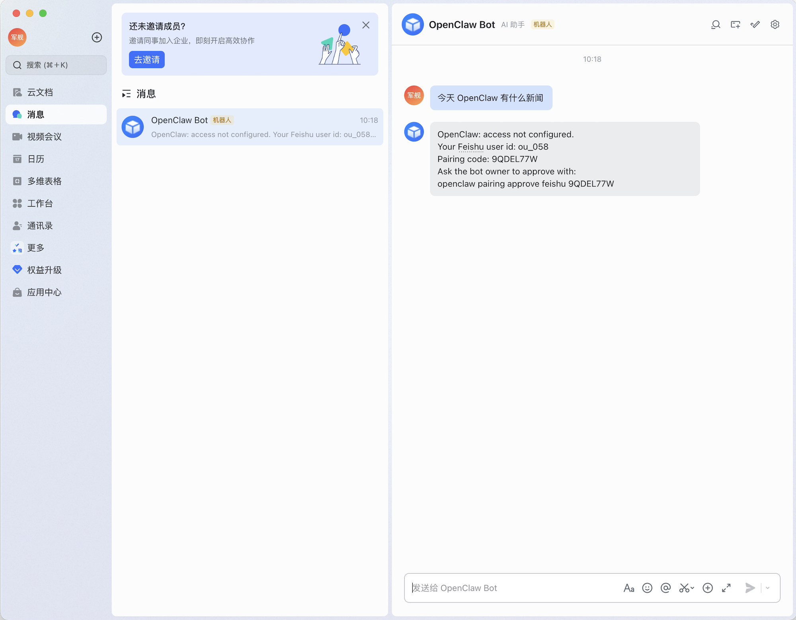
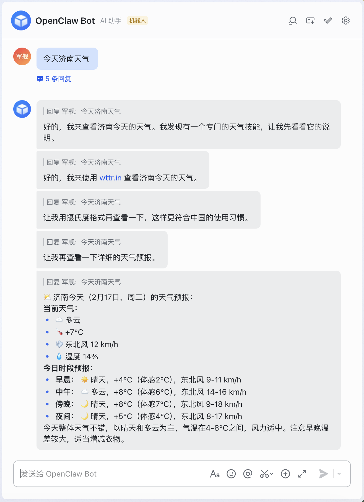

<!--more-->

## OpenClaw

### 安装 OpenClaw

```bash
npm i -g openclaw@latest

openclaw onboard --install-daemon
```

### 卸载 OpenClaw

```bash
npm uninstall -g openclaw
```

### 源代码（开发）

```bash
git clone https://github.com/openclaw/openclaw.git
cd openclaw

pnpm install
pnpm ui:build # auto-installs UI deps on first run
pnpm build

pnpm openclaw onboard --install-daemon

# Dev loop (auto-reload on TS changes)
pnpm gateway:watch
```

### 安装引导

```bash
openclaw onboard --install-daemon
```

```plaintext
🦞 OpenClaw 2026.2.15 (3fe22ea) — Say "stop" and I'll stop—say "ship" and we'll both learn a lesson.

▄▄▄▄▄▄▄▄▄▄▄▄▄▄▄▄▄▄▄▄▄▄▄▄▄▄▄▄▄▄▄▄▄▄▄▄▄▄▄▄▄▄▄▄▄▄▄▄▄▄▄▄
██░▄▄▄░██░▄▄░██░▄▄▄██░▀██░██░▄▄▀██░████░▄▄▀██░███░██
██░███░██░▀▀░██░▄▄▄██░█░█░██░█████░████░▀▀░██░█░█░██
██░▀▀▀░██░█████░▀▀▀██░██▄░██░▀▀▄██░▀▀░█░██░██▄▀▄▀▄██
▀▀▀▀▀▀▀▀▀▀▀▀▀▀▀▀▀▀▀▀▀▀▀▀▀▀▀▀▀▀▀▀▀▀▀▀▀▀▀▀▀▀▀▀▀▀▀▀▀▀▀▀
                  🦞 OPENCLAW 🦞

┌  OpenClaw onboarding
│
◇  Security ──────────────────────────────────────────────────────────────────────────────╮
│                                                                                         │
│  Security warning — please read.                                                        │
│                                                                                         │
│  OpenClaw is a hobby project and still in beta. Expect sharp edges.                     │
│  This bot can read files and run actions if tools are enabled.                          │
│  A bad prompt can trick it into doing unsafe things.                                    │
│                                                                                         │
│  If you’re not comfortable with basic security and access control, don’t run OpenClaw.  │
│  Ask someone experienced to help before enabling tools or exposing it to the internet.  │
│                                                                                         │
│  Recommended baseline:                                                                  │
│  - Pairing/allowlists + mention gating.                                                 │
│  - Sandbox + least-privilege tools.                                                     │
│  - Keep secrets out of the agent’s reachable filesystem.                                │
│  - Use the strongest available model for any bot with tools or untrusted inboxes.       │
│                                                                                         │
│  Run regularly:                                                                         │
│  openclaw security audit --deep                                                         │
│  openclaw security audit --fix                                                          │
│                                                                                         │
│  Must read: https://docs.openclaw.ai/gateway/security                                   │
│                                                                                         │
├─────────────────────────────────────────────────────────────────────────────────────────╯
│
◇  I understand this is powerful and inherently risky. Continue?
│  Yes
│
◇  Onboarding mode
│  QuickStart
│
◇  QuickStart ─────────────────────────╮
│                                      │
│  Gateway port: 18789                 │
│  Gateway bind: Loopback (127.0.0.1)  │
│  Gateway auth: Token (default)       │
│  Tailscale exposure: Off             │
│  Direct to chat channels.            │
│                                      │
├──────────────────────────────────────╯
│
◇  Model/auth provider
│  Custom Provider
│
◇  API Base URL
│  https://ark.cn-beijing.volces.com/api/coding/v3
│
◇  API Key (leave blank if not required)
│  <your-api-key-here>
│
◇  Endpoint compatibility
│  OpenAI-compatible
│
◇  Model ID
│  ark-code-latest
│
◇  Verification successful.
│
◇  Endpoint ID
│  custom-ark-cn-beijing-volces-com
│
◇  Model alias (optional)
│  ark-code-latest
Configured custom provider: custom-ark-cn-beijing-volces-com/ark-code-latest
│
◇  Channel status ────────────────────────────╮
│                                             │
│  Telegram: not configured                   │
│  WhatsApp: not configured                   │
│  Discord: not configured                    │
│  IRC: not configured                        │
│  Google Chat: not configured                │
│  Slack: not configured                      │
│  Signal: not configured                     │
│  iMessage: not configured                   │
│  Feishu: install plugin to enable           │
│  Google Chat: install plugin to enable      │
│  Nostr: install plugin to enable            │
│  Microsoft Teams: install plugin to enable  │
│  Mattermost: install plugin to enable       │
│  Nextcloud Talk: install plugin to enable   │
│  Matrix: install plugin to enable           │
│  BlueBubbles: install plugin to enable      │
│  LINE: install plugin to enable             │
│  Zalo: install plugin to enable             │
│  Zalo Personal: install plugin to enable    │
│  Tlon: install plugin to enable             │
│                                             │
├─────────────────────────────────────────────╯
│
◇  How channels work ─────────────────────────────────────────────────────────────────────╮
│                                                                                         │
│  DM security: default is pairing; unknown DMs get a pairing code.                       │
│  Approve with: openclaw pairing approve <channel> <code>                                │
│  Public DMs require dmPolicy="open" + allowFrom=["*"].                                  │
│  Multi-user DMs: run: openclaw config set session.dmScope "per-channel-peer" (or        │
│  "per-account-channel-peer" for multi-account channels) to isolate sessions.            │
│  Docs: start/pairing                  │
│                                                                                         │
│  Telegram: simplest way to get started — register a bot with @BotFather and get going.  │
│  WhatsApp: works with your own number; recommend a separate phone + eSIM.               │
│  Discord: very well supported right now.                                                │
│  IRC: classic IRC networks with DM/channel routing and pairing controls.                │
│  Google Chat: Google Workspace Chat app with HTTP webhook.                              │
│  Slack: supported (Socket Mode).                                                        │
│  Signal: signal-cli linked device; more setup (David Reagans: "Hop on Discord.").       │
│  iMessage: this is still a work in progress.                                            │
│  Feishu: 飞书/Lark enterprise messaging with doc/wiki/drive tools.                      │
│  Nostr: Decentralized protocol; encrypted DMs via NIP-04.                               │
│  Microsoft Teams: Bot Framework; enterprise support.                                    │
│  Mattermost: self-hosted Slack-style chat; install the plugin to enable.                │
│  Nextcloud Talk: Self-hosted chat via Nextcloud Talk webhook bots.                      │
│  Matrix: open protocol; install the plugin to enable.                                   │
│  BlueBubbles: iMessage via the BlueBubbles mac app + REST API.                          │
│  LINE: LINE Messaging API bot for Japan/Taiwan/Thailand markets.                        │
│  Zalo: Vietnam-focused messaging platform with Bot API.                                 │
│  Zalo Personal: Zalo personal account via QR code login.                                │
│  Tlon: decentralized messaging on Urbit; install the plugin to enable.                  │
│                                                                                         │
├─────────────────────────────────────────────────────────────────────────────────────────╯
│
◇  Select channel (QuickStart)
│  Feishu/Lark (飞书)
│
◇  Use local plugin path instead? (/Users/junjian/GitHub/openclaw/extensions/feishu)
│  Yes
│
◇  Feishu credentials ──────────────────────────────────────────────────────────────╮
│                                                                                   │
│  1) Go to Feishu Open Platform (open.feishu.cn)                                   │
│  2) Create a self-built app                                                       │
│  3) Get App ID and App Secret from Credentials page                               │
│  4) Enable required permissions: im:message, im:chat, contact:user.base:readonly  │
│  5) Publish the app or add it to a test group                                     │
│  Tip: you can also set FEISHU_APP_ID / FEISHU_APP_SECRET env vars.                │
│  Docs: feishu                 │
│                                                                                   │
├───────────────────────────────────────────────────────────────────────────────────╯
│
◇  Enter Feishu App ID
│  <your-app-id-here>
│
◇  Enter Feishu App Secret
│  <your-app-secret-here>
[info]: [ 'client ready' ]
│
◇  Feishu connection test ───────────────────────────╮
│                                                    │
│  Connected as ou_xxx                               │
│                                                    │
├────────────────────────────────────────────────────╯
│
◇  Which Feishu domain?
│  Feishu (feishu.cn) - China
│
◇  Group chat policy
│  Open - respond in all groups (requires mention)
[info]: [ 'client ready' ]
│
◇  Selected channels ──────────────────────────────────────────╮
│                                                              │
│  Feishu — 飞书/Lark enterprise messaging. Docs:              │
│  feishu  │
│                                                              │
├──────────────────────────────────────────────────────────────╯
Updated ~/.openclaw/openclaw.json
Workspace OK: ~/.openclaw/workspace
Sessions OK: ~/.openclaw/agents/main/sessions
│
◇  Skills status ─────────────╮
│                             │
│  Eligible: 12               │
│  Missing requirements: 41   │
│  Unsupported on this OS: 0  │
│  Blocked by allowlist: 0    │
│                             │
├─────────────────────────────╯
│
◇  Configure skills now? (recommended)
│  Yes
│
◇  Install missing skill dependencies
│  📝 apple-notes, ⏰ apple-reminders, 🧩 clawhub, 📦 mcporter, 🧾 summarize
│
◆  Preferred node manager for skill installs
│  npm
│
Tip: run `openclaw doctor` to review skills + requirements.
Docs: https://docs.openclaw.ai/skills
│
◇  Installed apple-notes
│
◇  Installed apple-reminders
│
◇  Installed summarize
│
◇  Set GOOGLE_PLACES_API_KEY for goplaces?
│  No
│
◇  Set GEMINI_API_KEY for nano-banana-pro?
│  No
│
◇  Set NOTION_API_KEY for notion?
│  No
│
◇  Set OPENAI_API_KEY for openai-image-gen?
│  No
│
◇  Set OPENAI_API_KEY for openai-whisper-api?
│  No
│
◇  Set ELEVENLABS_API_KEY for sag?
│  No
│
◇  Hooks ──────────────────────────────────────────────────────────╮
│                                                                  │
│  Hooks let you automate actions when agent commands are issued.  │
│  Example: Save session context to memory when you issue /new.    │
│                                                                  │
│  Learn more: https://docs.openclaw.ai/automation/hooks           │
│                                                                  │
├──────────────────────────────────────────────────────────────────╯
│
◆  Enable hooks?
│  💾 session-memory
│
◇  Hooks Configured ─────────────────╮
│                                    │
│  Enabled 1 hook: session-memory    │
│                                    │
│  You can manage hooks later with:  │
│    openclaw hooks list             │
│    openclaw hooks enable <name>    │
│    openclaw hooks disable <name>   │
│                                    │
├────────────────────────────────────╯
│
◇  Gateway service runtime ────────────────────────────────────────────╮
│                                                                      │
│  QuickStart uses Node for the Gateway service (stable + supported).  │
│                                                                      │
├──────────────────────────────────────────────────────────────────────╯
│
│
◇  Gateway runtime ──────────────────────────────────────────────────────────────────────╮
│                                                                                        │
│  System Node unknown at /opt/homebrew/bin/node is below the required Node 22+. Using   │
│  /Users/junjian/.nvm/versions/node/v22.17.0/bin/node for the daemon. Install Node 22+  │
│  from nodejs.org or Homebrew.                                                          │
│                                                                                        │
├────────────────────────────────────────────────────────────────────────────────────────╯
◒  Installing Gateway service…...
Installed LaunchAgent: /Users/junjian/Library/LaunchAgents/ai.openclaw.gateway.plist
Logs: /Users/junjian/.openclaw/logs/gateway.log
◇  Gateway service installed.
│
◇
Feishu: ok
Agents: main (default)
Heartbeat interval: 30m (main)
Session store (main): /Users/junjian/.openclaw/agents/main/sessions/sessions.json (0 entries)
│
◇  Optional apps ────────────────────────╮
│                                        │
│  Add nodes for extra features:         │
│  - macOS app (system + notifications)  │
│  - iOS app (camera/canvas)             │
│  - Android app (camera/canvas)         │
│                                        │
├────────────────────────────────────────╯
│
◇  Control UI ─────────────────────────────────────────────────────────────────────╮
│                                                                                  │
│  Web UI: http://127.0.0.1:18789/                                                 │
│  Web UI (with token):                                                            │
│  http://127.0.0.1:18789/#token=xxx                                               │
│  Gateway WS: ws://127.0.0.1:18789                                                │
│  Gateway: reachable                                                              │
│  Docs: https://docs.openclaw.ai/web/control-ui                                   │
│                                                                                  │
├──────────────────────────────────────────────────────────────────────────────────╯
│
◇  Start TUI (best option!) ─────────────────────────────────╮
│                                                            │
│  This is the defining action that makes your agent you.    │
│  Please take your time.                                    │
│  The more you tell it, the better the experience will be.  │
│  We will send: "Wake up, my friend!"                       │
│                                                            │
├────────────────────────────────────────────────────────────╯
│
◇  Token ─────────────────────────────────────────────────────────────────────────────────╮
│                                                                                         │
│  Gateway token: shared auth for the Gateway + Control UI.                               │
│  Stored in: ~/.openclaw/openclaw.json (gateway.auth.token) or OPENCLAW_GATEWAY_TOKEN.   │
│  View token: openclaw config get gateway.auth.token                                     │
│  Generate token: openclaw doctor --generate-gateway-token                               │
│  Web UI stores a copy in this browser's localStorage (openclaw.control.settings.v1).    │
│  Open the dashboard anytime: openclaw dashboard --no-open                               │
│  If prompted: paste the token into Control UI settings (or use the tokenized dashboard  │
│  URL).                                                                                  │
│                                                                                         │
├─────────────────────────────────────────────────────────────────────────────────────────╯
│
◆  How do you want to hatch your bot?
│  Hatch in TUI (recommended)
│  openclaw tui - ws://127.0.0.1:18789 - agent main - session main
│
│  session agent:main:main
│
│
│  Wake up, my friend!
│
│  ⠙ kerfuffling… • 30s | connected
│  agent main | session main | unknown | tokens ?/4.1k
───────────────────────────────────────────────────────────────────────────────────────────
```

### Agent 重新加载

当你修改了配置文件可以运行下面的命令：

```bash
openclaw agent reload
```

### 绑定命令

```bash
openclaw pairing approve feishu 9QDEL77W
```
```bash
openclaw pairing approve feishu 9QDEL77W
03:55:27 [plugins] feishu_doc: Registered feishu_doc, feishu_app_scopes
03:55:27 [plugins] feishu_wiki: Registered feishu_wiki tool
03:55:27 [plugins] feishu_drive: Registered feishu_drive tool
03:55:27 [plugins] feishu_bitable: Registered 6 bitable tools

🦞 OpenClaw 2026.2.15 (3fe22ea) — Your task has been queued; your dignity has been deprecated.

Approved feishu sender ou_0580...
```


## 火山引擎

### Coding Plan 套餐

- [开通管理页面](https://console.volcengine.com/ark/region:ark+cn-beijing/openManagement?LLM=%7B%7D&advancedActiveKey=subscribe)


- [API Key 管理](https://console.volcengine.com/ark/region:ark+cn-beijing/apiKey?apikey=%7B%7D)


- [模型配置](https://www.volcengine.com/docs/82379/1928261?lang=zh)

### [一键部署 OpenClaw](https://www.volcengine.com/activity/clawdbot)


## [飞书开放平台](https://open.feishu.cn)

- [快速部署OpenClaw（原Moltbot），集成飞书AI助手](https://www.volcengine.com/docs/6396/2189942?lang=zh)

### 创建应用（机器人）


### 事件与回调

#### 事件配置


#### 回调配置


### 获取 App ID 和 App Secret


### 发布应用


## [飞书](https://www.feishu.cn/)

### 绑定 OpenClaw 与飞书



执行绑定命令：

```bash
openclaw pairing approve feishu 9QDEL77W
```

### 测试聊天



📌 **我在试用的过程中不是很稳定**：

- 有时发的消息没有反应。
- 经常弹出让我重新授权的提示。


## Claude Code

### 安装

```bash
npm install -g @anthropic-ai/claude-code
```

### 更新

```bash
claude update 
```

### 配置

**文件**：`~/.claude/settings.json`

#### 火山方舟大模型服务平台（Coding Plan）

```bash
{
  "env": {
    "ANTHROPIC_BASE_URL": "https://ark.cn-beijing.volces.com/api/coding",
    "ANTHROPIC_AUTH_TOKEN": "",
    "ANTHROPIC_MODEL": "doubao-seed-2.0-code",
    "CLAUDE_CODE_DISABLE_NONESSENTIAL_TRAFFIC": "1"
  },
  "alwaysThinkingEnabled": false
}
```

- doubao-seed-2.0-code
- kimi-k2.5
- glm-4.7
- doubao-seed-code
- deepseek-v3.2

#### 智谱

```bash
{
  "env": {
    "ANTHROPIC_BASE_URL": "https://open.bigmodel.cn/api/anthropic",
    "ANTHROPIC_AUTH_TOKEN": "",
    "ANTHROPIC_MODEL": "glm-4.5",
    "ANTHROPIC_SMALL_FAST_MODEL": "glm-4.5"
  },
  "alwaysThinkingEnabled": false
}
```

### 切换模型

**使用命令**：`/model <model-name>`


## FAQ
### 打开 Control UI 时提示 "disconnected (1008): unauthorized: device token mismatch"


1. 初始错误

disconnected (1008): unauthorized: device token mismatch

原因：浏览器缓存了旧的/无效的设备令牌，与网关存储的令牌不匹配。

2. 探索代码

通过探索代码库，找到了相关的核心模块：
- src/infra/device-pairing.ts - 设备配对和令牌管理
- src/gateway/auth.ts - 网关认证
- src/cli/devices-cli.ts - 设备管理 CLI

3. 检查配置

查看 ~/.openclaw/openclaw.json 后发现关键信息：

```json
  "gateway": {
    "auth": {
      "mode": "token",
      "token": "xxx"
    }
  }
```

重要发现：网关使用的是 token 认证模式，而不是设备配对模式！

4. 解决方案

使用 openclaw dashboard 命令，它会自动生成带 token 的 URL：
http://127.0.0.1:18789/#token=xxx

关键要点

```plaintext
┌────────────────┬────────────────────────────┐
│     配置项      │             值             │
├────────────────┼────────────────────────────┤
│ 网关认证模式     │ token（不是 device-token）  │
├────────────────┼────────────────────────────┤
│ 网关端口        │ 18789                      │
├────────────────┼────────────────────────────┤
│ Dashboard 命令  │ pnpm openclaw dashboard    │
└────────────────┴────────────────────────────┘
```

运行命令：

```bash
openclaw dashboard
```
```plaintext
🦞 OpenClaw 2026.2.15 (3fe22ea) — I can run local, remote, or purely on vibes—results may vary with DNS.

Dashboard URL: http://127.0.0.1:18789/#token=xxx
Copied to clipboard.
Opened in your browser. Keep that tab to control OpenClaw.
```


## 参考资料
- [快速部署OpenClaw（原Moltbot），集成飞书AI助手](https://www.volcengine.com/docs/6396/2189942?lang=zh)
- [快速部署OpenClaw（原Moltbot），集成企业微信AI助手](https://www.volcengine.com/docs/6396/2201644?lang=zh)
- [快速部署OpenClaw（原Moltbot），集成钉钉AI助手](https://www.volcengine.com/docs/6396/2197080?lang=zh)
- [快速部署OpenClaw（原Moltbot），集成QQ AI助手](https://www.volcengine.com/docs/6396/2202577?lang=zh)
