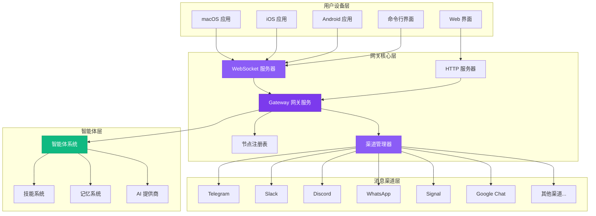
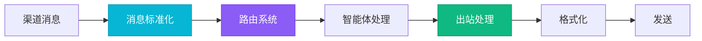
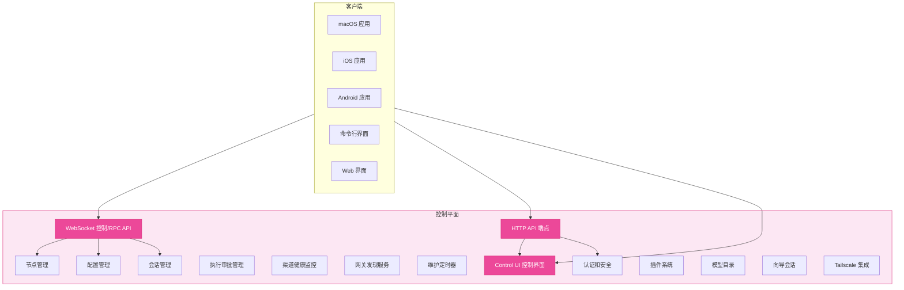
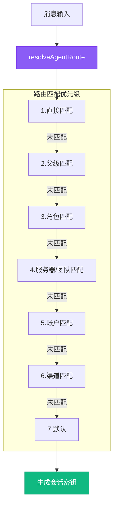
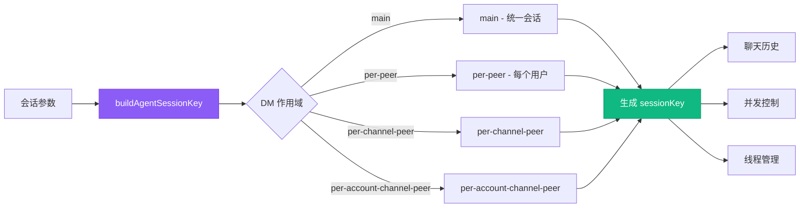
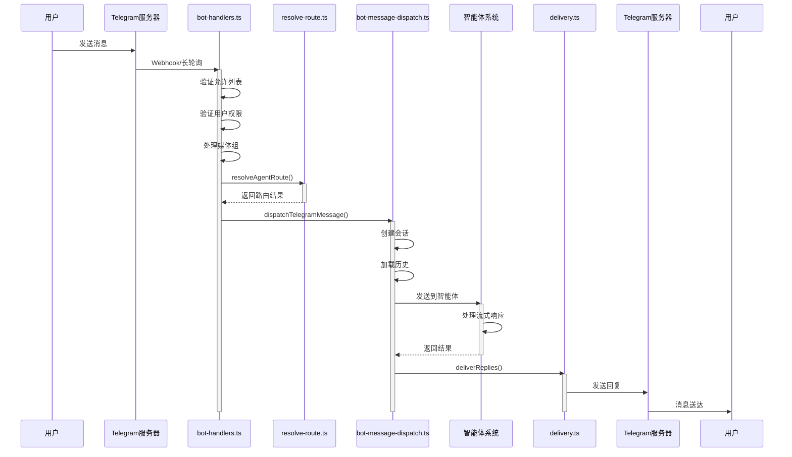
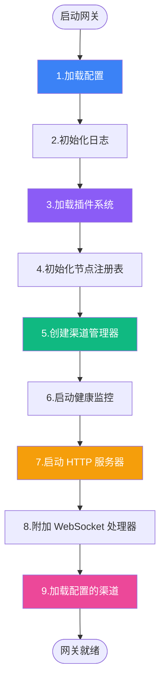
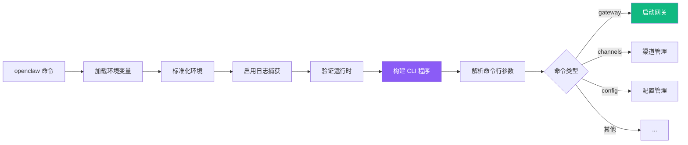

<!--more-->

## 目录

* 概览
* 核心组件
* 控制平面
* 网关协议
* 消息路由
* 消息流程
* 启动流程

---

## 概览

OpenClaw 是一个多渠道 AI 助手网关，设计用于在用户自己的设备上运行。它采用单一网关 + 多客户端/节点模型，支持 WhatsApp、Telegram、Slack、Discord、Google Chat、Signal、iMessage 等多种通信渠道。

### 核心结构

| 组件 | 描述 |
| --- | --- |
| **🌐 Gateway（网关）** | 长期运行的守护进程，管理所有消息平台连接和智能体通信 |
| **💻 Clients（客户端）** | 控制平面应用（macOS 应用、CLI、Web 界面） |
| **📱 Nodes（节点）** | 设备节点，提供硬件能力（macOS/iOS/Android/无头设备） |

### 整体架构



### 架构原则

* **每台主机一个网关实例**: 单一职责，避免会话冲突
* **所有通信通过 WebSocket**: 使用类型化 API，支持双向通信
* **网关唯一管理平台连接**: 避免重复登录，统一状态管理
* **支持多种客户端节点**: 通过相同的 WebSocket 协议通信

---

## 核心组件

### 🎛️ Gateway Server（网关服务器）

网关的核心实现，负责协调所有子系统。
`位置: src/gateway/server.impl.ts`

* **主要职责**:
* HTTP 和 WebSocket 服务
* 节点管理和配对
* 渠道生命周期管理
* 智能体会话协调


* **关键子系统**:
* 节点注册表
* 渠道管理器
* 会话管理器
* 健康监控器


### 📡 Channel Manager（渠道管理器）

管理所有消息渠道的生命周期，包括启动、停止、健康检查。
`位置: src/gateway/server-channels.ts`

**支持的渠道**: WhatsApp, Telegram, Discord, Slack, Signal, iMessage, Google Chat, WebChat

### 🔌 渠道适配器模式

每个渠道都实现统一的适配器接口，实现消息的标准化处理。
`位置: src/channels/plugins/`



**ChannelOutboundAdapter 接口定义**:

```typescript
type ChannelOutboundAdapter = {
  deliveryMode: "direct" | "queue";
  chunker: (text: string) => string[];
  chunkerMode: "markdown" | "text";
  textChunkLimit: number;
  sendText: (params: SendTextParams) => Promise<SendResult>;
  sendMedia: (params: SendMediaParams) => Promise<SendResult>;
  sendPayload: (params: SendPayloadParams) => Promise<SendResult>;
};

```

### 🤖 Agent System（智能体系统）

基于 `@mariozechner/pi-agent-core` 构建，提供 AI 智能体执行和工具使用能力。
`位置: src/agents/`

* **智能体类型**: 内置智能体、自定义智能体、子智能体
* **核心功能**: 代码评估、依赖安装、沙箱执行、结果处理
* **技能系统**: 技能发现、版本管理、依赖解析、技能命令

### 📋 Node Registry（节点注册表）

管理所有连接的设备节点，处理配对和认证。
`位置: src/gateway/node-registry.ts`

* **节点类型**: macOS, iOS, Android, 无头设备

---

## 控制平面

控制平面是网关的管理和协调层，负责客户端连接、配置管理、节点管理、渠道生命周期管理、智能体交互协调和安全认证。所有这些组件都在同一个网关进程中运行，通过单一端口（默认 18789）提供服务。
`核心位置: src/gateway/`



### 控制平面核心组件

1. **WebSocket 控制/RPC API**: 提供 JSON-RPC 风格 API (`src/gateway/server-ws-runtime.ts`)
2. **Control UI**: 提供 Web 界面 (`src/gateway/control-ui.ts`)
3. **HTTP API Endpoints**: 提供 HTTP 接口 (`src/gateway/server-http.ts`)
4. **节点管理**: 配对、认证 (`src/gateway/node-registry.ts`)
5. **配置管理**: 热重载 (`src/gateway/config-reload.ts`)

---

## 网关协议

OpenClaw 使用基于 WebSocket 的自定义协议，所有通信通过类型化的 JSON 消息进行。
`位置: src/gateway/protocol/`

* **协议特性**: JSON 文本帧传输、TypeBox 模式验证、请求/响应/事件帧类型
* **帧结构**: `EventFrame`, `RequestFrame`, `ResponseFrame`, `ErrorShape`

### 协议方法分类

| 类别 | 方法 | 描述 |
| --- | --- | --- |
| **系统** | `health`, `status`, `config.*` | 健康检查、状态查询、配置管理 |
| **消息** | `send`, `chat.*` | 发送消息、聊天管理 |
| **智能体** | `agent.*`, `agents.*` | 智能体交互、管理 |
| **渠道** | `channels.*` | 渠道状态、管理 |
| **技能** | `skills.*` | 技能管理 |
| **节点** | `node.*`, `device.*` | 节点控制、设备管理 |

---

## 消息路由系统

路由系统负责将传入消息映射到适当的智能体会话，支持复杂的匹配规则。
`位置: src/routing/resolve-route.ts`

<div align="center">



</div>

### 会话密钥系统

会话密钥用于持久化聊天历史、并发控制和线程管理。
`位置: src/gateway/session-utils.ts`



---

## 消息流程

以 Telegram 为例，展示从消息接收到回复发送的完整流程。



---

## 启动流程

网关启动时初始化所有核心服务和子系统。
`位置: src/gateway/server.impl.ts`

<div align="center">



</div>

### CLI 启动流程

`位置: src/cli/run-main.ts`



---

## 关键架构文件总结

| 文件/目录 | 描述 |
| --- | --- |
| `src/gateway/server.impl.ts` | 网关核心实现 |
| `src/gateway/server-chat.ts` | 聊天管理 |
| `src/gateway/server-channels.ts` | 渠道管理 |
| `src/gateway/protocol/` | 协议定义 |
| `src/routing/resolve-route.ts` | 路由逻辑 |
| `src/channels/plugins/` | 渠道适配器 |
| `src/telegram/bot-handlers.ts` | Telegram 渠道实现 |
| `src/cli/program/` | CLI 架构 |
| `src/agents/` | 智能体系统 |
