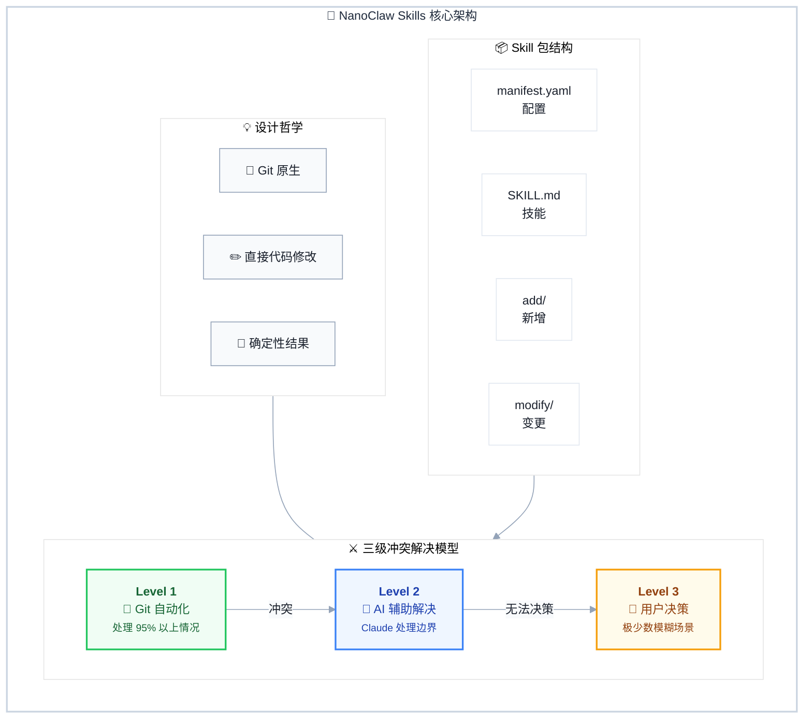

**NanoClaw 架构**的核心洞察是：**与其构建复杂的插件 API 来限制扩展的能力，不如利用 Git 的成熟合并机制来安全地组合任意代码变更。** AI（Claude Code）只在 Git 无法自动解决冲突时才介入，而且**解决方案会被缓存（git rerere）以便下次自动应用**。这使得大多数用户永远不会遇到未解决的冲突，同时保留了**无限的定制能力**。

<!--more-->

**提示词（Kimi-2.5 Agent）**：
> 我没有理解 NanoClaw 这里的架构设计，结合源代码（https://github.com/qwibitai/nanoclaw ）仔细研究一下，给我讲明白。

---





## 一、项目定位：什么是 NanoClaw？

NanoClaw 是一个**个人 Claude 助手**，通过 WhatsApp 访问，具有以下特性：
- 持久化记忆（按对话分组）
- 定时任务调度
- 容器隔离执行环境
- 基于 Anthropic Claude Agent SDK

它的设计哲学是 **"小到可以理解"** ——整个代码库应该可以被一个人阅读和掌握，而不是像 OpenClaw 那样变成复杂的微服务架构。

---

## 二、核心架构：双层隔离模型

```
┌─────────────────────────────────────────────────────────────────────┐
│                        HOST (macOS)                                 │
│                   (主 Node.js 进程 - 可信区域)                        │
├─────────────────────────────────────────────────────────────────────┤
│  ┌──────────────┐                     ┌────────────────────┐        │
│  │  WhatsApp    │────────────────────▶│   SQLite Database  │        │
│  │  (baileys)   │◀────────────────────│   (messages.db)    │        │
│  └──────────────┘   存储/发送          └─────────┬──────────┘        │
│                                                 │                   │
│         ┌───────────────────────────────────────┘                   │
│         │                                                           │
│         ▼                                                           │
│  ┌──────────────────┐    ┌──────────────────┐    ┌───────────────┐  │
│  │  消息轮询循环      │    │  调度器循环       │     │  IPC 监视器    │  │
│  │  (轮询 SQLite)    │    │  (检查任务)       │    │  (基于文件)    │  │
│  └────────┬─────────┘    └────────┬─────────┘    └───────────────┘  │
│           │                       │                                 │
│           └───────────┬───────────┘                                 │
│                       │ 生成容器                                     │
│                       ▼                                             │
├─────────────────────────────────────────────────────────────────────┤
│                     CONTAINER (Linux VM)                            │
│                      (隔离/沙盒区域 - 不可信)                          │
├─────────────────────────────────────────────────────────────────────┤
│  ┌──────────────────────────────────────────────────────────────┐   │
│  │                    AGENT RUNNER (代理运行器)                   │   │
│  │  • 工作目录: /workspace/group (从主机挂载)                      │   │
│  │  • 工具: Bash (安全 - 在容器中沙盒化!)                           │   │
│  │  • 文件操作: Read, Write, Edit, Glob, Grep                    │   │
│  │  • 网络: WebSearch, WebFetch, agent-browser                  │   │
│  │  • MCP 工具: nanoclaw 调度器工具                               │   │
│  └──────────────────────────────────────────────────────────────┘   │
└─────────────────────────────────────────────────────────────────────┘
```

**安全边界设计：**

| 层级 | 信任级别 | 说明 |
|------|---------|------|
| 主机进程 (Host) | **可信** | 处理消息路由、IPC 授权、挂载验证 |
| 容器 (Container) | **沙盒/隔离** | 代理执行、Bash 命令、文件操作 |

---

## 三、Skills 系统：NanoClaw 的革命性设计

这是 NanoClaw 最独特的架构创新——**Skills（技能）系统**。

### 3.1 核心思想

> **Skills 是自包含的、可审计的包，通过标准 Git 合并机制以编程方式应用。**

传统插件系统的限制：
- 插件 API 限制了功能
- 运行时钩子有性能开销
- 难以处理代码冲突

NanoClaw 的解决方案：**直接修改代码库**，但使用 Git 的三向合并机制来安全地组合多个技能。

### 3.2 三级冲突解决模型

```
┌─────────────────────────────────────────────────────────────────┐
│                    三级冲突解决模型                                │
├─────────────────────────────────────────────────────────────────┤
│                                                                 │
│  Level 1: Git (确定性、程序化)                                    │
│  ├── git merge-file 执行三向合并                                  │
│  ├── git rerere 重放缓存的解决方案                                 │
│  └── 结构化操作直接应用（无合并）                                    │
│  → 处理绝大多数情况，无 AI 参与                                     │
│                                                                 │
│  Level 2: Claude Code (AI 辅助)                                  │
│  ├── 读取 SKILL.md、.intent.md、state.yaml 理解上下文              │
│  ├── 解决 Git 无法处理的冲突                                       │
│  └── 通过 git rerere 缓存解决方案                                  │
│  → 处理首次冲突和边界情况                                           │
│                                                                 │
│  Level 3: 用户 (人工决策)                                         │
│  ├── 当 Claude Code 缺乏上下文时询问用户                            │
│  └── 两个功能在应用层面真正冲突时需要人工决策                          │
│  → 罕见，仅用于真正的模糊性                                         │
│                                                                 │
└─────────────────────────────────────────────────────────────────┘
```

### 3.3 Skill 包结构

```
skills/add-whatsapp/
├── SKILL.md                          # 上下文、意图、技能说明
├── manifest.yaml                     # 元数据、依赖、环境变量
├── tests/                            # 集成测试
│   └── whatsapp.test.ts
├── add/                              # 新增文件 - 直接复制
│   └── src/channels/whatsapp.ts
└── modify/                           # 修改的代码文件 - 三向合并
    └── src/
        ├── server.ts                 # 完整文件：干净核心 + WhatsApp 修改
        ├── server.ts.intent.md       # "添加 WhatsApp webhook 路由..."
        ├── config.ts                 # 完整文件：干净核心 + WhatsApp 配置
        └── config.ts.intent.md       # "添加 WhatsApp 频道配置块..."
```

**为什么使用完整修改文件？**

1. `git merge-file` 需要三个完整文件——没有中间重建步骤
2. Git 的三向合并使用上下文匹配，即使用户移动了代码也能工作
3. 可审计：`diff .nanoclaw/base/src/server.ts skills/add-whatsapp/modify/src/server.ts` 精确显示技能更改了什么
4. 确定性：相同的三输入总是产生相同的合并结果

### 3.4 两种变更类型

| 类型 | 处理方式 | 示例 |
|------|---------|------|
| **代码文件** | 三向合并 (`git merge-file`) | `src/server.ts`, `src/config.ts` |
| **结构化数据** | 确定性操作（无合并） | `package.json`, `docker-compose.yml`, `.env.example` |

**结构化操作示例：**

```yaml
# manifest.yaml
structured:
  npm_dependencies:
    whatsapp-web.js: "^2.1.0"
    qrcode-terminal: "^0.12.0"
  env_additions:
    - WHATSAPP_TOKEN
    - WHATSAPP_VERIFY_TOKEN
    - WHATSAPP_PHONE_ID
  docker_compose_services:
    whatsapp-redis:
      image: redis:alpine
      ports: ["6380:6379"]
```

### 3.5 共享基础 (Shared Base)

```
.nanoclaw/
├── base/                    # 干净的核心代码（所有三向合并的共同祖先）
│   └── src/
│       ├── server.ts
│       ├── config.ts
│       └── ...
├── backup/                  # 操作前备份
├── resolutions/             # 预计算的冲突解决方案缓存
└── state.yaml               # 完整状态记录
```

**Base 的作用：**
- 作为三向合并的共同祖先
- 支持漂移检测（文件哈希与 base 哈希比较）
- 仅在核心更新时变化

---

## 四、Skill 应用流程（Apply Flow）

```
┌─────────────────────────────────────────────────────────────────────┐
│                        Skill 应用流程                                │
├─────────────────────────────────────────────────────────────────────┤
│                                                                     │
│  1. 预检检查                                                         │
│     ├── 核心版本兼容性                                                │
│     ├── 依赖满足                                                     │
│     └── 检查未跟踪的更改                                              │
│                                                                     │
│  2. 备份                                                             │
│     └── 复制所有将被修改的文件到 .nanoclaw/backup/                      │
│                                                                     │
│  3. 文件操作（重命名/删除/移动）                                        │
│     └── 在代码合并前执行                                               │
│                                                                     │
│  4. 复制新增文件                                                      │
│     └── cp skills/add-whatsapp/add/* .                              │
│                                                                     │
│  5. 合并修改的代码文件                                                 │
│     └── git merge-file current.ts base.ts skill.ts                  │
│         ├── 退出码 0: 干净合并 → 继续                                  │
│         └── 退出码 >0: 冲突标记 → 进入解决流程                          │
│                                                                     │
│  6. 冲突解决（三级）                                                  │
│     ├── 检查共享解决方案缓存（哈希验证）                                 │
│     ├── git rerere 本地缓存                                          │
│     ├── Claude Code 读取 SKILL.md + .intent.md 解决                  │
│     └── 用户决策（真正的模糊性）                                        │
│                                                                     │
│  7. 应用结构化操作（批量）                                              │
│     ├── 合并 npm 依赖 → 写入 package.json                             │
│     ├── 追加环境变量 → 写入 .env.example                               │
│     ├── 合并 docker-compose 服务                                     │
│     └── 运行 npm install（仅一次）                                    │
│                                                                     │
│  8. 后应用和验证                                                      │
│     ├── 运行 post_apply 命令                                          │
│     ├── 更新 state.yaml                                              │
│     └── 运行技能测试（强制！）                                          │
│                                                                     │
│  9. 清理                                                             │
│     └── 测试通过 → 删除备份                                            │
│                                                                     │
└─────────────────────────────────────────────────────────────────────┘
```

**重要原则：干净合并 ≠ 工作代码**

测试必须在每次操作后运行，因为语义冲突（重命名的变量、改变的函数签名）可能产生干净的文本合并但在运行时失败。

---

## 五、核心更新机制

### 5.1 迁移技能 (Migration Skills)

当核心有破坏性变更时，不是让用户手动处理，而是提供**迁移技能**自动保留旧行为：

```yaml
# migrations.yaml
- since: 0.6.0
  skill: apple-containers@1.0.0
  description: "Preserves Apple Containers (default changed to Docker in 0.6)"

- since: 0.7.0
  skill: add-whatsapp@2.0.0
  description: "Preserves WhatsApp (moved from core to skill in 0.7)"
```

**更新流程：**

1. 三向合并引入新核心的一切（补丁、破坏性变更）
2. 冲突解决（正常）
3. 重新应用自定义补丁
4. **更新 base 到新核心**
5. 应用迁移技能（使用正常的应用流程）
6. 重新应用更新的技能
7. 运行所有测试

用户看到的效果：
```
Core updated: 0.5.0 → 0.8.0
  ✓ All patches applied

  Preserving your current setup:
    + apple-containers@1.0.0
    + add-whatsapp@2.0.0
    + legacy-auth@1.0.0

  Skill updates:
    ✓ add-telegram 1.0.0 → 1.2.0

  ✓ All tests passing
```

**无需提示，无需选择。** 用户的设置不会改变。如果他们想要接受新默认值，稍后移除迁移技能即可。

---

## 六、状态追踪 (State Tracking)

`.nanoclaw/state.yaml` 记录安装的完整状态：

```yaml
skills_system_version: "0.1.0"
core_version: 0.1.0

applied_skills:
  - name: telegram
    version: 1.0.0
    applied_at: 2026-02-16T22:47:02.139Z
    file_hashes:
      src/channels/telegram.ts: "f627b9cf..."
      src/config.ts: "9ae28d1f..."
    structured_outcomes:
      npm_dependencies:
        grammy: "^1.39.3"
      env_additions:
        - TELEGRAM_BOT_TOKEN

  - name: discord
    version: 1.0.0
    applied_at: 2026-02-17T17:29:37.821Z
    file_hashes:
      src/channels/discord.ts: "5d669123..."
    custom_patch: .nanoclaw/custom/discord-group-only.patch
    custom_patch_description: "Restrict bot responses to group chats only"

custom_modifications:
  - description: "Added custom logging middleware"
    applied_at: 2026-02-15T12:00:00Z
    files_modified:
      - src/server.ts
    patch_file: .nanoclaw/custom/001-logging-middleware.patch
```

---

## 七、重放 (Replay) 和卸载

**卸载技能**不是反向补丁操作，而是**重放（Replay）**：

1. 读取 `state.yaml` 获取已应用的技能和自定义修改
2. 从列表中移除目标技能
3. 备份当前代码库
4. **从干净基础重放**——按顺序应用每个剩余技能
5. 运行所有测试
6. 测试通过 → 删除备份并更新 `state.yaml`

**重放（给定 `state.yaml`，在新机器上重现精确安装）：**

```bash
# 完全程序化——无需 Claude Code

# 1. 安装指定版本的核心
nanoclaw-init --version 0.5.0

# 2. 加载共享解决方案到本地 rerere 缓存
load-resolutions .nanoclaw/resolutions/

# 3. 按顺序应用每个技能
for skill in state.applied_skills:
  apply_file_ops(skill)
  cp skills/${skill.name}/add/* .
  git merge-file ...  # rerere 自动解决
  if skill.custom_patch:
    git apply --3way ${skill.custom_patch}

# 4. 批量应用结构化操作
collect_all_structured_ops(...)
npm install once

# 5. 运行测试并验证哈希
run_tests && verify_hashes
```

---

## 八、关键代码实现

### 8.1 三向合并 (merge.ts)

```typescript
export function mergeFile(
  currentPath: string,
  basePath: string,
  skillPath: string,
): MergeResult {
  try {
    execFileSync('git', ['merge-file', currentPath, basePath, skillPath], {
      stdio: 'pipe',
    });
    return { clean: true, exitCode: 0 };
  } catch (err: any) {
    const exitCode = err.status ?? 1;
    if (exitCode > 0) {
      // 正退出码 = 冲突数量
      return { clean: false, exitCode };
    }
    throw new Error(`git merge-file failed: ${err.message}`);
  }
}
```

### 8.2 rerere 适配器

`git rerere` 需要未合并的索引条目（stages 1/2/3）来检测冲突，但 `git merge-file` 只操作文件系统而不接触索引。因此需要一个适配器：

```typescript
export function setupRerereAdapter(
  filePath: string,
  baseContent: string,
  oursContent: string,
  theirsContent: string,
): void {
  if (!isGitRepo()) return;

  // 为三个版本创建 blob 对象
  const baseHash = execSync(`git hash-object -w --stdin`, {
    input: baseContent,
    encoding: 'utf-8',
  }).trim();
  // ... 同样处理 ours 和 theirs

  // 在 stages 1 (base), 2 (ours), 3 (theirs) 创建未合并的索引条目
  execSync(`git update-index --index-info`, {
    input: `100644 ${baseHash} 1\t${filePath}\n` +
           `100644 ${oursHash} 2\t${filePath}\n` +
           `100644 ${theirsHash} 3\t${filePath}\n`,
  });

  // 设置合并状态（rerere 检查 MERGE_HEAD）
  fs.writeFileSync(path.join(gitDir, 'MERGE_HEAD'), head);
  fs.writeFileSync(path.join(gitDir, 'MERGE_MSG'), 'skill merge');
}
```

---

## 九、设计原则总结

| 原则 | 说明 |
|------|------|
| **使用 Git，不要重新发明** | 利用 `merge-file`、`rerere`、`apply` 等现有功能 |
| **三级解决** | Git → Claude Code → 用户 |
| **干净合并不够** | 每次操作后必须运行测试 |
| **所有操作都安全** | 备份/恢复，无半应用状态 |
| **一个共享基础** | 仅在核心更新时更新 |
| **代码合并 vs 结构化操作** | 源代码合并；配置聚合 |
| **解决方案可学习和共享** | 带哈希验证的共享缓存 |
| **一个技能，一个快乐路径** | 定制是更多的补丁 |
| **技能分层和组合** | 通过 `depends` 构建 |
| **意图是一流的** | 结构化的 `.intent.md` |
| **状态是显式和完整的** | 重放是确定性的 |
| **总是可恢复** | 三级模型可以从任何起点恢复 |
| **卸载是重放** | 不是反向补丁 |
| **核心更新是维护者的责任** | 破坏性变更需要迁移技能 |

---

## 十、对比传统插件系统

| 方面 | 传统插件系统 | NanoClaw Skills |
|------|-------------|-----------------|
| **扩展方式** | 运行时 API 钩子 | 直接代码修改 |
| **功能限制** | 受 API 约束 | 无限制（可修改任何代码） |
| **组合多个扩展** | 复杂，容易冲突 | Git 三向合并天然支持 |
| **核心更新兼容性** | 容易破坏 | 迁移技能自动保留行为 |
| **审计性** | 运行时黑盒 | 代码变更完全可见 |
| **性能** | 运行时开销 | 编译时/应用时开销 |
| **定制能力** | 受配置选项限制 | 无限（直接改代码） |

---

# 😀这里说的git三向合并是什么意思？

🤖
在 NanoClaw 技能架构中提到的 **git 三向合并**（three-way merge）是一种强大的代码合并技术，用于将技能对代码库的修改与用户的自定义变更安全地结合起来。下面我来详细解释：

## 三向合并的基本概念

传统的合并通常是双向的（比较两个版本的差异），但 git 三向合并引入了第三个参考点——**共同祖先**（common ancestor），这使得合并过程更加智能和精确。

## 在 NanoClaw 中的应用方式

在 NanoClaw 中，三向合并的三个关键版本是：

### 1. 基础版本（Base）
- 位于 `.nanoclaw/base/` 目录
- 包含未应用任何技能或自定义之前的**干净核心代码**
- 这是所有技能修改的共同起点
- 只在核心版本更新时才会改变

### 2. 当前版本（Current）
- 用户代码库的当前状态
- 包含用户之前可能已经应用的技能和自定义修改

### 3. 技能版本（Skill）
- 技能文件中包含的完整修改后文件
- 格式：干净核心代码 + 该技能的变更
- 这是技能想要应用到代码库的最终状态

## 合并过程

当应用一个新技能时，git merge-file 会：
1. **计算两个差异**：
   - `当前版本 - 基础版本`：用户已经做的变更
   - `技能版本 - 基础版本`：技能想要做的变更
2. **智能合并**：自动找到最佳的方式将这两组变更结合起来
3. **冲突处理**：如果有不可调和的冲突，会使用三级解决模型

## 为什么使用三向合并？

### 优势：
- **精确性**：能够更好地理解变更的意图
- **减少冲突**：通过共同祖先提供上下文，减少误报
- **可审计性**：完整的技能版本文件使得变更一目了然
- **增量应用**：支持叠加多个技能，每个技能都基于相同的基础
- **安全恢复**：即使出现冲突，系统也可以恢复到干净状态

### 实际例子：
如果两个技能都修改了同一个文件，只要它们的变更不重叠，三向合并就能自动将它们结合起来。即使有重叠，系统也会通过 `git rerere` 缓存解决方案，避免重复处理相同的冲突。

## 与传统双向合并的对比

| 特性 | 双向合并 | 三向合并 |
|------|----------|----------|
| 参考点 | 2个（当前 vs 新内容） | 3个（基础 + 当前 + 新内容） |
| 冲突解决方案 | 简单比较，容易误报 | 基于共同祖先的智能分析 |
| 处理增量变更 | 困难 | 自然支持 |
| 可审计性 | 有限 | 完整的变更历史 |

## 在技能架构中的核心作用

git 三向合并是 NanoClaw 技能系统的**基础**，它使得：
- 技能可以安全地叠加和组合
- 自定义变更与官方技能能够和谐共存
- 核心更新时能够自动处理与现有技能的兼容性
- 整个系统始终保持可恢复状态

简单来说，git 三向合并让 NanoClaw 能够"理解"技能变更的意图，并智能地将其与用户的代码库状态结合起来，而不需要用户成为 git 专家。


---

> 下面是使用 Claude Code (Doubao-Seed-2.0-Code) 进行的分析。基于原理加实践的结合，讲解地非常透彻。

# 😀这里说的“解决方案会被缓存以便下次自动应用”，如何理解它的工作原理和实现。

🤖
在 NanoClaw 技能架构中，“解决方案会被缓存以便下次自动应用”是通过结合 Git 的 `rerere`（Reuse Recorded Resolution，重用已记录的解决方案）功能和自定义的共享解决方案缓存实现的。这是 NanoClaw 技能系统中确保定制化能够稳定存续和自动更新的核心机制。

## 1. Git rerere 基础

Git 的 `rerere` 功能是这一机制的基础。它会：
- **记录冲突**：当检测到合并冲突时，它会记录冲突的“前像”（preimage，即冲突发生前的状态）
- **缓存解决方案**：当用户手动解决冲突后，它会记录冲突的“后像”（postimage，即解决后的状态）
- **自动应用**：下次遇到完全相同的冲突时，git rerere 会自动应用之前记录的解决方案

### 关键特性：
- **基于冲突内容的哈希**：git rerere 使用冲突内容（而非文件名或行号）进行哈希，确保即使代码位置发生轻微移动，相同的冲突仍能被识别
- **本地存储**：解决方案默认存储在 `.git/rr-cache/` 中（本地仓库级别）
- **轻量级**：只存储冲突前后的内容差异，不影响代码库大小

## 2. 在技能架构中的实现

NanoClaw 对 git rerere 进行了增强，以满足技能系统的特殊需求：

### A. 适配器解决兼容性问题

`git merge-file`（NanoClaw 使用的合并工具）与标准 git 合并在冲突标记格式上有细微差别。NanoClaw 实现了一个适配器，通过以下步骤使 `git merge-file` 输出兼容 `git rerere`：

```bash
# 1. 使用 git merge-file 进行三向合并（产生冲突标记）
git merge-file current.ts .nanoclaw/base/src/file.ts skills/add-whatsapp/modify/src/file.ts

# 2. 检查合并是否有冲突（exit code > 0）
if [ $? -gt 0 ]; then
  # 3. 为 git rerere 设置所需的索引状态（关键步骤）
  base_hash=$(git hash-object -w .nanoclaw/base/src/file.ts)
  ours_hash=$(git hash-object -w current.ts)
  theirs_hash=$(git hash-object -w skills/add-whatsapp/modify/src/file.ts)
  
  # 创建未合并的索引条目（stage 1=base, stage 2=ours, stage 3=theirs）
  printf '100644 %s 1\tsrc/file.ts\0' "$base_hash" | git update-index --index-info
  printf '100644 %s 2\tsrc/file.ts\0' "$ours_hash" | git update-index --index-info
  printf '100644 %s 3\tsrc/file.ts\0' "$theirs_hash" | git update-index --index-info
  
  # 4. 让 git rerere 识别并处理冲突
  git rerere
  
  # 5. 清理临时状态
  git reset HEAD
  rm -f .git/MERGE_HEAD .git/MERGE_MSG
fi
```

### B. 共享解决方案缓存

为了让解决方案在团队或用户之间共享，NanoClaw 引入了 `.nanoclaw/resolutions/` 目录作为共享解决方案缓存：

```
.nanoclaw/
  resolutions/
    whatsapp@1.2.0+telegram@1.0.0/
      src/
        server.ts.resolution
        server.ts.preimage
        config.ts.resolution
        config.ts.preimage
      meta.yaml
```

#### 元数据文件（meta.yaml）包含：
```yaml
skills:
  - whatsapp@1.2.0
  - telegram@1.0.0
apply_order: [whatsapp, telegram]
core_version: 0.6.0
resolved_at: 2026-02-15T10:00:00Z
tested: true
test_passed: true
resolution_source: maintainer
input_hashes:
  base: "aaa..."
  current_after_whatsapp: "bbb..."
  telegram_modified: "ccc..."
output_hash: "ddd..."
```

### C. 哈希强制执行

**最重要的安全和正确性保证**是**哈希强制执行**。一个缓存的解决方案只会在以下三个输入的哈希值完全匹配时才会自动应用：
1. 基础版本（`.nanoclaw/base/` 中的干净核心）
2. 当前状态（应用了前一个技能后的用户代码）
3. 新技能的修改版本

这确保了缓存的解决方案在任何代码变化下都不会被错误地应用。

## 3. 实际工作流程

让我们通过一个例子来看整个过程：

### 场景：应用 WhatsApp + Telegram 技能

1. **应用 WhatsApp 技能（第一次）**
   - 检查 `.nanoclaw/resolutions/` 中是否有共享解决方案
   - 由于是第一次应用，没有现有解决方案
   - 执行三向合并 → 干净合并（无冲突）
   - 运行测试 → 成功
   - 记录到 state.yaml 中

2. **应用 Telegram 技能（第一次）**
   - 在 src/server.ts 中发现与 WhatsApp 技能的重叠
   - 运行 git merge-file → 产生冲突
   - 检查共享解决方案缓存 → 无匹配项
   - Claude Code 介入，基于两个技能的 .intent.md 解决冲突
   - 运行测试 → 成功
   - **缓存解决方案**到 .nanoclaw/resolutions/whatsapp@1.2.0+telegram@1.0.0/
   - 同时更新本地 git rerere 缓存

3. **另一用户应用相同技能组合**
   - 执行相同的合并操作
   - 检查共享解决方案缓存 → 找到完全匹配的输入哈希
   - **自动应用缓存的解决方案**
   - 运行测试 → 成功
   - 整个过程无需人工干预

## 4. 解决方案的来源

### 优先级顺序：

1. **共享解决方案缓存**（`.nanoclaw/resolutions/`）- 最高优先级
2. **本地 git rerere 缓存**（`.git/rr-cache/`）- 次高优先级
3. **Claude Code 介入**（Level 2）- 需要解决新冲突时
4. **用户输入**（Level 3）- 只有在 AI 无法确定意图时才会发生

## 5. 维护者的责任

为了确保大部分用户永远不会遇到未解决的冲突，NanoClaw 维护者需要：

1. **测试常见技能组合** - 单独和成对应用官方技能
2. **记录解决方案** - 将所有成功的技能组合解决方案添加到共享解决方案缓存中
3. **持续更新** - 核心版本更新后，重新测试并更新缓存的解决方案
4. **哈希验证** - 确保每个缓存的解决方案都有完整的输入哈希记录

## 6. 对用户的影响

### 优势：

1. **无冲突体验**：对于常见的技能组合，用户会遇到零冲突
2. **快速应用**：自动解决方案比手动解决冲突快得多
3. **一致的结果**：相同技能组合的解决方案在所有用户之间是一致的
4. **安全**：哈希强制执行确保只有正确的解决方案会被应用
5. **可恢复**：如果解决方案失败，系统会自动回退到备份状态

### 边缘情况：

- **自定义修改**：如果用户对应用的技能进行了自定义修改，哈希值会发生变化，缓存的解决方案可能不再匹配
- **代码移动**：如果核心版本对代码进行了重构（如重命名变量或移动函数），相同的逻辑冲突可能会产生不同的哈希值

## 7. 总结

NanoClaw 的解决方案缓存机制是一个优雅且强大的设计，它：

1. **利用了 Git 的强大功能**（git merge-file + git rerere）
2. **结合了 AI 的智能**（Claude Code 作为冲突解决的辅助）
3. **确保了一致性和正确性**（哈希强制执行）
4. **提供了最佳用户体验**（大部分操作完全自动化）
5. **保留了无限的定制能力**（用户可以随时修改技能或添加新技能）

这种方法使得技能系统既强大又易于使用，同时为复杂的定制化场景提供了坚实的基础。
