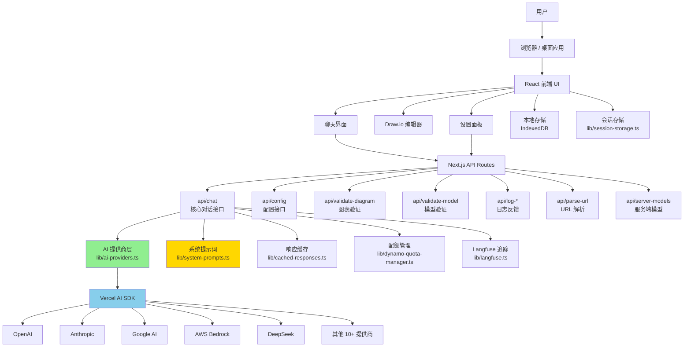
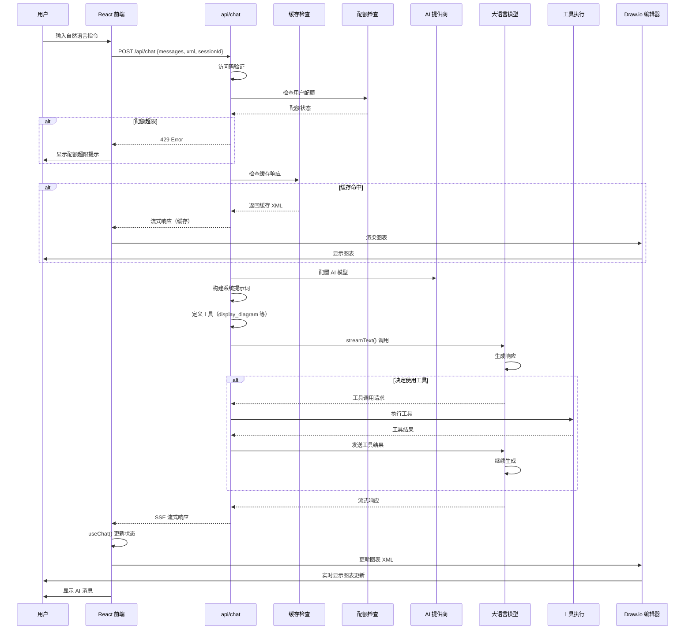
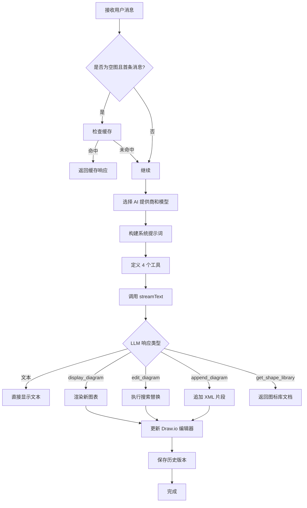
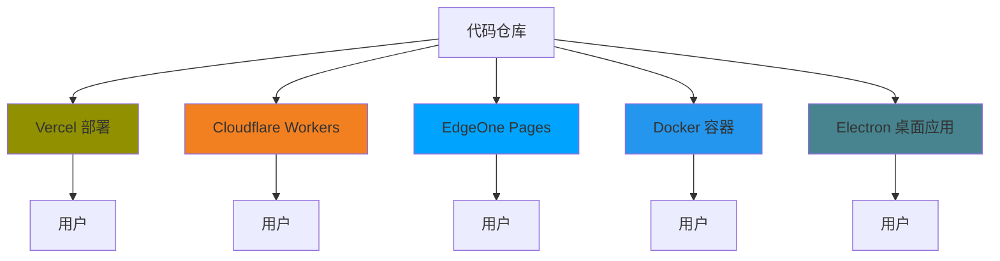

<!--more-->

## 1. 项目概述

**Next AI Draw.io** 是一个 AI 驱动的图表创建工具，通过自然语言命令和 AI 辅助可视化来创建、修改和增强 draw.io 图表。

### 核心特性
- **LLM 驱动的图表创建**：利用大语言模型通过自然语言直接创建和操作 draw.io 图表
- **基于图像的图表复制**：上传现有图表或图像，让 AI 自动复制和增强
- **PDF 和文本文件上传**：上传 PDF 文档和文本文件以提取内容并生成图表
- **AI 推理显示**：查看支持模型的 AI 思考过程（OpenAI o1/o3、Gemini、Claude 等）
- **图表历史记录**：全面的版本控制，跟踪所有更改
- **交互式聊天界面**：与 AI 实时交流以完善图表
- **云架构图表支持**：专门支持生成云架构图表（AWS、GCP、Azure）
- **动画连接器**：创建动态和动画化的图表元素连接器

### 技术栈
- **框架**：Next.js 16.x + React 19.x
- **AI SDK**：Vercel AI SDK (`ai` + `@ai-sdk/*`)
- **图表渲染**：react-drawio
- **样式**：Tailwind CSS 4.x
- **UI 组件**：Radix UI + shadcn/ui
- **多语言支持**：i18n
- **桌面应用**：Electron
- **部署**：Vercel / Cloudflare Workers / EdgeOne Pages

---

## 2. 整体架构



---

## 3. 项目结构

```
next-ai-draw-io/
├── app/                                    # Next.js App Router
│   ├── [lang]/                            # 多语言路由
│   ├── api/                               # API 路由
│   │   ├── chat/route.ts                  # 核心聊天 API（34KB）
│   │   ├── config/                        # 配置 API
│   │   ├── validate-diagram/              # 图表验证 API
│   │   ├── validate-model/                # 模型验证 API
│   │   ├── log-feedback/                  # 日志反馈 API
│   │   ├── log-save/                      # 日志保存 API
│   │   ├── parse-url/                     # URL 解析 API
│   │   ├── server-models/                 # 服务端模型 API
│   │   └── verify-access-code/            # 访问码验证 API
│   ├── globals.css                         # 全局样式
│   ├── manifest.ts                         # PWA manifest
│   ├── robots.ts                           # SEO robots
│   └── sitemap.ts                          # SEO sitemap
│
├── components/                             # React 组件
├── contexts/                               # React Context
├── hooks/                                  # React Hooks
│
├── lib/                                    # 核心库（业务逻辑）
│   ├── ai-providers.ts                     # AI 提供商配置（52KB）
│   ├── system-prompts.ts                   # 系统提示词（20KB）
│   ├── cached-responses.ts                 # 响应缓存（56KB）
│   ├── dynamo-quota-manager.ts             # DynamoDB 配额管理
│   ├── session-storage.ts                  # 会话存储
│   ├── server-model-config.ts              # 服务端模型配置
│   ├── chat-helpers.ts                     # 聊天助手函数
│   ├── diagram-validator.ts                # 图表验证器
│   ├── pdf-utils.ts                        # PDF 工具
│   ├── url-utils.ts                        # URL 工具
│   ├── validation-schema.ts                # 验证模式
│   ├── validation-prompts.ts               # 验证提示词
│   ├── utils.ts                            # 工具函数（64KB）
│   ├── storage.ts                          # 存储抽象
│   ├── ssrf-protection.ts                  # SSRF 防护
│   ├── langfuse.ts                         # Langfuse 集成
│   ├── use-file-processor.tsx              # 文件处理 Hook
│   ├── use-quota-manager.tsx               # 配额管理 Hook
│   ├── user-id.ts                          # 用户 ID 生成
│   ├── base-path.ts                        # 基础路径
│   └── i18n/                               # 国际化
│       └── types/
│
├── packages/                               # Monorepo 包
│   └── mcp-server/                         # MCP 服务器
│
├── electron/                               # Electron 桌面应用
│   ├── main/                               # 主进程
│   ├── preload/                            # 预加载脚本
│   └── electron-builder.yml               # 构建配置
│
├── edge-functions/                         # Edge Functions
├── resources/                              # 资源文件
├── scripts/                                # 构建脚本
├── tests/                                  # 测试
│
├── public/                                 # 静态资源
├── docs/                                   # 文档
│
├── package.json                            # 项目配置
├── tsconfig.json                           # TypeScript 配置
├── next.config.ts                          # Next.js 配置
├── tailwind.config.ts                      # Tailwind 配置
├── biome.json                              # Biome 代码规范
├── vercel.json                             # Vercel 部署配置
├── wrangler.jsonc                          # Cloudflare Workers 配置
├── docker-compose.yml                      # Docker Compose
└── Dockerfile                              # Docker 配置
```

---

## 4. 核心模块详解

### 4.1 核心聊天 API - `app/api/chat/route.ts`

这是整个应用的核心入口，处理用户与 AI 的所有交互。

**关键功能**：
- 访问码验证
- 用户配额检查
- 文件验证
- 缓存响应检查
- AI 模型选择和配置
- 工具调用处理
- 流式响应生成

**核心流程代码**：

```typescript
// 核心函数签名
async function handleChatRequest(req: Request): Promise<Response>

// 主要步骤：
// 1. 访问码验证
// 2. 用户 ID 获取（用于 Langfuse 追踪和配额）
// 3. 配额检查（DynamoDB）
// 4. 文件验证
// 5. 缓存检查
// 6. AI 提供商和模型选择
// 7. 系统提示词构建
// 8. 工具定义
// 9. streamText() 调用
// 10. 响应流式返回
```

**关键工具定义**：

```typescript
// 4 个核心工具
const tools = {
    display_diagram: tool({
        description: "Display a NEW diagram on draw.io",
        parameters: z.object({
            xml: z.string(),
        }),
    }),
    
    edit_diagram: tool({
        description: "Edit specific parts of the EXISTING diagram",
        parameters: z.object({
            edits: z.array(z.object({
                search: z.string(),
                replace: z.string(),
            })),
        }),
    }),
    
    append_diagram: tool({
        description: "Continue generating diagram XML when truncated",
        parameters: z.object({
            xml: z.string(),
        }),
    }),
    
    get_shape_library: tool({
        description: "Get shape/icon library documentation",
        parameters: z.object({
            library: z.string(),
        }),
    }),
}
```

---

### 4.2 AI 提供商层 - `lib/ai-providers.ts`

支持 15+ 个 AI 提供商的统一抽象层。

**支持的提供商**：
- OpenAI
- Anthropic  
- Google AI
- Google Vertex AI
- Azure OpenAI
- AWS Bedrock
- DeepSeek
- OpenRouter
- Ollama
- SiliconFlow
- ModelScope
- SGLang
- Vercel AI Gateway
- ByteDance Doubao
- 更多...

**核心代码结构**：

```typescript
// 客户端可选择的提供商
const ALLOWED_CLIENT_PROVIDERS: ProviderName[] = [
    "openai", "anthropic", "google", "vertexai", "azure",
    "bedrock", "openrouter", "deepseek", "siliconflow",
    "sglang", "gateway", "edgeone", "ollama", "doubao",
    "modelscope", "glm", "qwen", "qiniu", "kimi", "minimax",
    // ... 更多
]

// 核心函数：获取 AI 模型
export async function getAIModel(options: ClientOverrides): Promise<ModelConfig> {
    // 根据提供商类型创建对应的模型实例
    // 处理 API Key、Base URL、Headers 等配置
}

// 单系统消息提供商（不支持多轮系统消息）
export const SINGLE_SYSTEM_PROVIDERS = new Set<ProviderName>([
    "minimax", "glm", "qwen", "kimi", "qiniu",
])

// 图像输入支持检查
export function supportsImageInput(provider: ProviderName): boolean

// 提示词缓存支持检查
export function supportsPromptCaching(provider: ProviderName): boolean
```

**提供商创建示例**：

```typescript
// OpenAI 提供商创建
const openaiProvider = createOpenAI({
    apiKey: apiKey,
    baseURL: baseUrl,
    headers: headers,
})

// Anthropic 提供商创建
const anthropicProvider = createAnthropic({
    apiKey: apiKey,
    baseURL: baseUrl,
    headers: headers,
})

// AWS Bedrock 提供商创建
const bedrockProvider = createAmazonBedrock({
    region: awsRegion,
    credentials: {
        accessKeyId: awsAccessKeyId,
        secretAccessKey: awsSecretAccessKey,
        sessionToken: awsSessionToken,
    },
})
```

---

### 4.3 系统提示词 - `lib/system-prompts.ts`

精心设计的系统提示词，指导 AI 如何生成和编辑 draw.io 图表。

**提示词特点**：
- 默认约 1900 tokens，适用于所有模型
- 支持扩展提示词（用于高缓存 token 模型）
- 详细的工具使用说明
- 布局约束规范
- draw.io XML 格式规范

**核心提示词结构**：

```typescript
// 默认系统提示词
export const DEFAULT_SYSTEM_PROMPT = `
You are an expert diagram creation assistant specializing in draw.io XML generation.
Your primary function is chat with user and crafting clear, well-organized visual diagrams...

## App Context
You are an AI agent inside a web app. The interface has:
- Left panel: Draw.io diagram editor
- Right panel: Chat interface

## Tools
- display_diagram: Create NEW diagram
- edit_diagram: Edit EXISTING diagram
- append_diagram: Continue truncated XML
- get_shape_library: Get icon library

## Layout constraints
- Keep elements within x: 0-800, y: 0-600
- Max container width: 700px

## XML Best Practices
- Proper mxGraphModel structure
- mxCell with id, value, style, vertex/edge
- Correct parent/child relationships
- ...
`

// 扩展提示词（用于 Opus 等模型）
export const EXTENDED_SYSTEM_PROMPT = DEFAULT_SYSTEM_PROMPT + `
## Additional Guidelines for Advanced Models
...
`

// 系统提示词选择器
export function getSystemPrompt(options: {
    modelId: string;
    provider: ProviderName;
    customSystemMessage?: string;
    hasFiles?: boolean;
}): string {
    // 根据模型和提供商选择合适的系统提示词
    // 合并自定义系统消息
}
```

---

### 4.4 响应缓存 - `lib/cached-responses.ts`

为常见请求提供快速响应缓存。

**缓存策略**：
- 仅对第一条消息且空图时缓存
- 支持文本和文件输入的组合缓存
- 预设常见图表模板

**缓存数据结构**：

```typescript
interface CachedResponse {
    keywords: string[];          // 匹配关键词
    hasFiles: boolean;           // 是否有文件
    xml: string;                 // 缓存的 XML
}

// 查找缓存响应
export function findCachedResponse(
    userInput: string,
    hasFiles: boolean
): CachedResponse | undefined {
    // 关键词匹配
    // 返回预定义的 XML 模板
}
```

---

### 4.5 配额管理 - `lib/dynamo-quota-manager.ts`

使用 DynamoDB 管理用户 API 配额。

**配额维度**：
- 每日请求数限制
- 每日 Token 数限制
- TPM（每分钟 Token）限制

**核心功能**：

```typescript
// 检查并递增请求计数
export async function checkAndIncrementRequest(
    userId: string,
    limits: {
        requests?: number;
        tokens?: number;
        tpm?: number;
    }
): Promise<{
    allowed: boolean;
    error?: string;
    type?: string;
    used?: any;
    limit?: any;
}>

// 记录 Token 使用量
export async function recordTokenUsage(
    userId: string,
    usage: { inputTokens: number; outputTokens: number }
)

// 配额是否启用
export function isQuotaEnabled(): boolean
```

---

## 5. 数据流

### 5.1 完整的聊天/图表生成数据流



### 5.2 工具调用详细流程



---

## 6. 关键设计模式

### 6.1 策略模式 - AI 提供商选择

根据不同的提供商类型使用不同的创建策略：

```typescript
async function getAIModel(options: ClientOverrides): Promise<ModelConfig> {
    switch (options.provider) {
        case "openai":
            return createOpenAIModel(options)
        case "anthropic":
            return createAnthropicModel(options)
        case "bedrock":
            return createBedrockModel(options)
        // ... 15+ 个提供商
    }
}
```

### 6.2 工具模式 - 4 个核心工具

使用 Vercel AI SDK 的工具定义模式：

```typescript
const tools = {
    display_diagram: tool({
        description: "...",
        parameters: z.object({ xml: z.string() }),
        execute: async ({ xml }) => { /* 执行 */ },
    }),
    edit_diagram: tool({ /* ... */ }),
    append_diagram: tool({ /* ... */ }),
    get_shape_library: tool({ /* ... */ }),
}
```

### 6.3 缓存模式 - 响应缓存

使用简单的关键词匹配缓存：

```typescript
const CACHED_RESPONSES: CachedResponse[] = [
    {
        keywords: ["aws architecture", "aws diagram"],
        hasFiles: false,
        xml: PREDEFINED_AWS_XML,
    },
    // ... 更多缓存
]
```

### 6.4 适配器模式 - 多提供商适配

为每个 AI 提供商创建适配器：

```typescript
// OpenAI 适配器
function createOpenAIModel(options) {
    const provider = createOpenAI({ apiKey: options.apiKey })
    return { model: provider(options.modelId) }
}

// Anthropic 适配器
function createAnthropicModel(options) {
    const provider = createAnthropic({ apiKey: options.apiKey })
    return { model: provider(options.modelId) }
}
```

---

## 7. 扩展性设计

### 7.1 添加新的 AI 提供商

1. 在 `lib/ai-providers.ts` 中添加提供商类型
2. 创建提供商适配器函数
3. 添加到 `ALLOWED_CLIENT_PROVIDERS` 列表
4. 更新 `getAIModel()` 函数

### 7.2 添加新的工具

1. 在系统提示词中添加工具描述
2. 在 `app/api/chat/route.ts` 中定义工具
3. 实现工具的 `execute` 函数
4. 更新前端处理逻辑

### 7.3 添加新的图标库

1. 准备图标库的 XML 定义
2. 在 `get_shape_library` 工具中添加库文档
3. 更新系统提示词中的使用说明

---

## 8. 关键技术决策

### 8.1 为什么选择 Vercel AI SDK？

- **统一提供商抽象**：15+ 提供商一个 API
- **流式响应原生支持**：开箱即用的 SSE 流式
- **工具调用框架**：完善的工具定义和执行
- **TypeScript 优先**：完整的类型安全
- **活跃维护**：Vercel 官方支持

### 8.2 为什么使用 4 个工具而不是 1 个？

- **display_diagram**：全新创建，完整 XML
- **edit_diagram**：局部修改，搜索替换（高效）
- **append_diagram**：处理输出截断
- **get_shape_library**：图标库探索

**优势**：
- 更精细的控制
- 更好的 Token 效率
- 减少错误概率

### 8.3 为什么需要缓存？

- **常见请求快速响应**：AWS/Azure/GCP 架构图
- **降低 API 成本**：避免重复生成相同内容
- **提升用户体验**：毫秒级响应

### 8.4 为什么使用 DynamoDB 配额管理？

- **无服务器**：无需管理基础设施
- **自动扩展**：应对流量波动
- **低成本**：按使用付费
- **TTL 支持**：自动过期旧数据

---

## 9. 安全考虑

### 9.1 SSRF 防护

```typescript
// lib/ssrf-protection.ts
export function isSSRFProtected(url: string): boolean {
    // 检查内网 IP
    // 检查私有地址
    // 白名单域名
}
```

### 9.2 访问码验证

```typescript
// 支持多个访问码
const accessCodes = process.env.ACCESS_CODE_LIST?.split(",")
if (accessCodes.length > 0) {
    const accessCodeHeader = req.headers.get("x-access-code")
    if (!accessCodes.includes(accessCodeHeader)) {
        return 401 Error
    }
}
```

### 9.3 API Key 安全

- **客户端 API Key 仅存储在浏览器本地**
- **服务端 API Key 通过环境变量配置**
- **支持自定义环境变量名**
- **支持负载均衡（多个 API Key）**

---

## 10. 部署架构

### 10.1 多平台部署支持



### 10.2 环境变量配置

关键环境变量（见 `env.example`）：

```bash
# AI 提供商配置
OPENAI_API_KEY=
ANTHROPIC_API_KEY=
AWS_BEDROCK_REGION=

# 配额管理
DYNAMODB_QUOTA_TABLE=
DAILY_REQUEST_LIMIT=10
DAILY_TOKEN_LIMIT=200000

# Langfuse 追踪
LANGFUSE_SECRET_KEY=
LANGFUSE_PUBLIC_KEY=
LANGFUSE_BASE_URL=

# 访问控制
ACCESS_CODE_LIST=code1,code2

# 服务端模型配置
AI_MODELS_CONFIG='[{"id":"server:model1",...}]'
```

---

## 11. 总结

### 架构亮点

1. **清晰的分层**：前端 → API → AI 提供商 → LLM
2. **高度可扩展**：15+ AI 提供商，易于添加新的
3. **完善的工具系统**：4 个核心工具覆盖所有用例
4. **企业级特性**：配额管理、访问控制、缓存、追踪
5. **多平台部署**：Vercel、Cloudflare、EdgeOne、Docker、Electron
6. **优秀的用户体验**：流式响应、历史记录、多语言

### 技术栈优势

- **Next.js 16**：最新的 App Router，Server Components
- **Vercel AI SDK**：统一的 AI 抽象，流式响应
- **React 19**：最新的 React 特性
- **Tailwind CSS 4**：高性能样式系统
- **TypeScript**：完整的类型安全
- **Electron**：跨平台桌面应用

### 值得学习的设计

1. **工具优先的交互模式**：让 AI 使用工具而不是直接输出
2. **精心设计的系统提示词**：1900+ tokens 的详细指导
3. **多层次的缓存策略**：响应缓存 + 提示词缓存
4. **灵活的配额管理**：多维度的使用限制
5. **完善的可观测性**：Langfuse 集成

这个项目展示了如何构建一个生产级的 AI 驱动应用，架构清晰、功能完整、用户体验优秀！
