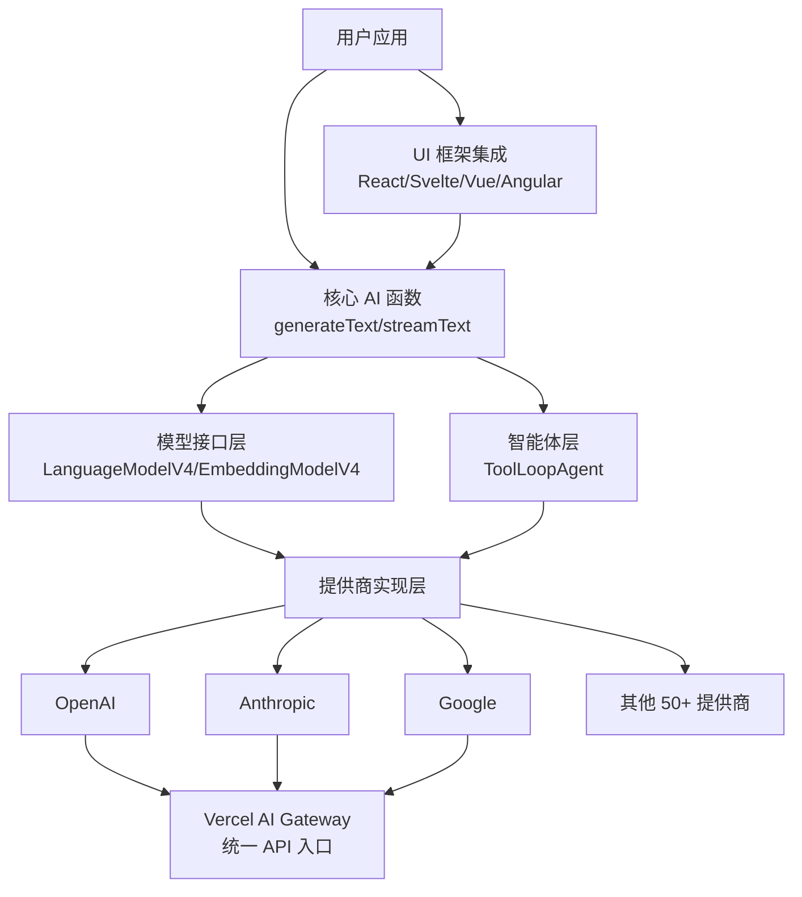
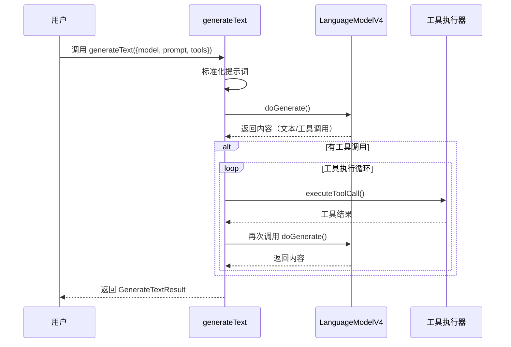
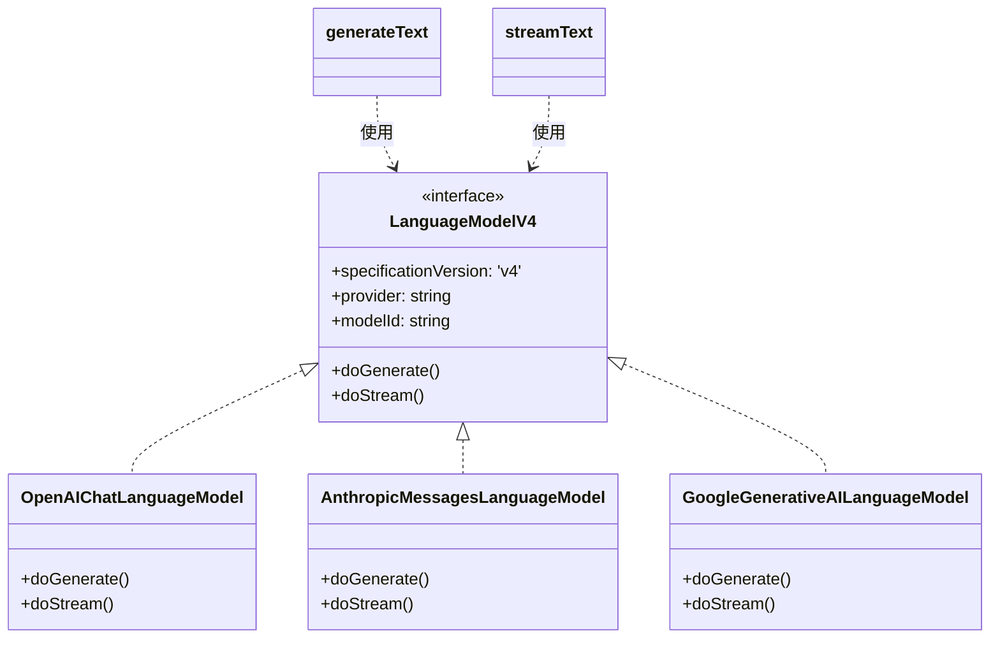
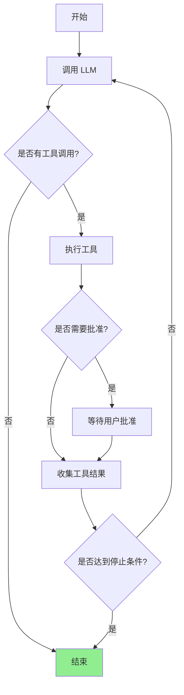
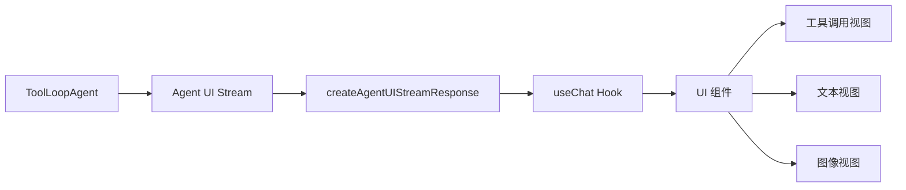
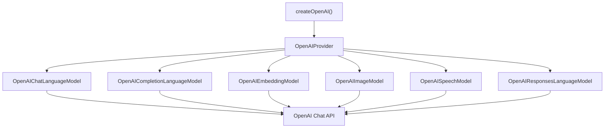
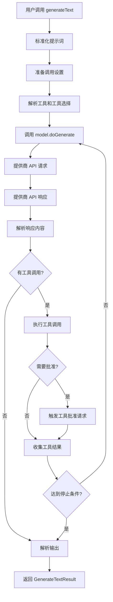
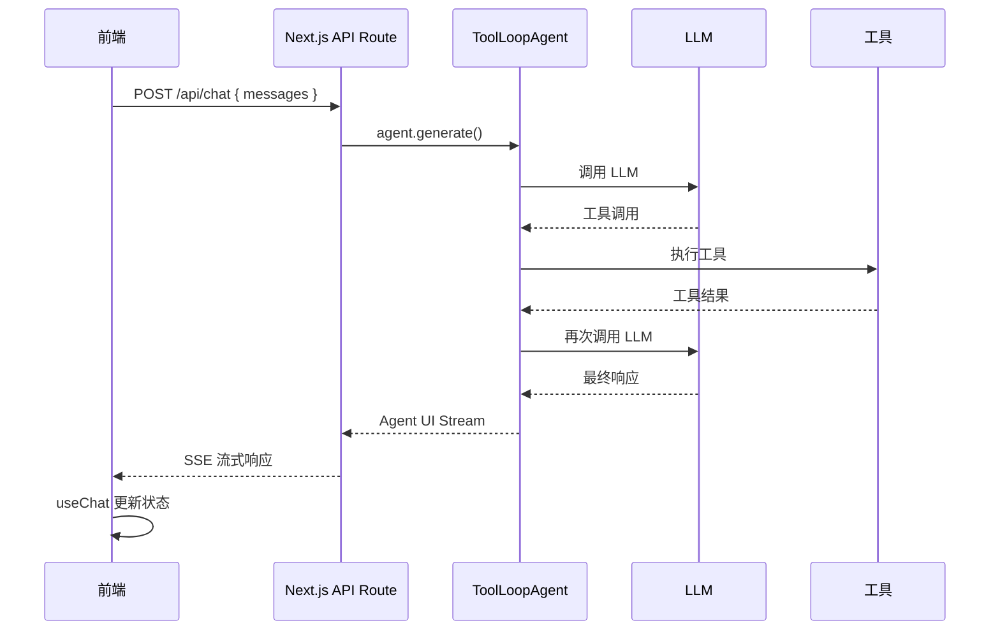

<!--more-->

## 1. 项目概述

[Vercel AI SDK](https://github.com/vercel/ai) 是一个与提供商无关的 TypeScript 工具包，旨在帮助开发者使用流行的 UI 框架（如 Next.js、React、Svelte、Vue、Angular）和运行时（如 Node.js）构建 AI 驱动的应用程序和智能体。

### 核心特性
- **统一提供商架构**：支持 OpenAI、Anthropic、Google 等多个模型提供商
- **多框架支持**：React、Svelte、Vue、Angular
- **多种模型类型**：文本生成、嵌入、图像、语音、转录、重排等
- **智能体框架**：ToolLoopAgent 等工具循环代理
- **流式输出**：支持实时流式响应

---

## 2. 整体架构



---

## 3. 项目结构

### Monorepo 结构

```
packages/
├── ai/                          # 核心 SDK
│   ├── src/
│   │   ├── agent/              # 智能体模块
│   │   ├── embed/              # 嵌入生成
│   │   ├── generate-text/      # 文本生成
│   │   ├── generate-object/    # 结构化输出
│   │   ├── generate-image/     # 图像生成
│   │   ├── model/              # 模型抽象
│   │   ├── prompt/             # 提示词处理
│   │   ├── ui/                 # UI 消息流
│   │   └── middleware/         # 中间件
│
├── provider/                    # 提供商接口定义
├── provider-utils/              # 提供商工具函数
├── gateway/                     # Vercel AI Gateway
├── react/                       # React 框架集成
├── svelte/                      # Svelte 框架集成
├── vue/                         # Vue 框架集成
├── angular/                     # Angular 框架集成
│
└── [50+ 提供商包]/              # 各 AI 提供商集成
    ├── openai/
    ├── anthropic/
    ├── google/
    ├── mistral/
    └── ...
```

---

## 4. 核心模块详解

### 4.1 核心 AI 函数层

#### generateText 函数

**位置**：`packages/ai/src/generate-text/generate-text.ts`

这是 SDK 的核心函数，用于生成文本和调用工具。

```typescript
export async function generateText<
  TOOLS extends ToolSet,
  OUTPUT extends Output = Output<string, string>,
>({
  model,
  tools,
  toolChoice,
  system,
  prompt,
  messages,
  maxRetries,
  abortSignal,
  timeout,
  stopWhen,
  output,
  // ... 更多选项
}: CallSettings & Prompt & { model: LanguageModel }): 
  Promise<GenerateTextResult<TOOLS, OUTPUT>>
```

**工作流程**：



**关键特性**：
- 支持工具调用循环
- 支持结构化输出（Output.object）
- 支持重试机制
- 支持超时和中止信号
- 丰富的回调事件（onStart、onStepFinish、onFinish 等）

---

### 4.2 模型接口层

#### LanguageModelV4 接口

**位置**：`packages/provider/src/language-model/v4/`

这是语言模型的核心抽象接口，所有提供商都需要实现它。

```typescript
export interface LanguageModelV4 {
  readonly specificationVersion: 'v4';
  readonly provider: string;
  readonly modelId: string;
  
  doGenerate(options: LanguageModelV4GenerateOptions): 
    Promise<LanguageModelV4GenerateResult>;
    
  doStream(options: LanguageModelV4StreamOptions): 
    Promise<LanguageModelV4StreamResult>;
    
  readonly supportedUrls?: Promise<LanguageModelV4SupportedUrls>;
}
```

**提供商抽象架构**：



---

### 4.3 智能体层

#### ToolLoopAgent 类

**位置**：`packages/ai/src/agent/tool-loop-agent.ts`

ToolLoopAgent 是一个工具循环智能体，它在循环中运行工具调用。

```typescript
export class ToolLoopAgent<
  CALL_OPTIONS = never,
  TOOLS extends ToolSet = {},
  OUTPUT extends Output = never,
> implements Agent<CALL_OPTIONS, TOOLS, OUTPUT>
{
  constructor(settings: ToolLoopAgentSettings<CALL_OPTIONS, TOOLS, OUTPUT>);
  
  async generate(options: AgentCallParameters<CALL_OPTIONS, TOOLS>): 
    Promise<GenerateTextResult<TOOLS, OUTPUT>>;
    
  async stream(options: AgentStreamParameters<CALL_OPTIONS, TOOLS>): 
    Promise<StreamTextResult<TOOLS, OUTPUT>>;
}
```

**工具循环工作流**：



**示例代码**：

```typescript
import { ToolLoopAgent } from 'ai';
import { openai } from '@ai-sdk/openai';

const sandboxAgent = new ToolLoopAgent({
  model: openai('gpt-5'),
  system: 'You are an agent with access to a shell environment.',
  tools: {
    shell: openai.tools.localShell({
      execute: async ({ action }) => {
        const [cmd, ...args] = action.command;
        const sandbox = await getSandbox();
        const command = await sandbox.runCommand({ cmd, args });
        return { output: await command.stdout() };
      },
    }),
  },
});
```

---

### 4.4 UI 框架集成层

#### React 集成 - useChat Hook

**位置**：`packages/react/src/`

UI 层提供了框架无关的 hooks，帮助构建聊天机器人和生成式用户界面。

```typescript
import { useChat } from '@ai-sdk/react';

export default function Page() {
  const { messages, status, sendMessage } = useChat<ImageGenerationAgentMessage>();

  return (
    <div>
      {messages.map(message => (
        <div key={message.id}>
          <strong>{`${message.role}: `}</strong>
          {message.parts.map((part, index) => {
            switch (part.type) {
              case 'text':
                return <div key={index}>{part.text}</div>;
              case 'tool-generateImage':
                return <ImageGenerationView key={index} invocation={part} />;
            }
          })}
        </div>
      ))}
    </div>
  );
}
```

**UI 消息流架构**：



---

### 4.5 提供商实现层

#### OpenAI 提供商实现

**位置**：`packages/openai/src/openai-provider.ts`

每个提供商都通过工厂函数创建 provider 实例。

```typescript
export function createOpenAI(
  options: OpenAIProviderSettings = {},
): OpenAIProvider {
  const baseURL = withoutTrailingSlash(
    loadOptionalSetting({
      settingValue: options.baseURL,
      environmentVariableName: 'OPENAI_BASE_URL',
    }),
  ) ?? 'https://api.openai.com/v1';

  const createChatModel = (modelId: OpenAIChatModelId) =>
    new OpenAIChatLanguageModel(modelId, {
      provider: `${providerName}.chat`,
      url: ({ path }) => `${baseURL}${path}`,
      headers: getHeaders,
      fetch: options.fetch,
    });

  // ... 创建其他模型类型

  const provider = function (modelId: OpenAIResponsesModelId) {
    return createLanguageModel(modelId);
  };

  provider.languageModel = createLanguageModel;
  provider.chat = createChatModel;
  provider.embedding = createEmbeddingModel;
  provider.image = createImageModel;
  // ... 更多方法

  return provider as OpenAIProvider;
}
```

**提供商集成架构**：



---

## 5. 关键设计模式

### 5.1 抽象工厂模式

用于创建不同提供商的模型实例：

```typescript
// 抽象接口
interface LanguageModelV4 {
  doGenerate(options): Promise<Result>;
  doStream(options): Promise<StreamResult>;
}

// 具体实现
class OpenAIChatLanguageModel implements LanguageModelV4 { /* ... */ }
class AnthropicMessagesLanguageModel implements LanguageModelV4 { /* ... */ }

// 工厂函数
function createOpenAI() {
  return {
    chat(modelId) { return new OpenAIChatLanguageModel(modelId); },
    // ...
  };
}
```

### 5.2 策略模式

用于不同的工具选择策略：

```typescript
type ToolChoice<TOOLS extends ToolSet> =
  | 'auto'
  | 'none'
  | 'required'
  | { type: 'tool'; toolName: keyof TOOLS };
```

### 5.3 中间件模式

用于在请求前后插入自定义逻辑：

```typescript
// packages/ai/src/middleware/
```

### 5.4 构建者模式

用于配置复杂的生成选项：

```typescript
generateText({
  model: openai('gpt-5'),
  prompt: 'Hello',
  maxOutputTokens: 1000,
  temperature: 0.7,
  tools: { /* ... */ },
  // ... 更多选项
});
```

---

## 6. 数据流

### 6.1 完整的文本生成数据流



### 6.2 智能体 UI 流



---

## 7. 扩展性设计

### 7.1 添加新的模型提供商

1. 创建新的 provider 包：`packages/new-provider/`
2. 实现核心模型类：
   - `NewProviderChatLanguageModel` implements `LanguageModelV4`
   - `NewProviderEmbeddingModel` implements `EmbeddingModelV4`
3. 创建工厂函数：`createNewProvider()`
4. 导出默认实例：`export const newProvider = createNewProvider()`

### 7.2 添加新的 UI 框架

1. 创建新的框架包：`packages/new-framework/`
2. 实现框架特定的 hooks：
   - `useChat` for NewFramework
   - `useCompletion` for NewFramework
3. 利用核心的 UI 消息流逻辑

### 7.3 添加新的 AI 功能

1. 在 `packages/ai/src/` 中创建新目录
2. 定义核心函数（如 `generateXYZ`）
3. 在 provider 接口中定义对应接口（如 `XYZModelV4`）
4. 在各提供商中实现该接口

---

## 8. 关键技术决策

### 8.1 为什么使用 Monorepo？

- **模块化**：每个提供商独立发布
- **共享代码**：核心逻辑复用
- **统一版本管理**：使用 Changesets
- **快速迭代**：Turbo 构建缓存

### 8.2 为什么使用接口抽象？

- **提供商无关性**：用户代码不依赖特定提供商
- **易于测试**：可以 mock 模型接口
- **灵活切换**：可以轻松更换提供商

### 8.3 为什么支持流式输出？

- **更好的用户体验**：实时显示生成内容
- **降低感知延迟**：用户可以立即看到响应开始
- **节省内存**：不需要缓冲完整响应

---

## 9. 总结

Vercel AI SDK 的架构设计体现了现代 TypeScript 库的最佳实践：

1. **清晰的分层**：UI 层、核心函数层、模型接口层、提供商实现层
2. **高度的可扩展性**：易于添加新提供商、新框架、新功能
3. **统一的抽象**：所有提供商遵循相同的接口
4. **优秀的开发者体验**：类型安全、简洁的 API、丰富的文档
5. **生产就绪**：内置重试、超时、错误处理等企业级特性

这个架构使得 SDK 能够快速适应 AI 领域的快速变化，同时保持 API 的稳定性和一致性。
