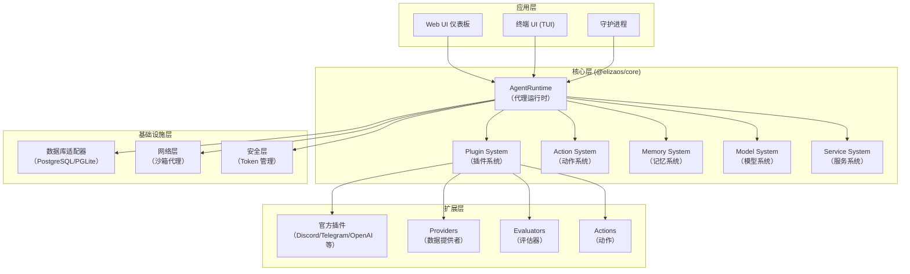
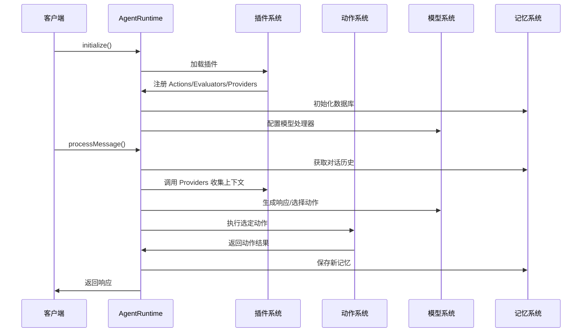
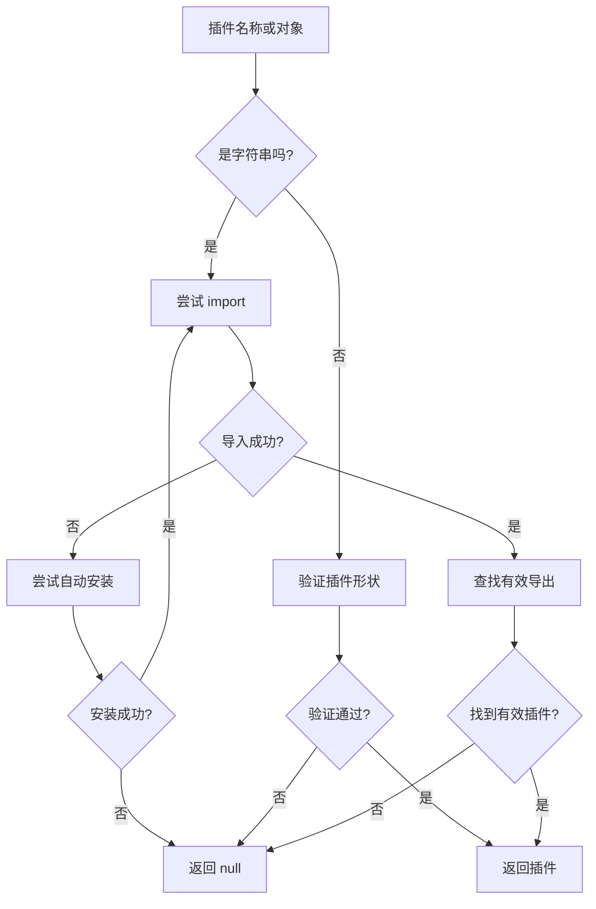
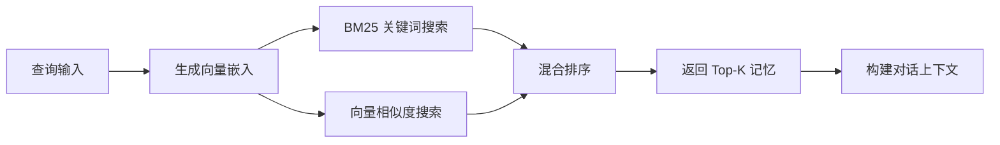
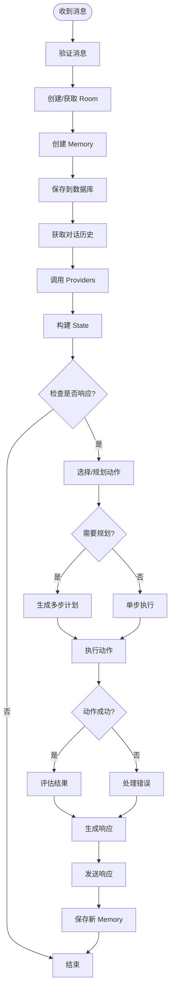
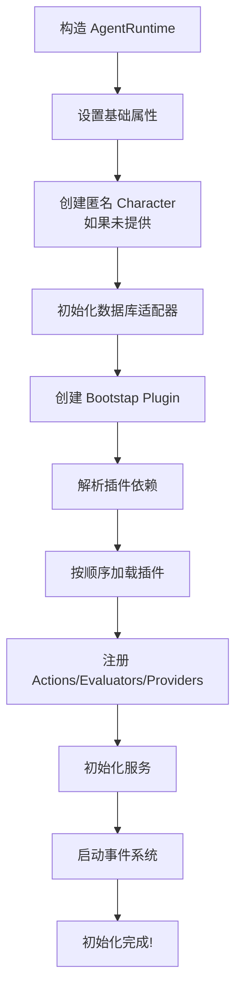

<!--more-->

## 📋 概述

**elizaOS** 是一个开源的多智能体 AI 开发框架，用于构建、部署和管理自主 AI 智能体。采用现代化、可扩展的全功能平台设计。

### 核心特性
- 🔌 **丰富的连接器**：内置 Discord、Telegram、Farcaster 等支持
- 🧠 **模型无关**：支持 OpenAI、Gemini、Anthropic、Llama、Grok 等主流模型
- 🖥️ **现代 Web UI**：专业仪表板，实时管理智能体、群组和对话
- 🤖 **多智能体架构**：从底层设计支持创建和编排专业智能体组
- 📄 **文档摄取**：轻松摄取文档，支持 RAG 检索和问答
- 🛠️ **高度可扩展**：强大的插件系统构建自定义功能
- 📦 **开箱即用**：无缝的设置和开发体验

---

## 🏗️ 系统架构概览

### 项目结构

```
eliza/
├── packages/
│   ├── typescript/      # 核心包 (@elizaos/core)
│   ├── python/          # Python API 实现
│   ├── rust/            # Rust 实现（原生 + WASM）
│   ├── elizaos/         # 主应用
│   ├── daemon/          # 守护进程
│   ├── docs/            # 文档
│   ├── interop/         # 互操作层
│   ├── prompts/         # 提示词库
│   ├── schemas/         # 数据模式
│   ├── skills/          # 技能模块
│   ├── sweagent/        # SWE Agent
│   ├── training/        # 训练模块
│   ├── tui/             # 终端 UI
│   └── computeruse/     # 计算机使用能力
├── plugins/             # 官方插件
└── scripts/             # 构建和工具脚本
```

### 架构层次图



---

## 🔑 核心模块详解

### 1. AgentRuntime（代理运行时）

**位置**：`packages/typescript/src/runtime.ts`

AgentRuntime 是整个 elizaOS 的核心，负责协调所有子系统的工作。

#### 核心属性

```typescript
export class AgentRuntime implements IAgentRuntime {
  readonly agentId: UUID;
  readonly character: Character;
  public adapter!: IDatabaseAdapter;
  
  // 核心组件集合
  readonly actions: Action[] = [];
  readonly evaluators: Evaluator[] = [];
  readonly providers: Provider[] = [];
  readonly plugins: Plugin[] = [];
  
  // 状态缓存（LRU 策略）
  stateCache = new Map<string, State>();
  private static readonly STATE_CACHE_MAX = 200;
  
  // 服务和模型
  services = new Map<ServiceTypeName, Service[]>();
  models = new Map<string, ModelHandler[]>();
  
  // 沙箱模式
  public readonly sandboxMode: boolean;
  public readonly sandboxTokenManager: SandboxTokenManager | null;
  
  // 事件系统
  events: RuntimeEventStorage = {};
  private eventHandlers: Map<string, Array<(data: EventPayload) => void>>;
}
```

#### 构造函数参数

```typescript
constructor(opts: {
  conversationLength?: number;           // 对话历史长度
  agentId?: UUID;                        // 代理 ID
  character?: Character;                 // 角色配置
  plugins?: Plugin[];                    // 插件列表
  fetch?: typeof fetch;                  // 自定义 fetch
  adapter?: IDatabaseAdapter;            // 数据库适配器
  settings?: RuntimeSettings;            // 运行时设置
  allAvailablePlugins?: Plugin[];        // 所有可用插件
  logLevel?: "trace" | "debug" | "info" | "warn" | "error" | "fatal";
  disableBasicCapabilities?: boolean;    // 禁用基础能力
  advancedCapabilities?: boolean;        // 启用高级能力
  actionPlanning?: boolean;               // 动作规划模式
  llmMode?: LLMModeType;                 // LLM 模式
})
```

#### 关键工作流



---

### 2. 插件系统（Plugin System）

**位置**：`packages/typescript/src/plugin.ts`

插件系统是 elizaOS 的扩展核心，支持动态加载、依赖解析和自动安装。

#### Plugin 接口结构

```typescript
interface Plugin {
  name: string;                          // 插件名称
  description?: string;                  // 描述
  init?: (runtime: IAgentRuntime) => Promise<void>;
  
  // 核心组件
  services?: Service[];                  // 服务
  providers?: Provider[];                // 数据提供者
  actions?: Action[];                    // 动作
  evaluators?: Evaluator[];              // 评估器
  
  // 依赖管理
  dependencies?: string[];               // 依赖插件
  testDependencies?: string[];           // 测试依赖
}
```

#### 插件加载流程



#### 依赖解析算法

使用拓扑排序（Topological Sort）解析插件依赖：

```typescript
function resolvePluginDependencies(
  availablePlugins: Map<string, Plugin>,
  isTestMode: boolean = false
): Plugin[] {
  const resolutionOrder: string[] = [];
  const visited = new Set<string>();
  const visiting = new Set<string>();
  
  function visit(pluginName: string) {
    // 检测循环依赖
    if (visiting.has(canonicalName)) {
      logger.error("Circular dependency detected");
      return;
    }
    
    // 递归访问依赖
    for (const dep of plugin.dependencies || []) {
      visit(dep);
    }
    
    resolutionOrder.push(canonicalName);
  }
  
  return resolutionOrder.map(name => availablePlugins.get(name));
}
```

---

### 3. 动作系统（Action System）

**位置**：`packages/typescript/src/actions.ts`

动作系统定义了代理可以执行的操作，包括参数验证、示例生成等。

#### Action 接口

```typescript
interface Action {
  name: string;
  description: string;
  similes?: string[];                      // 相似名称
  examples?: ActionExample[][];            // 使用示例
  validate?: (
    runtime: IAgentRuntime,
    message: Memory,
    state?: State
  ) => Promise<boolean>;
  handler: (
    runtime: IAgentRuntime,
    message: Memory,
    state?: State,
    options?: { [key: string]: unknown },
    callback?: HandlerCallback
  ) => Promise<ActionResult | null | undefined>;
  suppressInitialMessage?: boolean;
  parameters?: ActionParameter[];           // 参数定义
}
```

#### 动作调用示例格式

```xml
User: 请帮我搜索关于人工智能的最新新闻
Assistant:
<actions>
  <action>searchWeb</action>
</actions>
<params>
  <searchWeb>
    <query>人工智能 最新新闻</query>
    <count>5</count>
  </searchWeb>
</params>
```

---

### 4. 记忆系统（Memory System）

**位置**：`packages/typescript/src/memory.ts` 和 `packages/typescript/src/types/memory.ts`

#### Memory 结构

```typescript
interface Memory {
  id: UUID;
  agentId: UUID;
  roomId: UUID;
  userId?: UUID;
  content: Content;                  // 消息内容
  createdAt: number;                 // 创建时间戳
  embedding?: number[];              // 向量嵌入
  metadata?: MemoryMetadata;         // 元数据
}

interface Content {
  text: string;
  source?: boolean;
  url?: string;
  inReplyTo?: UUID;
  action?: string;
  attachments?: Attachment[];
}
```

#### 记忆检索流程



---

### 5. 模型系统（Model System）

**位置**：`packages/typescript/src/types/model.ts`

支持多种模型类型和提供商：

```typescript
enum ModelType {
  TEXT = "text",
  TEXT_SMALL = "text-small",
  EMBEDDING = "embedding",
  IMAGE = "image",
  TRANSCRIPTION = "transcription",
}

interface ModelHandler {
  modelName: string;
  modelType: ModelType;
  generate: (
    params: ModelParamsMap[ModelType],
    context?: any
  ) => Promise<ModelResultMap[ModelType]>;
  stream?: (
    params: ModelParamsMap[ModelType],
    context?: any
  ) => AsyncIterable<StreamEvent>;
}
```

---

### 6. 服务系统（Service System）

**位置**：`packages/typescript/src/types/service.ts` 和 `packages/typescript/src/services/`

#### Service 生命周期

```typescript
interface Service {
  name: ServiceTypeName;
  service?: Service;
  
  initialize?(runtime: IAgentRuntime): Promise<void>;
  start?(): Promise<void>;
  stop?(): Promise<void>;
}
```

#### 内置服务

| 服务名 | 功能 |
|--------|------|
| message | 消息处理 |
| action-filter | 动作过滤 |
| tool-policy | 工具策略 |

---

## 📦 核心类型定义

### Character（角色）

角色定义了代理的人格、行为和能力：

```typescript
interface Character {
  name: string;
  bio: string | string[];
  lore: string[];
  messageExamples: MessageExample[][];
  postExamples: PostExample[][];
  topics: string[];
  style: {
    all: string[];
    chat: string[];
    post: string[];
  };
  adjectives: string[];
  plugins?: Plugin[];
  settings?: Partial<RuntimeSettings>;
  clientSettings?: { [key: string]: any };
}
```

### State（状态）

代理的当前状态，包括对话上下文、用户信息等：

```typescript
interface State {
  agentId?: UUID;
  roomId?: UUID;
  userId?: UUID;
  conversationLength?: number;
  agentName?: string;
  senderName?: string;
  actors?: string;
  recentMessages?: string;
  recentPosts?: string;
  [key: string]: StateValue;
}
```

---

## 🔄 消息处理工作流

### 完整处理流程



---

## 🛡️ 安全与沙箱

### 沙箱模式

elizaOS 提供完整的沙箱功能：

```typescript
// SandboxTokenManager - 管理敏感信息的 Token 化
class SandboxTokenManager {
  tokenize(secret: string): string;
  detokenize(token: string): string | null;
}

// SandboxFetchProxy - 审计和限制网络请求
createSandboxFetchProxy({
  auditHandler: (event: SandboxFetchAuditEvent) => {
    // 记录、阻止或修改请求
  }
});
```

---

## 🚀 启动与初始化流程

### AgentRuntime 初始化

```typescript
// 1. 创建运行时实例
const runtime = new AgentRuntime({
  character: myCharacter,
  plugins: [plugin1, plugin2],
  settings: runtimeSettings,
});

// 2. 初始化
await runtime.initialize();

// 3. 处理消息
await runtime.processMessage(message);
```

### 初始化详细步骤



---

## 💡 设计亮点

### 1. 模块化与可扩展性
- 插件系统支持动态加载和依赖管理
- 清晰的接口分离（IAgentRuntime、Plugin、Action 等）
- 多语言实现（TypeScript、Python、Rust）

### 2. 性能优化
- LRU 状态缓存，限制内存增长
- 动作索引，O(1) 精确查找
- 确定性生成，可复现的测试

### 3. 开发体验
- 开箱即用的配置
- 完善的类型定义
- 自动插件安装

### 4. 生产就绪
- 沙箱模式安全保障
- 完整的日志系统
- 数据库抽象层

---

## 📚 参考资料

- **GitHub**: https://github.com/elizaos/eliza
- **文档**: https://docs.elizaos.ai/
- **论文**: arXiv:2501.06781 - "Eliza: A Web3 friendly AI Agent Operating System"
- **Discord**: https://discord.gg/ai16z
