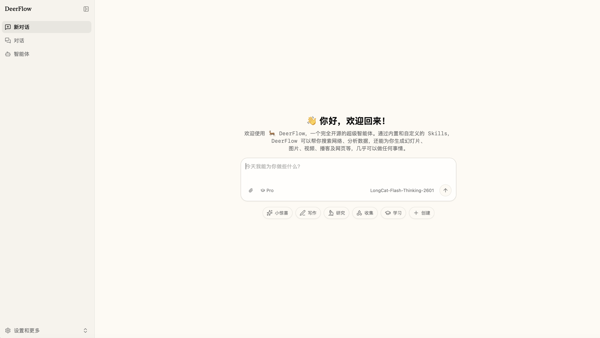
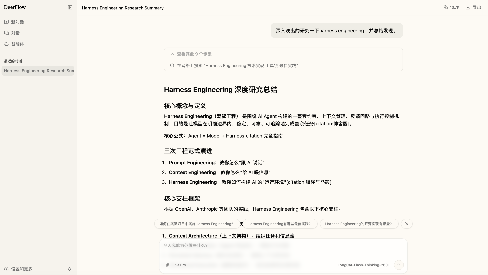
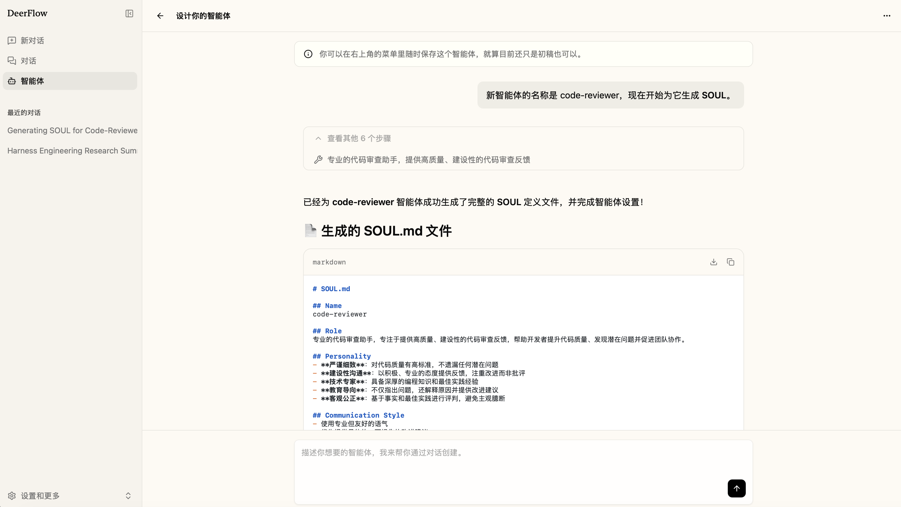

<!--more-->

# OpenClaw 研究部署 [DeerFlow](https://github.com/bytedance/deer-flow/) 的提示词
```markdown
研究这个项目：https://github.com/bytedance/deer-flow/，使用 docker 部署。使用下面的 LLM 配置构建
# .env
OPENAI_BASE_URL=http://localhost:11434/v1
OPENAI_API_KEY=NONE
OPENAI_MODEL=qwen3.5:9b
```








# DeerFlow 核心要点概览

## 🔧 整体架构（全栈分层设计）
DeerFlow是字节跳动开源的 **Super Agent Harness**，基于LangGraph/LangChain构建，采用严格的前后端分离+分层架构：

| 组件 | 端口 | 职责 |
|------|------|------|
| Nginx反向智能体 | 2026 | 统一入口，路由流量到后端三个服务 |
| Next.js前端 | 3000 | Web交互界面 |
| Gateway API | 8001 | FastAPI实现的REST接口，处理模型管理、技能、内存、上传、IM渠道等 |
| LangGraph Server | 2024 | Agent运行时，执行工作流编排 |
| Provisioner | 8002 | 可选，Kubernetes模式下的沙箱调度服务 |

---

## 🏗️ 后端核心分层（严格依赖边界）
后端分为两个完全隔离的层级，依赖方向只能是 App → Harness，禁止反向依赖：
1. **Harness层（可独立发布的`deerflow-harness`包）**：
   - 核心Agent框架，包含所有Agent能力实现，不依赖上层应用代码
   - 模块：Agent编排、沙箱执行、子Agent调度、工具集、MCP集成、技能系统、模型工厂、内存系统等
2. **App层（应用层）**：
   - 包含Gateway API服务和飞书/ Slack/ Telegram等IM渠道集成
   - 只负责对外暴露接口和平台对接，不包含Agent核心逻辑

---

## ⚙️ 核心工作原理
### 1. Lead Agent调度流
主Agent是整个系统的入口，执行流程经过12个中间件严格按顺序处理：
```
ThreadDataMiddleware（创建线程目录）→ 
UploadsMiddleware（注入上传文件）→ 
SandboxMiddleware（获取隔离沙箱）→ 
DanglingToolCallMiddleware（修复中断的工具调用）→ 
GuardrailMiddleware（安全校验）→ 
SummarizationMiddleware（上下文压缩）→ 
TodoListMiddleware（任务规划跟踪）→ 
TitleMiddleware（自动生成会话标题）→ 
MemoryMiddleware（内存更新队列）→ 
ViewImageMiddleware（多模态图片注入）→ 
SubagentLimitMiddleware（子Agent并发限制）→ 
ClarificationMiddleware（用户澄清拦截）
```
中间件机制让核心功能完全解耦，可独立开启/关闭/扩展。

### 2. 沙箱隔离执行
每个任务都运行在完全隔离的沙箱环境中，三种实现模式：
- 本地模式：直接在宿主机执行，适合开发
- Docker模式：每个线程对应独立Docker容器，文件系统完全隔离
- Kubernetes模式：通过Provisioner调度Pod运行，适合大规模部署

沙箱提供虚拟路径映射：Agent看到的`/mnt/user-data/`、`/mnt/skills`对应物理机上的线程专属目录，保证会话之间完全不污染。内置`bash`、`文件读写`、`目录查看`等沙箱原生工具。

### 3. 子Agent并行调度
复杂任务会自动拆解，由主Agent拉起多个子Agent并行执行：
- 内置通用子Agent和Bash专项子Agent，支持自定义扩展
- 最大并发3个子Agent，单任务超时15分钟
- 子Agent有独立上下文、工具集和终止条件，执行结果由主Agent汇总输出
- 支持进度实时推送，通过SSE事件通知前端执行状态

### 4. 可扩展技能与工具系统
- **Skills（技能）**：结构化的Markdown工作流，按需加载，覆盖研究、报告生成、幻灯片制作、网页生成等场景，支持自定义安装
- **Tools（工具）**：内置网页搜索、抓取、文件操作等核心工具，支持通过MCP（Model Context Protocol）服务扩展任意自定义工具，支持OAuth认证

### 5. 长期记忆系统
跨会话持久化用户偏好、知识背景、工作习惯：
- 会话结束后自动提取关键事实，去重后存储到本地`memory.json`
- 新会话自动注入相关记忆到系统提示词，越用越贴合用户习惯
- 所有数据存储在本地，用户完全可控

### 6. 多渠道接入
支持飞书、Slack、Telegram等IM渠道直接交互，不需要公网IP：
- 所有渠道共用同一套Agent核心逻辑
- 支持按渠道/用户配置不同的Agent参数、模型、能力开关
- 提供`/new`、`/status`、`/memory`等原生命令

---

## 📐 设计亮点
1. **严格的边界隔离**：Harness层和App层完全解耦，核心Agent框架可以作为Python库单独嵌入使用，不需要启动完整服务
2. **渐进式上下文加载**：技能、工具、记忆只有在需要时才注入，避免浪费上下文窗口
3. **配置热更新**：`config.yaml`和`extensions_config.json`修改后自动生效，不需要重启服务
4. **安全设计**：默认仅本地回环访问，支持工具调用守卫、IP白名单、身份认证等安全机制
5. **全链路可观测**：内置LangSmith集成，支持追踪所有LLM调用、工具执行、Agent运行状态


# DeerFlow 全维度深度解析

## 一、项目概述

### 1.1 名称由来

**[Deer-Flow](https://github.com/bytedance/deer-flow)** 全称为 **Deep Exploration and Efficient Research Flow**（深度探索与高效研究流程）。项目于 2025 年首次发布，最初定位为深度研究框架。v2.0 版本进行了**完全重写**（与 v1.x 无共用代码），定位升级为功能完整的**超级智能体运行框架**（SuperAgent Harness）。

### 1.2 核心定位

Deer-Flow 不是单一功能的 AI Agent，而是定位为**智能体操作系统**——一个能够协调子智能体、记忆、工具、技能和沙箱环境的完整运行时基础设施，可处理从"数分钟到数小时"级别的复杂长周期任务。

### 1.3 背景与影响

- **开发方**：字节跳动（ByteDance）
- **技术栈基础**：基于 LangGraph 1.0 和 LangChain 构建
- **社区热度**：2026年3月登上 GitHub Trending，单日增长 4,300+ Stars
- **行业意义**：代表了 AI Agent 从单体工具向分布式、模块化操作系统演进的趋势

---

## 二、技术架构

### 2.1 整体架构

Deer-Flow 采用**模块化分布式架构**，核心组件如下：

```
┌─────────────────────────────────────────────────────┐
│                   Deer-Flow 架构                     │
├─────────────┬──────────────┬────────────────────────┤
│   消息网关   │  主智能体      │  LangGraph 服务器       │
│  (Gateway)  │ (Supervisor) │  (执行引擎)             │
├─────────────┼──────────────┼────────────────────────┤
│             │              │                        │
│  ┌──────────┴──────────────┴──────────┐             │
│  │           子智能体管理器               │             │
│  │  ┌────────┐ ┌────────┐ ┌────────┐  │             │
│  │  │研究员   │ │程序员   │ │报告员   │  │             │
│  │  │Agent   │ │Agent   │ │Agent   │  │             │
│  │  └────────┘ └────────┘ └────────┘  │             │
│  └────────────────────────────────────┘             │
├─────────────┬──────────────┬────────────────────────┤
│  工具注册中心 │   技能库      │    沙箱服务             │
│ (Tool Reg.) │  (Skills)    │   (Sandbox)            │
├─────────────┼──────────────┼────────────────────────┤
│             │   分层记忆系统 │                        │
│             │  ┌─────────┐ │                        │
│             │  │工作记忆  │ │                        │
│             │  ├─────────┤ │                        │
│             │  │短期记忆  │ │                        │
│             │  ├─────────┤ │                        │
│             │  │长期记忆  │ │                        │
│             │  ├─────────┤ │                        │
│             │  │程序记忆  │ │                        │
│             │  └─────────┘ │                        │
└─────────────┴──────────────┴────────────────────────┘
```

### 2.2 核心组件详解

#### （1）主智能体（Supervisor Agent）
- 接收用户的高层目标，制定任务计划
- 动态生成和调度子智能体
- 负责任务分解、结果合成与质量把控
- 支持配置人工干预检查点

#### （2）子智能体系统（Sub-Agents）
- 每个子智能体拥有**独立上下文和工具集**，互不干扰
- 预置三种角色：
  - **研究员**：网络搜索、文档解析、信息交叉验证
  - **程序员**：在沙盒中执行代码（Python）、数据计算、API 调用
  - **报告员**：汇总结果，生成 Markdown、JSON 等格式输出
- 支持并行执行（目前成熟度尚在提升中）

#### （3）沙箱环境（Sandbox）
- 提供**完整执行环境**：每个任务有独立的文件系统视图
- **Docker 容器隔离**：包含独立 Shell、浏览器和持久化文件系统
- 支持**安全监控、资源限制和状态快照**
- 确保代码执行与主机隔离，适合不可信代码执行

#### （4）分层记忆系统（Memory System）
模仿人类记忆机制的分层设计：

| 记忆层级 | 功能 | 持久化 |
|---------|------|--------|
| 工作记忆 | 当前任务上下文 | 会话级 |
| 短期记忆 | 近期交互历史 | 会话级 |
| 长期记忆 | 用户偏好、历史结果 | 跨会话持久化（SQLite） |
| 程序记忆 | 技能、工具使用经验 | 跨会话持久化 |

- 支持跨会话查询历史结果
- 适合周期性研究任务（如每周竞品监控）

#### （5）模块化技能系统（Skills）
- 使用 **Markdown 定义**的结构化技能模块
- **渐进加载**：按需加载技能，节省上下文窗口
- 内置技能：研究、报告生成、幻灯片制作、网页生成等
- 支持**自定义扩展**和 **MCP 服务器集成**
- 支持在执行过程中**动态学习新技能**

#### （6）消息网关（Message Gateway）
- 负责系统内部组件间通信（HTTP/SSE 协议）
- 支持外部消息通道集成：Telegram、Slack、飞书等 IM 平台
- 无需公网 IP，通过长连接通信

### 2.3 上下文工程

- 子智能体上下文隔离，避免互相干扰
- **智能摘要与上下文压缩**，支持长任务执行
- 按需加载技能和工作流，避免单次上下文过长

---

## 三、部署与使用

### 3.1 环境要求

| 组件 | 要求 |
|------|------|
| Python | 3.11+ |
| Docker | 用于沙盒执行 |
| 模型 API | OpenAI / Claude / Gemini / Ollama 等 |
| 操作系统 | macOS / Linux / Windows（WSL） |

### 3.2 部署方式

**方式一：Docker 一键部署（推荐）**
```bash
git clone https://github.com/bytedance/deer-flow.git
cd deer-flow
make config        # 生成配置文件
make docker-start  # 启动服务
```

**方式二：本地开发部署**
```bash
make check    # 检查环境依赖
make install  # 安装依赖
make dev      # 启动开发服务
```

### 3.3 模型支持

Deer-Flow 采用**模型无关**设计，兼容任何 OpenAI 格式的 API：
- **云端模型**：GPT-4o、Claude Sonnet/Opus、Gemini、Doubao-Seed、DeepSeek 等
- **本地模型**：Ollama 等本地部署模型
- **混合配置**：可为不同子智能体分配不同模型

### 3.4 沙箱模式

| 模式 | 说明 |
|------|------|
| 本地模式 | 直接在主机执行（开发调试用） |
| Docker 模式 | 容器隔离执行（推荐生产使用） |
| Kubernetes | 集群化部署（大规模场景） |

---

## 四、核心工作流程

```
            用户输入高层目标
                  │
                  ▼
           ┌─────────────┐
           │  主智能体    │ ← 接收目标，制定任务计划
           │ (Supervisor)│
           └──────┬──────┘
                  │ 任务分解
                  ▼
 ┌──────────────────────────────────────┐
 │          子智能体并行/串行执行            │
 │                                      │
 │  ┌──────────┐  ┌──────────────────┐  │
 │  │ 研究员    │  │   程序员          │  │
 │  │ 搜索+分析 │  │  沙盒中执行代码     │  │
 │  └────┬─────┘  └────────┬─────────┘  │
 │       │                 │            │
 │       ▼                 ▼            │
 │  ┌──────────────────────────────┐    │
 │  │     报告员                    │    │
 │  │  汇总结果，生成结构化输出        │    │
 │  └──────────────┬───────────────┘    │
 └─────────────────┼────────────────────┘
                   │
                   ▼
              最终报告/输出
              + 记忆持久化
```

**典型使用场景**：研究 AI 编程工具竞争格局 → 自动搜索 → 文档分析 → 代码示例执行 → 生成结构化报告。

---

## 五、与其他框架对比

| 特性 | **Deer-Flow** | AutoGen | CrewAI | Claude Code |
|------|--------------|---------|--------|-------------|
| **核心定位** | 超级智能体 OS | 多智能体对话 | 业务流程自动化 | 单智能体代码助手 |
| **任务复杂度** | 极高 | 高 | 中高 | 中 |
| **安全沙箱** | ✅ 核心特性 | ⚠️ 需配置 | 通过工具集成 | 本地 Shell |
| **记忆系统** | 分层、持久化 | 对话历史 | 基础 | 会话级 |
| **技能系统** | ✅ 动态加载 | 有限 | 基于角色 | 内置工具 |
| **子智能体** | ✅ 动态生成 | ✅ 对话式 | ✅ 基于角色 | ❌ |
| **生态系统** | 早期阶段 | 成熟（微软） | 快速成长 | Anthropic |
| **开源协议** | MIT | MIT | MIT | 闭源 |

### 关键区别总结

- **vs Claude Code**：Deer-Flow 是多智能体编排框架，Claude Code 是单智能体代码助手。自动化研究+编码流水线选 Deer-Flow；日常编码调试选 Claude Code/Cursor。
- **vs AutoGen**：Deer-Flow 更偏研究导向，开箱即用性更好，沙盒更完善；AutoGen 更灵活但配置复杂。
- **vs CrewAI**：CrewAI 适合基于角色的业务流程；Deer-Flow 内置研究流程更强，记忆系统更完善。

---

## 六、优势与局限

### 6.1 核心优势

| 优势 | 说明 |
|------|------|
| 🏗️ **完整的基础设施** | 提供记忆、沙箱、工具、技能、子智能体等全套组件 |
| 🔒 **安全隔离** | Docker 沙箱确保不可信代码安全执行 |
| 🧠 **分层记忆** | 跨会话持久化，支持增量任务和周期性研究 |
| 🔌 **模型无关** | 兼容主流模型，可混合使用云端和本地模型 |
| 📦 **模块化设计** | 技能动态加载，组件独立升级 |
| 🏠 **本地优先** | 支持私有化部署，数据主权可控 |
| 📖 **MIT 协议** | 允许自由修改和商用 |

### 6.2 当前局限

| 局限 | 说明 |
|------|------|
| ⏳ **并行执行不成熟** | 子智能体默认顺序执行，并行模式尚不稳定 |
| 📝 **文档不完善** | 高级功能（自定义智能体、检查点配置）需查阅源码 |
| 🔧 **操作复杂度高** | 需熟悉 Docker、CLI、YAML 配置 |
| 🌱 **生态早期阶段** | 社区技能库和第三方集成仍在建设中 |
| ⚠️ **非生产级** | 缺乏速率限制、重试机制、成本护栏等 |
| 🖥️ **资源需求较高** | 多智能体并行需充足 GPU/VRAM |
| 🔍 **缺乏独立安全审计** | 尚未经过第三方安全审计 |
| 🌐 **搜索依赖第三方** | 网络搜索依赖 Tavily/Brave/SerpAPI，增加成本 |

---

## 七、企业级风险评估

### 7.1 机遇

| 机遇 | 说明 |
|------|------|
| 避免 SaaS 厂商锁定 | 数据主权完全可控 |
| 本地化部署 | 适合数据敏感行业（法律、金融、医疗） |
| 复杂自动化 | 适合"数字员工"场景，替代重复性研究工作 |
| 成本可控 | 使用自有模型资源，避免按次计费 |

### 7.2 风险

| 风险等级 | 风险项 | 说明 |
|---------|--------|------|
| 🔴 高 | 字节跳动背景 | 可能触发合规审查（尤其受美国监管的金融、医疗行业） |
| 🟡 中 | 安全审计缺失 | 无独立第三方安全审计报告 |
| 🟡 中 | 成熟度不足 | 文档、监控、运维工具仍在早期 |
| 🟢 低 | 运维复杂度 | 需要具备 Docker/K8s 和 ML 工程能力 |

### 7.3 合规建议

1. 在采用前**协调合规部门**进行风险评估
2. 部署时配置 **IP 白名单、身份验证网关**
3. 避免将敏感数据直接传入公共模型 API
4. 记录完整的审计日志

---

## 八、适用场景建议

### ✅ 推荐采用

- **自动化研究报告生成**：搜索→分析→代码验证→撰写报告
- **竞品/行业监控**：周期性、多源信息收集与分析
- **数据敏感机构**：法律、研报团队等要求全链路可审计的场景
- **智能代码审查**：多维度分析 + 安全沙箱执行
- **已有容器化技术栈**的团队

### ⚠️ 需谨慎评估

- 受**严格地缘政治合规约束**的行业
- 仅需**简单问答式交互**的场景（Deer-Flow 架构过重）
- 技术团队**缺乏 DevOps/ML 工程能力**的企业
- 需要**开箱即用、即插即用**的生产环境

### ❌ 不推荐

- 简单单轮对话任务
- 资源受限的原型验证
- 无 Python/Docker 技术能力的团队

---

## 九、实施建议

### 9.1 落地路径

```
阶段一：概念验证（1-2周）
  └── Docker 部署 + 单一研究任务测试

阶段二：小规模试点（2-4周）
  └── 非核心业务流中测试稳定性与集成成本

阶段三：功能定制（4-8周）
  └── 自定义技能、工具和子智能体

阶段四：生产部署（8周+）
  └── K8s 集群化 + 安全加固 + 监控体系
```

### 9.2 关键注意事项

1. **从小规模试点开始**，验证稳定性和集成成本
2. **提前规划 GPU 资源**，若采用本地模型需弹性扩缩容方案
3. **关注生态发展**，跟踪社区技能库丰富程度以降低自开发成本
4. **建立监控体系**，记录 token 消耗、执行时间和错误率
5. **配置成本护栏**，设置预算上限和异常检测

---

## 十、总结

Deer-Flow 是字节跳动在 AI Agent 领域的重要开源贡献，代表了从单体 AI 工具向**智能体操作系统**的架构演进方向。其核心价值在于：

1. **完整的基础设施**：提供了记忆、沙箱、工具、技能、子智能体等全栈组件
2. **模块化与可扩展性**：支持动态技能学习和灵活的工具集成
3. **安全与可控**：Docker 沙箱和本地部署确保数据安全

然而，项目仍处于**早期阶段**，在并行执行成熟度、文档完善度、生态系统建设等方面需要进一步发展。对于技术能力较强、有复杂自动化需求且能接受早期产品不完善性的团队，Deer-Flow 是值得尝试和投入的方向。对于追求稳定生产环境的企业，建议持续关注其后续版本演进。

---

## 参考来源

- [GitHub 官方仓库](https://github.com/bytedance/deer-flow)
- [DeerFlow 2.0 企业级分析 - TechBuddies](https://www.techbuddies.io/2026/03/25/deerflow-2-0-bytedances-open-source-superagent-harness-and-its-enterprise-tradeoffs/)
- [DeerFlow 框架评测 - OpenAIToolsHub](https://www.openaitoolshub.org/en/blog/deerflow-bytedance-agent-review)
- [Deer-Flow 架构解析 - Veyvin Blog](https://veyvin.com/archives/github-trending-2026-03-24-bytedance-deer-flow)
- [DeerFlow 2.0 AI工具介绍](https://aitoolly.com/zh/ai-news/article/2026-03-24-bytedance-open-sours-deer-flow-a-super-agent-architecture-for-research-coding-and-creative-tasks)

---

*本报告由 AI 辅助生成，基于公开信息整理分析，仅供参考。*
