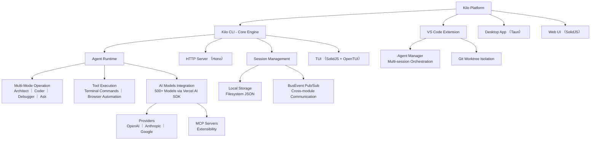
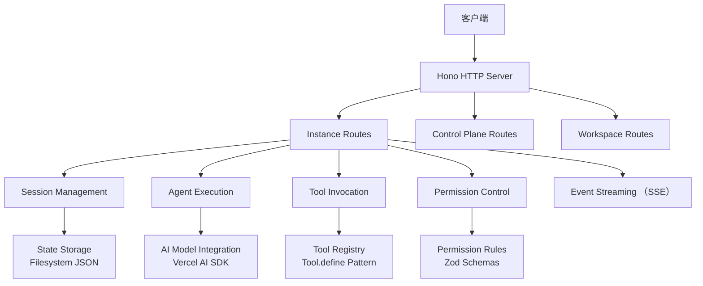

## Kilo Code

### 简介
[Kilo Code](https://github.com/kilo-org/kilocode) 是一个开源的一站式智能体工程（Agentic Engineering）平台，旨在通过 AI 智能体（Agents）自动化软件开发全流程。它是目前 GitHub 上非常活跃的项目，核心定位是作为开发者的 AI 辅助引擎，帮助构建、部署和迭代代码。


### 安装

```bash
# npm
npm install -g @kilocode/cli

# Or run directly with npx
npx @kilocode/cli
```

### Kilo CLI


### 主要功能


## Kilo项目核心能力分析

基于项目文档和代码结构分析，Kilo是一个开源的AI编码智能体平台，主要用于加速软件开发过程。它是OpenCode项目的fork版本，增强为全面的agentic工程平台。以下是其核心能力的详细分析：

### 1. **AI驱动的代码生成与自动化**
   - **核心功能**：支持从自然语言描述生成代码，例如用户输入"add input validation to the signup form"，智能体会自动生成相应的代码片段。
   - **自动化任务**：能够自动化重复性编码任务，如重构代码、运行测试、修复错误等。智能体会自我检查工作，确保代码质量。
   - **内联自动完成**：提供实时AI驱动的代码补全建议，提升编码效率。
   - **示例**：在CLI中使用`kilo run "add input validation to the signup form"`命令，智能体会解析任务、生成代码并应用更改。

### 2. **多模型AI集成**
   - **模型支持**：集成500+ AI模型，包括OpenAI（GPT系列）、Anthropic（Claude系列）、Google（Gemini系列）等。
   - **灵活配置**：用户可使用自有API密钥或Kilo平台的积分，无需强制提供密钥。
   - **透明定价**：定价与提供商一致，确保成本可控。
   - **架构基础**：使用Vercel AI SDK作为抽象层，支持动态加载模型配置。

### 3. **终端与浏览器自动化**
   - **终端命令执行**：智能体可在用户授权下运行shell命令，如构建、测试、部署等。
   - **浏览器自动化**：支持自动化浏览器操作，用于测试或数据抓取任务。
   - **安全机制**：在自主模式（--auto标志）下，可完全自动化运行，但仅适用于可信环境如CI/CD管道。

### 4. **多模式操作**
   - **内置模式**：
     - **Architect模式**：专注于系统设计和架构规划，仅限于编辑Markdown文件。
     - **Coder模式**：专注于编码任务，具备完整代码编辑权限。
     - **Debugger模式**：用于系统性问题诊断和解决。
     - **Ask模式**：优化用于问答和信息提供（当前模式）。
   - **自定义模式**：用户可定义项目特定模式，指定工具组、角色定义和指令。
   - **模式切换**：智能体可根据任务自动或手动切换模式，增强适应性。

### 5. **扩展能力与协议**
   - **MCP服务器市场**：通过Model Context Protocol（MCP）扩展智能体能力，用户可轻松发现和使用MCP服务器。
   - **技能包**：支持自定义技能包，包含领域专长、新能力和可重复工作流。
   - **工具集成**：遵循`Tool.define`模式定义工具，提供描述、参数和执行逻辑。

### 6. **会话与状态管理**
   - **持久化会话**：支持恢复之前对话，导出转录记录。
   - **状态存储**：使用本地文件系统存储JSON数据，基于项目目录的懒加载单例模式（Instance.state）。
   - **事件系统**：内置BusEvent pub/sub系统，用于模块间通信。

### 7. **平台多样性**
   - **Kilo CLI**：核心引擎，提供TUI（终端用户界面）、HTTP服务器和会话管理。
   - **VS Code Extension**：集成到VS Code，提供侧边栏聊天和Agent Manager（多会话编排面板，支持git worktree隔离）。
   - **Desktop App**：独立Tauri原生应用，单会话UI。
   - **Web UI**：共享SolidJS前端，用于桌面应用和CLI的`kilo web`命令。
   - **自主模式**：支持CI/CD集成，无用户交互运行。

### 8. **开发与架构特性**
   - **技术栈**：
     - **服务器**：Hono-based HTTP服务器，支持OpenAPI规范生成和SSE实时事件。
     - **TUI**：基于SolidJS + OpenTUI框架，JSX渲染终端界面。
     - **代码组织**：使用TypeScript命名空间模块（非类），函数包装器（如`fn(schema, callback)`）进行输入验证。
     - **错误处理**：结构化错误（NamedError），避免空catch块。
     - **日志**：使用`Log.create({ service: "name" })`模式。
   - **风格指南**：偏好单字变量名，避免`let`语句，使用早期返回和IIFE（立即调用函数表达式）。
   - **存储**：文件系统-based JSON存储，路径数组键值对。
   - **构建工具**：使用Bun + Turborepo，支持并行工具调用。

### 产品架构图
以下Mermaid图描述了Kilo项目的整体架构：



### 优势与应用场景
- **高效开发**：通过AI生成和自动化，显著减少手动编码时间。
- **灵活集成**：支持多种IDE和CI/CD环境，适应不同团队需求。
- **开源生态**：基于MIT许可证，鼓励社区贡献和定制。
- **应用场景**：快速原型开发、代码重构、自动化测试、文档生成、CI/CD流水线集成等。


## Kilo智能体运行时架构和工作原理

基于项目代码分析，Kilo的智能体运行时是一个基于Hono HTTP服务器的分布式架构，支持多会话、权限控制和实时通信。以下是详细分析：

### 1. **整体架构概述**
智能体运行时采用**客户端-服务器模型**：
- **服务器端**：基于Hono框架的HTTP服务器，提供REST API和SSE（Server-Sent Events）实时通信。
- **客户端**：包括CLI TUI、VS Code Extension、Desktop App和Web UI，通过HTTP + SSE与服务器通信。
- **状态管理**：每个项目目录维护独立的运行时实例，使用Effect库的Context和Layer模式管理依赖注入。

架构图如下：



### 2. **核心组件和工作原理**
#### **服务器启动流程**
- **入口点**：`packages/opencode/src/index.ts` 使用yargs解析命令，执行`ServeCommand`。
- **服务器初始化**：`packages/opencode/src/server/server.ts` 创建Hono应用，注册中间件（Auth, CORS, Compression, Error Handling）和路由。
- **监听端口**：服务器监听指定主机和端口，支持mDNS广播（可选）。

#### **实例管理（Instance Management）**
- **项目隔离**：每个项目目录通过`Instance.state()`创建懒加载单例状态，绑定到工作树目录。
- **生命周期**：实例在请求时初始化，包含配置、智能体、工具和服务。
- **清理机制**：支持SIGTERM/SIGINT信号处理，确保资源释放（`Instance.disposeAll()`）。

#### **智能体执行引擎（Agent Execution Engine）**
- **智能体定义**：`packages/opencode/src/agent/agent.ts` 定义智能体信息（Info），包括模式（primary/subagent/all）、权限规则（Permission.Ruleset）和模型配置。
- **内置智能体**：
  - `code`（原build）：默认编码智能体，支持工具执行。
  - `plan`：规划模式，禁用编辑工具。
  - `ask`：问答模式（Kilo扩展）。
  - `debug`：调试模式（Kilo扩展）。
  - `architect`：架构规划（Kilo扩展）。
- **智能体选择**：基于配置或默认智能体，权限合并用户和默认规则。
- **模式切换**：智能体可根据任务自动或手动切换模式，限制工具访问（例如Architect模式仅允许编辑.md文件）。

#### **工具系统（Tool System）**
- **工具定义**：使用`Tool.define(id, init)`模式，init返回`{ description, parameters, execute }`。
- **权限控制**：每个工具绑定权限规则，支持允许/拒绝/询问模式。
- **执行流程**：工具通过Effect库异步执行，输出自动截断。
- **扩展性**：支持MCP（Model Context Protocol）服务器扩展工具能力。

#### **模型集成（Model Integration）**
- **抽象层**：使用Vercel AI SDK统一接口，支持动态加载提供商（OpenAI, Anthropic, Google等）。
- **模型选择**：基于智能体配置选择模型，支持流式生成（`streamObject`）。
- **认证**：支持API密钥和OAuth，密钥存储在本地。

#### **通信协议**
- **REST API**：处理同步请求，如获取智能体列表、执行命令、读取文件。
- **SSE事件**：实时推送更新，如执行进度、日志、错误。
- **WebSocket升级**：用于PTY（伪终端）和实时交互。

#### **会话与存储**
- **会话管理**：支持多会话持久化，导出转录。
- **存储机制**：使用文件系统JSON存储，键为路径数组（`Storage.write(["session", id], data)`）。
- **数据库迁移**：从JSON迁移到SQLite，支持进度跟踪。

#### **权限与安全**
- **权限模型**：基于Zod Schema的规则集，支持全局/工具级/路径级控制。
- **认证中间件**：验证请求，防止未授权访问。
- **隔离**：项目级实例隔离，防止跨项目污染。

### 3. **运行时工作流程**
1. **初始化**：启动服务器，加载配置、插件、技能。
2. **请求处理**：客户端发送HTTP请求，服务器通过中间件验证和路由。
3. **智能体调度**：根据请求选择智能体，检查权限。
4. **工具执行**：智能体调用工具，执行异步操作，实时SSE推送状态。
5. **响应返回**：结果通过HTTP或SSE返回客户端。
6. **清理**：请求完成后释放资源，支持信号优雅关闭。

### 4. **关键设计模式**
- **Effect库**：用于异步错误处理和依赖注入，Layer模式构建服务栈。
- **Namespace模块**：代码组织为TypeScript命名空间，导出Zod Schema、类型和函数。
- **fn包装器**：`fn(schema, callback)` 自动输入验证。
- **BusEvent**：进程内pub/sub事件系统。
- **NamedError**：结构化错误报告。
- **单字命名**：风格指南偏好简洁变量名，避免`let`和`else`。

### 5. **扩展与定制**
- **插件系统**：支持运行时插件加载，修改系统行为。
- **技能包**：添加领域专长和工作流。
- **自定义智能体**：用户定义智能体，覆盖内置配置。
- **MCP集成**：通过协议扩展工具生态。


## Vercel AI SDK 的作用

### 主要功能和用途
1. **模型抽象层**：
   - 统一不同提供商的API调用方式，避免直接处理各家的SDK差异。
   - 支持动态加载提供商配置，通过npm包如`@ai-sdk/openai`、`@ai-sdk/anthropic`、`@ai-sdk/google`等。
   - 在`packages/opencode/src/provider/transform.ts`中，用于创建模型实例和处理请求转换。

2. **文本生成和流式响应**：
   - 提供`generateObject()`和`streamObject()`函数，用于生成结构化响应或流式文本。
   - 在智能体执行中（如`packages/opencode/src/agent/agent.ts`），用于处理AI模型的推理和生成任务。
   - 支持温度（temperature）、最大token等参数控制。

3. **模型消息处理**：
   - 定义`ModelMessage`类型，用于构造系统提示、用户输入和助手响应。
   - 支持多轮对话和上下文管理。

4. **提供商支持**：
   - 集成500+ AI模型，包括OpenAI GPT系列、Anthropic Claude、Google Gemini、Amazon Bedrock等。
   - 支持OAuth认证和API密钥管理。
   - 通过Vercel AI Gateway路由请求，统一计费和监控。

### 在Kilo架构中的位置
- **智能体执行**：智能体使用Vercel AI SDK调用模型生成代码、回答问题或执行任务。
- **工具集成**：工具调用结果通过SDK传递给模型，模型基于工具输出生成最终响应。
- **实时交互**：支持流式响应，用于TUI和Web UI的实时更新。


## 参考资料
- [Kilo Code](https://github.com/Kilo-Org/kilocode)
- [Kilo Org](https://github.com/Kilo-Org)
- [OpenCode](https://github.com/anomalyco/opencode)
- [Agentic Engineering for Humans](https://github.com/Kilo-Org/agentic-path)
- [OpenRouter - Coding Agents Rankings](https://openrouter.ai/apps/category/coding)
