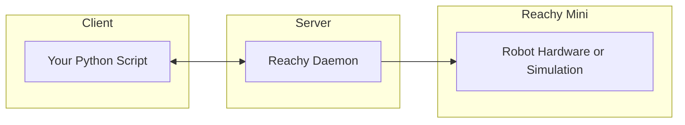

[Notebook 0 — First Connection & Movement](https://github.com/pollen-robotics/reachy_mini/blob/main/docs/notebooks/0-First-Connection-and-Movement.ipynb)
> 🎯 目标：连接 Reachy Mini 并执行你的第一条运动指令。

## 架构概述

Reachy Mini 采用**客户端-服务器架构**：



### 核心概念：

- **守护程序（Daemon）**：一个后台服务程序，直接控制机器人的电机、传感器、摄像头和音频。
- **Python SDK**：你用来发送指令的 `reachy_mini` 软件包。

### 为什么采用这种架构？

- 多个客户端可以同时连接（如网页应用、脚本、Jupyter Notebook）。
- 守护程序负责安全地处理底层硬件操作。
- 你可以通过网络远程控制机器人。例如，在与机器人连接的树莓派（Raspberry Pi）上运行守护程序，同时在性能强大的服务器上运行你的 AI 代码。


## 验证连接

在运行代码之前，请先确认机器人已启动并正常运行。

你应该使用 **Reachy Mini Control** 来检查机器人是否已连接并准备就绪。Reachy Mini Control 是一款桌面应用程序，可让你管理机器人、运行应用、播放表情以及控制其音响系统。如果尚未下载，请从[官方网站](https://hf.co/reachy-mini/#/download)下载。

在 Reachy Mini Control 中连接成功后，请确保机器人处于“**开启（ON）**”状态。

**在继续操作前，务必确认机器人已开启！尤其是使用无线版本时，在通电后，机器人代码默认处于关闭状态。**

如需排查问题，请参考文档中的“[连接与 Reachy Mini Control](https://huggingface.co/docs/reachy_mini/troubleshooting#-connection--reachy-mini-control)”部分。


## 首次连接

让我们使用 Reachy 的 Python SDK 连接到机器人！

```py
# 导入 ReachyMini 类
from reachy_mini import ReachyMini

# 连接机器人
# 注：media_backend="no_media" 暂时禁用摄像头/音频，下一教程讲解
with ReachyMini() as mini:
    print("成功连接 Reachy Mini！")
    print(f"机器人名称：{mini.robot_name}")
```


## 最佳实践

- **始终使用 `with` 语句**
  ```python
  with ReachyMini() as mini:
      # 在这里编写你的代码
  # 连接在此处自动关闭
  ```

- **实验时从较长的持续时间开始（1-2 秒）**
  - 慢速运动更安全
  - 熟悉后可逐渐加快速度

- **先测试小幅运动**
  - 从小角度开始（5-10 度）
  - 随着对限制的了解，逐步增加活动范围

- **留意机器人状态**
  - 观察是否有意外行为
  - 确保工作空间畅通无阻

- **在仿真环境中尝试**
  - 你也可以在仿真环境中与 Reachy Mini 互动！
  - 只需在终端中用 `sim` 参数实例化守护程序：`reachy-mini-daemon --sim`。这将打开一个 MuJoCo 仿真窗口，你可以在其中查看和控制 Reachy Mini，而无需实体硬件。这是在真实机器人上运行代码之前进行安全实验和测试的好方法。更多关于仿真的信息，请参阅文档中的[仿真部分](https://huggingface.co/docs/reachy_mini/platforms/simulation/get_started)。


## 首次运动

让 Reachy Mini 动起来吧！我们将从一个简单的表情丰富的姿势开始，然后回到中立位置——这是一个安全、居中的姿势，你将在所有笔记本中将其作为参考基准。

```py
from reachy_mini.utils import create_head_pose

with ReachyMini() as mini:
    # 好奇姿态：头部倾斜、天线张开
    print("切换至好奇姿态...")
    mini.goto_target(
        head=create_head_pose(roll=20, degrees=True),  # 头部右倾
        antennas=[0.3, -0.3],  # 天线向两侧张开
        duration=2.0,
    )

    # 回归中立位：头部朝前，天线竖直向上
    print("回归中立姿态...")
    mini.goto_target(
        head=create_head_pose(),  # 头部中立（全0）
        antennas=[0.0, 0.0],  # 天线中立（弧度）
        duration=2.0,
    )

    print("运动完成！")
```

- **`goto_target()`**：将机器人从当前位置平滑地移动到目标位置
- **`create_head_pose(roll=20, degrees=True)`**：创建一个头部向右倾斜 20 度的姿势。`degrees=True` 参数让你可以直接使用度数而非弧度。
- **`antennas=[0.3, -0.3]`**：将两根天线向外展开（右侧天线向内为正 `+`，左侧天线向内为负 `-`）
- **`create_head_pose()`**：不带参数调用时，创建**中立姿势**（x=0, y=0, z=0, roll=0, pitch=0, yaw=0）—— 头部直视前方
- **`antennas=[0.0, 0.0]`**：两根天线竖直向上 —— 中立天线位置
- **`duration=2.0`**：动作持续 2 秒。时间越长 = 越慢越平滑；时间越短 = 越快

**⚠️ 提示**：在每次运动之间回到中立位置是个好习惯，这样可以为你提供可预测的起始点，并确保机器人安全。


## 头部运动

头部有 6 个自由度

- 平移（translation）：
    - X 轴
    - Y 轴
    - Z 轴
- 旋转（rotation）：
    - Roll（翻滚）
    - Pitch（俯仰）
    - Yaw（偏航）

### 平移（Translation）

头部可平移

- X 轴：**前后**
- Y 轴：**左右**（右→左）
- Z 轴：**上下**（下→上）


```py
# 导入 ReachyMini 类
from reachy_mini import ReachyMini
from reachy_mini.utils import create_head_pose

# 连接机器人
with ReachyMini() as mini:
    # 从中立开始
    mini.goto_target(head=create_head_pose(), antennas=[0.0, 0.0], duration=1.0)

    # X轴 前后平移
    print("头部向后平移...")
    mini.goto_target(head=create_head_pose(x=-0.02), duration=1.0)
    print("头部向前平移...")
    mini.goto_target(head=create_head_pose(x=0.02), duration=1.0)
    mini.goto_target(head=create_head_pose(), duration=1.0)

    # Y轴 左右平移
    print("头部向右平移...")
    mini.goto_target(head=create_head_pose(y=-0.02), duration=1.0)
    print("头部向左平移...")
    mini.goto_target(head=create_head_pose(y=0.02), duration=1.0)
    mini.goto_target(head=create_head_pose(), duration=1.0)

    # Z轴 上下平移
    print("头部向下平移...")
    mini.goto_target(head=create_head_pose(z=-0.02), duration=1.0)
    print("头部向上平移...")
    mini.goto_target(head=create_head_pose(z=0.02), duration=1.0)
    mini.goto_target(head=create_head_pose(), duration=1.0)

    print("平移运动完成！")
```

- **goto_target()**：让机器人从**当前位置平滑移动到目标位置**
- **create_head_pose()**：根据你设定的参数，**创建你想要的头部姿态**。在这里只修改了平移数值（x、y 或 z）。当然，你也可以**同时修改所有参数**。

### 旋转（Rotation）

头部可沿 3 个轴进行旋转：

- **Roll**（翻滚）：（绕 X 轴旋转）
    - 正值（➕） = 右倾
    - 负值（➖） = 左倾
- **Pitch**（俯仰）：（绕 Y 轴旋转）
    - 正值（➕） = 低头
    - 负值（➖） = 抬头
- **Yaw**（偏航）：（绕 Z 轴旋转）
    - 正值（➕） = 向左看
    - 负值（➖） = 向右看


```py
# 导入 ReachyMini 类
from reachy_mini import ReachyMini
from reachy_mini.utils import create_head_pose

# 连接机器人
with ReachyMini() as mini:
    mini.goto_target(head=create_head_pose(), antennas=[0.0, 0.0], duration=1.0)

    # Roll 左右倾斜
    print("头部右倾...")
    mini.goto_target(head=create_head_pose(roll=20, degrees=True), duration=1.0)
    mini.goto_target(head=create_head_pose(), duration=1.0)
    print("头部左倾...")
    mini.goto_target(head=create_head_pose(roll=-20, degrees=True), duration=1.0)
    mini.goto_target(head=create_head_pose(), duration=1.0)

    # Pitch 上下点头
    print("低头...")
    mini.goto_target(head=create_head_pose(pitch=15, degrees=True), duration=1.0)
    print("抬头...")
    mini.goto_target(head=create_head_pose(pitch=-15, degrees=True), duration=1.0)
    mini.goto_target(head=create_head_pose(), duration=1.0)

    # Yaw 左右摇头
    print("向左摇头...")
    mini.goto_target(head=create_head_pose(yaw=30, degrees=True), duration=1.0)
    print("向右摇头...")
    mini.goto_target(head=create_head_pose(yaw=-30, degrees=True), duration=1.0)
    mini.goto_target(head=create_head_pose(), duration=1.0)

    print("旋转运动完成！")
```

⚠️ 在处理角度时，务必使用 `degrees=True`！

Reachy Mini 设有物理和软件上的限制，以防止自碰撞和损坏。SDK 会自动将数值限制在最近的有效位置。例如，翻滚角（roll）的限制为 ±40 度，这意味着如果你尝试将翻滚角设为 50 度，它会被自动限制为 40 度。完整的运动范围请参见文档[核心概念部分](https://huggingface.co/docs/reachy_mini/SDK/core-concept#safety-limits-)中的说明。


## 移动天线（Antennas）

天线非常适合用来表达情感和注意力！

```py
import numpy as np

# 导入 ReachyMini 类
from reachy_mini import ReachyMini
from reachy_mini.utils import create_head_pose

# 连接机器人
with ReachyMini() as mini:
    # 从中立开始
    mini.goto_target(head=create_head_pose(), antennas=[0.0, 0.0], duration=1.0)

    # Both antennas outward (excited/alert)
    # 两个天线都向外（兴奋/警觉）
    print("Excited!")
    for _ in range(5):
        mini.goto_target(
            head=create_head_pose(),
            antennas=[
                np.deg2rad(-10),
                np.deg2rad(10),
            ],  # Right outward (-), Left outward (+) # 右向外（负值），左向外（正值）
            duration=0.1,
        )
        mini.goto_target(
            head=create_head_pose(),
            antennas=[
                np.deg2rad(10),
                np.deg2rad(-10),
            ],  # Right outward (+), Left outward (-) # 右向外（正值），左向外（负值）
            duration=0.1,
        )

    # Both antennas outward (sad/tired)
    # 两个天线都向外（悲伤/疲惫）
    print("Sad...")
    mini.goto_target(
        head=create_head_pose(),
        antennas=[
            np.deg2rad(-140),
            np.deg2rad(140),
        ],  # Right outward (-), Left outward (+) # 右向外（负值），左向外（正值）
        duration=3.0,
    )

    # 回到中立
    mini.goto_target(head=create_head_pose(), antennas=[0.0, 0.0], duration=1.0)

    # Alternating (thinking/confused)
    # 交替（思考/困惑）
    print("Confused?")
    mini.goto_target(
        head=create_head_pose(),
        antennas=[np.deg2rad(-60), np.deg2rad(-30)],
        duration=1.0,
    )
    # Right out, left in - we don't put the same value to create the confusion effect
    # 右向外，左向内 - 我们不使用相同的数值以营造困惑效果

    # 回到中立
    mini.goto_target(head=create_head_pose(), antennas=[0.0, 0.0], duration=1.0)

    print("Done!")
```

- 天线以`[右, 左]`的格式、用**弧度制**指定，且指向相同方向：**正指令**会将天线移向**右侧**，**负指令**则移向**左侧**。因此，要实现对称动作，需要对两个天线发出相反的指令：
    - 右侧天线：
        - 负值向外倾斜
        - 正值向内倾斜
    - 左侧天线：
        - 正值向外倾斜
        - 负值向内倾斜
- 你可以通过 `np.deg2rad(45)` 或 `np.radians(45)` 将度数转换为弧度。
- 天线非常适合展现个性！不妨多试试，让 Reachy Mini 更具独特风格。


## 结合头部与天线运动

现在让我们通过组合两者来创造更复杂的表情！

```python
with ReachyMini() as mini:
    # 好奇的表情：歪头 + 不对称的天线
    print("好奇...")
    mini.goto_target(
        head=create_head_pose(roll=20, degrees=True),
        antennas=[np.deg2rad(-60), np.deg2rad(-30)],
        duration=2.0,
    )

    # 回到中立位置
    mini.goto_target(head=create_head_pose(), antennas=[0.0, 0.0], duration=1.0)

    # 悲伤：低头 + 天线低垂
    print("悲伤...")
    mini.goto_target(
        head=create_head_pose(pitch=30, degrees=True),
        antennas=(np.deg2rad(-140), np.deg2rad(140)),
        duration=3.0,
    )

    # 回到中立位置
    mini.goto_target(head=create_head_pose(), antennas=[0.0, 0.0], duration=1.0)

    print("完成！")
```

**组合运动的小贴士：**

- 你可以通过同步头部朝向与天线位置来创造富有表现力的行为。例如：
  - **悲伤表情**：低头 + 天线向外低垂
  - **好奇表情**：歪头 + 不对称天线
  - **兴奋表情**：抬头 + 天线快速摆动

- **时机把握很关键**：对于情感表达，使用较长的持续时间（2-3 秒）能让动作更可信、更自然
- **尝试不对称**：不同的天线位置能带来更多的个性和特色


## 播放预录的情感

手动设计每一个姿势确实富有表现力，但 Reachy Mini 也**自带了一个预录情感库**——这些完整的动作序列结合了头部和天线的运动，可以表达喜悦、惊讶、无聊等多种情感。

这些情感数据存储在 HuggingFace 数据集 [pollen-robotics/reachy-mini-emotions-library](https://huggingface.co/datasets/pollen-robotics/reachy-mini-emotions-library) 中，可以直接通过 SDK 进行流式传输和播放。你可以在 [Reachy Mini Emotion App](https://huggingface.co/spaces/RemiFabre/emotions) 中浏览和预览所有情感。

下面让我们加载数据集并播放几个情感吧！

```python
from reachy_mini.motion.recorded_move import RecordedMoves

EMOTIONS_DATASET = "pollen-robotics/reachy-mini-emotions-library"

emotions = RecordedMoves(EMOTIONS_DATASET)

print(f"共有 {len(emotions.list_moves())} 种情感可用：")
print(emotions.list_moves())
```

该应用程序中提供了 81 种情感，你也可以通过 SDK 控制头部和天线来创建自己的自定义情感。这是练习和发挥 Reachy Mini 表现力的好方法！

让我们播放一个应用程序中的随机情感，看看机器人的表现如何！每次运行，它都会从 81 种情感中随机选择一种，并在你的 Reachy Mini 上执行相应的头部和天线动作。这是探索机器人各种表情的趣味方式！

你也可以尝试在机器人上复现这些情感，并以此为灵感创作属于你自己的表情！

```python
# 从数据集中随机选取一种情绪并进行播放

import asyncio
import random
from reachy_mini import ReachyMini
from reachy_mini.motion.recorded_move import RecordedMoves

EMOTIONS_DATASET = "pollen-robotics/reachy-mini-emotions-library"

async def play_random_emotion():
    # 1. 加载动作库
    emotions = RecordedMoves(EMOTIONS_DATASET)
    move_list = emotions.list_moves()

    # 2. 使用标准的 with (同步) 初始化机器人
    # 即使在异步函数内，如果对象本身不支持 async with，也要用 with
    with ReachyMini() as mini:
        emotion_name = random.choice(move_list)
        print(f"正在播放“{emotion_name}”...")
        
        # 3. 此时再调用异步执行方法
        await mini.async_play_move(emotions.get(emotion_name), initial_goto_duration=1.0)
        print("完成！")

if __name__ == "__main__":
    asyncio.run(play_random_emotion())
```


[Notebook 1 — Basic Media: Camera & Audio](https://github.com/pollen-robotics/reachy_mini/blob/main/docs/notebooks/1-Basic-Media-Camera-and-Audio.ipynb)
> 🎯 目标：学习拍摄图像、录制音频与播放声音 —— 让 Reachy 看得见、听得见！

⚠️ 注意：本笔记本需要摄像头和麦克风能够正常工作。这次请务必不要使用 `media_backend="no_media"`！

## 相机基础知识 📸

### 拍摄你的第一张图像

让我们从 Reachy 的摄像头中捕获一帧图像并显示出来！

```python
import cv2
from reachy_mini import ReachyMini

# 连接时启用媒体功能（注意，我们没有使用 media_backend="no_media"）
with ReachyMini() as mini:
    print("正在捕获图像...")

    # 从摄像头获取一帧画面
    frame = mini.media.get_frame()
    # 可能需要稍等片刻，让摄像头完成初始化，因此可以循环等待，直到获得有效帧
    while frame is None:
        print("等待摄像头初始化...")
        time.sleep(0.5)
        frame = mini.media.get_frame()

    # 检查是否获得了有效帧
    if frame is not None:
        print("✓ 图像捕获成功！")
        print(f"  分辨率：{frame.shape[1]}x{frame.shape[0]}")
        print(f"  通道数：{frame.shape[2]}（BGR 格式）")
        print(f"  数据类型：{frame.dtype}")

        _, buffer = cv2.imencode(".jpg", frame)
        display(IPImage(data=buffer.tobytes()))
    else:
        print("✗ 图像捕获失败")
```

- `mini.media.get_frame()`：返回一个包含图像的 numpy 数组
- 格式：OpenCV 格式（BGR 颜色顺序）
- 形状：(高度, 宽度, 通道数)
- 数据类型：uint8（每个像素的取值范围为 0-255）

⚠️ 重要提示：获取的帧为 BGR 格式（蓝-绿-红）。使用 IPython.display 保存或显示时，OpenCV 会自动处理编码。

### 将图像保存到磁盘

让我们把捕获的图像保存为文件。

```python
import cv2
from reachy_mini import ReachyMini

with ReachyMini() as mini:
    frame = mini.media.get_frame()
    while frame is None:
        print("等待摄像头初始化...")
        time.sleep(0.5)
        frame = mini.media.get_frame()

    if frame is not None:
        # 使用 OpenCV 保存（无需转换——它本身就要求 BGR 格式）
        filename = f"reachy_photo_{int(time.time())}.jpg"
        cv2.imwrite(filename, frame)
        print(f"✓ 图像已保存为：{filename}")
    else:
        print("✗ 没有可保存的帧")
```

### 实时摄像头画面

你还可以使用 `clear_output` 在 notebook 中直接串流摄像头画面！

```python
import cv2
from reachy_mini import ReachyMini
from IPython.display import clear_output

STREAM_DURATION = 10  # 秒

with ReachyMini() as mini:
    # 等待摄像头初始化
    frame = mini.media.get_frame()
    while frame is None:
        time.sleep(0.1)
        frame = mini.media.get_frame()

    start_time = time.time()
    while time.time() - start_time < STREAM_DURATION:
        frame = mini.media.get_frame()
        if frame is not None:
            _, buffer = cv2.imencode(".jpg", frame)
            clear_output(wait=True)
            display(IPImage(data=buffer.tobytes()))
        time.sleep(0.033)  # 约 30 fps

print("串流结束！")
```

## 音频基础 🎤🔊
### 了解 Reachy 的音频系统

Reachy Mini 配备：

- 麦克风阵列：ReSpeaker 4 麦克风阵列
- 扬声器：用于播放声音
- 采样率：16 kHz（每秒 16,000 个采样点）
- 格式：单声道或立体声音频，取决于具体操作

让我们检查一下音频配置：

```python
from reachy_mini import ReachyMini

with ReachyMini() as mini:
    input_rate = mini.media.get_input_audio_samplerate()
    output_rate = mini.media.get_output_audio_samplerate()

    print(f"输入（麦克风）采样率：{input_rate} Hz")
    print(f"输出（扬声器）采样率：{output_rate} Hz")
```

### 录制音频

让我们用麦克风录制 3 秒音频。

```python
import time
import numpy as np
from reachy_mini import ReachyMini

RECORD_DURATION = 3  # 秒

with ReachyMini() as mini:
    print(f"录制时长 {RECORD_DURATION} 秒...")
    print("🎤 说点什么或发出声音吧！")

    # 开始录制
    mini.media.start_recording()

    audio_samples = []
    sample_rate = mini.media.get_input_audio_samplerate()
    target_samples = int(RECORD_DURATION * sample_rate)  # 需要采集的总采样点数
    total_samples_collected = 0

    # 持续采集音频采样点，直到达到目标数量
    while total_samples_collected < target_samples:
        sample = mini.media.get_audio_sample()

        if sample is not None:
            audio_samples.append(sample)
            total_samples_collected += len(sample)
            current_duration = total_samples_collected / sample_rate
            print(f"\r录制中... {current_duration:.1f}秒", end="")
        else:
            # 仅在没有新采样点时休眠等待
            time.sleep(0.01)

    # 停止录制
    mini.media.stop_recording()

    print("\n✓ 录制完成！")
    print(f"  共捕获 {len(audio_samples)} 个采样块")

    # 拼接音频数据并按精确时长裁剪
    if audio_samples:
        audio_data = np.concatenate(audio_samples, axis=0)
        audio_data = audio_data[:target_samples]  # 裁剪至精确长度
        print(f"  音频数据总形状：{audio_data.shape}")
        print(f"  时长：{len(audio_data) / sample_rate:.2f} 秒")
    else:
        print("  ⚠ 未捕获到音频数据")
        audio_data = None
```

- `start_recording()`：启用麦克风音频采集
- `get_audio_sample()`：返回一个音频数据块（numpy 数组）
- `stop_recording()`：关闭音频采集
- 数据格式：float32 类型的 numpy 数组
- 采样块：每次调用 `get_audio_sample()` 会返回一个小数据块（通常相当于 0.1 到 0.2 秒的音频）

⚠️ 重要提示：我们跟踪的是采集到的音频采样点总数（而非实际耗时），以确保精确获取所请求时长的音频。随后我们会将最终音频数据裁剪至精确长度，避免录制时间比预期略长。

⚠️ 性能提示：为了实现最佳响应速度，我们仅在无采样点可用（sample 为 None）时休眠。这样就能以最快的速度处理传入的音频数据，这对于声音检测或监控等实时应用尤为重要。

你也可以直接在 notebook 中使用 IPython 的 Audio 组件播放录制好的音频——无需通过扬声器输出！

⚠️ 注意：Audio 组件仅在**基于浏览器的 Jupyter 服务器**（在终端中运行 `jupyter notebook` 或 `jupyter lab`）中才会发出声音。在 VS Code 的 notebook 编辑器中，它能够正常显示，但会保持静音。

```python
from IPython.display import Audio

if audio_data is not None:
    # Audio 组件需要单声道（1D）或通道优先（2, N）格式的数组。
    # ReSpeaker 返回的是（采样点数, 通道数）格式，因此我们取各通道的平均值。
    mono = audio_data.mean(axis=1) if audio_data.ndim > 1 else audio_data
    display(Audio(data=mono, rate=sample_rate))
else:
    print("尚未录制音频。请先运行录制单元格！")
```

### 将音频保存到文件

让我们把录制的音频保存为 WAV 文件。

```python
if audio_data is not None and len(audio_data) > 0:
    filename = f"reachy_recording_{int(time.time())}.wav"
    sample_rate = 16000

    # 使用 soundfile 保存
    sf.write(filename, audio_data, sample_rate)
    print(f"✓ 音频已保存为：{filename}")
    print("  你可以用任何媒体播放器播放它！")
else:
    print("没有可保存的音频数据。请先运行录制单元格！")
```

### 播放音频

现在，让我们通过 Reachy 的扬声器来播放音频！

为此，我们将创建一个简单的辅助函数：

```python
def play_audio_file(mini, audio_file_path):
    """通过 Reachy 的扬声器播放音频文件。

    参数：
        mini：ReachyMini 实例
        audio_file_path：WAV 文件的路径

    """
    # 加载音频文件
    data, _ = sf.read(audio_file_path, dtype="float32")

    # 开始播放
    mini.media.start_playing()
    print("🔊 正在播放音频...")

    # 以块的形式推送音频采样点
    chunk_size = 1024
    for i in range(0, len(data), chunk_size):
        chunk = data[i : i + chunk_size]
        mini.media.push_audio_sample(chunk)

    # 等待播放完成
    time.sleep(len(data) / mini.media.get_output_audio_samplerate())
    mini.media.stop_playing()
    print("✓ 播放完成！")

print("辅助函数已定义！")
```

它使用了 ReachyMini 的不同功能：

- `get_output_audio_samplerate()`：获取 ReachyMini 所需的采样率，以便在需要时进行重采样。
- `start_playing()`：启动音频输出
- `push_audio_sample()`：将音频数据推送到输出设备
- `stop_playing()`：停止音频输出

现在，让我们用新创建的函数来播放刚刚录制的音频！

```python
import time
import soundfile as sf
from reachy_mini import ReachyMini

# 请确保先运行录制和保存单元格！
# 将以下文件名更新为你实际保存的录制文件
audio_file = "reachy_recording_1770979828.wav"  # 请更新为实际文件名

# 或者使用变量中最后保存的文件
if "filename" in dir():
    audio_file = filename
    print(f"正在使用文件：{audio_file}")

try:
    with ReachyMini() as mini:
        play_audio_file(mini, audio_file)
except FileNotFoundError:
    print(f"⚠ 文件未找到：{audio_file}")
    print("请确保先运行录制和保存单元格！")
```

### 生成并播放提示音

让我们通过编程来生成一个简单的蜂鸣声！

```python
import time
import numpy as np
from reachy_mini import ReachyMini

def generate_beep(frequency=440, duration=0.5, sample_rate=16000):
    """生成一个简单的正弦波提示音。

    参数：
        frequency：频率（单位：Hz，440 = A 音）
        duration：持续时间（单位：秒）
        sample_rate：采样率（单位：Hz）

    返回：
        音频采样点的 numpy 数组

    """
    t = np.linspace(0, duration, int(sample_rate * duration))
    tone = 0.3 * np.sin(2 * np.pi * frequency * t)  # 0.3 = 音量

    # 添加淡入/淡出效果以避免咔嗒声
    fade_samples = int(sample_rate * 0.01)  # 10 毫秒的淡入淡出
    fade_in = np.linspace(0, 1, fade_samples)
    fade_out = np.linspace(1, 0, fade_samples)
    tone[:fade_samples] *= fade_in
    tone[-fade_samples:] *= fade_out

    return tone.astype(np.float32)


# 生成一个蜂鸣声
beep = generate_beep(frequency=880, duration=0.3)  # 高音 A

with ReachyMini() as mini:
    mini.media.start_playing()
    print("🔔 蜂鸣！")

    # 推送蜂鸣声数据
    chunk_size = 1024
    for i in range(0, len(beep), chunk_size):
        chunk = beep[i : i + chunk_size]
        mini.media.push_audio_sample(chunk)

    time.sleep(0.5)
    mini.media.stop_playing()
    print("完成！")
```

### 调整音量

你可以通过守护进程的 **REST API** 调整 Reachy Mini 的扬声器和麦克风音量。这在音频输出太响或太轻时非常有用。

⚠️ **注意**：音量控制由守护进程管理，而非直接通过 Python SDK 进行。我们使用 `requests` 库来调用该 API。

守护进程的 URL 取决于你的设置：

- **Lite 版本**：http://localhost:8000
- **无线版本**：http://reachy-mini.local:8000（或机器人的 IP 地址）

```python
import requests

# 根据你的设置调整此 URL：
# - Lite 版本："http://localhost:8000"
# - 无线版本："http://reachy-mini.local:8000"（或机器人的 IP 地址）
DAEMON_URL = "http://reachy-mini.local:8000"

# 获取当前扬声器音量
response = requests.get(f"{DAEMON_URL}/api/volume/current")
print(f"扬声器音量：{response.json()['volume']}%")

# 设置扬声器音量（0-100）
response = requests.post(f"{DAEMON_URL}/api/volume/set", json={"volume": 75})
print(f"扬声器音量已设置为：{response.json()['volume']}%")

# 你也可以控制麦克风输入音量：
response = requests.get(f"{DAEMON_URL}/api/volume/microphone/current")
print(f"麦克风音量：{response.json()['volume']}%")
```

可用的音量端点：

| 端点 | 方法 | 描述 |
|---|---|---|
| /api/volume/current | GET | 获取当前扬声器音量（0-100） |
| /api/volume/set | POST | 设置扬声器音量（{"volume": 75}） |
| /api/volume/microphone/current | GET | 获取当前麦克风音量 |
| /api/volume/microphone/set | POST | 设置麦克风音量 |

你也可以通过 **Reachy Mini Control** 来调整音量。

⚠️ 提示：你还可以在 http://{守护进程地址}:8000/docs 交互式地浏览所有可用的 API 端点。

### 结合媒体与动作

让我们将所学内容融会贯通，让 Reachy 更具互动性！

**示例：带倒计时的拍照环节**

本示例创建了一个有趣的拍照流程，融合了以下功能：

- 🎵 音频：用于倒计时和成功提示的蜂鸣声
- 🤖 动作：头部定位与触角摆动
- 📸 摄像头：拍摄最终照片

机器人将会：

1. 移动至中立位置
2. 通过蜂鸣声和触角动作从 3 倒数到 1
3. 拍摄照片
4. 播放成功提示音并执行庆祝动画
5. 显示拍摄的照片

```python
# “拍照”行为：蜂鸣、看向摄像头、拍照、再次蜂鸣
with ReachyMini() as mini:
    print("📸 拍照环节开始...")

    # 移至中立位置
    mini.goto_target(head=create_head_pose(), antennas=[0.0, 0.0], duration=1.0)

    # 伴随蜂鸣声与头部动作进行倒计时
    for i in [3, 2, 1]:
        print(f"  {i}...")

        # 蜂鸣
        beep = generate_beep(frequency=440 + i * 100, duration=0.2)
        mini.media.start_playing()
        for j in range(0, len(beep), 1024):
            mini.media.push_audio_sample(beep[j : j + 1024])

        # 摆动触角
        mini.goto_target(antennas=[0.3, -0.3], duration=0.3)
        mini.goto_target(antennas=[0.0, 0.0], duration=0.3)

        time.sleep(0.5)

    # 拍照！
    print("  📸 咔嚓！")
    frame = mini.media.get_frame()

    # 成功提示音（音调更高）
    success_beep = generate_beep(frequency=840, duration=0.4)
    mini.media.start_playing()
    for j in range(0, len(success_beep), 1024):
        mini.media.push_audio_sample(success_beep[j : j + 1024])
    time.sleep(0.5)
    # mini.media.stop_playing()

    # 庆祝动画
    mini.goto_target(
        head=create_head_pose(pitch=-10, degrees=True),
        antennas=[0.5, -0.5],
        duration=0.5,
    )

    # 保存并显示
    if frame is not None:
        filename = f"reachy_selfie_{int(time.time())}.jpg"
        cv2.imwrite(filename, frame)
        print(f"\n✓ 照片已保存：{filename}")

        # 显示
        _, buffer = cv2.imencode(".jpg", frame)
        display(IPImage(data=buffer.tobytes()))

    # 返回中立位置
    mini.goto_target(head=create_head_pose(), antennas=[0.0, 0.0], duration=1.0)
```


## 参考资料
- [Reachy Mini](https://github.com/pollen-robotics/reachy_mini)
- [Notebook 0 — First Connection & Movement](https://github.com/pollen-robotics/reachy_mini/blob/main/docs/notebooks/0-First-Connection-and-Movement.ipynb)
- [Notebook 1 — Basic Media: Camera & Audio](https://github.com/pollen-robotics/reachy_mini/blob/main/docs/notebooks/1-Basic-Media-Camera-and-Audio.ipynb)
