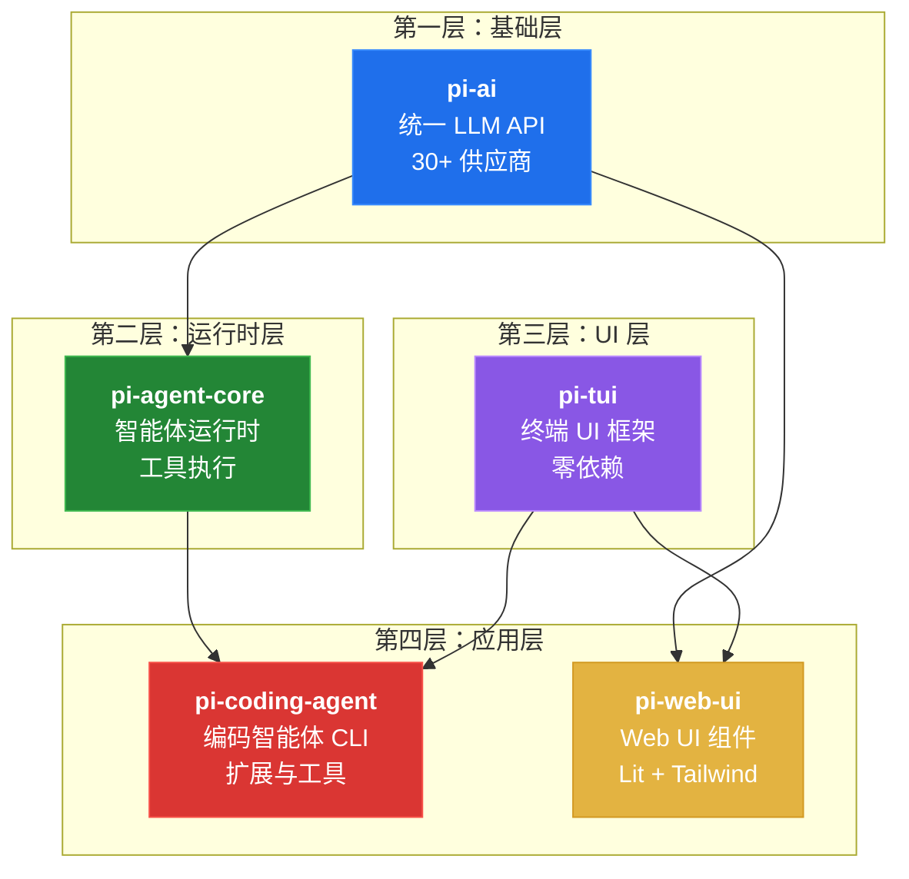
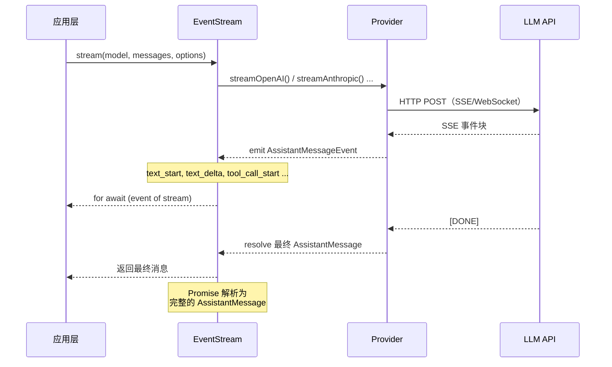
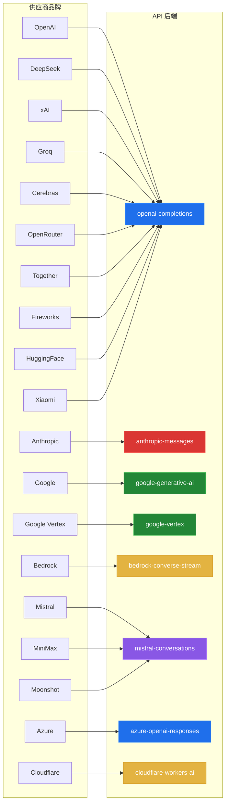
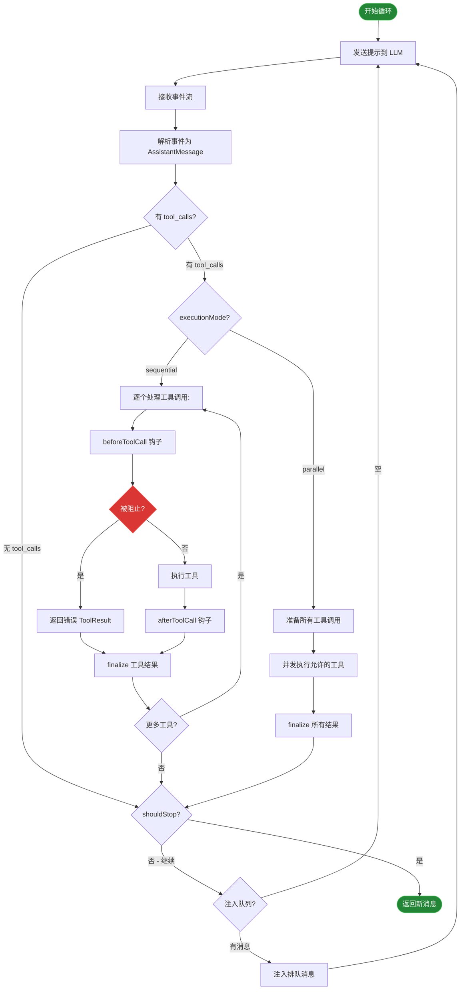
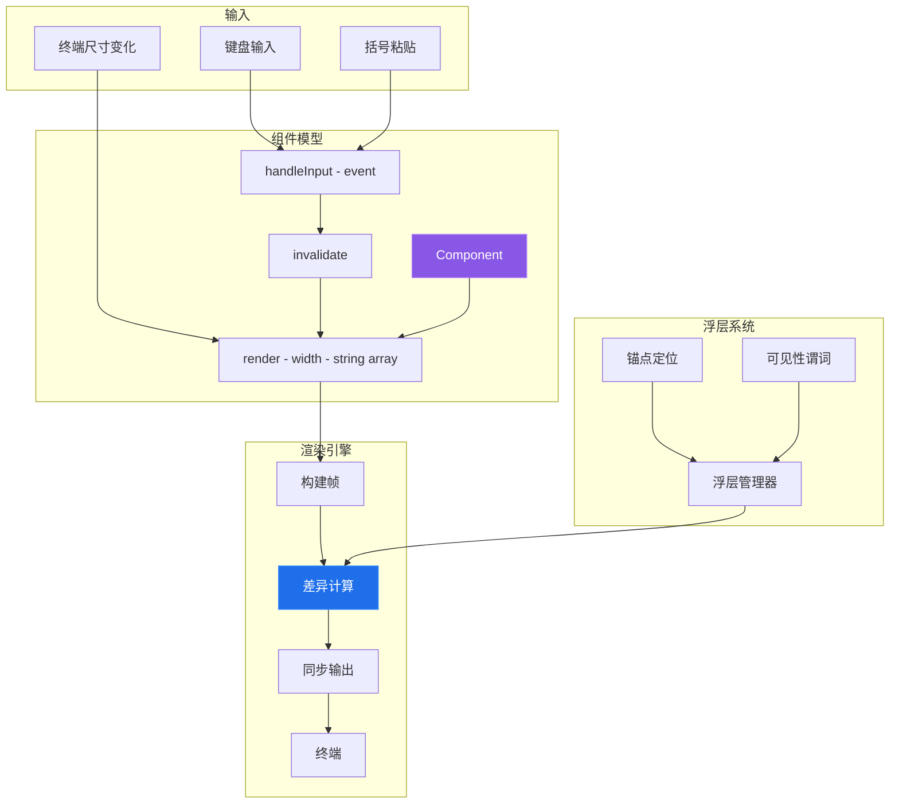
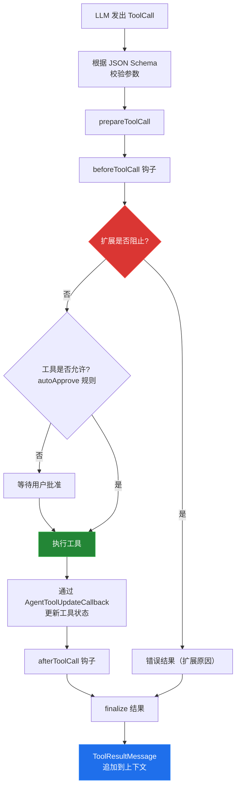
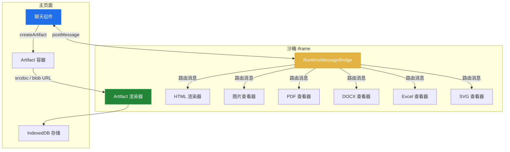
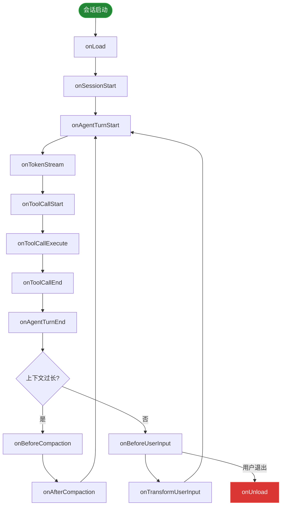
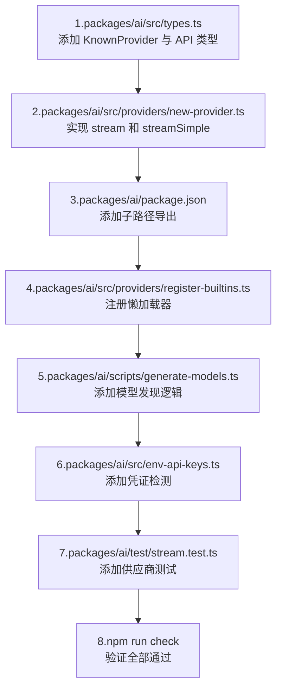

Pi 是一个模块化的 AI 编码智能体 Monorepo，使用 TypeScript 构建。它提供统一的 LLM 抽象层、通用的智能体运行时、丰富的终端 UI 框架，以及完全可扩展的编码智能体命令行工具。

---

## 1. 项目概览

Pi（`@earendil-works/pi-mono`）是由 Mario Zechner 开发的 AI 编码智能体 Monorepo，设计理念是**模块化、可扩展、供应商无关**。它将多个 LLM 供应商的复杂性抽象为统一 API，提供强大的智能体运行时和工具执行能力，并附带生产就绪的终端 UI。

### 核心能力

| 能力 | 说明 |
|------|------|
| **统一 LLM API** | 9 种 API 协议和 30+ 供应商品牌的单一接口。只需修改一个字符串即可切换供应商。 |
| **智能体运行时** | 完整的智能体循环，支持并行工具执行、消息注入队列和上下文压缩。 |
| **丰富的终端 UI** | 独立的终端 UI 框架，支持差异化渲染、文本编辑器、图片显示和浮层系统。 |
| **扩展系统** | 80+ 扩展示例、20+ 生命周期钩子。可注册工具、命令、快捷键和供应商。 |
| **Web 组件** | 基于 Lit 的聊天 UI，支持沙箱化 Artifact 渲染（HTML、SVG、PDF、DOCX 等）。 |
| **多运行模式** | 交互式终端、管道友好的打印模式，以及用于 IDE 集成的 JSONL RPC 模式。 |

### 包依赖关系图



*图 1: Pi monorepo 包依赖关系图 — 4 层架构，5 个包*

### 技术栈

| 领域 | 工具 | 说明 |
|------|------|------|
| 语言 | TypeScript 5.7+ | 严格模式，禁止 `any` |
| 构建 | tsgo（Go 编写的 TS 编译器） | 大部分包使用；web-ui 使用 tsc |
| 代码检查 | Biome 2.3.5 | Tab 缩进、3 空格、120 字符宽度 |
| 测试 | Vitest / Node 内置测试运行器 | 模拟供应商测试工具 |
| CI | GitHub Actions | 贡献者门控、Bun 跨平台构建 |
| 包管理 | npm workspaces | 锁步版本管理 |
| Web | Lit + Tailwind CSS v4 | Web Components |

---

## 2. 包架构详解

每个包都有明确的单一职责。下表总结了每个包的角色、关键导出和依赖关系。

| 包名 | 职责 | 关键导出 | 依赖 |
|------|------|----------|------|
| `@earendil-works/pi-ai` | 统一的多供应商 LLM API | `stream()`、`Model`、`Message`、`EventStream` | typebox |
| `@earendil-works/pi-agent-core` | 通用智能体运行时 | `agentLoop()`、`AgentMessage`、`AgentTool` | pi-ai |
| `@earendil-works/pi-tui` | 独立的终端 UI 框架 | `TUI`、`Component`、`Overlay`、`Editor` | （无） |
| `@earendil-works/pi-coding-agent` | 编码智能体 CLI 主应用 | `AgentSession`、`ExtensionAPI`、7 个内置工具 | ai, agent, tui |
| `@earendil-works/pi-web-ui` | Web UI 聊天组件 | Lit 组件、Artifact 系统、IndexedDB 存储 | ai, tui, lit |

> **设计哲学**: 底层包完全独立。`pi-tui` 零内部依赖，可独立使用。`pi-ai` 仅依赖 typebox 做 JSON Schema。每个包都可以被独立消费。

---

## 3. `pi-ai`: 统一 LLM 抽象层

`pi-ai` 包提供了一个统一的 API，支持跨 9 种 API 协议和 30+ 供应商品牌的流式 LLM 补全。它是所有其他包构建的基础。

### API 后端（9 种协议）

| API 标识符 | 协议 | 使用该协议的供应商 |
|-----------|------|-------------------|
| `openai-completions` | OpenAI Chat Completions | OpenAI、DeepSeek、xAI、Groq、Cerebras、OpenRouter、Together、Fireworks 等 |
| `anthropic-messages` | Anthropic Messages | Anthropic |
| `google-generative-ai` | Google Gemini API | Google AI Studio |
| `google-vertex` | Google Vertex AI | Google Cloud |
| `bedrock-converse-stream` | AWS Bedrock | Amazon Bedrock |
| `openai-responses` | OpenAI Responses API | OpenAI（较新模型） |
| `azure-openai-responses` | Azure OpenAI | Azure |
| `openai-codex-responses` | OpenAI Codex | OpenAI Codex |
| `mistral-conversations` | Mistral API | Mistral、MiniMax、Moonshot AI |

### EventStream：推拉式流式原语

`pi-ai` 的核心是 `EventStream<Event, Final>` 类型。它将基于推送的 SSE 事件与基于拉取的异步迭代桥接起来，让消费者既能实时处理流式事件，又能通过 Promise 获取最终结果。



*图 2: EventStream 推拉式流式处理 — 事件通过推送到达，最终消息通过拉取获取*

### 供应商路由

仅 `openai-completions` 一个后端就服务了 20+ 个供应商，这得益于 `Model` 接口上的兼容性覆盖。每个供应商品牌路由到恰好一个 API 后端。



*图 3: 供应商品牌到 API 后端的路由 — 30+ 品牌，8 个独立后端*

### 供应商懒加载

供应商通过 `import()` 按需加载，使用缓存的 Promise。这避免了引入特定供应商的 SDK（如 `@anthropic-ai/sdk`），除非实际使用。

```typescript
// register-builtins.ts — 懒加载注册模式
const providers: Record<string, () => Promise<ProviderRegistration>> = {
  "anthropic":   () => import("./anthropic.js").then(m => m.register()),
  "openai":      () => import("./openai-completions.js").then(m => m.register()),
  "google":      () => import("./google-generative-ai.js").then(m => m.register()),
  "bedrock":     () => import("./bedrock-converse-stream.js").then(m => m.register()),
  // ... 更多供应商
};

// 首次使用时调用 import()，Promise 被缓存
// 后续使用复用同一个 Promise
```

### 核心类型

```typescript
// 简化的核心类型（来自 packages/ai/src/types.ts）
interface Model<TApi extends Api> {
  id: string;              // 如 "gpt-4o"、"claude-4-sonnet"
  provider: string;        // 如 "openai"、"anthropic"
  api: TApi;              // API 协议标识符
  maxTokens?: number;
  thinkingLevel?: ModelThinkingLevel;
  compat?: Record<string, unknown>; // 供应商特定的覆盖配置
}

interface StreamOptions {
  temperature?: number;
  maxTokens?: number;
  signal?: AbortSignal;
  transport?: "sse" | "websocket" | "auto";
  cacheRetention?: "none" | "short" | "long";
  sessionId?: string;
}

// 统一的流式函数
function streamSimple(model: Model<Api>, messages: Message[], options?: SimpleStreamOptions)
  : Promise<AssistantMessageEventStream>;
```

---

## 4. `pi-agent-core`: 智能体运行时

智能体运行时实现了核心的智能体循环：向 LLM 发送提示、接收响应、执行工具、重复直至完成。它处理并行工具执行、消息队列和状态管理。

### 智能体循环



*图 4: 智能体循环流程 — 提示、流式、工具、重复，支持并行执行*

### 关键特性

- **并行工具执行**: 默认情况下，单次 LLM 响应中的工具调用并发执行。每个工具可用 `executionMode: "sequential"` 覆盖。
- **注入与后续消息队列**: 在循环中注入消息（steering）或完成后注入（follow-up），无需阻塞当前轮次。
- **写时复制状态**: 工具和消息数组使用 COW 语义。扩展可以安全地读取状态，无需担心并发修改。
- **工具生命周期钩子**: `beforeToolCall` 可阻止执行。`afterToolCall` 可覆盖结果或发出提前终止信号。

### 核心类型

```typescript
// 智能体循环配置
interface AgentLoopConfig extends SimpleStreamOptions {
  model: Model<Api>;
  tools: AgentTool<any>[];
  convertToLlm: (messages: AgentMessage[]) => Message[];
  beforeToolCall?: (ctx: BeforeToolCallContext) => Promise<BeforeToolCallResult>;
  afterToolCall?: (ctx: AfterToolCallContext) => Promise<AfterToolCallResult>;
  shouldStopAfterTurn?: (ctx: ShouldStopAfterTurnContext) => boolean | Promise<boolean>;
}

// 工具执行管线结果
interface AfterToolCallResult {
  content?: (TextContent | ImageContent)[];  // 替换结果内容
  details?: unknown;                          // 替换结果详情
  isError?: boolean;                          // 覆盖错误标志
  terminate?: boolean;                        // 提示：在此批次后停止
}

// 可扩展的消息类型（通过声明合并）
type AgentMessage =
  | { type: "user"; content: UserContent[] }
  | { type: "assistant"; message: AssistantMessage }
  | { type: "tool_result"; message: ToolResultMessage }
  // 扩展通过声明合并添加自己的类型
  ;
```

---

## 5. `pi-tui`: 终端 UI 框架

一个**零内部依赖**的独立终端 UI 框架。提供差异化渲染、文本编辑器、Markdown 渲染、自动补全、图片支持和完整的浮层系统。

### 渲染管线

TUI 使用**差异化渲染**方式：每个组件的 `render()` 方法返回字符串数组（行），引擎与上一帧比较，仅通过终端同步输出写入变化的行。



*图 5: TUI 渲染管线 — 组件模型、差异化渲染、浮层系统*

### 组件接口

```typescript
// 每个组件实现此接口
interface Component {
  render(width: number): string[];
  handleInput?(event: KeyEvent): void;
  invalidate?(): void;
}

// 浮层配置
interface OverlayOptions {
  anchor: "top" | "bottom" | "cursor";
  width?: number;
  margin?: number;
  visible?: (tui: TUI) => boolean;
}

// TUI 编排一切
class TUI {
  registerComponent(comp: Component): void;
  pushOverlay(comp: Component, options?: OverlayOptions): OverlayHandle;
  write(lines: string[]): void;   // 差异化写入
  readKey(): Promise<KeyEvent>;
}
```

### 终端协议支持

| 功能 | 协议 | 说明 |
|------|------|------|
| 键盘 | Kitty 键盘协议 | 回退到 xterm |
| 粘贴 | 括号粘贴模式 | 区分粘贴与输入 |
| 图片 | Sixel、iTerm2、Kitty | 自动检测 |
| 同步 | 同步输出 | 无闪烁渲染 |
| 颜色 | 真彩色（24-bit） | RGB 支持 |

---

## 6. `pi-coding-agent`: 编码智能体

将所有部分组合在一起的主应用包。实现了 `AgentSession`（中央编排器）、7 个内置编码工具、3 种运行模式和完整的扩展系统。

### 内置工具

| 工具 | 说明 | 关键选项 |
|------|------|---------|
| `read` | 读取文件内容 | 行偏移、限制、编码 |
| `bash` | 执行 Shell 命令 | 超时、工作目录、环境变量、沙箱 |
| `edit` | 精确字符串替换 | 全量替换、唯一性检查 |
| `write` | 创建/覆写文件 | 写入前读取守卫 |
| `grep` | 搜索文件内容 | 正则表达式、包含/排除模式 |
| `find` | 按名称/模式查找文件 | glob、递归 |
| `ls` | 列出目录内容 | 递归、详情视图 |

### 工具执行管线



*图 6: 工具执行管线 — 从 LLM 工具调用到上下文结果消息*

### 运行模式

| 模式 | 说明 |
|------|------|
| **交互式（TUI）** | 完整终端 UI，含编辑器、Markdown 渲染、图片支持、斜杠命令和会话管理 |
| **打印模式（管道）** | 流式输出到 stdout。适用于管道到其他工具或脚本，无 TUI 渲染 |
| **RPC（JSONL）** | JSON Lines 协议，用于 IDE 集成。消息为换行分隔的 JSON 对象 |

> **内置安全守卫**: `write` 工具要求先读取文件（如果已存在）——未读取则失败。`edit` 工具验证旧字符串在文件中唯一。`withFileMutationQueue` 包装器串行化并发文件操作以防止竞态条件。

---

## 7. `pi-web-ui`: Web 组件

基于 **Lit**（通过 mini-lit）和 **Tailwind CSS v4** 构建的 Web UI 组件。提供完整的聊天界面和沙箱化 Artifact 渲染系统。

### Artifact 沙箱架构



*图 7: Web UI 沙箱架构 — 隔离的 iframe 渲染与消息桥接*

### 关键组件

| 组件 | 职责 |
|------|------|
| `<pi-chat>` | 主聊天界面，含消息列表和输入框 |
| `<pi-artifact>` | 沙箱化 iframe 容器，用于渲染 Artifact |
| `RuntimeMessageBridge` | 主页面与沙箱之间的 postMessage 桥接 |
| `RuntimeMessageRouter` | 沙箱中的集中式消息路由 |
| IndexedDB 存储 | 跨会话的持久化 Artifact 存储 |

> **安全模型**: Artifact 在受限权限的沙箱化 iframe 中渲染。主页面与沙箱之间的唯一通信通道是 `postMessage`，通过类型化消息桥接路由。

---

## 8. 扩展系统

扩展是 TypeScript 模块，可以注册工具、命令、快捷键、供应商，并订阅 20+ 生命周期事件。它们是自定义 Pi 行为的主要机制。

### 扩展生命周期事件



*图 8: 扩展生命周期事件 — 从会话启动经过智能体轮次到卸载*

### 扩展 API 接口

```typescript
// 扩展定义
interface Extension {
  onLoad?(api: ExtensionAPI): Promise<void> | void;
  onUnload?(): Promise<void> | void;
}

// ExtensionAPI — 扩展能做的一切
interface ExtensionAPI {
  // 注册
  registerTool<TInput, TOutput>(def: ToolDefinition<TInput, TOutput>): void;
  registerCommand(name: string, handler: CommandHandler): void;
  registerKeybinding(binding: AppKeybinding): void;
  registerProvider(registration: ProviderRegistration): void;

  // 事件
  subscribe(event: string, handler: (...args: any[]) => void): Unsubscribe;

  // UI 原语
  showDialog(options: DialogOptions): Promise<DialogResult>;
  showToast(message: string, type?: "info" | "error" | "success"): void;
  pushWidget(comp: Component, options: WidgetOptions): WidgetHandle;

  // 会话控制
  getSession(): ReadonlySessionManager;
  getModelRegistry(): ModelRegistry;
  getFooterData(): ReadonlyFooterDataProvider;
  exec(cmd: string, options?: ExecOptions): Promise<ExecResult>;
}
```

### 扩展分类（80+ 示例）

| 分类 | 说明 |
|------|------|
| **工具与命令** | 自定义工具（网络搜索、文件操作、API 调用）和斜杠命令，扩展智能体的能力 |
| **UI 组件** | 状态栏、进度指示器、自定义编辑器和浮层面板，在 TUI 中渲染 |
| **供应商与模型** | 自定义 LLM 供应商集成，支持模型发现和流式处理 |
| **中间件与钩子** | 输入转换、输出过滤、工具调用拦截和上下文修改 |

---

## 9. 开发指南

> **修改前须知**: 提交前运行 `npm run check`（biome + tsgo）。修复所有错误、警告和信息。从包根目录运行特定测试：`npx tsx ../../node_modules/vitest/dist/cli.js --run test/specific.test.ts`。

### 场景一：添加新的 LLM 供应商



*图 9: 新供应商添加工作流 — 从类型定义到测试的 8 个步骤*

```typescript
// 步骤 2：供应商实现（简化版）
// packages/ai/src/providers/my-provider.ts

import type { Model, AssistantMessageEventStream, StreamOptions } from "../types.js";
import { createEventStream } from "../utils/event-stream.js";

export interface MyProviderOptions extends StreamOptions {
  customOption?: string;
}

export function streamMyProvider(
  model: Model<"my-provider-api">,
  messages: Message[],
  options?: MyProviderOptions
): AssistantMessageEventStream {
  return createEventStream(async (emit) => {
    const response = await fetch("https://api.my-provider.com/chat", {
      method: "POST",
      headers: { "Authorization": `Bearer ${options?.apiKey}` },
      body: JSON.stringify({ model: model.id, messages }),
    });

    // 解析 SSE 流并发射事件
    for await (const chunk of parseSSE(response.body)) {
      emit({ type: "text_delta", text: chunk.delta });
    }
  });
}

export function register(): ProviderRegistration {
  return {
    name: "my-provider",
    stream: streamMyProvider,
    streamSimple: streamMyProvider,
  };
}
```

### 场景二：创建扩展

1. **定义扩展模块** — 导出一个包含 `onLoad`（可选 `onUnload`）方法的对象。
2. **在 `onLoad` 中注册能力** — 使用 `ExtensionAPI` 注册工具、命令、快捷键或供应商。
3. **订阅生命周期事件** — 钩入轮次、工具调用、流式处理、输入、压缩等事件。
4. **使用模拟供应商工具测试** — 使用 `createHarness()` 在无真实 API 调用的情况下测试。

```typescript
// 示例：自定义工具扩展
export default {
  async onLoad(api: ExtensionAPI) {
    // 注册自定义工具
    api.registerTool({
      name: "web_search",
      description: "搜索网络信息",
      inputSchema: Type.Object({
        query: Type.String({ description: "搜索查询" }),
        maxResults: Type.Optional(Type.Number({ default: 5 })),
      }),
      async execute(args, context) {
        const results = await search(args.query, args.maxResults);
        return {
          content: [{ type: "text", text: JSON.stringify(results, null, 2) }],
        };
      },
    });

    // 订阅事件
    api.subscribe("onAgentTurnEnd", (event) => {
      console.log(`轮次完成: ${event.message.stopReason}`);
    });
  }
};
```

### 场景三：使用 SDK

SDK 允许以编程方式嵌入 Pi 的智能体能力，无需 TUI。

```typescript
// 最小化 SDK 用法（来自 examples/sdk/）
import { createAgentSession } from "@earendil-works/pi-coding-agent";

const session = createAgentSession({
  model: { id: "claude-4-sonnet", provider: "anthropic", api: "anthropic-messages" },
  workingDirectory: "/path/to/project",
});

// 发送提示并获取结果
const result = await session.prompt("将认证模块重构为使用 JWT");
console.log(result); // { messages: [...], usage: {...} }

// 会话跨调用持久化状态
const result2 = await session.prompt("现在添加刷新令牌轮换");
console.log(result2); // 包含上一轮次的完整上下文
```

### 场景四：编写测试

```typescript
// 使用模拟供应商工具（无真实 API 调用）
import { describe, it, expect } from "vitest";
import { createHarness } from "../test/harness.js";

describe("my extension", () => {
  it("should register a tool and execute it", async () => {
    const harness = createHarness({
      model: "claude-4-sonnet",
      extensions: [myExtension],
      // 声明式模拟响应
      responses: [
        { toolCalls: [{ name: "web_search", args: { query: "test" } }] },
        { text: "Here are the results..." },
      ],
    });

    const result = await harness.run("Search for test");
    expect(result.messages).toHaveLength(3); // user + tool_call + final
  });
});
```

---

## 10. 关键设计模式

### 1. 供应商懒加载

供应商通过 `import()` 和缓存的 Promise 加载。供应商 SDK 在实际使用前不会被导入，保持包体积最小。

```typescript
// 缓存 Promise 模式
let _loadPromise: Promise<Module> | null = null;
function getProvider() {
  _loadPromise ??= import("./provider.js");
  return _loadPromise;
}
```

### 2. 推拉式 EventStream

事件通过推送到达（SSE 发射），最终消息通过拉取获取（Promise 解析）。消费者同时获得实时流式处理和干净的最终结果。

```typescript
// 双接口：异步迭代器 + Promise
for await (const event of stream) { ... }
const final = await stream; // Promise<AssistantMessage>
```

### 3. 写时复制状态

智能体循环永远不会就地修改状态。工具和消息数组被原子替换，确保钩子和扩展获得一致的快照。

```typescript
// COW：创建新数组，不修改原数组
const newTools = [...context.tools, newTool];
const newMessages = [...context.messages, resultMsg];
return { ...context, tools: newTools, messages: newMessages };
```

### 4. 工具执行管线

每个工具调用经过 prepare → beforeToolCall → execute → afterToolCall → finalize。每个阶段可以检查、修改或阻止执行。

```typescript
// 带阻止和覆盖的管线
beforeToolCall: async (ctx) => {
  if (dangerous(ctx.args)) return { block: true, reason: "不安全" };
}
afterToolCall: async (ctx) => {
  if (needsEdit(ctx.result)) return { content: editedContent };
}
```

### 5. 扩展事件钩子

扩展通过 `api.subscribe()` 订阅命名事件。事件总线将扩展与核心解耦，允许任意组合。

```typescript
// 事件驱动扩展
api.subscribe("onToolCallEnd", (event) => {
  if (event.toolName === "bash") logCommand(event.args);
});
api.subscribe("onBeforeCompaction", (event) => {
  event.messages = filterImportant(event.messages);
});
```

### 6. 差异化 TUI 渲染

组件返回行数组。引擎与上一帧做差异比较，仅使用终端同步输出写入变化的行，实现无闪烁 60fps 渲染。

```typescript
// 行差异：仅写入变化的部分
const prev = component.render(width);  // ["line1", "line2", "line3"]
const curr = component.render(width);  // ["line1", "changed", "line3"]
// 仅第 2 行被重写到终端
```

### 7. 沙箱化 Artifact

Web UI Artifact 在沙箱化 iframe 中渲染。唯一的通信通道是通过类型化消息桥接的 `postMessage`，提供强隔离。

```typescript
// 安全消息传递
bridge.send({ type: "render-html", content: html });
bridge.on("artifact-error", (msg) => showError(msg.detail));
```

---

*Pi 架构设计文档 — 基于源码分析生成 [earendil-works/pi-mono](https://github.com/earendil-works/pi-mono) | 版本 0.74.0 | MIT 许可证*
