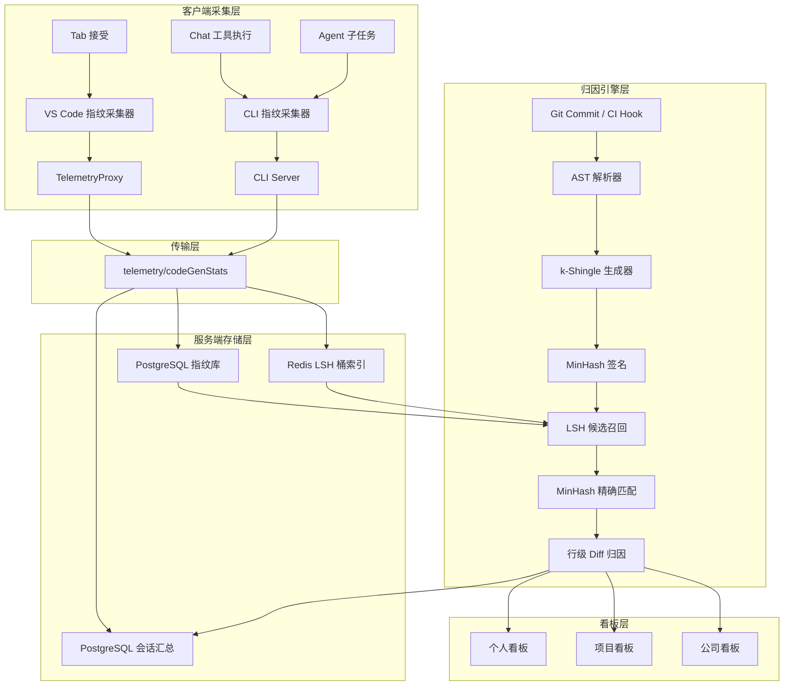

> 范围：Kilo CLI (`packages/opencode/`) / VS Code Extension (`packages/kilo-vscode/`) / Kilo Cloud (后端归因引擎)  

## 执行摘要

本方案解决的核心问题是：**精确量化 AI 在最终代码库中的实际贡献比例**。现有方案（包括行业通用的"行数计数法"）只能回答"AI 被接受了多少行"，但无法回答"这些被接受的代码有多少存活到了最终提交，以及被人类修改了多少"。

本方案在 Kilo Code 现有架构上，引入 **AST-aware MinHash 指纹归因引擎**（基于 k-Shingle + LSH），构建一条从 AI 代码生成瞬间到 Git 最终提交的全链路追踪能力。三套代码生成路径（Tab 补全、Chat 对话、Agent 子任务）统一采集代码指纹，服务端在 Git 提交阶段进行归因匹配，最终产出精确到行级的 AI 贡献占比。

```
┌─────────────────┐     ┌─────────────────┐     ┌─────────────────┐
│   Tab / Chat    │ →   │  代码指纹采集     │ →   │  LSH 指纹库      │
│   / Agent       │     │  (AST + k-Shingle)│   │  (Redis + PG)   │
└─────────────────┘     └─────────────────┘     └─────────────────┘
                                                         ↓
┌─────────────────┐     ┌─────────────────┐     ┌─────────────────┐
│  Git Commit/CI  │ →   │  AST 分块 +      │ →   │  MinHash 匹配   │
│  Pipeline       │     │  MinHash 签名    │     │  行级归因引擎     │
└─────────────────┘     └─────────────────┘     └─────────────────┘
                                                         ↓
                                                ┌─────────────────┐
                                                │  个人/项目/公司   │
                                                │  三级看板        │
                                                └─────────────────┘
```

---

## 1. 背景：为什么"行数计数"不够

### 1.1 现有方案的问题

当前行业通用的 AI 代码生成率公式是：

```
AI 代码生成率 = AI 生成的代码行数 / 代码总行数
```

这个公式的致命缺陷：

| 问题 | 说明 | 示例 |
|------|------|------|
| **无法追踪修改** | AI 生成的代码被人类改了变量名、加了空行、调了顺序，行数计数法就将其完全视为"人类代码" | `x = 1` → `value = 1`，逻辑完全一致，但行数法判定为 0% AI |
| **无法追踪存活** | AI 被接受的代码可能在后续迭代中被删除或重写，但行数法只统计"接受瞬间" | 先接受 100 行，3 天后只剩 10 行，行数法仍显示 100 行 AI |
| **无法区分重排** | 纯文本打乱后，传统词集比对无法识别 | 代码块顺序调换后，传统方法视为完全不同的代码 |
| **粒度不一致** | Tab 用字符数、Chat/Agent 用行数，无法统一 | 一个 Tab 补全 15 字符 vs 一段 Chat 生成 50 行，两者无法合并计算 |

### 1.2 精确归因的核心需求

我们需要回答的是：

> "最终代码库中，有多少比例的代码可以追溯到 AI 的原始生成？"

这要求：
1. **指纹化**：在 AI 生成代码的瞬间，为其建立可追踪的"指纹"
2. **容忍修改**：即使代码被重命名、加注释、调顺序，仍能识别其 AI 来源
3. **行级归因**：精确到哪些行是 AI 的、哪些行是人的修改
4. **全生命周期**：从生成 → 接受 → 修改 → 提交 → 留存，全程追踪

### 1.3 为什么 MinHash + k-Shingle 适合这个场景

**k-Shingle**（滑动窗口）将连续的文本切分为固定长度的碎片，锁死局部语序。在代码场景中，我们对 **AST 节点类型序列**做 k-Shingle，而非纯文本。这样：
- 变量重命名（`x` → `inputValue`）不影响 AST 节点类型序列，指纹不变
- 函数顺序调换时，k-Shingle 能捕获局部结构关系，识别出这是"重排"而非"全新代码"
- 加注释不影响 AST 节点序列，指纹不变

**MinHash**将高维稀疏的 k-Shingle 集合压缩为固定长度的签名（如 128 维）。两个代码片段的 MinHash 签名相似度，近似等于它们的 Jaccard 相似度。配合 **LSH（局部敏感哈希）分桶**，可在百万级指纹库中毫秒级召回候选匹配。

> **核心定理**：MinHash 是无偏估计量。设真实 Jaccard 相似度为 J，签名长度 N=128 时，标准差 σ = √(J(1-J)/128)。当 J=0.5 时，95% 置信区间宽度约为 ±0.087，对工程场景完全足够。

---

## 2. 现状：Kilo Code 三条路径的现有能力

### 2.1 Tab (Autocomplete) — VS Code 扩展

```
VS Code 编辑器
  ├─ Classic Autocomplete: AutocompleteInlineCompletionProvider
  │   ├─ 已采集: AUTOCOMPLETE_ACCEPT_SUGGESTION (suggestionLength: 字符数)
  │   └─ 缺失: 无代码内容、无语言类型、无文件路径
  │
  └─ Next Edit (NES): NextEditInlineCompletionProvider
      ├─ 已采集: onSuggestion (shown, latencyMs, input/output tokens)
      └─ 缺失: 接受时无 suggestionLength、无指纹
```

### 2.2 Chat — CLI 核心

```
CLI SessionProcessor
  ├─ edit 工具: 计算 additions/deletions (行数)，存于 message metadata
  ├─ write 工具: 同上
  ├─ apply_patch 工具: 同上，支持 add/update/delete/move
  └─ 缺失: additions/deletions 未进入遥测流，仅本地展示
```

### 2.3 Agent — CLI 子任务

```
task 工具
  ├─ 已采集: KiloCostPropagation (子 agent 成本回传父 session)
  └─ 缺失: 子 agent 的代码变更量未回传，未进入遥测
```

### 2.4 现有遥测基础设施

```
VS Code Extension → TelemetryProxy → CLI Server /telemetry/capture
CLI Core → kilo-telemetry → CLI Server /telemetry/capture
CLI Server → Kilo Gateway /api/telemetry → PostHog (fire-and-forget)
```

当前问题：所有事件 fire-and-forget，无服务端聚合，无看板 API。

---

## 3. 系统架构（总览）

### 3.1 数据流全景



### 3.2 核心模块职责

| 模块 | 位置 | 职责 |
|------|------|------|
| **指纹采集器** | `packages/kilo-vscode/` + `packages/opencode/src/kilocode/` | 在 AI 代码生成/接受时，计算代码片段的 MinHash 指纹，上送 |
| **CLI 服务端** | `packages/opencode/src/kilocode/server/` | 接收指纹和会话汇总，批量上送到 Kilo Cloud |
| **指纹库** | Kilo Cloud 后端 | 存储 AI 代码指纹（MinHash 签名 + 元数据），Redis 维护 LSH 桶索引 |
| **归因引擎** | Kilo Cloud 后端 / CI 插件 | 在 Git 提交时，对变更文件做 AST 解析、生成指纹、LSH 召回匹配、行级归因 |
| **看板 API** | Kilo Cloud 后端 | 提供 `GET /api/v1/stats/ai-attribution` 查询接口 |
| **看板 UI** | Kilo Cloud Dashboard | 展示个人/项目/公司三级看板 |

---

## 4. 阶段一：客户端指纹采集

### 4.1 设计原则

1. **最小化客户端负担**：客户端只计算轻量 MinHash 指纹（纯文本 k-shingle），不解析 AST（避免引入 tree-sitter 依赖）
2. **统一指纹协议**：所有三条路径使用相同的指纹格式上送
3. **隐私优先**：代码片段在上送前做局部脱敏（只保留语法结构相关的 token，去除具体变量名/字符串值）

### 4.2 指纹协议定义

```typescript
// 在 packages/kilo-telemetry/src/events.ts 中新增
export interface AICodeFingerprint {
  /** 唯一标识符: {sessionId}-{toolCallIndex}-{chunkIndex} */
  codeId: string

  /** 关联 session */
  sessionId: string
  userId: string
  projectId?: string
  orgId?: string

  /** 生成路径 */
  source: 'tab' | 'chat' | 'agent'

  /** 原始代码片段（可选，默认不上送） */
  rawCode?: string

  /** MinHash 签名（128 维整数数组） */
  signature: number[]

  /** LSH 桶索引（16 个桶 ID） */
  lshBuckets: number[]

  /** 语言类型 */
  language: string

  /** 文件类型（脱敏后：只保留扩展名） */
  fileExtension: string

  /** 生成时间 */
  timestamp: number

  /** 代码行数（辅助统计） */
  lineCount: number

  /** 代码字符数 */
  charCount: number

  /** 脱敏后的代码结构哈希（SHA-256 前 16 位） */
  structureHash: string
}
```

### 4.3 MinHash 指纹计算算法（客户端用）

客户端使用**纯文本 k-shingle**（而非 AST），原因：
- 客户端无 tree-sitter 依赖，实现轻量
- Tab 补全通常很短，AST 解析无意义
- 纯文本 k-shingle 对短片段仍有效（k=3 字符级或 k=2 词级）

```typescript
// packages/opencode/src/kilocode/fingerprint/minhash.ts
// Kilo 专有模块 — 不涉及共享代码

import { createHash } from "crypto"

const NUM_HASHES = 128
const NUM_BANDS = 16
const SHINGLE_SIZE = 3
const SEED_BASE = 0x5A827999

/** 生成 k-shingle（字符级，适合短片段） */
function charShingles(text: string, k: number): Set<string> {
  const shingles = new Set<string>()
  for (let i = 0; i <= text.length - k; i++) {
    shingles.add(text.slice(i, i + k))
  }
  return shingles
}

/** 词级 shingle（适合长片段） */
function wordShingles(text: string, k: number): Set<string> {
  const words = text
    .replace(/[^\w\s]/g, " ")
    .split(/\s+/)
    .filter((w) => w.length > 0)
  const shingles = new Set<string>()
  for (let i = 0; i <= words.length - k; i++) {
    shingles.add(words.slice(i, i + k).join(" "))
  }
  return shingles
}

/** 使用 32 位 FNV-1a 作为哈希函数 */
function fnv1aHash(str: string, seed: number): number {
  let hash = 2166136261 ^ seed
  for (let i = 0; i < str.length; i++) {
    hash ^= str.charCodeAt(i)
    hash += (hash << 1) + (hash << 4) + (hash << 7) + (hash << 8) + (hash << 24)
  }
  return hash >>> 0 // 转为无符号 32 位
}

/** 计算 MinHash 签名 */
export function computeMinHashSignature(text: string): number[] {
  const shingles = text.length < 200 ? charShingles(text, SHINGLE_SIZE) : wordShingles(text, SHINGLE_SIZE)
  const signature: number[] = []

  for (let i = 0; i < NUM_HASHES; i++) {
    let minVal = 0xFFFFFFFF
    for (const shingle of shingles) {
      const h = fnv1aHash(shingle, SEED_BASE + i)
      if (h < minVal) minVal = h
    }
    signature.push(minVal)
  }

  return signature
}

/** 计算 LSH 桶 */
export function computeLshBuckets(signature: number[]): number[] {
  const rowsPerBand = NUM_HASHES / NUM_BANDS
  const buckets: number[] = []

  for (let b = 0; b < NUM_BANDS; b++) {
    const start = b * rowsPerBand
    const band = signature.slice(start, start + rowsPerBand)
    let hash = 2166136261 ^ b
    for (const val of band) {
      hash ^= val & 0xFF
      hash += (hash << 1) + (hash << 4) + (hash << 7) + (hash << 8) + (hash << 24)
    }
    buckets.push(hash >>> 0)
  }

  return buckets
}

/** 计算结构哈希（脱敏） */
export function computeStructureHash(text: string): string {
  // 移除所有空白、数字、字符串值，只保留关键字和符号结构
  const normalized = text
    .replace(/[\s\n\r\t]+/g, "")
    .replace(/"[^"]*"/g, "\"\"")
    .replace(/'[^']*'/g, "'\'")
    .replace(/\b\d+\b/g, "0")
  return createHash("sha256").update(normalized).digest("hex").slice(0, 16)
}
```

> **与参考文档的对应**：
> - 参考文档1（MinHash 完整指南）：核心定理 `P(min(h(A)) = min(h(B))) = J(A,B)` 构成了签名设计的数学基础。N=128 的精度选择依据文档中的误差分析表。
> - 参考文档2（k-Shingle）：代码中 `charShingles` 和 `wordShingles` 实现了滑动窗口切分。字符级 k=3 锁死局部语序，防止"洗牌式"改写绕过检测。

### 4.4 Tab 路径指纹采集

```typescript
// packages/kilo-vscode/src/services/autocomplete/classic-auto-complete/AutocompleteTelemetry.ts
// 在 captureAcceptSuggestion 中增强

public captureAcceptSuggestionWithFingerprint(
  suggestion: string,
  context: AutocompleteContext,
  document: vscode.TextDocument,
  mode: 'classic' | 'next-edit' = 'classic'
): void {
  const fingerprint = computeMinHashSignature(suggestion)
  const lshBuckets = computeLshBuckets(fingerprint)
  const structureHash = computeStructureHash(suggestion)

  this.captureEvent(TelemetryEventName.AUTOCOMPLETE_ACCEPT_SUGGESTION, {
    suggestionLength: suggestion.length,
    languageId: context.languageId,
    modelId: context.modelId,
    provider: context.provider,
    fileExtension: document.languageId,
    mode,
    // 指纹数据
    minHashSignature: fingerprint,
    lshBuckets,
    structureHash,
    lineCount: suggestion.split('\n').length,
    charCount: suggestion.length,
  })
}
```

采集时机：在 `INLINE_COMPLETION_ACCEPTED_COMMAND` 执行时（现有逻辑已覆盖）。

### 4.5 Chat 路径指纹采集

```typescript
// 在 edit/write/apply_patch 工具执行成功时，对变更的代码片段计算指纹

// packages/opencode/src/kilocode/fingerprint/tool-wrapper.ts
// Kilo 专有模块，封装在共享工具调用中

import { computeMinHashSignature, computeLshBuckets, computeStructureHash } from "./minhash"

export function createAIFingerprint(
  rawCode: string,
  sessionId: string,
  userId: string,
  source: 'chat' | 'agent',
  language: string,
  fileExtension: string
): AICodeFingerprint {
  return {
    codeId: `${sessionId}-${Date.now()}-${Math.random().toString(36).slice(2, 8)}`,
    sessionId,
    userId,
    source,
    signature: computeMinHashSignature(rawCode),
    lshBuckets: computeLshBuckets(computeMinHashSignature(rawCode)),
    language,
    fileExtension,
    timestamp: Date.now(),
    lineCount: rawCode.split('\n').length,
    charCount: rawCode.length,
    structureHash: computeStructureHash(rawCode),
  }
}

// 在 edit 工具执行后调用
export function trackEditWithFingerprint(
  ctx: Tool.Context,
  oldContent: string,
  newContent: string,
  language: string,
  fileExtension: string
): void {
  const diff = newContent.slice(oldContent.length) // 简化：只取新增部分
  if (diff.length > 0) {
    const fp = createAIFingerprint(diff, ctx.sessionID, ctx.userID, 'chat', language, fileExtension)
    Telemetry.trackCodeFingerprint(fp) // 新增遥测方法
  }
}
```

### 4.6 Agent 路径指纹采集

子 agent 的代码指纹采集与 Chat 路径相同（使用 `source: 'agent'`）。关键差异：

1. 在子 agent 的 `edit`/`write`/`apply_patch` 执行时，指纹被标记为 `source: 'agent'`
2. 在 `task` 工具结束时，通过 `KiloCostPropagation` 的同一管道，将子 agent 的指纹列表回传到父 session
3. 父 session 的 `codeGenStats` 汇总中包含 `agentFingerprints` 数组

```typescript
// packages/opencode/src/kilocode/tool/task.ts
// 在任务结束时汇总指纹

const childFingerprints = yield* KiloTask.collectChildFingerprints(sessions, nextSession.id)
// 上送到父 session 的 codeGenStats 中
```

---

## 5. 阶段二：传输与存储

### 5.1 新增 CLI 端点

```typescript
// packages/opencode/src/kilocode/server/httpapi/groups/telemetry.ts

export const CodeFingerprintPayload = Schema.Struct({
  codeId: Schema.String,
  sessionId: Schema.String,
  userId: Schema.String,
  projectId: Schema.optional(Schema.String),
  orgId: Schema.optional(Schema.String),
  source: Schema.Literal('tab', 'chat', 'agent'),
  signature: Schema.Array(Schema.Number), // 128 维
  lshBuckets: Schema.Array(Schema.Number), // 16 个
  language: Schema.String,
  fileExtension: Schema.String,
  timestamp: Schema.Number,
  lineCount: Schema.Number,
  charCount: Schema.Number,
  structureHash: Schema.String,
  // 可选：原始代码片段（仅在用户开启"完整追踪"时上传）
  rawCode: Schema.optional(Schema.String),
})

export const CodeFingerprintUpload = HttpApiEndpoint.post(
  "codeFingerprint",
  "/telemetry/code-fingerprint",
  {
    query: WorkspaceRoutingQuery,
    payload: CodeFingerprintPayload,
    success: described(Schema.Boolean, "Fingerprint recorded"),
  }
)
```

### 5.2 会话级汇总端点

```typescript
// 增强现有 CodeGenStatsPayload
export const CodeGenStatsPayload = Schema.Struct({
  sessionId: Schema.String,
  projectId: Schema.optional(Schema.String),
  orgId: Schema.optional(Schema.String),
  timestamp: Schema.Number,

  // Tab 统计
  tab: Schema.optional(Schema.Struct({
    suggestionsShown: Schema.Number,
    suggestionsAccepted: Schema.Number,
    charsAccepted: Schema.Number,
    fingerprints: Schema.Array(Schema.String), // codeId 列表
  })),

  // Chat 统计
  chat: Schema.optional(Schema.Struct({
    edits: Schema.Number,
    additions: Schema.Number,
    deletions: Schema.Number,
    fingerprints: Schema.Array(Schema.String),
  })),

  // Agent 统计
  agent: Schema.optional(Schema.Struct({
    tasks: Schema.Number,
    additions: Schema.Number,
    deletions: Schema.Number,
    fingerprints: Schema.Array(Schema.String),
  })),

  // Git 基准
  gitBaseline: Schema.optional(Schema.Struct({
    headCommit: Schema.String,
    additions: Schema.Number,
    deletions: Schema.Number,
  })),
})
```

### 5.3 指纹库数据模型

```sql
-- PostgreSQL 指纹主表
CREATE TABLE ai_code_fingerprints (
  id SERIAL PRIMARY KEY,
  code_id VARCHAR(64) UNIQUE NOT NULL,
  session_id VARCHAR(64) NOT NULL,
  user_id VARCHAR(255) NOT NULL,
  project_id VARCHAR(255),
  org_id VARCHAR(255),
  source VARCHAR(10) NOT NULL CHECK (source IN ('tab', 'chat', 'agent')),
  
  -- MinHash 签名（128 维整数数组，JSONB 存储）
  signature JSONB NOT NULL,
  
  -- LSH 桶（16 个整数，JSONB）
  lsh_buckets JSONB NOT NULL,
  
  language VARCHAR(32) NOT NULL,
  file_extension VARCHAR(16) NOT NULL,
  
  -- 元数据
  line_count INT NOT NULL DEFAULT 0,
  char_count INT NOT NULL DEFAULT 0,
  structure_hash VARCHAR(16) NOT NULL,
  
  -- 可选：原始代码（加密存储，仅用于审计）
  raw_code_encrypted TEXT,
  
  created_at TIMESTAMP NOT NULL DEFAULT NOW(),
  
  -- 索引
  INDEX idx_user_id (user_id),
  INDEX idx_project_id (project_id),
  INDEX idx_org_id (org_id),
  INDEX idx_session_id (session_id),
  INDEX idx_created_at (created_at),
  INDEX idx_structure_hash (structure_hash)
);

-- Redis 结构（每个 band 一个 set）
-- Key: lsh:band:{band_idx}:bucket:{bucket_id}
-- Value: set of code_id
-- TTL: 90 天（与指纹主表对齐）
```

### 5.4 LSH 索引策略

```
参数:
  N = 128 (MinHash 签名维度)
  B = 16 (band 数量)
  R = 8 (每个 band 的行数 = N/B)

LSH 桶生成:
  for band in 0..15:
    band_signature = signature[band*8 : (band+1)*8]
    bucket_id = hash(tuple(band_signature), seed=band)

召回概率:
  P(召回) = 1 - (1 - J^R)^B
  
  J=0.9 → P=0.9999 (几乎必定召回)
  J=0.7 → P=0.926 (高召回率)
  J=0.5 → P=0.278 (中等召回率)
  J=0.3 → P=0.015 (低误撞率)
  J=0.1 → P=3×10^-6 (几乎不可能误撞)
```

> 与参考文档1中 LSH 概率分析表一致。通过调整 B 和 R 可精确控制"相似度高于阈值的代码被召回"的概率。

---

## 6. 阶段三：服务端归因引擎

### 6.1 归因流程

```
Git Commit / CI Push
    │
    ▼
┌─────────────────────┐
│ 1. 提取变更文件       │  git diff --name-only HEAD~1
│ 2. 获取变更代码块     │  git diff -U0 (获取每个变更 hunks)
└─────────────────────┘
    │
    ▼
┌─────────────────────┐
│ 3. AST 解析          │  tree-sitter 解析每个变更文件
│ 4. 节点序列提取       │  前序遍历收集 AST 节点类型
│ 5. k-Shingle 生成    │  对节点类型序列做 k=3 滑动窗口
│ 6. MinHash 签名      │  128 维签名 + 16 个 LSH 桶
└─────────────────────┘
    │
    ▼
┌─────────────────────┐
│ 7. LSH 召回          │  查询 Redis: 每个 band 取 set 交集
│ 8. 精确匹配           │  对候选 code_id 计算完整 MinHash 相似度
│ 9. 阈值判定           │  HIGH(>0.85) / LOW(0.55~0.85) / SUSPECT(0.30~0.55) / UNIQUE(<0.30)
└─────────────────────┘
    │
    ▼
┌─────────────────────┐
│ 10. 行级 Diff 归因   │  SequenceMatcher 比对 AI 原始 vs 最终代码
│ 11. 占比计算         │  (保留行 + 0.5×修改行) / 总行数
└─────────────────────┘
    │
    ▼
┌─────────────────────┐
│ 12. 结果写入         │  ai_attribution_results 表
│ 13. 看板更新         │  触发每日聚合任务
└─────────────────────┘
```

### 6.2 AST 解析与 k-Shingle

服务端使用 Python + tree-sitter 进行 AST 解析，这是参考文档3的核心设计。

```python
# 服务端归因引擎（Python 伪代码）
from tree_sitter import Language, Parser
import mmh3
from difflib import SequenceMatcher
from typing import List, Set, Tuple, Dict

class ASTShingler:
    """对 AST 节点类型序列做 k-Shingle"""
    
    def __init__(self, k: int = 3):
        self.k = k
    
    def parse(self, code: str, language: str) -> List[str]:
        """解析代码并返回 AST 节点类型序列"""
        parser = Parser()
        # parser.set_language(Language(f"./tree-sitter-{language}.so", language))
        tree = parser.parse(bytes(code, 'utf8'))
        
        node_types = []
        def traverse(node):
            node_types.append(node.type)
            for child in node.children:
                traverse(child)
        traverse(tree.root_node)
        return node_types
    
    def shingle(self, node_types: List[str]) -> Set[Tuple]:
        """对节点类型序列做 k-Shingle"""
        shingles = set()
        for i in range(len(node_types) - self.k + 1):
            shingles.add(tuple(node_types[i:i + self.k]))
        return shingles
```

> **为什么 AST 节点类型比纯文本更好**：
> - 变量 `x` 重命名为 `inputValue` → AST 节点类型不变（都是 `identifier`）
> - 加注释 → 注释节点类型不影响核心逻辑节点序列
> - 函数顺序调换 → k-Shingle 锁死局部结构，相似度下降但非归零
> - 参考文档3中明确说明："变量 `x` 重命名为 `input_value` 后，AST 节点类型序列不变，MinHash 签名几乎不变。"

### 6.3 MinHash 签名计算（服务端）

```python
class MinHashSigner:
    def __init__(self, num_hashes: int = 128, num_bands: int = 16, seed_base: int = 42):
        self.num_hashes = num_hashes
        self.num_bands = num_bands
        self.rows_per_band = num_hashes // num_bands
        self.seeds = [seed_base + i for i in range(num_hashes)]
    
    def compute(self, shingles: Set[Tuple]) -> Tuple[List[int], List[int]]:
        """计算 MinHash 签名和 LSH 桶"""
        signature = []
        for seed in self.seeds:
            min_val = min(
                mmh3.hash(str(shingle), seed=seed) & 0xFFFFFFFF
                for shingle in shingles
            ) if shingles else 0xFFFFFFFF
            signature.append(min_val)
        
        buckets = []
        for b in range(self.num_bands):
            band = tuple(signature[b * self.rows_per_band:(b + 1) * self.rows_per_band])
            bucket_id = mmh3.hash(str(band), seed=b) & 0xFFFFFFFF
            buckets.append(bucket_id)
        
        return signature, buckets
```

> **注意服务端与客户端的一致性**：
> - 客户端使用 TypeScript + FNV-1a 计算纯文本签名（用于快速上送）
> - 服务端使用 Python + mmh3 计算 AST 签名（用于精确归因）
> - 两者算法不同，但服务端归因时不依赖客户端签名，而是重新计算。客户端签名用于服务端的数据验证和交叉校验。

### 6.4 LSH 召回与精确匹配

```python
class LSHMatcher:
    def __init__(self, redis_client, num_hashes: int = 128):
        self.redis = redis_client
        self.num_hashes = num_hashes
    
    def query_candidates(self, lsh_buckets: List[int]) -> Set[str]:
        """通过 LSH 桶召回候选 code_id"""
        candidates = set()
        for band_idx, bucket in enumerate(lsh_buckets):
            key = f"lsh:band:{band_idx}:bucket:{bucket}"
            ids = self.redis.smembers(key)
            candidates.update(ids)
        return candidates
    
    def compute_similarity(self, sig_a: List[int], sig_b: List[int]) -> float:
        """计算两个 MinHash 签名的 Jaccard 近似"""
        matches = sum(1 for a, b in zip(sig_a, sig_b) if a == b)
        return matches / self.num_hashes
```

### 6.5 行级 Diff 归因

参考文档3中的核心归因算法，将 MinHash 相似度转换为精确的行级贡献比例。

```python
class LineLevelAttribution:
    def __init__(self, similarity_threshold: float = 0.55):
        self.threshold = similarity_threshold
    
    def attribute(self, ai_code: str, final_code: str, similarity: float) -> Dict:
        """
        输入: AI 原始代码, 最终代码, MinHash 相似度
        输出: 行级归因统计
        """
        ai_lines = ai_code.splitlines()
        final_lines = final_code.splitlines()
        
        sm = SequenceMatcher(None, ai_lines, final_lines)
        
        ai_preserved = 0      # AI 代码原样保留
        ai_modified = 0       # AI 代码被修改
        human_new = 0         # 完全新增的人写代码
        
        for tag, i1, i2, j1, j2 in sm.get_opcodes():
            if tag == 'equal':
                ai_preserved += (i2 - i1)
            elif tag == 'replace':
                ai_modified += (i2 - i1)
                human_new += (j2 - j1)
            elif tag == 'delete':
                ai_modified += (i2 - i1)
            elif tag == 'insert':
                human_new += (j2 - j1)
        
        total_lines = len(final_lines)
        # 保留行算 100%，修改行算 50%（因为修改通常保留了部分逻辑）
        ai_contribution = ai_preserved + 0.5 * ai_modified
        ai_ratio = ai_contribution / total_lines if total_lines > 0 else 0
        
        confidence = 'HIGH' if similarity > 0.85 else 'LOW' if similarity > 0.55 else 'SUSPECT'
        
        return {
            'ai_preserved_lines': ai_preserved,
            'ai_modified_lines': ai_modified,
            'human_new_lines': human_new,
            'total_lines': total_lines,
            'ai_ratio': round(ai_ratio, 3),
            'minhash_similarity': round(similarity, 3),
            'confidence': confidence
        }
```

### 6.6 置信度分级

| MinHash 相似度 | 置信度 | 业务含义 | 统计策略 |
|---------------|--------|---------|---------|
| > 0.85 | **HIGH** | AI 代码几乎未改，AI 主导 | AI 占比按 90~100% 计 |
| 0.55 ~ 0.85 | **LOW** | 明显修改，人机协作 | 按行级 diff 加权计算 |
| 0.30 ~ 0.55 | **SUSPECT** | 可能为常见模式 | 不计入 AI 占比，但标记审查 |
| < 0.30 | **UNIQUE** | 人写代码 | 不计入 AI 占比 |

> 与参考文档3中的阈值设计完全一致。HIGH 对应"几乎一字不改"，LOW 对应"存在修改痕迹但骨子里相似"。

---

## 7. 数据模型（看板层）

### 7.1 归因结果表

```sql
CREATE TABLE ai_attribution_results (
  id SERIAL PRIMARY KEY,
  commit_sha VARCHAR(64) NOT NULL,
  file_path VARCHAR(512) NOT NULL,
  user_id VARCHAR(255) NOT NULL,
  project_id VARCHAR(255),
  org_id VARCHAR(255),
  
  -- 匹配信息
  matched_code_id VARCHAR(64),        -- 匹配的 AI 指纹 ID
  match_source VARCHAR(10),           -- 'tab' | 'chat' | 'agent'
  minhash_similarity DECIMAL(4,3),    -- 0.000 ~ 1.000
  confidence VARCHAR(10),             -- 'HIGH' | 'LOW' | 'SUSPECT' | 'UNIQUE'
  
  -- 行级统计
  total_lines INT NOT NULL DEFAULT 0,
  ai_preserved_lines INT NOT NULL DEFAULT 0,
  ai_modified_lines INT NOT NULL DEFAULT 0,
  human_new_lines INT NOT NULL DEFAULT 0,
  ai_ratio DECIMAL(4,3),              -- 0.000 ~ 1.000
  
  -- 时间戳
  commit_timestamp TIMESTAMP NOT NULL,
  analyzed_at TIMESTAMP NOT NULL DEFAULT NOW(),
  
  INDEX idx_commit_sha (commit_sha),
  INDEX idx_user_id (user_id),
  INDEX idx_project_id (project_id),
  INDEX idx_org_id (org_id),
  INDEX idx_commit_timestamp (commit_timestamp)
);
```

### 7.2 每日汇总表

```sql
CREATE TABLE ai_attribution_daily (
  id SERIAL PRIMARY KEY,
  date DATE NOT NULL,
  user_id VARCHAR(255) NOT NULL,
  project_id VARCHAR(255),
  org_id VARCHAR(255),
  
  -- 聚合指标
  total_files_changed INT DEFAULT 0,
  total_lines INT DEFAULT 0,
  ai_attributed_lines INT DEFAULT 0,   -- ai_preserved + 0.5*ai_modified
  ai_ratio DECIMAL(4,3) DEFAULT 0,
  
  -- 路径细分
  tab_ai_lines INT DEFAULT 0,
  chat_ai_lines INT DEFAULT 0,
  agent_ai_lines INT DEFAULT 0,
  
  -- 匹配质量
  high_confidence_lines INT DEFAULT 0,
  low_confidence_lines INT DEFAULT 0,
  suspect_lines INT DEFAULT 0,
  
  -- 效率指标
  tab_accept_rate DECIMAL(4,3) DEFAULT 0,
  chat_edit_count INT DEFAULT 0,
  agent_task_count INT DEFAULT 0,
  
  UNIQUE(date, user_id, project_id, org_id),
  INDEX idx_date_user (date, user_id),
  INDEX idx_date_project (date, project_id),
  INDEX idx_date_org (date, org_id)
);
```

### 7.3 看板 API

```http
GET /api/v1/stats/ai-attribution
Authorization: Bearer <token>
Query:
  scope: 'personal' | 'project' | 'organization'
  project_id?: string       # scope=project 时必填
  org_id?: string           # scope=organization 时必填
  period: 'today' | '7d' | '30d' | 'custom'
  start_date?: string        # ISO 8601, scope=custom 时必填
  end_date?: string
  granularity: 'day' | 'week' | 'month'  # 默认 day

Response 200:
{
  "period": { "start": "2026-06-01", "end": "2026-06-16" },
  "scope": "personal",
  "user_id": "dev-001",
  
  "summary": {
    "total_lines": 15420,
    "ai_attributed_lines": 6476,
    "ai_ratio": 0.42,
    "total_commits": 48,
    "files_with_ai": 23
  },
  
  "breakdown": {
    "tab": {
      "suggestions_shown": 520,
      "suggestions_accepted": 180,
      "accept_rate": 0.346,
      "ai_attributed_lines": 2400,
      "avg_survival_similarity": 0.72
    },
    "chat": {
      "edits": 45,
      "ai_attributed_lines": 2800,
      "avg_similarity": 0.68
    },
    "agent": {
      "tasks": 12,
      "ai_attributed_lines": 1276,
      "avg_similarity": 0.65
    }
  },
  
  "confidence": {
    "high": 0.45,     # 45% 的 AI 归因是 HIGH 置信度
    "low": 0.40,
    "suspect": 0.10,
    "unique": 0.05
  },
  
  "trend": [
    {
      "date": "2026-06-16",
      "total_lines": 933,
      "ai_attributed_lines": 420,
      "ai_ratio": 0.45,
      "tab_accept_rate": 0.38,
      "chat_edits": 3
    }
  ],
  
  "language_breakdown": [
    { "language": "typescript", "total_lines": 8000, "ai_lines": 3500, "ai_ratio": 0.44 },
    { "language": "python", "total_lines": 4000, "ai_lines": 1800, "ai_ratio": 0.45 },
    { "language": "rust", "total_lines": 3420, "ai_lines": 1176, "ai_ratio": 0.34 }
  ]
}
```

---

## 8. 与 kilocode 的集成（文件变更清单）

### 8.1 客户端变更

| 文件 | 变更类型 | 说明 | 标记 |
|---|---|---|---|
| `packages/kilo-telemetry/src/events.ts` | 修改 | 新增 `AICodeFingerprint` 接口、`TelemetryEventName.CODE_FINGERPRINT` | — |
| `packages/kilo-telemetry/src/telemetry.ts` | 修改 | 新增 `trackCodeFingerprint()` 方法 | — |
| `packages/opencode/src/kilocode/fingerprint/minhash.ts` | **新增** | MinHash 签名 + LSH 桶计算（TypeScript） | Kilo 专有 |
| `packages/opencode/src/kilocode/fingerprint/tool-wrapper.ts` | **新增** | 工具指纹包装器 | Kilo 专有 |
| `packages/opencode/src/kilocode/fingerprint/index.ts` | **新增** | 指纹模块导出 | Kilo 专有 |
| `packages/opencode/src/tool/edit.ts` | 修改 | 执行后调用 `trackEditWithFingerprint()` | `kilocode_change` |
| `packages/opencode/src/tool/write.ts` | 修改 | 同上 | `kilocode_change` |
| `packages/opencode/src/tool/apply_patch.ts` | 修改 | 对每个变更块调用 `trackEditWithFingerprint()` | `kilocode_change` |
| `packages/opencode/src/kilocode/tool/task.ts` | 修改 | 子任务指纹收集与回传 | Kilo 专有 |
| `packages/kilo-vscode/src/services/autocomplete/classic-auto-complete/AutocompleteTelemetry.ts` | 修改 | `captureAcceptSuggestion` 增加指纹参数 | — |
| `packages/kilo-vscode/src/services/autocomplete/next-edit/NextEditSuggestionManager.ts` | 修改 | 接受时生成指纹上送 | — |
| `packages/kilo-vscode/src/services/telemetry/types.ts` | 修改 | 新增 `CODE_FINGERPRINT` 事件 | — |
| `packages/kilo-vscode/src/services/telemetry/telemetry-proxy.ts` | 修改 | 支持 `CODE_FINGERPRINT` 上送 | — |

### 8.2 服务端变更（CLI）

| 文件 | 变更类型 | 说明 | 标记 |
|---|---|---|---|
| `packages/opencode/src/kilocode/server/httpapi/groups/telemetry.ts` | 修改 | 新增 `CodeFingerprintUpload` 端点 schema | Kilo 专有 |
| `packages/opencode/src/kilocode/server/httpapi/handlers/telemetry.ts` | 修改 | 新增 `CodeFingerprintUpload` handler | Kilo 专有 |
| `packages/opencode/src/kilocode/server/httpapi/groups/telemetry.ts` | 修改 | 增强 `CodeGenStatsPayload`（加入 fingerprints 数组） | Kilo 专有 |

### 8.3 服务端变更（Kilo Cloud）

| 组件 | 变更类型 | 说明 |
|---|---|---|
| PostgreSQL Schema | 新增 | `ai_code_fingerprints`、`ai_attribution_results`、`ai_attribution_daily` |
| Redis 索引 | 新增 | `lsh:band:{band}:bucket:{bucket}` sets |
| 归因引擎（Python） | 新增 | AST 解析 + MinHash + LSH + 行级 diff |
| 指纹接收 API | 新增 | `POST /api/v1/code-fingerprints` 批量接收 |
| 归因查询 API | 新增 | `GET /api/v1/stats/ai-attribution` |
| 每日聚合任务 | 新增 | 定时任务：从 `ai_attribution_results` 聚合到 `ai_attribution_daily` |
| 看板 UI | 新增 | 个人/项目/公司三级看板页面 |

---

## 9. 实施路线图

### Phase 1: 指纹采集基础（第 1-2 周）

**目标**：客户端能够生成并上送 AI 代码指纹。

```
Week 1:
  ├─ [Day 1-2] 实现 packages/opencode/src/kilocode/fingerprint/minhash.ts
  │             (TypeScript MinHash + LSH + k-Shingle)
  ├─ [Day 3-4] 新增 Telemetry 事件类型 (CODE_FINGERPRINT)
  ├─ [Day 5]   在 edit/write/apply_patch 工具中植入指纹采集
  └─ [Day 6-7] Code Review + 单元测试

Week 2:
  ├─ [Day 1-2] 在 VS Code Tab 接受事件中植入指纹采集
  ├─ [Day 3-4] 实现 Agent 子任务指纹回传
  ├─ [Day 5]   CLI 服务端新增 /telemetry/code-fingerprint 端点
  └─ [Day 6-7] 集成测试 (CLI ↔ VS Code ↔ Server)
```

### Phase 2: 指纹库存储与索引（第 3 周）

**目标**：Kilo Cloud 后端能够接收、存储、索引指纹。

```
Week 3:
  ├─ [Day 1-2] 部署 PostgreSQL 表 (ai_code_fingerprints)
  ├─ [Day 3]   部署 Redis LSH 桶索引
  ├─ [Day 4]   实现指纹接收 API (POST /api/v1/code-fingerprints)
  ├─ [Day 5]   实现指纹存储管道 (PG + Redis)
  └─ [Day 6-7] 压力测试 (10万/日指纹写入)
```

### Phase 3: 归因引擎（第 4-5 周）

**目标**：Git 提交时能够自动触发归因分析。

```
Week 4:
  ├─ [Day 1-2] 实现 Python AST 解析器 (tree-sitter 集成)
  ├─ [Day 3-4] 实现 AST k-Shingle + MinHash 签名计算
  ├─ [Day 5]   实现 LSH 召回引擎 (Redis 查询)
  └─ [Day 6-7] 实现 MinHash 精确匹配 + 置信度判定

Week 5:
  ├─ [Day 1-2] 实现行级 Diff 归因 (SequenceMatcher)
  ├─ [Day 3]   实现 Git Hook / CI 触发器
  ├─ [Day 4]   实现归因结果写入 (ai_attribution_results)
  ├─ [Day 5]   端到端测试 (生成 → 接受 → 修改 → 提交 → 归因)
  └─ [Day 6-7] 性能优化 (并行归因、缓存)
```

### Phase 4: 看板与 API（第 6-7 周）

**目标**：个人/项目/公司三级看板上线。

```
Week 6:
  ├─ [Day 1-2] 实现每日聚合任务 (ai_attribution_daily)
  ├─ [Day 3-4] 实现看板查询 API (GET /api/v1/stats/ai-attribution)
  ├─ [Day 5]   看板 UI 设计 (个人看板)
  └─ [Day 6-7] 看板 UI 实现 (项目看板 + 公司看板)

Week 7:
  ├─ [Day 1-2] 看板 UI 联调
  ├─ [Day 3]   数据校验 (对比本地 git log 与看板数据)
  ├─ [Day 4]   灰度发布 (内部团队先用)
  ├─ [Day 5]   Bug 修复
  └─ [Day 6-7] 全量发布
```

---

## 10. 风险与备选方案

| 风险 | 影响 | 概率 | 备选方案 |
|------|------|------|---------|
| **tree-sitter 语言覆盖不全** | 部分语言无法 AST 解析 | 中 | 降级为纯文本 k-Shingle；对不支持的语言使用字符级 shingle |
| **指纹库膨胀** | 存储成本随时间增长 | 中 | 设置 90 天 TTL；按项目/组织分片存储；定期归档冷数据 |
| **误归因（人写代码碰巧像 AI）** | 假阳性导致 AI 率偏高 | 低 | 结合 session 上下文：同一文件、同一时间段内的 AI 建议优先匹配；置信度 SUSPECT 级别不计入统计 |
| **性能瓶颈（大文件归因）** | 单文件 > 1万行时 AST 解析慢 | 低 | 按函数/类级分块，独立计算 MinHash；并行解析 |
| **隐私合规** | 上传代码片段可能违反企业政策 | 低 | 默认只上传指纹（MinHash + 结构哈希），不上传原始代码；提供"企业模式"开关 |
| **客户端 tree-sitter 依赖** | 引入原生模块导致安装失败 | 低 | 客户端不解析 AST，所有 AST 计算在服务端完成 |
| **上游合并冲突** | `kilocode_change` 标记增加维护负担 | 中 | 尽量将逻辑放在 Kilo 专有目录；共享文件只加单行调用 |

---

## 11. 总结：核心设计要点

### 11.1 核心创新

本方案的核心创新是**用"指纹归因"替代"行数计数"**，建立了一条从 AI 代码生成到最终提交的全链路追踪能力。

```
┌────────────────────────────────────────────────────────────┐
│ 传统方案                    │ 本方案                         │
├────────────────────────────────────────────────────────────┤
│ 行数计数                    │ AST-aware MinHash 指纹归因      │
│ 只能回答"接受了多少行"        │ 能回答"最终代码中多少是 AI 的"     │
│ 无法追踪修改                 │ 容忍变量重名、加注释、调顺序       │
│ 无法追踪存活                 │ 通过 Git 归因追踪全生命周期       │
│ 无法识别重排                 │ k-Shingle 锁死局部结构关系       │
│ 三套路径数据不统一            │ 统一指纹协议，服务端统一归因       │
└────────────────────────────────────────────────────────────┘
```

### 11.2 技术选型依据

| 技术 | 选择理由 | 参考文档 |
|------|---------|---------|
| **k-Shingle** | 锁死局部语序，防止"洗牌式"改写绕过检测 | 参考文档2 |
| **MinHash** | 将高维稀疏集合压缩为固定长度签名，无偏估计 Jaccard 相似度 | 参考文档1 |
| **LSH** | 将 O(N²) 全量比对降为 O(N) 候选召回，支持百万级指纹库 | 参考文档1 |
| **AST 解析** | 变量重名不影响 AST 节点类型序列，指纹不变 | 参考文档3 |
| **SequenceMatcher 行级 diff** | 精确计算保留/修改/新增行，输出可解释的贡献占比 | 参考文档3 |

### 11.3 关键指标公式

```
AI 代码贡献率 = AI 归因行数 / 总代码行数

其中:
  AI 归因行数 = Σ(保留行 × 1.0 + 修改行 × 0.5)
  
  保留行: 通过 MinHash 匹配 + 行级 diff 确认为完全相同的行
  修改行: 通过 MinHash 匹配 + 行级 diff 确认为被修改但源自 AI 的行

置信度分级:
  HIGH (>0.85): AI 主导，占比按 90~100% 计
  LOW (0.55~0.85): 人机协作，按行级 diff 精确计算
  SUSPECT (0.30~0.55): 可能为常见模式，不计入统计
  UNIQUE (<0.30): 人写代码，不计入统计
```

### 11.4 三条路径的覆盖策略

```
路径      采集方式                    指纹类型        归因时机
─────────────────────────────────────────────────────────────────────
Tab       VS Code 接受事件             字符级 k-Shingle  Git Commit 时
Chat      CLI 工具执行后 (edit/write)  文本级 k-Shingle  Git Commit 时
Agent     CLI 子任务回传 (task tool)   文本级 k-Shingle  Git Commit 时
─────────────────────────────────────────────────────────────────────
```

### 11.5 与 kilocode 架构的融合

```
VS Code Extension ──→ TelemetryProxy ──→ CLI Server ──→ Kilo Cloud
     │                    │                │              │
     │  Tab 指纹           │ 指纹事件        │ 端点转发      │ 指纹库存储
     │                    │                │              │
CLI Core (TUI) ──────→ kilo-telemetry ──→ CLI Server ──→ Kilo Cloud
     │                    │                │              │
     │  Chat/Agent 指纹    │ 指纹事件        │ 端点转发      │ 归因引擎
     │                    │                │              │
     └────────────────────┘                └──────────────┘
              新增: fingerprint 模块               新增: 归因流水线
              位置: packages/opencode/src/kilocode/   位置: Kilo Cloud 后端
```

### 11.6 实施优先级

```
P0 (立即): 指纹采集基础 (Phase 1)
  - 实现 TypeScript MinHash 模块
  - 在 edit/write/apply_patch 工具中植入指纹采集
  - 在 VS Code Tab 接受事件中植入指纹采集

P1 (2-3 周): 指纹存储与传输 (Phase 2)
  - CLI 服务端新增 /telemetry/code-fingerprint 端点
  - Kilo Cloud 部署指纹库 (PG + Redis)

P2 (4-5 周): 归因引擎 (Phase 3)
  - Python AST 解析 + MinHash + LSH 归因引擎
  - Git Hook / CI 触发集成

P3 (6-7 周): 看板 (Phase 4)
  - 看板 API + 三级看板 UI
  - 个人/项目/公司数据展示
```

---

## 附录 A：MinHash 数学原理速查

```
Jaccard 相似度: J(A,B) = |A ∩ B| / |A ∪ B|
                    范围: [0, 1]
                    对称: J(A,B) = J(B,A)

MinHash 核心定理:
  P(min(h(A)) = min(h(B))) = J(A,B)
  
MinHash 估计:
  Ĵ = X / N,  X ~ Binomial(N, J)
  Var(Ĵ) = J(1-J) / N
  
  N=128, J=0.5 时:
    σ = √(0.5×0.5/128) = 0.0442
    95% CI: Ĵ ± 1.96×0.0442 ≈ Ĵ ± 0.087

LSH 召回概率:
  P(召回) = 1 - (1 - J^R)^B
  N=128, B=16, R=8:
    J=0.9 → P=0.9999
    J=0.7 → P=0.926
    J=0.5 → P=0.278
    J=0.3 → P=0.015
```

## 附录 B：k-Shingle 在代码场景中的应用

```
原始代码:
  def calculate(x):
      return x * 2

AST 节点序列 (tree-sitter 前序遍历):
  [function_definition, identifier, parameters, identifier,
   assignment, identifier, binary_operator, number,
   return_statement, binary_operator, identifier, number]

3-gram shingling (k=3):
  (function_definition, identifier, parameters)
  (identifier, parameters, identifier)
  (parameters, identifier, assignment)
  (identifier, assignment, identifier)
  (assignment, identifier, binary_operator)
  ...

变量重命名 (x → inputValue):
  节点序列不变 → shingle 集合不变 → MinHash 签名不变

加注释:
  注释节点类型不影响核心逻辑节点序列 → 指纹不变

函数顺序调换:
  局部 3-gram 结构改变，但全局相似度下降可检测 → 相似度降低但非归零
```

## 附录 C：参考文档索引

| 文档 | 核心内容 | 在本方案中的应用 |
|------|---------|----------------|
| [Jaccard MinHash 完整技术指南](2026-06-06-jaccard-minhash-text-similarity-guide) | MinHash 数学原理、无偏估计、LSH 分桶策略 | 指纹签名设计、误差分析、LSH 参数选择 |
| [k-Shingle 文本去重防篡改](2026-06-06-k-shingle-text-deduplication-anti-tampering-guide) | k-Shingle 滑动窗口、锁死局部语序、防重排 | 客户端字符级 shingle、服务端 AST 节点级 shingle |
| [AI 编码助手代码归因与贡献占比](2026-06-07-coding-assistant-contribution-ratio-design) | AST MinHash 指纹系统、LSH 归因引擎、行级 diff 归因、置信度分级 | 归因引擎完整架构、Python 实现、业务阈值设计、效率评估模型 |
