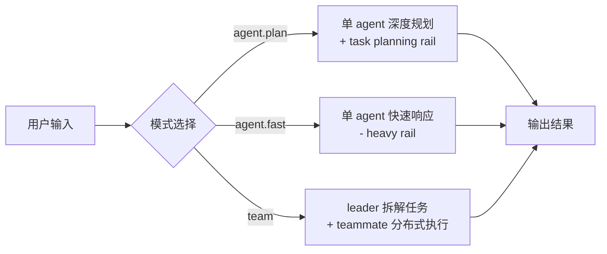
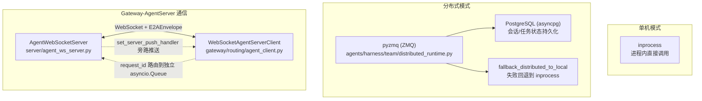
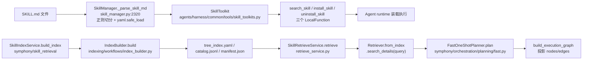
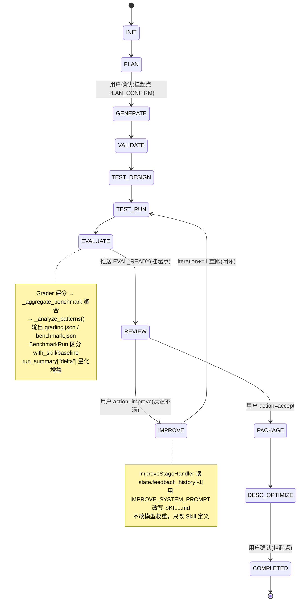
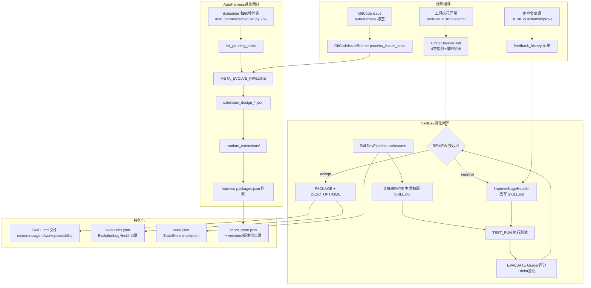
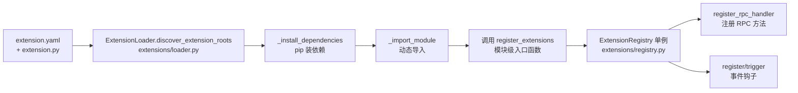
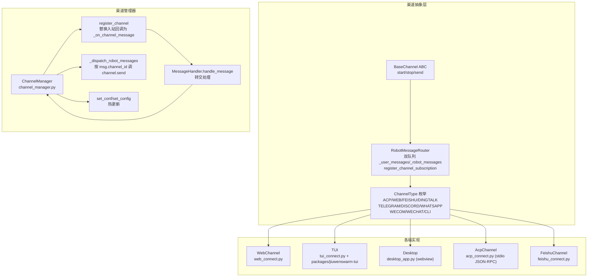
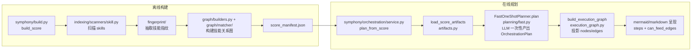

## JiuwenSwarm 是什么？

**JiuwenSwarm** 是一个华为云开源的**分布式 AI 多智能体协同与能力自进化系统**。简单说，它是一个让 AI 智能体像团队一样协作、并且越用越聪明的系统。

### 核心特色

#### 1. 三种执行模式，适配不同场景

| 模式 | 怎么工作 | 适合 |
|------|----------|------|
| **Plan 模式** | 单 Agent 深度推理，自带任务规划 Rail，边思考边执行 | 复杂任务、多步骤分析 |
| **Performance 模式** | 卸掉规划护栏，直问直答，延迟最低 | 快速问答、简单查询 |
| **Swarm 模式** | Leader 拆解任务，组建多 Agent 团队并行协作，可跨机器 | 大型复杂工作、多角色分工 |



#### 2. 可部署可扩展

Gateway + AgentServer 双进程架构，支持：
- **多用户隔离**：`SessionMap` 按 `(channel_id, user_id, mode, project_dir)` 四元组独立缓存 Agent 实例
- **多端接入**：Web / TUI / 桌面端 / 飞书 / 钉钉 / 企微 / Telegram / Discord
- **分布式**：Swarm 模式下可用 **pyzmq + PostgreSQL** 跨机协作，Leader 在主节点，Teammate 跑在工作机

#### 3. 技能自进化——越用越聪明

这是最创新的部分。系统不训练模型权重，而是通过一个**确定性状态机流水线**自动迭代 **Skill 定义**：

```
INIT → PLAN → GENERATE(生成初版 SKILL.md) → VALIDATE → TEST_DESIGN
                                                          ↓
                                               TEST_RUN → EVALUATE(评分+delta量化)
                                                          ↓
                                                  REVIEW(用户确认/反馈)
                                                         /   \
                                                   improve   accept
                                                      ↑        ↓
                                               IMPROVE(改写)  PACKAGE → COMPLETED
```

当系统检测到工具调用连续失败（`CircuitBreakerRail` 的熔断机制），或用户给出负反馈时，会自动进入改进循环：分析错误模式 → 改写 SKILL.md → 重新评分 → 量化增益（`run_summary["delta"]`），形成完整闭环。

#### 4. 架构分层

| 层 | 职责 | 核心模块 |
|----|------|----------|
| **接入层** | 多端/多平台接入 | `channels/web`、`channels/tui`、`gateway/channel_manager/im_platforms/` |
| **网关层** | 用户会话映射、消息路由、IM 协议适配 | `Gateway`、`MessageHandler`、`SessionMap` |
| **编排层** | Swarm 装配、Symphony 技能规划、SkillDev 自进化 | `agents/swarm`、`symphony/`、`server/runtime/skill/skilldev` |
| **基座层** | Leader 调度、LLM 抽象、RPC 扩展框架 | `openjiuwen`（agent-core） |

#### 5. 扩展也很简单

- **自定义 Agent**：配 `config.yaml` 选角色（leader/teammate）、挂 Rail 护栏和工具即可
- **自定义 Skill**：写一个 `SKILL.md`（YAML frontmatter + 描述），放到技能目录下
- **自定义扩展**：继承 `BaseExtension`，实现 `initialize()` 和 `shutdown()`，用 `register_extensions(registry)` 注册 RPC 方法

---

> 本文档基于 `jiuwenswarm` v0.2.2 源码（`pyproject.toml` 声明 `requires-python = ">=3.11,<3.14"`）逐文件剖析，所有论断均可回溯到具体类名、方法名与文件路径。

---

## 1. 系统宏观架构与设计哲学

### 1.1 核心理念：分层抽象与"声明式装配 + 运行时编排"

JiuwenSwarm 的"分布式"与"多智能体协同"并非一个单体调度器，而是由**三层架构**叠加而成：

```
┌─────────────────────────────────────────────────────────────┐
│  接入层 (Channels)  Web / TUI / Desktop / ACP / IM 平台       │
│  gateway/channel_manager + im_pipeline                      │
├─────────────────────────────────────────────────────────────┤
│  编排层 (Orchestration)                                      │
│  ┌───────────────┐  ┌────────────────┐  ┌────────────────┐  │
│  │ agents/swarm  │  │ symphony       │  │ agents/harness │  │
│  │ (成员 spec     │  │ (技能总谱+      │  │ (Auto Harness  │  │
│  │  装配层)       │  │  在线规划)      │  │  + 自进化)      │  │
│  └───────────────┘  └────────────────┘  └────────────────┘  │
├─────────────────────────────────────────────────────────────┤
│  基座层 (Foundation)  openjiuwen agent-core (华为云开源)       │
│  DeepAgentSpec / TeamMessageManager / 真正的 Leader 调度器    │
│  + MaaS / OpenAI / DeepSeek / 本地模型 抽象                   │
└─────────────────────────────────────────────────────────────┘
```

关键设计哲学在于**"薄装配、厚基座"**：

- **基座层 `openjiuwen`**（`pyproject.toml` 中 `openjiuwen @ git+https://gitcode.com/openJiuwen/agent-core.git@develop`）提供了真正的 Leader 调度逻辑——`build_team`、`create_task`、`spawn_teammate`、`send_message` 等团队工具，以及 `DeepAgentSpec` 基类、`TeamMessageManager`、`TeamApprovalOrchestrator` 等运行时。它同时封装了对华为云 MaaS、OpenAI 兼容接口、DeepSeek、DashScope、SiliconFlow、OpenRouter 等多种推理后端的统一抽象（`openjiuwen.core.foundation.llm.Model` / `ModelClientConfig` / `ModelRequestConfig`）。

- **编排层 `jiuwenswarm` 自身**不重写调度器，而是做**声明式 spec 装配**：`agents/swarm/assembly.py` 的 `enrich_team_spec_for_swarm(spec, *, session_id, mode, ...)` 把 `config.yaml` 里的 `leader`/`teammate` 定义折叠成 `DeepAgentSpec`（含 `RailSpec` 护栏、`BuiltinToolSpec` 工具、`SubAgentSpec` 子智能体），再交给 `openjiuwen` 构造运行对象。

- **接入层**通过 `gateway/channel_manager` 统一抽象，把底层 Swarm 能力桥接到 Web、TUI、桌面、ACP 及飞书/钉钉/企微/Telegram/Discord 等 IM 平台。

这种分层让"分布式"成为一种**可插拔的传输策略**而非硬编码：`agents/harness/team/distributed_runtime.py` 的 `is_distributed_mode()` 通过 `config.yaml` 的 `team.runtime.mode == "distributed"` 或 `team.transport.type == "pyzmq"` 判定，命中即启用跨进程/跨机通信，否则 `fallback_distributed_to_local` 回退到 `inprocess` 进程内调度。

### 1.2 三种执行模式对比（代码级）

项目实际支持 5 种细分模式（见 `docs/en/Modes.md`），映射到用户层的"三大模式"为：**规划（Plan）/ 性能（Performance / Fast）/ 集群（Swarm / Team）**。模式分支的核心入口在 `agents/swarm/config_specs.py:502` 的 `build_member_capability_specs(config, mode, role, ...)`，经 `_is_code_mode(mode)`（`:147`，判定 `_CODE_MODES = {"code.team", "team.plan"}`）分流到 `_build_code_capability_specs` 或 `_build_team_capability_specs`。

| 维度 | Plan 模式 (`agent.plan`) | Performance 模式 (`agent.fast`) | Swarm 模式 (`team`) |
|------|--------------------------|--------------------------------|---------------------|
| **底层 Runtime profile** | Deep Agent (`mode=agent`, `sub_mode=plan`) | Deep Agent (`mode=agent`, `sub_mode=fast`) | Team runtime (`mode=team`) |
| **核心装配入口** | `build_member_deep_agent_spec` 单 Agent spec | 同 Plan，但卸载重型 Rail | `enrich_team_spec_for_swarm` 组装 leader+teammate |
| **任务拆解者** | `TaskPlanningRail`（单 Agent 自规划） | 无规划 Rail，直接作答 | `openjiuwen` Leader 工具 `build_team`/`create_task` |
| **挂载的 Rail** | `TaskPlanningRail` + `SubagentRail` + `SkillEvolutionRail` + `SkillCreateRail` | 卸载上述四者，保留安全/权限/搜索类 Rail | `RuntimePromptRail` + `ResponsePromptRail` + `SysOperationRail` + `TaskPlanningRail` + `SecurityRail` + `HeartbeatRail` + `AvatarPromptRail`；leader 额外挂 `TEAM_SKILL_EVOLUTION` + `TEAM_SKILL_CREATE` |
| **记忆策略** | 主动记忆 (`is_proactive: true`)，主动检索与巩固 | 被动记忆 (`is_proactive: false`)，按需读写 | 团队共享 `TEAM_MEMORY.md` + 自动抽取 + 成员记忆注入 |
| **并行度** | 单 Agent 串行推理 + 子智能体 | 单 Agent 直答，可选并行工具调用 | 多 Agent 真并行，Leader 分发子任务给 Teammate |
| **分布式能力** | 否（单进程） | 否（单进程） | 是（`pyzmq` + PostgreSQL，可跨机） |
| **适用场景** | 复杂任务分解、长推理、技能演进 | 简单任务、快速响应 | 大型复杂任务、多角色协作 |
| **Swarmflow 支持** | 否 | 否 | 是（`team.plan` leader 挂 `TEAM_PLAN_APPROVAL` rail） |

**调度差异的本质**：`agent.plan` 与 `agent.fast` 共用同一 Deep Agent profile，差异仅在 Rail 装配集——前者保留重型编排 Rail，后者剥离以追求低延迟；而 `team` 模式从单 Agent profile 切换到 Team profile，由 `TeamManager`（`agents/harness/team/team_manager.py:183`）维护 `_team_agents`/`_team_rail_contexts`/`_workflow_handlers` 等运行时簿记字典，真正的多 Agent 协同由 `openjiuwen` 的 Leader 工具驱动。

---

## 2. 核心模块与组件深挖

项目代码以 `jiuwenswarm/` 为核心包，辅以 `jiuwenbox/`（代码执行沙箱）与 `packages/jiuwenswarm-tui/`（终端前端）。下面按职责拆解四大核心组件。

### 2.1 Orchestrator / Leader 调度器

**关键认知**：`jiuwenswarm` 仓库内的 `agents/swarm/` 目录**不是运行时调度器，而是纯声明式的"成员能力 spec 装配层"**。真正的 Leader 调度逻辑在基座库 `openjiuwen` 中。

装配流水线如下：

```mermaid
flowchart LR
    A["config.yaml<br/>modes.team 定义"] --> B["assembly.py<br/>enrich_team_spec_for_swarm"]
    B --> C["register_swarm_providers<br/>registry.py:149"]
    C --> D["SwarmBuildContext<br/>context.py"]
    D --> E["build_member_deep_agent_spec<br/>config_specs.py:597"]
    E --> F["DeepAgentSpec<br/>openjiuwen 基座"]
    F --> G["openjiuwen Leader 运行时<br/>build_team/create_task/spawn_teammate"]
    G --> H["TeamManager 运行时簿记<br/>team_manager.py:183"]
```



- **`enrich_team_spec_for_swarm(spec, *, session_id, mode, ...)`**（`agents/swarm/assembly.py`）：装配总入口，依次执行 `register_swarm_providers()` → 建 `SwarmBuildContext` → 对 `leader`/`teammate` 调 `build_member_deep_agent_spec` → 挂 `spec.build_context` + `spec.build_context_seed`。
- **`build_member_deep_agent_spec(config, mode, role, base_spec, ...)`**（`config_specs.py:597`）：把能力"折叠"到 spec 上。角色只有两种 `_MEMBER_ROLES = ("leader", "teammate")`（`assembly.py:39`），角色差异由 `_role_evolution_rails(config, role)` 决定——`leader` 加 `TEAM_SKILL_EVOLUTION`+`TEAM_SKILL_CREATE`，`teammate` 加 `MEMBER_SKILL_EVOLUTION`。
- **`SwarmBuildContext`**（`context.py`）：跨序列化边界重建上下文的核心。`to_seed()` 导出可序列化原语，`from_seed(seed, *, config, trajectory_registry)` 在接收进程用本地句柄重建；`registry.py:149` 的 `_build_swarm_context_from_seed` 经 `register_build_context_factory` 注册，供 spawn/分布式/冷恢复使用。
- **`TeamManager`**（`agents/harness/team/team_manager.py:183`）：per-channel 团队簿记管理器，维护 `_team_agents`/`_team_rail_contexts`/`_workflow_handlers` 字典，但它不是自然语言拆解器——拆解由 `openjiuwen` Leader 工具完成。

**Swarmflow（自然语言工作流编排）**：`agents/swarm/` 内无分解器，编排由 `openjiuwen` team 工具运行时执行。swarm 侧提供两块拼图：`providers/code_rails.py` 的 `swarm.code_task_planning`（`CODE_TASK_PLANNING`）与 `swarm.team_plan_approval`（`TEAM_PLAN_APPROVAL`，仅 `team.plan` leader 挂载）。状态流转与交接靠 `openjiuwen` 的 `TeamMessageManager`/`TeamApprovalOrchestrator`（在 `member_rails.py:488` 的 `_build_team_permission_rail` 中被引用装配）。

### 2.2 Teammate / Agent 实体与分布式通信

**Agent 实体定义**：在 `swarm/` 内是**声明式 spec**而非类继承。基类 spec 来自 `openjiuwen` 的 `DeepAgentSpec`；能力边界通过三类 spec 声明：

- `RailSpec`（行为护栏）
- `BuiltinToolSpec`（工具）
- `SubAgentSpec`（子智能体）

均带 `type`（`swarm.*` provider 名）+ `params`（属性烘焙）。专业分工由 `config_specs.py` 的模式/角色分档实现：`_COMMON_RAIL_NAMES`/`_COMMON_TOOL_NAMES`（team 档）vs `_CODE_RAIL_NAMES`/`_CODE_TOOL_NAMES`（code 档）。

**分布式通信协议栈**：



- **传输层**：`agents/harness/team/distributed_runtime.py` 使用 **pyzmq (ZMQ)** 做消息传输（`:28` 判定 `transport_type == "pyzmq"`，`:166` `find_spec("zmq")` 探测可用性），**PostgreSQL**（`asyncpg`）做会话与任务状态存储，失败时 `fallback_distributed_to_local` 回退到 `inprocess`。
- **Gateway ↔ AgentServer**：`server/agent_ws_server.py` 的 `AgentWebSocketServer`（单例）用 `websockets.legacy.server.serve` 监听，`_handle_message` 解析 `E2AEnvelope`、按 `is_stream` 调 `AgentManager`；`gateway/routing/agent_client.py` 的 `WebSocketAgentServerClient` 按 `request_id` 路由到独立 `asyncio.Queue`，首帧回 `connection.ack` 握手，`set_server_push_handler` 支持旁路推送。
- **Agent 注册与发现**：`server/runtime/agent_manager.py` 的 `AgentManager` 按 `(channel_id, mode, sub_mode, project_dir)` 缓存 `JiuWenSwarm` 实例（`_create_agent`/`recreate_agent`）；`agents/harness/team/remote_member_bootstrap.py` 的 `run_teammate_bootstrap_daemon` 让远程 teammate 主动注册到 `TeamManager`。AgentServer 独立进程入口 `server/app_agentserver.py` 的 `_run()` 在启动时守护该 daemon。

**`JiuWenSwarm` Facade**（`server/runtime/agent_adapter/interface.py`）：暴露 `create_instance`/`reload_agent_config`/`process_message`/`process_message_stream`，内部委托 `AgentAdapter`（`agent_adapters.py` 的 `create_adapter` 按 `JIUWENSWARM_AGENT_SDK` 环境变量选 `JiuWenSwarmDeepAdapter`/`JiuwenSwarmCodeAdapter`）；`_handle_symphony_request` 通过 `ExtensionRegistry.get_rpc_handler` 调度 symphony RPC。

### 2.3 Skill Hub 与运行时

Skill 体系独立于扩展系统，以 `SKILL.md`（YAML frontmatter + Markdown body）形式存在，存放在 `resources/agent/workspace/skills/<name>/SKILL.md`。

**Skill 定义结构**：frontmatter 仅允许 `ALLOWED_FRONTMATTER_KEYS = {name, description, license, allowed-tools, metadata, compatibility}`（`schema.py:627`），`SKILL_NAME_MAX_LEN=64`、`SKILL_DESC_MAX_LEN=1024`。目录约定 `SKILL.md + scripts/ + references/ + assets/`。

**动态加载链路**：



- **解析**：`SkillManager._parse_skill_md()`（`server/runtime/skill/skill_manager.py:2320`）用正则 `^---\s*\n(.*?)\n---\s*\n?(.*)` 切分，`yaml.safe_load` 解析 frontmatter，再补 `skill_dir`/`skill_file`。
- **暴露为工具**：`SkillToolkit`（`agents/harness/common/tools/skill_toolkits.py`）把 `search_skill`/`install_skill`/`uninstall_skill` 暴露为三个 `LocalFunction` 供 Agent 调用。
- **检索**：`SkillRetrieveService.retrieve()`（`symphony/skill_retrieval/retrieve_service.py`）调用 `Retriever.from_index(index_dir).search_details(query)`，索引由 `SkillIndexService.build_index()` 通过 `IndexBuilder.build()` 构建。
- **在线规划**：`FastOneShotPlanner.plan()`（`symphony/orchestration/planning/fast.py`）用 `FAST_PLANNER_SYSTEM_PROMPT` 让 LLM 从候选子图选最优执行路径，`build_execution_graph()` 投影成 nodes/edges。

---

## 3. 核心机制：技能自进化原理

这是 JiuwenSwarm 的核心创新点——**不训练模型权重，而是通过优化 Prompt / Harness 评估集 / Skill 定义让系统"越用越聪明"**。自进化由两条独立但互补的闭环构成。

### 3.1 闭环反思机制：错误信号捕获

错误信号捕获的核心在 `agents/harness/common/rails/execution_guard/circuit_breaker_rail.py`：

- **`ToolResultErrorDetector.has_error()` / `infer_record_has_error()`**：从 `ToolOutput`/dict/JSON 字符串中提取 `success=false`、`is_error`、`status=error`、非零 `exit_code` 等结构化错误信号。
- **`CircuitBreakerRail.after_tool_call()`**：每轮记录 `ToolCallRecord`（含 `args_hash`、`result_hash`、`has_error`），调用 `_detect()` 进行 4 类检测：`generic_repeat`（通用重复）/ `unknown_tool_repeat`（未知工具重复）/ `global_breaker`（全局熔断）/ `ping_pong`（乒乓震荡），命中 critical 时 `ctx.request_force_finish()` 强制结束当前会话。
- **`_normalize_result()` / `_hash_outcome()`**：把异常结果归一成 hash，用于判断"无进展"。

用户负反馈与记忆抽取在 `agents/harness/common/auto_memory/extraction_runner.py`：`_execute_auto_memory_extraction()` 把会话历史喂给一个 fork 子 agent，通过 `coding_memory_write` 把经验写入 `memory_dir/MEMORY.md`。GitCode issue 反馈则在 `issue_fix/issue_runner.py` 的 `GitCodeIssueRunner.reconcile()` 中扫描 task 日志（正则 `https://gitcode\.com/...pulls/\d+`）解析 PR，写回 `IssueStateStore`（`issue_fix/issue_state_store.py`，落盘 `gitcode-issues-status.json`）。

### 3.2 自进化优化路径：两条闭环

#### 闭环 A：SkillDevPipeline（Skill 定义进化）

`SkillDevPipeline`（`server/runtime/skill/skilldev/pipeline.py`）是一个**确定性状态机编排器**，维护阶段跳转顺序（`STAGE_HANDLERS` 注册表），在挂起点 checkpoint 并暂停，提供 `run()` 和 `resume()` 两个执行入口，每次请求创建、执行到挂起点/完成后释放（不长驻内存）。



状态机阶段（`SkillDevStage` 枚举）：`INIT → PLAN → GENERATE → VALIDATE → TEST_DESIGN → TEST_RUN → EVALUATE → REVIEW → IMPROVE → PACKAGE → DESC_OPTIMIZE → COMPLETED`。

- **`ImproveStageHandler`**（`stages/improve_stage.py`）：读 `state.feedback_history[-1]`，用 `IMPROVE_SYSTEM_PROMPT` 改写 skill 文件，`iteration += 1` 后跳回 `TEST_RUN` 形成闭环。
- **`DescOptimizeStageHandler`**：用 train/test split（`HOLDOUT_RATIO=0.4`）+ 最多 `MAX_ITERATIONS=5` 轮迭代优化 `description` 字段，`_apply_description()` 直接 regex 改写 `SKILL.md` frontmatter。
- **`EvaluateStageHandler.execute()`**（`stages/evaluate_stage.py`）：三步 `Grader 评分 → _aggregate_benchmark() 聚合 → _analyze_patterns()`，输出 `grading.json`/`benchmark.json`/`benchmark.md`；`BenchmarkRun`（`schema.py`）区分 `with_skill`/`baseline`，`_calc_stats()` 算 mean/stddev/min/max，`run_summary["delta"]` 量化增益。

#### 闭环 B：AutoHarnessService（Harness 评估集进化）

`AutoHarnessService`（`agents/harness/common/auto_harness/service.py`）通过 `EXTENDED_EVOLVE_PIPELINE`/`META_EVOLVE_PIPELINE` 跑扩展任务，结果落 `runs_dir/extension_design_*.json` 与 `runtime_extensions/`，`scan_runtime_extensions()` + `save_packages()` 刷新 `harness-packages.json`。

### 3.3 自进化闭环总览（完整流程图）



### 3.4 持久化与版本化

- **Skill 文件**：落 `resources/agent/workspace/skills/<name>/SKILL.md`。
- **进化历史**：用 `openjiuwen.agent_evolving.checkpointing.evolution_store.EvolutionLog` 写每个 skill 目录下的 `evolutions.json`（见 `skill_manager.py:634` `handle_skills_evolution_save`）。
- **SkillDev 状态**：由 `StateStore`（`skilldev/store.py`）checkpoint 到 `~/.jiuwenswarm/agent/workspace/skilldev/<task_id>/state.json`。
- **版本化发布**：`score_state.py` 的 `ScoreStateEntry`/`ScoreState`/`ScoreStateBuilder` 对每个 skill 文件夹算 sha256（`folder_hashes()`），`fingerprint_hash()` 基于 `SkillFingerprint.to_dict()` 做内容指纹；`score_storage.py` 的 `ScorePointer`（`current.json`）指向当前版本，`publish_artifact_dir()` 用 `os.replace` 原子切换 `versions/<version>`，`latest_incomplete_build()` 扫 `.build_runs/*/checkpoint.json` 恢复 running/failed 断点。

### 3.5 进化触发条件

三种触发并存：

| 触发类型 | 机制 | 关键代码 |
|----------|------|----------|
| **定时任务** | `Scheduler._schedule_loop()` 每 60 秒 `list_pending_tasks()`，到期跑 `META_EVOLVE_PIPELINE`，`next_run_time = completed_at + timedelta(hours=interval_hours)` | `auto_harness/scheduler.py:266` |
| **事件驱动** | `GitCodeIssueRunner.process_issues_once()` 监听带 `auto-harness` 标签的 GitCode issue，`assess_issue_difficulty()` 打分 ≤ `max_auto_difficulty` 时 `build_issue_fix_task()` 触发一次性任务 | `issue_fix/issue_runner.py` |
| **阈值触发** | `CircuitBreakerConfig`（`warning_threshold=10`/`critical_threshold=20`/`global_breaker_threshold=30`）在工具循环命中时强制结束；`SkillDevPipeline` 在 `REVIEW` 挂起点由用户 `action=improve` 触发新一轮闭环 | `circuit_breaker_rail.py` + `pipeline.py` |

**整体交互**：`AutoHarnessService` 持有 `Scheduler` + `TaskStore` + `AutoHarnessCapabilityRegistry`；issue 能力经 `GitCodeIssueRunner` → `harness_service.run_task()` → `AutoHarnessService.run()` → `create_auto_harness_orchestrator()` 编排；SkillDev 侧独立由 `SkillDevPipeline.run()`/`resume()` 驱动，状态经 `StateStore` checkpoint。

---

## 4. 接口与二次开发扩展指南

### 4.1 自定义 Agent / Skill 扩展接口

扩展系统的核心三件套位于 `jiuwenswarm/extensions/`：

**扩展基类**：`extensions/sdk/base.py` 的 `BaseExtension`(ABC) 是所有扩展的基类，强制实现两个抽象方法：

```python
class BaseExtension(ABC):
    @abstractmethod
    async def initialize(self, config: ExtensionConfig) -> None:
        """扩展初始化，可通过 self._load_config_from_yaml() 加载自己的 config.yaml"""

    @abstractmethod
    async def shutdown(self) -> None:
        """扩展关闭，释放资源"""
```

元数据从扩展目录下的 `extension.yaml`（`MANIFEST_FILENAME`）加载为 `ExtensionMetadata`（`extensions/types.py`），含 `id`/`name`/`version`/`description`/`author`/`min_jiuwenswarm_version`/`dependencies`/`config_schema` 字段。

两个具体扩展抽象子类：
- `extensions/sdk/agent_server_client.py` 的 `AgentServerClientExtension`（暴露 `get_client() -> AgentServerClient`）
- `extensions/sdk/crypto_utility.py` 的 `CryptoUtility`（暴露 `get_crypto()`）

**注册机制**：



- **`ExtensionRegistry`**（`extensions/registry.py`）：单例（`create_instance`/`get_instance`），承载 `AsyncCallbackFramework`、`register_rpc_handler`/`get_rpc_handler`、`register`(事件钩子)/`trigger`。
- **`ExtensionLoader`**（`extensions/loader.py`）：`discover_extension_roots()` 扫描搜索路径下含 `extension.yaml` 或 `extension.py` 的目录，`load_extension()` 读 manifest、`_install_dependencies` 装 pip 依赖、`_import_module` 动态导入并调用模块的 `register_extensions(registry)`。
- **`ExtensionManager`**（`extensions/manager.py`）：`_setup_search_paths()` 从 config 的 `extensions.extension_dirs`（分号分隔）加默认 `jiuwenswarm/extensions`，`load_all_extensions()` 驱动 loader。

**范例扩展**：`extensions/symphony/extension.py` 的 `SymphonyExtension` 在 `register(registry)` 中调用 `registry.register_rpc_handler("symphony.build_score", self.build_score)` 等注册 RPC 方法；模块级 `async def register_extensions(registry)` 是 `loader.py` 约定的入口。

**Hook 事件**：`extensions/hook_event.py` 定义 `GatewayHookEvents`/`AgentServerHookEvents`（如 `BEFORE_CHAT_REQUEST`、`MEMORY_BEFORE_CHAT`），由 `ExtensionRegistry.trigger` 触发，供扩展在请求生命周期的关键节点插入逻辑。

**Skill 体系（独立于扩展系统）**：Skill 以 `SKILL.md`+脚本形式存在（`resources/agent/workspace/skills/`），由 Agent runtime 经 `SkillToolkit` 装载而非扩展系统。`SkillManager`（`server/runtime/skill/skill_manager.py`）提供 `handle_skills_list`/`handle_skills_get`/`handle_skills_installed` 管理技能目录与 marketplace。

### 4.2 多端接入适配

统一抽象在 `gateway/channel_manager/base.py`：



- **`BaseChannel`**（`gateway/channel_manager/base.py`）：ABC，需实现 `start`/`stop`/`send`。
- **`RobotMessageRouter`**：双队列 `_user_messages`/`_robot_messages` + `register_channel_subscription` 订阅分发。
- **`ChannelType`** 枚举：`ACP`/`WEB`/`FEISHU`/`DINGTALK`/`TELEGRAM`/`DISCORD`/`WHATSAPP`/`WECOM`/`WECHAT`/`CLI`。
- **`ChannelManager`**（`channel_manager.py`）：`register_channel` 注册并把 channel 的入站回调替换为 `_on_channel_message`（转交 `MessageHandler.handle_message`）；`_dispatch_robot_messages` 循环消费 `MessageHandler.consume_robot_messages` 并按 `msg.channel_id` 调 `channel.send`；`set_conf`/`set_config` 支持热更新。

各端实现：
- **Web**：`gateway/channel_manager/web/web_connect.py` 的 `WebChannel(BaseChannel)`（`register_method` 注册 req method 处理器、`on_connect` 钩子）；`channels/web/app_web.py` 是静态前端托管+反代入口。
- **TUI**：`gateway/channel_manager/tui/tui_connect.py` 的 `build_cli_route_binding` 构造 `/tui` 路由绑定；`channels/tui/frontend` 是 TS 前端；`packages/jiuwenswarm-tui/jiuwenswarm_tui/app.py` 的 `main()` 解析平台二进制并 spawn `jiuwenswarm-tui` 进程。
- **Desktop**：`channels/desktop/desktop_app.py` 用 `webview` 包裹前端，spawn backend(19000)+frontend(5173) 子进程。
- **ACP**：`gateway/channel_manager/protocol/acp/acp_connect.py` 的 `AcpChannel(BaseChannel)` 与 `AcpGatewayBridge`（处理 stdio JSON-RPC 与 Gateway WebSocket 桥接）；`channels/acp/app_acp.py` 是 CLI 入口。

**IM 平台接入**：每个平台在 `gateway/channel_manager/im_platforms/<plat>/` 实现 `XxxChannel(BaseChannel)`。`gateway/im_pipeline/im_inbound.py` 定义 `IMPlatformAdapter`(Protocol，含 `get_principal_user_id`/`load_recent_messages`/`get_bot_mention_tokens`/`reply_user_id_key`)与 `IMInboundPipeline.apply()`/`IMConversationProcessor.process()`（LLM 改写群消息）；`im_outbound.py` 的 `IMOutboundPipeline.apply()` 做 DM/群发路由决策与 `[群聊追问@xx]`/`[私聊追问]` 前缀解析。平台适配器如 `feishu/feishu_im_adapter.py` 的 `FeishuIMPlatformAdapter`、`wecom/wecom_im_adapter.py` 的 `WecomIMPlatformAdapter` 实现 `IMPlatformAdapter` 接口。

### 4.3 网关路由与定时/心跳

`gateway/app_gateway.py` 的 `_run()` 是 Gateway 主装配流程：

1. `ExtensionRegistry.create_instance` + `ExtensionManager.load_all_extensions`
2. 从 `extension_registry.get_agent_server_client_extension()` 取客户端（否则 `WebSocketAgentServerClient`）
3. `_connect_with_retry` 连 AgentServer
4. `MessageHandler(client)` 单例化并 `set_inbound_pipeline`/`set_outbound_pipeline`
5. `CronSchedulerService` + `CronController` + `CronJobStore`
6. `HeartbeatConfig` + `GatewayHeartbeatService`
7. `ChannelManager(message_handler, config)`
8. 构造 `WebChannel` 并 `register_channel_with_inbound`，再用 `_build_acp_route_binding`/`build_cli_route_binding` 组装 `GatewayServer`（`GatewayRouteBinding` 描述每条路径的 `channel_id`/`forward_methods`/`inbound_interceptor`/`install`）

`gateway/routing/` 模块：
- `session_map.py` 的 `SessionMap`（`PER_CHAT_BOT`/`PER_CHAT_BOT_USER` scope）把稳定身份映射到轮转的 agent `session_id`，持久化到 `session_map.json`。
- `interaction_context.py` 的 `PendingInteraction` 支撑群聊追问上下文。

`gateway/heartbeat/heartbeat.py` 的 `GatewayHeartbeatService(IHeartbeat)` 周期性向 AgentServer 发探活请求（`HEARTBEAT_CHANNEL_ID="__heartbeat__"`、`HEARTBEAT_PROMPT`），支持 `active_hours` 时段；`gateway/cron/scheduler.py` 的 `CronSchedulerService`（`_loop` 调度、`_run_job` 触发 AgentServer、`_cancel_agent_session` 清理幽灵任务）+ `cron/controller.py` 的 `CronController`（单例、`_normalize_targets`）提供定时任务能力。

### 4.4 沙箱与 Symphony 总谱

**代码执行沙箱**：`server/sandbox/jiuwenbox_runner.py` 的 `JiuwenBoxRunner`（单例）管理本地 `jiuwenbox` uvicorn 子进程，由 `/sandbox enable` 触发 `ensure_running`，通过 `JIUWENBOX_POLICY_PATH` 注入 policy 文件，提供代码执行的隔离沙箱（Linux 用 `prctl PR_SET_PDEATHSIG` 让子进程随父退出）。`jiuwenbox` 是独立的代码执行引擎包（`jiuwenbox/src/jiuwenbox`）。

**Symphony Orchestration（技能总谱）**：`symphony/` 不是桌面运行时编排，而是「技能总谱（Symphony Score）」离线构建 + 在线规划：



与 `agents/swarm` 的关系：`extensions/symphony/extension.py` 的 `SymphonyExtension` 把 `symphony.build_score`/`symphony.graph`/`symphony.plan` 注册为 RPC；AgentServer 在 `JiuWenSwarm._handle_symphony_request` 收到 `ReqMethod` 为 `_SYMPHONY_METHODS` 时，从 `ExtensionRegistry.get_rpc_handler(method)` 取 handler 执行。即 **Symphony 是 Agent runtime 的"技能检索与执行路径规划"增强层**——规划结果（steps+can_feed_edges）以 mermaid/markdown 形式呈现给用户，由 Agent 实际驱动 skill 执行；它不直接调度 swarm，而是为 swarm 提供"先选哪些 skill、按什么顺序喂入"的图状计划。

---

## 附录：关键文件索引

| 模块 | 关键文件 | 核心类/方法 |
|------|----------|-------------|
| Swarm 装配 | `agents/swarm/assembly.py` | `enrich_team_spec_for_swarm` |
| 能力 spec | `agents/swarm/config_specs.py` | `build_member_deep_agent_spec`、`build_member_capability_specs`、`_is_code_mode` |
| 上下文重建 | `agents/swarm/context.py` | `SwarmBuildContext`、`to_seed`/`from_seed` |
| Provider 注册 | `agents/swarm/registry.py` | `register_swarm_providers`、`_build_swarm_context_from_seed` |
| 团队簿记 | `agents/harness/team/team_manager.py:183` | `TeamManager` |
| 分布式传输 | `agents/harness/team/distributed_runtime.py` | `is_distributed_mode`、`fallback_distributed_to_local` |
| 远程 bootstrap | `agents/harness/team/remote_member_bootstrap.py` | `run_teammate_bootstrap_daemon` |
| 错误熔断 | `agents/harness/common/rails/execution_guard/circuit_breaker_rail.py` | `CircuitBreakerRail`、`ToolResultErrorDetector` |
| 记忆抽取 | `agents/harness/common/auto_memory/extraction_runner.py` | `_execute_auto_memory_extraction` |
| Auto Harness | `agents/harness/common/auto_harness/service.py` | `AutoHarnessService` |
| Harness 调度 | `agents/harness/common/auto_harness/scheduler.py:266` | `Scheduler._schedule_loop` |
| Issue 驱动 | `agents/harness/common/issue_fix/issue_runner.py` | `GitCodeIssueRunner` |
| SkillDev 状态机 | `server/runtime/skill/skilldev/pipeline.py` | `SkillDevPipeline`、`STAGE_HANDLERS` |
| 评估阶段 | `server/runtime/skill/skilldev/stages/evaluate_stage.py` | `EvaluateStageHandler` |
| 改进阶段 | `server/runtime/skill/skilldev/stages/improve_stage.py` | `ImproveStageHandler` |
| Skill 状态存储 | `server/runtime/skill/skilldev/store.py` | `StateStore` |
| Skill 管理 | `server/runtime/skill/skill_manager.py` | `SkillManager`、`_parse_skill_md` |
| 版本化发布 | `jiuwenswarm/symphony/score_state.py` + `score_storage.py` | `ScoreState`、`ScorePointer`、`publish_artifact_dir` |
| 技能检索 | `jiuwenswarm/symphony/skill_retrieval/retrieve_service.py` | `SkillRetrieveService` |
| 在线规划 | `jiuwenswarm/symphony/orchestration/planning/fast.py` | `FastOneShotPlanner` |
| 总谱构建 | `jiuwenswarm/symphony/build.py` | `build_score` |
| Agent Facade | `server/runtime/agent_adapter/interface.py` | `JiuWenSwarm` |
| Agent 管理 | `server/runtime/agent_manager.py` | `AgentManager` |
| WS 服务端 | `server/agent_ws_server.py` | `AgentWebSocketServer` |
| AgentServer 入口 | `server/app_agentserver.py` | `_run` |
| 沙箱 | `server/sandbox/jiuwenbox_runner.py` | `JiuwenBoxRunner` |
| 扩展基类 | `extensions/sdk/base.py` | `BaseExtension`(ABC) |
| 扩展注册 | `extensions/registry.py` | `ExtensionRegistry` |
| 扩展加载 | `extensions/loader.py` | `ExtensionLoader` |
| 扩展管理 | `extensions/manager.py` | `ExtensionManager` |
| Hook 事件 | `extensions/hook_event.py` | `GatewayHookEvents`/`AgentServerHookEvents` |
| 渠道抽象 | `gateway/channel_manager/base.py` | `BaseChannel`、`RobotMessageRouter`、`ChannelType` |
| 渠道管理 | `gateway/channel_manager/channel_manager.py` | `ChannelManager` |
| IM 入站 | `gateway/im_pipeline/im_inbound.py` | `IMPlatformAdapter`、`IMInboundPipeline` |
| IM 出站 | `gateway/im_pipeline/im_outbound.py` | `IMOutboundPipeline` |
| 网关主装配 | `gateway/app_gateway.py` | `_run` |
| 路由绑定 | `gateway/routing/route_binding.py` | `GatewayRouteBinding` |
| 会话映射 | `gateway/routing/session_map.py` | `SessionMap` |
| 心跳 | `gateway/heartbeat/heartbeat.py` | `GatewayHeartbeatService` |
| 定时任务 | `gateway/cron/scheduler.py` | `CronSchedulerService` |
