> 结合 DSpark 论文与代码实现，全面剖析 DeepSpec 的工作原理与核心组件。
> 
> 项目地址：https://github.com/deepseek-ai/DeepSpec
> DSpark 论文：https://github.com/deepseek-ai/DeepSpec/blob/main/DSpark_paper.pdf

**DSpark 是 DeepSeek 提出的一套无损加速大模型推理的“看人下菜碟”机制。** 传统加速手段（推测解码）通常是让小模型一次性盲目盲猜一大串后续 Token，再让大模型统一验证。但这存在两个痛点：小模型猜得越往后越不准（多模态冲突导致“后缀衰减”）；高并发时，大模型花大力气去验证那些猜得不准的 Token，会严重压垮系统吞吐。

DSpark 的核心突破就在于两点：

1. **猜得更准（半自回归）：** 它在原有的单次并行生成网络后，拼了一个极轻量的小尾巴（顺序头），在几乎不增加延迟的情况下，让后面的 Token 能根据前面猜出的 Token 进行自适应修正，大幅提升长序列的猜测准确度。
2. **动态裁剪（置信度调度）：** 它能实时感知系统的硬件负载与并发压力。如果并发高、大模型很忙，或者发现后面小模型猜的置信度太低，它就会**果断把不靠谱的后缀砍掉**，只送靠谱的前缀给大模型验证。

通过这种“高质量猜测”与“负载感知动态裁剪”的结合，DSpark 在保障大模型输出质量完全无损的前提下，成功在 DeepSeek 真实的高并发生产环境中，让用户端生成速度暴增了 60% ~ 85%。

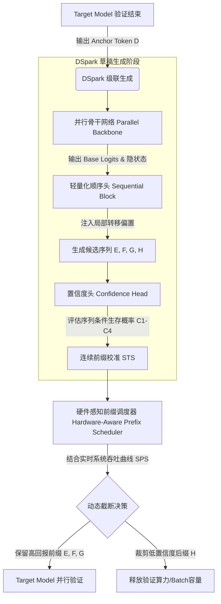

---

## 目录

1. [项目概述](#1-项目概述)
2. [背景：投机解码（Speculative Decoding）](#2-背景投机解码)
3. [DSpark 算法原理（论文核心）](#3-dspark-算法原理)
4. [核心组件与代码架构](#4-核心组件与代码架构)
5. [三种算法对比：DSpark / DFlash / Eagle3](#5-三种算法对比)
6. [端到端数据流](#6-端到端数据流)
7. [训练流程深度剖析](#7-训练流程深度剖析)
8. [推理与评估流程](#8-推理与评估流程)
9. [关键设计决策](#9-关键设计决策)
10. [总结](#10-总结)

---

## 1. 项目概述

DeepSpec 是一个用于**训练与评估投机解码（Speculative Decoding）草稿模型**的全栈代码库，由 DeepSeek-AI 团队开源。

### 核心问题

大型语言模型（LLM）推理时逐 token 生成，延迟与输出长度成正比。投机解码通过引入一个轻量**草稿模型**（Draft Model）并行提出多个候选 token，再由**目标模型**（Target Model，即完整大模型）单次前向传播批量验证，从而加速推理。

### 项目组成

```
DeepSpec/
├── 三种草稿模型算法
│   ├── DSpark   — 半自回归 + 置信度调度（最新、最强）
│   ├── DFlash   — 纯并行生成（DSpark 的简化版）
│   └── Eagle3   — 自回归 + TTT（Test-Time Training）
├── 完整训练管线（数据准备 → 训练 → 评估）
├── 支持的目标模型：Qwen3 (4B/8B/14B)、Gemma4 (12B)
└── 评估基准：gsm8k, math500, aime25, humaneval, mbpp, ...
```

---

## 2. 背景：投机解码

### 2.1 基本原理

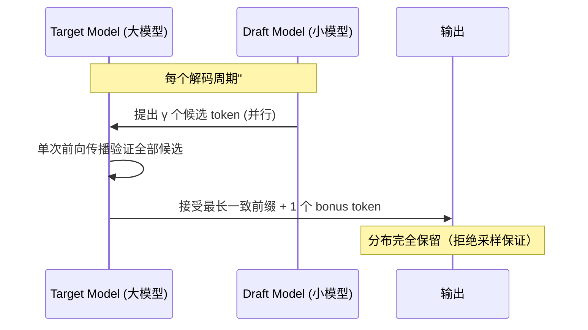

### 2.2 延迟公式

论文中的核心公式：

$$
\mathcal{L} = T_{\text{draft}} + \frac{\gamma}{\tau}
$$

- $T_{\text{draft}}$：草稿生成延迟
- $\gamma$：提案 token 数
- $\tau$：接受长度（expected accepted tokens per round）

**目标**：最小化 $\mathcal{L}$，即同时降低 $T_{\text{draft}}$ 和增大 $\tau$。

### 2.3 两类草稿模型的设计权衡

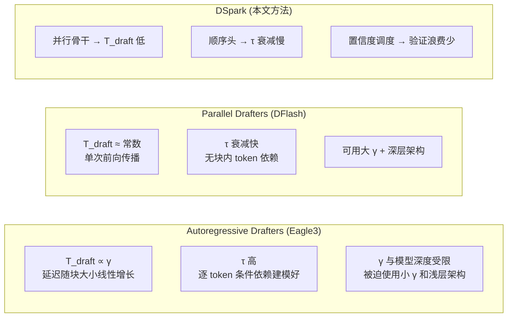

---

## 3. DSpark 算法原理

> 参考论文：*DSpark: Confidence-Scheduled Speculative Decoding with Semi-Autoregressive Generation* (DeepSeek-AI, 2026)

### 3.1 整体架构

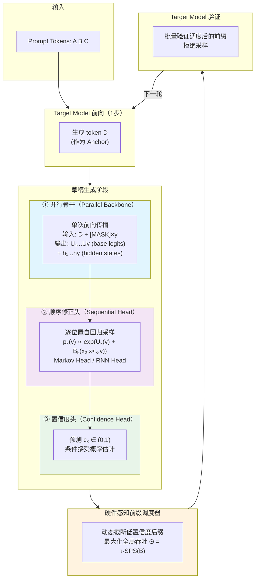

### 3.2 半自回归生成（Semi-Autoregressive Generation）

DSpark 将草稿生成拆分为两个**级联阶段**，兼具并行的高效与自回归的质量：

#### 阶段一：并行骨干

以 Anchor token（上一轮验证通过的最后一个 token）为条件，一次性前向传播预测整个草稿块：

$$
\text{输入: } x_0(\text{anchor}) + [\text{MASK}, \dots, \text{MASK}]
$$
$$
\text{输出: } U_1, \dots, U_\gamma \quad \text{(每个位置的 base logits)}
$$

**代码对应**（`deepspec/modeling/dspark/qwen3/modeling.py::Qwen3DSparkModel.forward`）：

```python
# 1. 构建噪声嵌入：anchor位置放anchor token，其余放mask token
noise_embedding = create_noise_embed(...)

# 2. 并行前向传播（所有草稿位置一次计算）
output_hidden = self._forward_backbone(
    noise_embedding=noise_embedding,
    target_hidden_states=target_hidden_states,  # KV注入
    attention_mask=dspark_attn_mask,
)
# output_hidden: [B, num_anchors * block_size, D]
```

#### 阶段二：顺序修正头

并行骨干的输出 $U_k$ 缺乏对块内前文的条件依赖。顺序头通过偏置项 $B_k$ 引入依赖：

$$
p_k(v) = \text{softmax}\left(U_k(v) + B_k(x_0, x_{<k}, v)\right)
$$

**三种顺序头实现**（`deepspec/modeling/dspark/markov_head.py`）：

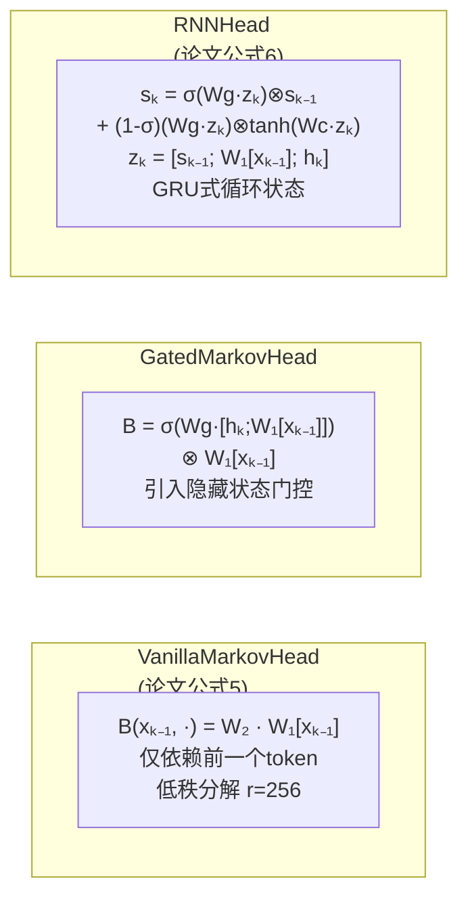

**推理时的逐位置采样**（`markov_head.py::sample_block_tokens`）：

```python
# 伪代码
for k in range(block_size):
    step_logits = base_logits[:, k, :] + B_k(prev_token, hidden_k)
    next_token = sample(step_logits)
    # 将 next_token 用于下一步的 B_{k+1} 计算
```

### 3.3 置信度调度（Confidence-Scheduled Verification）

#### 为什么需要置信度调度？

- 并行草稿块越长，后缀位置的接受率越低
- 在高并发服务中，验证每个额外 token 都占用目标模型 batch 容量
- **盲目验证所有提案 token 是浪费**

#### 置信度头设计

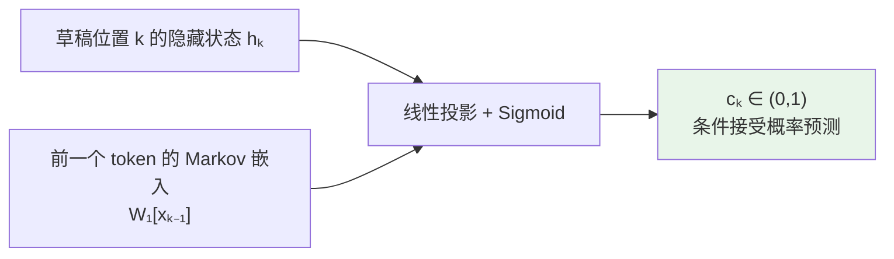

**监督信号**（解析接受率，论文公式8）：

$$
c_k^* = 1 - \frac{1}{2} \| p_d^{(k)} - p_t^{(k)} \|_1
$$

即 draft 分布与 target 分布之间的 Total Variation Distance 的补集。

**代码对应**（`deepspec/modeling/dspark/loss.py::_compute_accept_rate_3d`）：

```python
draft_probs = torch.softmax(draft_logits, dim=-1)
target_probs = torch.softmax(aligned_target_logits, dim=-1)
accept_rate_3d = 1.0 - 0.5 * (draft_probs - target_probs).abs().sum(dim=-1)
```

#### 硬件感知前缀调度器（Algorithm 1）

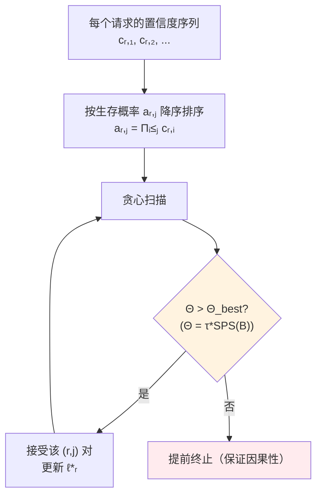

**关键设计**：贪心扫描中一旦吞吐下降立即终止，确保调度决策不依赖于未来 token，满足**非预期性质**（non-anticipating property），保证拒绝采样正确性。

---

## 4. 核心组件与代码架构

### 4.1 完整模块依赖图

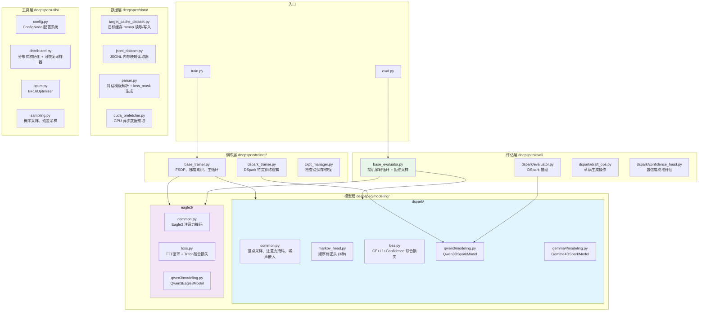

### 4.2 配置系统

所有算法/模型的超参数统一通过 Python 配置文件中转，由 `ConfigNode`（支持点访问的 dict）加载。

**典型 DSpark 配置结构**（`config/dspark/dspark_qwen3_4b.py`）：

| 配置项 | 含义 | DSpark 典型值 | DFlash | Eagle3 |
|--------|------|---------------|--------|--------|
| `block_size` | 每 anchor 草稿长度 | 7 | 7 | N/A |
| `num_draft_layers` | 草稿模型 Transformer 层数 | 5 | 5 | 1 |
| `target_layer_ids` | 提取的目标模型隐藏层 | `[1,9,17,25,33]` | 同左 | 同左 |
| `markov_rank` | Markov 头低秩维度 | 256 | 0（关闭） | N/A |
| `ce_loss_alpha` | CE 损失权重 | 0.1 | 1.0 | - |
| `l1_loss_alpha` | L1 分布匹配权重 | 0.9 | 0.0（关闭） | - |
| `confidence_head_alpha` | 置信度损失权重 | 1.0 | 0.0（关闭） | N/A |
| `loss_decay_gamma` | 位置衰减参数 | 4.0 | - | - |

---

## 5. 三种算法对比

### 5.1 架构对比

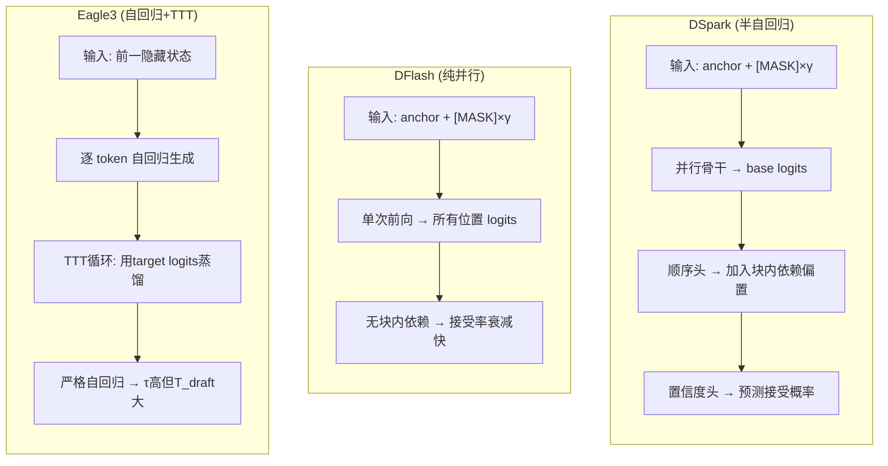

### 5.2 性能对比（来自论文）

| 指标 | Eagle3 (AR) | DFlash (Parallel) | DSpark (Ours) |
|------|--------------|-------------------|-----------------|
| 接受长度 (Qwen3-4B) | 基线 | +16.3% over Eagle3 | **+30.9% over Eagle3** |
| 草稿延迟 | ∝ γ（线性） | ≈ 常数 | ≈ 常数 |
| 块内依赖建模 | 完整 | 无 | 轻量（顺序头） |
| 置信度调度 | ❌ | ❌ | ✅ |

---

## 6. 端到端数据流

### 6.1 完整流水线

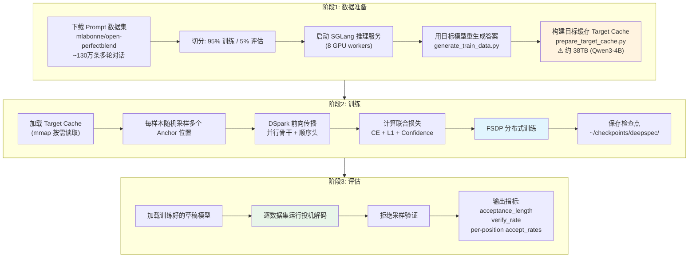

### 6.2 Target Cache 二进制格式

这是整个数据管线的核心设计（代码：`deepspec/data/target_cache_dataset.py`）。

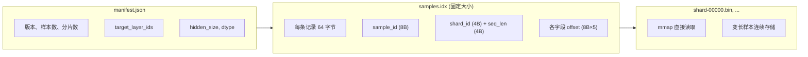

**存储内容**（每样本）：
- `input_ids`：原始 token IDs
- `loss_mask`：哪些位置的 target 输出需要计算损失
- `target_hidden_states`：指定目标层的隐藏状态（用于 KV 注入）
- `target_last_hidden_states`：目标模型最后一层隐藏状态（用于对齐 logits）

---

## 7. 训练流程深度剖析

### 7.1 训练主循环

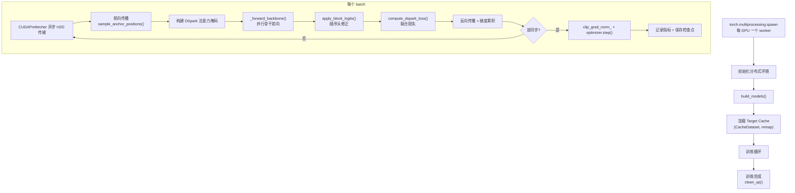

### 7.2 联合损失函数详解

**代码对应**（`deepspec/modeling/dspark/loss.py::compute_dspark_loss`）：

```python
L = α_ce × L_ce + α_l1 × L_l1 + α_conf × L_conf
```

其中：

| 损失项 | 公式 | 作用 | 权重 (DSpark) |
|--------|------|------|----------------|
| CE Loss | `CrossEntropy(draft_logits, target_ids)` | 稀疏监督信号，学正确 token | 0.1 |
| L1 Loss | $\frac{1}{2}\sum\|p_d - p_t\|_1$ | 稠密分布匹配，学整体分布 | 0.9 |
| Confidence Loss | `BCE(confidence_pred, accept_rate*)` | 校准置信度头 | 1.0 |

**位置衰减权重**：

```python
# loss.py::_build_loss_weight_mask
weights_k = exp(-(k-1) / loss_decay_gamma)  # γ = 4.0
```

块内越靠后的位置权重越低，因为后续位置的监督信号天然更不可靠。

### 7.3 分布式训练要点

- **FSDP**（`no_shard` / `full_shard` / `hybrid_shard`）
- **BF16Optimizer**：维护 fp32 master 参数，每步拷贝 bf16 梯度
- **StatelessResumableDistributedSampler**：确定性 shuffle，支持跨 epoch 连续采样
- **梯度累积**：`global_batch_size / (world_size * local_batch_size)`

---

## 8. 推理与评估流程

### 8.1 投机解码循环（核心）

这是 `deepspec/eval/base_evaluator.py::generate_decoding_sample()` 的完整逻辑：

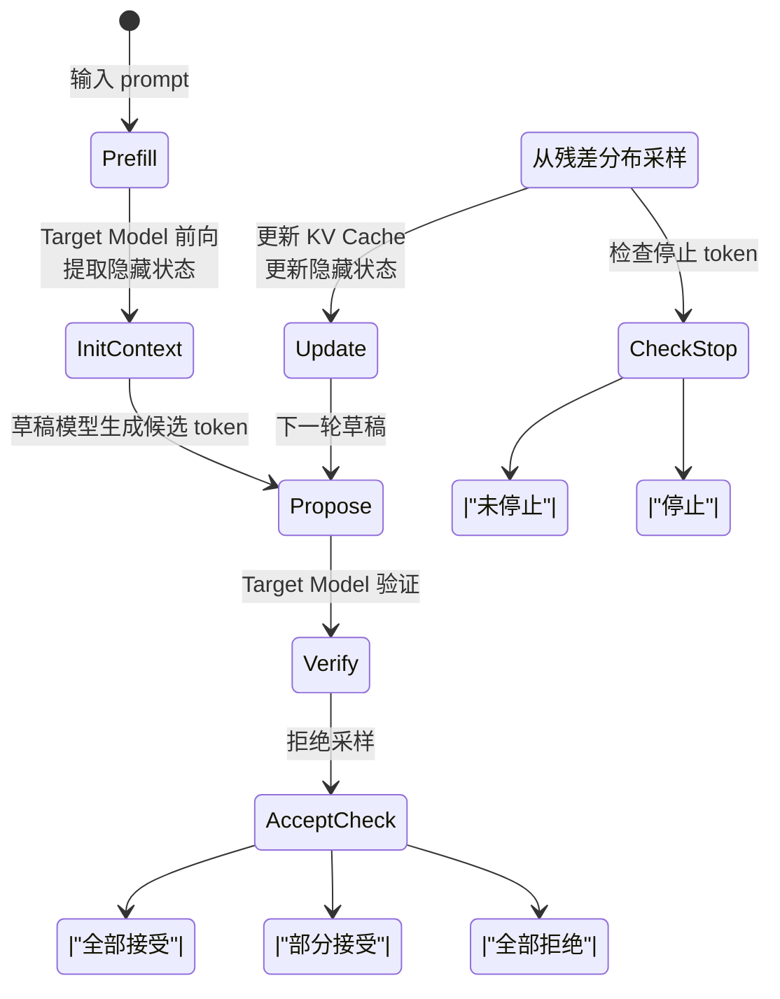

### 8.2 拒绝采样验证详解

**代码对应**（`base_evaluator.py::verify_draft_tokens`）：

```python
# 对每个草稿位置 k:
accept_prob_k = min(1, p_target(token_k) / p_draft(token_k))
if random() < accept_prob_k:
    accept token_k
else:
    reject token_k and all subsequent tokens
    # 从残差分布采样下一个 token
    next_token ~ max(0, p_target - p_draft)
```

**数学保证**：拒绝采样确保输出分布与 target model 分布完全一致（无质量损失）。

### 8.3 DSpark 推理特化

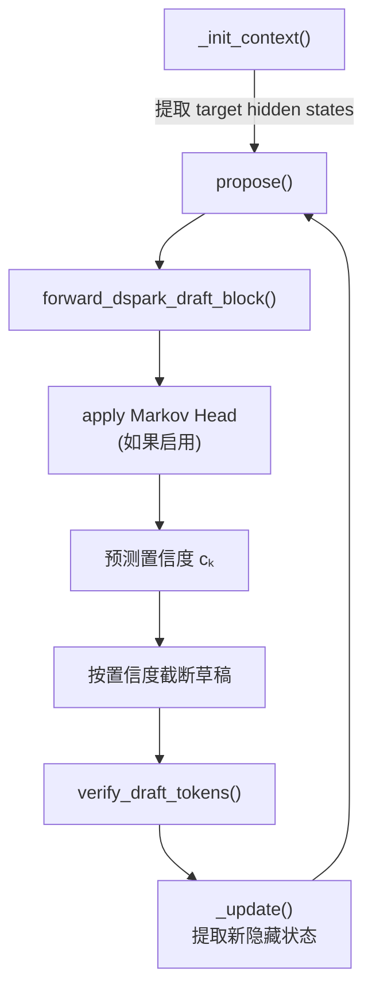

---

## 9. 关键设计决策

### 9.1 KV 注入（Context Feature Injection）

DSpark（继承自 DFlash）的核心设计：将目标模型多层隐藏状态注入草稿模型的注意力机制。

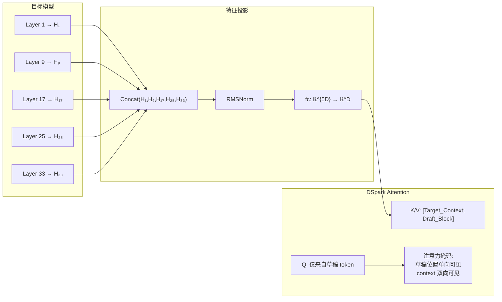

**代码对应**（`qwen3/modeling.py::Qwen3DSparkAttention.forward`）：

```python
# Q 来自草稿隐藏状态
q = self.q_proj(hidden_states)

# K/V 拼接 target context + 草稿
k = torch.cat([self.k_proj(target_hidden_states),
               self.k_proj(hidden_states)], dim=1)
v = torch.cat([self.v_proj(target_hidden_states),
               self.v_proj(hidden_states)], dim=1)

# 使用 DSpark 专用注意力掩码（flex_attention）
attn_output = flex_attention(q, k, v, attn_mask=dspark_attn_mask)
```

### 9.2 注意力掩码设计

DSpark 的注意力掩码确保每个草稿位置：
1. **可以看到** context 中 anchor 之前的全部位置
2. **可以看到**同 block 内之前的草稿位置（引入块内依赖）
3. **不能看到** context 中 anchor 之后的位置（保持因果性）

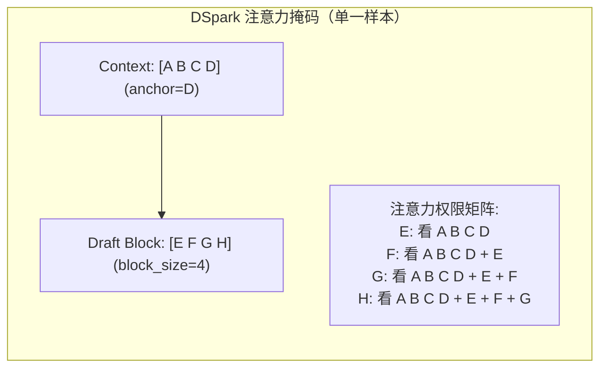

### 9.3 可恢复的分布式采样器

`StatelessResumableDistributedSampler` 是一个精妙设计：
- 只依赖 `start_global_offset_samples` 和 deterministic seed
- 可以从任意位置恢复训练（支持容错）
- 每个 epoch 使用不同 seed 的 `randperm`，保证覆盖全量数据

---

## 10. 总结

### 10.1 DSpark 的技术创新

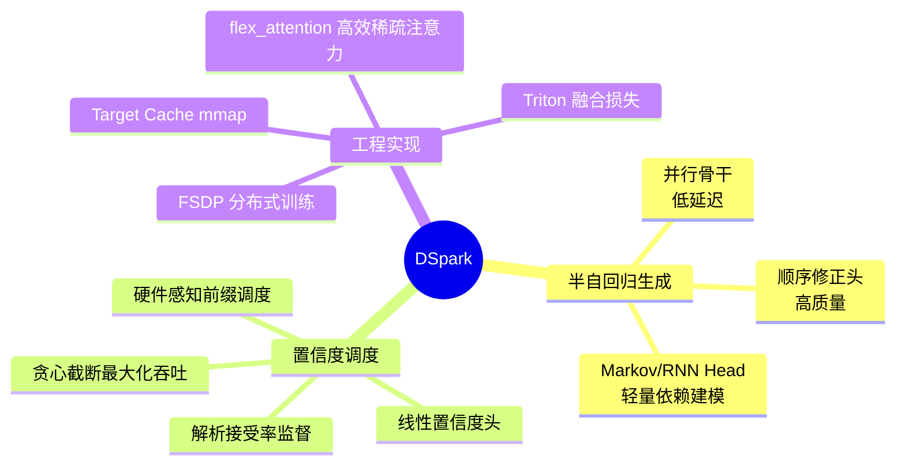

### 10.2 代码阅读路径推荐

| 顺序 | 文件 | 目的 |
|------|------|------|
| 1 | `README.md` | 项目概览 |
| 2 | `config/dspark/dspark_qwen3_4b.py` | 理解全部超参数 |
| 3 | `deepspec/data/target_cache_dataset.py` | 理解数据格式 |
| 4 | `deepspec/modeling/dspark/common.py` | 锚点采样、注意力掩码 |
| 5 | `deepspec/modeling/dspark/qwen3/modeling.py` | DSpark 模型完整前向 |
| 6 | `deepspec/modeling/dspark/markov_head.py` | 顺序修正头实现 |
| 7 | `deepspec/modeling/dspark/loss.py` | 联合训练目标 |
| 8 | `deepspec/trainer/base_trainer.py` | 训练主循环 |
| 9 | `deepspec/eval/base_evaluator.py` | 投机解码 + 拒绝采样 |
| 10 | `DSpark_paper.pdf` | 论文原始描述 |

### 10.3 项目意义

DeepSpec 不仅开源了 DSpark 的训练代码，还一并开源了 **DFlash** 和 **Eagle3** 的实现，为投机解码研究提供了一个统一的、算法驱动的训练框架。结合 DeepSeek-V4 的生产部署结果（60%-85% 的单用户加速），DSpark 已被验证为当前最先进的投机解码算法之一。
