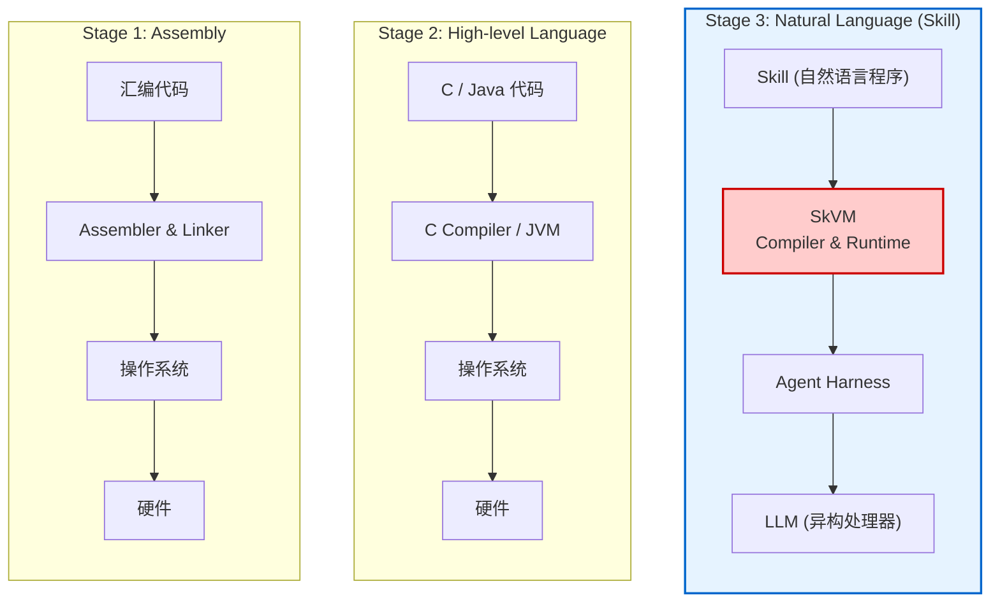
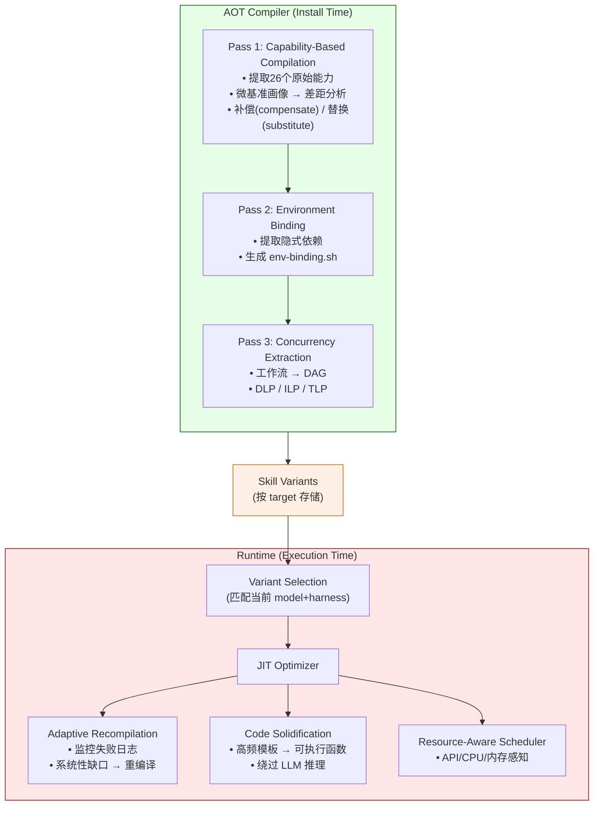
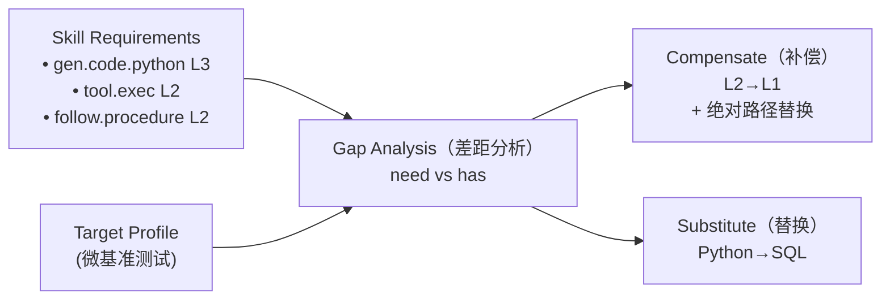
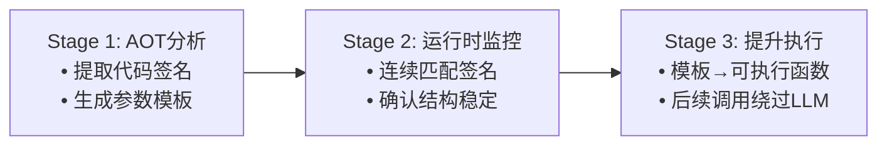
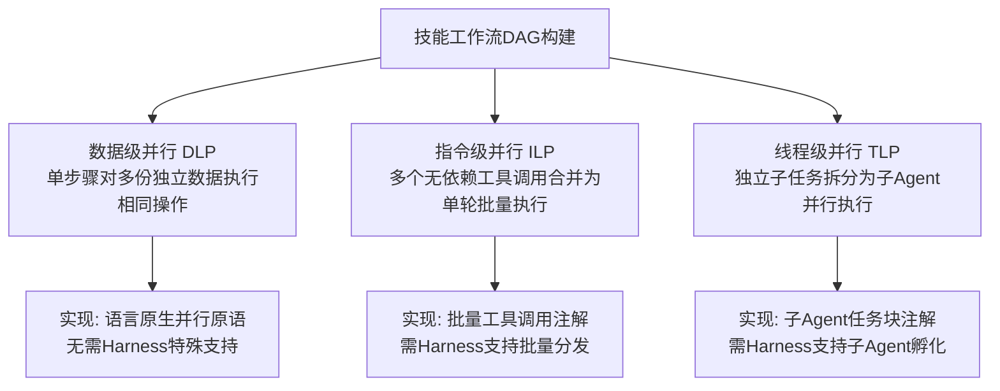
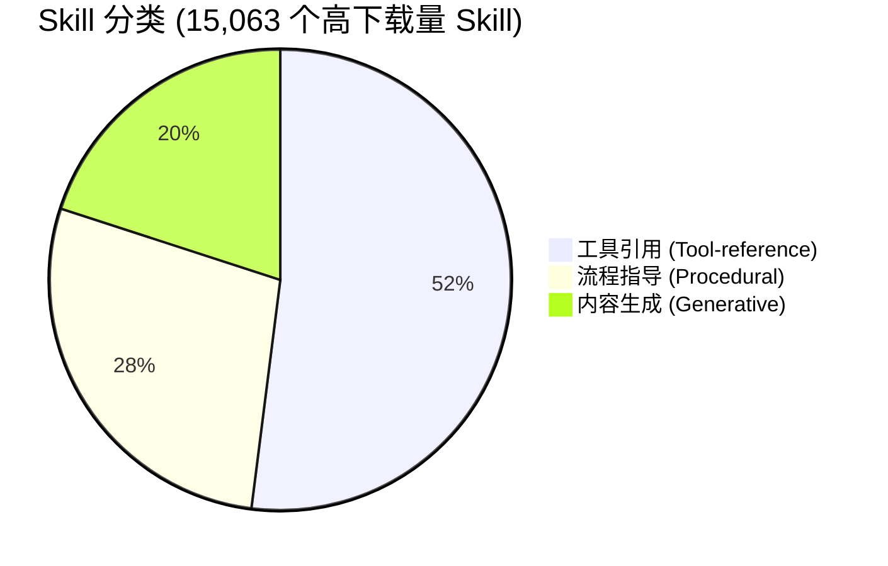

## 一句话概括

> **把 Skill 当作"代码"、把 LLM 当作"异构处理器"，借鉴传统编译器（AOT + JIT）设计思想，首次为 LLM Agent 的 Skill 构建了跨模型、跨平台的编译与运行时系统。**

---

## 一、核心问题：Skill 的"可移植性危机"

当前 Agent 把 Skill 当作**原始文本**直接塞给模型，导致同一 Skill 在不同模型/Harness 上表现天差地别。作者分析了 **118,000+** 个 Skill（clawhub.ai + skills.sh），发现：

| 问题 | 数据 |
|------|------|
| 使用 Skill 后性能**下降** | **15%** 的任务 |
| 使用 Skill 后**无变化** | **17%** 的任务 |
| 至少一个模型**无改善** | **87%** 的任务 |
| Token 开销暴增 | 最高 **451%** |

三大失配：
- **P1 模型失配**：Skill 假设模型能区分库 API 与 CLI，小模型直接翻车
- **P2 Harness 失配**：同一模型在不同 Harness（Claude Code / OpenCode / BareAgent）上结果差异巨大
- **P3 环境失配**：缺少依赖包时，Qwen 成功率从 100% 暴跌到 33-67%，且 Token 消耗翻倍

---

## 二、核心类比：编程语言的演进

**关键洞察**：Skill 是"自然语言程序"，LLM 是"异构处理器"，但**缺少编译器和运行时**来保证跨目标可移植性与执行效率。

---

## 三、SkVM 架构：AOT 编译 + 运行时 JIT

---

## 四、三大技术创新详解

### 1. 原始能力（Primitive Capabilities）—— 让"可移植"可量化

从 15,063 个 Skill 中归纳出 **26 个原始能力**（如 `gen.code.shell`, `tool.exec`, `follow.procedure`），每个能力分 **L1/L2/L3** 熟练度。

- **补偿（Compensation）**：目标能力级别不足时，通过增加示例、明确约束来"降级" Skill 要求
- **替换（Substitution）**：差距过大时，切换到等价实现路径（如 Python pandas → SQL）

### 2. 代码固化（Code Solidification）—— 绕过 LLM 的"JIT 编译"

75% 的 Skill 包含**结构固定、仅参数变化**的代码片段。SkVM 将其提升为可执行函数：

**效果**：PDF 提取任务从 **10,469 ms → 206 ms**，加速 **19-50×**；天气查询加速 **5×**（受网络延迟限制）。

### 3. 并发提取（Concurrency Extraction）—— 从自然语言中挖并行性

借鉴编译器经典优化：
- **DLP**（数据级并行）：批量处理多个文件
- **ILP**（指令级并行）：独立工具调用可重叠
- **TLP**（线程级并行）：生成独立子 Agent 并行执行

---

## 五、评估结果

在 **8 个 LLM**（Claude Opus 4.6, Gemini 3 Flash, Claude 3.5 Haiku, Devstral Small, Qwen3-30B 等）× **3 个 Harness**（Claude Code, OpenCode, BareAgent）上测试：

| 指标 | 结果 |
|------|------|
| 任务完成率提升 | **平均 +15.3%** |
| Token 消耗降低 | **最高 -40%** |
| 并行加速 | **最高 3.2×** |
| 代码固化延迟降低 | **19-50×** |

---

## 六、Skill 生态画像（基于 118,000+ Skill）

- **76%** 包含显式流程结构（编号步骤、条件分支）
- **75%** 嵌入可固化代码片段
- **长尾分布**：89% 的 Skill 下载量 < 86 次

---

## 七、局限与未来方向

1. **非确定性**：编译过程依赖 LLM，输出可能有波动（已设计回滚机制）
2. **能力覆盖**：26 个能力覆盖 95% Skill，新领域需扩展
3. **编译成本**：AOT 为一次性开销，但对"一次性使用"场景不友好

---

## 八、为什么这篇论文重要？

| 维度 | 价值 |
|------|------|
| **问题定义** | 首次用大规模数据（118K Skills）量化了 Skill 可移植性危机 |
| **理论框架** | 将"Skill = 代码，LLM = 处理器"的类比落地为完整编译器体系 |
| **工程实现** | 从 AOT 三阶段编译到 JIT 代码固化，全链路可运行 |
| **实际收益** | 不仅提升准确率，还显著降本（Token -40%）提速（延迟 -50×） |

> **一句话推荐给同行**：如果你在做 Agent 框架、Skill 市场或 LLM 工具链，这篇论文提出了一个**像 JVM 之于 Java 那样的基础设施愿景**——让 Skill 真正"一次编写，到处运行"。

---

**论文链接**：[arXiv:2604.03088v2](https://arxiv.org/abs/2604.03088)
