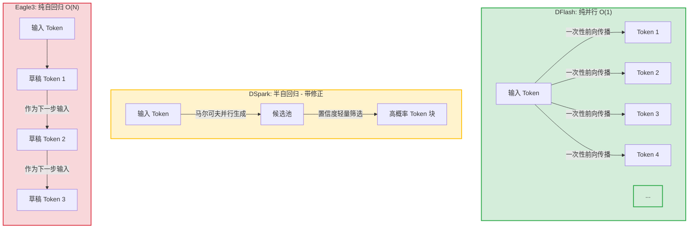

在大语言模型（LLM）的生产落地中，自回归生成的 $O(N)$ 延迟始终是制约用户体验与系统吞吐的瓶颈。投机采样（Speculative Decoding）通过引入轻量级的“草稿模型（Draft Model）”先行生成候选 Token，再由大模型（Verification Model）进行并行校验，成为了当前最主流的加速方案。

本文将针对当前业界前沿的三种草稿模型方案——**DFlash（纯并行）**、**DSpark（半自回归）** 与 **Eagle3（纯自回归）** 进行深度架构剖析、技术指标对比及选型建议。

---

## 一、 核心架构与生成机制对比

三种方案的本质区别在于“生成速度（并行度）”与“草稿质量（接受率）”的权衡。以下图表直观展示了它们在计算模式上的根本差异：



### 1. DFlash (纯并行 / 无修正)

* **机制**：完全打破传统的自回归依赖。利用位置编码或修改 Attention Mask，在单次前向传播中强行“同时”预测未来多个位置的 Token。
* **特点**：拥有极致的 $O(1)$ 时间复杂度，草稿生成阶段几乎不占用时间。但由于缺乏 Token 间的显式上下文依赖，预测长度越长，准确率（接受率）崩塌越严重。

### 2. DSpark (半自回归 / 马尔可夫 + 置信度调度)

* **机制**：介于并行与串行之间。利用轻量级的马尔可夫链（Markov Chain）或浅层 Head 快速并行产生多个候选 Token，并在其上叠加一套**置信度（Confidence）评估系统**。
* **特点**：在 $O(1)$ 并行生成的基础上增加了“轻量修正”过滤。系统会根据当前生成的置信度动态截断低质草稿，实现 $O(1) + \text{修正}$ 的动态时间复杂度，在速度与质量之间取得了极佳的平衡。

### 3. Eagle3 (纯自回归 / 特征层树状解码)

* **机制**：作为 Eagle 系列的演进方案，它摒弃了盲目并行，选择在大模型的特征层（Feature-level）构建一个轻量级的自回归草稿网络，并通常结合树状解码（Tree-structured Decoding）。
* **特点**：草稿本身就是自回归生成的，天然契合大模型的条件概率分布，接受率极高。但由于是串行生成，其生成延迟与草稿块长度（Block Length）呈正比，复杂度为 $O(N)$。

---

## 二、 核心技术指标全景矩阵

| 评估维度 | **DFlash** (纯并行) | **DSpark** (半自回归) | **Eagle3** (纯自回归) |
| --- | --- | --- | --- |
| **时间复杂度** | <br>$$O(1)$$<br>（与草稿长度无关） | <br>$$O(1) + \text{轻量校验}$$<br> | <br>$$O(N)$$<br>（与草稿长度成正比） |
| **草稿接受率** | 📉 **低**（随长度增加呈指数级下跌） | 📊 **中等至高**（通过置信度动态动态调整） | 📈 **极高**（最贴近大模型原生分布） |
| **额外计算开销** | **极低**（几乎不占用算力） | **低**（仅引入轻量级筛选算子） | **中等**（每次自回归需串行前向传播） |
| **代码/改造成本** | **零成本**（调配置/加 Head，无骨干改动） | **中等**（需要集成置信度调度系统） | **高**（需要引入/微调轻量级草稿模型） |
| **单次请求延迟** | 波动大（接受率不稳定导致验证开销波动） | 稳定且低（通过置信度优化了无效验证） | **极低**（超高接受率带来稳定的加速比） |
| **高并发吞吐量** | 差（大模型频繁进行无效验证占满算力） | 🏆 **最优**（动态 Batching 与置信度完美契合） | 中等（草稿串行生成占用了部分计算资源） |

---

## 三、 场景化选型指南与决策路径

在实际业务落地时，没有绝对完美的模型，只有最契合场景的方案。请参考以下决策路径进行技术选型：

```
                              [开始工程选型]
                                     |
                      是否有算力/时间微调或引入独立模型？
                                   /   \
                             (否) /     \ (是)
                                 /       \
                         [ 选 DFlash ]    核心业务指标是什么？
                         - 快速跑通 Baseline  /         \
                         - 零代码修改验证     /           \
                                           /             \
                                    (追求系统总吞吐)   (追求极客体验/低延迟)
                                      [ 选 DSpark ]       [ 选 Eagle3 ]
                                      - ToC 高并发高 QPS   - ToB 复杂推理(代码/数学)
                                      - 动态 Batching 优化 - 单次请求极致 Low-latency

```

### 1. 推荐选择 **DFlash** 的场景：研究基线与快速验证

* **场景特征**：项目刚起步，或者团队希望在短时间内评估投机采样对当前业务大模型的潜在加速收益。
* **理由**：无需繁琐的模型训练与蒸馏过程，通过修改 Attention Mask 或直接在外层包裹简单的 Blockwise Head 即可上线，试错成本极低。

### 2. 推荐选择 **DSpark** 的场景：生产环境高并发（ToC）

* **场景特征**：高流量、高 QPS 的互联网线上服务。在此场景下，系统吞吐量（Throughput）和算力成本（GPU Utilization）是核心KPI。
* **理由**：DSpark 的置信度调度机制能够在大模型验证前拦截掉低质量的草稿，避免了大模型做无效的并行验证，从而把算力留给真正的动态 Batching 请求，整体系统吞吐表现最优。

### 3. 推荐选择 **Eagle3** 的场景：复杂推理与极致单次响应（ToB / 精准要求）

* **场景特征**：代码生成（Code Generation）、数学推导（Math）、结构化 JSON 输出等对 Token 准确度要求极高，且“错一个字后面全错”的场景。
* **理由**：Eagle3 凭借特征层自回归和树状采样，能够提供无可比拟的草稿接受率。虽然草稿生成有 $O(N)$ 延迟，但它换来的是大模型几乎“一拍即合”的超高通过率，能够带来最稳健的单次请求端到端加速比（Speedup Ratio）。
