> 基于 `/Applications/WorkBuddy.app/Contents/Resources/app.asar.unpacked` 逆向分析
> WorkBuddy Desktop v5.2.5 + CodeBuddy CLI v2.106.4 | 腾讯出品

---

## 一、整体架构概览

```mermaid
graph TB
    subgraph "操作系统层"
        OS["macOS / Windows<br/>Darwin / Win32"]
        FSE["FSEvents API<br/>(macOS 文件监听)"]
        PTY["Pseudoterminal API<br/>(openpty / ConPTY)"]
        SQLITE["SQLite Engine<br/>(C++ 绑定)"]
    end

    subgraph "Electron 应用外壳 (WorkBuddy Desktop v5.2.5)"
        ELECTRON["Electron Main Process<br/>Node.js + Chromium"]
        RENDER["Renderer Process<br/>React/Vue UI + WebView"]
        DEVTOOLS["DevTools Panel<br/>Ghostty WASM Terminal"]
        PRELOAD["Preload Scripts<br/>IPC 安全桥接"]
    end

    subgraph "CLI 核心宿主 (CodeBuddy CLI v2.106.4)"
        CLI["cli/bin/codebuddy<br/>Node.js 启动器"]
        TUI["TUI Mode<br/>Ink + React 19<br/>~16MB Bundle"]
        DAEMON["Daemon Mode<br/>HTTP Server<br/>Port 51862+"]
        HEADLESS["Headless Mode<br/>-p / --print<br/>CI/CD 管道"]
        WEBUI["Web UI<br/>Workers / Logs / Metrics"]
    end

    subgraph "原生模块层 (app.asar.unpacked)"
        NATIVE_MOD["node_modules/"]
        BETTER_SQL["better-sqlite3<br/>v12.8.0 (MIT)"]
        NODE_PTY["node-pty<br/>v1.1.0 (Microsoft)"]
        LYDELL_PTY["@lydell/node-pty-darwin-arm64<br/>v1.2.0-beta.12"]
        DOCS_ENGINE["@tencent/docs-engine<br/>v0.0.1-beta.9"]
        FSE_MOD["fsevents<br/>(nunjucks 嵌套依赖)"]
    end

    subgraph "资源与扩展层 (resources/)"
        RES["resources/"]
        BUILT_PLUGINS["builtin-plugins/"]
        BUILT_SKILLS["builtin-skills/<br/>15 个内置技能"]
        BUILT_MCP["builtin-mcp-apps/"]
        TEMPLATES["templates/<br/>Nunjucks 提示词模板"]
        DEVTERM["devtools-terminal/<br/>Chrome Extension v3"]
        BRANDING["channel-branding/<br/>OEM 品牌资源"]
    end

    subgraph "AI 推理后端"
        BACKEND["copilot.tencent.com<br/>AI 推理集群"]
        MCP_PROXY["MCP Connector Proxy<br/>Port 61047"]
    end

    subgraph "用户数据层 (~/.workbuddy/)"
        USER_DATA["~/.workbuddy/"]
        DB["workbuddy.db<br/>(SQLite + WAL)"]
        SOUL["SOUL.md<br/>AI 灵魂"]
        IDENTITY["IDENTITY.md<br/>智能体身份"]
        MEMORY["memory/<br/>项目级记忆"]
        SESSIONS["sessions/<br/>会话 JSON"]
        TRACES["traces/<br/>运行追踪"]
    end

    OS --> ELECTRON
    ELECTRON --> RENDER
    ELECTRON --> PRELOAD
    RENDER --> DEVTOOLS

    ELECTRON -->|spawn| CLI
    CLI --> TUI
    CLI --> DAEMON
    CLI --> HEADLESS
    DAEMON --> WEBUI

    NATIVE_MOD --> BETTER_SQL
    NATIVE_MOD --> NODE_PTY
    NATIVE_MOD --> LYDELL_PTY
    NATIVE_MOD --> DOCS_ENGINE
    NATIVE_MOD --> FSE_MOD

    CLI --> NATIVE_MOD
    CLI --> RES

    RES --> BUILT_PLUGINS
    RES --> BUILT_SKILLS
    RES --> BUILT_MCP
    RES --> TEMPLATES
    RES --> DEVTERM
    RES --> BRANDING

    TUI -->|HTTP/WebSocket| BACKEND
    DAEMON -->|HTTP API| BACKEND
    HEADLESS -->|HTTP API| BACKEND
    BACKEND -->|MCP STDIO/SSE/HTTP| MCP_PROXY

    CLI -->|读写| USER_DATA
    DAEMON -->|读写| DB
    TUI -->|读取| SOUL
    TUI -->|读取| IDENTITY
    TUI -->|读取| MEMORY
    TUI -->|写入| SESSIONS
    TUI -->|写入| TRACES

    FSE -->|API 调用| FSE_MOD
    PTY -->|API 调用| NODE_PTY
    PTY -->|API 调用| LYDELL_PTY
    SQLITE -->|C++ 绑定| BETTER_SQL

    DOCS_ENGINE -->|"FFI 加载：libeditor_sdk_ffi.dylib (172 MB)"| EXT1
    DOCS_ENGINE -->|"HTTP Server：127.0.0.1:39099 本地文档预览"| EXT2
    DEVTERM -->|"WASM 执行：ghostty-vt.wasm 终端仿真"| EXT3
    EXT1 & EXT2 & EXT3:::dummy
    classDef dummy fill:none,stroke:none

    style ELECTRON fill:#e1f5fe
    style CLI fill:#fff3e0
    style BACKEND fill:#e8f5e9
    style USER_DATA fill:#fce4ec
    style NATIVE_MOD fill:#f3e5f5
    style RES fill:#e0f2f1
```

---

## 二、Electron 主进程与 CLI 双层架构

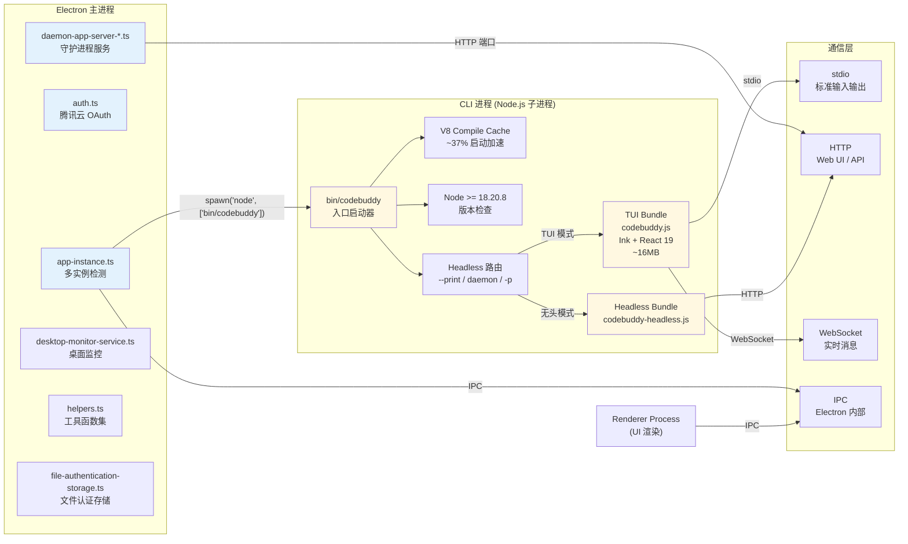

**关键设计决策**：
- **Desktop 与 CLI 版本分离**：WorkBuddy Desktop `v5.2.5` 是 Electron 外壳，CodeBuddy CLI `v2.106.4` 是独立 Node.js 进程，两者版本独立演进
- **双 Bundle 策略**：TUI 模式用 `ink` + `React 19` 提供交互终端，Headless 模式剔除 UI 依赖，显著减小启动开销
- **V8 Compile Cache**：通过 `enableCompileCache()` 将 ~16MB bundle 的加载时间从 ~400ms 降到 ~254ms
- **--version 快速路径**：直接返回版本号，跳过 DI 容器初始化和网络请求

---

## 三、原生模块与资源分层

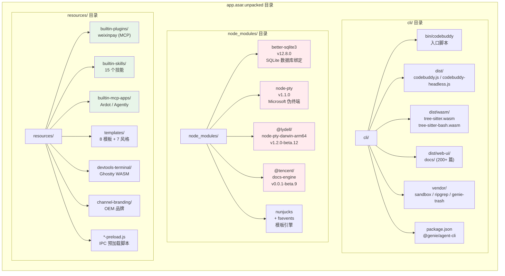

### 为什么需要 `app.asar.unpacked`？

| 模块 | 解包原因 | 关键文件类型 |
|------|---------|------------|
| `better-sqlite3` | `.node` 原生动态库无法从 asar 加载 | `better_sqlite3.node` |
| `node-pty` | `.node` + `spawn-helper` 可执行文件 | `pty.node`, `spawn-helper` |
| `@lydell/node-pty-darwin-arm64` | `.node` + `spawn-helper` | `pty.node`, `spawn-helper` |
| `@tencent/docs-engine` | `.node` + `.dylib` (172MB) + ICU 数据 | `start_server_addon.node`, `libeditor_sdk_ffi.dylib` |
| `fsevents` | `.node` 原生模块 | `fse.node` |
| `cli/` | 可执行脚本入口、WASM、沙箱二进制 | `bin/codebuddy`, `sandbox-cli`, `rg` |
| `resources/` | 内置插件、技能、模板、MCP 应用 | `.mcp.json`, `SKILL.md`, `.tpl` |

---

## 四、安全架构：多层纵深防御

```mermaid
graph TB
    subgraph "第一层：macOS 应用沙箱"
        AS1["App Sandbox<br/>com.workbuddy.workbuddy"]
        AS2["File Provider<br/>com.workbuddy.workbuddy.FileProvider"]
        AS3["Network Extension<br/>com.workbuddy.workbuddy.NetworkExtension"]
        AS4["Sandbox Helper<br/>com.workbuddy.workbuddy.SandboxHelper"]
        AS5["App Group<br/>group.com.workbuddy.workbuddy"]
    end

    subgraph "第二层：CLI 沙箱规则"
        TS1["tsbx_rules.json<br/>Windows 沙箱"]
        TS2["default_action: deny_write<br/>默认拒绝写入"]
        TS3["no_access: .ssh / .gnupg<br/>凭据保护"]
        TS4["inherit_user: npm / pip / rust<br/>工具链白名单"]
        TS5["white_process: Chrome / Edge<br/>浏览器白名单"]
    end

    subgraph "第三层：文件系统安全"
        FS1["genie-trash/<br/>安全删除工具"]
        FS2["shim/<br/>genie-safe-delete.cjs<br/>sitecustomize.py<br/>safe-bin/"]
        FS3["禁止递归删除 Desktop/Downloads<br/>(workbuddy-prompt.tpl 硬编码)"]
    end

    subgraph "第四层：MCP 权限管理"
        MCP1["权限模式：Default<br/>Accept edits / Auto / Bypass"]
        MCP2["工具白名单<br/>子代理权限继承"]
        MCP3["MCP 服务器配置<br/>deny / ask / allow"]
    end

    subgraph "第五层：网络策略"
        NET1["NSAllowsArbitraryLoads<br/>允许任意加载（开发）"]
        NET2["NSAllowsLocalNetworking<br/>允许本地网络"]
        NET3["127.0.0.1 / localhost<br/>允许不安全 HTTP"]
        NET4["TLS 1.0 兼容（内部服务）"]
    end

    AS1 --> AS2
    AS1 --> AS3
    AS1 --> AS4
    AS1 --> AS5

    TS1 --> TS2
    TS2 --> TS3
    TS2 --> TS4
    TS2 --> TS5

    FS1 --> FS2
    FS2 --> FS3

    MCP1 --> MCP2
    MCP2 --> MCP3

    NET1 --> NET2
    NET2 --> NET3
    NET3 --> NET4

    style AS1 fill:#e3f2fd
    style TS1 fill:#e8f5e9
    style FS1 fill:#fff3e0
    style MCP1 fill:#fce4ec
    style NET1 fill:#f3e5f5
```

**沙箱核心规则**（`tsbx_rules.json`）：

```json
{
    "version": 1,
    "default_action": "deny_write",
    "file_rules": [
        { "path": "%USERPROFILE%\\.ssh\\**",     "type": "no_access" },
        { "path": "%USERPROFILE%\\.gnupg\\**",   "type": "no_access" },
        { "path": "%LOCALAPPDATA%\\pip\\**",     "type": "inherit_user" },
        { "path": "%USERPROFILE%\\.rustup\\**",   "type": "inherit_user" },
        { "path": "%USERPROFILE%\\.cargo\\**",   "type": "inherit_user" },
        { "path": "%LOCALAPPDATA%\\go-build\\**", "type": "inherit_user" },
        { "path": "%USERPROFILE%\\.m2\\**",      "type": "inherit_user" },
        { "path": "%USERPROFILE%\\.gradle\\**",  "type": "inherit_user" },
        { "path": "%APPDATA%\\Code\\**",         "type": "inherit_user" },
        { "path": "%APPDATA%\\Trae\\**",         "type": "inherit_user" }
    ],
    "white_process": [
        { "path": "**\\msedge.exe" },
        { "path": "**\\chrome.exe" },
        { "path": "**\\firefox.exe" },
        { "path": "**\\360se.exe" },
        { "path": "**\\QQBrowser.exe" },
        { "path": "**\\SogouExplorer.exe" }
    ]
}
```

---

## 五、MCP 扩展协议架构

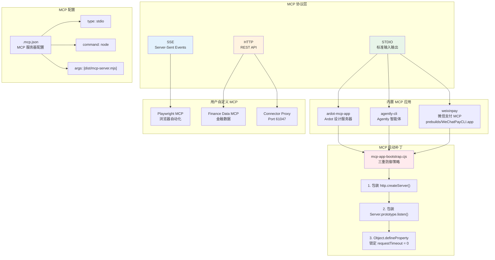

**MCP 启动补丁核心逻辑**（解决 Node.js v18+ 默认 5 分钟超时切断 SSE 流的问题）：

```javascript
// 三重防御策略，在子进程 node --require 阶段注入

// 1. 包装 http.createServer
const originalCreateServer = http.createServer;
http.createServer = function(...args) {
    const server = originalCreateServer.apply(this, args);
    server.requestTimeout = 0;
    server.headersTimeout = 0;
    return server;
};

// 2. 包装 Server.prototype.listen
const originalListen = http.Server.prototype.listen;
http.Server.prototype.listen = function(...args) {
    this.requestTimeout = 0;
    this.headersTimeout = 0;
    return originalListen.apply(this, args);
};

// 3. Object.defineProperty 锁定，阻止后续赋值
Object.defineProperty(http.Server.prototype, 'requestTimeout', {
    get() { return 0; },
    set() {},
    configurable: false
});
Object.defineProperty(http.Server.prototype, 'headersTimeout', {
    get() { return 0; },
    set() {},
    configurable: false
});
```

---

## 六、技能体系（Skills）架构

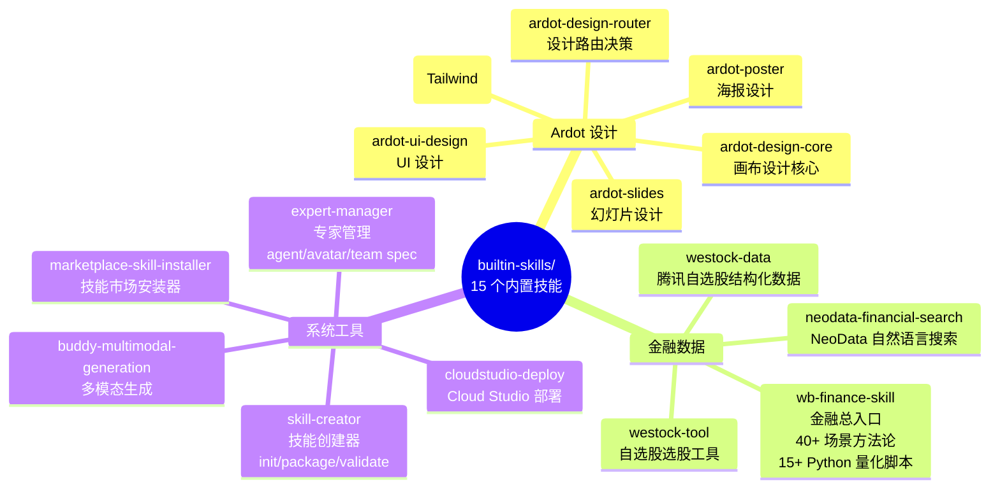

**wb-finance-skill 深度结构**：

```
wb-finance-skill/
├── SKILL.md                          # 技能定义（入口、触发、工作流）
├── references/                       # 40+ 场景方法论文档
│   ├── 个股研究.md
│   ├── 估值分析.md
│   ├── 财报解读.md
│   ├── 交易分析.md
│   ├── 板块轮动.md
│   ├── 宏观分析.md
│   ├── 技术分析.md
│   ├── 量化策略.md
│   ├── 衍生品.md
│   └── 投行建模.md
│   └── ... (30+ 更多)
├── scripts/
│   ├── price-action/                 # 7 个技术分析引擎
│   │   ├── kline_engine.py           # K线分析
│   │   ├── harmonic_patterns.py      # 谐波形态
│   │   ├── wave_theory.py            # 波浪理论
│   │   ├── ichimoku.py               # 一目均衡表
│   │   ├── smc.py                    # Smart Money Concepts
│   │   ├── basic_indicators.py       # 基础指标
│   │   └──缠论.py                    # 缠论分析
│   ├── quant/                        # 6 个量化策略引擎
│   │   ├── pair_trading.py           # 配对交易
│   │   ├── seasonality.py            # 季节性策略
│   │   ├── volatility.py             # 波动率策略
│   │   ├── multi_factor.py           # 多因子策略
│   │   ├── fundamental.py            # 基本面量化
│   │   └── minute_level.py           # 分钟级策略
│   └── ib/                           # 2 个投行工具
│       ├── dcf_excel_validator.py    # DCF Excel 校验
│       └── ib_material_consistency.py # 投行材料数字一致性
└── 数据红线
    ├── 禁止编造数据
    ├── 禁止核心概念混淆
    └── 禁止数据自相矛盾
```

---

## 七、提示词模板与多模式交互

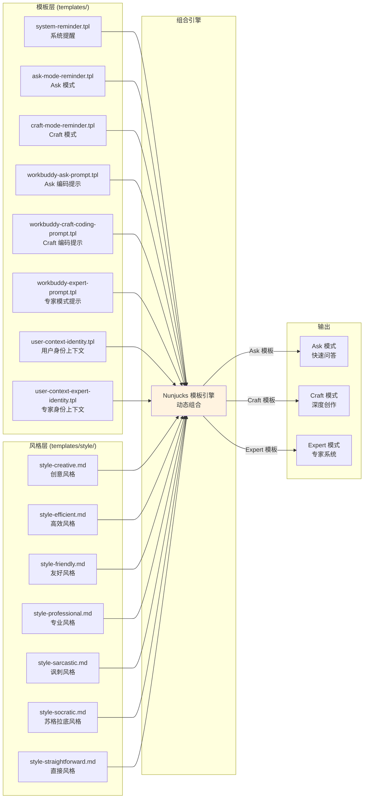

---

## 八、终端与 DevTools 集成

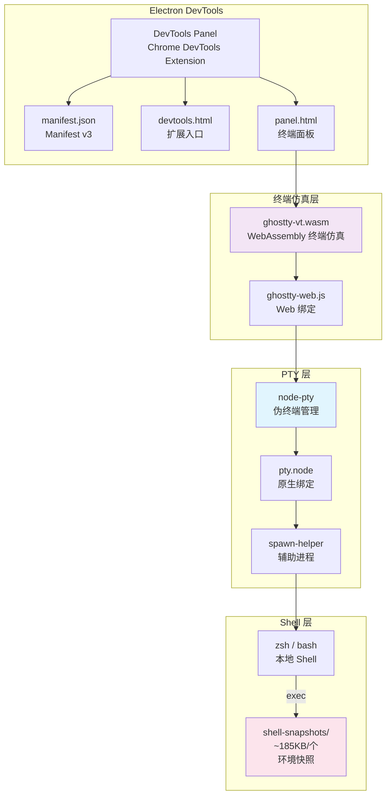

---

## 九、数据流：从用户输入到 AI 输出

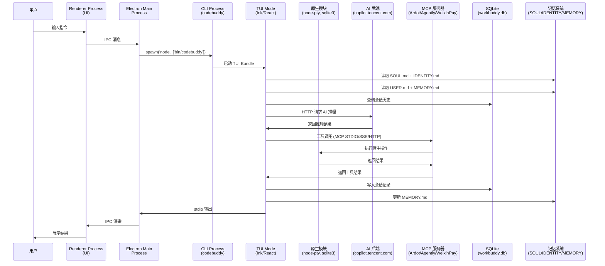

---

## 十、自动化（Automations）架构

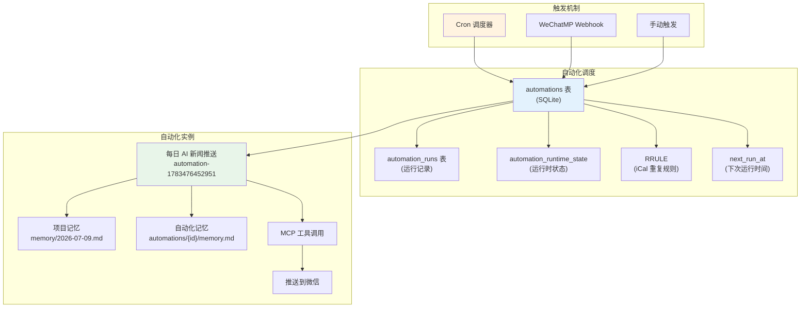

---

## 十一、版本关系与演进

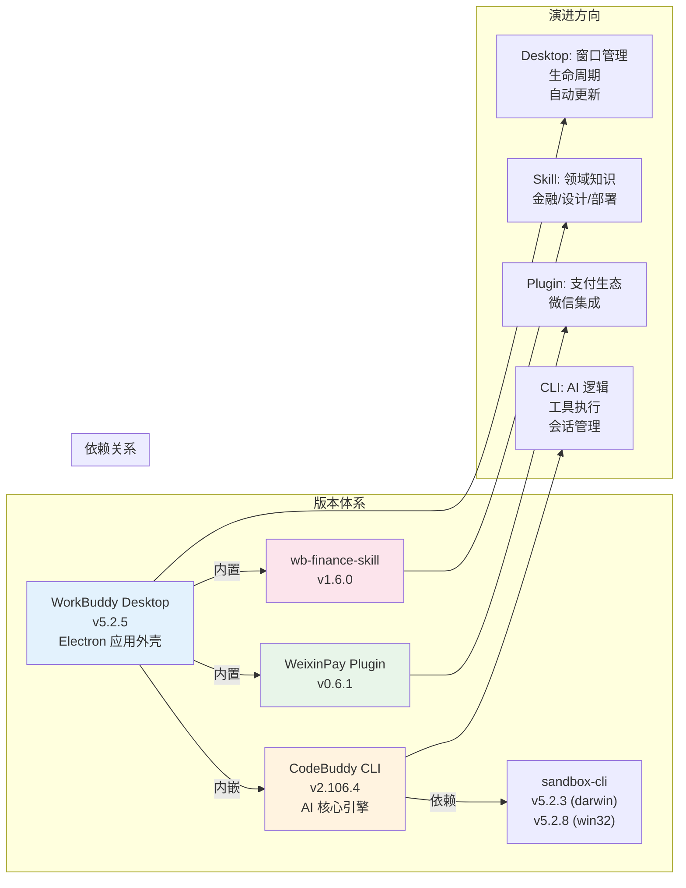

---

## 十二、核心设计决策总结

| 设计决策 | 实现方式 | 原因 |
|---------|---------|------|
| **Electron 壳 + CLI 核** | `cli/` 独立 Node.js 进程 | 版本独立演进、CLI 可独立运行、CI/CD 集成 |
| **双 Bundle 策略** | `codebuddy.js` + `codebuddy-headless.js` | TUI 体积大 (~16MB)，无头模式减小开销 |
| **原生模块 unpacked** | `node_modules/` 单独放置 | `.node`/`.dylib`/可执行文件无法从 asar 加载 |
| **沙箱三层防御** | `tsbx_rules.json` + `sandbox-cli` + macOS App Sandbox | 企业级安全、文件访问白名单、签名验证 |
| **MCP 作为核心扩展协议** | 内置 MCP 应用 + 插件 MCP 服务器 | 标准化外部工具集成，支持 STDIO/SSE/HTTP |
| **Skill 体系高度模块化** | 15 内置 Skill + 可安装 Skill | 领域知识外化、按需加载、社区可扩展 |
| **模板驱动提示词** | `templates/*.tpl` + `style/*.md` | 支持多模式 (Ask/Craft/Expert) 和 7 种语气 |
| **终端 WASM 化** | `ghostty-vt.wasm` + `node-pty` | DevTools 中嵌入高性能终端，无需外部模拟器 |
| **MCP 启动补丁** | `mcp-app-bootstrap.cjs` 三重防御 | 修复 Node.js v18+ SSE 5 分钟超时问题 |
| **项目级记忆隔离** | 每个项目 `.workbuddy/` 目录 | 记忆、自动化、截图按项目隔离 |
| **三层人格架构** | SOUL.md → IDENTITY.md → USER.md | AI 人格外化、可编辑、可版本控制 |

---

## 十三、文件清单索引

### 13.1 CLI 核心文件

| 文件 | 路径 | 说明 |
|------|------|------|
| 入口脚本 | `cli/bin/codebuddy` | Node.js 启动器，版本检查、V8 缓存、headless 路由 |
| 包配置 | `cli/package.json` | `@genie/agent-cli`，100+ 依赖，Cell.js 构建 |
| 主 Bundle | `cli/dist/codebuddy.js` | TUI 模式，Ink + React 19，~16MB |
| 无头 Bundle | `cli/dist/codebuddy-headless.js` | Headless 模式，CI/CD 用 |
| WASM 语法 | `cli/dist/wasm/tree-sitter.wasm` | Tree-sitter 语法解析 |
| 沙箱配置 | `cli/sandbox-config.json` | macOS Bundle ID 与签名 |
| 沙箱规则 | `cli/vendor/sandbox/tsbx_rules.json` | Windows 文件访问规则 |
| 沙箱 CLI | `cli/vendor/sandbox/sandbox-cli` | 原生沙箱可执行 |
| ripgrep | `cli/vendor/ripgrep/arm64-darwin/rg` | 搜索工具 |
| 安全删除 | `cli/vendor/genie-trash/darwin-arm64/*` | 安全删除工具 |

### 13.2 原生模块文件

| 文件 | 路径 | 平台 | 说明 |
|------|------|------|------|
| SQLite 绑定 | `node_modules/better-sqlite3/build/Release/better_sqlite3.node` | 通用 | SQLite 数据库绑定 |
| SQLite 预构建 | `node_modules/better-sqlite3/bin/darwin-arm64-136/better-sqlite3.node` | Darwin ARM64 | 预构建版本 |
| PTY 绑定 | `node_modules/node-pty/prebuilds/darwin-arm64/pty.node` | Darwin ARM64 | 伪终端绑定 |
| PTY 辅助 | `node_modules/node-pty/prebuilds/darwin-arm64/spawn-helper` | Darwin ARM64 | 辅助进程 |
| 文档引擎 | `node_modules/@tencent/docs-engine/dist/index.js` | 通用 | 腾讯文档引擎 |
| 文档 FFI | `node_modules/@tencent/docs-engine/lib/darwin-arm64/libeditor_sdk_ffi.dylib` | Darwin ARM64 | 172MB 文档渲染引擎 |

### 13.3 资源文件

| 文件 | 路径 | 说明 |
|------|------|------|
| 插件市场 | `resources/builtin-plugins/.codebuddy-plugin/marketplace.json` | 内置插件注册表 |
| 微信支付 | `resources/builtin-plugins/weixinpay/.mcp.json` | MCP 服务器配置 |
| 微信原生 | `resources/builtin-plugins/weixinpay/prebuilds/darwin-arm64/WeChatPayCLI.app` | 签名原生应用 |
| 金融技能 | `resources/builtin-skills/wb-finance-skill/SKILL.md` | 金融分析入口 |
| Ardot 技能 | `resources/builtin-skills/ardot-design-core/SKILL.md` | 设计核心 |
| MCP 补丁 | `resources/builtin-mcp-apps/_workbuddy-runtime/mcp-app-bootstrap.cjs` | SSE 超时修复 |
| Ardot MCP | `resources/builtin-mcp-apps/ardot-mcp-app/cli.cjs` | 设计服务器 |
| 终端 WASM | `resources/devtools-terminal/ghostty-vt.wasm` | 终端仿真引擎 |
| 终端扩展 | `resources/devtools-terminal/manifest.json` | Chrome Extension v3 |
| 系统模板 | `resources/templates/workbuddy-prompt.tpl` | 核心提示词模板 |
| 风格指南 | `resources/templates/style/style-professional.md` | Professional 风格 |
| 预加载 | `resources/mcp-app-preload.js` | MCP 进程预加载 |
| 腾讯文档 | `resources/tdoc-preview-preload.js` | 文档预览预加载 |
| 托盘图标 | `resources/trayTemplate.png` | 系统托盘图标 |


- [WorkBuddy](https://www.codebuddy.cn/work/)
