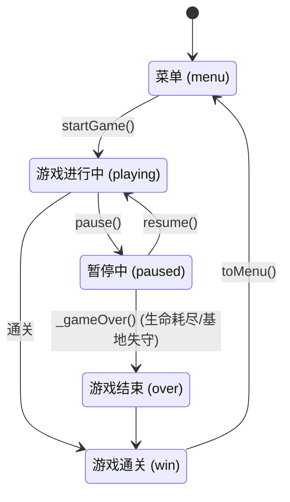
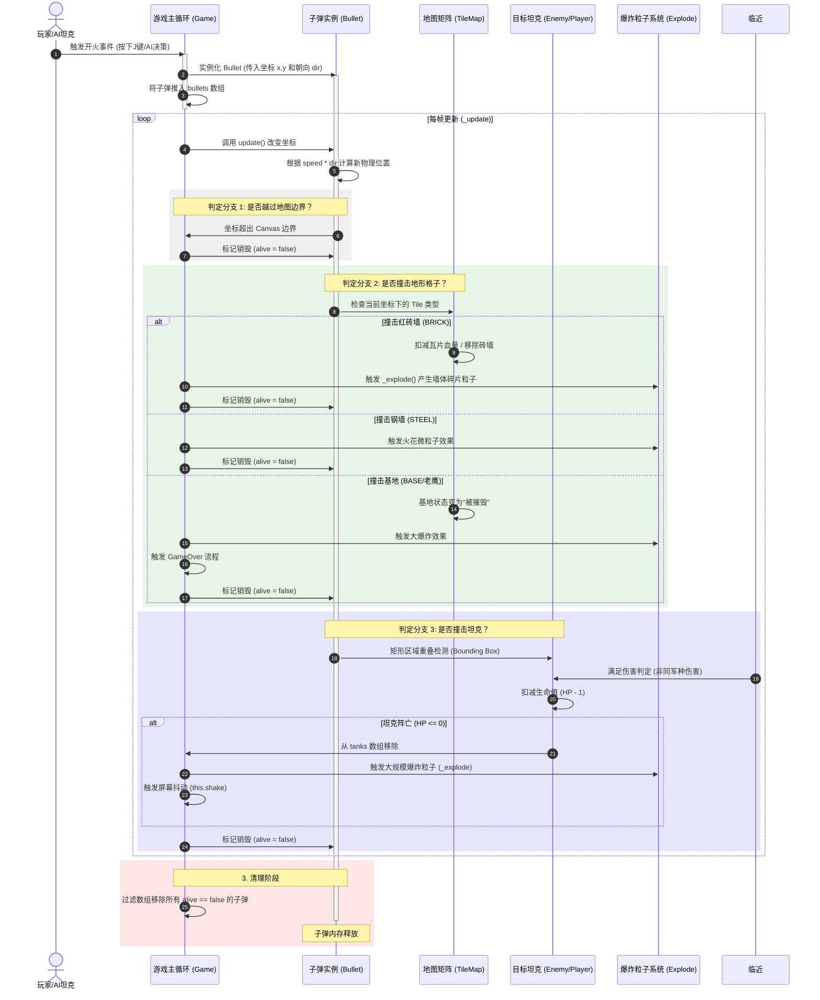
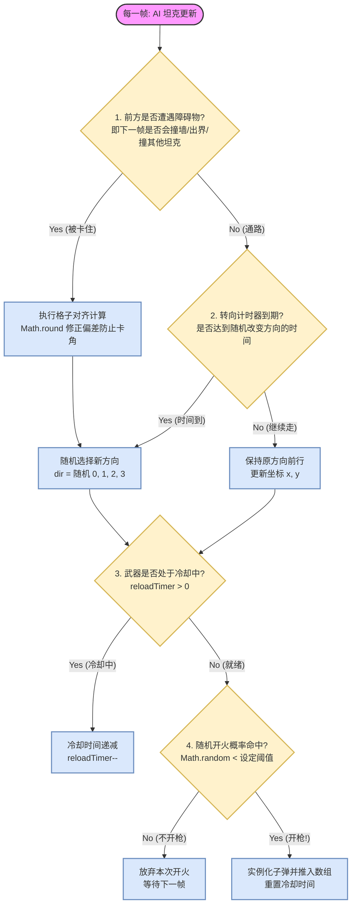

> 本教程基于本工作区已实现的「坦克大战」源码（HTML5 Canvas 复刻红白机 *Battle City*）逐模块讲解。
> 读完后你将能独立从零搭建一个 **60fps、数据驱动、可扩展** 的俯视角坦克射击游戏，并理解其中每个模块的设计取舍。
>
> 配套源码入口：`index.html`，核心逻辑在 `js/` 下 6 个文件，单元测试在 `tests/tank.test.js`。

**GitHub 源代码**：https://github.com/wang-junjian/tank-battle

---

## 1. 项目简介与技术栈

「坦克大战」是一款经典俯视角坦克射击游戏：玩家操控己方坦克在 13×13 的迷宫战场中移动、射击，摧毁敌方坦克并保护己方基地（老鹰）。

**技术栈（零依赖、零构建步骤）：**

| 技术 | 用途 |
| --- | --- |
| HTML5 Canvas 2D | 全部战场渲染 |
| 原生 JavaScript（ES6 class） | 游戏逻辑，不依赖任何框架 |
| Web Audio API | 实时合成音效与 BGM（无音频素材文件） |
| localStorage | 最高分与配置持久化 |
| node:test | 引擎逻辑的单元测试（无需浏览器） |

**为什么选这套栈：** 无打包、无依赖，双击即可运行；逻辑与渲染分离后，核心玩法甚至能在 Node 里跑测试。这对"快速做出可玩原型"极其友好。

---

## 2. 运行、调试与测试

### 2.1 本地运行

直接用浏览器打开 `index.html` 也能玩，但 `file://` 下部分浏览器会限制 `localStorage` 与 `Web Audio` 自动播放。**推荐起一个静态服务器**：

```bash
# 任意一种静态服务器均可
python3 -m http.server 8000
# 或
npx serve .
```

然后访问 `http://localhost:8000`。

### 2.2 调试技巧

- 游戏所有状态挂在 `window.TB` 与 `game` 实例上，控制台可直接输入 `game.state`、`game.score` 查看/修改。
- 想快速验证某关：控制台执行 `game.startLevel(2)` 直接跳关。
- 想强制刷道具：修改 `TB.CONFIG.ITEM_DROP_CHANCE = 1`。

### 2.3 单元测试

`package.json` 里已配好脚本：

```bash
npm test          # 等价于 node --test tests/
```

测试覆盖配置校验、实体运动、碰撞、状态机、计分、道具等关键逻辑，用轻量 DOM 桩在 Node 中真实加载 `js/*.js`（详见[步骤 14](#步骤-14单元测试)）。

---

## 3. 项目结构与模块职责

```
index.html           入口：Canvas + UI 容器 + 弹窗 + HUD + 触屏控制
css/styles.css       UI 样式（深色军事风、响应式、扫描线）
js/config.js         全局配置：地形 / 敌人 / 道具 / 火力 / 按键 / 关卡数据 + 工具函数
js/audio.js         AudioManager：Web Audio 合成音效与 BGM
js/input.js         Input：键盘 + 触屏虚拟键 + 按键重映射
js/entities.js      Tank / PlayerTank / EnemyTank / Bullet / Item 及其绘制
js/game.js          Game：状态机 / 主循环 / 碰撞 / 渲染 / 粒子
js/main.js          UI 与菜单交互、事件总线、设置面板
tests/tank.test.js  node:test 单元测试（DOM 桩）
```

**模块加载顺序（即 `index.html` 末尾 `<script>` 顺序，不可乱）：**

```
config.js → audio.js → input.js → entities.js → game.js → main.js
```

每个文件第一句都是 `window.TB = window.TB || {};`，通过全局命名空间 `TB` 互相挂载，无打包工具也能协作（见下一节）。

---

## 4. 三大核心思想

### 4.1 全局命名空间模式（`window.TB`）

没有打包工具时，让多个 `<script>` 共享状态的最简方式就是挂一个全局对象：

```js
// 每个文件开头
window.TB = window.TB || {};

// 各文件往 TB 上挂东西
TB.CONFIG = { ... };        // config.js
TB.AudioManager = class {}  // audio.js
TB.Game = class {}          // game.js
```

好处是模块解耦、可被测试桩直接 `require`；代价是全局污染，但对这种体量的游戏完全可控。

### 4.2 状态机驱动

整个游戏用 `Game.state` 一个字段统管生命周期：

```
    startGame()
   ┌─────────┐  ────────────►  ┌──────────┐
   │  menu   │                 │ playing  │ ◄──┐
   └─────────┘                 └────┬─────┘    │
        ▲  toMenu()                 │  pause() │
        │                           ▼          │ resume()
   ┌─────────┐                 ┌──────────┐    │
   │  win    │◄─ 通关           │ paused   │───┘
   └─────────┘                 └────┬─────┘
        ▲                           │ _gameOver()
        |                           ▼
   ┌─────────┐                 ┌──────────┐
   │  over   │◄────────────────│  (结束)   │
   └─────────┘  生命耗尽/基地失守 └──────────┘
```



`update()` 只在 `state === 'playing'` 时执行，其余状态只渲染不更新——这是"暂停不出 bug"的关键。

### 4.3 子弹碰撞与生命周期时序图（Sequence Diagram）

在《坦克大战》中，子弹是速度最快、触发碰撞判定最频繁的实体（Entity）。它发射后，每一帧都需要在“打中坦克”、“打碎砖墙”、“被钢墙弹开”、“子弹互撞消灭”以及“出界”之间做复杂的分支判断。



#### 💡 子弹系统核心设计拆解

1. **轻量化设计**：子弹本身不处理复杂的业务逻辑，它只负责“移动”和提供“碰撞体积”。所有的裁判权（扣血、爆破、生成粒子）全部由 `Game` 这个大管家在主循环中统一调度。
2. **高效清理机制**：代码没有在子弹撞墙的瞬间立刻执行 `delete`，而是先标记 `alive = false`。在每帧的最后，通过一个高效的数组过滤（类似 `bullets.filter(b => b.alive)`）一次性把死掉的子弹清理掉，这极大地避免了频繁操作数组导致的内存碎片的卡顿。

### 4.4 敌军 AI 行为决策大脑

在《坦克大战》中，敌方坦克的自动移动、转向和开火并非随机乱走，而是有一套清晰的**时钟驱动决策树**在控制。

由于游戏采用的是 Unix 哲学式的“数据驱动与状态机”逻辑，AI 坦克在每一帧的更新中，都会通过一系列条件判定分支来决定是“继续前行”、“撞墙转向”还是“开火”。



#### 💡 敌军 AI 核心设计拆解

1. **碰撞驱动的被动转向（Reactive Turning）**
当 AI 坦克检测到前方有红砖墙、钢墙或边界时（`CheckBlocked`），为了避免死路死循环，它会立刻触发转向。在转向前，代码会贴心地计算一次**格子对齐（`CalcAlign`）**，确保坦克处于 $40 \times 40$ 瓦片的整数倍网格上，这样它旋转 $90^\circ$ 后绝对能完美驶入新的狭窄通道，而不会因为像素偏差卡在墙角。
2. **时间/概率双重开火限制（Fire Governance）**
如果 AI 坦克无限开火，游戏会变得不可玩。因此决策树加了双重保险：首先必须过了**冷却时间（`reloadTimer`）**；其次，就算冷却好了，每一帧也只有极低的概率（例如 `Math.random() < 0.02`）真正扣动扳机。这种设计给玩家留出了足够的反应和躲避时间。

这个决策树配合游戏本身高效的 Canvas 渲染，保证了即使同屏出现十多辆敌军坦克，依然可以流畅运行且各司其职。

### 4.4 数据驱动

**一切可配置的东西都放进 `TB.CONFIG` 与 `TB.LEVELS`**：地形种类、敌人属性、道具效果、关卡地图、刷新点、按键映射。加一关只需往 `LEVELS` 数组里追加一段字符串地图，无需改任何逻辑代码（见[扩展指南](#7-扩展指南)）。

---

## 5. 分步开发实战

下面按"从空仓库到可玩"的顺序，逐步给出关键实现与对应文件。**代码块均可直接对照仓库同名文件阅读。**

---

### 步骤 1：HTML 骨架与 Canvas

战场只用一个 `<canvas>`，其余 UI（菜单、HUD、弹窗）都是普通 DOM 覆盖在 Canvas 之上。这样 UI 用 CSS 美化、Canvas 只管游戏世界，职责清晰。

```html
<canvas id="game" width="520" height="520"></canvas>

<!-- 信息栏（DOM，非 Canvas 绘制） -->
<aside class="hud">
  <div>关卡 <span id="hud-level">01</span></div>
  <div>得分 <span id="hud-score">000000</span></div>
  <div>生命 <span id="hud-lives"></span></div>
</aside>

<!-- 主菜单弹窗 -->
<div class="modal show" id="menu">
  <button id="btn-start">开始游戏</button>
</div>
```

> **要点**：战场尺寸 `520 = 13 格 × 40 像素`（见 `TB.CONFIG`）。这个 `FIELD` 是逻辑坐标，渲染时再乘 DPR 适配高清屏（见步骤 9）。
>
> **易错点**：不要把 HUD/菜单画进 Canvas。DOM 弹窗能自动获得可访问性、焦点管理与响应式布局，远比手绘省事。

---

### 步骤 2：配置系统（数据驱动）

所有"规则"集中在 `js/config.js`。先定义地形枚举与基础常量：

```js
TB.CONFIG = {
  GRID: 13, CELL: 40,
  get FIELD() { return this.GRID * this.CELL; }, // 520
  PLAYER: { speed: 96, lives: 3, spawnCell: { r: 12, c: 4 } },
  BULLET: { speed: 300, size: 8 },
  COMBO_WINDOW: 2000,
};

// 地形类型：用数字枚举，便于存进二维数组
TB.TILE = { EMPTY: 0, BRICK: 1, STEEL: 2, WATER: 3, GRASS: 4, ICE: 5, BASE: 6 };

// 哪些地形阻挡坦克移动（注意：水是"挡坦克不挡子弹"，草是"仅视觉"）
TB.solidForTank = (t) =>
  t === TB.TILE.BRICK || t === TB.TILE.STEEL || t === TB.TILE.WATER || t === TB.TILE.BASE;
```

**敌人 / 道具 / 火力等级** 也都用配置表描述，方便平衡性调参：

```js
TB.ENEMY_TYPES = {
  basic: { name: '普通', score: 100, speed: 70,  hp: 1, shoot: 1600, chase: 0 },
  fast:  { name: '快速', score: 200, speed: 122, hp: 1, shoot: 2000, chase: 0 },
  armor: { name: '装甲', score: 300, speed: 52,  hp: 3, shoot: 1400, chase: 0 },
  smart: { name: '智能', score: 400, speed: 88,  hp: 1, shoot: 1100, chase: 1 },
};

// 火力等级：拾取星形累加，影响"并发子弹数 / 速度 / 是否破钢"
TB.POWER_LEVELS = [
  { maxBullets: 1, bulletSpeed: 300, breakSteel: false },
  { maxBullets: 1, bulletSpeed: 360, breakSteel: false },
  { maxBullets: 2, bulletSpeed: 360, breakSteel: false },
  { maxBullets: 2, bulletSpeed: 420, breakSteel: true  },
];
```

**关卡用"字符地图"描述**，可读性极高（`B`=砖、`S`=钢、`W`=水、`G`=草、`I`=冰、`E`=基地、`'`=空）：

```js
TB.LEVELS = [{
  name: 'STAGE 1',
  enemyTotal: 12, maxOnScreen: 4, spawnInterval: 2500, speedMul: 1.0,
  weights: { basic: 0.7, fast: 0.2, armor: 0.1, smart: 0 },
  map: [
    ".............",
    "..B.B...B.B..",
    // ... 共 13 行，每行 13 字符
    ".....BEB.....", // 基地 E 固定在底部中央
  ],
}];
```

配套两个工具函数，保证"手抖写错地图也不崩"：

```js
// 把字符地图规范化为 13×13 数字网格（自动补空 / 越界截断 / 未知字符降级）
TB.normalizeMap = function (rows) {
  const G = TB.CONFIG.GRID, grid = [];
  for (let r = 0; r < G; r++) {
    const line = rows[r] || '';
    const row = [];
    for (let c = 0; c < G; c++) {
      const ch = line[c] || '.';
      row.push(TB.MAP_CHARS[ch] !== undefined ? TB.MAP_CHARS[ch] : TB.TILE.EMPTY);
    }
    grid.push(row);
  }
  return grid;
};

// 按权重随机抽取敌人类型（返回合法键；权重为 0 的永远抽不到）
TB.pickEnemyType = function (weights) {
  const r = Math.random();
  let acc = 0;
  for (const k in weights) { acc += weights[k]; if (r <= acc) return k; }
  return 'basic';
};
```

> **要点**：地图、`grid[r][c]` 存的是数字枚举（地形类型），渲染和碰撞都查这张表，逻辑统一。
>
> **易错点**：`pickEnemyType` 用累加区间法，必须保证权重和 ≤ 1（否则可能抽到 `undefined`）。测试里专门验证了 `smart` 权重为 0 时永不出现。

---

### 步骤 3：实体系统（坦克 / 子弹 / 道具）

`js/entities.js` 定义所有"会动 / 会画"的对象。先写一个 `Tank` 基类（玩家与敌人共用绘制与属性）：

```js
TB.DIRS = [ {dx:0,dy:-1}, {dx:1,dy:0}, {dx:0,dy:1}, {dx:-1,dy:0} ]; // 0上 1右 2下 3左

TB.Tank = class {
  constructor(x, y, dir, color, team) {
    this.x = x; this.y = y; this.size = 28;
    this.dir = dir; this.color = color; this.team = team;
    this.alive = true; this.moving = false; this.shield = false;
  }
  get cx() { return this.x + this.size / 2; } // 中心点，碰撞常用
  get cy() { return this.y + this.size / 2; }
  draw(ctx) { /* 画车身 + 履带 + 炮塔 + 炮管 + 护盾环 */ }
};
```

玩家坦克在 `update()` 里读取输入、换算方向、调用引擎的 `resolveMove` 移动、按冷却开火：

```js
TB.PlayerTank = class extends TB.Tank {
  constructor(x, y) {
    super(x, y, 0, '#e8c170', 'player');
    this.speed = TB.CONFIG.PLAYER.speed;
    this.powerLevel = 0; this.fireCd = 0; this.invincibleUntil = 0;
  }
  update(dt, input, world) {
    if (!this.alive) return;
    // 无敌闪烁 / 护盾状态
    this.shield = world.now < world.playerShieldUntil;
    // 方向由按键决定
    if (input.dir.up) this.dir = 0;
    else if (input.dir.down) this.dir = 2;
    else if (input.dir.left) this.dir = 3;
    else if (input.dir.right) this.dir = 1;
    const d = TB.DIRS[this.dir];
    world.resolveMove(this, d.dx * this.speed * dt, d.dy * this.speed * dt, dt);

    this.fireCd -= dt * 1000;
    if (input.fire && this.fireCd <= 0) {
      const max = TB.POWER_LEVELS[this.powerLevel].maxBullets;
      if (world.countBullets('player') < max) { world.spawnBullet(this); this.fireCd = 280; }
    }
  }
};
```

敌人坦克加了一个极简 AI：定时换方向（撞墙就立刻换），`chase` 类型会朝玩家走：

```js
TB.EnemyTank = class extends TB.Tank {
  constructor(x, y, typeKey) {
    const def = TB.ENEMY_TYPES[typeKey];
    super(x, y, 2, def.color, 'enemy');
    this.speed = def.speed; this.type = def; this.hp = def.hp;
    this.aiTimer = Math.random() * 600; this.spawnAnim = 600; // 出生动画，期间不可被击中
  }
  update(dt, world, player) {
    if (!this.alive) return;
    if (this.spawnAnim > 0) { this.spawnAnim -= dt * 1000; return; }
    if (world.now < world.enemyFrozenUntil) return; // 被"定时器"道具冻结
    this.aiTimer -= dt * 1000;
    if (this.aiTimer <= 0) {
      this.aiTimer = 500 + Math.random() * 900;
      if (this.type.chase && player?.alive && Math.random() < 0.75) {
        const dx = player.cx - this.cx, dy = player.cy - this.cy;
        this.dir = Math.abs(dx) > Math.abs(dy) ? (dx > 0 ? 1 : 3) : (dy > 0 ? 2 : 0);
      } else this.dir = Math.floor(Math.random() * 4); // 随机游走
    }
    const sp = this.type.speed * world.level.speedMul;
    const bx = this.x, by = this.y;
    world.resolveMove(this, TB.DIRS[this.dir].dx * sp * dt, TB.DIRS[this.dir].dy * sp * dt, dt);
    if (Math.abs(this.x - bx) < 0.05 && Math.abs(this.y - by) < 0.05) this.aiTimer = 0; // 撞墙→下一帧换方向
  }
};
```

子弹很简单：直线匀速，方向由发射者决定：

```js
TB.Bullet = class {
  constructor(x, y, dir, owner, opts) {
    this.x = x; this.y = y; this.size = TB.CONFIG.BULLET.size;
    this.dir = dir; this.owner = owner; // 'player' | 'enemy'
    this.speed = opts.speed || TB.CONFIG.BULLET.speed;
    this.power = opts.power || 1; // 2 = 可破钢墙
    this.alive = true;
  }
  update(dt) { const d = TB.DIRS[this.dir]; this.x += d.dx * this.speed * dt; this.y += d.dy * this.speed * dt; }
  draw(ctx) { /* 发光小方块 */ }
};
```

道具是"掉落物"，本身不动，被玩家碰到即触发效果（实现在步骤 8）：

```js
TB.Item = class {
  constructor(typeKey, r, c) {
    this.typeKey = typeKey; this.size = 26; this.alive = true;
    this.x = c * TB.CONFIG.CELL + (TB.CONFIG.CELL - 26) / 2;
    this.y = r * TB.CONFIG.CELL + (TB.CONFIG.CELL - 26) / 2;
  }
  draw(ctx) { /* 矢量手绘图标（不用 emoji，跨平台稳定） */ }
};
```

> **要点**：`cx/cy` getter 把"左上角坐标 + size"封装成中心点，碰撞与绘制都受益。
>
> **易错点**：实体只负责"自己的状态与绘制"，**不**直接操作别的实体或全局状态。移动、碰撞、击杀等"跨对象"逻辑全部交给 `Game`（步骤 5/6/7），避免逻辑散落。

---

### 步骤 4：引擎核心（主循环 + 状态机）

`js/game.js` 的 `Game` 类是大脑。先看构造函数与主循环——**这是整个游戏的心脏**：

```js
class Game {
  constructor(canvas, audio, input) {
    this.canvas = canvas; this.ctx = canvas.getContext('2d');
    this.audio = audio; this.input = input;
    this.state = 'menu';           // 状态机初始
    this.grid = []; this.player = null; this.enemies = []; this.bullets = []; this.items = []; this.particles = [];
    this.score = 0; this.lives = TB.CONFIG.PLAYER.lives; this.levelIndex = 0;
    this.now = performance.now(); this.lastTs = this.now;
    this._loadStorage(); this.setupCanvas();
    window.addEventListener('resize', () => this.setupCanvas());
    this.prepareLevel(0);
    this._loop = this._loop.bind(this);
    requestAnimationFrame(this._loop);
  }

  // 固定驱动入口：用 dt（秒）做时间步长，保证不同帧率手感一致
  _loop(ts) {
    const dt = Math.min(0.05, (ts - this.lastTs) / 1000) || 0; // 卡顿/切后台时钳制到 50ms
    this.lastTs = ts; this.now = ts;
    if (this.state === 'playing') this.update(dt);
    this.render();
    this._emitHud();
    requestAnimationFrame(this._loop);
  }

  update(dt) {
    if (this.player?.alive) this.player.update(dt, this.input, this);
    if (this.toSpawn > 0) { /* 敌人生成，见步骤 7 */ }
    for (const e of this.enemies) e.update(dt, this, this.player);
    for (const b of this.bullets) if (b.alive) this._updateBullet(b, dt);
    for (const it of this.items) { /* 道具拾取判定 */ }
    for (const p of this.particles) { p.x += p.vx*dt; p.y += p.vy*dt; p.life -= dt; }
    // 清理死亡对象
    this.bullets = this.bullets.filter(b => b.alive);
    this.enemies = this.enemies.filter(e => e.alive);
    this.items = this.items.filter(i => i.alive);
    // 过关判定：剩余待生成 + 场上存活 都为 0
    const remaining = this.toSpawn + this.enemies.filter(e => e.alive).length;
    if (remaining === 0 && this.player?.alive) this._levelClear();
  }
}
```

**状态切换方法**（`startGame / pause / resume / toMenu / _gameOver / _levelClear`）只改 `this.state`，配合 `state==='playing'` 才更新的规则，整套状态机就跑起来了。

> **要点**：**dt 时间步长**是动作游戏的生命线。所有位移都写成 `speed * dt`（像素/秒 × 秒），这样 30fps 与 144fps 下坦克速度一致。`dt` 上限 0.05 防止切到后台再回来时"瞬移穿墙"。
>
> **易错点**：主循环一定要在 `constructor` 末尾用 `requestAnimationFrame(this._loop)` 启动一次；并把 `this._loop.bind(this)` 固定引用，否则 `this` 会丢失。

---

### 步骤 5：移动与碰撞（网格对齐）

碰撞分两层：**地形格**（查 `grid`）与 **AABB 矩形重叠**（坦克/子弹互撞）。先看坐标↔格子的换算：

```js
// 像素坐标 → 地形类型（-1 表示越界）
tileAt(px, py) {
  const c = Math.floor(px / this.C.CELL), r = Math.floor(py / this.C.CELL);
  if (r < 0 || c < 0 || r >= this.C.GRID || c >= this.C.GRID) return -1;
  return this.grid[r][c];
}

// 一个 size×size 的盒子是否压到"阻挡坦克"的地形或越界
boxHitsSolid(x, y, sz) {
  if (x < 0 || y < 0 || x + sz > this.FIELD || y + sz > this.FIELD) return true; // 越界即阻挡
  const c0 = Math.floor(x / this.C.CELL), c1 = Math.floor((x + sz - 0.001) / this.C.CELL);
  const r0 = Math.floor(y / this.C.CELL), r1 = Math.floor((y + sz - 0.001) / this.C.CELL);
  for (let r = r0; r <= r1; r++)
    for (let c = c0; c <= c1; c++)
      if (TB.solidForTank(this.grid[r][c])) return true;
  return false;
}
```

移动用 **"先试后提交 + 沿格对齐"** 策略，这是坦克大战手感的关键：

```js
resolveMove(ent, dx, dy, dt) {
  const sz = ent.size, C = this.C.CELL;
  if (dx !== 0) {
    const nx = ent.x + dx;
    if (!this.boxHitsSolid(nx, ent.y, sz)) ent.x = nx;          // 横向能走才走
    // 沿格对齐：让坦克自然"吸"进通道，避免卡在墙缝
    const targetY = Math.round((ent.y - (C - sz) / 2) / C) * C + (C - sz) / 2;
    if (!this.boxHitsSolid(ent.x, targetY, sz)) {
      const diff = targetY - ent.y;
      ent.y += Math.sign(diff) * Math.min(Math.abs(diff), ent.speed * dt);
    }
  }
  // dy 方向同理……
  ent.x = clamp(ent.x, 0, this.FIELD - sz); // 最后一道安全网
  ent.y = clamp(ent.y, 0, this.FIELD - sz);
}
```

> **要点**：每个轴"先移动、再对齐另一轴"，使得坦克始终能被吸附到格线，过通道时顺滑不打结。
>
> **易错点**：
> 1. `boxHitsSolid` 用 `x + sz - 0.001` 而非 `x + sz`，避免盒子恰好贴边时误判跨格。
> 2. 最后用 `clamp` 兜底，即使前面的逻辑有疏漏，坦克也绝不越出 `0 ~ FIELD-size`。测试里专门验证了"置于界外 9999 会被拉回 492"。

---

### 步骤 6：子弹与碰撞链

子弹每帧 `update` 后，由 `_updateBullet` 统一处理"它撞到了什么"。顺序是：**边界 → 地形 → 子弹互撞 → 命中坦克 → 基地**，命中即 `alive=false` 并 `return`：

```js
_updateBullet(b, dt) {
  b.update(dt);
  if (b.x < -10 || b.y < -10 || b.x > this.FIELD + 10 || b.y > this.FIELD + 10) { b.alive = false; return; }

  const cell = this.tileAt(b.cx, b.cy);
  if (cell === TB.TILE.BRICK) {                       // 砖墙：任何子弹都能打掉
    this._setCellAt(b.cx, b.cy, TB.TILE.EMPTY);
    this._explode(b.cx, b.cy, '#b5562f', false); this.audio.play('hit'); b.alive = false; return;
  }
  if (cell === TB.TILE.STEEL) {                      // 钢墙：仅最高火力(power≥2)可破
    if (b.owner === 'player' && b.power >= 2) this._setCellAt(b.cx, b.cy, TB.TILE.EMPTY);
    this._explode(b.cx, b.cy, '#9aa0ab', false); b.alive = false; return;
  }
  if (cell === TB.TILE.BASE) {                       // 基地：敌方子弹击中→游戏结束
    if (b.owner === 'enemy') this._baseDestroyed();
    b.alive = false; return;
  }

  // 子弹互撞（敌我同归于尽）
  for (const o of this.bullets) {
    if (o === b || !o.alive || o.owner === b.owner) continue;
    if (rectsOverlap(b.x, b.y, b.size, b.size, o.x, o.y, o.size, o.size)) {
      o.alive = false; b.alive = false;
      this._explode((b.cx + o.cx) / 2, (b.cy + o.cy) / 2, '#ffd27a', false); return;
    }
  }

  // 命中坦克（AABB 矩形重叠判定）
  if (b.owner === 'player') {
    for (const e of this.enemies) {
      if (!e.alive || e.spawnAnim > 0) continue;
      if (rectsOverlap(b.x, b.y, b.size, b.size, e.x + 2, e.y + 2, e.size - 4, e.size - 4)) {
        e.hp -= 1; b.alive = false;
        if (e.hp <= 0) this._enemyKilled(e);
        else { this._explode(b.cx, b.cy, '#ffd27a', false); this.audio.play('hit'); }
        return;
      }
    }
  } else { // 敌方子弹打玩家
    const p = this.player;
    if (p?.alive && rectsOverlap(b.x, b.y, b.size, b.size, p.x + 2, p.y + 2, p.size - 4, p.size - 4)) {
      b.alive = false; this._playerHit();
    }
  }
}
```

子弹由 `spawnBullet` 统一生成，火力等级决定"速度与是否破钢"：

```js
spawnBullet(tank) {
  const d = TB.DIRS[tank.dir];
  const bs = this.C.BULLET.size;
  const mx = tank.cx + d.dx * (tank.size / 2);   // 从炮口生成，避免"子弹起点在坦克体内"
  const my = tank.cy + d.dy * (tank.size / 2);
  let speed, power;
  if (tank.team === 'player') {
    const pl = TB.POWER_LEVELS[tank.powerLevel];
    speed = pl.bulletSpeed; power = pl.breakSteel ? 2 : 1;
  } else { speed = 260; power = 1; }
  this.bullets.push(new TB.Bullet(mx - bs / 2, my - bs / 2, tank.dir, tank.team, { speed, power }));
  if (tank.team === 'player') this.audio.play('shoot');
}
```

> **要点**：碰撞统一在 `Game` 层处理，实体保持"纯数据 + 自绘"。坦克命中判定把玩家/敌人盒子各内缩 2px，避免"擦边也算命中"的廉价死法。
>
> **易错点**：子弹从"炮口"而非坦克中心生成，否则会出现"子弹卡在坦克身体里还没飞出去就被自己地形判定吃掉"。

---

### 步骤 7：敌人生成与 AI

敌人分批从地图顶部固定刷新点出现，受"同屏上限"节流：

```js
_spawnEnemy() {
  const cells = TB.SPAWN_CELLS; // [{r:0,c:0},{r:0,c:6},{r:0,c:12}]
  let chosen = null;
  for (const cell of cells) {                  // 找一个没被占用的刷新点
    const x = cell.c * this.C.CELL + (this.C.CELL - 28) / 2;
    const y = cell.r * this.C.CELL + (this.C.CELL - 28) / 2;
    const occupied = this.enemies.some(e => e.alive && Math.abs(e.x - x) < this.C.CELL && Math.abs(e.y - y) < this.C.CELL);
    if (!occupied) { chosen = { x, y }; break; }
  }
  if (!chosen) return;                          // 全被占→本帧不生成
  const typeKey = TB.pickEnemyType(this.level.weights);
  this.enemies.push(new TB.EnemyTank(chosen.x, chosen.y, typeKey));
  this.toSpawn--;
  this._explode(chosen.x + 14, chosen.y + 14, '#f0a83c', false, 8);
  this.audio.play('spawn');
}
```

生成节奏在主循环的 `update` 里按间隔 + 上限驱动：

```js
if (this.toSpawn > 0) {
  this.spawnTimer -= dt * 1000;
  const active = this.enemies.filter(e => e.alive).length;
  if (this.spawnTimer <= 0 && active < this.level.maxOnScreen) {
    this._spawnEnemy();
    this.spawnTimer = this.level.spawnInterval;
  }
}
```

> **要点**：`toSpawn`（待生成总数）+ 场上存活数 = 剩余敌人，归零即过关。刷新点被占用时跳过，避免"坦克叠罗汉"。
>
> **易错点**：AI 撞墙后把 `aiTimer` 置 0，下一帧立刻重选方向——否则坦克会"贴墙抖动一整秒"。

---

### 步骤 8：道具系统

敌人被击毁后有概率掉落道具（`_enemyKilled` 里）；玩家碰到道具触发 `_applyItem`。六种效果：

```js
_applyItem(typeKey) {
  const p = this.player;
  this.audio.play('powerup');
  switch (typeKey) {
    case 'star':   p.powerLevel = Math.min(3, p.powerLevel + 1); break;            // 火力升级，封顶 3
    case 'helmet': this.playerShieldUntil = this.now + this.C.ITEM_DURATION.helmet; break; // 无敌护盾
    case 'shovel': this._activateShovel(); break;                                  // 基地砖墙临时变钢
    case 'timer':  this.enemyFrozenUntil = this.now + this.C.ITEM_DURATION.timer; break;  // 冻结敌军
    case 'bomb':                                                                   // 手雷：清场并按分计奖
      for (const e of this.enemies)
        if (e.alive && e.spawnAnim <= 0) { e.alive = false; this.score += e.type.score; this._explode(e.cx, e.cy, e.type.color, true); }
      break;
    case 'tank':   this.lives = Math.min(5, this.lives + 1); break;              // 奖励生命，封顶 5
  }
}
```

`_activateShovel` 把基地周围的砖墙临时换成钢墙，超时自动还原：

```js
_activateShovel() {
  if (!this.basePos) return;
  this.shovelUntil = this.now + this.C.ITEM_DURATION.shovel;
  this._shovelCells = [];
  const offs = [{dr:-1,dc:-1},{dr:-1,dc:0},{dr:-1,dc:1},{dr:0,dc:-1},{dr:0,dc:1}];
  for (const o of offs) {
    const r = this.basePos.r + o.dr, c = this.basePos.c + o.dc;
    if (r < 0 || c < 0 || r >= this.C.GRID || c >= this.C.GRID) continue;
    this._shovelCells.push({ r, c });
    this.grid[r][c] = TB.TILE.STEEL;
  }
}
_revertShovel() {                                         // 在 update 里计时到点时调用
  for (const { r, c } of this._shovelCells) this.grid[r][c] = TB.TILE.BRICK;
  this._shovelCells = [];
}
```

> **要点**：所有限时效果都用 `xxxUntil = now + duration` 的"过期时间戳"表示，在 `update` 里检查 `now > xxxUntil` 即还原，逻辑干净、无需定时器。
>
> **易错点**：记得记录被修改的格子（`_shovelCells`），还原时只改这些格，否则可能把玩家刚打掉的墙误恢复成砖。

---

### 步骤 9：渲染与特效（粒子 / 震屏 / 草丛遮蔽）

`render()` 的**绘制顺序**决定了视觉效果层级：

```
1. 背景 + 细网格线
2. 地形（砖/钢/水/冰/基地）—— 注意：草先不画
3. 道具 → 子弹 → 敌人 → 玩家
4. 草丛（最后画，盖在坦克之上 → 实现"草里隐身"）
5. 粒子
6. 冻结蓝罩 / 屏幕震动
```

`_drawTile` 用纯 Canvas 图元手绘每种地形（无图片素材）：

```js
_drawTile(ctx, r, c, t) {
  const C = this.C.CELL, x = c * C, y = r * C;
  switch (t) {
    case TB.TILE.BRICK: /* 红砖纹理 */ break;
    case TB.TILE.STEEL: /* 灰钢格栅 */ break;
    case TB.TILE.WATER: /* 随时间起伏的水波（用 this.now 做相位）*/ break;
    case TB.TILE.ICE:   /* 半透明蓝 + 斜线 */ break;
    case TB.TILE.BASE:  /* 老鹰标志（矢量三角形拼合）*/ break;
    case TB.TILE.GRASS: /* 半透明绿 + 草叶小方块 */ break;
  }
}
```

**粒子**用极简物理（速度衰减 + 寿命）：

```js
_explode(x, y, color, big, n) {
  const counts = { high: big ? 18 : 8, medium: big ? 10 : 5, low: big ? 5 : 2 };
  const num = n || counts[this.quality] || 8;          // 画质档位控制密度
  const max = { high: 240, medium: 130, low: 60 }[this.quality] || 130;
  for (let i = 0; i < num; i++) {
    if (this.particles.length >= max) break;            // 数量上限，防 GC 抖动
    const a = Math.random() * Math.PI * 2;
    const sp = (big ? 90 : 60) * (0.4 + Math.random());
    this.particles.push({ x, y, vx: Math.cos(a)*sp, vy: Math.sin(a)*sp, life: 0.4 + Math.random()*0.4, maxLife: 0.8, color, size: 2 + Math.random()*3 });
  }
}
```

**屏幕震动**通过临时偏移 `setTransform` 实现：

```js
if (this.shake > 0) {
  const dx = (Math.random() - 0.5) * this.shake;
  const dy = (Math.random() - 0.5) * this.shake;
  ctx.setTransform(this.dpr, 0, 0, this.dpr, dx * this.dpr, dy * this.dpr);
}
```

> **要点**：草丛放在坦克之后绘制 = 天然"遮蔽效果"，无需额外碰撞逻辑。
>
> **易错点**：高清屏必须 `setTransform(this.dpr, 0, 0, this.dpr, 0, 0)` 重置变换矩阵。DPR 适配在 `setupCanvas()`：`canvas.width = FIELD * dpr`，CSS 宽高保持 `520px`；否则在高分屏上画面会模糊或偏移。

---

### 步骤 10：输入系统（键盘 + 触屏 + 重映射）

`js/input.js` 把五花八门的输入统一成"意图"：四个方向布尔、一个开火布尔、以及 `pause/confirm/restart` 这类边沿触发动作。

```js
class Input {
  constructor(keymap) {
    this.keymap = keymap || TB.DEFAULT_KEYMAP;
    this.dir = { up: false, down: false, left: false, right: false };
    this.fire = false;
    this.onAction = null;          // (action) => {} 用于 pause/confirm/restart
    this._buildMap(); this._bindKeyboard();
  }
  _buildMap() {                   // 把 keymap 倒排成 code → action，查询 O(1)
    this._codeMap = {};
    for (const action in this.keymap)
      (this.keymap[action] || []).forEach(code => { this._codeMap[code] = action; });
  }
  _bindKeyboard() {
    window.addEventListener('keydown', (e) => {
      const action = this._codeMap[e.code];
      if (!action) return;
      if (action === 'up' || action === 'down' || action === 'left' || action === 'right') {
        e.preventDefault(); this.dir[action] = true;
      } else if (action === 'fire') {
        e.preventDefault(); this.fire = true;
      } else if (!e.repeat && this.onAction) {   // 动作键：仅在"按下边沿"触发一次
        this.onAction(action); e.preventDefault();
      }
    });
    window.addEventListener('keyup', (e) => {
      const action = this._codeMap[e.code];
      if (!action) return;
      if (action === 'fire') this.fire = false;
      else if (this.dir[action] !== undefined) this.dir[action] = false;
    });
    window.addEventListener('blur', () => this.reset()); // 失焦清空，防"按键卡住"
  }
}
```

触屏虚拟键（移动端）复用同一套 `dir/fire` 状态：

```js
bindTouch(root) {
  if (!root) return;
  root.querySelectorAll('[data-dir]').forEach((btn) => {
    const d = btn.dataset.dir;
    btn.addEventListener('pointerdown', (e) => { e.preventDefault(); this.dir[d] = true; });
    btn.addEventListener('pointerup',   (e) => { e.preventDefault(); this.dir[d] = false; });
    // 还要监听 pointerleave / pointercancel，否则手指滑出按钮会"卡住"
  });
  const fireBtn = root.querySelector('[data-fire]');
  fireBtn.addEventListener('pointerdown', (e) => { e.preventDefault(); this.fire = true; });
  fireBtn.addEventListener('pointerup',   (e) => { e.preventDefault(); this.fire = false; });
}
```

**按键重映射**只需替换 `this.keymap` 并 `_buildMap()` 重建倒排索引（UI 部分见步骤 12）。

> **要点**：方向/开火是"持续状态"（按住为真），动作键（暂停/确认/重开）是"边沿事件"（用 `!e.repeat` 保证一次按下只触发一次）。
>
> **易错点**：`blur` 时务必 `reset()` 清空按键状态，否则玩家中途切窗口回来会"自动一直往右走"。

---

### 步骤 11：音频系统（Web Audio 实时合成）

`js/audio.js` 的 `AudioManager` **不加载任何音频文件**，全部用振荡器实时合成——游戏体积极小、且无版权问题。

```js
class AudioManager {
  constructor() {
    this.ctx = null; this.master = null; this.sfxGain = null; this.musicGain = null;
    this.musicOn = true; this.sfxOn = true; this.volume = 0.7;
    this.enabled = true; this._bgmTimer = null;
  }
  _init() {
    if (this.ctx) return;
    try {
      const AC = window.AudioContext || window.webkitAudioContext;
      if (!AC) { this.enabled = false; return; }
      this.ctx = new AC();
      this.master = this.ctx.createGain(); this.master.gain.value = this.volume; this.master.connect(this.ctx.destination);
      this.sfxGain = this.ctx.createGain();  this.sfxGain.gain.value = 0.85;  this.sfxGain.connect(this.master);
      this.musicGain = this.ctx.createGain(); this.musicGain.gain.value = 0.32; this.musicGain.connect(this.master);
    } catch (e) { this.enabled = false; }
  }
  // 浏览器自动播放策略：必须在"首次用户交互"后解锁
  unlock() {
    this._init();
    if (this.ctx?.state === 'suspended') this.ctx.resume().catch(() => {});
    if (this.musicOn) this.startBGM();
  }
  // 一个通用"音调"合成器
  _tone(freq, dur, type = 'square', gain = 0.3, when = 0, dest = null) {
    if (!this.ctx || !this.sfxOn) return;
    const t = this._now() + when;
    const osc = this.ctx.createOscillator(), g = this.ctx.createGain();
    osc.type = type; osc.frequency.setValueAtTime(freq, t);
    g.gain.setValueAtTime(0.0001, t);
    g.gain.exponentialRampToValueAtTime(gain, t + 0.01);
    g.gain.exponentialRampToValueAtTime(0.0001, t + dur);
    osc.connect(g); g.connect(dest || this.sfxGain);
    osc.start(t); osc.stop(t + dur + 0.02);
  }
  play(name) { // shoot / hit / explosion / powerup / levelup / gameover / win …
    if (!this.enabled || !this.ctx || !this.sfxOn) return;
    switch (name) {
      case 'shoot':     this._tone(620, 0.09, 'square', 0.22); break;
      case 'explosion': this._noise(0.32, 0.5, 900); this._tone(120, 0.25, 'sawtooth', 0.18); break;
      case 'powerup':   this._tone(523,0.08,'square',0.25); this._tone(659,0.08,'square',0.25,0.08); this._tone(784,0.12,'square',0.25,0.16); break;
      // …
    }
  }
}
```

BGM 是一个简单的步进音序器（低音 + 主旋律循环），用 `setInterval` 按拍触发：

```js
startBGM() {
  if (!this.enabled || !this.ctx || !this.musicOn || this._bgmTimer) return;
  const bass = [110,110,146.83,146.83,130.81,130.81,98,98];
  const lead = [440,523.25,659.25,523.25,587.33,523.25,440,392];
  const stepMs = 230;
  const tick = () => {
    if (!this.ctx || !this.musicOn) return;
    const i = this._bgmStep % 8, t = this._now() + 0.02;
    this._bgmNote(bass[i], 0.22, 'triangle', 0.5, t);
    if (i % 2 === 0) this._bgmNote(lead[i], 0.2, 'square', 0.28, t);
    this._bgmStep++;
  };
  tick();
  this._bgmTimer = setInterval(tick, stepMs);
}
```

> **要点**：所有音频调用前都判 `enabled / ctx / sfxOn`，**不支持 Web Audio 的环境自动静音降级，绝不抛错阻断游戏**。
>
> **易错点**：Web Audio 在页面加载时是被浏览器**挂起（suspended）**的，必须等用户第一次点击/按键后调用 `ctx.resume()`。本项目在 `startGame()` → `audio.unlock()` 里完成这一步。

---

### 步骤 12：UI 与菜单（事件总线模式）

DOM 与游戏引擎之间用一条**事件总线**解耦：`Game` 只在发生时 `this._emit({type, ...})`，`main.js` 监听 `game.onEvent` 把事件翻译成界面变化。

```js
// game.js 内部
_emit(evt) { if (this.onEvent) this.onEvent(evt); }
_emitHud() {
  this._emit({ type: 'hud', score: this.score, high: this.highScore, lives: this.lives,
    level: this.levelIndex + 1, enemiesLeft: remaining, power, powerTimer, powerMax });
}
_levelClear() {
  if (this.levelIndex + 1 < TB.LEVELS.length) {
    this.state = 'paused'; this._levelTransition = true; this._pendingNextLevel = this.levelIndex + 1;
    this._emit({ type: 'levelclear', level: this.levelIndex + 1 });
  } else { /* 通关 */ this._emit({ type: 'win', score: this.score, high: this.highScore, isNew }); }
}
```

```js
// main.js —— 唯一一处把"游戏事件"映射到"界面"
const game = new TB.Game(canvas, audio, input);
game.onEvent = (evt) => {
  switch (evt.type) {
    case 'hud':       updateHud(evt); break;
    case 'banner':    showBanner(evt.text); break;
    case 'state':
      if (evt.state === 'menu') showModal('menu');
      else if (evt.state === 'playing') hideAllModals();
      else if (evt.state === 'paused' && !inTransition) showModal('pause');
      else if (evt.state === 'over') showGameOver(evt);
      else if (evt.state === 'win') showWin(evt);
      break;
    case 'levelclear':
      inTransition = true;
      showBanner('STAGE ' + pad(evt.level, 2) + ' CLEAR');
      setTimeout(() => { inTransition = false; game.advanceLevel(); }, 1700); // 横幅展示后自动进下一关
      break;
    case 'gameover': showGameOver(evt); break;
    case 'win':      showWin(evt); break;
  }
};
```

按钮与设置直接调 `Game` 的公开方法，不直接碰内部状态：

```js
$('btn-start').onclick = () => game.startGame();
$('btn-resume').onclick = () => game.resume();
$('btn-pause-menu').onclick = () => game.toMenu();
$('sw-music').onclick = () => { game.config.musicOn = !game.config.musicOn; audio.setMusic(game.config.musicOn); game.saveConfig(); };
$('vol').oninput = (e) => { const v = +e.target.value; game.config.volume = v; audio.setVolume(v); $('vol-label').textContent = v + '%'; };
```

**按键重映射**捕获下一次按键并写回 `config.keymap`：

```js
window.addEventListener('keydown', (e) => {
  if (!capturing) return;
  e.preventDefault();
  if (['Shift','Control','Alt','Meta'].includes(e.key)) return;
  game.config.keymap[capturing] = [e.code];
  input.setKeymap(game.config.keymap);  // 同步重建倒排索引
  game.saveConfig();
  capturing = null; renderKeymap();
}, true);
```

> **要点**：UI 永远只读 `Game` 通过事件给的数据，只调 `Game` 的公开方法改状态。这种单向数据流让"游戏逻辑"与"界面"互不入侵。
>
> **易错点**：过关横幅期间 `inTransition` 标志位要锁住，否则用户在这 1.7 秒内按暂停/继续会打乱关卡流转。源码用 `_levelTransition` + `inTransition` 双重保护。

---

### 步骤 13：持久化（localStorage 兜底）

最高分与配置写进 `localStorage`，**所有读写都包 `try-catch`**，避免隐私模式或无痕窗口直接抛错崩溃：

```js
_storageGet(key, fallback) {
  try { const v = localStorage.getItem(key); return v == null ? fallback : JSON.parse(v); }
  catch (e) { return fallback; }
}
_storageSet(key, val) {
  try { localStorage.setItem(key, JSON.stringify(val)); } catch (e) { /* 隐私模式兜底 */ }
}
_loadStorage() {
  this.highScore = this._storageGet('tankbattle.highscore', 0) || 0;
  const cfg = this._storageGet('tankbattle.config', null);
  if (cfg) { this.config = Object.assign(this.config, cfg); if (!this.config.keymap) this.config.keymap = TB.DEFAULT_KEYMAP; }
  else this.config.keymap = TB.DEFAULT_KEYMAP;
}
saveHighScore() {
  if (this.score > this.highScore) { this.highScore = this.score; this._storageSet('tankbattle.highscore', this.highScore); return true; }
  return false;
}
```

> **要点**：配置用 `Object.assign` 合并默认值，避免老版本存的数据缺新字段导致读出来是 `undefined`。
>
> **易错点**：`JSON.parse` 可能失败（手动改坏了的本地值），`try-catch` 兜底到 `fallback` 是必须的，不能裸调用。

---

### 步骤 14：单元测试

`tests/tank.test.js` 用 Node 内置 `node:test`，在**不依赖浏览器**的前提下真实加载源码。核心技巧是：用 `Proxy` 做轻量 DOM/Canvas 桩，让渲染相关调用变成 no-op。

```js
const { test } = require('node:test');
const assert = require('node:assert');

// 任意方法都是 no-op 的 ctx 桩；恰好能让渲染调用不报错
function makeCtx() {
  return new Proxy({}, { get: (t, p) => (p in t ? t[p] : () => {}), set: (t, p, v) => { t[p] = v; return true; } });
}
const store = new Map();
global.window = global;
global.performance = { now: () => Date.now() };
global.devicePixelRatio = 1;
global.addEventListener = () => {};
global.requestAnimationFrame = () => 0; // 不自动驱动主循环
global.localStorage = { getItem: (k) => store.has(k) ? store.get(k) : null, setItem: (k,v)=>store.set(k,String(v)), removeItem:(k)=>store.delete(k) };

// 以普通脚本方式加载源码（它们挂到全局 TB）
require('../js/config.js');
require('../js/entities.js');
require('../js/game.js');
const TB = global.TB;

function makeGame() {
  const canvas = { width: 0, height: 0, getContext: () => makeCtx() };
  const audio  = { play(){}, unlock(){}, setMusic(){}, setSfx(){}, setVolume(){} };
  const input  = { dir:{up:false,down:false,left:false,right:false}, fire:false, reset(){}, state:{} };
  return new TB.Game(canvas, audio, input);
}
```

测试示例（验证移动碰撞不被钢墙穿透）：

```js
test('game: resolveMove 被钢墙阻挡不前移', () => {
  const g = makeGame();
  const p = g.player;
  g.grid[6][1] = TB.TILE.STEEL;
  p.x = 12; p.y = 6 * TB.CONFIG.CELL + (TB.CONFIG.CELL - p.size) / 2; // 246
  g.resolveMove(p, 5, 0, 1);
  assert.strictEqual(p.x, 12);              // 未越过进入钢墙列
  assert.ok(p.x + p.size <= 40);           // 右缘仍在本列内
});
```

> **要点**：把"渲染"与"逻辑"分离的好处在这一步显现——`Game` 的 `update/resolveMove/_updateBullet` 全是无 DOM 依赖的纯逻辑，直接 `require` 就能测。
>
> **易错点**：`requestAnimationFrame` 必须桩成 `() => 0`，否则 `new Game()` 会真正启动无限循环把测试挂死。

---

## 6. 关键设计决策与踩坑

| 决策 | 原因 | 代价 / 注意 |
| --- | --- | --- |
| **dt 时间步长 + 上限 0.05s** | 帧率无关手感，切后台不穿墙 | 位移必须全部写成 `speed*dt` |
| **全局 `TB` 命名空间** | 零构建、模块可被测试桩直接 require | 全局轻微污染，小项目可接受 |
| **数据驱动关卡（字符地图）** | 加关只需加配置，逻辑零改动 | 地图需人工保证 13×13 且恰有 1 个基地（测试守护） |
| **移动"先试后提交 + 网格对齐"** | 坦克顺滑过通道、不卡墙缝 | 对齐逻辑较绕，是 bug 高发区 |
| **限时效果用 `now + duration` 时间戳** | 无需定时器，update 里统一过期 | 必须记得在 update 中检查并还原 |
| **渲染顺序：草丛最后画** | 天然实现"草里隐身" | 若顺序错，坦克会盖住草 |
| **Web Audio 实时合成** | 零素材、零版权、体积极小 | 需用户首次交互后 `resume()` 解锁 |
| **所有 localStorage 读写 try-catch** | 隐私模式不崩 | 略啰嗦但必须 |
| **事件总线解耦 UI ↔ 引擎** | 单向数据流，界面不入侵逻辑 | 事件类型需双方约定 |
| **粒子数量上限 + 按画质分级** | 防低配掉帧、控 GC | 需随画质档位调参 |

**额外踩坑提示：**
- 子弹要从**炮口**（中心 + 朝向偏移）生成，否则会在坦克体内即被地形判定销毁。
- `boxHitsSolid` 跨格判定用 `x + sz - 0.001`，避免贴边误判越格。
- 触屏虚拟键务必监听 `pointerleave / pointercancel`，否则手指滑出按钮会"卡键"。
- 状态机里"过关"故意复用 `paused` 状态但用 `_levelTransition` 区分，UI 层要用独立 `inTransition` 标志防止误触发。

---

## 7. 扩展指南

### 加一关
往 `TB.LEVELS` 追加一项即可，注意：13 行 × 13 列、底部中央放 `E`、基地四周用 `B` 围住：

```js
TB.LEVELS.push({
  name: 'STAGE 4', enemyTotal: 24, maxOnScreen: 5, spawnInterval: 1200, speedMul: 1.5,
  weights: { basic: 0.2, fast: 0.3, armor: 0.3, smart: 0.2 },
  map: [ /* 13 行字符串 */ ],
});
```

### 加一种敌人
在 `TB.ENEMY_TYPES` 加一项，关卡 `weights` 里加上它的权重即可，无需改 AI 代码：

```js
TB.ENEMY_TYPES.sniper = { name: '狙击', score: 500, speed: 40, hp: 2, shoot: 800, chase: 1, color: '#b06fe2' };
```

### 加一种道具
1. `TB.ITEMS` 加定义、`TB.ITEM_KEYS` 加入键名；
2. 在 `Game._applyItem` 的 `switch` 里加一个 `case`。

```js
TB.ITEMS.bullet = { key: 'bullet', name: '弹药补充', color: '#f0a83c' };
TB.ITEM_KEYS.push('bullet');
// _applyItem 中：
case 'bullet': this.player.fireCd = 0; break;
```

### 加一种地形
1. `TB.TILE` 加枚举值；
2. `TB.MAP_CHARS` 加字符映射；
3. `TB.solidForTank` 决定是否挡坦克；
4. `Game._drawTile` 的 `switch` 里加绘制分支；
5. `_updateBullet` 里加该地形对子弹的反应（如有）。

### 想做多人对战？
把 `PlayerTank` 实例化两份（第二份 `team='player2'`、`input` 用另一套键位），在 `_updateBullet` 的命中分支里区分 `owner` 即可。状态机与渲染几乎不用动——这正是数据驱动 + 实体解耦的红利。

---

## 8. 小结与下一步

你现在已经掌握了一个完整 HTML5 游戏的全部骨架：

- **结构**：`config`(规则) → `entities`(物体) → `game`(引擎) → `main`(界面)，`audio`/`input` 为横切系统。
- **灵魂**：状态机统管生命周期、**dt 步长**保证手感、**数据驱动**让内容可扩展、**事件总线**解耦界面。
- **质量保障**：`node:test` 把核心逻辑锁在浏览器之外可测。

**建议的下一步练习（按难度递增）：**
1. 把 `requestAnimationFrame` 循环改成"固定步长 + 累加器"（`accumulator += dt`），进一步消除帧率抖动。
2. 给敌人加"巡逻路径点（waypoint）"AI，替代纯随机游走。
3. 把地图数据抽成 JSON 文件异步加载，配合"关卡进度存档"。
4. 接入 `CloudStudio` 部署，把本地小游戏变成一个可分享的在线链接。

> 源码即最佳文档：本教程的每个片段都对应 `js/` 下真实文件，对照阅读收获最大。
