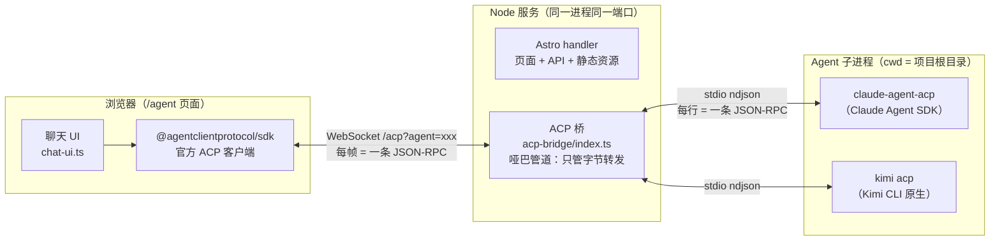
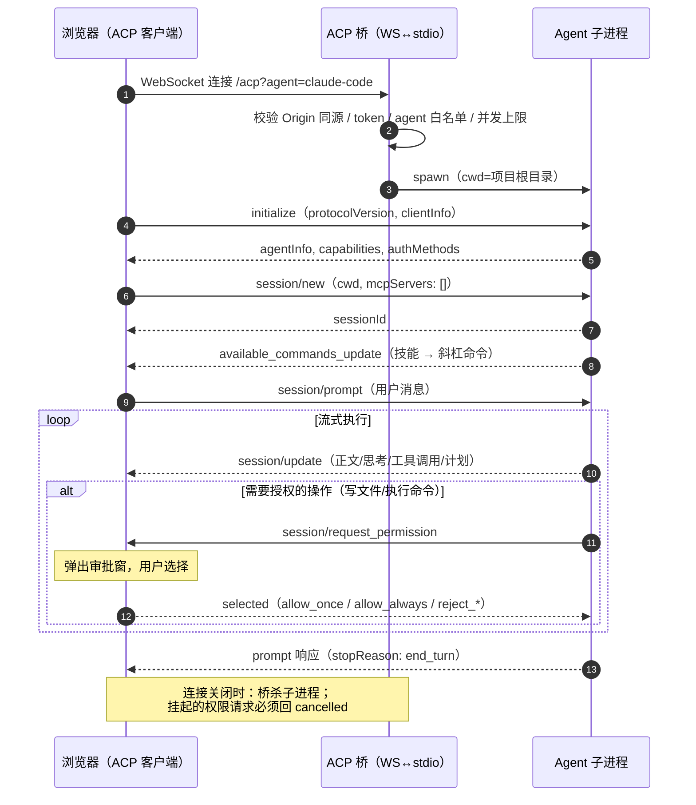
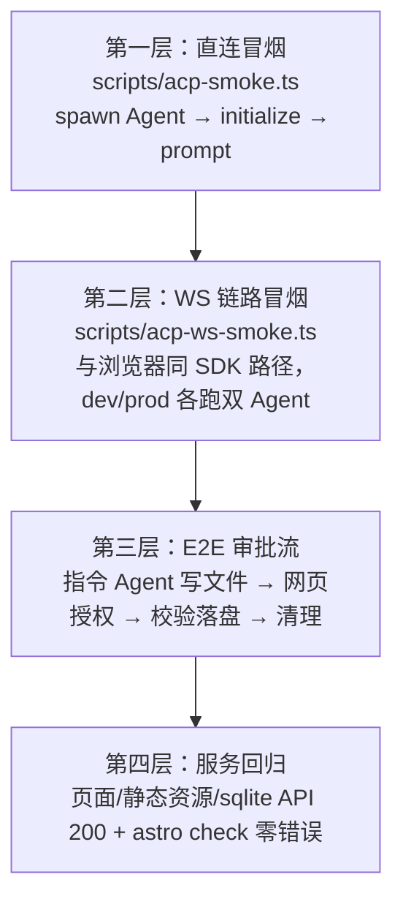

本文记录 AI 生态工作台（open-ai-eco）通过 **ACP（Agent Client Protocol）** 接入本地 Agent 的完整实践：选型理由、架构设计、关键实现、踩坑经验与验证方法。

---

## 1. 背景与目标

工作台是组内的 Astro 站点，用于展示 AI 研究成果。日常工作中沉淀了一批 Agent 技能（Skill）：

- **研究 AI 项目**：给一个 GitHub 地址，自动研究并把结构化信息写入项目 Excel；
- **AI 周报**：每周一生成结构化行业周报 Markdown；
- 后续还会有更多同类技能。

这些技能原本只能在终端里通过 Claude Code / Kimi CLI 使用。目标是：**在工作台网页里加一个交互入口，直接在页面上对话、调用技能、审批文件操作**，把"打开终端敲命令"变成"打开网页点一下"。

约束条件：主要自用、部署在内网 Node 常驻服务上、本地同时装有 Claude Code 与 Kimi CLI 两个 Agent。

## 2. 为什么选 ACP

| 方案 | 说明 | 结论 |
|---|---|---|
| API 路由包装无头 CLI（如 `claude -p`） | 每个技能写一个接口，后端跑完返回结果 | 最简单，但只有"触发-等结果"，没有多轮对话、没有审批、没有过程展示；每加一个技能都要写代码 |
| 各 CLI 私有协议（Claude Agent SDK、Kimi server 模式） | 直接用各家的 SDK | 每家一套协议，换 Agent 就要重写前端 |
| **ACP 开放协议** | Zed 主导的 JSON-RPC 标准，Claude Code / Kimi CLI / Gemini CLI 均支持 | **选中**：协议与 Agent 无关，一次接入多后端可用，且自带审批流、工具调用、斜杠命令等完整交互模型 |

ACP 的本质：**编辑器/客户端与 Agent 之间的 JSON-RPC 2.0 协议**，传输层是 stdio 上的换行分隔 JSON（ndjson）。它原生定义了我们需要的全部交互：

- `session/prompt` 多轮对话与 `session/update` 流式推送（正文、思考、工具调用、计划、用量）；
- `session/request_permission` 权限审批（Agent 反问客户端"这个操作允许吗"）；
- `available_commands_update` 把技能以斜杠命令形式推给客户端；
- `session/cancel` 中断、`session/load` 会话恢复。

## 3. 总体架构



三个核心设计决策：

### 决策一：协议逻辑全部放浏览器，桥做"哑巴管道"

官方 SDK（v1.2+）纯 Web Streams 实现、零 Node 依赖，且自带实验性的 `createWebSocketStream(url)`。于是最省力的分工是：

- **浏览器**：用官方 SDK 实现完整 ACP 客户端（initialize、session、prompt、审批回调）；
- **桥**：不解析任何协议内容，只做 **WS 帧 ↔ ndjson 行** 的字节互转 + 子进程生命周期管理（约 200 行）。

收益：ACP 的全部能力（流式、审批、计划、命令）自动透传，协议升级、新增 Agent 后端都不需要改桥。桥的唯一"协议知识"是帧格式对齐——SDK 的 WS 传输恰好一帧一条消息，ACP 的 stdio 恰好一行一条消息，两者天然一一对应。

### 决策二：桥并入同一个 Node 服务

站点本身就有服务端能力（sqlite 交互 API），部署形态是内网常驻 Node 进程，因此桥不另起服务：

- adapter 从 `standalone` 改为 **`middleware` 模式**，自定义入口 `scripts/serve.ts` 同时挂 Astro handler、静态文件服务和 WS 端点——仍是一个进程一个端口；
- 开发模式（`astro dev`）通过一个 **Astro 集成**把同一个桥模块挂到 Vite dev server 的 `upgrade` 事件上，dev/prod 行为一致。

### 决策三：技能目录用软链共享

Claude Code 认 `.claude/skills/`，Kimi CLI 认 `.kimi-code/skills/`。技能只有一份，用软链让两边看到同一目录：

```
.claude/skills  →  ../.kimi-code/skills   （项目级，已加入 .gitignore）
```

## 4. 关键流程



## 5. 实现要点

### 5.1 桥（`src/lib/acp-bridge/index.ts`）

```text
WS 帧（一条 JSON-RPC）  → stdin.write(帧) + stdin.write('\n')
stdout 按 '\n' 切行      → 每行作为一个 WS 文本帧发出
stderr                   → 只记日志，不进协议
```

- **升级请求校验**：路径必须是 `/acp`；`Origin` 存在时必须与 Host 同源；可选 `ACP_TOKEN`；agent 参数白名单（`claude-code` / `kimi`）；并发上限 8。
- **生命周期**：WS 断开 → SIGTERM（5 秒后 SIGKILL）；子进程退出 → 关 WS；30 分钟无消息 → 回收。
- **Agent 注册表**支持环境变量整段覆盖启动命令（`ACP_CLAUDE_COMMAND` / `ACP_KIMI_COMMAND`），应对生产环境 PATH 差异。

### 5.2 生产入口（`scripts/serve.ts`）

middleware 模式下 Astro **不再自动提供静态文件服务**，入口按序处理：

1. 静态资源：`send` 库服务 `dist/client`（自带 Range/ETag/路径穿越防护）；
2. 目录处理：无扩展名且是目录时直接拼 `/index.html`，与 Astro `trailingSlash: 'ignore'` 的产物一致，避免多余 301；
3. 未命中 → Astro handler（`/api/*` 等按需路由）→ 仍未命中 → 404。

### 5.3 浏览器客户端（`src/lib/agent/`）

- `acp-client.ts`：SDK `client()` + `createWebSocketStream()`，用原始 `request/notify`（而非 ActiveSession 辅助层）让所有 `session/update` 统一走 app 级回调；
- `chat-ui.ts`：流式 markdown（marked + DOMPurify，rAF 节流重渲染）、工具调用折叠卡片（diff 红绿块展示）、计划面板、审批弹窗（队列化处理连续请求）、`/` 斜杠命令补全；
- `session/new` 需要的绝对路径 `cwd` 由 Astro 服务端渲染时写入页面 `data-cwd` 属性（服务进程 cwd 即项目根，与桥 spawn 的 cwd 一致）。

## 6. 踩坑与经验

### 6.1 技能 SKILL.md 必须带 YAML frontmatter

`ai-weekly` 技能直接以 `# 标题` 开头，**两个 Agent 都不识别**。补上 frontmatter 后立即出现在斜杠命令里：

```yaml
---
name: ai-weekly
description: 每周一生成一篇结构化的 AI 行业周报……当用户要求"做一期 AI 周报"时使用。
---
```

`description` 同时是 Agent 判断"何时调用该技能"的依据，值得认真写（触发短语尽量列全）。

### 6.2 ACP 适配器已改名

`@zed-industries/claude-code-acp` 已废弃，迁移到 **`@agentclientprotocol/claude-agent-acp`**（安装时 npm 有警告）。调研时用的旧包名，实现前务必再查一次 registry——Agent 生态包名/参数变动非常快。

### 6.3 Kimi 的"技能迁移"行为

`kimi acp` 会自动扫描 `~/.workbuddy/skills/` 等历史目录，首次运行时把发现的技能**复制迁移**到项目 `.kimi-code/skills/` 下。副作用是同一技能可能多处存在（workbuddy 原件 + 项目副本），后续修改技能要留意改的是哪份。

### 6.4 WebSocket 不受同源策略保护

浏览器对 WS 握手**不做**同源限制，恶意网页可以向 `ws://localhost:4321/acp` 发起连接（CSWSH 攻击面）。桥必须手动校验 `Origin` 头与 `Host` 一致——这是"自用工具"也不能省的最低成本防护。

### 6.5 协议对取消的硬性要求

连接中断或用户取消时，**所有挂起的 `session/request_permission` 必须逐一回 `{outcome: 'cancelled'}`**，否则 Agent 会永远卡在等待授权状态。客户端实现里维护了一个 pending 集合，连接关闭时统一取消。

### 6.6 Vite dev server 的 upgrade 共存

Vite HMR 也监听同一 HTTP server 的 `upgrade` 事件。桥的处理是：**只认 `/acp` 路径，其余路径直接 return 不碰 socket**——两个监听者各管各的，互不干扰。

### 6.7 冒烟脚本先行的价值

在写任何 UI 之前，先用 ~100 行 Node 脚本（`scripts/acp-smoke.ts`）对两个 Agent 跑通 `initialize → session/new → prompt`，提前暴露了三个问题（适配器改名、frontmatter 缺失、kimi 迁移行为），全部在零 UI 成本下解决。另备 `scripts/acp-ws-smoke.ts` 用与浏览器完全相同的 SDK 路径（`createWebSocketStream`）验证桥——前端还没写，链路已经可信。

### 6.8 小坑清单

| 坑 | 处理 |
|---|---|
| `@types/ws` 的 message 数据类型是 `RawData` 联合（Buffer/ArrayBuffer/Buffer[]），不是 Buffer | 统一 `Buffer.from/concat` 归一 |
| Vite `httpServer` 类型含 Http2 联合，与 `http.Server` 不兼容 | 调用处收窄类型并注释 |
| middleware 模式导入 `dist/server/entry.mjs` 最初加了 `@ts-expect-error` | 构建产物自带类型，指令反而报错，删除 |
| zsh 把 `===` 当命令解析 | 测试输出分隔用引号包裹 |

## 7. 验证体系



安全行为同样纳入验证：非法 agent 参数 → 400，跨域 Origin → 403。

```bash
npm run acp:smoke -- claude          # 第一层（Claude Code）
npm run acp:smoke -- kimi            # 第一层（Kimi CLI）
npx tsx scripts/acp-ws-smoke.ts kimi ws://localhost:4321/acp   # 第二层
```

## 8. 安全设计回顾

自用/内网定位下的取舍：**能力全开放（文件/Shell），入口做最低成本防护**。

- Origin 同源校验（6.4）；
- 可选 `ACP_TOKEN` 口令（浏览器 localStorage 存一次）；
- Agent 白名单 + cwd 锁定项目根 + 空闲回收 + 并发上限；
- 所有危险操作必经网页审批窗人工确认（ACP 原生能力）；
- 明文红线写进 README：**切勿暴露公网**。

## 9. 已知边界与后续规划

| 边界/规划 | 说明 |
|---|---|
| 会话不持久 | 刷新页面即新会话；两个 Agent 均支持 `session/load`，可做断线恢复与历史会话列表（v2） |
| 无终端回显 | 未声明 `terminal` 能力，Bash 输出看不到过程，只见结果卡片（v2 可嵌网页终端） |
| 产物无联动 | 周报生成后不自动刷新文章列表/不自动 commit（v2 可做 Webhook 式联动） |
| 视频 Range | 静态服务基于 `send`，原生支持 Range，无需额外处理 ✓ |

## 10. 附录：文件清单

| 文件 | 作用 |
|---|---|
| `src/lib/acp-bridge/index.ts` | ACP 桥：Agent 注册表、WS 挂载、字节互转、生命周期 |
| `src/integrations/acp-dev-bridge.ts` | Astro 集成：dev 模式挂桥 |
| `scripts/serve.ts` | 生产入口（静态 + Astro + 桥，单进程单端口） |
| `src/pages/agent.astro` | 聊天页骨架 |
| `src/lib/agent/acp-client.ts` | 浏览器端 ACP 客户端封装 |
| `src/lib/agent/chat-ui.ts` | 聊天 UI：消息流/工具卡片/审批窗/命令补全 |
| `scripts/acp-smoke.ts` | Agent 直连冒烟 |
| `scripts/acp-ws-smoke.ts` | WS 链路冒烟（可自定义 prompt 做 E2E） |
