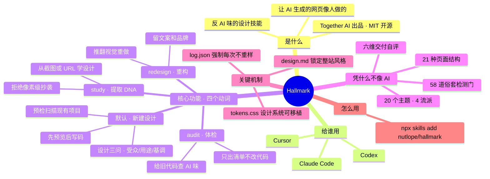

> 项目地址：https://github.com/Nutlope/hallmark
> 在线演示：https://www.usehallmark.com
> 许可证：MIT

---

## 一、这是什么

**Hallmark** 是一个面向 AI 编程助手（Claude Code、Cursor、Codex）的**设计技能（Skill）**，由 Together AI 出品。它解决的问题很具体：大模型生成的网页 UI 总有股"一眼 AI"的味道——居中大标题、紫蓝渐变、三列等宽卡片、Inter 字体……Hallmark 用一套强制规则把这些"默认审美"全部禁掉。

它的核心理念是**结构多样性优先于视觉多样性**：两个不同需求（brief）生成的页面，不应该只是同一模板换了配色，而应该像两个真正不同的网站。为此它内置了：

- **21 种宏观结构（macrostructure）**——页面的整体骨架，如 Bento Grid、Long Document、Manifesto、Marquee Hero、Stat-Led 等
- **20 个命名主题（theme）**——分属四个流派（genre），外加一个"自定义主题"隐藏分支
- **50 个组件原型**——9 种 Hero、14 种导航、8 种页脚、5 种节标题等
- **58 道"防俗套检测门"（slop test）+ 交付前六维自评**——任何一项不达标就打回重做

安装后，AI 助手在设计页面时会自动遵循这套规则，产出自带"人工设计感"的 HTML/CSS（或适配项目框架的组件代码）。

---

## 二、安装

### 推荐方式（一行命令）

```bash
npx skills add nutlope/hallmark
```

随时重跑此命令即可更新到最新版。

### 手动安装

把仓库中的 `skills/hallmark/SKILL.md` 和 `skills/hallmark/references/` 目录复制到对应位置：

| 工具 | 安装位置 |
|---|---|
| **Claude Code** | `~/.claude/skills/hallmark/` |
| **Codex** | `~/.codex/skills/hallmark/`（个人级）或 `.codex/skills/hallmark/`（项目级） |
| **Cursor** | `.cursor/rules/hallmark.mdc`（把 SKILL.md 正文粘贴进去，去掉 frontmatter） |

### 验证安装

在一个空项目里粘贴这条官方"试水"提示词：

> *"Build me a landing page for Coffeebox — a small-batch coffee subscription. Roast on Sunday, ship on Monday, drink Tuesday. Audience: people who already buy good coffee and want fewer trips to the shop. Tone: warm, hand-set, editorial — like a small café's chalkboard."*

如果产出是暖纸色、衬线字体、编辑风格的页面（而不是紫蓝渐变的 SaaS 模板），说明技能已正确接入。

---

## 三、四种用法（四个动词）

Hallmark 有一个默认行为和三个显式命令：

| 调用方式 | 作用 |
|---|---|
| *（默认）* | 直接让 AI 设计/搭建新 UI，自动走完整设计流程 |
| `hallmark audit <目标>` | 给已有代码做"AI 味体检"，输出按严重度排序的问题清单，**只看不改** |
| `hallmark redesign <目标> [--mood <风格>]` | 保留文案、信息架构和品牌，推翻视觉结构重做 |
| `hallmark study <截图 \| URL>` | 从你欣赏的设计中提取"DNA"（结构、字体搭配、色彩锚点），用于自己的内容 |

任何不明确匹配 `audit` / `redesign` / `study` 的输入都按默认设计流程处理。如果你贴了张图或丢了个链接但没说明意图，它会反问一句：是要 `study` 提取 DNA，还是当作新设计的参考？

### 1. 默认：新建设计

直接描述需求即可，例如：

```
帮我做一个面包店的落地页，里斯本的小店，卖酸面包，
早上七点开门，三十个面包，中午前卖完，不做线上订购。
```

**交互流程**：

1. **预检扫描（Pre-flight）**：如果项目里已有代码，它会先读取现有的字体栈、调色板、间距体系、动效库、框架，然后告诉你"将保留什么、将引入什么"。扫描结果缓存在 `.hallmark/preflight.json`，之后复用；想重新扫描就说 **"refresh pre-flight"**。
2. **设计三问（Design-context gate）**：它总会问三个问题——**受众**是谁、**用途**（页面要驱动的那一个动作）是什么、**基调**选一个极端（编辑感 / 粗野主义 / 柔和 / 实用主义 / 奢华 / 玩趣 / 技术感 / 冷峻——"干净现代"不算基调）。回答可选，回复 **"go ahead"** 它就自行推断，并会在开头明示推断了什么。
3. **结构 + 主题选择**：先定流派（genre），再选宏观结构、导航原型、页脚原型和主题，并大声说出来："Macrostructure: Marquee Hero. Theme: Bloom."
4. **预览块（Preview）**：写代码前先给一个六行的 TL;DR——结构、主题、增强、区块顺序、动效、slop test 结果。不满意可以此时喊停，避免白写几百行 CSS。
5. **构建 + 检测**：产出代码，跑完 58 道检测门才交付。

```提示词
@command:hallmark 帮我设计个开源 AI 项目研究的网站
```


### 2. `hallmark audit`——体检已有页面

```
hallmark audit src/app/page.tsx
```

输出格式为逐条发现：**问题名称**（来自反模式清单）→ **位置**（文件 + 行号）→ **严重度**（critical / major / minor）→ **一行修复建议**，最后汇总计数。它还会检查"结构指纹"：哪怕视觉没问题，只要页面是"居中 hero → 三个特性卡片 → CTA → 页脚"的经典 AI 模板，也会标为 critical。**它不做任何修改。**

### 3. `hallmark redesign`——保留内容、重做结构

```
hallmark redesign index.html
hallmark redesign src/pages/Landing.tsx --mood brutalist
```

丢掉旧的视觉结构，保留文案、信息架构和品牌资产，用不同的"指纹"重建。默认在现有实现边界内改造（不改路由、不删组件）；如果要大拆大改，它会先列出文件级计划并征得同意。


### 4. `hallmark study`——提取设计 DNA

```
hallmark study <粘贴截图>
hallmark study https://example.com
```

- **截图模式**：视觉分析，能判断节奏感，但字体只能给出"角色 + 候选字体"。
- **URL 模式**：读取 HTML/CSS，能说出精确字体名和色值，但判断不了视觉节奏（会明示这一盲区）。遇到登录墙、纯 JS SPA 等读不了的页面，会退化为请你提供截图。

产出一份**诊断报告**后，你有三个后续选项：

1. **"Build with this DNA"**——用提取出的 DNA 重建你自己的内容；
2. **"lock the DNA"**——把 DNA 固化为可移植的 `design.md`，交给其他 AI 工具或其他页面复用（URL 模式下需先声明来源是你自己的或你品牌的公开参考）；
3. 到此为止——诊断本身就是完整交付物。

**注意**：study 提取的是结构而非像素，它拒绝像素级克隆，也拒绝 Themeforest、Dribbble、Framer/Webflow 模板市场等来源。

---

## 四、核心概念速查

### 流派（Genre）—— 四种，先定流派再选主题

| 流派 | 适用信号 | 代表主题 |
|---|---|---|
| **editorial**（默认） | 无明确信号时的静默默认 | Specimen、Atelier、Brutal、Newsprint、Studio、Manifesto、Almanac、Garden、Riso、Sport、Editorial、Carnival |
| **modern-minimal** | SaaS、企业级、API、开发者工具、B2B | Coral、Cobalt |
| **atmospheric** | AI 工具、生成式、音乐/视频、深色氛围 | Bloom、Midnight、Terminal、Aurora、Lumen |
| **playful** | 消费级、轻松、社区、家庭 | Hum |

### 自定义主题（Custom）—— 隐藏分支

默认走主题目录（catalog），静默轮换，用户无感知。只有当需求带以下信号时才会触发自定义分支：明确要求"custom theme / 贴合品牌 / 独一无二"、指定品牌锚色、描述了三个以上指向特定氛围的形容词（如"苔藓、地衣、柔粉、草本"）、或附上了品牌情绪板。自定义分两档：**tuned**（定制 OKLCH 调色板 + 字体搭配，沿用既有结构）和 **bespoke**（连结构都从零设计）——两档都照样过全部 58 道检测门。

### 多样性纪律（Diversification）

- 每次运行会在项目根目录维护 `.hallmark/log.json`，记录最近 20 次的结构 / 主题 / 增强选择；
- 新构建的宏观结构不得与最近三次重复，主题须在"纸张明暗 / 展示字体风格 / 强调色相"三条轴上至少有一条不同，导航和页脚原型也不得连续重复；
- CSS 文件头部会盖戳（`/* Hallmark · macrostructure: X · theme: Y */`），供下次运行读取。

### 交付产物

| 文件 | 说明 |
|---|---|
| 页面代码 + 盖戳 CSS | 自包含，颜色一律用 OKLCH，全部引用命名 token |
| `tokens.css` | 每次构建必产出，汇集全部 `--color-*` / `--font-*` / `--space-*` 等 token，是设计系统可移植性的载体 |
| `.hallmark/log.json` | 项目记忆，驱动多样性轮换 |
| `.hallmark/preflight.json` | 预检缓存 |
| `design.md`（可选） | 说 **"lock the system"** 才会生成，把整套设计系统固化为可移植文件；此后整个项目以它为最高准则（多页站点用同一系统，而非页页不同） |

### 组件级模式（Component-scope）

如果需求是单个元素（"做个按钮""写个卡片"），Hallmark 自动切换到组件模式：跳过宏观结构 / 导航 / 页脚那一整套，但**强制交付 8 种状态**（default、hover、focus、active、disabled、loading、error、success）的完整样式，外加一个 `<组件名>.preview.html` 八态演示页（看完即可删）。拿不准是组件还是页面时，它会问一句："一张定价卡，还是整个定价页？"

---

## 五、六条铁律（贯穿所有动词）

1. **交付前自评**：按理念、层级、执行、具体性、克制、多样性六维各打 1–5 分，任何一项低于 3 就打回重做，分数盖戳在文件头。
2. **文案诚实**：用户没给的数据绝不编造——"+47% 转化""50,000+ 团队信赖"这类数字一旦虚构即为俗套。
3. **Token 锁定**：选定主题后，所有颜色和字体必须引用命名 token（`var(--color-accent)`），不允许内联色值或绕开 token 写 `font-family`。
4. **禁画假壳**：不手绘假浏览器栏、假手机框、假代码窗口——用真实截图加细边框，或干脆不加。
5. **移动端硬指标**：320 / 375 / 414 / 768px 四个宽度必须完美渲染，禁横向滚动、禁两行可点文字等。
6. **标题不用斜体**：标题永远是正体（roman），斜体大标题是最可靠的 AI 味之一；强调靠字重、强调色或手绘下划线。

---

## 六、实用技巧

- **想让它自己拿主意**：在三问环节回复 "go ahead"，它会推断并明示，你可以纠正。
- **想要多种方案对比**：分次运行——多样性纪律保证每次产出结构不同；或明确说"用和上次不一样的结构再来一版"。
- **想要同一结构不同细节**：直接要求复用上次的 macrostructure，它会保留骨架但更换细节参数（"同原型、不同指纹"）。
- **多页项目保持品牌一致**：先做一次满意的设计，然后说 **"lock the system"** 生成 `design.md`，之后所有页面自动遵循同一系统。
- **更新技能**：重跑 `npx skills add nutlope/hallmark`。
- **浏览示例**：线上 demo 在 [usehallmark.com](https://www.usehallmark.com)（按 `T` 键循环切换主题）；仓库 `site/_tests/` 和 `site/examples/` 下有完整的测试页面与源码；`docs/recipes.md` 收录了八个可直接复制的完整提示词。

---

## 七、常见问题

**Q：它每次都问我三个问题，能跳过吗？**
A：回复 "go ahead" / "你定" 即可，两秒钟的事。设计三问是刻意的——猜错的代价是整页返工。

**Q：生成的页面会不会每次长得一样？**
A：不会。`.hallmark/log.json` 记录的多样性纪律强制结构、主题、导航、页脚轮换。如果发现雷同，跑 `hallmark audit` 检查。

**Q：能用于 React / Next.js / Tailwind 项目吗？**
A：可以。预检会识别框架（Next.js、Astro、Vue、Svelte、Remix、原生 HTML）和 Tailwind，产出匹配项目惯例的代码；已有全局样式表是"只追加"的，不会覆盖。

**Q：它会删我的旧代码吗？**
A：不会。任何删除都需要你明确批准文件级清单；redesign 默认只做原地修改和新增组件。

**Q：58 道检测门都查什么？**
A：覆盖视觉（禁用字体、渐变文字、卡片套卡片）、结构（AI 模板、重复指纹）、排版、色彩、动效、交互状态、对比度、移动端等，按流派有差异化放宽（如 atmospheric 允许背景径向渐变、modern-minimal 允许纯白纸张）。完整清单见 `skills/hallmark/references/slop-test.md`。

---

## 八、项目结构（速览）

```
hallmark/
├── skills/hallmark/
│   ├── SKILL.md                  # 技能主文件：流程、四个动词、六条铁律
│   └── references/
│       ├── macrostructures/      # 21 种页面宏观结构
│       ├── components/           # 50 个组件原型（hero/nav/footer/…）
│       ├── genres/               # 4 个流派规则
│       ├── themes/               # 主题专项规格
│       ├── verbs/                # audit / redesign 细则
│       ├── slop-test.md          # 58 道检测门 + 六维自评
│       └── …                     # 排版、色彩、动效、文案、反模式等规则
├── docs/recipes.md               # 8 个可直接复制的完整提示词
├── docs/study-examples.md        # 3 个 DNA 提取范例
└── site/                         # 演示站 + 全部示例页面源码
```

---

## 九、路线图（官方规划中）

- Nanobanana 图像生成一等集成（图片密集型需求不再只能"自己去生成"）
- 品牌优先流程：从一段产品描述生成完整品牌并锁定为 `design.md`
- `hallmark variant`：同一需求并排产出三个结构迥异的版本供挑选
- 主题感知的动效时长 token、图表（data-viz）规范、多页一致性、`study` 支持读取本地代码库

---

*本指南基于 Hallmark v1.1.0（2026 年 7 月仓库状态）整理，以官方 README 与 SKILL.md 为准。*
