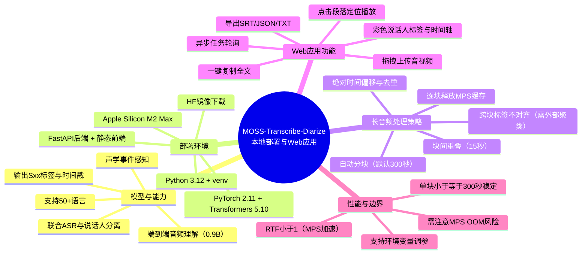

基于 [OpenMOSS/MOSS-Transcribe-Diarize](https://github.com/OpenMOSS/MOSS-Transcribe-Diarize) 的本地部署，并构建了一个 Web 应用：用户上传音频/视频，模型自动完成 **转写 + 说话人分离（Diarization）+ 时间戳 + 声学事件感知**，返回带说话人标签的结构化字幕。



---

## 一、项目能力研究

### 定位
MOSS-Transcribe-Diarize 是 OpenMOSS 团队开源的 **端到端（end-to-end）音频理解模型**，当前版本 `0.9B`（2026-07-09 开源）。它一次性联合完成「语音识别 + 说话人分离」，而非传统 pipeline（ASR + 独立的 speaker diarization 再对齐）。

- 2026-07-14 获 **INTERSPEECH 2026 第二届 MLC-SLM 挑战赛第一名**（覆盖 14 种语言）。
- 更强版本 `MOSS-Transcribe-Diarize Pro` 即将以 API 形式提供。

### 核心能力
| 能力 | 说明 |
|------|------|
| 长音频多说话人转写 | 面向会议、电话、播客、访谈、讲座、视频等杂乱多说话人录音 |
| 说话人分离（Diarization） | 输出一致的说话人标签 `[S01]` `[S02]` … |
| 时间戳 | 秒级对齐，格式 `[start][Sxx]text[end]` |
| 声学事件感知 | 可选输出，标注非语音声学事件 |
| 多语言 | 支持 50+ 种语言 |

### 模型架构
| 组件 | 规格 |
|------|------|
| 文本主干 | Qwen3-0.6B 风格因果解码器 |
| 音频编码器 | Whisper-Medium encoder 配置 |
| 音频前端 | WhisperFeatureExtractor，16kHz，80 mel bins，30s chunks |
| 音频-文本桥接 | 4× 时间下采样 + MLP adaptor |
| 融合方式 | 音频特征通过 `masked_scatter` 替换 `<|audio_pad|>` 嵌入 |
| 输出范式 | 紧凑时间戳转录 `[start_time][Sxx]transcribed speech[end_time]` |

### 输出示例
```
[0.48][S01]Welcome everyone[1.66][12.26][S02]The new transcription pipeline is ready for evaluation[13.81][14.36][S01]Great, include the diarization results in the report[18.76]
```

### 许可证
仓库含 `LICENSE` 文件（见 `MOSS-Transcribe-Diarize/LICENSE`）。**部署与二次分发前请先确认许可证的具体条款（是否允许商用 / 修改 / 再分发）**，本仓库仅做技术验证与本地部署用途。

---

## 二、部署环境

- 硬件：Apple M2 Max（38 核 GPU）/ 64GB 统一内存（本机）
- 系统：macOS 26（Apple Silicon）
- Python 3.12（venv 隔离）
- 推理后端：PyTorch（macOS 原生，自动使用 **MPS** 加速；无 GPU 时回退 CPU）
- 依赖：`transformers>=5.0,<6.0`、`torch>=2.8`、`fastapi`、`av`、`librosa` 等

> 注：官方推荐的服务后端是 SGLang Omni（CUDA 13）/ vLLM（CUDA 12/13），需要 NVIDIA GPU。本机为 Apple Silicon，无 CUDA，因此采用 **transformers 直接推理** 方案，功能等价，可在 Mac 本地运行。

---

## 三、快速开始

### 1. 安装依赖
> 关键坑（已在 M2 Max 上验证）：`torch>=2.8` 与未固定版本的 `pip install -e .` 会让 `uv` 陷入 version-resolution 回溯死循环（解析到 2.13 / 多个 transformers 版本，半小时不收敛）。**必须固定版本**。

```bash
cd MOSS-Transcribe-Diarize
python3.12 -m venv .venv && source .venv/bin/activate
# 固定 torch 版本（macOS 轮子含 MPS 支持），避免 uv 回溯
uv pip install torch==2.11.0 torchaudio==2.11.0
# 固定 transformers 版本，避免解析回溯
uv pip install -e . "transformers==5.10.2"
```

### 2. 下载模型权重（HF 官方被墙，使用镜像）
```bash
export HF_ENDPOINT=https://hf-mirror.com
# 用 huggingface_hub 的新 CLI（hf），旧 huggingface-cli 已废弃
hf download OpenMOSS-Team/MOSS-Transcribe-Diarize \
  --local-dir ../models/OpenMOSS-Team/MOSS-Transcribe-Diarize
```

### 3. 启动 Web 应用
```bash
cd webapp
bash run.sh
# 打开 http://localhost:8000
```

---

## 四、Web 应用说明

### 功能
- **拖拽 / 点击上传** 音频或视频（WAV / MP3 / M4A / FLAC / MP4 …）
- **自动转写 + 说话人分离**：返回带 `[Sxx]` 标签、起止时间戳的文本段落
- **说话人配色 + 时间轴**：一眼区分不同说话人及其在音频中的分布
- **点击段落定位**：点击任意文本段落，音频跳转到对应时间
- **字幕导出**：SRT / JSON / TXT，以及一键复制全文
- **本地推理**：文件不离开本机，隐私友好

### 目录结构
```
MOSS-Transcribe-Diarize/    # 克隆的官方仓库（含模型推理代码）
models/OpenMOSS-Team/...    # 下载的模型权重
webapp/
  app.py                    # FastAPI 后端（封装推理 + 解析 + 导出）
  run.sh                    # 启动脚本
  static/index.html         # 前端（单页应用）
```

### API
长音频推理耗时较长（分钟级），因此采用**异步任务 + 轮询**模式，避免请求超时。

`POST /api/transcribe`
- 请求：`multipart/form-data`，字段 `file`（音频/视频文件）
- 行为：立即接收文件、创建后台任务，**立即返回**任务 ID（模型在后台线程中分块推理）
- 返回：
```json
{ "job_id": "9ce4ffa7e96b44bc9fdf63fad390c6f0", "chunk_seconds": 300 }
```

`GET /api/job/{job_id}`
- 轮询任务状态/进度/结果（前端每 1.5s 轮询一次）
- 返回：
```json
{
  "status": "processing",
  "progress": { "chunk": 2, "total": 6, "stage": "transcribing" },
  "error": null,
  "text": "...",
  "segments": [{"start": 0.48, "end": 1.66, "speaker": "S01", "text": "Welcome everyone"}],
  "speakers": ["S01", "S02"],
  "num_speakers": 2,
  "duration": 18.76,
  "elapsed": 12.3
}
```
- `status` 取值：`queued` → `processing` → `done`（或 `error`）；`progress.stage` 可为 `queued` / `transcribing` / `done`

`GET /api/health`
- 返回：模型加载状态、设备、`chunk_seconds`、`overlap_seconds` 等（前端据此显示「分块大小」提示）

---

## 五、性能与能力边界

- 推理设备：Apple Silicon 上自动使用 MPS；长音频会相应增加 `max_new_tokens`（约 12 token/秒，上限 65536）。
- 实测数据（本地 M2 Max，float32）：见下方「实测结果」。
- 边界：说话人标签为相对编号（`S01/S02/...`），不做跨音频的说话人身份对齐；Web 应用已对长音频**自动分块**（见五（续）），但跨块说话人标签不保证一致，且单块长度受 MPS 显存上限约束（默认 300s）。

### 长音频为什么需要分块

**问题现象**：上传几分钟的音频很顺畅，但 30 分钟乃至 1–2 小时的长音频会报错：
- `Audio features and audio tokens do not match: tokens: 0, features 33782`，伴随 Metal 命令缓冲区错误（`kIOGPUCommandBufferCallbackErrorSubmissionsIgnored`）；
- 或直接 `MPS backend out of memory (MPS allocated: 7.64 GiB, other allocations: 68.91 GiB, max allowed: 88.13 GiB). Tried to allocate 33.92 GiB`；
- 个别情况下进程卡死、无报错、进度长时间不动（Metal 命令缓冲区对超长序列挂起）。

**根因**：模型内部按 30s 切片，但会把**整段音频的所有切片堆叠成一个巨大的张量**一次性送进 Whisper 编码器；解码器又对所有音频 pad token 做自注意力。因此注意力矩阵大小 ∝ 音频长度²——30 分钟 ≈ 22500 个音频 token，注意力矩阵达 22500×22500，显存随音频长度平方级暴涨，轻易越过 MPS 的硬件内存上限（约 88GB），触发 OOM 或 Metal 命令缓冲区挂死。

**解决方案**：Web 应用对长音频**自动分块推理**（见 `webapp/app.py` 的 `chunked_transcribe`）：
- 把整段音频切成 `CHUNK_SECONDS`（默认 300s / 5 分钟）的块，逐块送模型；
- 块间留 `OVERLAP_SECONDS`（默认 15s）重叠，避免句子在边界被截断；
- 每段时间戳按块起点偏移为绝对秒数，并丢弃重叠区内的重复段落；
- 每块推理后调用 `torch.mps.empty_cache()` 释放 MPS 缓存显存，避免多块累积 OOM；
- 推理在后台线程执行，前端通过 `GET /api/job/{id}` 轮询进度。

**MPS 安全块长**：在 Apple M2 Max 上实测，单块 ≤ 300s（5 分钟）稳定；600s（10 分钟）单块会卡死（Metal 命令缓冲区挂起，无报错）。遇到不稳定可下调到 120–180s。可用环境变量覆盖：
```bash
MTD_CHUNK_SECONDS=180 MTD_OVERLAP_SECONDS=15 bash run.sh
```

**已知边界**：
- 跨块**说话人标签不保证一致**：每块内部分别编号 `S01/S02`，若某块只出现 1 个说话人，其标签可能与相邻块错开。长会议如需跨段一致的说话人身份，需另接说话人聚类/对齐（如基于声纹），当前版本未内置。
- 重叠区去重仅按时间丢弃重复段落，极个别跨边界的句子可能被截断或重复，通常可忽略。

---

## 六、实测结果（Apple M2 Max / 64GB / MPS / float32）

用 `say` 合成的 11.47s 双说话人样例（Alex + Victoria）在本地推理：

| 指标 | 结果 |
|------|------|
| 说话人分离 | ✅ 正确区分 S01 / S02（与合成时的两位说话人一一对应） |
| 转写文本 | 正确（仅个别音近词偏差，如 *diarization*→*diorization*，属语音歧义） |
| 时间戳 | 准确：S01 `0.00–6.41s`、S02 `6.42–11.41s` |
| 首请求耗时 | ~4.1s（含模型懒加载 + 推理） |
| 模型缓存后耗时 | ~1.6s（同一进程内第二次请求） |
| 实时率（RTF） | < 1（MPS 上快于实时） |

> 格式兼容：WAV / MP3 均验证通过。项目底层用 `transformers.audio_utils.load_audio` + `av`（PyAV）解码，支持常见音频及 MP4/M4V/MOV 等视频容器中的音轨。

> 说明：当前 WorkBuddy 沙箱环境下，上传临时文件已固定写入 `/tmp` 目录，规避了 safe-delete 守卫对删除操作的拦截；正常部署（无该环境变量）时上传目录可由 `MTD_UPLOAD_DIR` 覆盖。
