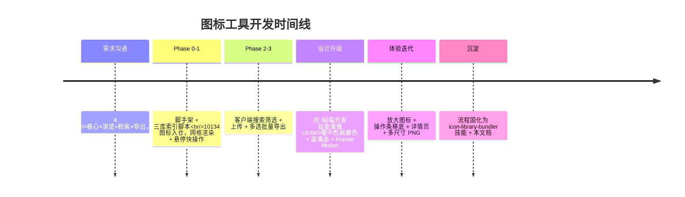
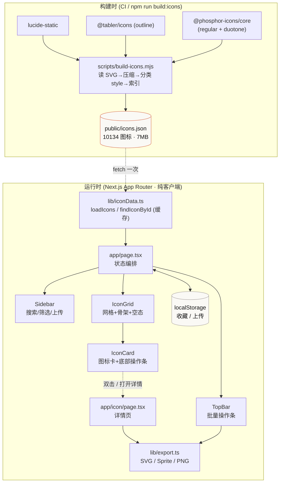
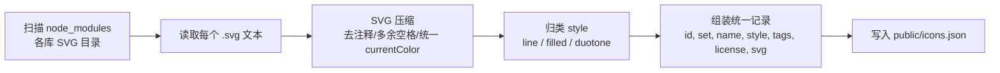
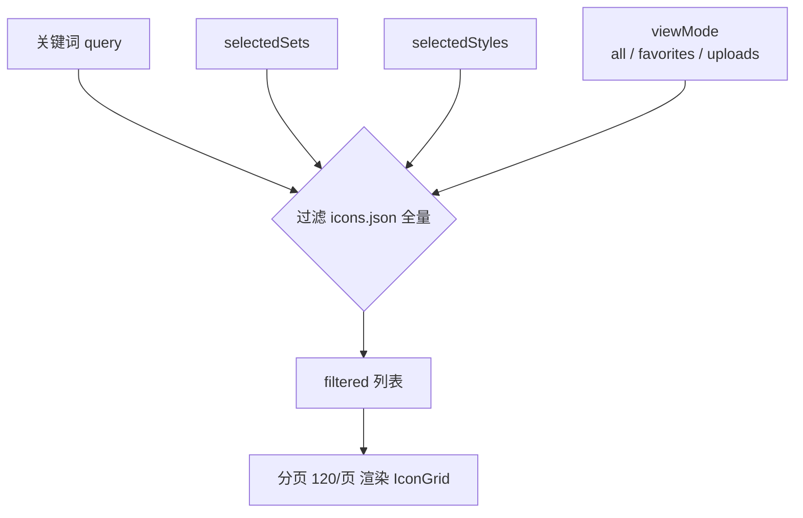
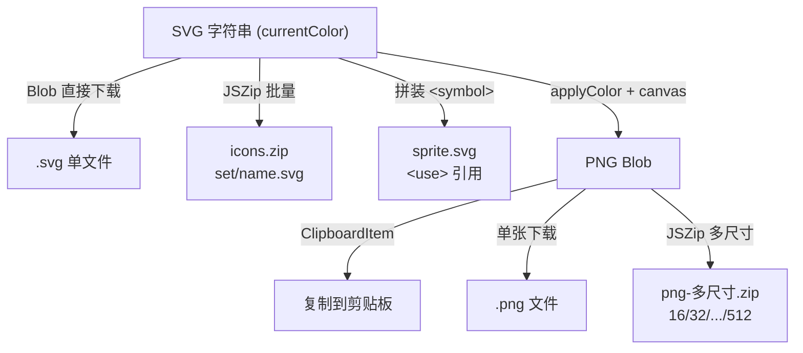
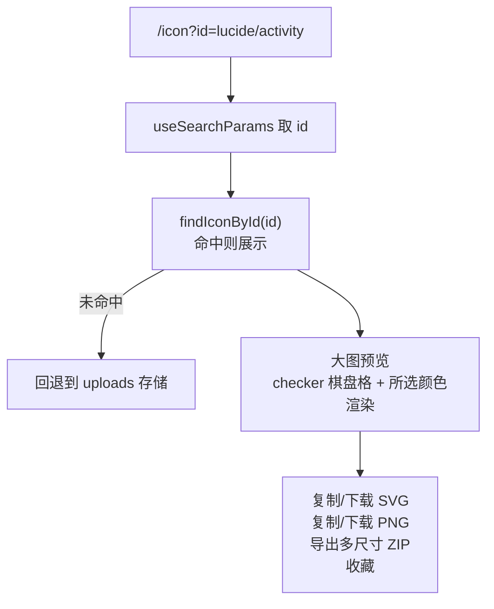
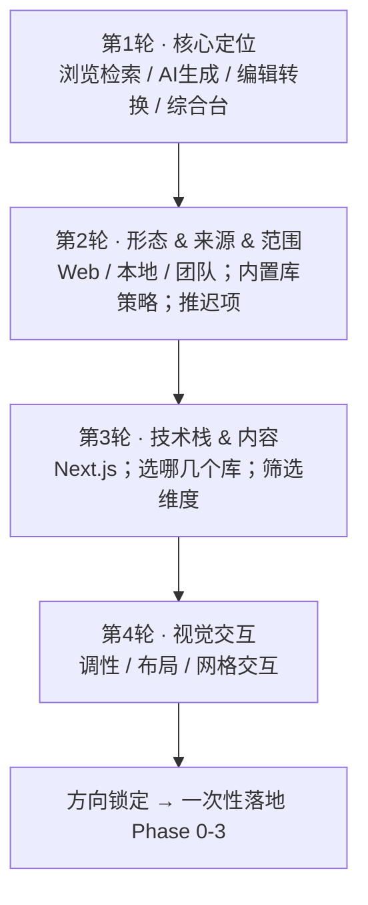
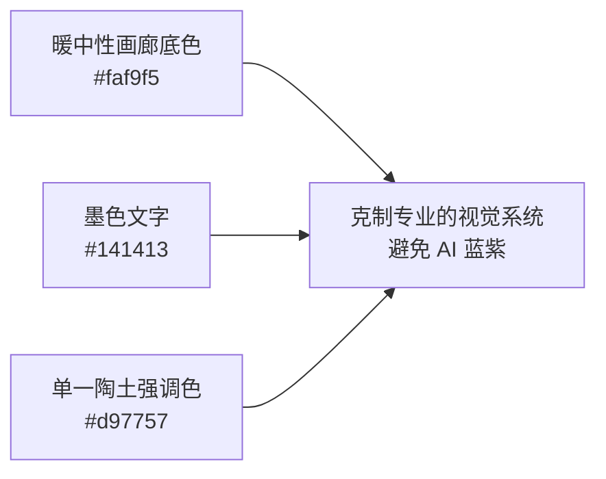
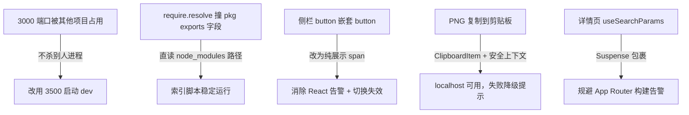
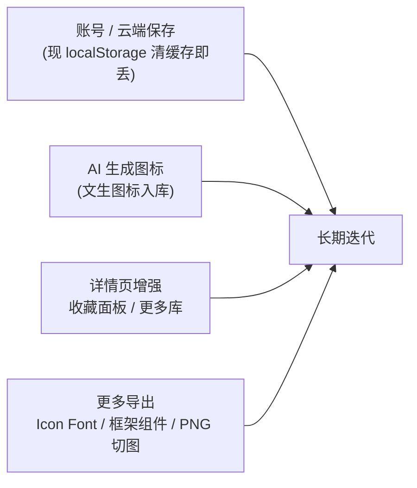

> 项目：`icon-tool/`（Next.js 16 + React 19 + Tailwind v4）
> 面向设计师的公开图标工具：浏览 + 检索 + 一键导出（SVG / Sprite / 多尺寸 PNG）

---

## 一、项目背景与目标

一个给设计师用的图标工具，要解决的核心痛点是：**跨库统一搜索 + 一键导出多格式**。首版定位为「游客可用的公开原型」——聚合精选开源库、强搜索、一键导出，账号/云端与 AI 生成推迟到后续阶段。

首版交付范围（Phase 0–3）：

- 内置 Lucide、Tabler、Phosphor 三库共 **10134** 个图标（构建时抽成 `public/icons.json`，约 7MB）
- 关键词搜索 + 按图标集 / 风格筛选（客户端）
- 悬停快操作、多选、批量导出 SVG 压缩包与 SVG Sprite
- 图标详情页 + 多尺寸 PNG 导出与复制
- 上传 SVG、收藏（均存 `localStorage`）

---

## 二、开发过程时间线

---

## 三、系统架构

**关键架构决策：索引前置 + 纯客户端。**

三库的 SVG 在**构建时**被抽成一份统一 JSON，前端加载后做客户端搜索与渲染，无需后端查询、无数据库、可静态部署。几千~上万个图标的规模下，`fetch` 一次 JSON + 内存过滤足够快。

---

## 四、关键技术流程

### 4.1 图标索引构建

统一记录结构（`lib/types.ts`）：

| 字段 | 含义 |
|---|---|
| `id` | `${set}/${name}`，唯一键，也是详情页路由参数 |
| `set` | lucide / tabler / phosphor |
| `name` | 图标名 |
| `style` | line（Lucide、Tabler）/ filled（Phosphor regular）/ duotone（Phosphor duotone） |
| `tags` | 关键词（用于模糊搜索） |
| `license` | 许可证（用于后续过滤） |
| `svg` | 内联 SVG 字符串 |

### 4.2 搜索 / 筛选（客户端）

无后端依赖：所有筛选都是对内存中数组的 `.filter()`，配合 `useMemo` 防抖即可流畅响应。

### 4.3 导出架构（三种产物）

**SVG Sprite 用标准 `<symbol>` + `<use>` 方案**，批量打包用 JSZip，**全部在客户端完成、不发任何请求**。

### 4.4 详情页数据流

详情页通过 `?id=` 查询参数定位图标，复用首页的 `lib/iconData.ts` 加载器（带模块级缓存），避免重复拉 7MB。

---

## 五、需求工程：4 轮结构化提问收敛

这次最值得复用的经验是**先聊透再动手**。用 4 轮递进式提问把方向钉死，每一轮都收敛一层，避免返工：

**最佳实践：**

- 每轮问题都限定在「决定下一层架构」的维度，不一次堆所有问题
- 多选问题（来源、筛选维度、导出格式）用 `multiSelect` 把取舍交给用户
- 明确标注「推迟到后续」的项（AI 生成、账号、详情页），让首版范围可控
- 收敛完先把结论写进项目记忆（MEMORY.md），防止换会话丢上下文

---

## 六、设计与交互最佳实践

设计升级时遵循了「避免 AI 蓝紫、克制专业」的原则：

**可复用要点：**

- **配色**：中性画廊底 + 单一强调色（accent），不要多种高饱和色打架
- **玻璃态**：顶栏、悬停操作条用 `backdrop-blur` + 半透明 + 细边框 + 浮起阴影
- **动效克制**：Framer Motion 做卡片错落入场、悬停 `y:-3` 浮起、批量条 `AnimatePresence` 进出场——有「影院感」但不喧宾夺主
- **图标去 emoji 化**：界面所有操作图标换成 Lucide（与内置图标库同源），视觉统一
- **组件拆分清晰**：`TopBar / Sidebar / IconCard / IconGrid` 各司其职，网格含骨架屏与空状态
- **不遮挡原则**：图标卡放大到 64px 后，把悬停操作条从「右上角浮层（盖住图标）」改为「卡片底部固定条」，并新增「打开详情」入口（按钮 + 双击）

---

## 七、工程踩坑与经验

**逐条经验：**

1. **端口冲突**：3000 被 `db-design-agent` 占用，用 `lsof -iTCP:3000` 先确认占用者**不是自己**，再换空闲端口（3500）启动，**绝不杀别人的进程**。
2. **`require.resolve` 失败**：`@tabler/icons` 的 `exports` 字段会让 `require.resolve(pkg/package.json)` 报错，改直接拼 `node_modules/...` 绝对路径最稳。
3. **嵌套可点击元素**：`<button>` 里再放 `<button>` 会触发 React 嵌套告警，且点击冒泡导致两次切换互相抵消——勾选框改成纯展示元素，点击整行切换。
4. **PNG 复制**：用 `ClipboardItem` 写剪贴板，依赖浏览器图片剪贴板能力，且需**安全上下文**（`localhost` / `https` 才可）。要写 try/catch 降级，失败时提示「复制失败」但不影响下载/打包。
5. **currentColor 统一**：确认三库 SVG 都用 `currentColor`，才能用 `applyColor()` 替换颜色、跟随主题。
6. **共享数据加载器**：首页与详情页都要 7MB JSON，抽成 `lib/iconData.ts` 做模块级缓存，避免重复 `fetch`。
7. **验证闭环**：每次大改都跑 `tsc --noEmit` + 触发编译 + `curl` 验路由 `200` + 查 dev 日志无 `error`，再交付。
8. **改完即记**：每完成一轮，立刻追加到项目每日记忆（`2026-07-24.md`），长期事实写 `MEMORY.md`。

---

## 八、技能沉淀（可复用）

把「聚合多个开源图标库 → 生成统一索引 → 客户端渲染/搜索/导出」的整套流程，固化成了用户级技能 **`icon-library-bundler`**（`~/.workbuddy/skills/icon-library-bundler/`），下次同类需求直接加载复用，覆盖：依赖安装、索引脚本（set→style 映射 + SVG 压缩）、客户端渲染内联 SVG、关键词搜索、批量导出 SVG 压缩包与 SVG Sprite。

**通用经验**：完成 15+ 工具调用的多步任务后，把可复用流程沉淀为 Skill，比写进项目记忆更「可执行」。

---

## 九、可复用检查清单

- [ ] 开工前用结构化提问把需求收敛到可动手的程度
- [ ] 收敛结论先写进项目记忆，防换会话丢上下文
- [ ] 大数据量 → 构建时抽索引 JSON，前端客户端处理，省后端
- [ ] 端口被占先确认占用者，不杀无关进程，换端口启动
- [ ] 界面操作元素不遮挡内容本体
- [ ] 视觉用中性底 + 单一强调色，避免 AI 蓝紫
- [ ] 动效克制，有质感不喧宾夺主
- [ ] 剪贴板/安全上下文相关能力写降级
- [ ] 每轮改动：`tsc` + 编译 + 路由 `curl 200` + 日志无错
- [ ] 改完记记忆，跨项目流程沉淀为 Skill

---

## 十、后续演进（Phase 4+）

---
*附：项目路径 `icon-tool/`，开发预览 `http://localhost:3500`（3000 被占用）。*
