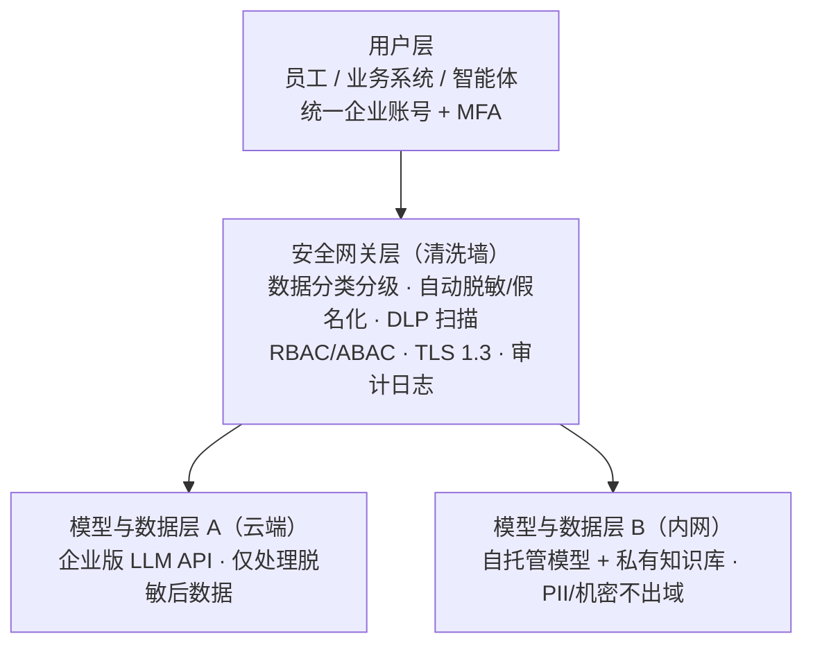
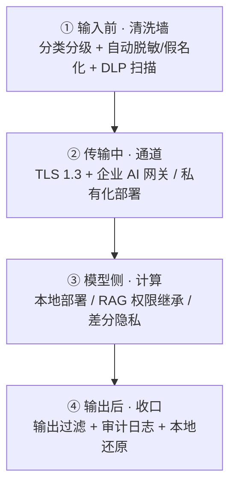
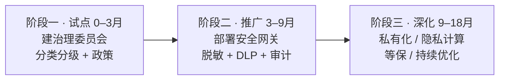

> 面向已部署 / 计划部署 AI 助手（如 WorkBuddy、ChatGPT Enterprise、Claude、内部 Copilot 等）的企业
> 覆盖：治理 · 部署架构 · 数据防护 · 访问控制 · 合规审计 · 落地路线图
>
> - 原则：把发给 AI 的每句话当公开
> - 分级 · 脱敏 · 最小权限 · 审计可追溯
> - 贴合《个人信息保护法》《数据安全法》

## 1. 总体原则与定位

企业用 AI 不是"禁不禁"的问题，而是"在哪里用、用什么数据、谁能看"的问题。

核心结论（来自社区实践与一线技术文章共识）：企业用 AI 确实存在数据泄露风险，但风险主要源于**架构选型与治理缺失**，而非 AI 技术本身。通过私有化部署、RAG 权限隔离、严密的脱敏与审计，可构建"数据不出域"的安全闭环。

> 📌
> **四条铁律：**
>
> 1. **假设公开**：发给 AI 的内容视为可能公开，绝不粘贴凭证 / 完整 PII / 未脱敏商业机密。
> 2. **最小必要**：只发送完成任务所需的最少数据，敏感字段在发送前脱敏或剔除。
> 3. **越敏感越本地**：敏感度越高，处理越应留在内网 / 自托管模型。
> 4. **可审计**：每一次 AI 调用、数据交互、工具执行都可溯源。

## 2. 组织治理框架

技术只占三分之一，治理决定成败。建议建立三层治理结构：

### 2.1 组织

- **AI 治理委员会**：由 IT、安全、法务、业务负责人组成，制定并监督 AI 使用安全标准。
- **数据保护官（DPO）/ 合规负责人**：对接《个人信息保护法》义务，处理违规与事件上报。
- **部门 AI 管理员**：负责本部门知识库权限、账号开通与日常培训。

### 2.2 制度

- **AI 使用政策**：明确"允许 / 禁止输入"清单（见附录 B），要求工作数据必须经企业账号、禁止个人账号。
- **数据分类分级制度**：按 GB/T 35273 划分 L1–L4，明确每级能否进 AI、走哪种通道（见附录 A）。
- **隐私影响评估（PIA）**：系统上线前评估收集、处理、共享各环节隐私风险。
- **事件上报流程**：误提交个人数据视为潜在数据泄露，按组织泄露通知程序处理。

### 2.3 意识

- 全员年度 AI 安全培训；新人入职即 briefing。
- 把"粘贴前先脱敏"写进 onboarding 文档与团队工具箱。

## 3. 部署架构选型

先按数据敏感度决定部署模式，再选具体产品。三种主流模式对比：

| 维度 | SaaS 公有云（消费/企业版） | 混合架构 | 私有化 / 本地部署 |
| --- | --- | --- | --- |
| 适用数据 | 低–中敏感（公开、内部非机密） | 中敏感为主 | 高敏感（PII、机密、源代码） |
| 数据流向 | 出域至服务商 | 非敏感走加密云 API，敏感内网处理 | 数据不出企业网络 |
| 典型产品 | ChatGPT Enterprise、Claude Enterprise | Azure OpenAI / Bedrock + 内网轻量模型 | Ollama、vLLM、Qwen、Llama 内网 |
| 优势 | 零维护、即时最新模型 | 兼顾效率与隔离 | 物理隔离，泄露风险降 95%+ |
| 成本 | 低（订阅） | 中 | 高（GPU 集群 + 运维） |
| 合规 | 需签 DPA，确认不用于训练 | 敏感数据本地闭环 | 满足数据本地化 / 等保 |

> 💡
> 建议：**核心研发 / 涉及考生或客户个人信息的系统，采用"混合 + 数据隔离"**——非敏感代码经清洗后走加密云 API，核心算法与含 PII 的环节在内网轻量模型（如 Qwen-Coder、CodeLlama）处理。

### 3.1 推荐总体架构

## 4. 数据安全防护体系

加密与脱敏是不同层面，必须组合使用：

### 4.1 脱敏（从源头消灭泄露，性价比最高）

- **静态脱敏**：入库前替换（如身份证保留前6后4、手机保留前3后4）。
- **动态脱敏**：API / 网关层实时掩码，开发人员查生产库也只见脱敏值。
- **假名化 / 令牌化（可逆）**：用 `[PERSON_1]` 等令牌，AI 返回后**本地还原**，支持"加密-分享-编辑-解密"工作流。
- **工具**：Microsoft Presidio、本地正则脚本、浏览器脱敏插件；支持零外传（开飞行模式也能跑）。

### 4.2 加密（保通道与落盘，但不解决模型侧泄露）

- 传输 **TLS 1.3**，存储 **AES-256**，密钥用 **HSM** 管理并定期轮换。
- 向量库、缓存、日志同样加密；客户自管密钥（BYOK）优先。

> [!WARNING]
> 注意：加密 ≠ 脱敏。发给云端模型时模型必须看明文才能推理，所以端到端加密只保通道。要让模型"看不见原始数据"，得上隐私计算。

### 4.3 进阶"数据可用不可见"

- **本地 / 自托管**：Ollama、vLLM、Qwen、Llama，数据不出机。
- **RAG + 权限继承**：知识库切片必须继承原文档 ACL，否则普通员工可借提问套出高管机密（OWASP LLM Top 10 典型坑）。
- **差分隐私**：加拉普拉斯 / 高斯噪声，ε≤0.5 时准确率下降 ≤3%，可挡 99% 成员推断攻击。
- **联邦学习 / 安全多方计算（MPC）/ 可信执行环境（TEE，如 Intel SGX）**：跨机构联合建模，原始数据不出域。

## 5. 访问控制与零信任

- **统一身份**：SSO + MFA，禁用个人账号处理工作数据。
- **最小权限（RBAC / ABAC）**：智能体不应有"超级管理员"权限；按角色、数据敏感度、操作类型动态授权。
- **短时效令牌**：减少凭证泄露后的暴露窗口。
- **知识库分库分权**：生产智能体只看排期与设备状态，销售智能体仅查客户画像，互不越权。
- **防提示词注入**：把注入攻击纳入对抗训练与定期攻防演练。

## 6. 全生命周期纵深防御

## 7. 合规与审计体系

### 7.1 法规底线

- **《个人信息保护法》**：敏感个人信息处理需单独同意；跨境传输受限；脱敏后数据（不可逆匿名）可自由使用。
- **《数据安全法》**：重要数据分类分级、风险评估与出境管理。
- **《生成式人工智能服务管理暂行办法》**：训练数据合规、算法备案。
- 涉及跨境（海外公有云）需评估 PIPL / GDPR 数据本地化红线。

### 7.2 审计与存证

- **全链路审计日志**：记录调用方、时间戳、输入摘要、返回结果、工具执行。
- 关键脱敏规则、模型版本、审计报告可**区块链存证**，应对监管审查（已有行业成功案例）。
- 定期（季度）第三方渗透测试，重点打"模型反向推理""越权生成"。

> 📌
> 参考案例：某大型银行智能客服脱敏后通过**等保 2.0 三级**，模型准确率提升 1.2%，数据泄露事件归零。

## 8. 落地路线图

- **阶段一（0–3月）· 建基**：成立治理委员会，发布 AI 使用政策与数据分级，选定试点部门，关闭消费版训练、启用临时对话。
- **阶段二（3–9月）· 控流**：上线 AI 安全网关（统一企业账号 + 脱敏 + DLP + 审计），推广企业版账号，接入非敏感知识库。
- **阶段三（9–18月）· 闭环**：核心系统私有化 / 自托管，引入 RAG 权限继承与隐私计算，完成等保测评与定期攻防。

## 9. 工具与能力清单

| 类别 | 能力 |
| --- | --- |
| 治理 | AI 使用政策模板 · 数据分级标准 · PIA 流程 |
| 脱敏 | Presidio · 本地正则脚本 · 浏览器脱敏插件 |
| 网关 | 企业 AI 网关 · DLP 扫描 · 审计日志 |
| 部署 | Ollama / vLLM · Azure OpenAI · Bedrock |
| 知识库 | RAG + ACL 继承 · 向量库加密 |
| 隐私计算 | 差分隐私(Opacus) · 联邦学习(FATE) · TEE |

> 💡
> 针对 WorkBuddy 这类**本地 AI 助手**：优先用企业 / 团队账号，敏感任务走本地模型或经安全网关脱敏后再提交；把"粘贴前脱敏"做成团队默认动作。

## 10. 风险度量 KPI

| 指标 | 目标 |
| --- | --- |
| 高敏感数据未经脱敏出域内网 | 0 |
| AI 调用纳入审计日志 | 100% |
| 脱敏准确率（自动识别 18+ 类字段） | ≥95% |
| 相较公网直连的泄露事件下降 | ↓95% |
| 第三方渗透测试频率 | 季度 |
| 差分隐私引入的模型准确率损失 | ≤3% |

## 附录 A：数据分类分级表

| 级别 | 示例 | 能否进 AI | 允许通道 |
| --- | --- | --- | --- |
| L1 公开 | 公开资料、通用问题 | 可直接 | 消费级 / 企业版均可 |
| L2 内部 | 内部流程、非机密代码 | 脱敏后 | 企业版 + 隐私设置 + 临时对话 |
| L3 机密 | 订单号、财务数据、客户资料 | 强脱敏/假名化 | 企业版(DPA) 或 自托管 |
| L4 绝密/敏感个人信息 | 身份证号、医疗、密钥、源码(NDI) | 禁止出域 | 仅内网自托管 / 不用 AI |

## 附录 B：Prompt 红线清单（禁止直接粘贴）

- **凭证类**：密码、API Key、令牌、数据库连接串（`sk-` / `AKIA` / `ghp_` 开头）。
- **个人身份信息（PII）**：姓名、身份证号、手机号、邮箱、住址、银行卡。
- **健康 / 特殊类别数据**：诊断、处方、生物识别（PIPL 敏感个人信息）。
- **公司机密**：受 NDA 约束的源代码、客户数据、财务、定价、未公开战略。
- **私人通信**：需代写的邮件 / 私信原文（含个人详情）。
- **未脱敏截图 / 元数据**：文件路径、项目结构、依赖版本会泄露基础设施拓扑。

> 💡
> 替代做法：用占位符 `YOUR_API_KEY`、`[PERSON_1]`、泛化提问（"AWS 访问密钥失效的常见原因？"而非贴真实 Key）。

---

*本方案综合社区实践（Reddit 自托管/PII 掩码讨论）、lock.pub 与 Kiteworks 从业者指南，以及国内百度云智能客服隐私实践、阿里私有化部署分析、ai-indeed AI Agent 合规要点等公开资料整理。落地前请结合本单位合规要求与法务意见调整。*
