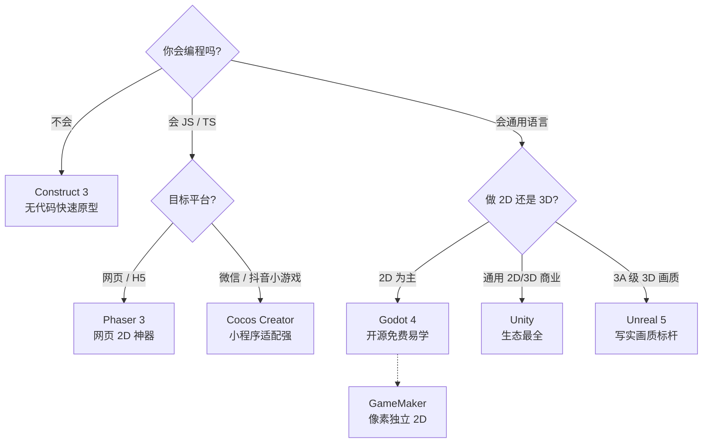
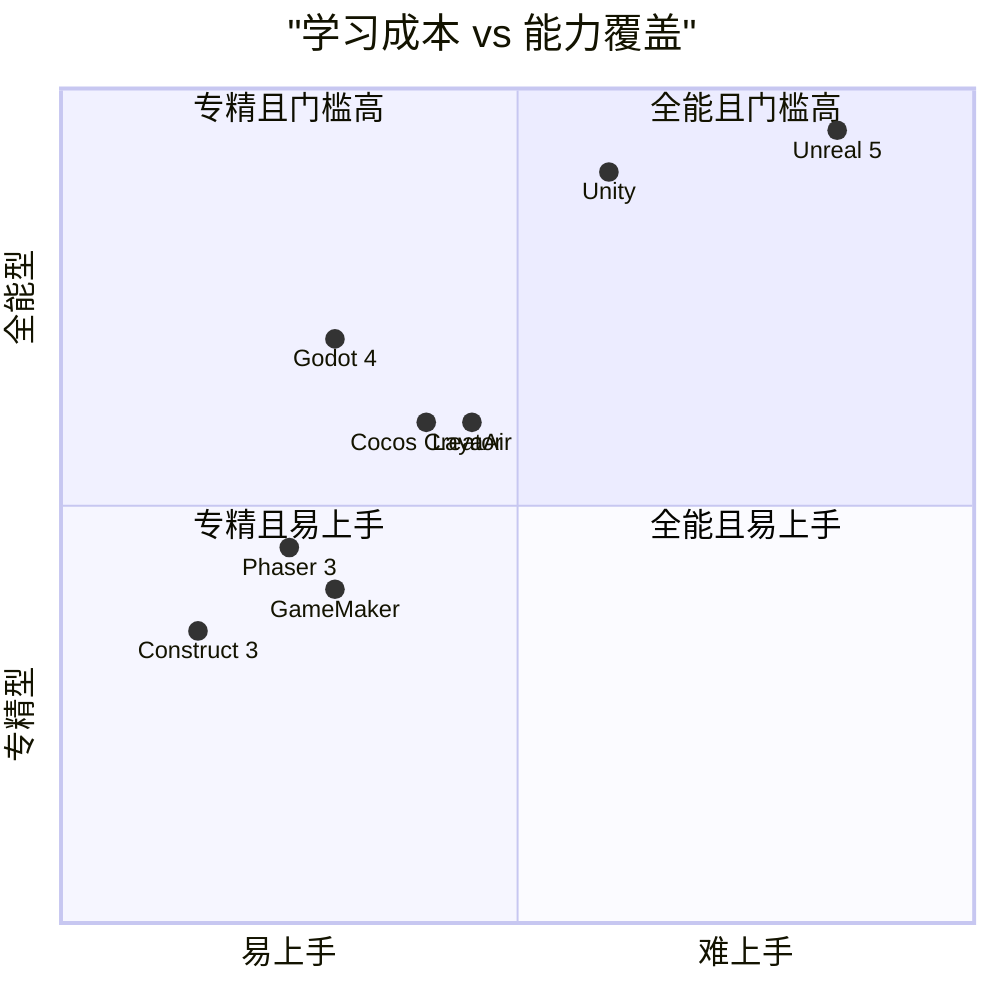

> 覆盖 8 款主流引擎，从开发语言、授权费用、2D/3D 能力、目标平台、学习曲线到生态资源全面对比。评分基于公开资料与社区共识，含主观判断，仅供选型参考。

## 一、选型看哪些维度

- **① 开发语言**：JS/TS 适合网页派；C# 门槛适中；C++ 性能强但陡峭；无代码更适合零基础。
- **② 授权与费用**：开源免费（Godot / Phaser）最省心；Unity 订阅、Unreal 抽成，上线后都要算账。
- **③ 2D / 3D 能力**：2D 多数引擎都强；3D 差距大，Unreal / Unity 领跑，Godot 4 进步明显。
- **④ 目标平台**：纯网页 H5、微信小游戏、PC、手机 App、主机——覆盖度直接影响发行。
- **⑤ 学习曲线**：无代码与 GDScript 上手快；C++ / 蓝图体系需要时间沉淀。
- **⑥ 生态与资源**：教程、插件、素材商店的多寡，决定你卡壳时能不能自救。

## 二、综合对比表

| 引擎 | 定位 | 开发语言 | 授权 / 费用 | 2D | 3D | 主要平台 | 学习曲线 | 最适合 |
|---|---|---|---|---|---|---|---|---|
| **Godot 4** | 开源通用 2D/3D | GDScript / C# | 完全免费 (MIT) | ★★★★★ | ★★★☆☆ | 全平台（含网页/移动） | 平缓 | 独立开发者、2D、免授权费 |
| **Unity** | 通用商业 2D/3D | C# | 个人免费；订阅制 | ★★★★☆ | ★★★★☆ | 全平台 | 中等 | 跨平台商业游戏、3D、手游 |
| **Unreal 5** | 3D 画质标杆 | C++ / 蓝图 | 免费；抽成 5% | ★★★☆☆ | ★★★★★ | 全平台（PC/主机强） | 较陡 | 3A 级 3D、写实画质 |
| **Phaser 3** | 网页 2D | JS / TS | MIT 免费 | ★★★★★ | ★★☆☆☆ | 网页 / H5 为主 | 平缓 | H5 小游戏、网页游戏 |
| **Cocos Creator** | 国产 2D/3D | JS / TS | 免费 | ★★★★☆ | ★★★☆☆ | 全平台（小程序强） | 中等 | 微信/抖音小游戏、H5 |
| **Construct 3** | 无代码 2D | 事件表（无代码） | 订阅制 | ★★★★☆ | ★★☆☆☆ | 网页/桌面/移动 | 极易 | 零基础快速原型 |
| **GameMaker** | 2D 独立 | GML | 买断 / 订阅 | ★★★★☆ | ★★☆☆☆ | 桌面/移动/网页 | 平缓 | 像素 / 独立 2D |
| **LayaAir** | 国产 2D/3D | TS / JS | 免费 | ★★★★☆ | ★★★☆☆ | 全平台（小游戏强） | 中等 | 国内小游戏、3D H5 |

## 三、六维能力评分（满分 5）

| 引擎 | 2D 能力 | 3D 能力 | 易上手 | 生态资源 | 跨平台 | 免费度 |
|---|---|---|---|---|---|---|
| Godot 4 | 5.0 | 3.5 | 4.5 | 3.5 | 4.5 | 5.0 |
| Unity | 4.5 | 4.5 | 3.5 | 5.0 | 5.0 | 3.5 |
| Unreal 5 | 3.0 | 5.0 | 2.5 | 4.5 | 5.0 | 4.0 |
| Phaser 3 | 5.0 | 1.5 | 4.0 | 4.0 | 3.5 | 5.0 |
| Cocos Creator | 4.5 | 3.5 | 3.5 | 3.5 | 4.5 | 4.5 |
| Construct 3 | 4.5 | 2.0 | 5.0 | 3.0 | 3.5 | 2.5 |
| GameMaker | 4.5 | 2.0 | 4.0 | 3.5 | 4.0 | 3.0 |
| LayaAir | 4.0 | 3.5 | 3.0 | 3.0 | 4.0 | 4.5 |

## 四、引擎速览

- **Godot 4**：开源通用 2D/3D。GDScript 易学、体积小、无授权坑。最适合独立开发者、2D 游戏、想免授权费长期用的人。
- **Unity**：通用商业 2D/3D。C#、生态最全、教程最多、手游强势。最适合跨平台商业游戏、3D、手机游戏。
- **Unreal 5**：3D 画质标杆。C++ / 蓝图，PC/主机生态强，营收超门槛抽成 5%。最适合 3A 级 3D、追求极致画质。
- **Phaser 3**：网页 2D。JS/TS、MIT 免费、纯前端。最适合 H5 小游戏、网页游戏、前端开发者。
- **Cocos Creator**：国产 2D/3D。JS/TS、免费，国内小程序适配最省心。最适合微信/抖音小游戏、H5 发行。
- **Construct 3**：无代码 2D。事件表、浏览器内即可开发、上手极快。最适合零基础、快速验证想法。
- **GameMaker**：2D 独立。GML、轻量迭代快。最适合像素风、独立 2D 游戏。
- **LayaAir**：国产 2D/3D。TS/JS、免费，国内小游戏生态好。最适合国内小游戏、3D H5。

## 五、选型决策树

提示：Godot 也支持 C#；Phaser 偏网页，跨原生需打包；预算敏感优先开源免费方案。

## 六、能力覆盖 vs 学习成本（象限图）

## 七、一句话总结建议

| 你的身份 | 首选引擎 | 理由 |
|---|---|---|
| 零基础 / 想快速出活 | **Construct 3** | 拖拽事件表，浏览器里就能跑，半天见成果 |
| 前端开发者 | **Phaser 3** | JS/TS 直接上手，最契合网页技术栈 |
| 想长期学、免授权费 | **Godot 4** | 开源免费、体积小、GDScript 易学且越来越强 |
| 奔着上线赚钱 / 3D | **Unity**（通用）或 **Unreal 5**（极致画质） | 生态与发行最成熟 |
| 国内小程序发行 | **Cocos Creator** / **LayaAir** | 小程序适配最省心 |
| 独立像素 2D | **GameMaker** | 轻量、迭代快，独立神作常客 |
