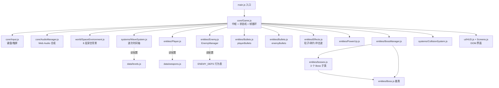
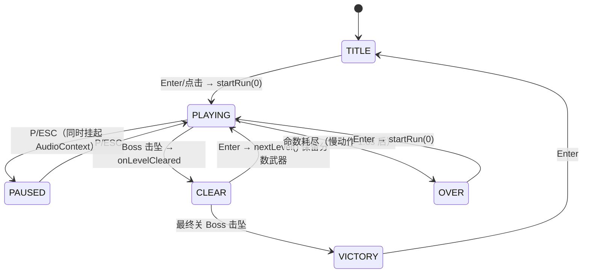
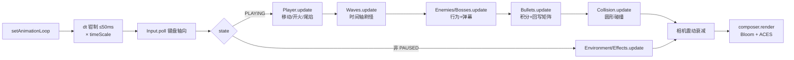
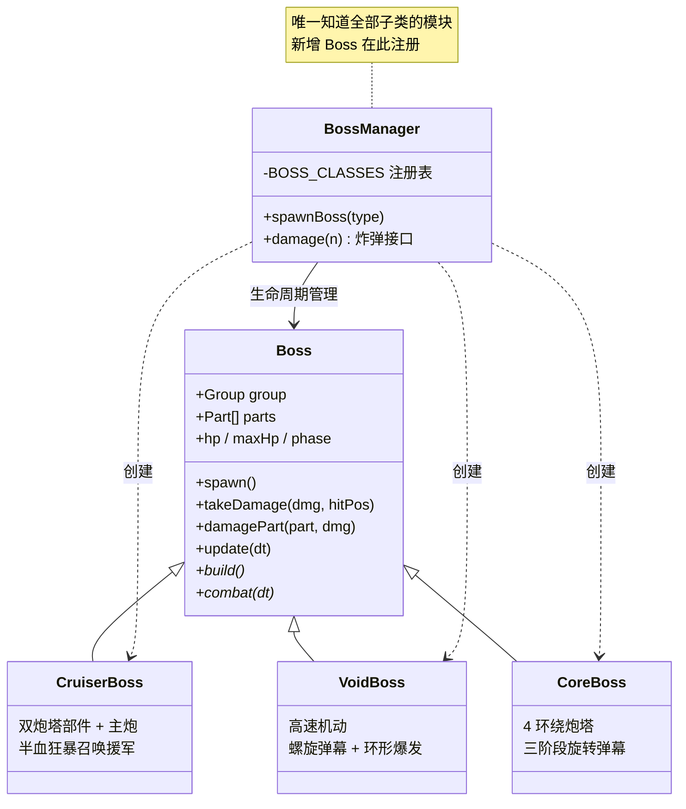
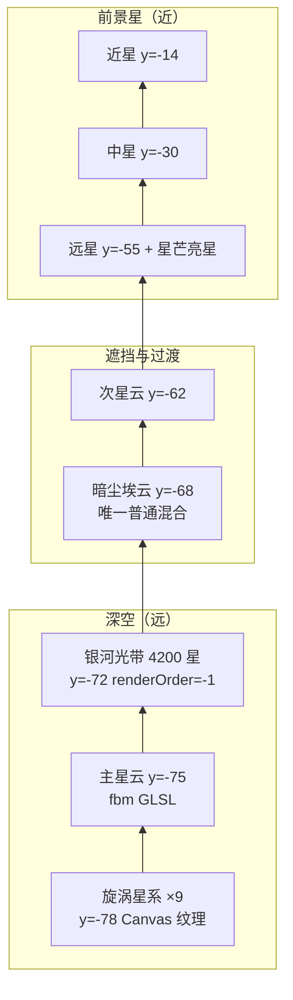
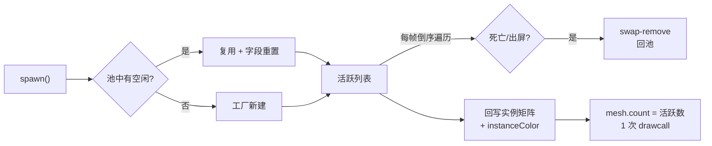
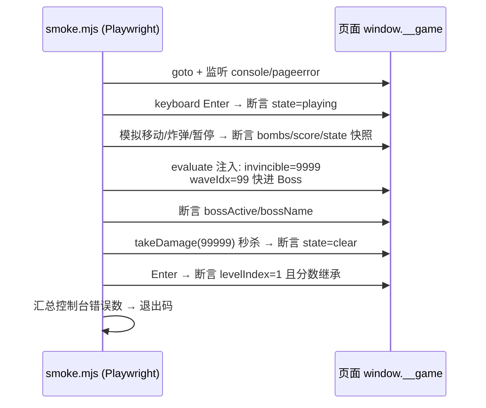

经典雷电纵向卷轴 × 全 3D 画面的太空射击游戏。纯 Three.js 打造，所有模型与音效均为程序化生成，零外部资源依赖。

公元 2249 年，外星机械军团「湮灭舰队」入侵人类深空殖民地。驾驶最新型战机「雷电-X」，穿越碎石星环与幽灵星云，直捣湮灭母舰。


## 运行

```bash
npm install
npm run dev      # 开发模式（默认 http://localhost:5173）
npm run build    # 产出静态文件到 dist/
npm run preview  # 预览构建产物
```

## 操作

| 按键 | 功能 |
|---|---|
| WASD / 方向键 | 移动 |
| （自动射击） | 武器持续开火 |
| B / 空格 | 炸弹（清屏弹幕 + 全屏伤害） |
| P / ESC | 暂停 |
| ENTER / 点击 | 确认 / 开始 |

移动端：触屏拖动移动，点击开始。

## 玩法

- **三大关卡**：碎石星环（小行星带）→ 幽灵星云（离子风暴）→ 湮灭母舰（甲板网格），每关末尾有多阶段 Boss 战
- **双武器系统**：红色「火神炮」扇形范围输出 / 蓝色「激光」穿透高伤，各 1–5 级，拾取同色能量体升级
- **道具**：P 火力提升、R/L 武器切换、B 炸弹、S 能量护盾、1UP 奖命、◆ 勋章加分
- **敌机 5 种**：侦察机 / 截击机（正弦机动）/ 炮艇（悬停炮击）/ 轰炸机（环形弹幕）/ 精英机（侧翼突袭）
- **Boss**：哨戒巡洋舰（可破坏双炮塔）→ 虚空拦截者（螺旋弹幕）→ 湮灭核心（三阶段最终形态）
- 死亡掉一级火力；通关保留武器与分数，挑战最高分（localStorage 持久化）


## 技术要点

- **Three.js + Vite**，UnrealBloomPass 泛光后期，ACES 色调映射
- **程序化建模**：所有飞船由几何体组合 + 自发光材质构成（`src/entities/ShipFactory.js`）
- **程序化音频**：Web Audio API 合成全部音效与琶音 BGM（`src/core/AudioManager.js`），零音频文件
- **性能**：子弹/粒子使用 `InstancedMesh` + 对象池，单 drawcall 渲染；星空/星云为自定义 GLSL 着色器
- **数据驱动**：关卡波次（`src/data/levels.js`）与武器配置（`src/data/weapons.js`）均为纯数据，易于扩展新关卡
- **冒烟测试**：`node scripts/smoke.mjs`（需先启动 dev server，端口 5199）

## 目录结构

```
src/
├── core/        游戏主控(Game)、输入、音频、对象池
├── world/       太空环境（星空/星云/行星/小行星/母舰甲板）
├── entities/    玩家、敌机、Boss、子弹、道具、特效、程序化建模
├── systems/     碰撞、波次
├── data/        关卡波次与武器配置
└── ui/          HUD 与界面
```

---

> 架构设计与开发实践总结

## 1. 架构设计

### 1.1 总体结构：中枢辐射式（Hub & Spoke）

`Game` 是唯一中枢，持有所有子系统实例；子系统之间不互相 import，全部通过构造时注入的 `game` 引用协作。这从根本上杜绝了循环依赖的蔓延（对比：观察者/事件总线会多一层间接性，对这个规模的项目不划算）。



### 1.2 游戏状态机

状态切换集中在 `Game` 中，UI 只负责展示。延时动作（死亡重生、过关）用单槽 `_pendingAction` + 真实时间推进（慢动作 `timeScale` 不影响节奏）。



### 1.3 帧循环数据流

渲染永远进行（暂停时画面冻结但 Bloom/相机仍渲染），逻辑按状态分流。非战斗状态下子弹与特效继续更新，画面不会"死"。



### 1.4 Boss 三文件结构（防循环导入）

基类、子类、管理器必须分属三个文件——这是踩过坑后定下的硬结构（详见 [5.1](#51-esm-循环导入-tdz)）。



### 1.5 背景层叠：深度 + 渲染顺序的双重控制

透明对象按深度自动排序，但「暗尘埃遮挡银河」需要一个普通混合的遮挡层插在加色混合层中间。银河点云的对象坐标在原点（排序距离被视为最近），必须显式 `renderOrder = -1` 压到尘埃之前（详见 [5.3](#53-透明排序与点云的渲染陷阱)）。



---

## 2. 关键技术决策与权衡

### 2.1 约定优于配置：全项目统一坐标/角度约定

| 约定 | 值 |
|---|---|
| 玩法平面 | XZ（X=横，Z=纵），逻辑全部 2D，y 仅视觉分层 |
| 玩家前向 | -Z（屏幕上方）；敌机朝 +Z |
| 子弹角度 | `angle=0 → -Z`；`vx=sin(a)·v, vz=-cos(a)·v` |
| 瞄准公式 | `atan2(dx, -dz)` |
| 边界 | `game.bounds` 单一来源 |

**收益**：所有武器配置、敌机弹幕、Boss 弹幕模式共用一套数学，写新弹幕时不用思考方向问题。**代价**：约定必须在文档里写死（已进 CLAUDE.md），否则新人极易写出方向相反的子弹。

### 2.2 数据驱动内容，代码驱动机制

关卡、武器、敌机行为全部是纯数据；引擎代码（WaveSystem / Enemy）只解释数据。

```js
// data/levels.js —— 加一关不需要碰任何引擎代码
{ t: 33.0, type: 'bomber', n: 1, gap: 0, pattern: 'single', x: 0 }
```

```js
// Enemy.js ENEMY_DEFS —— 行为是数据的组合，不是子类
gunboat: { move: 'hover', fire: { type: 'spread', n: 3, fan: 40, period: 2.3 } }
```

**收益**：调平衡、加内容零风险；策划向的修改不会引入引擎 bug。**边界**：Boss 的多阶段逻辑太独特，仍用代码（子类 `combat()`）表达——数据驱动只推到「组合能表达」为止，再往前就是发明一门烂 DSL。

### 2.3 UI 用 DOM，游戏用 WebGL

HUD、菜单、Boss 血条全部是 HTML/CSS，浮在 canvas 上。没有用 three.js 做文字（SpriteText/纹理字）。

**收益**：文字渲染清晰、CSS 动画（霓虹脉冲、闪烁）免费、响应式免费、开发速度快。**代价**：HUD 与游戏世界无法做 3D 交互——本作不需要。

### 2.4 状态机 > 布尔标志

`state` 单字段枚举（title/playing/paused/over/clear/victory），所有输入处理先查状态。早期没有状态机时，「标题界面按 B 触发炸弹」这类 bug 会层出不穷；状态机让每条输入路径都显式。

---

## 3. 性能工程实践

### 3.1 对象池 + InstancedMesh：弹幕游戏的命脉

弹幕游戏每帧数百发子弹 + 上千粒子，两条铁律：

1. **热循环零分配**——`new`、数组字面量、临时 Vector3 全部禁止；
2. **单 drawcall 渲染**——同外观对象合并进一个 `InstancedMesh`。



关键点：

- **swap-remove 必须倒序遍历**，否则跳过元素（详见 [5.5](#55-swap-remove-与遍历顺序)）；
- 实例颜色用 `setColorAt` 每帧随矩阵一起回写，避免多 mesh；
- `instanceMatrix.setUsage(THREE.DynamicDrawUsage)` + 手动 `needsUpdate`。

### 3.2 粒子用 SoA（Structure of Arrays）

特效粒子 1600 个，不用对象数组，用平行 `Float32Array`（px/py/pz/vx/vy/vz/life/...）：

```js
// 回收 = 与末尾元素交换 + 计数减一，O(1) 且无内存抖动
const j = --n;
if (i !== j) { this.px[i] = this.px[j]; /* ...全字段拷贝... */ }
```

**收益**：缓存友好的顺序写、无 GC 压力、属性直接映射到 GPU BufferAttribute（`aPos/aCol/aSize` 每帧原地上传）。

### 3.3 背景点云：一次分配，永久复用

5500 颗星星（3 视差层 + 银河带 + 星芒亮星）共享一个模式：构造时分配 BufferAttribute，每帧 CPU 推进 z 坐标、出界回卷。**回收时保持分布结构**——银河带星星回卷必须按光带公式重新生成 x/z，不能均匀随机，否则几分钟后光带结构被"洗没"（`StarLayer.onRespawn` 回调）。

### 3.4 其他手段

- `renderer.setPixelRatio(min(devicePixelRatio, 2))`——Retina 3x 是性能黑洞；
- 动态光源池化（4 盏爆炸光 + 4 盏环），衰减到 0 的灯 `intensity=0` 而不是增删；
- 敌机/Boss 复用几何体组合，按类型池化（`Map<type, Enemy[]>`）；
- 音效限流（激光音最小间隔 45ms），防止刺耳叠加与节点爆炸。

---

## 4. 程序化生成策略（零资源管线）

整个游戏没有任何图片/模型/音频文件，全部运行时生成：

| 内容 | 技术 | 位置 |
|---|---|---|
| 战机/敌机/Boss | 几何体组合 + 自发光材质 | `ShipFactory.js` / `bosses.js` |
| 星云/尘埃/甲板网格 | 自定义 GLSL（fbm 噪声） | `SpaceEnvironment.js` |
| 旋涡星系 | Canvas 绘制对数螺线撒点 → CanvasTexture | 同上 |
| 道具字母牌 | Canvas 文字发光 → CanvasTexture（按类型缓存） | `PowerUp.js` |
| 音效 | Oscillator + 滤波噪声（激光/爆炸/拾取） | `AudioManager.js` |
| BGM | 16 步进琶音调度器（lookahead scheduling） | 同上 |

**为什么值得**：

1. **零版权风险、零加载时间、零资源体积**（构建产物 145KB gzip，几乎全是 three.js）；
2. **参数即资产**——星云换色 = 改主题表里两个 Color；美术调整可以走 code review；
3. **风格天然统一**——程序化噪声/发光管线的观感一致性比拼凑素材强得多。

**代价**：写 GLSL/Canvas 代码比拖素材慢；复杂角色（人脸、机械细节）做不到。对本作的霓虹未来风，收益远大于代价。

---

## 5. 踩坑记录

### 5.1 ESM 循环导入 TDZ

- **现象**：页面白屏，`Cannot access 'Boss' before initialization`。
- **根因**：`Boss.js`（基类+管理器）→ import `bosses.js`（子类）→ import `Boss.js`（基类）。模块图成环，`class CruiserBoss extends Boss` 在 `Boss` 初始化前求值。
- **解法**：拆三文件——基类 / 子类 / 管理器（唯一同时依赖两者的模块）。
- **经验**：**"注册表"模式是循环导入的高发区**。凡是 A 持有 B 的注册表、B 又继承 A 的结构，把注册表独立成第三个模块。

### 5.2 雾效吞掉远景

- **现象**：第 1 关的行星完全看不见。
- **根因**：`Fog(55, 160)` 而行星距相机 ~150，雾因子 0.9。
- **解法**：行星材质设 `fog: false`；同时接受小行星被雾半遮（反而成了"从雾中浮现"的免费效果）。
- **经验**：加全局效果（雾/泛光/色调映射）后，**逐个确认每类对象受影响的方式**，ShaderMaterial 默认不吃雾、标准材质默认吃——混用时行为分裂。

### 5.3 透明排序与点云的渲染陷阱

- **现象**：暗尘埃云无法遮挡银河带。
- **根因**：three.js 透明对象按「对象原点」到相机距离排序。银河点云坐标烘焙在世界系、对象在原点 → 被视为最近 → 最后画，压过尘埃。
- **解法**：银河 `renderOrder = -1` 显式提前；尘埃保持默认 0。
- **经验**：**大 BufferGeometry 烘焙世界坐标的点云，排序键是对象原点不是内容**。涉及遮挡关系时务必检查 renderOrder。

### 5.4 穿透弹重复命中

- **现象**：蓝激光一发子弹把同一个敌机连扣数次血，穿透形同秒杀。
- **根因**：子弹穿透后下帧仍与同一敌机重叠。
- **解法**：子弹携带 `hitIds: Set`（仅穿透弹惰性创建），命中记录目标 id。
- **经验**：穿透/持续伤害类判定，"谁已经被打过"是必需状态，不能只看几何重叠。

### 5.5 swap-remove 与遍历顺序

- **现象**：偶发子弹"漏网"一帧不移动。
- **根因**：正序遍历 + swap-remove：尾部元素换到当前位置后被跳过。
- **解法**：所有「遍历中删除」的循环一律倒序。
- **经验**：把「倒序遍历」写成团队肌肉记忆，比 Code Review 抓漏更可靠。

### 5.6 后台起 dev server 的 SIGPIPE

- **现象**：`npx vite | head -5` 起的服务几秒后神秘退出。
- **根因**：head 读满 5 行关闭管道，vite 写日志触发 SIGPIPE。
- **解法**：后台任务不要接 `head`；要限量输出就重定向到文件再 tail。

### 5.7 其他小坑（一条过）

- **AudioContext**：浏览器自动播放策略，必须等首次用户手势后 `init()`/resume——放在 `startRun()`（Enter/点击触发）里最自然；
- **localStorage**：隐私模式抛异常，读写都包 try/catch；
- **Boss 子类字段**：`super()` 里调 `build()` 时子类字段（name/maxHp）尚未赋值——`build()` 只用局部常量，字段在 `spawn()` 时才被消费，错开生命周期即可；
- **竖屏视野**：竖屏时按竖直 FOV 算出的横向视野不足，按目标战场宽度反推相机距离（`_onResize` 里的 `fitWidth` 逻辑）；
- **emoji 横幅**：`banner('⚠', ...)` 这类符号在部分字体下渲染为方框，重要文案必须给中文副标题兜底。

---

## 6. 测试与验证方法论

游戏没有单元测试——对强视觉、强时序的项目，ROI 最高的是**浏览器全流程冒烟测试 + 截图目检**。

### 6.1 冒烟测试架构



三个关键设计：

1. **`window.__game` 调试钩子**——main.js 里一行 `window.__game = game`，让测试可以注入状态（无敌、快进波次、直接秒杀 Boss），把 3 分钟的关卡压缩到 20 秒；
2. **快照断言而非像素断言**——`{ state, score, enemies, bombs }` 结构快照，稳定且语义明确；
3. **控制台错误即失败**——任何 console.error/pageerror 都让退出码非零。

### 6.2 视觉验证：截图目检驱动迭代

游戏手感/美观无法断言，只能看。工作流：固定视口截图 → 目检 → 改代码 → 再截。本项目中被截图驱动修掉的问题：Boss 材质太暗（加随身点光）、甲板网格过曝（降密度降亮度）、巡洋舰首尾装反（换引擎/舰首位置）、星空单调（整个背景重写）。

`scripts/shot-boss.mjs <type>` 等脚本把「到达指定画面」也参数化了，一次截图成本 < 15 秒——**反馈环越短，视觉打磨越多**。

---

## 7. 可复用清单

下次做同类项目，直接照抄的决策：

- ✅ 中枢辐射式架构 + 构造注入，禁止反向 import
- ✅ 状态机枚举先行，输入按状态分流
- ✅ 子弹/粒子：InstancedMesh + 对象池 + 倒序 swap-remove，热循环零分配
- ✅ 内容数据化（波次/武器/敌机行为表），机制代码化（Boss）
- ✅ 统一坐标/角度约定并写进项目文档
- ✅ UI 用 DOM，游戏用 WebGL，各司其职
- ✅ 零资源程序化管线（GLSL + Canvas + Web Audio）
- ✅ `window.__game` 调试钩子 + Playwright 冒烟 + 截图目检
- ✅ 注册表独立成第三模块，避免继承环

需要更早做的（这次后知后觉）：

- ⚠️ 视觉检查应该纳入每个里程碑的验收标准，而不是最后补（Boss 太暗问题本可提前两轮发现）
- ⚠️ 全局渲染效果（雾/Bloom）启用时，立刻列出受影响对象清单逐一确认
