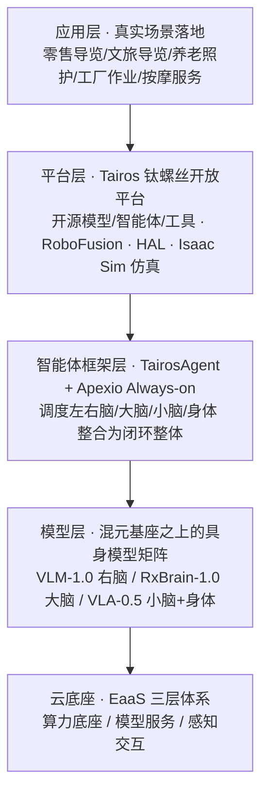
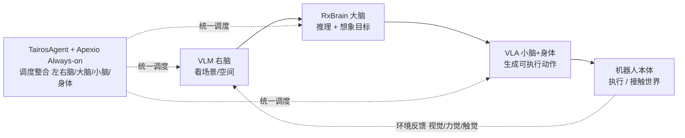
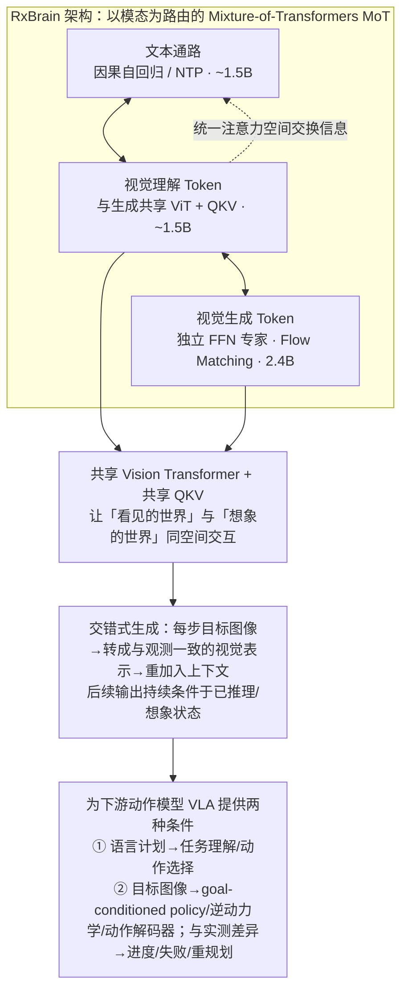
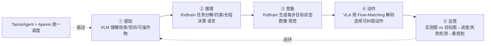

> WAIC 2026 腾讯 AI 应用创新论坛 · 首次系统性打通「感知—身体—行动」闭环
>
> 资料来源：腾讯官方发布稿、腾讯云开发者社区技术文章、Robotics X 实验室 & 福田实验室 & 腾讯混元联合发布内容（2026-07）

## 核心理念

腾讯首席科学家张正友提出：今天最聪明的人工智能本质是「缸中之脑」——善于逻辑、文本与问答，却缺少与物理世界直接互动的闭环。真正的智能要让 **语言、视觉、空间认知、身体控制和环境反馈** 在「感知—身体—行动」闭环里接受验证。

本次发布的五项成果，体现了腾讯「**从离身走向具身、从分裂模块走向整体闭环**」的探索思路：三个基座模型 + 一个智能体框架 + 一个 Always-on 智能体 + 升级的开源平台 + 云端 EaaS 服务。

---

## 一、全栈四层架构总览

整套方案贯穿四个层级，从下到上分别是 **云底座 → 模型层 → 智能体框架层 → 平台层**，最上层是零售导览、养老照护、工厂作业等真实应用，形成「数据/算力 → 模型 → 调度 → 本体 → 反馈」的完整链路。

**云底座 EaaS 三层体系明细：**

| 层级 | 关键组件 | 作用 |
|------|----------|------|
| 算力底座 | GPU/HCC 万卡集群 · 星脉网络 · COS / GooseFS | 支撑万卡级稳定训练、海量多模态数据存储与高速读取 |
| 模型服务 | TI-ONE 训练推理平台 · TokenHub（MaaS 调度） | 模型训练/精调/评测，按量推理调度 |
| 感知交互 | TRTC 实时音视频 · TRRO 远程实时操控 · 视图计算 · MPS · 智能标注 · 语音交互 | 覆盖数据采集、传输到理解交互的完整感官链路 |

---

## 二、拟人脑映射：三个模型如何分工协作

三个模型都基于 **腾讯混元大模型** 打造，官方形象地将其映射为「左右脑 + 大脑 + 小脑 + 身体」：

| 拟人角色 | 模型 | 核心职责 | 关键能力 / 数据 |
|----------|------|----------|-----------------|
| 🟠 右脑 | **Hy-Embodied-VLM-1.0** | 感知：看懂图像、空间关系、场景 | 仅约 **1/10 算力**即逼近上代旗舰性能；语言-视觉-空间联合理解，构建层次化信息与具身记忆 |
| 🟣 大脑 | **Hy-Embodied-RxBrain-1.0** | 认知推理 + 对未来状态的想象（goal） | 首创「文本推理 × 视觉想象」协同；基于 **5w+ 小时**具身数据；约 6.2B 参数 |
| 🔵 小脑+身体 | **Hy-Embodied-VLA-0.5** | 把高层目标转成连续、可纠错的动作 | 视觉-语言-动作统一建模；超 **1 万小时**人类示教数据；RoboDojo 仿真综合第一 |

> **为什么需要三个模型而不是一个？** 单一 VLA 把「理解、推理、想象、动作」强行塞进一个模型时，目标物理状态往往是 **隐式的**，还需要额外世界模型/价值模型判断结果；而纯 World Model 又难以显式表达任务逻辑。腾讯的分工是让每个部件各司其职、再通过智能体框架闭环整合。

---

## 三、模型层技术原理详解

### 3.1 VLM-1.0「右脑」· 高效感知

- **定位**：多模态感知模型，实现 **语言-视觉-空间联合理解**，构建层次化信息与具身记忆。
- **核心卖点**：依托混元基座的高效架构，仅用约 **1/10 算力**即达到上一代旗舰感知模型的性能——对机器人本体端侧/边缘部署意义重大（更低延迟、更低功耗）。
- 它同时是下游 RxBrain 的基座（RxBrain「依托 Hy-Embodied-VLM 系列基座开发」）。

### 3.2 RxBrain-1.0「大脑」· 会推理且会想象（最核心创新）

机器人进入开放环境后，不仅要知道「下一步做什么」，还要理解「为什么这样做」和「完成后世界应该变成什么样」。RxBrain 把 **文本推理** 与 **视觉想象** 在一条连续认知序列中协同发生。

**关键技术细节：**

- **模态路由 MoT**：文本、输入视觉、生成视觉 Token 路由到各自专用计算路径，但在统一注意力空间交换信息。视觉理解 Token 与生成 Token **共享同一个 ViT 与 QKV 投影**，使「看见的世界」和「想象的世界」能在同一视觉表示空间交互；又通过独立 FFN 专家保留各自的专门计算。
- **两种生成范式共存**：文本用 Causal Attention + Next-Token Prediction；图像/未来帧在连续 VAE Latent 中通过 **Flow Matching** 生成（帧内双向注意力建空间结构，跨帧保持因果时序）。
- **数据建设**：预训练用 **50,177 小时**操作数据（第一视角/UMI 31,568h、真实机器人 17,292h、仿真 1,317h；开源 28,597h，约 57%）。自动视频分割流水线把长视频转成带动作描述/起止状态/时间边界的原子动作序列，构建 **约 2.1 亿条** 训练样本，分 L0 连续状态想象 / L1 原子动作 / L2 子任务 / L3 最终目标四档粒度；Mid-train 再加 3,500 万条空间推理、因果推断、三维感知等能力数据。
- **评测**：自建 RxBrain-Bench，统一联合具身规划综合分 **0.68**，高于 Cosmos3-Nano Agent（0.521）、BAGEL-7B-MoT（0.503）、Qwen-Agent（0.431）；文生图 GenEval 82.4，逼近专用生成模型 BAGEL（82）。
- **扩展到动作（Action MoT）**：为验证认知能否转成控制，腾讯在 RxBrain 上扩展动作生成分支——动作 Token 有独立注意力投影/FFN/归一化，仍参与全局注意力（可同时获得观测、指令、未来目标条件）；由视觉理解分支初始化，并设计 **Gated Expert Fusion**（门控初始为零，训练后自主学习从生成专家复用世界状态预测特征）。

> ✅ **真机验证**（DOBOT X-Trainer、方舟无限 A5 机械臂）：摆餐具 97%、折叠收纳眼镜 95%、丢垃圾 68%，平均 **87%**；对比 π0 的 68%、π0.5 的 82%。证明「视觉想象」不是炫技展示，而是能被动作模型实际利用的中间认知表示。

### 3.3 VLA-0.5「小脑+身体」· 视觉-语言-动作统一建模

- **定位**：把 RxBrain 给的高层目标 + VLM 给的感知，转成 **连续、可纠错** 的机器人动作。
- **架构（Hy-Embodied-0.5 MoT 骨干）**：VLM 塔继承 Hy-Embodied-0.5 的 Mixture-of-Transformers——视觉 Token 与语言 Token 各走自己的参数子集，只在共享 self-attention 做跨模态交互；视觉编码器用 **Hy-ViT 2.0**（原始分辨率编码，不做固定 crop）。
- **双塔 Flow-Matching Action Expert**：与 π0 系列、OpenVLA 的根本区别——不把动作离散化成语言 token，而是单独训练一个约 **370M** 参数的动作专家塔，用 conditional flow matching 建模连续动作分布。
- **跨具身迁移**：用 `delta-chunk` 动作表示把动作从具体运动学参数解耦，同一策略可换不同形态机器人使用。
- **长时序记忆**：用 parameter-free 时序-空间注意力做 compact memory encoder，把 K 帧历史压缩进当前帧 token，不涨参数量（解决「刚才放哪了」类记忆问题）。
- **数据**：超 1 万小时高质量人类示教（开源 2000+ 小时，指尖 UMI + 光学动捕采集方案）。
- **实际落地**：已进入某日化工厂生产实测——高混合/小批量/SKU 频繁迭代产线，作业成功率 >95%、节拍 <6 秒/件，新增一个 SKU 的数据采集+后训练 <3 天。

> ⚠️ **诚实的边界**：在更严苛的第三方 RoboDojo「珠峰级」评测中，Hy-Embodied-0.5-VLA 虽位列 **仿真综合第一（均分 13.07 / 成功率 8.80%）**，但整体仍远低于人类专家（76% / 80.42 分）。泛化、精细控制、长程、开放语义仍是全行业短板——这是行业现状，非腾讯独有。

---

## 四、智能体框架层：TairosAgent + Apexio

三个模型各自擅长一块，**TairosAgent（具身原生智能体框架）** 与 **Apexio（Always-on 具身智能体）** 负责把「左右脑、大脑、小脑、身体」调度整合成完整系统，让机器人成为「持续感知 → 持续决策 → 持续行动」的整体。

- **TairosAgent**：具身原生的智能体框架，提供任务编排、长程规划、工具调用、失败重规划等调度能力，是连接模型与本体之间的「操作系统层」。
- **Apexio**：Always-on（常驻）智能体，强调机器人不止于「单次响应」，而是持续在线地感知环境、维持状态、主动决策。

---

## 五、平台层：Tairos（钛螺丝）升级 + 开源

- 2025 年发布，2026 年 WAIC 全面升级并 **保持开源开放**，继续提供模型、智能体、开发工具与服务，降低「模型 → 本体 → 应用」全链条门槛。
- **RoboFusion「一线连接」**：Robotics X 与福田实验室联合研发，从总线物理接口到通信协议的全栈互连体系，解决传统机器人布线复杂、扩展难、实时性不足等痛点，为「软件定义机器人」奠定通用开放底层。
- **云端仿真**：基于 Isaac Sim，免配置一键直达；提供 62 类通用物体仿真 + 20 种平滑交互动画，支持自定义机器人导入及智能体导航交互；可实时验证规划大模型/感知模型/感知行动联合大模型在仿真中的运行。

---

## 六、云底座层：EaaS（Embodied-AI-as-a-Service）

腾讯云提出业内首个云端 **EaaS**，并搭建「算力底座 → 模型服务 → 感知交互」三层体系，把具身智能从技术研发推向规模商用（详见上方总览表）。

> 腾讯云的明确定位：**不参与硬件竞争，专注平台能力**——一端连接本体/算法/场景方，另一端连接制造、文旅、零售、服务等行业客户，帮企业把精力放在本体能力、应用逻辑与行业 know-how 上，而非重复建设基础设施。

---

## 七、端到端：一个任务怎么跑完

整个调度由 **TairosAgent + Apexio** 驱动，开发与部署跑在 **Tairos 平台 + 腾讯云 EaaS** 之上。模型持续从真实反馈中回流数据，形成「数据闭环 → 模型迭代 → 性能提升」的正循环。

---

## 八、开源地址（可直接获取）

- Hy-Embodied-VLM-1.0：[github.com/Tencent-Hunyuan/HY-Embodied](https://github.com/Tencent-Hunyuan/HY-Embodied) · [HF: tencent/Hy-Embodied-VLM-1.0](https://huggingface.co/tencent/Hy-Embodied-VLM-1.0)
- Hy-Embodied-RxBrain-1.0：[github.com/Tencent-Hunyuan/Hy-Embodied-RxBrain-1.0](https://github.com/Tencent-Hunyuan/Hy-Embodied-RxBrain-1.0) · [HF: tencent/Hy-Embodied-RxBrain-1.0](https://huggingface.co/tencent/Hy-Embodied-RxBrain-1.0)
- Hy-Embodied-VLA-0.5：[github.com/Tencent-Hunyuan/Hy-Embodied-0.5-VLA](https://github.com/Tencent-Hunyuan/Hy-Embodied-0.5-VLA) · 数据集 [HF: tencent/Hy-Embodied-0.5-VLA-Data](https://huggingface.co/datasets/tencent/Hy-Embodied-0.5-VLA-Data)
- Tairos 平台：[tairos.tencent.com](https://tairos.tencent.com/)
