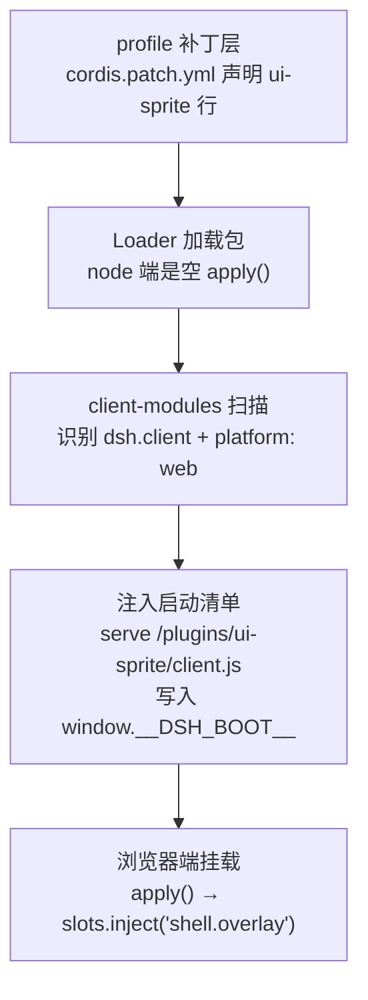

[**Spritely**](https://github.com/wang-junjian/spritely) 是一个跑在 [deepseek-harness](https://github.com/deepseek-ai/deepseek-harness) Web 界面里的浮动小精灵。它盯着 agent 的一举一动——待命、思考、写代码、调工具、等你确认、报错、收工——然后做出对应的表情和动作。眼珠会跟着你的鼠标转，可以被拖到任意角落，还能换角色、换背景。


这个项目完整走完了一条「dsh 客户端插件」的开发—独立化—分发链路，过程中踩了不少坑。这篇文章把三件事讲清楚：**它怎么工作、怎么开发、怎么安装**。

**项目地址**：[github.com/wang-junjian/spritely](https://github.com/wang-junjian/spritely)

---

## 一、它是什么，能做什么

一句话：**把 agent 的「内心活动」可视化**。agent 长时间跑任务时，你盯着终端只能看到文字流，很难一眼判断它现在在干嘛、是不是卡住了。Spritely 用一个小精灵把状态翻译成表情和动作。

| 能力 | 说明 |
|---|---|
| **四款可切换角色** | Blob 蓝球 / Bot 薄荷机器人 / Cat 猫咪 / Ghost 幽灵，各有独特造型 |
| **七种工作状态姿态** | 待命、思考、撰写、工作、等待、出错，以及收工时的短暂庆祝 |
| **眼珠跟随鼠标** | 瞳孔朝光标方向偏移（rAF 节流），角色更灵动 |
| **可拖拽 + 归位** | 拖到任意位置，一键回到默认角落 |
| **背景定制** | 纯色、渐变、图片 URL、本地图片上传；等比居中 / 全屏拉伸 + 淡化遮罩 |
| **科幻 HUD 风格** | 菜单和面板是深色全息配色 + 青色霓虹描边 |
| **持久化** | 角色、背景、位置刷新后保留（localStorage） |

所有能力都在客户端完成，不占 agent 的 token。

---

## 二、工作原理：dsh 的「一切皆插件」

deepseek-harness 的核心哲学是 **everything is a plugin**——界面上的每个组件（侧边栏、会话区、设置面板、工具树）都是一个插件，通过统一的 Cordis 内核组装起来。

Spritely 是一个 **`dsh.client` 双端插件**，这区别于更常见的 `dsh.bundle`：

- **node 端**（`src/index.ts`）：一个空的 `apply()`，只作为宿主加载器的入口，不提供任何宿主侧行为。
- **client 端**（`src/client/index.ts`）：真正的逻辑所在——注册组件、订阅状态、渲染精灵。

`package.json` 里通过 `dsh.client` 声明它是浏览器端插件，并列出它依赖的服务：

```json
{
  "dsh": {
    "client": {
      "platform": "web",
      "inject": [
        "@deepseek-ai/dsh-client-runtime",
        "@deepseek-ai/dsh-client-ui-layout",
        "@deepseek-ai/dsh-client-locale"
      ]
    }
  },
  "exports": {
    ".": { "default": "./lib/index.js" },
    "./client": { "default": "./lib/client.js" }
  }
}
```

关键的 `exports["./client"]` 指向浏览器端 bundle——这是 client 端被宿主发现的入口。

### 加载链路

从「声明」到「精灵出现在屏幕上」，一共五步：



第 3 步是整个机制的心脏：宿主端的 `client-modules` 插件会扫描 loader entries，找出所有声明了 `dsh.client` 且 `platform: "web"` 的包，把它们的 `client.js` 挂到 `/plugins/<id>/client.js` 路由，并把加载图注入 `window.__DSH_BOOT__`。浏览器端的内核据此加载 client 端。

而精灵本体挂在 `shell.overlay` 槽位上——这是 ui-layout 声明的、浮在所有界面层之上的图层：

```ts
ctx.slots.inject('shell.overlay', () => {
  const source = createSpriteStateSource(ctx.sessions)  // 订阅工作状态
  const background = createBackgroundSource()           // 背景状态
  const presenter = new BackgroundPresenter()
  presenter.apply(background.getSnapshot())
  background.subscribe(() => presenter.apply(background.getSnapshot()))
  return ctx.slots.register({
    name: 'shell.overlay',
    id: 'sprite',
    locale: NS,
    inject: () => ({
      hooks: { sprite: source, background },
      startSession: () => ctx.workspaces.startSession(),
      setBackground: value => background.set(value),
    }),
  }, SpriteMascot)
})
```

`inject` 返回的 face 很关键：`hooks` 是可观察状态源（组件用 `useXxx` selector 订阅），动作回调（`startSession`、`setBackground`）是组件触发的副作用。

---

## 三、开发实录：从 0 到 1

### 1. 姿态状态机

精灵的姿态不是随机动画，而是**由 agent 的真实工作状态驱动**。状态源订阅 sessions 服务，映射成七种姿态：

```ts
type SpriteActivity = 'idle' | 'thinking' | 'writing' | 'working' | 'waiting' | 'error'
type Pose = SpriteActivity | 'done'  // done 是收工时的短暂庆祝
```

每个姿态对应一组 SVG 表情——眼睛、嘴巴、装饰件（思考时冒齿轮、写代码时冒铅笔、出错时打叉眼、完成时笑成弧线）。这些表情语义是**共享**的，四款角色复用同一套姿态调度，只各自实现自己的身体和眼睛。

### 2. 眼珠跟随鼠标

这是最容易做「歪」的细节。坑在于：SVG 内部用的是自己的坐标系（viewBox `0 0 120 120`），而鼠标事件给的是屏幕像素坐标，两者直接相减会得出离谱的偏移。

正确做法是把光标坐标**投影到 viewBox 坐标系**，再算方向向量：

```ts
// 把光标投影到 SVG viewBox 坐标
const rect = svg.getBoundingClientRect()
const x = (clientX - rect.left) / rect.width * 120
const y = (clientY - rect.top) / rect.height * 120
// 相对眼睛中心的方向向量，归一化后乘以最大偏移量
const dx = x - 60
const dy = y - 66
const len = Math.hypot(dx, dy) || 1
setGaze({ x: dx / len * GAZE_MAX, y: dy / len * GAZE_MAX })
```

再用 `requestAnimationFrame` 节流，避免高频 mousemove 过度重渲染。

### 3. 拖拽

pointer capture + 4px 阈值判定，并抑制拖拽结束后的尾随 click（否则拖完精灵会误触菜单）：

```ts
onPointerDown(e) {
  start = { x: e.clientX, y: e.clientY }
  e.currentTarget.setPointerCapture(e.pointerId)
}
onPointerMove(e) {
  if (Math.hypot(e.clientX - start.x, e.clientY - start.y) > 4) {
    dragging = true
    // 更新位置
  }
}
onPointerUp() {
  if (dragging) suppressClick = true  // 拖拽后抑制 click
}
```

### 4. 背景系统：最容易踩的坑

这是整个项目踩坑最密集的地方，单独拎出来讲。

**坑 1：改了没反应。** 一开始我把背景写到 `document.body.style.background`，结果点了色板毫无变化。排查后发现：dsh 的应用背景是**多层叠**的——body、AppRoot、`.frame`、会话根、详情面板、GoalBar、SkillRow、ToolRow……十几层表面各自引用同一个 CSS 变量 `--dsw-alias-bg-base`。我只改了最底层的 body，被上面一堆不透明层完全盖住。

正确做法是**覆盖变量本身**，让所有层一次性跟随：

```ts
document.body.style.setProperty('--dsw-alias-bg-base', value)   // 纯色/渐变
document.body.style.removeProperty('--dsw-alias-bg-base')        // 恢复默认
```

**坑 2：图片层层叠叠。** 图片背景如果也塞进 `--dsw-alias-bg-base`，每一层都会独立地 `contain + center` 画一次，尺寸各不相同 → 出现「多张叠加」。正确做法是**图片只在 body 画一次，其余层设透明**：

```ts
if (kind === 'image') {
  body.style.background = toImageCss(state)          // 只在 body 画
  setProperty('--dsw-alias-bg-base', 'transparent')  // 其余层透明
}
```

**坑 3：图片看起来「左对齐」。** 其实图片是居中的，但左侧侧边栏用了**独立的 token** `--dsw-specific-sidebar-fill`（不透明主题色），把图片左边裁掉一块。图片模式下要把侧边栏也设透明。

**坑 4：背景淡化。** 花哨图片会让文字看不清。CSS 的 `background-image` 不能直接设 opacity，解决方式是在图上叠一层跟随主题的端透明遮罩（亮主题白、暗主题黑）：

```css
background: linear-gradient(rgb(255 255 255 / 0.5), rgb(255 255 255 / 0.5)),
            url("...") no-repeat center / contain;
```

### 5. 主题 token 陷阱

这个主题里 `--dsw-alias-brand-primary`、`--dsw-alias-button-primary-fill` **全部 alias 到 near-black**（neutral-bluish-1000）。凡是要「鲜艳身份色」的 UI（精灵身体、按钮填充、选中高亮、focus 环），都得绕开这些 alias，用 raw 调色板 token（`--dsw-static-blue-500` 等）+ 字面 fallback。

而科幻 HUD 这种「固定风格」界面，则干脆脱离主题 token，用固定深色霓虹调色板——因为它是游戏 overlay 式的视觉，亮暗主题下观感都应该一致。

### 6. 多角色解耦

四款角色共享姿态语义、装饰件、出错/完成表情，每个角色只实现自己的身体 + 眼睛。加新角色只需加一个组件、注册到角色列表：

```ts
export function renderSprite(kind: SpriteKind, pose: Pose, gaze: Gaze): ReactElement {
  switch (kind) {
    case 'blob': return <Blob pose={pose} gaze={gaze} />
    case 'bot':  return <Bot pose={pose} gaze={gaze} />
    case 'cat':  return <Cat pose={pose} gaze={gaze} />
    case 'ghost': return <Ghost pose={pose} gaze={gaze} />
  }
}
```

### 7. 状态持久化

角色、背景、位置都通过 snapshot store 持久化到 localStorage，刷新后保留：

```ts
createSnapshotStore<T>(init, { persist: { name: 'dsh.sprite.background' } })
```

本地图片用 `FileReader.readAsDataURL` 读成 data URL 直接当 CSS 背景（base64 不含引号、字符串安全），限制 2MB 防止撑爆 localStorage 配额。

---

## 四、踩坑清单

| 症状 | 根因 | 解法 |
|---|---|---|
| 点色板没反应 | 背景写在 body，被十几层不透明表面盖住 | 覆盖 `--dsw-alias-bg-base` 变量 |
| 图片出现多张叠加 | 每层都独立 `contain+center` 画图 | 图片只在 body 画，其余层透明 |
| 图片「左对齐」 | 侧边栏独立 token 盖住左边 | 图片模式侧边栏也设透明 |
| 按钮/高亮是黑色 | alias token 指向 near-black | 用 raw 调色板 token |
| 改了代码浏览器没变 | 构建失败 → dist 未更新 | 先 `pnpm run build` 再排查逻辑 |
| 测试断言背景失败 | jsdom 规范化 `background` 简写 | 用宽松 `toContain` 子串 |

> 其中最「反直觉」的一条是：**改了代码浏览器没变，第一反应不该是查逻辑，而是查构建状态**——构建失败会导致 dist 停留在旧版本，看起来就像「代码没生效」。

---

## 五、安装：为什么比普通插件多一步


Spritely 是 `dsh.client` 插件，**不是 `dsh.bundle`**。这带来一个反直觉的安装体验：`dsh plugin add` 只会把它当普通依赖装上，**不会自动注册**（会打印 `activates no layer` 警告）。所以安装要两步：

**第 1 步，装包：**

```bash
# 从 git（推荐，自带预构建产物）
dsh plugin --profile <name> add github:wang-junjian/spritely

# 或从本地源码
dsh plugin --profile <name> add ./spritely
```

**第 2 步，手动在 profile 补丁层登记一行**（`~/.dsh/profiles/<name>/cordis.patch.yml`）：

```yaml
- insert:
    - id: ui-sprite
      name: '@deepseek-ai/dsh-client-ui-sprite'
```

为什么需要手动登记？因为宿主只扫描 **loader entries** 里声明了 `dsh.client` 的包——没有 patch 层声明它，它就不在扫描范围里，永远不会被 serve 到浏览器。

**包名 `dsh‑client‑ui‑sprite` 解读**

```
dsh     → 项目：deepseek‑harness
client  → 插件类型：dsh.client（纯前端插件，不是bundle）
ui      → 分类：界面/视觉增强类插件
sprite  → 业务：精灵（内部ID叫 ui‑sprite）
```

**移除**

```bash
pnpm dsh plugin --profile web remove @deepseek-ai/dsh-client-ui-sprite
```

### 独立化过程中的两个关键决策

**决策 1：提交 `lib/` 到 git。** 一开始走「`prepare` 脚本自建构建产物」的常规路线，结果发现 dsh 的 peer 依赖包（`@deepseek-ai/dsh-client-runtime` 等）**一个都没发布到 npm（全 E404）**——别人 `git clone` 后 build 会因为 resolve 不到 peer 而失败。所以干脆把预构建的 `lib/` 提交进 git，让 git 安装零门槛。

**决策 2：node 端保持空 `apply()`。** 这带来一个意外的好处——node 端不 import 任何东西，所以 node 端加载只需要 `lib/index.js` 存在；而 client 端运行时只 import `dsh-client-runtime`（其余 peer 都是 `import type`，编译后擦除），由浏览器端内核 + 上游自带的 client 插件提供。于是**本地 link 无需先发布 peer 依赖就能跑通**。

---

## 六、使用

装好之后，界面右下角会出现一个小精灵。点击它弹出菜单：

- **新会话** —— 走默认工作区流程开启新会话
- **归位** —— 精灵回到默认角落
- **设置背景** —— 打开背景控制台：纯色、渐变、图片 URL、本地上传、缩放方式、淡化滑块
- **选择精灵** —— 在四款角色中切换

移动鼠标，精灵的眼珠会跟着转；拖它到任何位置；切到不同角色，它会用对应的造型继续表现 agent 的工作状态。

---

## 七、总结

Spritely 麻雀虽小，五脏俱全：它完整覆盖了一个 dsh 客户端插件的**架构**（双端结构 + slot 注入）、**交互**（拖拽、菜单翻转、眼珠跟随）、**状态**（可观察源 + localStorage 持久化）和**分发**（dsh.client 非 bundle 的安装流程）。

对我而言最有价值的三条经验是：

1. **改背景 = 覆盖 token，不是写元素。** 理解了 dsh 背景的「多层叠」模型，所有「改了没反应」的问题都迎刃而解。
2. **主题 alias 有陷阱。** 别想当然用 `--dsw-alias-*` 拿鲜艳色，它们可能 alias 到黑色。
3. **构建失败会伪装成「代码没生效」。** 排查顺序里，先确认构建成功，再查逻辑。

如果你也想给 dsh 写个客户端插件，或者单纯想给 agent 配个会动的小精灵，[Spritely](https://github.com/wang-junjian/spritely) 可以直接拿来用，也可以当一份「dsh 客户端插件」的参考实现。

---

> 项目地址：[github.com/wang-junjian/spritely](https://github.com/wang-junjian/spritely) · License：MIT
