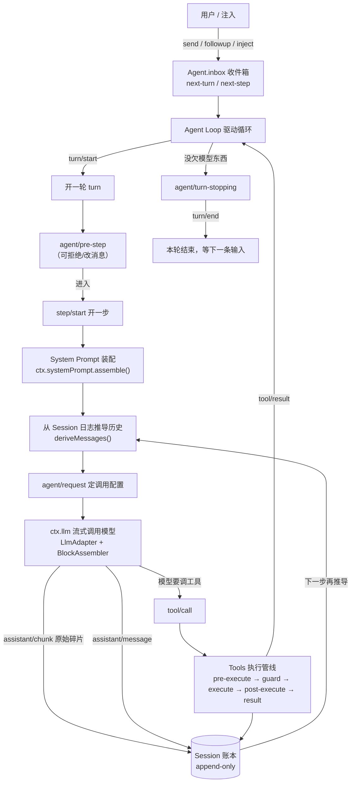

> 本文用通俗类比拆解 deepseek-harness（简称 **dsh**）的整体架构与核心模块的工作原理。
> 所有结论均来自仓库 `docs/` 下的架构与子系统文档（`architecture.md`、`cordis-primer.md`、`subsystems/*`、`capability-seams.md`）。
> 代码路径以 `packages/...` 与 `docs/...` 标注，便于深究。

---

## 一、一句话总览

dsh 是一个**插件化**的 AI 智能体运行底座。它有一条铁律：

> **产品的一切都是插件（everything is a plugin）。**

模型适配器、工具注册表、会话日志、甚至驱动循环（agent loop）本身，统统是插件。
没有需要打补丁的"特权核心"——你想改任何一块行为，只要在别处再挂一个插件、或换掉某个实现即可，
因为所有注册都是**可逆的副作用（reversible effects）**，插件卸载时自动回滚。

这就像一座城市：市政府（Cordis 框架）只提供"水电管网"（一套统一的**服务注册 + 事件总线**），
各个部门（插件）自己接入管网、各司其职，谁搬走都不影响大楼立着。

---

## 二、地基：Cordis 插件框架（用"城市公用事业"来比喻）

`docs/cordis-primer.md` 把 Cordis 浓缩成五个想法：

| Cordis 概念 | 一句话 | 城市比喻 |
|---|---|---|
| **Plugin** | 实现 `Service` 的对象，或带 `inject`/`apply(ctx)` 的函数 | 一个"部门" |
| **Context（ctx）** | 服务的仓库；插件通过稳定的 `ctx.<key>`（如 `ctx.tools`）取用服务，而非 import 具体实现 | 城市的"公用事业接口"（水龙头、电闸） |
| **inject 依赖声明** | 插件声明它需要的服务，框架等这些服务齐了才加载它 | 部门说"我得等供水、供电到位才能开工" |
| **Typed Events** | 服务用 TypeScript 声明事件名，再按 `emit`/`waterfall`/`parallel`/`serial` 四种模式分发 | 全市广播系统：有的只是通知，有的要依次过审，有的要并行处理 |
| **Reversible Effects** | 提示词段、工具 schema、适配器、监听器都通过 `ctx.effect()`/`ctx.on()` 安装，卸载时自动拆解 | 部门搬迁时连水电一并结清，不留残桩 |

**四种事件分发模式**（这是理解后面所有"拦截点"的关键）：

```
emit      —— 听众按顺序"旁听"，不返回值（如：记一笔日志）
waterfall —— 听众按顺序"层层包裹"，可改写或短路（如：工具执行前的安检）
parallel  —— 所有听众"并行"执行，等待全部完成（如：落盘检查点）
serial    —— 听众按顺序执行且可返回值（如：回合结束前的判定）
```


> 科普要点：正因为"取服务靠 key 不靠 import、注册都能回滚"，dsh 才能做到**在配置层面替换任何能力**，
> 而不用改核心代码。这叫"组合优于修补"。

---

## 三、核心模块逐个讲

### 模块 1 · Session：会话日志（事件溯源）—— 像"航海日志 / 黑匣子"

来源：`packages/core/session`，文档 `docs/subsystems/session.md`

**它是什么**：一个 `Session` 就是一条**只追加（append-only）**的 `SessionEvent` 日志——
这是整个智能体交互历史的**唯一事实来源（single source of truth）**。

**关键反直觉设计**：模型看到的对话历史**不是单独存一份**，而是从这串日志里**推导（derive）**出来的。
重放（replay）= 重新推导同一串事件。

**类比**：就像轮船的航海日志。航海长每发生一件事就记一笔（turn 开始、用户发话、助手回复、调用工具、工具结果），
而且**连每个字的草稿（assistant/chunk 原始流）都原样记下**。将来要复盘这段航程，只要按日志重新推演即可，
绝不依赖一份可能走样的"摘要副本"。

日志里主要的"事件种类"（`SessionEventMap`，插件还能通过声明合并往里加）：

| 事件 | 含义 |
|---|---|
| `turn/start` `turn/end` | 一轮对话（turn）的开/关 |
| `step/start` `step/end` | 一轮里"一次模型请求 + 它叫的工具" |
| `user/message` | 用户/注入的发言 |
| `assistant/chunk` | 模型流式输出的**原始碎片**（保真重放用） |
| `assistant/message` | 装配好的助手完整消息 |
| `tool/call` `tool/result` | 工具调用请求 / 结果 |
| `request/header` | 这次请求用的模型、提示词、工具清单（让请求可从日志完全重建） |

**为什么这么绕？——"重建性（reconstructability）"铁律**：
> 任何送进模型的东西，都必须能从日志里原样重建出来。

所以"往模型里塞新内容"= "往日志里加一个新事件"。这保证了：断点续跑、分叉（fork）、
转录、遥测、持久化，全都只是对同一串事件的**不同投影**。

**科普要点**：Session 不是"聊天记录数据库"，而是一本**带序号的、不可篡改的行为账本**。
`deriveMessages()` 是从账本算出的"当前对话视图"，谁改了账本、视图就跟着变，但账本本身永不改。

---

### 模块 2 · System Prompt：系统提示词装配 —— 像"搭乐高 / 写一份分层简历"

来源：`packages/core/system-prompt`，文档 `docs/subsystems/system-prompt.md`

**它做什么**：在每一步模型请求前，把各方贡献的"提示词段落（PromptSection）"按 `order` 顺序拼成最终系统提示词。

**类比**：写一份公司对外介绍。有人写"公司身份"（order -100），有人写"品牌人设"（order 0），
有人写"工具使用须知"（order 100-199）。拼装器按编号从小到大叠起来，就是完整文档。
每段可以是**静态文字**，也可以是**每次拼装时现算**的函数（比如根据当前时间生成）。

几个关键机制：
- **`complete` 段**：某段若声明"我就是完整提示词"，拼装器跑完协作流程后，会用它**替换**掉所有其他段。
- **PromptContext（动态上下文）**：和段落类似，但会被记进日志、作为 user 消息快照落盘（如工作区指令、时间上下文）。
- **`system-prompt/assemble` 瀑布事件**：专家监听可改写拼装结果——这是"在请求发出前改提示词"的标准拦截点。

**科普要点**：系统提示词不是写死的一坨字，而是**一堆可插拔、可排序、可作用域隔离的乐高块**。
换一个插件，就能换掉"人设"或"工具须知"，而不碰核心。

---

### 模块 3 · Tools：工具注册表与执行管线 —— 像"工具间 + 安检流水线"

来源：`packages/core/tools`，文档 `docs/subsystems/tools.md`

**它是什么**：`ctx.tools` 持有所有"工具"的注册表，并负责把一次工具调用**安全地跑完**。

一个工具（`ToolDefinition`）= 给模型看的 schema（名字、描述、参数 JSON Schema）+ 一个 `execute` 函数 + 可选的"最终结果格式化/UI 展示"回调。

**最有意思的是执行管线（pipeline）**——一次调用要过五道关：

```
tools/pre-execute  （可重排的 允许/拒绝/求证 瀑布）
   → 注册的单调守卫（monotonic guards，只能收紧权限）
      → tools/execute  （环绕派发，可做超时/重试/度量）
         → tools/post-execute （检查/改写结果）
            → 可选的 finalizeContent
               → tools/result （不可变的权威结果）
```

**类比**：你要进工具间借一把电钻。
1. **pre-execute** 像门口保安：看工单，要么放行、要么拒绝、要么喊你去找主管签字（ask/批准）。
2. **guards** 像安全条例：只能"更严"不能"更松"——后面的人没法把前面的拒件翻案。
3. **execute** 像真正去取电钻并干活；环绕层可以装个计时器（超时）或重试。
4. **post-execute** 像质检：可以接受、替换展示内容、或把"错误反馈"挡回去。
5. **result** 像归档：结果被**冻结（deep-frozen）**成不可变快照，谁都改不了。

几个设计细节（科普够用即可）：
- **参数不外泄**：`output`/`execute`/`timeoutMs` 等内部字段**绝不会**送进模型请求——`schemas()` 只白名单 `name/description/parameters`。
- **超时是合作式的**：`timeoutMs` 只声明"我这工具会响应取消信号"，框架据此装计时器，但**绝不会**发到模型那边。
- **UI 卡片是中立词汇**：工具用 `presentCall`/`presentResult` 返回"终端卡""diff 卡""搜索卡"等中性渲染意图，
  具体长什么样由前端决定——工具不依赖任何客户端协议。

**科普要点**：工具不是"函数直接调"，而是经过一条**带安检、可拦截、结果冻结**的流水线。
这让"危险操作要人审批""并行调用""超时熔断"都成了管线上的标准能力。

---

### 模块 4 · Agent 与 Agent Loop：智能体与驱动循环 —— 像"主厨 + 工序"

来源：`packages/core/{agent,agent-loop}`，文档 `docs/subsystems/core.md`

**Agent（智能体）** 是给所有插件（UI、钩子、编排器）编程面对的"门面"：
它持有 `session`（那本账本）、一个 `inbox`（待处理消息箱）、当前 `status`（idle/running），
并提供 `send`/`followup`/`steer`/`inject` 等投递方法，以及 `cancel`/`whenIdle` 等生命周期控制。

**Agent Loop（驱动循环）** 是 `Agent` 接口**唯一的默认实现**，住在 `agent-loop` 包里。
它就是真正"干活"的引擎：认领收件箱里排队的请求 → 开一个 turn → 拼提示词、推导历史 →
流式调用模型（经 `ctx.llm`）→ 把模型要的工具经 `ctx.tools` 派发出去 → 把每一条"模型可见事实"写回账本 → 进入下一步。

**inbox（收件箱）** 分两个有序列表：`next-turn`（下一轮）和 `next-step`（下一步）。
- `followup` 排进下一轮并唤醒主厨；
- `steer` 塞进最近一步（正在炒的这锅）；
- `inject` 只是往下一轮前"贴个便利贴"（注入上下文），不唤醒。

**回合（turn）与步（step）**：
- 一个 **step** = 一次模型请求 + 它叫的工具。
- 一个 **turn** = 零个或多个 step：从认领第一条输入开始，到"没欠模型任何东西"为止。

**类比**：Agent 是餐厅里**这桌的专属服务员+主厨组合**，Agent Loop 是后厨的**炒菜工序**。
顾客（用户）的点单进收件箱；工序每一步：看菜谱（system prompt）→ 从账本推演已有食材（derive history）
→ 开火炒菜（llm 流式）→ 需要剁馅就调用工具（tools）→ 把每道工序记进账本 → 若菜没炒完（模型又要调工具）就进入下一步。

**全流程伪代码**（来自 `architecture.md`）：

```
turn/start
  认领下一步输入 + 一条排队消息
  拼装提示词段 + 工具 schema
  -> agent/pre-step                  拒绝 | 进入(消息)
     step/start
     把进入的消息记为 user/message
     从日志推导模型历史
     agent/request -> llm/stream -> assistant/chunk* -> assistant/message
     tool/call* -> tools/pre-execute -> tools/execute -> tools/post-execute -> tool/result*
     step/end
     工具还要再请求，或新输入到了 -> 认领 -> 下一步
  -> agent/turn-stopping
turn/end
```

**科普要点**：Agent 是"对外门面"，Loop 是"对内引擎"，两者解耦——
扩展插件依赖 `Agent` 的接口与 `agent/*` 事件，**不直接依赖** `agent-loop` 包，所以循环本身也能被换掉。

---

### 模块 5 · LLM 适配器接缝 —— 像"万能炉灶接口 / 翻译官"

来源：`packages/llm`，文档 `docs/subsystems/llm-streaming.md`

**它是什么**：`ctx.llm` 是一个**模型无关的流式调用服务** + 适配器注册表。
不同厂商（DeepSeek、pi-ai、replay 测试桩）各自实现同一个 `LlmAdapter` 接口并注册进来。
`GenerateOptions.provider` 选路由，`model` 交给对应适配器。

**适配器契约（每条都很硬）**：
- `usage` 必须在 `finish` 之前发，finish 之后再无内容；
- 工具调用的 `arguments` 全程是**原始 JSON 字符串**（流式增量拼接，结束时才拼好）；
- 两种报错路径、统一一种 `LlmFailure`；**库内不重试**，重试由 agent 层开新回合；
- 空回复是"可重试错误"而非静默成功；
- 每个 HTTP 请求都带应用归属头（User-Agent）。

**流式协议 `StreamChunk`** 是闭联合类型（加一种就编译报错），用 `index` 把交错的文本/思考/多个工具调用碎片对上号，
`block-end` 直接给出装配好的整块，消费者不用自己拼。

**BlockAssembler（装配器）**：一个共享实现，把原始 `StreamChunk` 流折回成 `ContentBlock[]` + usage + finish 原因 + 重放状态。
Agent Loop 一边把原始碎片**记进账本**（保真），一边喂给装配器，最后存"装配好的助手内容 + 产它的厂商/模型"。

**科普要点**：无论底下接的是哪家的模型，对外都是**同一套消息词汇 + 同一套流式协议**。
换模型 = 换一个适配器插件，上层的提示词拼装、工具派发、日志推导**一行都不用改**。
这就是"接缝（seam）"——拉一道统一接口，背后随便换厂商。

---

### 模块 6 · Capability Seams 能力接缝 —— 像"可插拔的功能模块"

来源：`docs/capability-seams.md`

**这是 dsh 扩展性的精髓**。一个"接缝（seam）"由三角色组成：
**Service Definition（接口）** + **Service Provider（实现）** + **Consumer（使用者，通常是面向模型的工具）**。
只写一个角色不算接缝；加一个能力 = 三者都设计好。

最经典的几个接缝（每个都能"换实现"）：

| 接缝 | 接口 | 实现例子 | 使用者 |
|---|---|---|---|
| `ctx.fs` 文件系统 | `fs` | `fs-local`（本机）、`fs-sandbox`（沙箱）、`fs-e2b`（远程） | `tool-fs` |
| `ctx.shell` 命令行 | `shell` | `bash-local`、`bash-sandbox`、`pwsh-local`（PowerShell） | `tool-bash` |
| `ctx.subprocess` 子进程 | `subprocess` | `subprocess-local`、`subprocess-e2b` | bash / PTY / LSP / 子智能体 |
| `ctx.sandbox` 进程隔离 | `sandbox` | `sandbox-local`（bwrap/Landlock/Seatbelt） | bash-sandbox、terminal-bash |
| `ctx.subagents` 子智能体 | `subagent` | in-process、fork、ACP、Codex、Claude Code、dsh-sdk | `tool-subagent` |
| `ctx.web` 联网 | `web` | web-search-exa / perplexity / deepseek、web-fetch-http | `tool-web` |

**最妙的一点**：文件系统与子进程共享同一个"执行世界"。
只要把 `ctx.subprocess` 指向远程沙箱，**Bash、PTY、LSP 一起跟着去远程**，不需要为每个能力各写一套远程分支。

**科普要点**：dsh 把"能力"抽象成插座（接口），把"厂商/实现"抽象成插头。
想从"本机跑命令"变成"远程沙箱跑命令"，只要换 `shell`/`subprocess` 的插头，
上层的 Bash 工具、终端工具、钩子桥**完全无感**。

---

## 四、一次完整对话的旅程（Turn Flow）

下面这张图把上面所有模块串成一条线：



**一句话串讲**：用户的话进收件箱 → 循环开轮 → 拼提示词、从账本推历史 → 流式调模型 →
模型要工具就过安检流水线 → 每一条"模型可见事实"写回账本 → 若还要调工具就进下一步 →
直到没事欠模型的，回合结束，安静等下一条。

---

## 五、组合层：Profile 与 Bundle（用"套餐"来比喻）

来源：`docs/architecture.md`「Profiles and bundles」

一个跑起来的 `dsh` 是由**有序层**在启动时组合出的一棵插件树：

- **Profile（套餐）**：存在 Harness home 里的命名组合，列出它堆叠哪些 **Bundle**，并持有用户自己的 `cordis.patch.yml`。
  `web` 和 `headless` 是官方模板（一个有浏览器界面，一个无服务器一次性运行）。
- **Bundle（功能包）**：Cordis 配置行 + 它们挂载的代码的发布格式，所以它能插进来的东西仍可被上层 patch 改写。

**加载顺序**（每一层都能改上一层）：
> profile 列出的各 bundle（按序）→ profile 的 `cordis.patch.yml` → home 级 patch → `--patch` 覆盖层

想看自己机器实际启动了什么：

```sh
dsh --profile web --dump-config
```

任何打印出来的行，你都能用自己的 patch 换掉。

**科普要点**：把"最终产品"当成"基础层 + 若干套餐 + 你的私人补丁"叠出来的。
想加功能 = 加一个 bundle；想微调某个插件的行为 = 写一行 patch。全程不碰源码。

---

## 六、设计哲学：为什么这么绕，却值得

把上面六块放回一起看，dsh 的执念其实是三条：

1. **一切皆插件、组合优于修补**
   没有特权核心，所有行为从配置组合出来。换模型、换沙箱、换循环，都是"挂/换插件"。

2. **账本是唯一事实，推导是投影**
   Session 用事件溯源把"发生了什么"原样记死；对话历史、转录、标题、分叉都只是对它的投影。
   这带来可重放、可续跑、可审计。

3. **接缝统一接口，背后随便换**
   LLM、文件系统、命令行、子进程、子智能体……全是一根统一接口（seam），
   实现可插拔。一个 provider 的替换，能改变整个产品的运行世界。

> 一句话总结：**dsh 把"一个 AI 智能体"做成了一座可插拔的城市——**
> 账本（Session）记下每道工序，主厨（Agent Loop）按菜谱（System Prompt）炒菜，
> 工具间（Tools）带安检流水线，炉灶（LLM 适配器）和厨房设备（能力接缝）都能整厂替换，
> 而这一切都由市政府（Cordis）的公用事业管网连在一起。

---

## 附：核心模块速查表

| 模块 | 拥有方包 | `ctx` key | 一句话角色 |
|---|---|---|---|
| Cordis 框架 | `vendor/cordis` | — | 插件内核：服务注册 + 事件总线 + 可逆副作用 |
| Session 日志 | `core/session` | `ctx.sessions` | 只追加事件账本，对话历史的唯一事实来源 |
| System Prompt | `core/system-prompt` | `ctx.systemPrompt` | 每步拼装系统提示词与工具 schema |
| Tools 工具 | `core/tools` | `ctx.tools` | 工具注册表 + 带安检的执行管线 |
| Agent | `core/agent` | `ctx.agents` | 智能体门面、生命周期、收件箱 |
| Agent Loop | `core/agent-loop` | `ctx.agentLoop` | 驱动循环的唯一默认实现 |
| Scope | `core/scope` | — | 每智能体的作用域注册原语（无服务，纯库） |
| LLM | `llm/llm` | `ctx.llm` | 模型无关流式调用 + 适配器注册表 |
| 能力接缝族 | `fs/shell/subprocess/sandbox/subagent/web` | `ctx.fs` 等 | 可插拔能力：文件系统/命令行/子进程/隔离/子智能体/联网 |

> 更多模块（persistence 持久化、compaction 压缩、session-query 检索、settings/credentials 设置与凭据、
> skill 技能、jobs 后台任务、workflow 工作流、interaction 人机协作、host/client 前后端等）见
> `packages/README.md` 的层级表与 `docs/capability-seams.md` 的完整服务依赖图。
