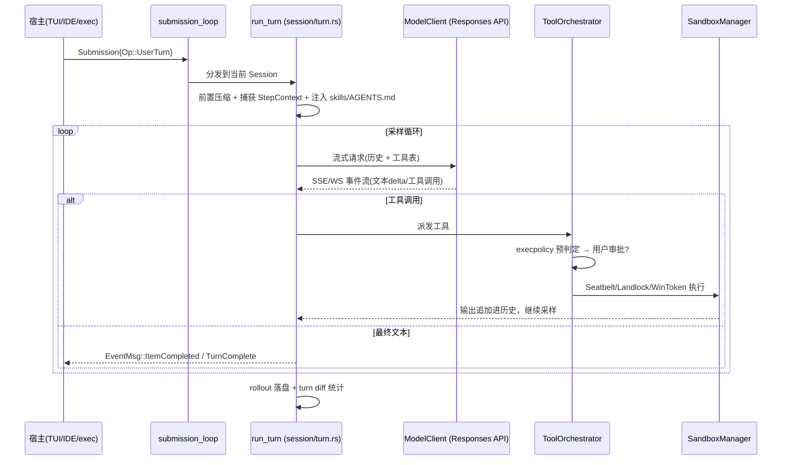

## 项目概述

- **项目**：[`openai/codex`](https://github.com/openai/codex) —— OpenAI 的本地编码 Agent（Codex CLI）
- **核心定位**：在用户本机运行的编码智能体，支撑三种宿主形态：终端 TUI、IDE 插件（经 app-server）、非交互 exec 模式
- **代码规模**：Rust workspace 含约 90 个 crate（`codex-rs/Cargo.toml`），crate 统一以 `codex-` 前缀命名；另有 `codex-cli`（Node 包装层）与 `sdk/`
- **主要语言**：Rust（核心）+ TypeScript（CLI 分发包装）

## 目录结构地图

```
codex-rs/
├── protocol/          # 线协议：Submission/Op、Event/EventMsg、权限与配置类型（唯一事实来源）
├── core/              # codex-core：Agent 大脑——会话、turn 循环、工具编排、压缩、MCP 聚合
│   └── src/
│       ├── session/   # Session 状态机 + run_turn 主循环（mod.rs/session.rs/turn.rs）
│       ├── tools/     # 工具注册表(router/registry)、审批+沙箱编排器(orchestrator)、40+ 工具 handler
│       ├── client.rs  # ModelClient：Responses API 流式通信（SSE/WebSocket、重试、sticky 路由）
│       ├── context/   # 注入模型上下文的片段（AGENTS.md、skills、环境状态等）
│       ├── compact*.rs# 上下文压缩（本地 + 远程多版本）
│       └── rollout.rs # 会话持久化（JSONL rollout，重导出自 codex-rollout）
├── tui/               # ratatui 终端 UI（chatwidget、bottom_pane、history_cell 等）
├── app-server/        # JSON-RPC 2.0 服务器，驱动 VS Code 等 IDE（stdio/websocket/unix socket）
├── app-server-protocol/ # app-server v2 API 类型（ts-rs 生成 TypeScript schema）
├── exec/              # `codex exec` 非交互模式（人类可读 / JSONL 输出两种 event processor）
├── cli/               # 二进制入口、子命令（login、mcp、cloud-tasks、sandbox 调试等）
├── sandboxing/        # 跨平台沙箱抽象：macOS Seatbelt / Linux Landlock+Seccomp / Windows RestrictedToken
├── execpolicy/        # 命令前缀规则策略引擎（决定自动放行/需审批/禁止）
├── exec-server/       # 执行环境管理（本地/远程环境抽象，Environment/EnvironmentManager）
├── codex-mcp/ + rmcp-client/ + mcp-server/  # MCP 客户端聚合与「把 Codex 自己暴露为 MCP server」
├── rollout/           # 会话落盘：JSONL recorder + SQLite 状态库（state_db）+ 反向扫描/索引
├── thread-store/      # 线程持久化抽象（ThreadStore/LocalThreadStore）
├── login/             # ChatGPT 登录与 API key 认证（AuthManager/CodexAuth）
├── model-provider*/   # 模型提供商配置（OpenAI、Ollama、LM Studio 等）
└── ext/               # 扩展点：agent、connectors、skills、memories、web-search、goal 等插件化能力
```

## 核心模块工作原理

### 1. 协议层（`codex-protocol`）——一切的分界

整个系统围绕一对异步消息类型运转（`protocol/src/protocol.rs`）：

- **`Submission { id, op: Op }`**（:187, :545）：客户端 → core 的操作指令，如 `Interrupt`、`UserTurn`、审批决策 `ReviewDecision` 等，Op 有约百种变体。
- **`Event { id, msg: EventMsg }`**（:1278, :1296）：core → 客户端的事件流，如 `ItemStarted/ItemCompleted`、`RawResponseItem`、`TurnAborted`、`Error` 等。`id` 与 Submission 对应，实现请求-响应关联。

UI 与 Agent 内核完全解耦：TUI、app-server、exec 都只是 Submission/Event 的生产者与消费者。

### 2. 会话与 Turn 主循环（`core/src/session/`）

**Session**（`session/session.rs:40`）是一个线程（thread）的运行时状态机，持有服务集合（模型客户端、MCP 运行时、网络代理、已执行工具记录器等）、输入队列（`input_queue.rs`，支持用户在模型运行中追加输入/steer）与 rollout 记录器。

外部 `Op` 由 `submission_loop`（`session/handlers.rs`）逐条分发。

**Turn 循环**（`session/turn.rs:153` `run_turn`）是 Agent 的心脏，单轮执行顺序：

1. 回收上轮异步 hook 结果 → 前置压缩（`run_pre_sampling_compact`）
2. 解析用户输入所需的 MCP server 与显式提及的插件（`required_mcp_servers_for_input`）
3. 捕获 `StepContext`——一次采样的完整快照：上下文、广告给模型的工具表、环境选择
4. 构建注入项（skills/plugins/AGENTS.md 等 `ContextualUserFragment`）并写入历史
5. 进入 **sampling 循环**：取 pending 输入 → 重建 prompt → `run_sampling_request`（turn.rs:1340）→ 流式消费 Responses API 事件，遇到工具调用则执行并把输出追加回历史，直到模型给出最终文本或被中断

`run_sampling_request` 内部带重试循环：区分 `ContextWindowExceeded`（触发压缩）、`UsageLimitReached`（更新限速状态）与可重试错误（指数退避、SSE↔WebSocket 传输降级）。`ModelClientSession` 为 turn 级，缓存 WebSocket 连接与 `x-codex-turn-state` sticky 路由 token，并做 prewarm（`client.rs:1-24`）。

### 3. 工具系统（`core/src/tools/`）

- **注册与路由**：`registry.rs` + `router.rs`（`ToolRouter`）决定每个 turn 向模型广告哪些工具（受 Feature flag、模型能力、配置约束）；`ToolName` 支持命名空间（MCP 工具被隔离在独立命名空间）。
- **编排器**（`orchestrator.rs:1-8` 的模块注释说得很清楚）：所有产生副作用的工具走统一管线 **审批 → 选沙箱 → 尝试执行 → 沙箱拒绝后带升级策略重试（审批结果缓存，不重复询问）**。
- **具体工具**在 `handlers/`：shell（unified_exec，支持后台终端会话）、apply_patch（自定义 patch 格式 + Lark 语法文件）、plan、view_image、request_user_input、多智能体（multi_agents v1/v2）、工具搜索等。

### 4. 沙箱与审批（`sandboxing/` + `execpolicy/` + `network-proxy/`）

- `SandboxManager`（`sandboxing/src/manager.rs`）把 `SandboxPolicy`（只读 / 工作区可写 / 完全开放）翻译成平台原生命令包装：macOS `sandbox-exec`（Seatbelt .sbpl profile）、Linux Landlock+Seccomp（或 bwrap）、Windows 受限令牌。`SandboxType` 枚举见 manager.rs:36。
- `execpolicy` 用命令前缀规则做第一层自动判定（允许/询问/禁止），减少审批打断。
- 网络访问由独立的 `network-proxy` 强制管控：工具执行可挂起等待「网络审批」，域名/Unix socket 粒度授权。

### 5. 上下文与压缩

模型可见上下文是**增量构建、只增不改**的（AGENTS.md 中的硬约束）：所有注入片段实现 `ContextualUserFragment`，受 10K token 上限约束；历史由 `ContextManager` 管理，超长时走 `compact*.rs`（本地截断或远程压缩 API，含 model fallback 与多版本协议）。

### 6. 持久化（`rollout/` + `thread-store/` + `state/`）

每个会话以 JSONL「rollout」追加落盘（`recorder.rs`），配合 SQLite 状态库（`state_db.rs`）做索引与恢复；支持 resume、归档、按游标分页列出历史会话（`list.rs` 的反向扫描器避免全文件读取）。

### 7. 宿主层

- **TUI**（ratatui）：`app.rs` 主事件循环 + `chatwidget.rs` 渲染历史单元格；UI 变更必须配 insta 快照测试。
- **app-server**：JSON-RPC 2.0（stdio 下为 JSONL），v2 API 遵循严格的命名/序列化规范（camelCase、`*Params/*Response/*Notification`、cursor 分页），用 `ts-rs` 导出 TypeScript schema 给 IDE 插件；有背压保护（过载返回 `-32001`）。
- **exec**：一次性非交互执行，两种输出处理器（人类可读 / `--json` JSONL）。
- **mcp-server**：反向能力——把 Codex 自身作为 MCP server 暴露给其他 Agent。

## 端到端流程（一次用户提问）



## 关键设计决策小结

1. **协议先行**：core 与所有宿主只通过 Submission/Event 通信，IDE、TUI、MCP 外部 Agent 共用同一内核。
2. **Turn 级资源生命周期**：模型连接、工具表、diff 追踪器都以 turn 为界，保证重试与中断语义清晰。
3. **纵深防御**：execpolicy 规则 → 用户审批 → 平台沙箱 → 网络代理，四层串行，审批结果缓存避免重复打扰。
4. **上下文工程纪律**：增量追加、片段结构化、硬上限、自动压缩，围绕推理缓存命中率优化。
5. **crate 拆分抑制 core 膨胀**：AGENTS.md 明确抵制向 codex-core 加代码，新能力优先独立 crate（`ext/*` 是插件化出口）。
