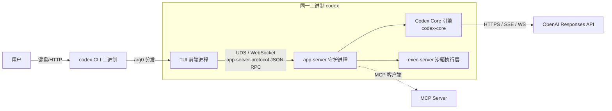
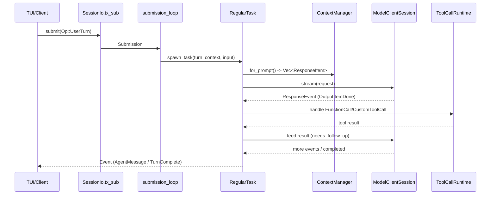

## 1. 总体概览与仓库结构

Codex CLI 是 OpenAI 的本地编码智能体，整体是一个 **Rust monorepo**，构建系统同时使用 **Bazel**（根目录 `MODULE.bazel`）与 Cargo workspace（`codex-rs/Cargo.toml`）。仓库顶层分三大块：

- `codex-rs/` — 全部 Rust 源码，约 115 个 crate，是架构主体。
- `codex-cli/` — 一个轻量 TypeScript/npm 包装层（`package.json` + `bin` + `scripts`），负责把 `@openai/codex` 发布到 npm 并引导启动 Rust 二进制。
- `docs/`、`sdk/`、`scripts/`、`patches/` 等 — 文档、SDK 与构建补丁。

设计哲学（见 `codex-rs/docs/protocol_v1.md`）是：**Core 引擎与 UI 解耦** —— "Codex runs locally, either in a background thread or separate process"，并通过一对队列 **SQ（Submission Queue，UI→Core）** 与 **EQ（Event Queue，Core→UI）** 通信。任何 UI（TUI、桌面 App、IDE 插件、MCP 客户端）都可驱动同一个 Core。

**关键抽象（来自 `protocol_v1.md`）**

- `Codex`：核心引擎，本地运行，处理用户输入、调用模型、执行命令、应用补丁。
- `Session`：引擎的当前配置与状态，由 `Op::ConfigureSession` 初始化，重配置会中止正在执行的任务。
- `Task`：引擎响应用户输入执行的一段工作，由若干 `Turn` 组成；一个 Session 同时最多运行一个 Task。
- `Turn`：一次"请求模型 → 流式响应 → 执行工具/补丁 → 输出"的迭代，上一 Turn 的输出是下一 Turn 的输入。

---

## 2. 进程 / 部署拓扑

默认形态是一个 **前端（CLI/TUI）↔ 独立 app-server 守护进程（承载 Core + 沙箱执行）↔ OpenAI Responses API** 的三层 C/S 架构。同一份 `codex` 二进制通过 `codex-arg0` 角色分发，可被 `arg0` 重入为 `app-server-daemon`、`tui`、`exec-server`、`mcp-server`、`responses-api-proxy` 等子角色。

要点：

- **CLI 入口** `codex-rs/cli/src/main.rs` 用 clap 解析；无子命令时进入交互式 TUI（`codex_tui::run_main`）。
- **TUI 不直接运行 Core**：先解析 `AppServerTarget`，默认选 `LocalDaemon { UnixSocket }`，由 `codex_app_server_daemon` 拉起守护进程并通过 UDS 通信；`--remote` 时连远程 WebSocket。
- **codex-client 不是 Core IPC 客户端**：它只是外层模型 HTTP 重试/SSE 封装库，与 Core 通信的是 `codex-app-server-client`（`RemoteAppServerClient`）。
- **exec-server**：本地默认进程内承载（`EnvironmentManager`），但拥有独立线协议（`exec-server-protocol`），可 offload 到独立进程/远程主机（含 `noise_relay` 加密信道）。

---

## 3. 核心引擎：Agentic 循环（core）

核心 crate `codex-rs/core`（`codex-core`）实现了整个智能体循环。对外公开的门面是 `core-api/src/lib.rs` 再导出的 `CodexThread`、`ThreadManager`、`Op`、`Event`。

### 3.1 公共类型与事件订阅

- `ThreadManager`（`core/src/thread_manager.rs`，对外别名 `ConversationManager`）创建/持有线程。
- `CodexThread`（`core/src/codex_thread.rs:202`）= `Arc<Session>` + `SessionIo` + 配置快照。对外别名 `CodexConversation`。
- `SessionIo`（`session/mod.rs:368`）持有 `tx_sub: Sender<Submission>` 与 `rx_event: Receiver<Event>`（无界 `async_channel`）。客户端通过 `CodexThread::next_event()` 顺序 `recv()` 拿到 `Event`；另有 `agent_status: watch::Receiver<AgentStatus>` 广播状态。

### 3.2 单次 Turn 的数据流

核心链路（函数调用栈）：

1. 客户端 `submit(op)` → `SessionIo.tx_sub`。
2. 后台 task `submission_loop`（`session/handlers.rs:515`）收 `Submission` → `Op::TurnInput` 由 `turn_input::handle` 处理 → `spawn_task(RegularTask::new())`。
3. `Session::spawn_task` / `start_task`（`tasks/mod.rs:279/291`）用 `tokio::spawn` 启动，把 `RunningTask` 存入 `active_turn`。
4. `RegularTask::run`（`tasks/regular.rs:39`）发出 `TurnStarted`，循环调用 `run_turn`（`session/turn.rs:153`）。
5. `run_turn`：采样前 `run_pre_sampling_compact` → `capture_step_context` 组装上下文 → `ContextManager.for_prompt()`（`context_manager/history.rs:206`）生成 `Vec<ResponseItem>` → `run_sampling_request`（turn.rs:1340）。
6. `run_sampling_request` → `try_run_sampling_request`（turn.rs:2179）：`client_session.stream(...)` 返回 `ResponseStream`，循环 `stream.next()` 处理 `OutputItemDone`，对 `FunctionCall`/`CustomToolCall`/`LocalShellCall` 经 `handle_output_item_done` → `ToolCallRuntime` 执行，future 推入 `FuturesOrdered`；当 `needs_follow_up` 或 `has_pending_input` 时再次循环。
7. 完成回 `on_task_finished`（tasks/mod.rs:571）发 `TurnComplete/TurnAborted`，并 `maybe_start_turn_for_pending_work` 拉起排队后续 Turn。

### 3.3 任务建模与生命周期

| 抽象 | 实现 | 职责 |
|------|------|------|
| `SessionTask` trait（tasks/mod.rs:187） | `RegularTask` / `ReviewTask` / `CompactTask` | `kind()` / `run(session,ctx,input,cancel)` / `abort()`，装箱为 `AnySessionTask` |
| 状态机 | `ActiveTurn` / `RunningTask` / `TurnState`（state/turn.rs） | 维护 `CancellationToken`、待审批数、工具调用数等 |
| `ReviewTask`（tasks/review.rs:37） | 启动子 `CodexThread` 一次性运行做代码评审，结束写回历史 | 评审模式 |
| `CompactTask`（tasks/compact.rs:17） | 按 `RemoteCompactionSupport` 分派远程/本地摘要 | 上下文压缩 |

生命周期回调在 `tasks/lifecycle.rs`（`emit_turn_start/stop/abort/error_lifecycle`），中断走 `abort_all_tasks` / `abort_turn_if_active`，含 100ms 优雅超时。

---

## 4. 协议与 IPC（protocol / app-server）

协议分两层：

- **进程内逻辑类型**（`protocol/src/protocol.rs`）：`enum Op`（UI→Core，:545，含 `UserTurn`/`Interrupt`/`ExecApproval`/`UserInputAnswer`；其中 `TurnInput` 直接携带 `oneshot::Sender`，证实进程内走 Rust channel）与 `enum EventMsg`（Core→UI，:1296，如 `AgentMessage`/`TurnStarted`/`ExecApprovalRequest`）。两个枚举均为 `non_exhaustive`。
- **跨进程线协议**（`codex-app-server-protocol`）：`rpc.rs` 的 `JSONRPCMessage`（Request/Notification/Response/Error，注释明确"不做真正 JSON-RPC 2.0"）。v1（`protocol/v1.rs`）与 v2（`protocol/v2/*`）模块，v2 扩展 thread/process/fs/remote_control。Wire 上为换行分隔 JSON。

MCP 服务端接口（`docs/codex_mcp_interface.md`）暴露 v2 RPCs：`thread/start|resume|fork|read|list`、`turn/start|steer|interrupt`、`account/*`、`config/*`、`model/list` 等，并以 `codex/event/*` 通知流推送实时 Agent 事件；审批以 server→client 请求形式下发（`applyPatchApproval`、`execCommandApproval`）。

---

## 5. 工具系统、审批与沙箱

### 5.1 工具定义与分发

- 工具由 `ToolExecutor<Invocation>` trait 定义（`tools/src/tool_executor.rs:106`）：实现 `tool_name()` / `spec()` / `exposure()` / `handle()`。`ToolSpec`（tools/src/tool_spec.rs）直接序列化为 Responses API 工具 JSON。
- Core 中更丰富的 `CoreToolRuntime`（`core/src/tools/registry.rs:55`）扩展 hook、遥测、code-mode 元数据。工具收集进 `ToolRegistry`（`IndexMap<ToolName, RegisteredTool>`）。
- `ToolRouter`（`core/src/tools/router.rs:68`）持有 registry 与 `model_visible_specs`。`build_tool_call` 把 `ResponseItem` 解析为 `ToolCall`，`dispatch_tool_call_with_terminal_outcome` 构建 `ToolInvocation` 并调用 `ToolRegistry::dispatch_any_with_terminal_outcome`（跑 pre-tool hook → `handle` → post-tool hook → 生命周期通知）。

### 5.2 并行执行门控 & 编排器

- 并行执行在 `ToolCallRuntime::handle_tool_call`（`core/src/tools/parallel.rs:73`）：每个调用 spawn 到 tokio task，受 `parallel_execution: Arc<RwLock<()>>` 门控 —— 支持并行的工具取读锁并发跑，不支持的取写锁串行化全部。
- `ToolOrchestrator`（`core/src/tools/orchestrator.rs:125`）包装"审批 → 选择沙箱 → 尝试 → 被拒重试（不再二次审批，缓存）"的流水线。

### 5.3 审批、execpolicy 与网络审批

- 审批以 `ApprovalContext` / `ApprovalAction`（`core/src/tools/approvals.rs`）表达：`ExecCommand` / `ApplyPatch` / `McpToolCall` / `NetworkAccess` 等。
- orchestrator 首阶段计算 `ExecApprovalRequirement`（`Skip | NeedsApproval | Forbidden`），默认映射来自 `AskForApproval` 策略 + 文件系统策略；决策按会话缓存（`ReviewDecision::ApprovedForSession`）。
- 策略自动审批由 `execpolicy` crate 的 `Policy` / `RuleRef`（`PrefixRule` 命令前缀、`NetworkRule` 主机/端口）驱动，批准后生成 `ExecPolicyAmendment` 使同类命令跳过后续提示。`network_approval.rs` 单独门控网络访问。

### 5.4 跨平台沙箱

`codex-sandboxing` 的 `SandboxManager`（`sandboxing/src/manager.rs`）按平台选择：

| 平台 | SandboxType | 实现 |
|------|-------------|------|
| macOS | `MacosSeatbelt` | `sandbox-exec` + `.sbpl` 策略（seatbelt.rs） |
| Linux | `LinuxSeccomp` | `codex_linux_sandbox_exe` + landlock/bwrap（linux-sandbox、bwrap crate） |
| Windows | `WindowsRestrictedToken` | 受限令牌 + WFP 网络过滤 + 拒绝读 ACL + 桌面隔离（windows-sandbox-rs） |
| 关闭 | `None` | 不沙箱（仍走 execpolicy 审批） |

`process-hardening` 施加额外进程缓解；`exec-server/src/process_sandbox.rs` 在 spawn 时物化沙箱类型。

---

## 6. 模型接入与流式

- `model-provider` 定义 `ModelProvider`（`model-provider/src/provider.rs`，经 `create_model_provider`），封装 `codex_api::Provider`，支持 OpenAI 与 Amazon Bedrock；含 `ProviderCapabilities`（命名空间工具、web 搜索、远程压缩）。
- 实际流式由 `codex_api::ResponsesClient` / `ResponsesWebsocketClient` 完成（`core/src/client.rs:52/54`）。`ModelClientSession::stream` 构造 `/responses` 请求（含 `/responses/compact`），带 websockets-v2 / responses-lite beta 头，返回 `codex_api::ResponseStream`（包装为 `futures::Stream`），流式元素为 `ResponseEvent`（`Created`/`OutputItemAdded`/`OutputItemDone`…）。
- `models-manager` 选模型：`ModelsManager` trait（`OpenAiModelsManager` / `StaticModelsManager`），`RefreshStrategy` 控制在线/离线缓存，`default_model_from_available` 选默认；`codex-backend-openapi-models` 携带 bundled `models.json` 的 `ModelInfo`/`ModelPreset` 类型。
- `backend-client` 是独立的 OpenAI 后端 HTTP 客户端（账户、tasks、限流、配置 bundle），*不*负责模型流式。

---

## 7. MCP 与 Skills

- **MCP**：`codex-mcp` 用 `McpConfig` / `ResolvedMcpCatalog` 描述服务器，由 `McpRuntime` 经 `rmcp-client`（wrap `rmcp` 协议，支持 stdio/HTTP、OAuth、elicitation）加载。每个 MCP 工具成为 `ToolInfo`（原始 `server_name/tool` + 经过消毒的模型可见 `callable_name/callable_namespace`）。Core 中 `McpHandler`（`core/src/tools/handlers/mcp.rs`）实现 `CoreToolRuntime`，其 `handle` 经 `rmcp-client` 转发到服务器，并以 `register_external` 注册到 ToolRouter。
- **Skills**：`skills` crate 建模可复用指令集 —— `SkillMetadata`/`SkillInterface`、`SkillRootLoader`/`LoadedSkills`、frontmatter 解析；`ToolMentions`/`extract_tool_mentions` 识别文本中的 `@skill` 标记并解析。系统 skills 经 `include_dir` 嵌入并安装到 `CODEX_HOME/skills/.system`。

---

## 8. 持久化、回放与上下文压缩

- **对话历史**：`ContextManager` 的 `for_prompt()` 把底层 `codex_history`（`ResponseItemEnvelope`/`RolloutItem`）转成喂给模型的 `Vec<ResponseItem>`。
- **Rollout（转录）**：`RolloutRecorder`（`rollout/src/recorder.rs:86`）以 JSONL 追加记录 `RolloutItem`，是 thread 与持久化的桥梁；`CodexThread` 暴露 `rollout_path()`、`ensure_rollout_materialized`。
- **ThreadStore**（`thread-store/src/lib.rs`）：存储无关的持久化接口（`ThreadStore` + `LiveThread` + `StoredThread`）。`CodexThread::read_thread/load_history/update_thread_metadata` 委托给 `LiveThread`。
- **MessageHistory**：全局 `~/.codex/history.jsonl` 追加日志，与 per-thread rollout 是不同层。
- **上下文压缩**：`run_turn` 采样前调 `run_pre_sampling_compact`；采样后依 `context_window_token_status` 判断是否需要 `run_auto_compact`（`CompactionReason::ContextLimit`）。压缩核心在 `core/src/compact.rs`（`run_compact_task`，本地摘要用 `SUMMARIZATION_PROMPT`），把历史替换为 `CompactedItem`，由 `Session::replace_compacted_history` 落地。

---

## 9. 关键 Crate 速查表

| Crate | 角色 |
|-------|------|
| `codex-core` | 核心 Agentic 循环、会话、任务、工具编排、压缩 |
| `core-api` | 对外公开门面（CodexThread / ThreadManager / Op / Event） |
| `cli` | `codex` 二进制入口，arg0 角色分发 |
| `tui` | 终端 UI 前端 |
| `protocol` | SQ/EQ 逻辑类型：Op / EventMsg / SessionId / auth |
| `app-server*`（含 -daemon/-client/-protocol/-transport） | 桌面后端守护进程与跨进程 JSON-RPC 线协议 |
| `codex-client` | 外层模型 HTTP 重试/SSE 封装（非 Core IPC） |
| `tools` | 工具实现、ToolExecutor trait、ToolSpec |
| `sandboxing` / `linux-sandbox` / `bwrap` / `windows-sandbox-rs` / `process-hardening` | 跨平台沙箱与进程缓解 |
| `execpolicy` | 命令/网络审批策略（Policy / RuleRef / Decision） |
| `exec` / `exec-server` | 命令执行与沙箱化执行层（含独立线协议） |
| `model-provider` / `models-manager` / `codex_api` / `backend-client` | 模型提供方、模型选择、Responses API 流式、后端 HTTP |
| `codex-mcp` / `rmcp-client` / `mcp-server` | MCP 集成与 MCP server 接口 |
| `skills` | Skills 系统（加载、解析、@mention 解析） |
| `rollout` / `thread-store` / `message-history` | 转录 JSONL、线程持久化、全局历史 |
| `apply-patch` | 补丁应用工具 |
| `uds` / `stdio-to-uds` | 跨平台异步 UDS 与 stdio↔socket 桥接 |
| `arg0` | 同一二进制多角色重入分发 |

---

## 10. 安全模型小结

Codex 的安全边界由三层叠加：

1. **审批** —— 执行命令/应用补丁/网络访问前经 `ApprovalAction` 向用户或 guardian 请求许可，且按会话缓存决策；
2. **策略** —— `execpolicy` 用前缀/网络规则做自动放行或拒绝；
3. **沙箱** —— 按平台施加 seatbelt / seccomp+landlock(bwrap) / Windows 受限令牌，限制文件系统与网络可达范围。工具并行执行还有读写锁门控，保证非并行工具被串行化。Codex Web（云端智能体）与本地 CLI 共享同一套协议与引擎逻辑，但本地形态额外强调进程隔离与最小权限。
