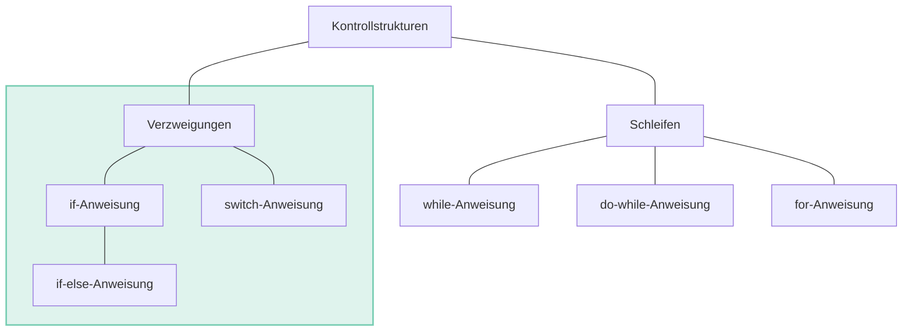

<!--
Marp: Markdown Presentation Ecosystem: Marp is the ecosystem to write your presentation with plain Markdown.
* [How to align image below text header in Marp or Marpit](https://stackoverflow.com/questions/69154809/how-to-align-image-below-text-header-in-marp-or-marpit)
* [Use document themes in your PowerPoint add-ins](https://learn.microsoft.com/en-us/office/dev/add-ins/powerpoint/use-document-themes-in-your-powerpoint-add-ins)
* [Marp CLI: How to make custom transition](https://marp.app/blog/how-to-make-custom-transition)
* [Change font size in markdown table | VSCode](https://github.com/orgs/marp-team/discussions/217)
* [Split slides](https://github.com/marp-team/marpit/issues/137)
-->

<!--footer: ©2023 王军建-->

# 在 VS Code 中用 Marp Markdown 编写幻灯片

<style scoped>
img[alt~="center"] {
    display: block;
    margin: 0 auto;
    width: 120px;
}
</style>

---

## 安装
### ❶ 下载 [Visual Studio Code](https://code.visualstudio.com/)
### ❷ 安装插件 [Marp for VS Code](https://marketplace.visualstudio.com/items?itemName=marp-team.marp-vscode)

---

## Marp: Enable HTML
> 允许在 Marp 幻灯片预览中使用 HTML

### ❶ 打开设置 `Command + ,`
### ❷ 搜索 `marp`，勾选 `Marp: Enable HTML`

---

## 学习 Marp Markdown 语法
- [GitHub marp-vscode](https://github.com/marp-team/marp-vscode/)
- [Marpit: Markdown slide deck framework](https://marpit.marp.app/)
    * [Directives](https://marpit.marp.app/directives)
    * [Image syntax](https://marpit.marp.app/image-syntax)
    * [Theme CSS](https://marpit.marp.app/theme-css)
    * [Inline SVG slide](https://marpit.marp.app/inline-svg)
- [使用 Markdown 制作 ppt](https://zhuanlan.zhihu.com/p/435734521)

---

## 页眉页脚
### 全局
```markdown
<!--header: 全局页眉-->
<!--footer: 全局页脚-->
```

### 单页
```markdown
<!--_header: 单页页眉-->
<!--_footer: 单页页脚-->
```
<!--_header: 单页页眉-->
<!--_footer: 单页页脚-->

---

## Style
### 全局
```markdown
style: |
    h1 {
        font-size: 3em;
        text-align: center;
    }
```

### 单页
```markdown
<style scoped>
h1 {
    font-size: 3em; 
    text-align: center;
}
</style>
```

---

#### 文字竖排
- 可以在 `style` 中添加下面的代码
```css
h4 {
    writing-mode: vertical-lr;
    font-size: 1.5em;
    font-weight: bold;
    position: absolute;
    top: 2em;
    left: 0em;
}
```

---

## 分栏

<div class="columns"><div>

### Markdown 头部添加 style
```markdown
---
marp: true
paginate: true
style: |
    .columns {
        display: grid;
        grid-template-columns: repeat(2, minmax(0, 1fr));
        gap: 1rem;
    }
---
```

</div><div>

### 分栏语句
```html
<div class="columns"><div>

Column 1

</div><div>

Column 2

</div></div>
```

</div></div>

<!--_footer: '[Any initiative to implement columns in Marp?](https://github.com/orgs/marp-team/discussions/192)'-->

---

## 隐藏列表项符号
<style scoped>
li {
    list-style-type: none
}
</style>

<div class="columns">
<div>

1. Item 1
2. Item 2
3. Item 3
4. Item 4
5. Item 5
6. Item 6

</div>
<div>

### 添加 style
```css
li {
    list-style-type: none
}
```

</div>
</div>

---

## SVG 代码

```xml
<svg data-marpit-svg viewBox="0 0 1280 960">
  <foreignObject width="1280" height="960">
    <section><h1>Page 1</h1></section>
  </foreignObject>
</svg>
<svg data-marpit-svg viewBox="0 0 1280 960">
  <foreignObject width="1280" height="960">
    <section><h1>Page 2</h1></section>
  </foreignObject>
</svg>
```

---

<svg data-marpit-svg viewBox="0 0 1280 960">
  <foreignObject width="1280" height="960">
    <section><h1>Page 1</h1></section>
  </foreignObject>
</svg>
<svg data-marpit-svg viewBox="0 0 1280 960">
  <foreignObject width="1280" height="960">
    <section><h1>Page 2</h1></section>
  </foreignObject>
</svg>

---



---

<div class="mermaid">
%%{init: {'themeVariables': { 'fontSize': '22px'}}}%%
flowchart LR;
    subgraph two
        direction LR
        A([Some node])-->B;
        B[Some other node]-->C;
        B-->D;
        C-->D;
    end
    subgraph one
        direction TB
        C1;
        C2;
        C3;
    end

    C2-->A;
</div>


---

# 谢 谢 ！
