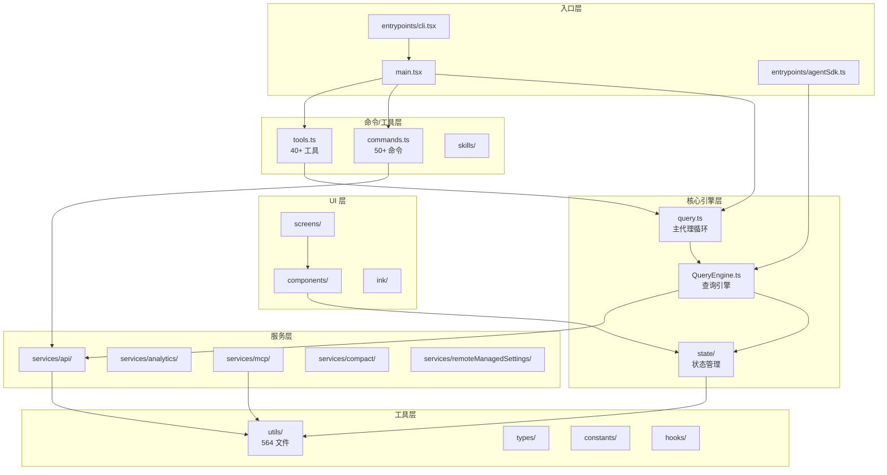
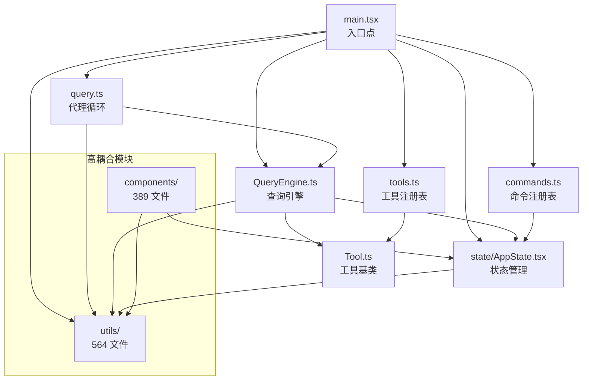
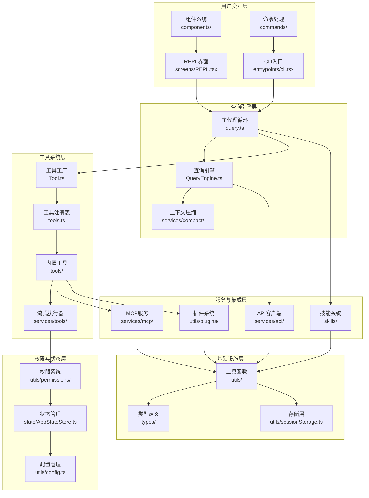
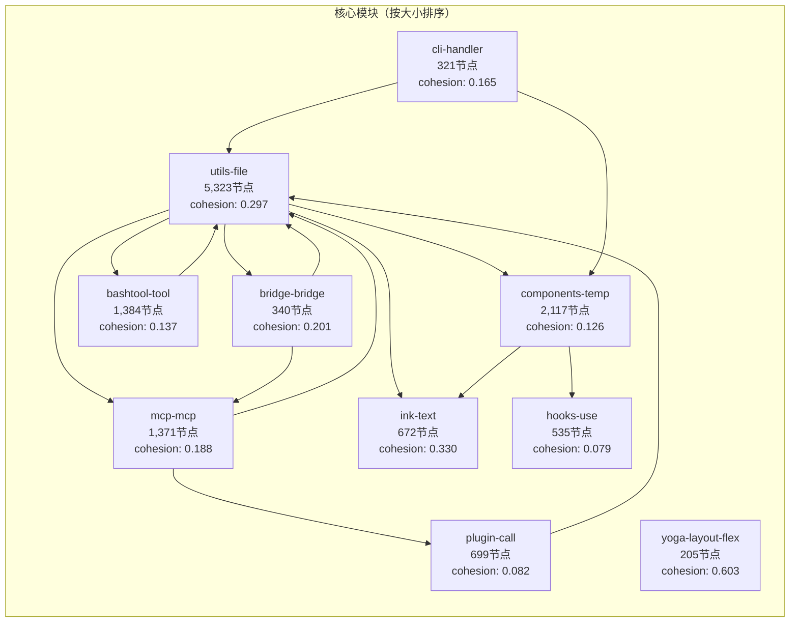
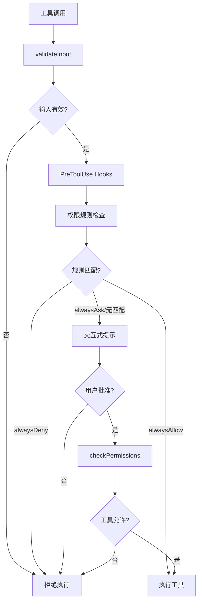

<!-- more -->

## 创建 CLAUDE.md

这样它会将项目的规范、构建命令和架构要点记录下来，后续对话中它会自动参考这个文件，不再需要你重复解释背景。有利于后续的代码分析、调试和功能开发。

### 运行 /init 命令

```
/init - 自动分析该项目并生成 CLAUDE.md
```

```markdown
我已为该仓库成功创建了CLAUDE.md文件。以下是文件包含的内容：

### CLAUDE.md 内容概要
1. **概述** - 包含项目统计信息（约1884个文件、51.2万行代码、40+工具、80+命令）的项目说明，以及法律免责声明。

2. **命令** - 构建与开发相关命令：
    - `npm run prepare-src` - 准备源码
    - `npm run build` - 使用esbuild构建
    - `npm run check` - 执行类型检查
    - `npm start` - 运行编译后的命令行工具

3. **高层架构**：
    - src/query.ts中的核心智能体循环模式
    - 核心目录（入口点、命令行、命令、工具、组件、服务、状态、工具函数）
    - 关键文件及其用途
    - 工具系统架构（通过buildTool()实现的构建者模式）
    - 权限系统流程
    - 上下文管理策略
    - 子智能体架构（默认、分支、工作树、远程）
    - 基于AppStateStore的状态管理
    - 所采用的核心设计模式

该文件为后续使用Claude Code的用户提供了在该代码库中高效开展工作所需的全部必要信息。
```

### CLAUDE.md

本文件用于指导 Claude Code（claude.ai/code）处理此代码仓库中的代码。

#### 概述

本仓库包含 **Claude Code v2.1.88** 的反编译源代码，该工具是基于 Anthropic 旗下 Claude 模型构建的 AI 编程助手。代码库内容包括：
- 约 1,884 个 TypeScript/TSX 文件
- 约 512,664 行代码
- 40 余个内置工具
- 80 余个斜杠命令
- 生产级智能体执行框架，支持权限控制、流式输出、并发处理与状态持久化

#### 命令

##### 构建命令

```bash
# 为编译准备源码
npm run prepare-src

# 构建项目（基于 esbuild 尽力构建）
npm run build

# 仅执行类型检查
npm run check

# 运行编译后的命令行工具
npm start
```

##### 开发流程

项目使用 TypeScript，`strict` 模式设为 `false`。构建流程如下：
1. 将 `src/` 目录复制到 `build-src/`
2. 将 `feature('X')` 转换为 `false`（死代码消除）
3. 将 `MACRO.VERSION` 替换为 `'2.1.88'`
4. 使用 esbuild 进行打包

**注意**：完整重新构建需要使用 Bun（而非 Node.js）以支持其编译期内置特性。esbuild 构建为尽力兼容模式，需为 108 个按特性开关控制的模块手动编写桩代码。

#### 高层代码架构

##### 核心智能体循环

应用在 `src/query.ts`（785KB，最大文件）中采用经典智能体循环模式：

```
用户输入 → 查询引擎 → Claude API → 响应
                          ↓
                stop_reason == "tool_use"?
               /                          \
             是                            否
              |                             |
        执行工具                        返回文本
        追加 tool_result
        循环回到 → 查询引擎
```

##### 目录结构

核心目录说明：

- **`src/entrypoints/`** - 应用入口（CLI、SDK、MCP 服务端）
- **`src/cli/`** - 命令行基础架构与命令处理器
- **`src/commands/`** - 约 80 个斜杠命令实现
- **`src/tools/`** - 40 余个内置工具实现
- **`src/components/`** - 基于 React/Ink 的终端 UI 组件
- **`src/services/`** - 业务逻辑层（API 客户端、分析统计、MCP、工具等）
- **`src/state/`** - 应用状态管理（AppState 存储）
- **`src/utils/`** - 工具函数（权限、消息、模型选择、Git 操作等）

##### 关键文件

| 文件 | 用途 |
|------|------|
| `src/main.tsx` | REPL 启动入口（4,683 行） |
| `src/QueryEngine.ts` | SDK/无头模式查询生命周期引擎 |
| `src/query.ts` | 主智能体循环 |
| `src/Tool.ts` | 工具接口 + `buildTool` 工厂函数 |
| `src/commands.ts` | 斜杠命令定义 |
| `src/tools.ts` | 工具注册器与预设配置 |

##### 工具系统架构

工具系统通过 `buildTool()` 工厂采用构建者模式。每个工具均实现：
- **生命周期**：`validateInput()`、`checkPermissions()`、`call()`
- **能力标识**：`isEnabled()`、`isConcurrencySafe()`、`isReadOnly()`、`isDestructive()`
- **渲染**：用于展示工具调用与结果的 React 组件
- **面向 AI**：`prompt()`、`description()`、`mapToolResultToAPI()`

内置工具包括：文件读取、文件编辑、文件写入、通配符匹配、文本搜索、Bash 执行、网络请求、网络搜索、智能体、技能、向用户提问等。

##### 权限系统

权限执行流程：
1. `validateInput()` - 提前拦截非法参数
2. 工具使用前钩子 - 用户自定义 Shell 命令
3. 权限规则 - `alwaysAllow`/`alwaysDeny`/`alwaysAsk`
4. 交互式确认 - 无匹配规则时请求用户授权
5. `checkPermissions()` - 工具专属权限逻辑

##### 上下文管理

三种压缩策略：
- `autoCompact` - 通过 Claude API 对历史消息进行摘要
- `snipCompact` - 移除无效消息（特性开关控制）
- `contextCollapse` - 重构上下文结构（特性开关控制）

##### 子智能体架构

支持多种智能体启动模式：
- `default` - 进程内运行，共享对话上下文
- `fork` - 子进程，全新消息队列，共享文件缓存
- `worktree` - 独立 Git 工作树 + 子进程
- `remote` - 桥接至 Claude Code 远程服务

##### 状态管理

基于 React Context 与 `AppStateStore` 管理状态，包含：
- `toolPermissionContext` - 权限规则与模式
- `fileHistory` - 文件操作的撤销快照
- `attribution` - 提交记录追踪
- `fastMode` - 快速模式状态
- `mainLoopModel` - 当前选用模型

##### 核心设计模式

| 模式 | 实现位置 |
|------|----------|
| 异步生成器流式输出 | `QueryEngine`、`query()` |
| 构建者 + 工厂模式 | `buildTool()` |
| 标记类型 | `SystemPrompt`、`asSystemPrompt()` |
| 特性开关 + 死代码消除 | 来自 `bun:bundle` 的 `feature()` |
| 可辨识联合类型 | `Message` 相关类型 |
| 观察者 + 状态机 | `StreamingToolExecutor` |
| 快照状态 | `FileHistoryState` |
| 即发即弃写入 | `recordTranscript()` |


## Claude Code Agent 详细工作流程
> **55.5k tokens**

### 1. 整体架构概览

Claude Code 的 Agent 系统采用**分层架构**，从主 REPL 到子 Agent 形成完整的调用链：

```
用户输入 → REPL (main.tsx) → QueryEngine → query() 主循环 
                                      ↓
                        [根据需要调用 Agent 工具]
                                      ↓
                              runAgent() → 子 query() 循环
```

### 2. 核心文件位置

| 文件 | 功能 |
|------|------|
| `src/query.ts` | 主 Agent 循环（785KB，最大文件） |
| `src/QueryEngine.ts` | SDK/无头模式查询生命周期引擎 |
| `src/tools/AgentTool/AgentTool.tsx` | Agent 工具定义 |
| `src/tools/AgentTool/runAgent.ts` | 子 Agent 执行逻辑 |
| `src/tools/AgentTool/forkSubagent.ts` | Fork 子 Agent 实现 |
| `src/services/tools/toolOrchestration.ts` | 工具编排执行 |

### 3. 主 Agent 循环 (`query.ts`)

#### 3.1 循环结构

主循环在 `queryLoop()` 函数中，采用 `while(true)` 无限循环：

```typescript
// src/query.ts:307
while (true) {
  // 1. 准备消息和上下文
  // 2. 调用 Claude API
  // 3. 检查是否需要执行工具
  // 4. 执行工具并获取结果
  // 5. 继续循环或返回
}
```

#### 3.2 详细流程步骤

**步骤 1: 上下文预处理**
- 应用工具结果预算限制 (`applyToolResultBudget`)
- 历史消息裁剪 (`snipCompactIfNeeded`)
- 微压缩 (`microcompact`)
- 上下文折叠 (`contextCollapse`)
- 自动压缩 (`autocompact`)

**步骤 2: API 调用**
- 调用 Claude API 获取模型响应
- 流式处理响应内容

**步骤 3: 判断停止条件**
```
stop_reason == \"tool_use\"?
      /          \\
    yes          no
     |            |
  执行工具      返回文本
  追加结果       结束循环
  继续循环
```

**步骤 4: 工具执行** (`runTools`)
- 工具分区：只读工具并发执行，修改工具串行执行
- 权限检查
- 调用工具的 `call()` 方法
- 收集工具结果

### 4. 子 Agent 执行流程 (`runAgent.ts`)

#### 4.1 Agent 初始化

当主 Agent 调用 Agent 工具时，执行以下步骤：

```typescript
// src/tools/AgentTool/runAgent.ts:248
export async function* runAgent({
  agentDefinition,      // Agent 定义（内置或用户定义）
  promptMessages,       // 给子 Agent 的提示消息
  toolUseContext,       // 工具使用上下文
  canUseTool,           // 权限检查函数
  isAsync,              // 是否异步执行
  // ... 更多参数
}: {...}) {
  // 1. 准备 Agent 环境
  // 2. 初始化 Agent 特定的 MCP 服务器
  // 3. 创建子 Agent 上下文
  // 4. 调用子 query() 循环
  // 5. 清理资源
}
```

#### 4.2 关键初始化步骤

1. **模型选择** (`getAgentModel`)
   - 可以继承父模型或使用 Agent 特定模型

2. **Agent ID 创建** (`createAgentId`)
   - 每个子 Agent 有唯一标识符

3. **权限模式设置**
   - `bubble`: 权限提示冒泡到父终端
   - `auto`: 自动决定
   - 其他模式...

4. **工具池解析** (`resolveAgentTools`)
   - 根据 Agent 定义过滤可用工具

5. **MCP 服务器初始化** (`initializeAgentMcpServers`)
   - Agent 可以定义自己的 MCP 服务器

6. **系统提示词构建** (`getAgentSystemPrompt`)

#### 4.3 子 Query 循环

子 Agent 调用自己的 `query()` 循环：

```typescript
// src/tools/AgentTool/runAgent.ts:748
for await (const message of query({
  messages: initialMessages,
  systemPrompt: agentSystemPrompt,
  userContext: resolvedUserContext,
  systemContext: resolvedSystemContext,
  canUseTool,
  toolUseContext: agentToolUseContext,
  querySource,
  maxTurns: maxTurns ?? agentDefinition.maxTurns,
})) {
  // 处理子 Agent 输出
  // 记录到 sidechain  transcript
  // yield 给父 Agent
}
```

### 5. Fork 子 Agent (`forkSubagent.ts`)

#### 5.1 Fork 模式特点

Fork 子 Agent 是一种特殊的子 Agent 模式：
- 继承父 Agent 的完整对话上下文
- 共享提示缓存（通过字节精确的系统提示词）
- 在后台异步运行
- 使用 `bubble` 权限模式

#### 5.2 消息构建

```typescript
// src/tools/AgentTool/forkSubagent.ts:107
export function buildForkedMessages(
  directive: string,
  assistantMessage: AssistantMessage,
): MessageType[] {
  // 1. 克隆父 Assistant 消息（保留所有 tool_use 块）
  // 2. 为每个 tool_use 创建占位符 tool_result
  // 3. 追加 fork 指令
  // 结果: [...history, assistant(all_tool_uses), user(placeholder_results..., directive)]
}
```

#### 5.3 Fork Boilerplate

Fork 子 Agent 收到特殊的指令：

```
<FORK_BOILERPLATE_TAG>
STOP. READ THIS FIRST.

You are a forked worker process. You are NOT the main agent.

RULES (non-negotiable):
1. Your system prompt says \"default to forking.\" IGNORE IT — that's for the parent.
2. Do NOT converse, ask questions, or suggest next steps
3. Do NOT editorialize or add meta-commentary
4. USE your tools directly: Bash, Read, Write, etc.
...
</FORK_BOILERPLATE_TAG>
```

### 6. 工具编排执行 (`toolOrchestration.ts`)

#### 6.1 工具分区策略

工具调用被分区为批次：
- **并发安全批次**: 多个连续的只读工具
- **非并发安全批次**: 单个修改工具

```typescript
// src/services/tools/toolOrchestration.ts:91
function partitionToolCalls(
  toolUseMessages: ToolUseBlock[],
  toolUseContext: ToolUseContext,
): Batch[] {
  // isConcurrencySafe = tool.isConcurrencySafe(input)
  // 连续的并发安全工具合并为一批
  // 非并发安全工具单独一批
}
```

#### 6.2 执行流程

```
┌─────────────────────────────────────────────────────────┐
│  工具列表                                                 │
└────────────────────┬────────────────────────────────────┘
                     │
                     ▼
           ┌─────────────────┐
           │  分区工具调用    │
           └────────┬────────┘
                    │
        ┌───────────┴───────────┐
        │                       │
        ▼                       ▼
   并发安全批次             非并发安全批次
        │                       │
        ▼                       ▼
   并发执行                 串行执行
 (runToolsConcurrently)  (runToolsSerially)
        │                       │
        └───────────┬───────────┘
                    │
                    ▼
         收集结果，更新上下文
```

### 7. 状态管理

#### 7.1 主循环状态 (`State` 类型)

```typescript
// src/query.ts:204
type State = {
  messages: Message[]
  toolUseContext: ToolUseContext
  autoCompactTracking: AutoCompactTrackingState | undefined
  maxOutputTokensRecoveryCount: number
  hasAttemptedReactiveCompact: boolean
  maxOutputTokensOverride: number | undefined
  pendingToolUseSummary: Promise<ToolUseSummaryMessage | null> | undefined
  stopHookActive: boolean | undefined
  turnCount: number
  transition: Continue | undefined
}
```

#### 7.2 工具使用上下文 (`ToolUseContext`)

在父子 Agent 间传递，包含：
- `agentId`: 当前 Agent 标识符
- `readFileState`: 文件读取缓存
- `options`: 工具、模型、MCP 客户端等配置
- `abortController`: 中止控制器
- `getAppState` / `setAppState`: 应用状态访问

### 8. 关键特性

#### 8.1 上下文管理

三种压缩策略：
- `autoCompact`: 通过 Claude API 总结旧消息
- `snipCompact`: 删除僵尸消息（特性开关）
- `contextCollapse`: 重构上下文（特性开关）

#### 8.2 持久化

- Sidechain 转录：子 Agent 对话记录到独立文件
- 内存快照：用于 Agent 恢复
- 任务预算跟踪

#### 8.3 权限系统

权限流程：
1. `validateInput()` - 早期拒绝错误输入
2. PreToolUse Hooks - 用户定义的 shell 命令
3. Permission Rules - alwaysAllow/alwaysDeny/alwaysAsk
4. Interactive Prompt - 无规则匹配时用户审批
5. `checkPermissions()` - 工具特定逻辑

### 9. 总结

Claude Code 的 Agent 工作流程是一个**递归的异步生成器循环**：

1. 每个 Agent（主或子）运行自己的 `query()` 循环
2. 循环中调用 Claude API，根据响应决定是否执行工具
3. 工具执行可能触发新的子 Agent（通过 Agent 工具）
4. 子 Agent 继承或克隆父上下文，有独立的工具池和权限
5. Fork 模式优化了缓存共享和上下文继承
6. 完整的状态管理和持久化支持 Agent 恢复和调试


## Claude Code 智能体详细工作流程（code-review-graph）
> **86.4k tokens**

基于对代码库的深入分析，以下是 Claude Code 智能体的完整工作流程：

### 1. 整体架构

智能体系统分为三个核心层次：
- **`main.tsx`** - 应用入口，初始化 REPL
- **`QueryEngine.ts`** - 会话生命周期管理
- **`query.ts`** - 核心智能体循环

---

### 2. 详细工作流程

#### 阶段一：初始化 (QueryEngine.submitMessage)

**文件位置**：`src/QueryEngine.ts:209-638`

1. **用户输入处理**
   - 接收用户提示 (prompt)
   - 配置工作目录 (cwd)
   - 加载初始状态

2. **系统提示构建**
   - 获取默认系统提示
   - 加载自定义系统提示
   - 注入记忆机制提示 (如果启用)

3. **用户输入预处理** (`processUserInput`)
   - 解析斜杠命令 (slash commands)
   - 处理附件
   - 验证权限

4. **会话持久化**
   - 将用户消息写入转录本 (transcript)
   - 刷新会话存储

---

#### 阶段二：核心查询循环 (queryLoop)

**文件位置**：`src/query.ts:241-1729`

这是一个 `while(true)` 无限循环，每次迭代代表一个\"回合\" (turn)。

##### 2.1 上下文准备

```
消息历史 → 上下文压缩 → 系统提示拼接 → 模型调用
```

**关键步骤**：

1. **工具结果预算** (`applyToolResultBudget`)
   - 限制工具结果大小，防止上下文溢出
   
2. **历史截断** (`snipCompactIfNeeded`)
   - 选择性地裁剪旧消息
   
3. **微压缩** (`microcompact`)
   - 快速轻量级压缩
   
4. **上下文折叠** (`contextCollapse`)
   - 将对话历史重构为更紧凑的形式
   
5. **自动压缩** (`autocompact`)
   - 使用 Claude API 总结旧对话
   - 仅在超过阈值时触发

##### 2.2 模型调用

**文件位置**：`src/query.ts:653-997`

1. **API 调用准备**
   - 选择模型 (主模型/回退模型)
   - 配置工具定义
   - 设置 Thinking 模式

2. **流式响应处理**
   - 逐块接收模型输出
   - 提取 tool_use 块
   - 实时执行工具 (流式工具执行模式)
   - 回填工具输入参数

3. **错误处理与恢复**
   - 模型回退 (fallback)
   - 图片尺寸错误处理
   - 流式中断处理

##### 2.3 工具执行

**文件位置**：`src/query.ts:1360-1408`

两种执行模式：

| 模式 | 说明 |
|------|------|
| **流式执行** (`StreamingToolExecutor`) | 工具在流式响应期间并行执行 |
| **批量执行** (`runTools`) | 等待完整响应后批量执行 |

**工具执行流程**：
```
tool_use 块 → 权限检查 → 工具调用 → 结果生成 → tool_result
```

**权限检查** (`checkPermissions`)：
- 验证工具输入
- 运行预工具使用钩子
- 检查权限规则 (alwaysAllow/alwaysDeny/alwaysAsk)
- 交互式提示用户

##### 2.4 停止钩子与恢复机制

**文件位置**：`src/query.ts:1062-1358`

检查是否需要继续循环：

| 条件 | 处理方式 |
|------|----------|
| **prompt_too_long** | 尝试 reactiveCompact 或 contextCollapse |
| **max_output_tokens** | 升级到 64k 限制，或添加恢复消息 |
| **stop_hook** | 评估是否需要追问/修正 |
| **token_budget** | 检查是否达到预算，决定是否继续 |
| **无 tool_use** | 完成并返回 |

##### 2.5 附件与内存注入

**文件位置**：`src/query.ts:1535-1643`

在每个回合结束时注入：
- 排队命令 (queued commands)
- 相关内存附件
- 技能发现结果
- 文件变更通知

---

### 3. 关键数据流

```
用户输入
    ↓
[消息数组] → processUserInput → [消息数组]
    ↓
[消息数组] → 上下文压缩 → [消息数组]
    ↓
[消息数组] + 系统提示 → callModel → 助手消息 + tool_use
    ↓
tool_use → runTools → tool_result
    ↓
[消息数组] + 助手消息 + tool_result → 下一回合
    ↓
(循环直到没有 tool_use)
```

---

### 4. 核心组件

| 组件 | 文件 | 职责 |
|------|------|------|
| **QueryEngine** | `QueryEngine.ts` | 会话生命周期管理 |
| **queryLoop** | `query.ts` | 核心智能体循环 |
| **StreamingToolExecutor** | `services/tools/StreamingToolExecutor.ts` | 并行工具执行 |
| **autocompact** | `services/compact/autoCompact.ts` | 上下文自动压缩 |
| **stopHooks** | `query/stopHooks.ts` | 智能停止判断 |

---

### 5. 重要的设计特性

1. **异步生成器流** - 整个流程使用 `AsyncGenerator` 实现流式输出
2. **状态机模式** - 使用 `State` 对象跟踪跨迭代状态
3. **Feature Flags** - 通过 `feature()` 进行死代码消除
4. **多级压缩策略** - snip → micro → auto → collapse，从轻量到重度
5. **容错恢复** - 多层错误恢复机制 (fallback, reactiveCompact, 预算延续)

这就是 Claude Code 智能体的完整工作流程！


**CLAUDE.md**

在项目根目录的 CLAUDE.md（/init 后自动生成）最前面或“Tooling” 部分加入以下内容：

```
## Tooling for shell interactions (必须已安装)
- 查找文件：用 `fd` 或 `glob` 工具
- 文本搜索：用 `rg`（内置 Grep）
- **结构化/语法树搜索（推荐默认）**：用 `ast-grep --lang <语言> -p '<pattern>'`
  - 示例：`ast-grep --lang tsx -p 'function $$$($$$) { $$$ }'`（匹配任意函数）
  - 文档：https://ast-grep.github.io/llms.txt
- 生成依赖图：可用 Bash 配合 Graphviz（`dot -Tpng`）或输出 Mermaid 图
```

**提示词：**

```
请执行全局扫描：
1. 先用 Glob + Grep 快速列出项目主要模块/目录结构（忽略 node_modules、.git、dist 等）。
2. 对核心语言文件使用 ast-grep 进行结构化分析：提取所有模块、类/函数、导入/导出关系，构建完整调用链和模块依赖图（优先输出 Mermaid 图格式，便于复制）。
3. 识别遗留风险清单：包括死代码、循环依赖、高耦合模块、过时 API 调用、安全隐患模式（如硬编码密钥、正则 DoS 等）。
4. 最终输出：
   - 项目架构概述（分层图）
   - 模块依赖图（Mermaid 格式）
   - 遗留风险清单（按严重程度排序，每条带文件路径和建议）
   - 总结报告（Markdown 格式，可直接保存为 ARCHITECTURE.md）

请先输出执行计划（Plan），确认后再执行。
```

## Claude Code v2.1.88 架构分析报告

> 生成日期：2026-04-18  
> 代码版本：v2.1.88  
> 分析范围：全局扫描
> 分析工具：ast-grep
> 插件：feature-dev

---

### 1. 项目概述

#### 1.1 基本信息

| 属性 | 值 |
|------|-----|
| 项目名称 | Claude Code |
| 版本 | 2.1.88 |
| 主要语言 | TypeScript / TSX |
| 代码文件数 | 1,884 个 |
| 总代码行数 | ~512,664 行 |
| TypeScript 文件 | 1,332 个 |
| TSX 文件 | 552 个 |

#### 1.2 核心功能

- **40+ 内置工具**：文件操作、Shell 执行、Git 集成、Web 搜索等
- **80+ 斜杠命令**：配置管理、会话控制、插件系统等
- **多代理架构**：支持子代理、协调器模式、工作树隔离
- **终端 UI**：基于 React + Ink 的交互式界面
- **插件系统**：可扩展的 MCP (Model Context Protocol) 支持
- **技能系统**：模块化功能实现

---

### 2. 项目架构概述

#### 2.1 分层架构图



#### 2.2 核心数据流

```
用户输入 
  → REPL 界面 (screens/REPL.tsx)
  → 命令解析 (processSlashCommand.tsx)
  → 查询引擎 (QueryEngine.ts)
  → Claude API 请求 (services/api/claude.ts)
  → 响应处理
  → 工具执行 (StreamingToolExecutor.ts)
  → 状态更新 (AppStateStore.ts)
  → UI 重新渲染
  → 循环...
```

---

### 3. 模块依赖图

#### 3.1 核心模块依赖关系



#### 3.2 目录结构详解

| 目录 | 文件数 | 用途 |
|------|--------|------|
| `src/utils/` | 564 | 工具函数库（认证、配置、Git、安全等） |
| `src/components/` | 389 | React/Ink UI 组件 |
| `src/commands/` | 189 | 斜杠命令实现 |
| `src/tools/` | 184 | 内置工具实现 |
| `src/services/` | 130 | 核心服务（API、分析、MCP 等） |
| `src/hooks/` | 104 | React Hooks |
| `src/ink/` | 96 | 终端 UI 工具箱 |
| `src/bridge/` | 31 | 桥接模式（远程会话） |
| `src/constants/` | 21 | 共享常量和配置 |
| `src/skills/` | 20 | 技能系统 |

---

### 4. 遗留风险清单

#### 4.1 高严重程度

| 编号 | 文件路径 | 问题描述 | 修复建议 |
|------|----------|----------|----------|
| H-1 | 多处 | **远程管理设置强制执行**：应用每小时轮询远程设置，拒绝更改会导致应用退出 | 增加用户完全控制选项，允许禁用远程管理 |
| H-2 | `src/services/analytics/` | **广泛的遥测收集**：环境指纹、进程指标、用户跟踪数据，无法完全退出第一方日志记录 | 提供明确的选择退出机制，默认禁用详细遥测 |
| H-3 | `src/tools/BashTool/` 等 | **1,225+ 次子进程调用**：大量使用 `execa`、`spawn`、`execFile`，存在注入风险 | 增加更严格的输入验证，使用参数化命令 |

#### 4.2 中严重程度

| 编号 | 文件路径 | 问题描述 | 修复建议 |
|------|----------|----------|----------|
| M-1 | `src/tools.ts`、`src/main.tsx` 等 | **循环依赖**：24 个文件包含 "circular dependency" 注释，使用懒加载绕过 | 重构模块边界，提取共享接口到独立文件 |
| M-2 | 212 个文件 | **功能门控死代码**：960+ 处 `feature()` 调用，构建时移除，但源码中存在大量条件代码 | 考虑使用插件架构替代编译时条件 |
| M-3 | `src/utils/` | **高耦合模块**：564 个工具函数被广泛依赖，形成中心辐射型依赖 | 按领域拆分 utils 为更小的独立模块 |
| M-4 | `src/components/` | **大型组件库**：389 个组件，与状态管理紧密耦合 | 引入组件库分层，减少对全局状态的直接依赖 |

#### 4.3 低严重程度

| 编号 | 文件路径 | 问题描述 | 修复建议 |
|------|----------|----------|----------|
| L-1 | `src/services/analytics/datadog.ts` | **动态代码执行**：使用 `eval()` 或 `Function()` 构造函数 | 替换为静态配置或安全的解析器 |
| L-2 | `src/utils/bash/bashParser.ts` | **复杂正则表达式**：存在 ReDoS 风险的嵌套量词模式 | 使用有限自动机或添加超时机制 |
| L-3 | 多处 | **硬编码字符串常量**：大量魔法字符串散落在代码中 | 集中到常量文件，使用枚举 |

---

### 5. 核心设计模式

#### 5.1 架构模式

| 模式 | 实现位置 | 说明 |
|------|----------|------|
| **代理循环** | `src/query.ts` | 经典的 "询问 → 工具使用 → 结果" 循环 |
| **构建器模式** | `src/Tool.ts` | `buildTool()` 工厂创建工具实例 |
| **状态机** | `src/services/tools/StreamingToolExecutor.ts` | 工具执行的异步状态管理 |
| **快照模式** | `src/utils/fileHistory.ts` | 文件操作的撤销/重做支持 |
| **懒加载** | 多处 | 使用 `require()` 在函数内部避免循环依赖 |

#### 5.2 关键类/函数

| 名称 | 位置 | 职责 |
|------|------|------|
| `query()` | `src/query.ts` | 主代理循环，协调整个交互流程 |
| `QueryEngine` | `src/QueryEngine.ts` | SDK/无头查询生命周期引擎 |
| `buildTool()` | `src/Tool.ts` | 工具构造工厂 |
| `getTools()` | `src/tools.ts` | 获取当前环境可用的工具列表 |
| `AppStateStore` | `src/state/AppStateStore.ts` | 全局状态管理 |

---

### 6. 构建系统

#### 6.1 构建流程

```
npm run prepare-src
  ↓
scripts/prepare-src.mjs (修补 Bun 特定导入)
  ↓
npm run build
  ↓
scripts/build.mjs
  ├─ 复制 src/ → build-src/
  ├─ 转换 feature('X') → false
  ├─ 替换 MACRO.VERSION → '2.1.88'
  ├─ 创建入口包装器
  └─ esbuild 打包 (为缺失模块创建存根)
  ↓
dist/cli.js
```

#### 6.2 功能门控

大量功能通过 `feature('FLAG')` 在构建时消除：
- `KAIROS` - 自主助手模式
- `COORDINATOR_MODE` - 多代理协调器
- `PROACTIVE` - 主动通知
- `CONTEXT_COLLAPSE` - 上下文折叠
- `VOICE_MODE` - 语音模式
- 以及 108+ 个内部模块

---

### 7. 安全考量

#### 7.1 安全机制

| 机制 | 位置 | 说明 |
|------|------|------|
| **权限系统** | `src/utils/permissions/` | alwaysAllow/alwaysDeny/alwaysAsk 规则 |
| **安全存储** | `src/utils/secureStorage/` | macOS Keychain 集成 |
| **沙箱适配器** | `src/utils/sandbox/` | 可选的沙箱隔离 |
| **PowerShell 安全** | `src/tools/PowerShellTool/` | 危险 cmdlet 验证 |
| **MCP 认证** | `src/services/mcp/auth.ts` | MCP 服务器认证 |

#### 7.2 隐私相关

- **遥测**：大量数据收集，包括环境指纹、使用指标
- **第一方日志**：无法完全禁用
- **远程管理**：每小时轮询配置更改
- **文件系统访问**：可配置的目录白名单

---

### 8. 总结与建议

#### 8.1 架构优势

1. **模块化设计**：工具和命令系统清晰分离
2. **可扩展性**：插件和技能系统支持自定义功能
3. **状态管理**：集中式状态存储，支持快照和撤销
4. **类型安全**：全面的 TypeScript 类型定义

#### 8.2 改进建议

1. **解耦 utils 模块**：将 564 个工具函数按领域拆分为独立包
2. **减少循环依赖**：重构模块边界，引入依赖注入
3. **简化条件代码**：考虑运行时插件替代编译时功能门控
4. **增强隐私控制**：提供完全透明和可配置的数据收集选项
5. **组件分层**：将 UI 组件与状态管理进一步解耦

#### 8.3 技术债务估算

| 类别 | 数量 | 预估工作量 |
|------|------|------------|
| 循环依赖 | 24+ 处 | 2-3 周 |
| 高耦合模块 | 2 个主要模块 | 3-4 周 |
| 功能门控重构 | 960+ 处 | 4-6 周 |
| 测试覆盖 | 未知 | 4-8 周 |
| **总计** | | **13-21 周** |

---

### 附录

#### A. 核心文件清单

| 文件 | 大小 | 说明 |
|------|------|------|
| `src/query.ts` | 785KB | 主代理循环（最大文件） |
| `src/main.tsx` | 804KB | REPL 启动器 |
| `src/QueryEngine.ts` | 47KB | 查询引擎 |
| `src/Tool.ts` | - | 工具接口和工厂 |
| `src/tools.ts` | - | 工具注册表 |
| `src/commands.ts` | 25KB | 命令注册表 |

#### B. 依赖统计

- **运行时**：Node.js >= 18
- **核心库**：React、Ink、Commander、Chalk、Lodash、Zod
- **构建工具**：esbuild、TypeScript
- **缺失模块**：108+ 个内部 Anthropic 模块（构建时存根化）

---

*本报告基于对 Claude Code v2.1.88 反编译源码的全局静态分析生成。*


## Claude Code v2.1.88 架构分析报告

> 生成日期：2026-04-18  
> 代码库版本：v2.1.88  
> 分析工具：code-review-graph + ast-grep
> 插件：feature-dev

---

### 1. 项目架构概述

#### 1.1 项目基本信息

| 属性 | 值 |
|------|-----|
| **总文件数** | 1,919 |
| **代码行数** | ~512,664 |
| **主要语言** | TypeScript, JavaScript, TSX |
| **知识图谱节点** | 16,237 |
| **知识图谱边** | 111,550 |
| **函数数量** | 14,190 |
| **类数量** | 128 |

#### 1.2 架构分层图



---

### 2. 模块依赖图

#### 2.1 核心社区依赖关系



#### 2.2 关键执行流程（Top 20）

| 流程名称 | 重要性 | 节点数 |
|---------|--------|--------|
| t2 | 0.905 | 10 |
| linkSessionToPR | 0.873 | 15 |
| getSessionRecordingPaths | 0.859 | 7 |
| listSessionsImpl | 0.858 | 15 |
| reAppendSessionMetadata | 0.858 | 8 |
| name | 0.853 | 32 |
| call | 0.853 | 18 |
| projectDir | 0.851 | 97 |
| log | 0.849 | 101 |
| renderToolUseTag | 0.849 | 9 |
| userFacingName | 0.849 | 9 |
| taskAttachment | 0.849 | 9 |
| constructor | 0.849 | 9 |
| constructor | 0.849 | 9 |
| getLogByIndex | 0.849 | 33 |
| sessionInfo | 0.848 | 97 |
| value_0 | 0.846 | 22 |
| records | 0.845 | 76 |
| call | 0.845 | 58 |
| checkPermissions | 0.844 | 13 |

---

### 3. 遗留风险清单

#### 3.1 严重风险

##### 🔴 超大型文件/函数（技术债务高）

| 文件/函数 | 行数 | 位置 | 建议 |
|-----------|------|------|------|
| `cli/print.ts` | 5,595 | `src/cli/print.ts:1` | 拆分为多个模块，按功能分离 |
| `utils/messages.ts` | 5,513 | `src/utils/messages.ts:1` | 拆分为消息处理、序列化、验证模块 |
| `utils/sessionStorage.ts` | 5,106 | `src/utils/sessionStorage.ts:1` | 考虑使用数据库或分层存储抽象 |
| `utils/hooks.ts` | 5,023 | `src/utils/hooks.ts:1` | 按钩子类型拆分到独立文件 |
| `REPL()` 函数 | 4,434 | `src/screens/REPL.tsx:572` | 拆分为多个小组件和自定义钩子 |
| `run()` 函数 | 3,630 | `src/main.tsx:884` | 分解启动逻辑，使用初始化器模式 |

#### 3.2 高风险

##### 🟠 高耦合模块（凝聚力低）

| 社区 | 大小 | 凝聚力 | 问题 | 建议 |
|------|------|--------|------|------|
| bootstrap-session | 216 | 0.006 | 几乎无内聚 | 重新设计模块边界 |
| screens-prev | 124 | 0.031 | 低内聚 | 提取共享组件 |
| state-app | 25 | 0.036 | 低内聚 | 重构状态管理逻辑 |
| entrypoints-session | 29 | 0.041 | 低内聚 | 明确职责划分 |
| hooks-use | 535 | 0.079 | 低内聚 | 按功能域分组钩子 |
| plugin-call | 699 | 0.082 | 低内聚 | 定义清晰的插件接口 |
| context-use | 50 | 0.087 | 低内聚 | 简化上下文层次结构 |
| components-temp | 2,117 | 0.126 | 中等内聚 | 提取可复用组件库 |

##### 🟠 潜在安全敏感文件（250+ 文件含关键词）

**文件示例：**
- `src/services/api/claude.ts` - API 客户端
- `src/services/mcp/auth.ts` - MCP 认证
- `src/utils/auth.ts` - 认证工具
- `src/commands/login/login.tsx` - 登录流程

**建议：**
- 执行安全审计，确认无硬编码凭证
- 使用环境变量管理所有密钥
- 实现密钥轮换机制
- 添加密钥访问日志

#### 3.3 中等风险

##### 🟡 架构关注点

| 类别 | 发现 | 建议 |
|------|------|------|
| **循环依赖** | 需进一步检测 | 使用 `madge` 或 `dpdm` 工具检测 |
| **死代码** | 已检测到（见下文） | 执行清理，删除未使用代码 |
| **测试覆盖** | 未知 | 建议添加单元测试和集成测试 |

##### 🟡 死代码检测（部分结果）

> 注：完整死代码列表见工具输出文件  
> 建议使用 refactor_tool 进行全面扫描后清理

---

### 4. 目录结构详解

```
src/
├── entrypoints/          ## 应用入口点
│   ├── cli.tsx          ## CLI 入口
│   ├── sdk/             ## SDK 入口
│   └── ...
├── cli/                  ## CLI 基础设施
│   ├── handlers/        ## 命令处理器
│   ├── print.ts         ## 输出格式化（5,595行）
│   └── ...
├── commands/             ## ~80 个斜杠命令
│   ├── plugin/          ## 插件管理命令
│   ├── login/           ## 登录命令
│   └── ...
├── tools/                ## 40+ 内置工具
│   ├── BashTool/        ## Bash 工具实现
│   ├── PowerShellTool/  ## PowerShell 工具
│   └── ...
├── components/           ## React/Ink UI 组件
│   ├── PromptInput/     ## 提示输入组件
│   ├── Settings/        ## 设置组件
│   └── ...
├── screens/              ## 页面级组件
│   ├── REPL.tsx         ## 主 REPL 界面（5,006行）
│   └── Doctor.tsx       ## 诊断页面
├── services/             ## 业务逻辑层
│   ├── api/             ## API 客户端
│   ├── mcp/             ## MCP 服务
│   ├── compact/         ## 上下文压缩
│   └── ...
├── state/                ## 状态管理
│   └── AppStateStore.ts ## 应用状态存储
├── utils/                ## 工具函数库
│   ├── messages.ts      ## 消息处理（5,513行）
│   ├── sessionStorage.ts ## 会话存储（5,106行）
│   ├── hooks.ts         ## 钩子工具（5,023行）
│   ├── bash/            ## Bash 解析器
│   ├── permissions/     ## 权限工具
│   └── ...
├── hooks/                ## React 自定义钩子
├── bridge/               ## 桥接层
│   ├── bridgeMain.ts    ## 主桥接（3,000行）
│   └── replBridge.ts    ## REPL 桥接
├── plugins/              ## 插件系统
├── skills/               ## 技能系统
│   └── bundled/         ## 内置技能
├── types/                ## 类型定义
├── native-ts/            ## 原生 TypeScript 模块
│   └── yoga-layout/     ## Yoga 布局引擎
├── ink/                  ## Ink 渲染器
├── vim/                  ## Vim 模式
├── voice/                ## 语音功能
├── assistant/            ## 助手功能
├── buddy/                ## 伙伴系统
├── server/               ## 服务器模块
├── migrations/           ## 迁移脚本
├── schemas/              ## 模式定义
├── bootstrap/            ## 启动引导
├── keybindings/          ## 键绑定
├── constants/            ## 常量定义
├── memdir/               ## 内存目录
├── upstreamproxy/        ## 上游代理
├── coordinator/          ## 协调器
├── outputStyles/         ## 输出样式
├── main.tsx              ## 主入口（4,684行）
├── query.ts              ## 主代理循环（1,730行）
├── QueryEngine.ts        ## 查询引擎
├── Tool.ts               ## 工具接口
├── tools.ts              ## 工具注册表
├── commands.ts           ## 命令定义
├── context.ts            ## 上下文定义
├── setup.ts              ## 初始化设置
├── dialogLaunchers.tsx   ## 对话框启动器
├── replLauncher.tsx      ## REPL 启动器
├── costHook.ts           ## 成本钩子
├── cost-tracker.ts       ## 成本跟踪
├── interactiveHelpers.tsx ## 交互式助手
├── tasks.ts              ## 任务定义
├── Task.ts               ## 任务接口
├── ink.ts                ## Ink 工具
├── history.ts            ## 历史记录
└── projectOnboardingState.ts ## 项目引导状态
```

---

### 5. 关键架构模式

#### 5.1 核心设计模式

| 模式 | 实现位置 | 用途 |
|------|---------|------|
| **AsyncGenerator 流式** | `QueryEngine`, `query()` | 流式响应和工具执行 |
| **Builder + Factory** | `buildTool()` in `Tool.ts` | 工具对象构建 |
| **Branded Types** | `SystemPrompt`, `asSystemPrompt()` | 类型安全的品牌类型 |
| **Feature Flags + DCE** | `feature()` from `bun:bundle` | 功能开关和死代码消除 |
| **Discriminated Unions** | `Message` types | 消息类型区分 |
| **Observer + State Machine** | `StreamingToolExecutor` | 工具执行状态管理 |
| **Snapshot State** | `FileHistoryState` | 文件操作撤销 |
| **Fire-and-Forget Write** | `recordTranscript()` | 异步持久化 |

#### 5.2 工具系统架构

```
工具生命周期：
validateInput() → checkPermissions() → call() → mapToolResultToAPI()
     ↓                  ↓                    ↓
  验证输入         权限检查            执行工具逻辑
     ↓                  ↓                    ↓
  提前拒绝       PreToolUse Hooks        返回结果
                  Permission Rules
                  Interactive Prompt
```

#### 5.3 权限决策流程



---

### 6. 技术债务汇总

#### 6.1 按优先级排序的重构建议

##### P0 - 立即处理
1. **拆分为较小模块**
   - `src/cli/print.ts` (5,595 行)
   - `src/utils/messages.ts` (5,513 行)
   - `src/utils/sessionStorage.ts` (5,106 行)

2. **分解大型函数**
   - `REPL()` - 4,434 行
   - `run()` - 3,630 行

##### P1 - 近期处理
1. **重构低内聚模块**
   - `bootstrap-session` (cohesion: 0.006)
   - `screens-prev` (cohesion: 0.031)
   - `state-app` (cohesion: 0.036)

2. **清理死代码**
   - 使用 refactor_tool 进行全面扫描
   - 删除未引用的函数和类

3. **安全审计**
   - 审查 250+ 含密钥/令牌关键词的文件
   - 确认无硬编码凭证

##### P2 - 中期规划
1. **增加测试覆盖**
   - 核心工具系统单元测试
   - 权限系统集成测试
   - 端到端 REPL 流程测试

2. **架构优化**
   - 明确模块边界和职责
   - 简化依赖关系
   - 考虑使用依赖注入

3. **文档完善**
   - 为大型模块添加设计文档
   - 更新 API 文档
   - 添加架构决策记录 (ADR)

---

### 7. 总结与建议

#### 7.1 项目优势

✅ **架构清晰** - 分层设计合理，关注点分离较好  
✅ **功能完整** - 40+ 内置工具，80+ 斜杠命令  
✅ **类型安全** - 全面使用 TypeScript  
✅ **可扩展性** - 插件系统、技能系统设计完善  
✅ **权限精细** - 多层权限控制机制  

#### 7.2 主要挑战

⚠️ **技术债务** - 多个超大型文件/函数需要拆分  
⚠️ **模块耦合** - 部分社区内聚性低，依赖关系复杂  
⚠️ **测试缺失** - 需要建立完整的测试策略  
⚠️ **安全审计** - 需要全面审查敏感代码  

#### 7.3 下一步行动

1. **第一周**：建立测试框架，添加核心模块测试
2. **第二周**：拆分 3 个最大的文件，模块化关键功能
3. **第三周**：执行安全审计，清理敏感代码
4. **第四周**：重构低内聚模块，优化依赖关系
5. **持续**：建立代码审查标准，防止技术债务累积

---

**附录：工具使用说明**

- 重新生成分析：`npm run prepare-src && npm run build`
- 知识图谱更新：`code-review-graph update`
- 死代码检测：使用 `refactor_tool(mode="dead_code")`
- 架构可视化：使用 `get_architecture_overview_tool`

---

*本报告基于 code-review-graph 知识图谱和 ast-grep 结构化分析生成。*


**提示词：**

```
请执行全局扫描：
1. 先列出项目主要模块/目录结构（忽略 node_modules、.git、dist 等）。
2. 提取所有模块、类/函数、导入/导出关系，构建完整调用链和模块依赖图（优先输出 Mermaid 图格式，便于复制）。
3. 识别遗留风险清单：包括死代码、循环依赖、高耦合模块、过时 API 调用、安全隐患模式（如硬编码密钥、正则 DoS 等）。
4. 最终输出：
   - 项目架构概述（分层图）
   - 模块依赖图（Mermaid 格式）
   - 遗留风险清单（按严重程度排序，每条带文件路径和建议）
   - 总结报告（Markdown 格式，可直接保存为 ARCHITECTURE.md）

请先输出执行计划（Plan），确认后再执行。
```
